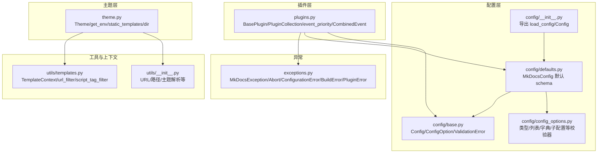
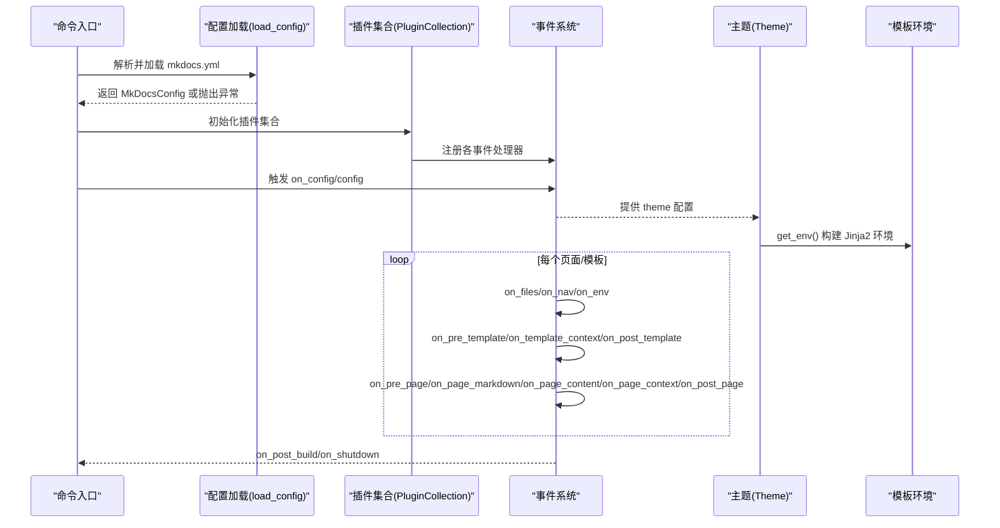
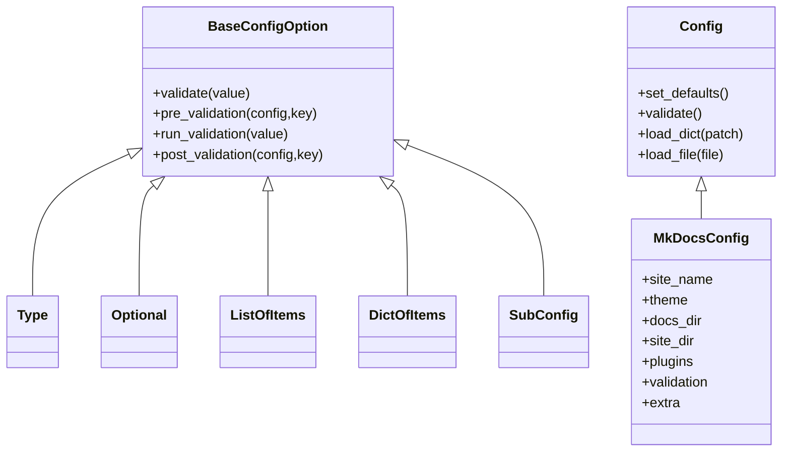
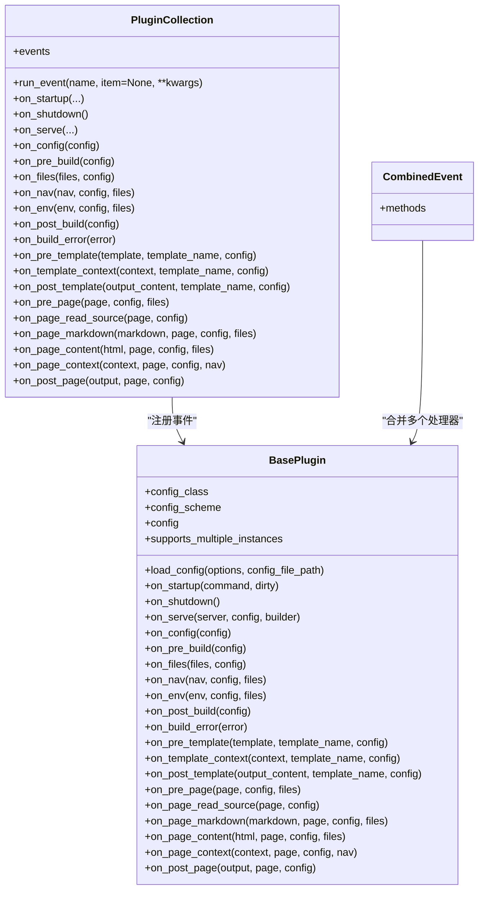
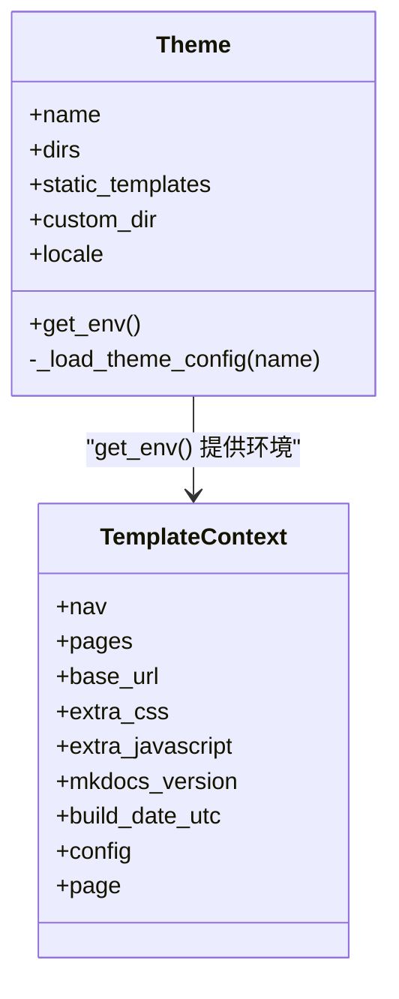
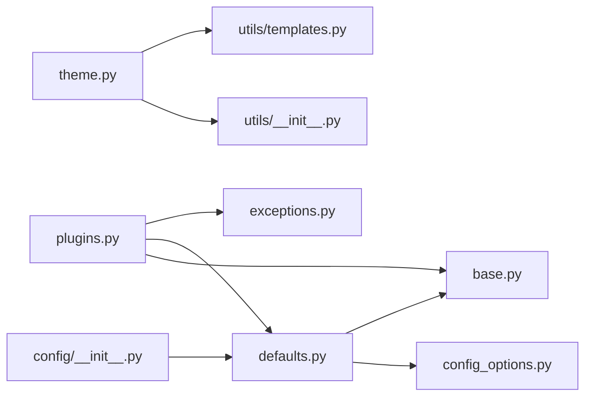

# API 参考

<cite>
**本文引用的文件**
- [mkdocs\__init__.py](file://mkdocs/__init__.py)
- [mkdocs\config\__init__.py](file://mkdocs/config/__init__.py)
- [mkdocs\config\base.py](file://mkdocs/config/base.py)
- [mkdocs\config\defaults.py](file://mkdocs/config/defaults.py)
- [mkdocs\config\config_options.py](file://mkdocs/config/config_options.py)
- [mkdocs\plugins.py](file://mkdocs/plugins.py)
- [mkdocs\theme.py](file://mkdocs/theme.py)
- [mkdocs\utils\__init__.py](file://mkdocs/utils/__init__.py)
- [mkdocs\utils\templates.py](file://mkdocs/utils/templates.py)
- [mkdocs\exceptions.py](file://mkdocs/exceptions.py)
- [mkdocs\contrib\search\__init__.py](file://mkdocs/contrib/search/__init__.py)
- [docs\dev-guide\api.md](file://docs/dev-guide/api.md)
- [docs\dev-guide\plugins.md](file://docs/dev-guide/plugins.md)
- [docs\dev-guide\themes.md](file://docs/dev-guide/themes.md)
</cite>

## 目录
1. [简介](#简介)
2. [项目结构](#项目结构)
3. [核心组件](#核心组件)
4. [架构总览](#架构总览)
5. [详细组件分析](#详细组件分析)
6. [依赖关系分析](#依赖关系分析)
7. [性能考量](#性能考量)
8. [故障排查指南](#故障排查指南)
9. [结论](#结论)
10. [附录](#附录)

## 简介
本文件为 MkDocs 的 API 参考文档，聚焦于以下三类公共接口与规范：
- 配置 API：定义配置项、校验器、默认配置对象与加载流程。
- 插件 API：事件系统、事件优先级、组合事件、插件集合与运行机制。
- 主题 API：主题对象、模板环境、静态模板与本地化集成。

文档覆盖参数类型、返回值、异常处理、使用模式、版本兼容性与变更历史，并提供扩展 MkDocs 功能的最佳实践与注意事项。

## 项目结构
MkDocs 的核心 API 分布在如下模块中：
- 配置体系：mkdocs/config（基类、默认配置、配置选项）
- 插件体系：mkdocs/plugins（事件、优先级、组合事件、插件集合）
- 主题体系：mkdocs/theme（主题对象、模板环境）
- 工具与上下文：mkdocs/utils（相对 URL、模板上下文等）
- 异常体系：mkdocs/exceptions（统一异常基类与子类）

图表来源
- [mkdocs\config\__init__.py](file://mkdocs/config/__init__.py#L1-L4)
- [mkdocs\config\base.py](file://mkdocs/config/base.py#L123-L243)
- [mkdocs\config\defaults.py](file://mkdocs/config/defaults.py#L38-L214)
- [mkdocs\config\config_options.py](file://mkdocs/config/config_options.py#L52-L123)
- [mkdocs\plugins.py](file://mkdocs/plugins.py#L58-L647)
- [mkdocs\theme.py](file://mkdocs/theme.py#L23-L167)
- [mkdocs\utils\__init__.py](file://mkdocs/utils/__init__.py#L256-L288)
- [mkdocs\utils\templates.py](file://mkdocs/utils/templates.py#L25-L56)
- [mkdocs\exceptions.py](file://mkdocs/exceptions.py#L6-L42)

章节来源
- [mkdocs\config\__init__.py](file://mkdocs/config/__init__.py#L1-L4)
- [mkdocs\config\base.py](file://mkdocs/config/base.py#L123-L243)
- [mkdocs\config\defaults.py](file://mkdocs/config/defaults.py#L38-L214)
- [mkdocs\config\config_options.py](file://mkdocs/config/config_options.py#L52-L123)
- [mkdocs\plugins.py](file://mkdocs/plugins.py#L58-L647)
- [mkdocs\theme.py](file://mkdocs/theme.py#L23-L167)
- [mkdocs\utils\__init__.py](file://mkdocs/utils/__init__.py#L256-L288)
- [mkdocs\utils\templates.py](file://mkdocs/utils/templates.py#L25-L56)
- [mkdocs\exceptions.py](file://mkdocs/exceptions.py#L6-L42)

## 核心组件
- 配置基类与校验器
  - Config：类型安全的配置容器，支持 schema 定义、预/后校验、默认填充、错误与警告收集。
  - BaseConfigOption：配置项基类，提供 validate/pre_validation/post_validation 生命周期钩子。
  - 配置选项：Type/Choice/List/Dict/SubConfig/Optional/Deprecated 等。
  - 加载流程：load_config -> load_file/load_dict -> validate -> 日志输出与异常处理。
- 插件系统
  - BasePlugin：插件基类，定义事件方法与配置方案；支持泛型约束 config_class。
  - PluginCollection：插件集合，注册事件、按优先级排序、顺序执行 run_event。
  - 事件优先级：event_priority 装饰器；CombinedEvent 支持同一事件多处理器与不同优先级。
  - 生命周期：startup/shutdown/serve/config/files/nav/env/post_build/build_error/template/page 等。
- 主题系统
  - Theme：主题对象，合并自定义目录、主题目录、MkDocs 内置模板，支持静态模板、locale 与过滤器。
  - get_env：构建 Jinja2 环境，安装 url/script 过滤器与翻译。
- 模板上下文
  - TemplateContext：全局模板上下文键集合，包含导航、页面、站点配置、构建时间等。
- 工具与异常
  - utils：相对 URL 规范化、主题解析、重复日志过滤、计数处理器等。
  - exceptions：统一异常体系，用户友好提示与严格模式中断。

章节来源
- [mkdocs\config\base.py](file://mkdocs/config/base.py#L123-L243)
- [mkdocs\config\config_options.py](file://mkdocs/config/config_options.py#L52-L123)
- [mkdocs\plugins.py](file://mkdocs/plugins.py#L58-L647)
- [mkdocs\theme.py](file://mkdocs/theme.py#L23-L167)
- [mkdocs\utils\templates.py](file://mkdocs/utils/templates.py#L25-L56)
- [mkdocs\utils\__init__.py](file://mkdocs/utils/__init__.py#L256-L288)
- [mkdocs\exceptions.py](file://mkdocs/exceptions.py#L6-L42)

## 架构总览
下图展示了从配置加载到插件事件、再到主题渲染的整体流程。

图表来源
- [mkdocs\config\base.py](file://mkdocs/config/base.py#L340-L392)
- [mkdocs\plugins.py](file://mkdocs/plugins.py#L575-L646)
- [mkdocs\theme.py](file://mkdocs/theme.py#L158-L167)

## 详细组件分析

### 配置 API
- 配置基类与生命周期
  - Config：定义 schema（_schema）、默认填充（set_defaults）、分阶段验证（pre_validate/validate/post_validate）、加载补丁（load_dict）与文件（load_file）。
  - BaseConfigOption：提供属性访问、默认值复制保护、warnings 收集与三段式验证流程。
  - 验证错误：ValidationError；严格模式与警告汇总；加载失败时抛出 Abort。
- 配置选项
  - Type/Optional/Choice/ListOfItems/DictOfItems/SubConfig/Deprecated 等，覆盖常见数据结构与迁移策略。
  - 示例路径：[类型校验](file://mkdocs/config/config_options.py#L323-L355)，[可选包装](file://mkdocs/config/config_options.py#L529-L567)，[子配置](file://mkdocs/config/config_options.py#L52-L123)。
- 默认配置
  - MkDocsConfig：集中定义站点名、导航、URL、主题、目录、插件、验证级别、Markdown 扩展、额外资源等。
  - 示例路径：[MkDocsConfig 字段](file://mkdocs/config/defaults.py#L44-L160)。

图表来源
- [mkdocs\config\base.py](file://mkdocs/config/base.py#L37-L107)
- [mkdocs\config\config_options.py](file://mkdocs/config/config_options.py#L52-L123)
- [mkdocs\config\defaults.py](file://mkdocs/config/defaults.py#L38-L160)

章节来源
- [mkdocs\config\base.py](file://mkdocs/config/base.py#L123-L243)
- [mkdocs\config\config_options.py](file://mkdocs/config/config_options.py#L52-L123)
- [mkdocs\config\defaults.py](file://mkdocs/config/defaults.py#L38-L160)

### 插件 API
- 基类与事件
  - BasePlugin：定义事件方法（startup/shutdown/serve/config/pre_build/files/nav/env/post_build/build_error/template/page 等），支持泛型约束 config_class。
  - 事件签名：多数事件接收“被处理对象”作为位置参数与“上下文关键字参数”，返回修改后的对象或 None（表示不改变）。
- 插件集合与事件调度
  - PluginCollection：注册事件、维护事件列表、按优先级排序、run_event 顺序调用并传递当前插件名。
  - 多实例支持：supports_multiple_instances 控制是否允许同插件多次添加。
- 事件优先级与组合事件
  - event_priority：装饰器设置优先级（推荐值：100/50/0/-50/-100）。
  - CombinedEvent：将多个子方法合并为同一事件名，便于在同一事件上声明不同优先级的处理器。
- 日志与异常
  - get_plugin_logger：返回带插件包名前缀的日志器。
  - 异常：MkDocsException/Abort/ConfigurationError/BuildError/PluginError；严格模式下警告也会导致中断。

图表来源
- [mkdocs\plugins.py](file://mkdocs/plugins.py#L58-L647)

章节来源
- [mkdocs\plugins.py](file://mkdocs/plugins.py#L58-L647)
- [docs\dev-guide\plugins.md](file://docs/dev-guide/plugins.md#L247-L441)

### 主题 API
- Theme 对象
  - 构造：name/custom_dir/static_templates/locale/user_config；合并 dirs（自定义/主题/MkDocs 内置）；加载 mkdocs_theme.yml 并递归继承父主题；校验 locale 并安装翻译。
  - 属性：dirs、static_templates、name、custom_dir、locale（只读）。
  - 方法：get_env() 构建 Jinja2 环境，注册 url/script 过滤器与翻译。
- 模板上下文
  - TemplateContext：包含 nav/pages/base_url/extra_css/extra_javascript/mkdocs_version/build_date_utc/config/page。
  - 过滤器：url_filter/script_tag_filter。
- 工具函数
  - get_theme_dir/get_themes：解析已安装主题；冲突检测与警告。
  - normalize_url/get_relative_url：相对 URL 规范化与计算。

图表来源
- [mkdocs\theme.py](file://mkdocs/theme.py#L23-L167)
- [mkdocs\utils\templates.py](file://mkdocs/utils/templates.py#L25-L56)

章节来源
- [mkdocs\theme.py](file://mkdocs/theme.py#L23-L167)
- [mkdocs\utils\templates.py](file://mkdocs/utils/templates.py#L25-L56)
- [mkdocs\utils\__init__.py](file://mkdocs/utils/__init__.py#L256-L288)

### 搜索插件（示例：扩展主题能力）
- 配置项
  - lang：语言列表，自动回退与替换；separator/min_search_length/indexing/prebuild_index 等。
- 生命周期
  - on_config：根据主题配置决定是否包含搜索页与脚本；推断默认语言。
  - on_pre_build：初始化 SearchIndex。
  - on_page_context：向索引添加条目。
  - on_post_build：生成 search_index.json 并复制所需语言文件。
- 与主题协作
  - include_search_page：是否生成独立搜索页。
  - search_index_only：仅生成索引，由主题自行实现前端。

章节来源
- [mkdocs\contrib\search\__init__.py](file://mkdocs/contrib/search/__init__.py#L23-L121)
- [docs\dev-guide\themes.md](file://docs/dev-guide/themes.md#L744-L796)

## 依赖关系分析
- 配置层
  - defaults.py 依赖 config_options.py 的类型与复合校验器；base.py 提供 Config/ConfigOption 基础。
  - config/__init__.py 导出 load_config/Config，供外部使用。
- 插件层
  - plugins.py 依赖 config/base.py（Config/ConfigErrors/ConfigWarnings/LegacyConfig/PlainConfigSchema）与 defaults.py（MkDocsConfig）。
  - 通过 entry_points 发现插件，支持覆盖内置插件。
- 主题层
  - theme.py 依赖 utils（get_theme_dir/get_themes）、localization、jinja2/yaml；get_env 注入过滤器与翻译。
- 工具与上下文
  - utils/templates.py 依赖 utils（normalize_url）与 config.defaults（MkDocsConfig）。
- 异常
  - plugins.py/exceptions.py 共同定义统一异常体系，严格模式下中断。

图表来源
- [mkdocs\config\__init__.py](file://mkdocs/config/__init__.py#L1-L4)
- [mkdocs\config\defaults.py](file://mkdocs/config/defaults.py#L38-L160)
- [mkdocs\config\config_options.py](file://mkdocs/config/config_options.py#L52-L123)
- [mkdocs\plugins.py](file://mkdocs/plugins.py#L17-L26)
- [mkdocs\theme.py](file://mkdocs/theme.py#L16-L18)
- [mkdocs\utils\__init__.py](file://mkdocs/utils/__init__.py#L256-L288)
- [mkdocs\utils\templates.py](file://mkdocs/utils/templates.py#L15-L23)
- [mkdocs\exceptions.py](file://mkdocs/exceptions.py#L6-L42)

章节来源
- [mkdocs\config\__init__.py](file://mkdocs/config/__init__.py#L1-L4)
- [mkdocs\config\defaults.py](file://mkdocs/config/defaults.py#L38-L160)
- [mkdocs\config\config_options.py](file://mkdocs/config/config_options.py#L52-L123)
- [mkdocs\plugins.py](file://mkdocs/plugins.py#L17-L26)
- [mkdocs\theme.py](file://mkdocs/theme.py#L16-L18)
- [mkdocs\utils\__init__.py](file://mkdocs/utils/__init__.py#L256-L288)
- [mkdocs\utils\templates.py](file://mkdocs/utils/templates.py#L15-L23)
- [mkdocs\exceptions.py](file://mkdocs/exceptions.py#L6-L42)

## 性能考量
- 事件优先级与组合事件
  - 合理设置 event_priority，避免过多低优先级处理器造成链路冗长。
  - 使用 CombinedEvent 将同一事件拆分为多个处理器，减少重复注册与查找成本。
- 模板与主题
  - get_env 关闭自动重载（auto_reload=False），避免构建期间模板热更新带来的开销。
  - static_templates 仅包含必要模板，减少不必要的模板渲染。
- URL 规范化
  - normalize_url/get_relative_url 使用缓存与规范化逻辑，建议复用而非重复计算。
- 配置加载
  - load_dict/load_file 仅在必要时调用；严格模式下警告即停，有助于早期发现性能瓶颈。

## 故障排查指南
- 配置错误
  - ValidationError：检查字段类型、必填、取值范围与依赖关系。
  - strict 模式：任何警告都会导致构建中断，需修复配置问题。
  - 参考路径：[配置加载与错误处理](file://mkdocs/config/base.py#L340-L392)。
- 插件异常
  - MkDocsException/Abort/ConfigurationError/BuildError/PluginError：优先抛出 PluginError 以获得用户友好的提示。
  - on_build_error：用于清理资源与收尾工作。
  - 参考路径：[异常体系](file://mkdocs/exceptions.py#L6-L42)。
- 主题冲突
  - get_themes：当同一名称由多个包提供时发出警告；builtin 与第三方冲突时以第三方为准。
  - 参考路径：[主题解析](file://mkdocs/utils/__init__.py#L262-L287)。
- 搜索插件
  - include_search_page 与 search_index_only：根据主题需求选择合适模式。
  - 参考路径：[搜索插件配置与行为](file://mkdocs/contrib/search/__init__.py#L62-L121)。

章节来源
- [mkdocs\config\base.py](file://mkdocs/config/base.py#L340-L392)
- [mkdocs\exceptions.py](file://mkdocs/exceptions.py#L6-L42)
- [mkdocs\utils\__init__.py](file://mkdocs/utils/__init__.py#L262-L287)
- [mkdocs\contrib\search\__init__.py](file://mkdocs/contrib/search/__init__.py#L62-L121)

## 结论
MkDocs 的 API 以“配置 schema + 插件事件 + 主题模板”为核心，形成清晰的扩展点与稳定的生命周期。通过类型安全的配置选项、灵活的事件优先级与组合事件、以及可定制的主题环境，开发者可以可靠地扩展站点功能、优化构建性能并提升用户体验。遵循严格模式与统一异常处理，有助于在开发与生产环境中保持一致性与稳定性。

## 附录
- 版本与兼容性
  - 版本号：参见 [__version__](file://mkdocs/__init__.py#L5-L6)。
  - 新特性与弃用：参考插件与主题文档中的“新特性/变更/弃用”标注。
- 最佳实践
  - 配置：优先使用类型安全的 Config 子类定义 schema；合理使用 SubConfig/ListOfItems/DictOfItems 组合复杂结构。
  - 插件：为事件设置明确优先级；使用 CombinedEvent 管理多处理器；通过 get_plugin_logger 输出一致日志。
  - 主题：利用 get_env 注入过滤器与翻译；仅包含必要的 static_templates；遵循 URL 规范化。
- 使用模式
  - 配置加载：使用 load_config 一次性完成文件加载、补丁覆盖与验证。
  - 插件事件：在 on_config 中修改全局配置，在 on_page_* 中处理页面内容。
  - 主题渲染：在 on_env 中调整模板环境，在 on_post_template/on_post_page 中修改输出。