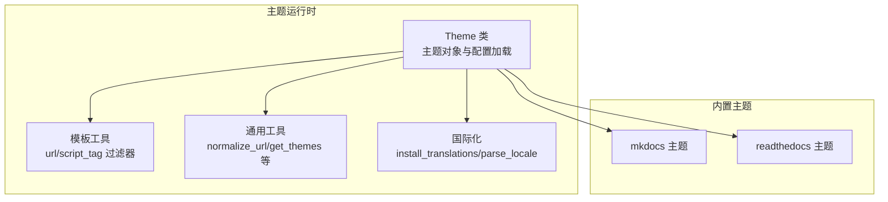
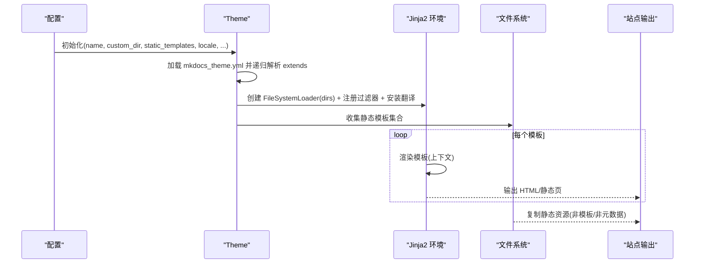
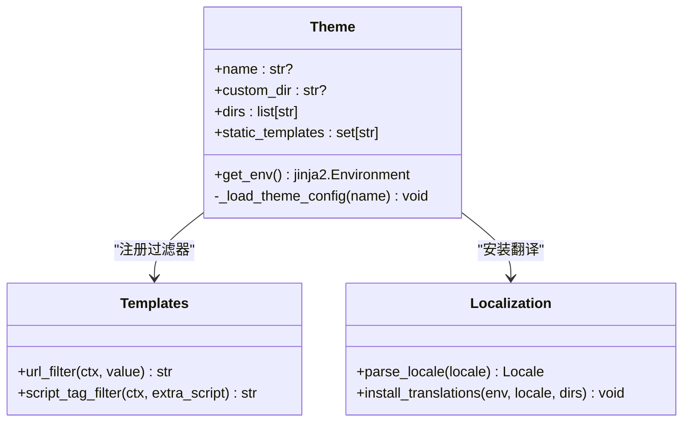
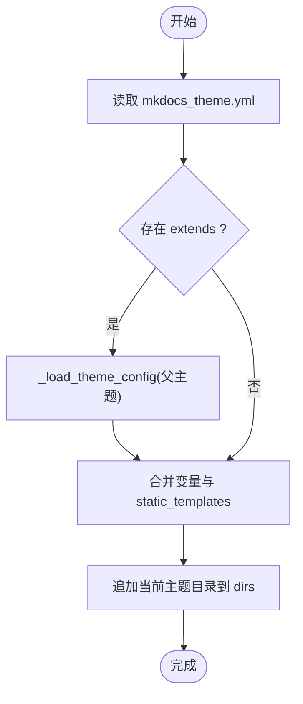
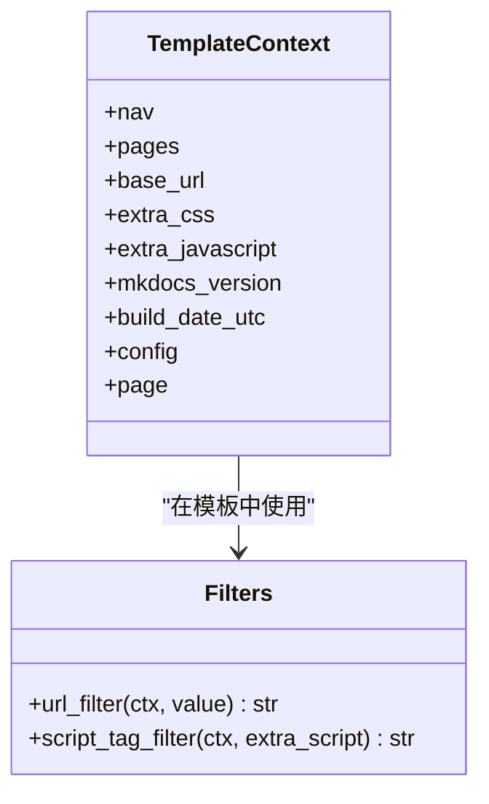
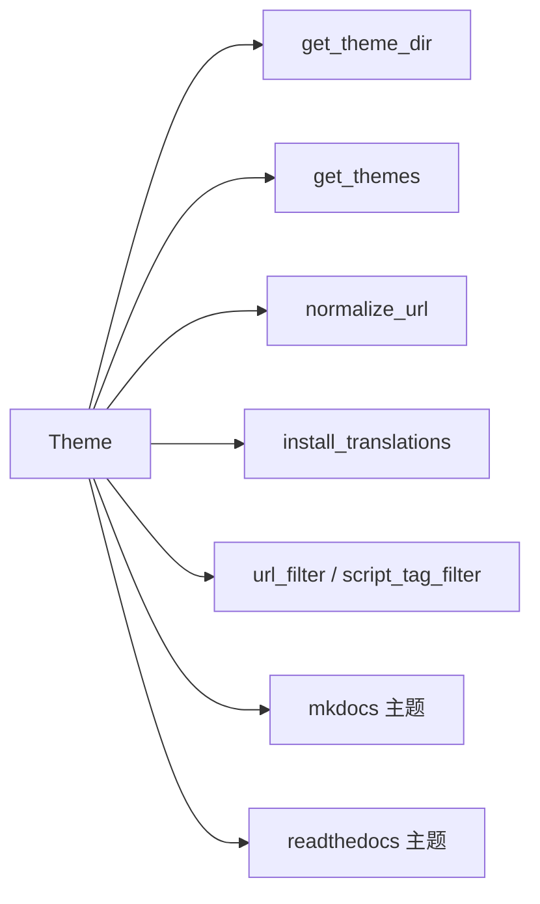

# 主题 API

<cite>
**本文引用的文件**
- [mkdocs/theme.py](file://mkdocs/theme.py)
- [mkdocs/utils/templates.py](file://mkdocs/utils/templates.py)
- [mkdocs/utils/filters.py](file://mkdocs/utils/filters.py)
- [mkdocs/utils/__init__.py](file://mkdocs/utils/__init__.py)
- [mkdocs/localization.py](file://mkdocs/localization.py)
- [mkdocs/themes/mkdocs/mkdocs_theme.yml](file://mkdocs/themes/mkdocs/mkdocs_theme.yml)
- [mkdocs/themes/readthedocs/mkdocs_theme.yml](file://mkdocs/themes/readthedocs/mkdocs_theme.yml)
- [mkdocs/themes/mkdocs/base.html](file://mkdocs/themes/mkdocs/base.html)
- [mkdocs/themes/readthedocs/base.html](file://mkdocs/themes/readthedocs/base.html)
- [docs/dev-guide/themes.md](file://docs/dev-guide/themes.md)
- [docs/user-guide/customizing-your-theme.md](file://docs/user-guide/customizing-your-theme.md)
- [mkdocs/tests/config/config_options_tests.py](file://mkdocs/tests/config/config_options_tests.py)
- [mkdocs/tests/config/config_options_legacy_tests.py](file://mkdocs/tests/config/config_options_legacy_tests.py)
</cite>

## 目录
1. [简介](#简介)
2. [项目结构](#项目结构)
3. [核心组件](#核心组件)
4. [架构总览](#架构总览)
5. [组件详解](#组件详解)
6. [依赖关系分析](#依赖关系分析)
7. [性能考量](#性能考量)
8. [故障排查指南](#故障排查指南)
9. [结论](#结论)
10. [附录](#附录)

## 简介
本文件系统化梳理 MkDocs 主题系统的 API 与实现，覆盖主题架构、模板继承机制、静态资源与静态页面处理、主题配置文件格式、模板变量与过滤器、国际化与本地化、响应式与可访问性支持等。面向主题开发者与高级用户，提供从概念到代码级实现的完整参考。

## 项目结构
围绕主题系统的关键目录与文件：
- 主题运行时与配置：mkdocs/theme.py、mkdocs/utils/templates.py、mkdocs/utils/__init__.py、mkdocs/localization.py
- 内置主题示例：mkdocs/themes/mkdocs/*、mkdocs/themes/readthedocs/*
- 文档与用法：docs/dev-guide/themes.md、docs/user-guide/customizing-your-theme.md
- 测试与契约：mkdocs/tests/config/config_options_tests.py、mkdocs/tests/config/config_options_legacy_tests.py

**图示来源**
- [mkdocs/theme.py](file://mkdocs/theme.py#L23-L167)
- [mkdocs/utils/templates.py](file://mkdocs/utils/templates.py#L25-L56)
- [mkdocs/utils/__init__.py](file://mkdocs/utils/__init__.py#L256-L293)
- [mkdocs/localization.py](file://mkdocs/localization.py#L45-L93)
- [mkdocs/themes/mkdocs/base.html](file://mkdocs/themes/mkdocs/base.html#L1-L252)
- [mkdocs/themes/readthedocs/base.html](file://mkdocs/themes/readthedocs/base.html#L1-L200)

**章节来源**
- [mkdocs/theme.py](file://mkdocs/theme.py#L23-L167)
- [mkdocs/utils/templates.py](file://mkdocs/utils/templates.py#L25-L56)
- [mkdocs/utils/__init__.py](file://mkdocs/utils/__init__.py#L256-L293)
- [mkdocs/localization.py](file://mkdocs/localization.py#L45-L93)
- [mkdocs/themes/mkdocs/mkdocs_theme.yml](file://mkdocs/themes/mkdocs/mkdocs_theme.yml#L1-L29)
- [mkdocs/themes/readthedocs/mkdocs_theme.yml](file://mkdocs/themes/readthedocs/mkdocs_theme.yml#L1-L26)

## 核心组件
- 主题对象 Theme：负责主题配置加载、继承链解析、模板环境构建、静态模板集合管理、语言环境安装。
- 模板过滤器：提供 url 与 script_tag 两个核心过滤器，统一相对链接与脚本标签生成。
- 国际化：基于 Babel 的翻译合并与安装，支持 locales 目录下的多级主题翻译。
- 工具函数：主题发现与路径解析、URL 归一化、相对路径计算等。

**章节来源**
- [mkdocs/theme.py](file://mkdocs/theme.py#L23-L167)
- [mkdocs/utils/templates.py](file://mkdocs/utils/templates.py#L37-L56)
- [mkdocs/localization.py](file://mkdocs/localization.py#L45-L93)
- [mkdocs/utils/__init__.py](file://mkdocs/utils/__init__.py#L256-L293)

## 架构总览
主题系统以 Theme 为核心，通过以下流程工作：
- 解析主题配置（含继承）与静态模板列表
- 构建 Jinja2 Environment，注册过滤器与国际化
- 渲染模板，输出静态页面与静态模板
- 复制静态资源（非模板、非元数据文件）

**图示来源**
- [mkdocs/theme.py](file://mkdocs/theme.py#L124-L167)
- [mkdocs/utils/templates.py](file://mkdocs/utils/templates.py#L37-L56)
- [mkdocs/localization.py](file://mkdocs/localization.py#L45-L93)

**章节来源**
- [mkdocs/theme.py](file://mkdocs/theme.py#L124-L167)
- [mkdocs/utils/templates.py](file://mkdocs/utils/templates.py#L37-L56)
- [mkdocs/localization.py](file://mkdocs/localization.py#L45-L93)

## 组件详解

### 主题对象 Theme
- 职责
  - 解析主题配置文件 mkdocs_theme.yml，支持 extends 继承链
  - 合并用户配置与主题配置，优先级为用户配置覆盖主题配置
  - 维护模板搜索目录列表 dirs（按优先级排序）
  - 维护静态模板集合 static_templates（可叠加）
  - 构建 Jinja2 Environment，注册 url 与 script_tag 过滤器，并安装国际化翻译
- 关键属性与方法
  - name、custom_dir、dirs、static_templates
  - get_env() 返回已配置的 Jinja2 环境
  - _load_theme_config(name) 递归加载父主题与配置

**图示来源**
- [mkdocs/theme.py](file://mkdocs/theme.py#L23-L167)
- [mkdocs/utils/templates.py](file://mkdocs/utils/templates.py#L25-L56)
- [mkdocs/localization.py](file://mkdocs/localization.py#L38-L93)

**章节来源**
- [mkdocs/theme.py](file://mkdocs/theme.py#L23-L167)

### 主题配置文件格式与继承
- 配置文件：mkdocs_theme.yml
- 常见键
  - static_templates：默认静态模板集合（如 404.html）
  - locale：主题语言（用于 <html lang> 与翻译）
  - include_search_page、search_index_only：搜索插件集成选项
  - highlightjs 及 hljs_*：代码高亮配置
  - navigation_depth、nav_style、color_mode、user_color_mode_toggle：导航与外观
  - analytics：分析配置
  - shortcuts：键盘快捷键映射
- 继承：extends 指定父主题名称；Theme 递归加载父主题配置并合并

**图示来源**
- [mkdocs/theme.py](file://mkdocs/theme.py#L124-L157)
- [mkdocs/themes/mkdocs/mkdocs_theme.yml](file://mkdocs/themes/mkdocs/mkdocs_theme.yml#L1-L29)
- [mkdocs/themes/readthedocs/mkdocs_theme.yml](file://mkdocs/themes/readthedocs/mkdocs_theme.yml#L1-L26)

**章节来源**
- [mkdocs/theme.py](file://mkdocs/theme.py#L124-L157)
- [mkdocs/themes/mkdocs/mkdocs_theme.yml](file://mkdocs/themes/mkdocs/mkdocs_theme.yml#L1-L29)
- [mkdocs/themes/readthedocs/mkdocs_theme.yml](file://mkdocs/themes/readthedocs/mkdocs_theme.yml#L1-L26)

### 模板变量与过滤器
- 模板变量（全局上下文）
  - config：来自 mkdocs.yml 的配置对象
  - nav：导航树（Section/Page/Link）
  - pages：全部页面文件列表
  - base_url：项目根相对路径
  - extra_css / extra_javascript：额外样式与脚本
  - mkdocs_version、build_date_utc：构建信息
  - page：当前页面对象（可能为 None）
- 过滤器
  - url：规范化 URL（相对/绝对/带 base_url）
  - script_tag：将 extra_javascript 条目渲染为 <script> 标签（含 type/defer/async）
- 模板块（内置主题）
  - site_meta、htmltitle、styles、libs、scripts、analytics、extrahead
  - site_name、site_nav、search_button、next_prev、repo、content、footer

**图示来源**
- [mkdocs/utils/templates.py](file://mkdocs/utils/templates.py#L25-L56)
- [docs/dev-guide/themes.md](file://docs/dev-guide/themes.md#L219-L799)

**章节来源**
- [mkdocs/utils/templates.py](file://mkdocs/utils/templates.py#L25-L56)
- [docs/dev-guide/themes.md](file://docs/dev-guide/themes.md#L219-L799)

### 模板继承与静态模板
- 模板继承
  - 内置主题以 base.html 作为基模板，子模板通过 extends 继承
  - 自定义主题可通过 custom_dir 覆盖指定模板文件
- 静态模板
  - 默认由主题配置 static_templates 指定（如 404.html）
  - 用户可在配置中追加静态模板，但不能移除主题默认项
  - 静态模板不复制至 site_dir，而是作为模板渲染后输出

**章节来源**
- [docs/dev-guide/themes.md](file://docs/dev-guide/themes.md#L187-L195)
- [mkdocs/theme.py](file://mkdocs/theme.py#L49-L68)
- [mkdocs/tests/config/config_options_tests.py](file://mkdocs/tests/config/config_options_tests.py#L1158-L1178)
- [mkdocs/tests/config/config_options_legacy_tests.py](file://mkdocs/tests/config/config_options_legacy_tests.py#L942-L961)

### 静态资源管理与打包机制
- 复制策略
  - 非模板文件（非 .html、非 static_templates 列表中的文件）、非元数据文件、非点开头文件会被复制到 site_dir
  - 用户 docs_dir 中同名文件优先于主题文件
- URL 归一化
  - 使用 normalize_url 保证跨页面链接正确
- 相对路径计算
  - get_relative_url 计算相对路径，避免硬编码 base_url

**章节来源**
- [docs/dev-guide/themes.md](file://docs/dev-guide/themes.md#L178-L218)
- [mkdocs/utils/__init__.py](file://mkdocs/utils/__init__.py#L177-L240)

### 国际化与本地化
- 语言解析
  - parse_locale 将字符串解析为 Locale 对象
- 翻译安装
  - install_translations 在 Jinja2 环境中安装翻译，按主题目录顺序合并 locales
  - 若未找到对应语言，回退到英文并发出警告
- 模板内使用
  - 使用 trans/endtrans 包裹可翻译文本；<html> 标签 lang 属性可直接使用 config.theme.locale

**章节来源**
- [mkdocs/localization.py](file://mkdocs/localization.py#L38-L93)
- [mkdocs/theme.py](file://mkdocs/theme.py#L158-L166)
- [docs/dev-guide/themes.md](file://docs/dev-guide/themes.md#L936-L991)

### 响应式设计与可访问性
- 响应式
  - 内置主题使用 Bootstrap 媒体查询与栅格系统，适配移动端
  - base_url 与 url 过滤器确保资源在不同层级页面正确加载
- 可访问性
  - 导航与按钮使用语义化标签与 aria-* 属性
  - 搜索模态框与快捷键支持键盘操作

**章节来源**
- [mkdocs/themes/mkdocs/base.html](file://mkdocs/themes/mkdocs/base.html#L1-L252)
- [mkdocs/themes/readthedocs/base.html](file://mkdocs/themes/readthedocs/base.html#L1-L200)

### 搜索与分析集成
- 搜索
  - include_search_page 控制是否生成独立搜索页
  - search_index_only 控制是否仅生成索引或提供完整前端方案
- 分析
  - 支持 gtag/anonymize_ip 与传统 Google Analytics 配置
  - 内置脚本注入与 CDN 资源加载

**章节来源**
- [docs/dev-guide/themes.md](file://docs/dev-guide/themes.md#L691-L799)
- [mkdocs/themes/mkdocs/mkdocs_theme.yml](file://mkdocs/themes/mkdocs/mkdocs_theme.yml#L21-L29)
- [mkdocs/themes/readthedocs/mkdocs_theme.yml](file://mkdocs/themes/readthedocs/mkdocs_theme.yml#L15-L26)

### 自定义主题开发指南
- 最小化要求
  - 提供 main.html（或继承自 base.html），放置于 custom_dir
  - 在 mkdocs.yml 中设置 theme.name=null 且 theme.custom_dir 指向该目录
- 模板设计
  - 使用块（blocks）覆盖特定区域，保持与内置主题一致的块名
  - 使用 url 与 script_tag 过滤器生成链接与脚本标签
- 样式与脚本
  - 通过 extra_css/extra_javascript 注入样式与脚本
  - 如需第三方库，建议放入 custom_dir 并在模板中显式引入
- 模板覆盖
  - 在 custom_dir 中提供同名文件即可覆盖父主题模板
  - 使用 super() 扩展父模板块而不破坏原有内容

**章节来源**
- [docs/dev-guide/themes.md](file://docs/dev-guide/themes.md#L22-L121)
- [docs/user-guide/customizing-your-theme.md](file://docs/user-guide/customizing-your-theme.md#L47-L227)

## 依赖关系分析
- Theme 依赖
  - utils.get_theme_dir / get_themes：定位与枚举主题入口
  - utils.normalize_url：URL 归一化
  - localization.install_translations：国际化安装
  - utils.templates.url_filter / script_tag_filter：模板过滤器
- 内置主题
  - mkdocs 与 readthedocs 提供完整的 base.html 与静态资源目录
  - 二者均通过 mkdocs_theme.yml 定义主题行为与外观参数

**图示来源**
- [mkdocs/theme.py](file://mkdocs/theme.py#L124-L167)
- [mkdocs/utils/__init__.py](file://mkdocs/utils/__init__.py#L256-L293)
- [mkdocs/utils/templates.py](file://mkdocs/utils/templates.py#L37-L56)
- [mkdocs/localization.py](file://mkdocs/localization.py#L45-L93)

**章节来源**
- [mkdocs/theme.py](file://mkdocs/theme.py#L124-L167)
- [mkdocs/utils/__init__.py](file://mkdocs/utils/__init__.py#L256-L293)
- [mkdocs/utils/templates.py](file://mkdocs/utils/templates.py#L37-L56)
- [mkdocs/localization.py](file://mkdocs/localization.py#L45-L93)

## 性能考量
- 模板环境
  - Jinja2 禁用自动重载（auto_reload=False），避免构建期间频繁扫描模板
- URL 计算
  - 使用 LRU 缓存的 _get_norm_url 与 get_relative_url，减少重复计算
- 翻译合并
  - 按主题目录逆序遍历，尽早合并，避免重复加载

**章节来源**
- [mkdocs/theme.py](file://mkdocs/theme.py#L158-L166)
- [mkdocs/utils/__init__.py](file://mkdocs/utils/__init__.py#L169-L240)
- [mkdocs/localization.py](file://mkdocs/localization.py#L66-L93)

## 故障排查指南
- 主题未找到或配置缺失
  - 当主题缺少 mkdocs_theme.yml 或 extends 指向未安装主题时会抛出验证错误
- 语言无效
  - locale 解析失败会触发验证错误；若无翻译则回退英文并告警
- 静态模板未生效
  - 确认 static_templates 是否被正确追加；注意用户无法移除主题默认项
- 自定义目录与覆盖
  - 当 theme.name 为 null 时，custom_dir 必须提供完整主题；否则需指向已安装主题

**章节来源**
- [mkdocs/theme.py](file://mkdocs/theme.py#L130-L157)
- [mkdocs/localization.py](file://mkdocs/localization.py#L38-L64)
- [mkdocs/tests/config/config_options_tests.py](file://mkdocs/tests/config/config_options_tests.py#L1180-L1189)
- [mkdocs/tests/config/config_options_legacy_tests.py](file://mkdocs/tests/config/config_options_legacy_tests.py#L974-L983)

## 结论
MkDocs 主题系统以 Theme 为中心，结合 Jinja2 模板引擎、URL 归一化与国际化能力，提供了灵活而强大的主题扩展机制。通过配置文件与继承链，主题作者可以精确控制外观与功能；通过静态模板与静态资源复制策略，确保构建产物的一致性与可维护性。遵循本文档的 API 规范与最佳实践，可高效开发高质量主题并满足国际化、响应式与可访问性需求。

## 附录
- 主题配置键参考（节选）
  - static_templates、locale、include_search_page、search_index_only、highlightjs、hljs_*、navigation_depth、nav_style、color_mode、user_color_mode_toggle、analytics、shortcuts
- 模板块参考（内置主题）
  - site_meta、htmltitle、styles、libs、scripts、analytics、extrahead、site_name、site_nav、search_button、next_prev、repo、content、footer

**章节来源**
- [mkdocs/themes/mkdocs/mkdocs_theme.yml](file://mkdocs/themes/mkdocs/mkdocs_theme.yml#L1-L29)
- [mkdocs/themes/readthedocs/mkdocs_theme.yml](file://mkdocs/themes/readthedocs/mkdocs_theme.yml#L1-L26)
- [docs/user-guide/customizing-your-theme.md](file://docs/user-guide/customizing-your-theme.md#L130-L170)