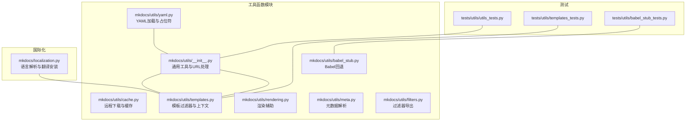
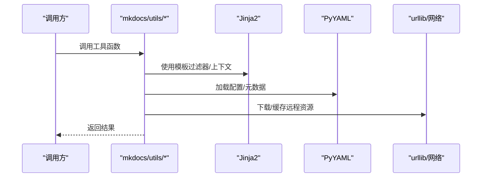
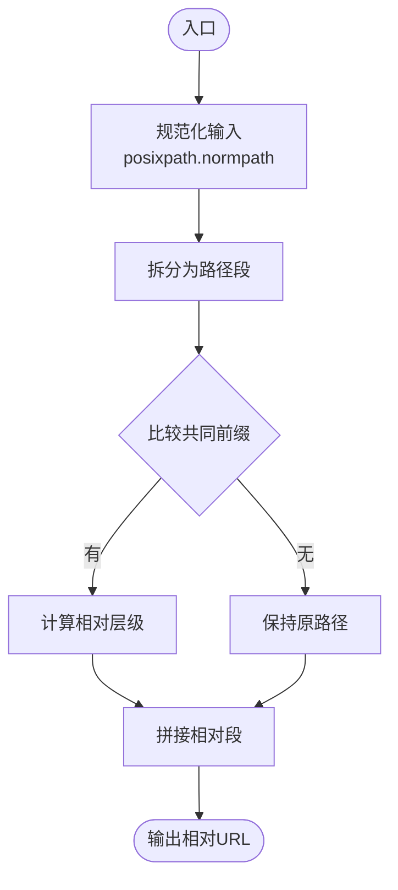
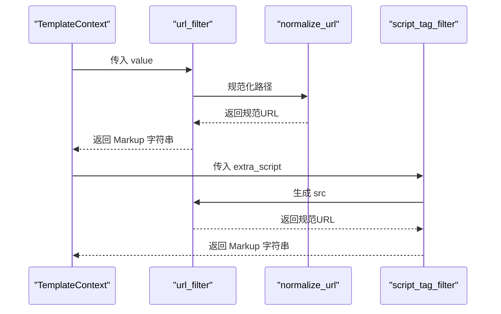
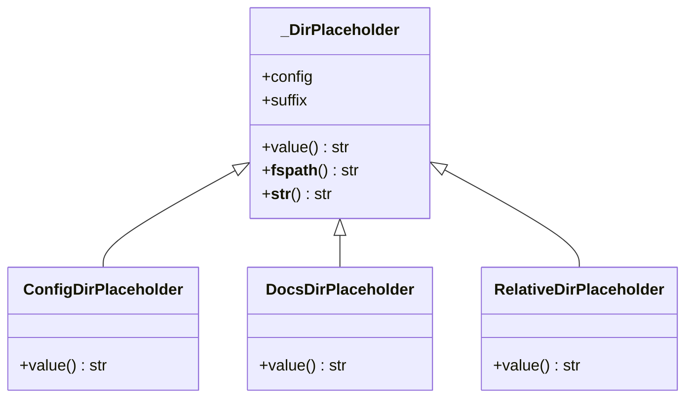
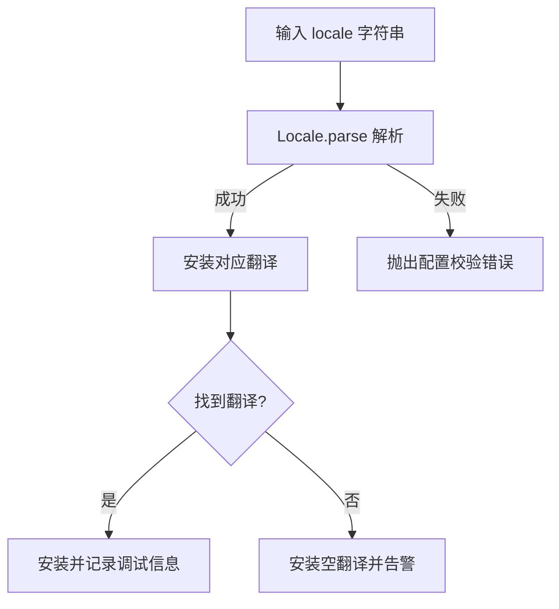
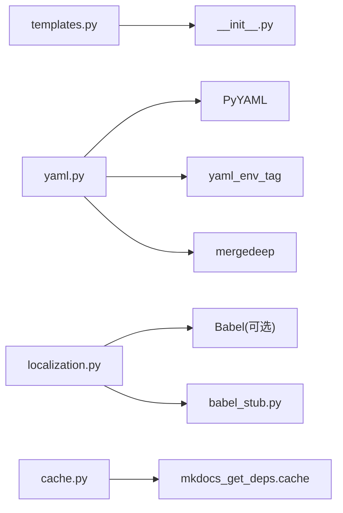

# 工具函数 API

<cite>
**本文引用的文件**
- [mkdocs/utils/__init__.py](file://mkdocs/utils/__init__.py)
- [mkdocs/utils/cache.py](file://mkdocs/utils/cache.py)
- [mkdocs/utils/templates.py](file://mkdocs/utils/templates.py)
- [mkdocs/utils/yaml.py](file://mkdocs/utils/yaml.py)
- [mkdocs/utils/rendering.py](file://mkdocs/utils/rendering.py)
- [mkdocs/utils/meta.py](file://mkdocs/utils/meta.py)
- [mkdocs/utils/filters.py](file://mkdocs/utils/filters.py)
- [mkdocs/utils/babel_stub.py](file://mkdocs/utils/babel_stub.py)
- [mkdocs/localization.py](file://mkdocs/localization.py)
- [mkdocs/tests/utils/utils_tests.py](file://mkdocs/tests/utils/utils_tests.py)
- [mkdocs/tests/utils/templates_tests.py](file://mkdocs/tests/utils/templates_tests.py)
- [mkdocs/tests/utils/babel_stub_tests.py](file://mkdocs/tests/utils/babel_stub_tests.py)
- [docs/dev-guide/translations.md](file://docs/dev-guide/translations.md)
</cite>

## 目录
1. [简介](#简介)
2. [项目结构](#项目结构)
3. [核心组件](#核心组件)
4. [架构总览](#架构总览)
5. [详细组件分析](#详细组件分析)
6. [依赖关系分析](#依赖关系分析)
7. [性能考量](#性能考量)
8. [故障排查指南](#故障排查指南)
9. [结论](#结论)
10. [附录](#附录)

## 简介
本文件为 MkDocs 工具函数的 API 参考与设计说明，覆盖以下类别：
- 模板过滤器：URL 规范化与脚本标签生成
- 字符串与路径处理：相对 URL 计算、路径规范化、列表去重与插入排序
- 文件操作：复制文件、写入二进制内容、清理目录
- YAML 处理：自定义加载器、环境变量注入、配置继承合并、目录占位符
- 国际化支持：语言解析、翻译安装与回退策略
- 缓存机制：远程资源下载与本地缓存
- 模板渲染辅助：标题文本提取、HTML 标签剥离、内联 HTML 渲染
- 日志与计数：重复日志过滤、消息计数

本参考以“可读性优先”的方式组织，既适合初学者理解，也便于开发者查阅具体实现细节。

## 项目结构
工具函数主要位于 mkdocs/utils 下，按功能分层组织；国际化与模板辅助位于独立模块中，并通过测试用例验证行为。

图表来源
- [mkdocs/utils/__init__.py](file://mkdocs/utils/__init__.py#L1-L411)
- [mkdocs/utils/cache.py](file://mkdocs/utils/cache.py#L1-L37)
- [mkdocs/utils/templates.py](file://mkdocs/utils/templates.py#L1-L56)
- [mkdocs/utils/yaml.py](file://mkdocs/utils/yaml.py#L1-L151)
- [mkdocs/utils/rendering.py](file://mkdocs/utils/rendering.py#L1-L105)
- [mkdocs/utils/meta.py](file://mkdocs/utils/meta.py#L1-L101)
- [mkdocs/utils/filters.py](file://mkdocs/utils/filters.py#L1-L2)
- [mkdocs/utils/babel_stub.py](file://mkdocs/utils/babel_stub.py#L1-L30)
- [mkdocs/localization.py](file://mkdocs/localization.py#L1-L93)
- [mkdocs/tests/utils/utils_tests.py](file://mkdocs/tests/utils/utils_tests.py#L1-L603)
- [mkdocs/tests/utils/templates_tests.py](file://mkdocs/tests/utils/templates_tests.py#L1-L50)
- [mkdocs/tests/utils/babel_stub_tests.py](file://mkdocs/tests/utils/babel_stub_tests.py#L1-L56)

章节来源
- [mkdocs/utils/__init__.py](file://mkdocs/utils/__init__.py#L1-L411)
- [mkdocs/utils/cache.py](file://mkdocs/utils/cache.py#L1-L37)
- [mkdocs/utils/templates.py](file://mkdocs/utils/templates.py#L1-L56)
- [mkdocs/utils/yaml.py](file://mkdocs/utils/yaml.py#L1-L151)
- [mkdocs/utils/rendering.py](file://mkdocs/utils/rendering.py#L1-L105)
- [mkdocs/utils/meta.py](file://mkdocs/utils/meta.py#L1-L101)
- [mkdocs/utils/filters.py](file://mkdocs/utils/filters.py#L1-L2)
- [mkdocs/utils/babel_stub.py](file://mkdocs/utils/babel_stub.py#L1-L30)
- [mkdocs/localization.py](file://mkdocs/localization.py#L1-L93)

## 核心组件
- URL 与路径处理：相对 URL 计算、路径规范化、主题查找、错误模板识别
- 文件系统：复制文件、写入二进制、清理目录、判断 Markdown 文件
- 列表与排序：去重、有序插入（兼容低版本）
- 模板过滤器：URL 规范化、脚本标签生成
- YAML：自定义加载器、环境变量注入、配置继承合并、目录占位符
- 渲染辅助：标题文本提取、HTML 剥离、内联渲染
- 元数据：MultiMarkdown/YAML 元数据解析
- 国际化：语言解析、翻译安装、回退策略
- 缓存：远程资源下载与缓存
- 日志：重复过滤、消息计数

章节来源
- [mkdocs/utils/__init__.py](file://mkdocs/utils/__init__.py#L47-L287)
- [mkdocs/utils/templates.py](file://mkdocs/utils/templates.py#L25-L56)
- [mkdocs/utils/yaml.py](file://mkdocs/utils/yaml.py#L109-L151)
- [mkdocs/utils/rendering.py](file://mkdocs/utils/rendering.py#L22-L105)
- [mkdocs/utils/meta.py](file://mkdocs/utils/meta.py#L56-L101)
- [mkdocs/localization.py](file://mkdocs/localization.py#L38-L93)
- [mkdocs/utils/cache.py](file://mkdocs/utils/cache.py#L10-L37)

## 架构总览
工具函数围绕“无站点结构知识”的通用能力构建，避免耦合到页面或站点布局，确保在不同上下文中复用。

图表来源
- [mkdocs/utils/templates.py](file://mkdocs/utils/templates.py#L37-L55)
- [mkdocs/utils/yaml.py](file://mkdocs/utils/yaml.py#L109-L151)
- [mkdocs/utils/cache.py](file://mkdocs/utils/cache.py#L10-L37)

## 详细组件分析

### URL 与路径处理
- get_relative_url(url, other)：基于 posixpath 的相对路径计算，支持斜杠分隔、规范化、向上跳转限制
- normalize_url(path, page=None, base='')：将路径转换为相对于页面或 base 的 URL，保留查询与片段
- get_build_datetime()/get_build_date()：支持 SOURCE_DATE_EPOCH 的可重现构建时间
- get_build_timestamp(pages=None)：基于最新页面更新时间的构建时间戳
- is_markdown_file(path)：判断是否为 Markdown 扩展名
- is_error_template(path)：判断是否为 HTTP 错误模板
- get_theme_dir(name)/get_themes()/get_theme_names()：通过 entry_points 发现主题，内置冲突检测与警告
- dirname_to_title(dirname)：目录名转标题（下划线/连字符替换、大小写处理）
- nest_paths(paths)：将路径列表嵌套为页面配置结构
- find_or_create_node(branch, key)：在嵌套结构中查找或创建节点

图表来源
- [mkdocs/utils/__init__.py](file://mkdocs/utils/__init__.py#L177-L203)
- [mkdocs/utils/__init__.py](file://mkdocs/utils/__init__.py#L205-L240)

章节来源
- [mkdocs/utils/__init__.py](file://mkdocs/utils/__init__.py#L47-L287)
- [mkdocs/tests/utils/utils_tests.py](file://mkdocs/tests/utils/utils_tests.py#L53-L112)

### 文件操作
- copy_file(source_path, output_path)：确保父目录存在，自动追加源文件名到目录输出
- write_file(content, output_path)：写入二进制内容，自动创建目录
- clean_directory(directory)：递归清理非隐藏条目，保留目录本身

章节来源
- [mkdocs/utils/__init__.py](file://mkdocs/utils/__init__.py#L113-L150)
- [mkdocs/tests/utils/utils_tests.py](file://mkdocs/tests/utils/utils_tests.py#L303-L363)

### 列表与排序
- reduce_list(data_set)：保持顺序的去重
- insort(a, x, key=lambda v:v)：有序插入（兼容低版本）

章节来源
- [mkdocs/utils/__init__.py](file://mkdocs/utils/__init__.py#L96-L111)
- [mkdocs/tests/utils/utils_tests.py](file://mkdocs/tests/utils/utils_tests.py#L184-L205)

### 模板过滤器与脚本标签
- url_filter(context, value)：基于 TemplateContext 中的 page/base_url 规范化 URL
- script_tag_filter(context, extra_script)：根据 ExtraScriptValue 生成 <script> 标签，支持 type、defer、async

图表来源
- [mkdocs/utils/templates.py](file://mkdocs/utils/templates.py#L25-L56)
- [mkdocs/tests/utils/templates_tests.py](file://mkdocs/tests/utils/templates_tests.py#L11-L49)

章节来源
- [mkdocs/utils/templates.py](file://mkdocs/utils/templates.py#L25-L56)
- [mkdocs/utils/filters.py](file://mkdocs/utils/filters.py#L1-L2)
- [mkdocs/tests/utils/templates_tests.py](file://mkdocs/tests/utils/templates_tests.py#L1-L50)

### YAML 处理
- get_yaml_loader(loader, config)：扩展加载器，添加 !ENV 与 !relative 占位符
- yaml_load(source, loader)：加载 YAML，支持 INHERIT 继承与深度合并
- 目录占位符：
  - ConfigDirPlaceholder：配置目录
  - DocsDirPlaceholder：docs 目录
  - RelativeDirPlaceholder：当前 Markdown 文件所在目录（需在渲染上下文中）

图表来源
- [mkdocs/utils/yaml.py](file://mkdocs/utils/yaml.py#L42-L107)

章节来源
- [mkdocs/utils/yaml.py](file://mkdocs/utils/yaml.py#L109-L151)
- [mkdocs/tests/utils/utils_tests.py](file://mkdocs/tests/utils/utils_tests.py#L274-L300)

### 渲染辅助
- get_heading_text(el, md)：提取标题纯文本（移除锚点、脚注、alt 文本）
- _strip_tags(text)：剥离 HTML 标签与注释，保留实体
- _render_inner_html(el, md)：序列化并后处理内联 HTML
- _remove_anchorlink/_remove_fnrefs/_extract_alt_texts：元素级处理
- _replace_elements_with_text：就地替换并携带尾随文本

章节来源
- [mkdocs/utils/rendering.py](file://mkdocs/utils/rendering.py#L22-L105)

### 元数据解析
- get_data(doc)：支持 YAML 与 MultiMarkdown 两种格式，返回正文与键值对

章节来源
- [mkdocs/utils/meta.py](file://mkdocs/utils/meta.py#L56-L101)

### 国际化支持
- parse_locale(locale)：解析语言标识，异常包装为配置校验错误
- install_translations(env, locale, theme_dirs)：安装翻译或空翻译，缺失时记录警告
- _get_merged_translations：按主题目录合并翻译
- babel_stub.Locale/UnknownLocaleError：无 Babel 时的回退实现

图表来源
- [mkdocs/localization.py](file://mkdocs/localization.py#L38-L93)
- [mkdocs/utils/babel_stub.py](file://mkdocs/utils/babel_stub.py#L11-L30)

章节来源
- [mkdocs/localization.py](file://mkdocs/localization.py#L1-L93)
- [mkdocs/utils/babel_stub.py](file://mkdocs/utils/babel_stub.py#L1-L30)
- [mkdocs/tests/utils/babel_stub_tests.py](file://mkdocs/tests/utils/babel_stub_tests.py#L1-L56)
- [docs/dev-guide/translations.md](file://docs/dev-guide/translations.md#L1-L36)

### 缓存机制
- download_url(url)：带 User-Agent 的远程下载
- download_and_cache_url(url, cache_duration, download, comment)：统一缓存接口，持久化于用户缓存目录

章节来源
- [mkdocs/utils/cache.py](file://mkdocs/utils/cache.py#L10-L37)

### 日志与计数
- DuplicateFilter：去重日志记录
- CountHandler：按级别统计日志数量

章节来源
- [mkdocs/utils/__init__.py](file://mkdocs/utils/__init__.py#L358-L411)
- [mkdocs/tests/utils/utils_tests.py](file://mkdocs/tests/utils/utils_tests.py#L536-L598)

## 依赖关系分析
- 模板过滤器依赖 normalize_url，后者依赖 posixpath 与 urlsplit
- YAML 加载器依赖 PyYAML 与 yaml_env_tag，配置继承依赖 mergedeep
- 国际化依赖 Babel（可选），无 Babel 时使用 babel_stub 回退
- 缓存依赖外部包 mkdocs_get_deps.cache

图表来源
- [mkdocs/utils/templates.py](file://mkdocs/utils/templates.py#L15-L16)
- [mkdocs/utils/yaml.py](file://mkdocs/utils/yaml.py#L9-L12)
- [mkdocs/localization.py](file://mkdocs/localization.py#L14-L22)
- [mkdocs/utils/cache.py](file://mkdocs/utils/cache.py#L5-L6)

章节来源
- [mkdocs/utils/templates.py](file://mkdocs/utils/templates.py#L1-L56)
- [mkdocs/utils/yaml.py](file://mkdocs/utils/yaml.py#L1-L151)
- [mkdocs/localization.py](file://mkdocs/localization.py#L1-L93)
- [mkdocs/utils/cache.py](file://mkdocs/utils/cache.py#L1-L37)

## 性能考量
- 缓存与 LRU：normalize_url 与 _get_norm_url、_norm_parts 使用 LRU 缓存，显著降低重复计算成本
- 低开销路径处理：posixpath 与字符串操作为主，避免额外依赖
- YAML 合并：使用 mergedeep 进行深度合并，减少配置解析复杂度
- 渲染辅助：仅在需要时进行树处理与正则剥离，避免不必要的 DOM 遍历
- 日志计数：CountHandler 在高并发日志场景下提供 O(1) 统计

章节来源
- [mkdocs/utils/__init__.py](file://mkdocs/utils/__init__.py#L169-L175)
- [mkdocs/utils/__init__.py](file://mkdocs/utils/__init__.py#L219-L240)
- [mkdocs/utils/yaml.py](file://mkdocs/utils/yaml.py#L149-L151)

## 故障排查指南
- URL 规范化警告：Windows 路径分隔符会被警告并转换为斜杠
  - 参考：[mkdocs/utils/__init__.py](file://mkdocs/utils/__init__.py#L224-L228)
- 主题名称冲突：同一名称由多个包提供时，会发出警告并使用靠后的包
  - 参考：[mkdocs/utils/__init__.py](file://mkdocs/utils/__init__.py#L280-L283)
- 内置主题重名：builtin 与外部包同名会触发配置错误
  - 参考：[mkdocs/utils/__init__.py](file://mkdocs/utils/__init__.py#L273-L276)
- YAML 继承文件不存在：抛出配置错误
  - 参考：[mkdocs/utils/yaml.py](file://mkdocs/utils/yaml.py#L142-L145)
- 语言解析失败：Invalid locale 抛出配置校验错误
  - 参考：[mkdocs/localization.py](file://mkdocs/localization.py#L41-L42)
- 未找到翻译：默认回退至英文并记录警告
  - 参考：[mkdocs/localization.py](file://mkdocs/localization.py#L55-L59)

章节来源
- [mkdocs/tests/utils/utils_tests.py](file://mkdocs/tests/utils/utils_tests.py#L178-L183)
- [mkdocs/tests/utils/utils_tests.py](file://mkdocs/tests/utils/utils_tests.py#L505-L513)
- [mkdocs/tests/utils/utils_tests.py](file://mkdocs/tests/utils/utils_tests.py#L296-L299)
- [mkdocs/tests/utils/utils_tests.py](file://mkdocs/tests/utils/utils_tests.py#L53-L112)
- [mkdocs/tests/utils/babel_stub_tests.py](file://mkdocs/tests/utils/babel_stub_tests.py#L37-L56)
- [mkdocs/tests/utils/templates_tests.py](file://mkdocs/tests/utils/templates_tests.py#L1-L50)

## 结论
MkDocs 工具函数以“通用、稳定、可扩展”为目标，通过明确的职责划分与完善的测试覆盖，为模板渲染、配置解析、国际化与缓存提供了可靠的基础能力。建议在扩展新工具函数时遵循现有模式：保持无站点结构依赖、提供清晰的参数与返回值、使用缓存优化热点路径、完善异常与日志。

## 附录
- 使用示例与行为验证可参考各模块测试文件中的断言与场景
- 国际化指南与主题本地化流程请参阅开发文档