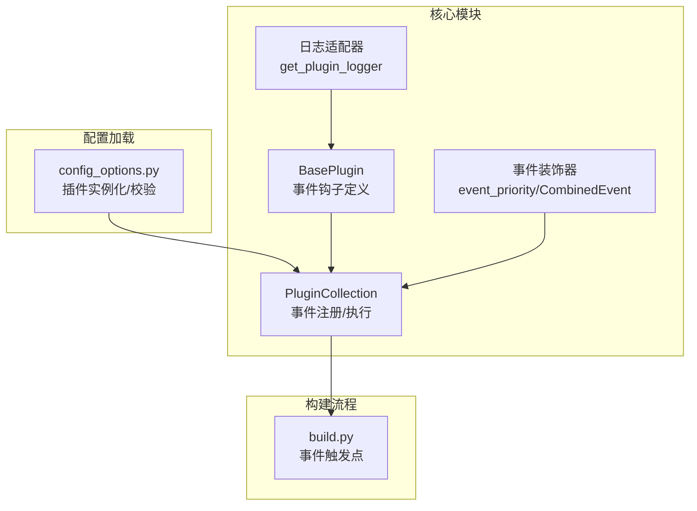
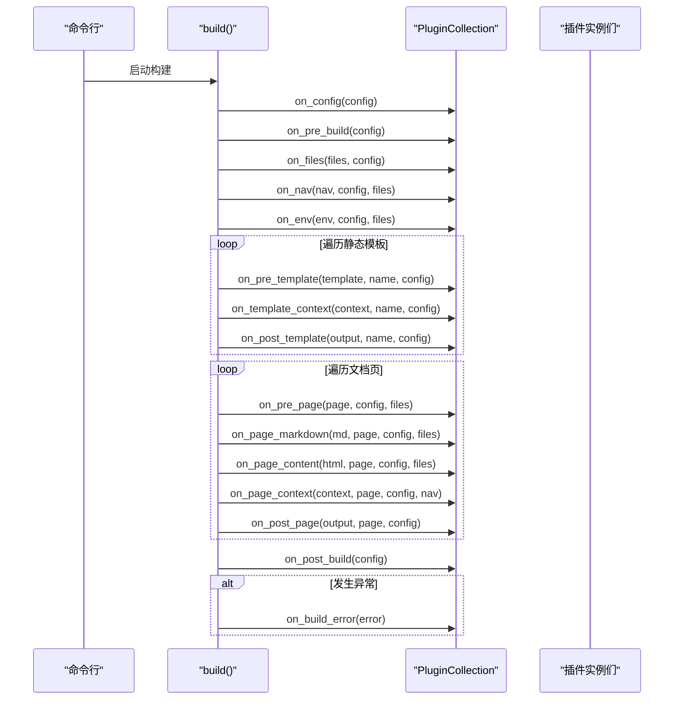
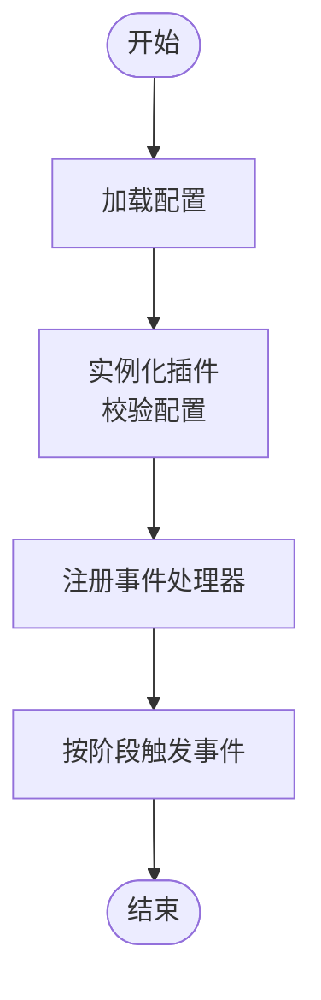

# 插件 API

<cite>
**本文引用的文件列表**
- [mkdocs/plugins.py](file://mkdocs/plugins.py)
- [docs/dev-guide/plugins.md](file://docs/dev-guide/plugins.md)
- [mkdocs/commands/build.py](file://mkdocs/commands/build.py)
- [mkdocs/config/config_options.py](file://mkdocs/config/config_options.py)
- [mkdocs/exceptions.py](file://mkdocs/exceptions.py)
- [mkdocs/tests/plugin_tests.py](file://mkdocs/tests/plugin_tests.py)
- [mkdocs/tests/config/config_options_tests.py](file://mkdocs/tests/config/config_options_tests.py)
- [docs/img/plugin-events.py](file://docs/img/plugin-events.py)
</cite>

## 目录
1. [简介](#简介)
2. [项目结构与角色定位](#项目结构与角色定位)
3. [核心组件总览](#核心组件总览)
4. [架构概览](#架构概览)
5. [事件钩子系统详解](#事件钩子系统详解)
6. [插件注册与生命周期](#插件注册与生命周期)
7. [依赖关系与调用链分析](#依赖关系与调用链分析)
8. [性能与并发特性](#性能与并发特性)
9. [错误处理与日志规范](#错误处理与日志规范)
10. [最佳实践与开发示例](#最佳实践与开发示例)
11. [故障排查指南](#故障排查指南)
12. [结论](#结论)

## 简介
本文件系统化梳理 MkDocs 插件 API 的设计与使用方式，覆盖插件生命周期事件、事件钩子系统、插件注册机制、事件优先级与组合、错误处理与日志规范，并给出可直接参考的实现路径与图示，帮助开发者快速上手并高质量地开发插件。

## 项目结构与角色定位
- 核心实现位于 mkdocs/plugins.py，定义了 BasePlugin 基类、事件钩子签名、事件收集器 PluginCollection、事件运行器与辅助工具（如事件优先级装饰器、组合事件）。
- 构建流程在 mkdocs/commands/build.py 中体现事件的实际触发点，串联全局事件、模板事件与页面事件。
- 配置加载与插件实例化逻辑在 mkdocs/config/config_options.py 中完成，负责解析用户配置、校验插件选项并将插件加入集合。
- 文档在 docs/dev-guide/plugins.md 中提供了事件时序图与使用说明。
- 测试文件 mkdocs/tests/plugin_tests.py 与 mkdocs/tests/config/config_options_tests.py 验证了事件注册、优先级排序、多实例警告等行为。

图表来源
- [mkdocs/plugins.py](file://mkdocs/plugins.py#L58-L417)
- [mkdocs/commands/build.py](file://mkdocs/commands/build.py#L249-L365)
- [mkdocs/config/config_options.py](file://mkdocs/config/config_options.py#L1105-L1165)

章节来源
- [mkdocs/plugins.py](file://mkdocs/plugins.py#L1-L698)
- [mkdocs/commands/build.py](file://mkdocs/commands/build.py#L1-L370)
- [mkdocs/config/config_options.py](file://mkdocs/config/config_options.py#L1100-L1227)
- [docs/dev-guide/plugins.md](file://docs/dev-guide/plugins.md#L1-L567)

## 核心组件总览
- BasePlugin：所有插件的基类，定义了全部事件钩子方法的签名与默认行为（多数返回输入或 None，表示不修改）。
- PluginCollection：插件集合，负责将插件的事件方法注册到对应事件名下，并按优先级顺序执行。
- 事件装饰器：
  - event_priority：为事件方法设置优先级，数值越高越先执行；默认 0。
  - CombinedEvent：将多个同名事件处理器合并为一个事件入口，便于在同一事件上注册不同优先级的处理器。
- 日志工具：get_plugin_logger 提供带前缀的日志适配器，统一格式与级别控制。

章节来源
- [mkdocs/plugins.py](file://mkdocs/plugins.py#L58-L417)
- [mkdocs/plugins.py](file://mkdocs/plugins.py#L426-L488)
- [mkdocs/plugins.py](file://mkdocs/plugins.py#L649-L698)

## 架构概览
MkDocs 在构建过程中严格遵循“配置—预构建—文件—导航—环境—静态模板—页面—后处理”的顺序，插件通过事件钩子在各阶段插入自定义逻辑。事件在 PluginCollection 中集中管理，按优先级顺序依次调用。

图表来源
- [mkdocs/commands/build.py](file://mkdocs/commands/build.py#L249-L365)
- [mkdocs/plugins.py](file://mkdocs/plugins.py#L575-L646)

章节来源
- [mkdocs/commands/build.py](file://mkdocs/commands/build.py#L249-L365)
- [docs/dev-guide/plugins.md](file://docs/dev-guide/plugins.md#L247-L425)

## 事件钩子系统详解
以下为官方支持的事件清单与触发时机、参数说明（均来自源码注释与类型签名）：

- 全局事件（一次构建周期内）
  - on_config(config)：配置加载与验证完成后，可修改全局配置对象。
  - on_pre_build(config)：预构建阶段，用于执行脚本或准备资源。
  - on_files(files, config)：文件集合已建立，可增删改文件集合。
  - on_nav(nav, config, files)：导航生成后，可调整导航结构。
  - on_env(env, config, files)：Jinja 环境创建后，可调整模板环境。
  - on_post_build(config)：构建结束，用于收尾工作。
  - on_build_error(error)：捕获任何构建期异常后的清理与收尾。

- 模板事件（针对非页面模板）
  - on_pre_template(template, template_name, config)：模板加载后，可修改模板对象。
  - on_template_context(context, template_name, config)：模板上下文创建后，可修改上下文。
  - on_post_template(output_content, template_name, config)：模板渲染后，可修改输出内容。

- 页面事件（针对每个 Markdown 页面）
  - on_pre_page(page, config, files)：页面开始处理前，可修改 Page 对象。
  - on_page_markdown(markdown, page, config, files)：Markdown 加载后，可修改源文本。
  - on_page_content(html, page, config, files)：Markdown 渲染为 HTML 后，可修改 HTML。
  - on_page_context(context, page, config, nav)：页面上下文创建后，可修改上下文。
  - on_post_page(output, page, config)：模板渲染后，可修改最终输出。

- 一次性事件（一次 mkdocs 调用生命周期）
  - on_startup(command, dirty)：构建/服务启动时，适合初始化跨构建状态。
  - on_shutdown()：构建/服务结束时，尽力清理。
  - on_serve(server, config, builder)：开发服务器首次构建完成后，可调整热重载监听。

事件参数与返回值约定：
- 多数事件接收一个“可变对象”作为第一个位置参数，若返回该对象或其新实例，则替换原对象；若返回 None，则保持不变。
- 关键字参数提供上下文信息，不应被修改。

章节来源
- [mkdocs/plugins.py](file://mkdocs/plugins.py#L156-L416)
- [mkdocs/commands/build.py](file://mkdocs/commands/build.py#L61-L347)

## 插件注册与生命周期
- 注册机制
  - 插件通过 setuptools entry_points 暴露，组名为 mkdocs.plugins。
  - 配置加载时，config_options.Plugins 将根据用户配置解析并实例化插件，校验配置项，再加入 PluginCollection。
  - 若插件声明了 on_startup/on_shutdown，会在 serve 场景中复用同一插件实例以支持跨构建状态。

- 生命周期要点
  - 一次性事件 on_startup/on_shutdown 仅在单次命令调用中触发，区别于全局事件在每次构建时都会触发。
  - on_serve 仅在 mkdocs serve 首次构建完成后触发，用于定制热重载行为。

- 事件优先级与组合
  - 使用 event_priority 可为事件方法设置优先级，默认 0；数值越大越先执行。
  - 使用 CombinedEvent 可在同一事件名下注册多个不同优先级的方法，形成“组合事件”。

- 多实例与冲突检测
  - 当同一事件存在多个处理器时（如 on_page_read_source），会发出警告提示无法并行工作。
  - 多次启用同一插件但未声明 supports_multiple_instances 时，会给出警告。

章节来源
- [docs/dev-guide/plugins.md](file://docs/dev-guide/plugins.md#L515-L567)
- [mkdocs/config/config_options.py](file://mkdocs/config/config_options.py#L1105-L1165)
- [mkdocs/plugins.py](file://mkdocs/plugins.py#L426-L488)
- [mkdocs/plugins.py](file://mkdocs/plugins.py#L509-L531)
- [mkdocs/tests/plugin_tests.py](file://mkdocs/tests/plugin_tests.py#L135-L184)

## 依赖关系与调用链分析
- 事件注册
  - 插件加入 PluginCollection 时，自动扫描以 on_ 开头的方法并注册到对应事件名下。
  - 注册时按优先级排序，优先级由 mkdocs_priority 属性决定。

- 事件执行
  - PluginCollection.run_event 按注册顺序依次调用事件处理器，传入 item 或 kwargs，根据返回值决定是否替换对象。
  - 执行期间可记录当前插件来源，便于调试。

- 构建流程中的事件触发点
  - build() 函数在关键节点调用 PluginCollection 的 on_* 方法，确保事件与构建阶段一一对应。

图表来源
- [mkdocs/config/config_options.py](file://mkdocs/config/config_options.py#L1105-L1165)
- [mkdocs/plugins.py](file://mkdocs/plugins.py#L509-L531)
- [mkdocs/commands/build.py](file://mkdocs/commands/build.py#L249-L365)

章节来源
- [mkdocs/plugins.py](file://mkdocs/plugins.py#L509-L573)
- [mkdocs/commands/build.py](file://mkdocs/commands/build.py#L249-L365)

## 性能与并发特性
- 事件执行顺序
  - 事件按优先级降序执行，相同优先级按配置中出现顺序执行。
- 单线程执行
  - 事件在单线程中顺序执行，避免并发竞争。
- 跨构建状态
  - 若插件实现 on_startup/on_shutdown，可在 serve 场景中复用同一实例，减少重复初始化开销。
- 输出短路
  - 若事件返回空字符串（如 on_post_template 返回空），模板会被跳过写入，避免无意义 IO。

章节来源
- [mkdocs/plugins.py](file://mkdocs/plugins.py#L426-L488)
- [mkdocs/plugins.py](file://mkdocs/plugins.py#L551-L573)
- [mkdocs/commands/build.py](file://mkdocs/commands/build.py#L61-L88)

## 错误处理与日志规范
- 异常类型
  - MkDocsException：基础异常类。
  - ConfigurationError：配置校验错误。
  - BuildError：构建期错误（插件不应抛出）。
  - PluginError：插件抛出的构建错误，向用户展示友好消息。

- 错误传播
  - 构建过程中捕获异常后，会触发 on_build_error，随后根据异常类型决定是否中断并退出。
  - 严格模式下，警告计数达到阈值也会导致中断。

- 日志建议
  - 使用 get_plugin_logger 或以 mkdocs.plugins.* 命名空间创建 Logger。
  - 使用 warning/info/debug 等级别，避免使用 error（推荐抛出 PluginError）。

章节来源
- [mkdocs/exceptions.py](file://mkdocs/exceptions.py#L1-L42)
- [docs/dev-guide/plugins.md](file://docs/dev-guide/plugins.md#L442-L514)
- [mkdocs/plugins.py](file://mkdocs/plugins.py#L677-L698)
- [mkdocs/commands/build.py](file://mkdocs/commands/build.py#L355-L361)

## 最佳实践与开发示例
- 插件类定义
  - 继承 BasePlugin，定义 config_scheme 或使用泛型 BasePlugin[MyConfig]。
  - 在事件方法中遵循“返回对象或 None”的约定，避免直接修改传入对象。
- 配置处理
  - 使用 load_config(options) 进行校验与默认值填充；错误通过 ValidationError 抛出。
- 事件处理
  - 在 on_config/on_files/on_nav/on_env/on_page_* 等事件中进行数据修改。
  - 使用 event_priority 控制事件顺序；必要时使用 CombinedEvent 组合不同优先级。
- 日志与错误
  - 使用 get_plugin_logger 输出日志；遇到问题抛出 PluginError。
- 示例参考路径
  - 插件基类与事件定义：[mkdocs/plugins.py](file://mkdocs/plugins.py#L58-L417)
  - 构建流程中的事件触发点：[mkdocs/commands/build.py](file://mkdocs/commands/build.py#L249-L365)
  - 配置加载与插件实例化：[mkdocs/config/config_options.py](file://mkdocs/config/config_options.py#L1105-L1165)
  - 事件优先级与组合示例：[mkdocs/tests/plugin_tests.py](file://mkdocs/tests/plugin_tests.py#L135-L184)
  - 钩子脚本注入示例：[mkdocs/tests/config/config_options_tests.py](file://mkdocs/tests/config/config_options_tests.py#L2343-L2378)

章节来源
- [docs/dev-guide/plugins.md](file://docs/dev-guide/plugins.md#L57-L246)
- [mkdocs/tests/plugin_tests.py](file://mkdocs/tests/plugin_tests.py#L33-L49)
- [mkdocs/tests/config/config_options_tests.py](file://mkdocs/tests/config/config_options_tests.py#L2343-L2378)

## 故障排查指南
- 事件未生效
  - 确认事件方法命名正确且以 on_ 开头；确认插件已启用且配置有效。
  - 检查是否与其他插件对同一事件设置了处理器（如 on_page_read_source）。
- 事件顺序不符合预期
  - 使用 event_priority 设置优先级；检查 CombinedEvent 是否正确组合。
- 多次启用同一插件报错
  - 未声明 supports_multiple_instances 时多次启用会警告；请在插件中设置该标志或减少重复启用。
- 日志输出不符合预期
  - 使用 get_plugin_logger；确保日志级别与 --verbose/--debug 匹配。
- 构建失败
  - 捕获异常并抛出 PluginError；利用 on_build_error 进行清理。

章节来源
- [mkdocs/plugins.py](file://mkdocs/plugins.py#L509-L531)
- [mkdocs/plugins.py](file://mkdocs/plugins.py#L426-L488)
- [docs/dev-guide/plugins.md](file://docs/dev-guide/plugins.md#L442-L514)

## 结论
MkDocs 插件 API 通过清晰的事件钩子体系、灵活的优先级与组合机制、严格的配置与错误处理规范，为扩展站点构建流程提供了稳定而强大的能力。遵循本文档的事件时序、注册机制与最佳实践，可高效开发高质量插件，并在复杂场景中保持可维护性与可预测性。