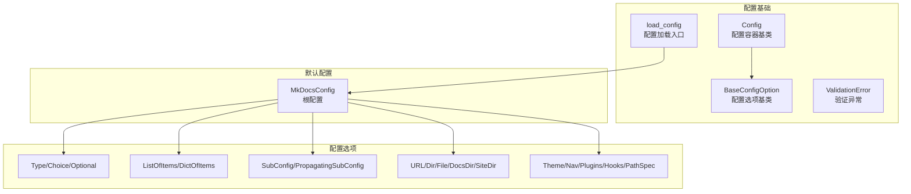
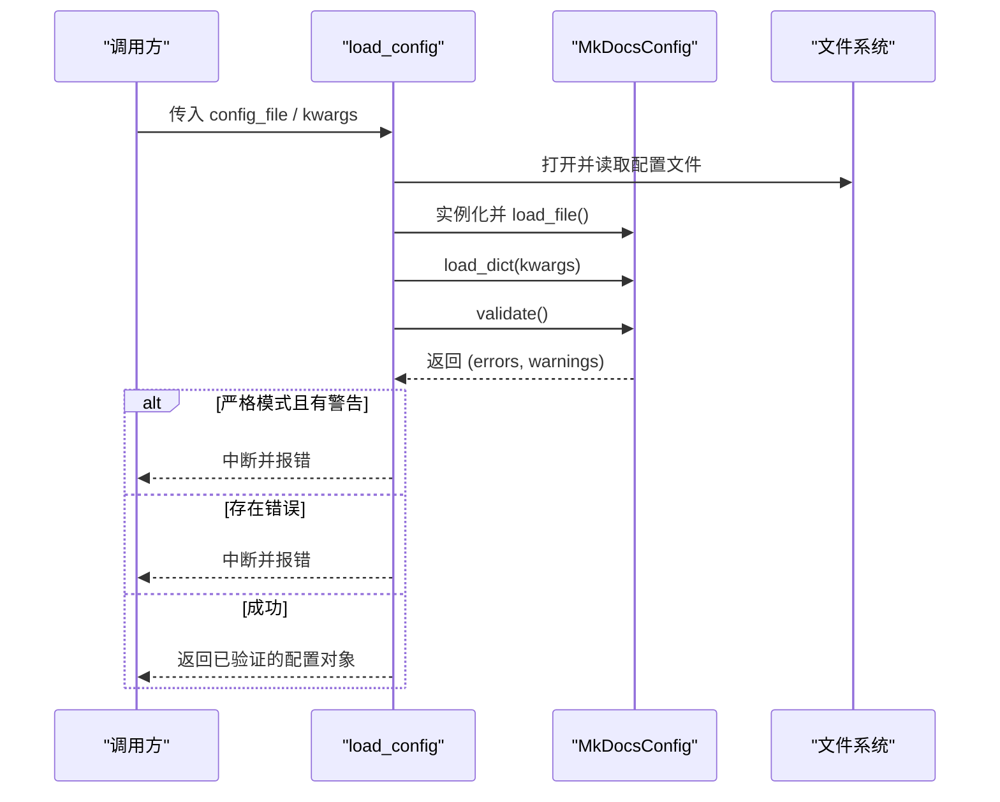
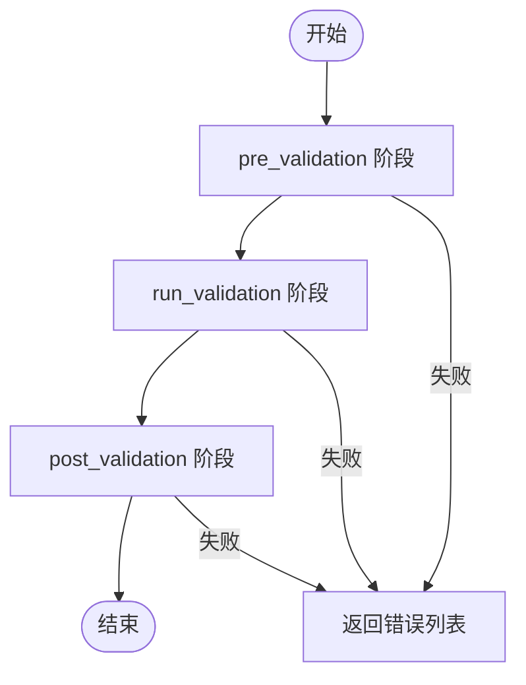
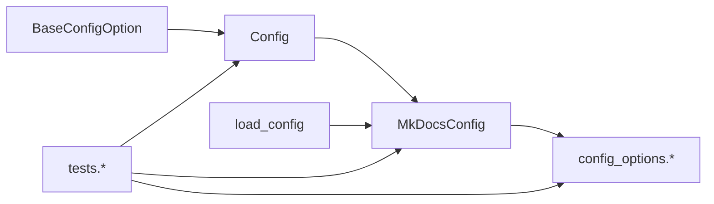

# 配置 API

<cite>
**本文引用的文件**
- [mkdocs/config/base.py](file://mkdocs/config/base.py)
- [mkdocs/config/config_options.py](file://mkdocs/config/config_options.py)
- [mkdocs/config/defaults.py](file://mkdocs/config/defaults.py)
- [mkdocs/config/__init__.py](file://mkdocs/config/__init__.py)
- [mkdocs/tests/config/base_tests.py](file://mkdocs/tests/config/base_tests.py)
- [mkdocs/tests/config/config_options_tests.py](file://mkdocs/tests/config/config_options_tests.py)
- [mkdocs/tests/config/config_tests.py](file://mkdocs/tests/config/config_tests.py)
</cite>

## 目录
1. [简介](#简介)
2. [项目结构](#项目结构)
3. [核心组件](#核心组件)
4. [架构总览](#架构总览)
5. [详细组件分析](#详细组件分析)
6. [依赖关系分析](#依赖关系分析)
7. [性能考量](#性能考量)
8. [故障排查指南](#故障排查指南)
9. [结论](#结论)
10. [附录](#附录)

## 简介
本文件系统性梳理 MkDocs 配置 API，覆盖 Config 基类、BaseConfigOption 配置选项体系、配置加载与验证流程、序列化与反序列化、继承与默认值策略、错误与警告处理机制，并提供自定义配置选项的开发指南与最佳实践。读者可据此在不直接阅读源码的情况下，快速掌握配置系统的使用与扩展方法。

## 项目结构
配置子系统主要由以下模块组成：
- 基础框架：Config、BaseConfigOption、ValidationError、加载器与文件打开工具
- 配置选项：Type、Choice、Optional、ListOfItems、DictOfItems、SubConfig、PropagatingSubConfig、URL、Dir/File/DocsDir/SiteDir、Theme、Nav、Plugins、Hooks、PathSpec 等
- 默认配置：MkDocsConfig（根配置对象），包含所有官方可用配置项及其默认值与校验规则
- 入口导出：对外仅暴露 load_config 与 Config

图表来源
- [mkdocs/config/base.py](file://mkdocs/config/base.py#L123-L392)
- [mkdocs/config/config_options.py](file://mkdocs/config/config_options.py#L1-L1227)
- [mkdocs/config/defaults.py](file://mkdocs/config/defaults.py#L38-L219)

章节来源
- [mkdocs/config/base.py](file://mkdocs/config/base.py#L1-L392)
- [mkdocs/config/config_options.py](file://mkdocs/config/config_options.py#L1-L1227)
- [mkdocs/config/defaults.py](file://mkdocs/config/defaults.py#L1-L219)
- [mkdocs/config/__init__.py](file://mkdocs/config/__init__.py#L1-L4)

## 核心组件
- Config：配置容器基类，负责 schema 收集、默认值设置、预/运行/后验证、字典加载、文件加载（兼容旧接口）等
- BaseConfigOption：所有配置选项的抽象基类，定义 validate、pre_validation、run_validation、post_validation 生命周期钩子
- MkDocsConfig：根配置对象，集中定义所有官方配置项及其默认值与类型约束
- load_config：对外唯一入口，负责解析命令行传入的额外选项、加载 YAML 文件、执行验证、输出日志与错误控制流

章节来源
- [mkdocs/config/base.py](file://mkdocs/config/base.py#L123-L392)
- [mkdocs/config/defaults.py](file://mkdocs/config/defaults.py#L38-L219)
- [mkdocs/config/__init__.py](file://mkdocs/config/__init__.py#L1-L4)

## 架构总览
配置系统采用“配置容器 + 选项类型”的分层设计：
- Config 维护 schema（键到 BaseConfigOption 的映射），在初始化时从类属性收集选项
- 每个 BaseConfigOption 定义自身的默认值、类型约束、预/运行/后验证逻辑
- MkDocsConfig 在类体中以字段形式声明各配置项，形成最终的 schema
- load_config 负责从文件或标准输入读取 YAML，合并命令行参数，执行三阶段验证，并根据 strict 模式决定是否中断

图表来源
- [mkdocs/config/base.py](file://mkdocs/config/base.py#L340-L392)
- [mkdocs/config/defaults.py](file://mkdocs/config/defaults.py#L205-L214)

章节来源
- [mkdocs/config/base.py](file://mkdocs/config/base.py#L340-L392)
- [mkdocs/config/defaults.py](file://mkdocs/config/defaults.py#L205-L214)

## 详细组件分析

### Config 基类与生命周期
- 类型收集：通过 __init_subclass__ 自动扫描类属性中的 BaseConfigOption，生成只读 schema；禁止在新配置中显式设置 required（统一由 Optional 包装）
- 默认值：set_defaults 遍历 schema，为每个键赋默认值
- 验证流程：先 pre_validation，再 run_validation，最后 post_validation；任一阶段出现错误即终止后续阶段
- 加载：load_dict 合并用户字典；load_file 已标记为弃用（保留兼容）
- 用户配置追踪：user_configs 属性已弃用

图表来源
- [mkdocs/config/base.py](file://mkdocs/config/base.py#L181-L243)

章节来源
- [mkdocs/config/base.py](file://mkdocs/config/base.py#L123-L279)

### BaseConfigOption 抽象与生命周期钩子
- validate：对外统一入口，内部委托 run_validation
- pre_validation：在所有选项验证前调用，适合做依赖检查或上下文准备
- run_validation：核心校验逻辑，必须由子类实现
- post_validation：在所有选项验证后调用，适合做跨字段联动修正
- __get__/__set__：支持通过属性访问 Config 中的键值，便于类型安全访问

章节来源
- [mkdocs/config/base.py](file://mkdocs/config/base.py#L37-L107)

### MkDocsConfig（根配置）
- 定义了站点名称、主题、目录、URL、插件、导航、验证级别、构建参数等全部官方配置项
- 使用 Optional/SubConfig/Type/Choice 等选项类型表达约束与默认值
- 提供 load_file/load_dict 以支持从 YAML 文件加载

章节来源
- [mkdocs/config/defaults.py](file://mkdocs/config/defaults.py#L38-L219)

### 配置选项体系概览
- 基础类型：Type、Choice、Optional
- 容器类型：ListOfItems、DictOfItems
- 复合类型：SubConfig、PropagatingSubConfig
- 特定用途：URL、Dir/File/DocsDir/SiteDir、Theme、Nav、Plugins、Hooks、PathSpec、Private、EditURI/Template、MarkdownExtensions 等

章节来源
- [mkdocs/config/config_options.py](file://mkdocs/config/config_options.py#L1-L1227)

### 配置加载、验证与序列化

- 配置加载
  - load_config：解析文件路径或文件句柄，实例化 MkDocsConfig，load_file 读取 YAML，load_dict 合并命令行参数，validate 执行三阶段验证
  - 文件打开：_open_config_file 支持字符串路径、已打开/关闭文件描述符、None（默认 mkdocs.yml/yaml），自动定位并打开
- 验证
  - 预验证：对每个选项调用 pre_validation，收集警告
  - 运行验证：调用 run_validation，遇到错误立即停止后续选项的运行验证
  - 后验证：仅在无错误时执行，用于跨字段联动修正
- 序列化
  - Config 本身基于 UserDict，支持字典式读写
  - MkDocsConfig.load_file 通过 YAML 加载器读取，load_dict 写入

章节来源
- [mkdocs/config/base.py](file://mkdocs/config/base.py#L245-L392)
- [mkdocs/config/defaults.py](file://mkdocs/config/defaults.py#L205-L214)

### 配置继承、默认值与错误处理
- 继承与覆盖
  - 文档层面支持通过 INHERIT 关键字进行配置继承与深度合并（见用户文档示例）
  - 配置系统本身通过 schema 收集与覆盖实现“子类扩展父类配置”
- 默认值
  - BaseConfigOption.default 支持不可变副本保护
  - Config.set_defaults 从 schema 获取默认值填充
  - MkDocsConfig 在字段上直接给出默认值
- 错误与警告
  - 验证阶段产生的错误与警告分别返回；strict 模式下警告也会导致中断
  - 未识别键会生成警告
  - 子配置（SubConfig）可选择开启严格验证，将子级错误/警告提升为顶层错误/警告

章节来源
- [mkdocs/config/base.py](file://mkdocs/config/base.py#L173-L243)
- [mkdocs/tests/config/base_tests.py](file://mkdocs/tests/config/base_tests.py#L13-L31)
- [mkdocs/tests/config/config_options_tests.py](file://mkdocs/tests/config/config_options_tests.py#L1394-L1444)

### 配置选项类型详解与使用示例

- Type/Tuple/长度校验
  - 用于限制单一类型或联合类型，可选 length 精确长度
  - 示例参考：[TypeTest](file://mkdocs/tests/config/config_options_tests.py#L66-L101)
- Choice
  - 限定枚举集合；支持默认值与必填
  - 示例参考：[ChoiceTest](file://mkdocs/tests/config/config_options_tests.py#L108-L166)
- Optional
  - 包裹任意 BaseConfigOption，允许值为 None；若被包裹的选项已有默认值则不允许再次包装
  - 示例参考：[TypeTest](file://mkdocs/tests/config/config_options_tests.py#L103-L105)
- ListOfItems
  - 列表项同构校验；支持嵌套 Optional/子配置；逐项触发 pre/run/post 验证
  - 示例参考：[ListOfItemsTest](file://mkdocs/tests/config/config_options_tests.py#L581-L686)
- DictOfItems
  - 字典值同构校验；键必须为字符串；逐项触发 pre/run/post 验证
  - 示例参考：[DictOfItemsTest](file://mkdocs/tests/config/config_options_tests.py#L747-L850)
- SubConfig/PropagatingSubConfig
  - 将一组配置项封装为子配置；可选择严格验证；PropagatingSubConfig 支持键传播
  - 示例参考：[SubConfigTest](file://mkdocs/tests/config/config_options_tests.py#L1393-L1566)
- URL/Dir/File/DocsDir/SiteDir
  - URL 可指定 is_dir 强制尾部斜杠；Dir/File/DocsDir/SiteDir 支持存在性检查与相对路径转绝对路径
  - 示例参考：[URLTest](file://mkdocs/tests/config/config_options_tests.py#L395-L447)、[FilesystemObjectTest](file://mkdocs/tests/config/config_options_tests.py#L852-L980)、[SiteDirTest](file://mkdocs/tests/config/config_options_tests.py#L1062-L1116)
- Theme
  - 支持内置主题名、自定义目录、静态模板、语言等；校验主题存在性与 custom_dir 可用性
  - 示例参考：[ThemeTest](file://mkdocs/tests/config/config_options_tests.py#L1118-L1298)
- Nav
  - 导航结构校验，支持警告提示与空列表归约为 None
  - 示例参考：[NavTest](file://mkdocs/tests/config/config_options_tests.py#L1300-L1382)
- Plugins/Hooks
  - 插件列表/字典解析、命名空间推断、多实例支持、启用开关、子配置校验
  - 示例参考：[PluginsTest](file://mkdocs/tests/config/config_options_tests.py#L1961-L2341)、[HooksTest](file://mkdocs/tests/config/config_options_tests.py#L2343-L2379)
- PathSpec
  - 基于 gitignore 语法的路径模式
  - 示例参考：[PathSpecTest](file://mkdocs/tests/config/config_options_tests.py#L1299-L1300)
- Private
  - 仅供程序填充，禁止用户直接设置
  - 示例参考：[PrivateTest](file://mkdocs/tests/config/config_options_tests.py#L1384-L1391)
- MarkdownExtensions
  - 支持列表/字典混合、内建扩展去重、扩展有效性校验、配置键注入
  - 示例参考：[MarkdownExtensionsTest](file://mkdocs/tests/config/config_options_tests.py#L1658-L1902)

章节来源
- [mkdocs/config/config_options.py](file://mkdocs/config/config_options.py#L1-L1227)
- [mkdocs/tests/config/config_options_tests.py](file://mkdocs/tests/config/config_options_tests.py#L1-L2421)

### 自定义配置选项开发指南与最佳实践
- 继承 BaseConfigOption，实现 run_validation；如需默认值，设置 default；如需预/后处理，实现 pre/post_validation
- 对于容器类（列表/字典），注意逐项验证与键类型约束；必要时复用 ListOfItems/DictOfItems
- 对于复杂子配置，优先使用 SubConfig[ConfigSubclass]，并在需要时启用严格验证
- 对于可选值，使用 Optional 包裹；避免对已有默认值的选项再次包装
- 对于跨字段依赖，使用 post_validation 进行联动修正，并通过 warnings 输出提示
- 对于文件/路径类，利用 config_file_path 计算相对路径，确保在不同工作目录下行为一致
- 对于插件/主题等外部资源，做好存在性与类型校验，必要时抛出 ValidationError

章节来源
- [mkdocs/config/base.py](file://mkdocs/config/base.py#L37-L107)
- [mkdocs/config/config_options.py](file://mkdocs/config/config_options.py#L52-L123)

## 依赖关系分析
- Config 依赖 BaseConfigOption 与若干工具函数（如弱属性缓存）
- MkDocsConfig 依赖 config_options 中的各类选项类型
- load_config 依赖 defaults.MkDocsConfig、YAML 加载器与文件打开工具
- 测试模块覆盖 Config、BaseConfigOption、MkDocsConfig、各配置选项类型的正确性与边界场景

图表来源
- [mkdocs/config/base.py](file://mkdocs/config/base.py#L123-L392)
- [mkdocs/config/defaults.py](file://mkdocs/config/defaults.py#L38-L219)
- [mkdocs/config/config_options.py](file://mkdocs/config/config_options.py#L1-L1227)

章节来源
- [mkdocs/config/base.py](file://mkdocs/config/base.py#L123-L392)
- [mkdocs/config/defaults.py](file://mkdocs/config/defaults.py#L38-L219)
- [mkdocs/config/config_options.py](file://mkdocs/config/config_options.py#L1-L1227)
- [mkdocs/tests/config/base_tests.py](file://mkdocs/tests/config/base_tests.py#L1-L275)
- [mkdocs/tests/config/config_options_tests.py](file://mkdocs/tests/config/config_options_tests.py#L1-L2421)
- [mkdocs/tests/config/config_tests.py](file://mkdocs/tests/config/config_tests.py#L1-L273)

## 性能考量
- LRU 缓存：get_schema 使用 lru_cache 缓存 schema，减少重复扫描成本
- 空列表/字典优化：ListOfItems/DictOfItems 对空集合直接返回，避免不必要的遍历
- 严格子配置：PropagatingSubConfig 在键传播时进行一次性处理，避免重复计算
- YAML 解析：通过专用加载器与缓存，减少重复解析开销

章节来源
- [mkdocs/config/base.py](file://mkdocs/config/base.py#L273-L279)
- [mkdocs/config/config_options.py](file://mkdocs/config/config_options.py#L125-L146)

## 故障排查指南
- 常见错误
  - 必填项缺失：返回 Required configuration not provided.
  - 类型不符：返回 Expected type: ... but received: ...
  - URL 不合法：返回 The URL isn't valid, it should include the http:// (scheme)
  - 路径不存在：返回 The path '...' isn't an existing ...（Dir/File/DocsDir/SiteDir）
  - 未知键：返回 Unrecognised configuration name: ...
  - 子配置错误：当 validate=True 时，子配置的首个错误会被提升为顶层错误
- 严格模式
  - strict=true 时，任何警告都会导致中断
- 日志
  - 验证过程会记录错误与警告；可通过日志级别观察

章节来源
- [mkdocs/tests/config/base_tests.py](file://mkdocs/tests/config/base_tests.py#L13-L31)
- [mkdocs/tests/config/config_options_tests.py](file://mkdocs/tests/config/config_options_tests.py#L1394-L1444)
- [mkdocs/tests/config/config_tests.py](file://mkdocs/tests/config/config_tests.py#L16-L29)

## 结论
MkDocs 配置 API 以 Config 为核心、BaseConfigOption 为抽象、MkDocsConfig 为根对象，配合丰富的配置选项类型与严格的三阶段验证流程，提供了类型安全、可扩展、易维护的配置体系。通过 Optional/SubConfig/PropagatingSubConfig 等机制，开发者可以灵活表达复杂配置结构；通过严格模式与警告收集，保障配置质量与用户体验。

## 附录
- 对外 API
  - 导出：load_config、Config
  - 作用：统一配置加载入口与配置容器基类
- 相关测试
  - 基础行为：Config 基类、验证流程、文件加载
  - 选项行为：各类配置选项的正确性与边界测试
  - 根配置：MkDocsConfig 的默认值与行为验证

章节来源
- [mkdocs/config/__init__.py](file://mkdocs/config/__init__.py#L1-L4)
- [mkdocs/tests/config/base_tests.py](file://mkdocs/tests/config/base_tests.py#L1-L275)
- [mkdocs/tests/config/config_options_tests.py](file://mkdocs/tests/config/config_options_tests.py#L1-L2421)
- [mkdocs/tests/config/config_tests.py](file://mkdocs/tests/config/config_tests.py#L1-L273)