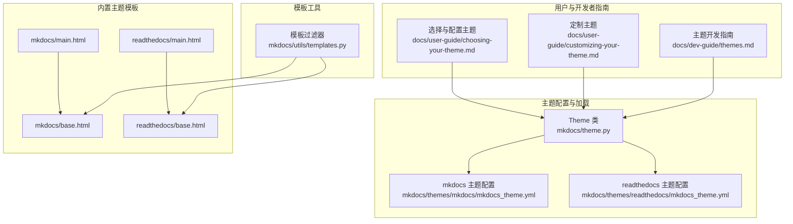
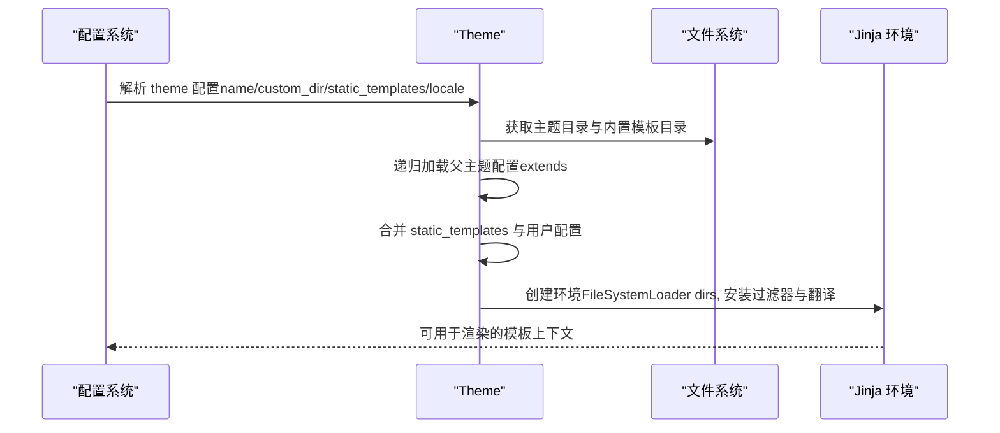
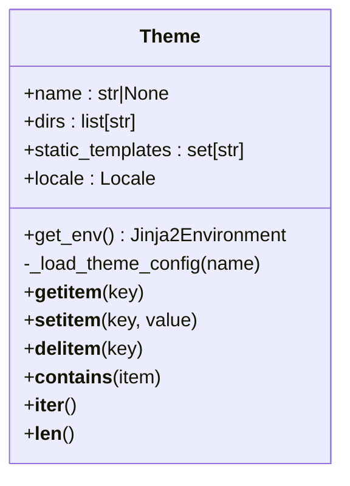
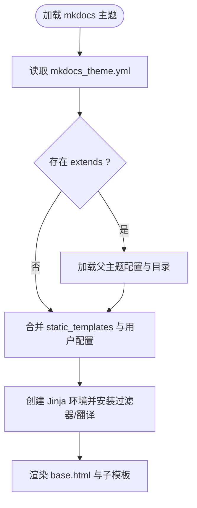
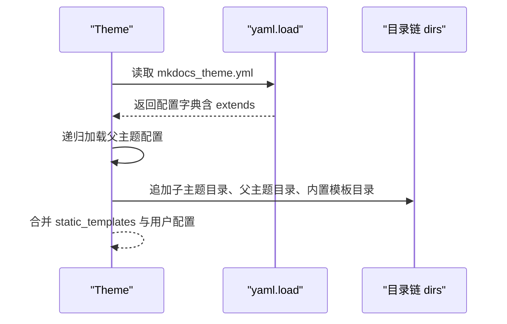
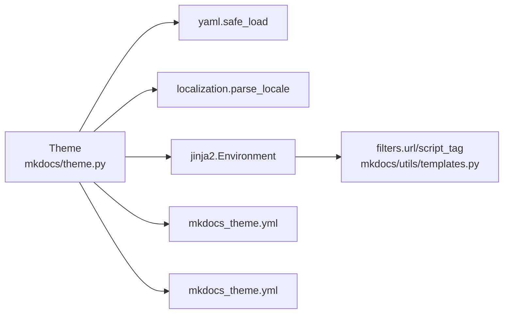

# 主题系统

<cite>
**本文引用的文件**
- [mkdocs\theme.py](file://mkdocs/theme.py)
- [mkdocs\themes\mkdocs\mkdocs_theme.yml](file://mkdocs/themes/mkdocs/mkdocs_theme.yml)
- [mkdocs\themes\readthedocs\mkdocs_theme.yml](file://mkdocs/themes/readthedocs/mkdocs_theme.yml)
- [mkdocs\themes\mkdocs\base.html](file://mkdocs/themes/mkdocs/base.html)
- [mkdocs\themes\readthedocs\base.html](file://mkdocs/themes/readthedocs/base.html)
- [mkdocs\themes\mkdocs\main.html](file://mkdocs/themes/mkdocs/main.html)
- [mkdocs\themes\readthedocs\main.html](file://mkdocs/themes/readthedocs/main.html)
- [mkdocs\utils\templates.py](file://mkdocs/utils/templates.py)
- [docs\dev-guide\themes.md](file://docs/dev-guide/themes.md)
- [docs\user-guide\customizing-your-theme.md](file://docs/user-guide/customizing-your-theme.md)
- [docs\user-guide\choosing-your-theme.md](file://docs/user-guide/choosing-your-theme.md)
- [mkdocs\tests\theme_tests.py](file://mkdocs/tests/theme_tests.py)
- [mkdocs\config\config_options.py](file://mkdocs/config/config_options.py)
</cite>

## 目录
1. [简介](#简介)
2. [项目结构](#项目结构)
3. [核心组件](#核心组件)
4. [架构总览](#架构总览)
5. [组件详解](#组件详解)
6. [依赖关系分析](#依赖关系分析)
7. [性能考量](#性能考量)
8. [故障排查指南](#故障排查指南)
9. [结论](#结论)
10. [附录](#附录)

## 简介
本文件系统化梳理 MkDocs 的主题系统，覆盖内置主题（mkdocs 与 readthedocs）的特性与用法、主题配置项与自定义方式、主题继承机制、CSS/JS/模板修改技巧、响应式与移动端适配、自定义主题开发最佳实践以及主题兼容性检查与测试方法。内容基于仓库源码与官方文档整理，适合不同技术背景的读者循序学习。

## 项目结构
主题系统由“主题配置与加载器”“内置主题模板与资源”“模板过滤器与上下文”“用户定制指南与开发者指南”等模块组成。下图给出与实际源码映射的高层结构：

**图表来源**
- [mkdocs/theme.py](file://mkdocs/theme.py#L23-L167)
- [mkdocs/themes/mkdocs/mkdocs_theme.yml](file://mkdocs/themes/mkdocs/mkdocs_theme.yml#L1-L29)
- [mkdocs/themes/readthedocs/mkdocs_theme.yml](file://mkdocs/themes/readthedocs/mkdocs_theme.yml#L1-L26)
- [mkdocs/themes/mkdocs/base.html](file://mkdocs/themes/mkdocs/base.html#L1-L252)
- [mkdocs/themes/readthedocs/base.html](file://mkdocs/themes/readthedocs/base.html#L1-L200)
- [mkdocs/utils/templates.py](file://mkdocs/utils/templates.py#L25-L56)
- [docs/user-guide/choosing-your-theme.md](file://docs/user-guide/choosing-your-theme.md#L1-L230)
- [docs/user-guide/customizing-your-theme.md](file://docs/user-guide/customizing-your-theme.md#L1-L227)
- [docs/dev-guide/themes.md](file://docs/dev-guide/themes.md#L1-L1116)

**章节来源**
- [mkdocs/theme.py](file://mkdocs/theme.py#L23-L167)
- [docs/dev-guide/themes.md](file://docs/dev-guide/themes.md#L1-L1116)

## 核心组件
- 主题类 Theme：负责解析主题配置、构建模板搜索目录链、合并静态模板列表、安装本地化与过滤器，并提供键值访问接口。
- 内置主题配置：mkdocs 与 readthedocs 各自的 mkdocs_theme.yml 定义默认行为（如导航深度、高亮语言、颜色模式、快捷键、搜索策略等）。
- 模板基线与入口：各主题的 base.html 提供页面骨架与块（blocks），main.html 作为继承入口，便于用户通过 custom_dir 覆盖。
- 模板过滤器与上下文：提供 url、script_tag 等过滤器，统一处理相对链接与脚本标签生成；模板上下文包含全局与页面级变量。

**章节来源**
- [mkdocs/theme.py](file://mkdocs/theme.py#L23-L167)
- [mkdocs/themes/mkdocs/mkdocs_theme.yml](file://mkdocs/themes/mkdocs/mkdocs_theme.yml#L1-L29)
- [mkdocs/themes/readthedocs/mkdocs_theme.yml](file://mkdocs/themes/readthedocs/mkdocs_theme.yml#L1-L26)
- [mkdocs/themes/mkdocs/base.html](file://mkdocs/themes/mkdocs/base.html#L1-L252)
- [mkdocs/themes/readthedocs/base.html](file://mkdocs/themes/readthedocs/base.html#L1-L200)
- [mkdocs/utils/templates.py](file://mkdocs/utils/templates.py#L25-L56)

## 架构总览
主题系统采用“配置驱动 + 模板继承”的架构。Theme 在初始化时按优先级收集模板目录（custom_dir → 主题目录 → MkDocs 内置模板），递归加载父主题配置并合并用户配置；渲染阶段通过 Jinja 环境在这些目录中查找模板，支持块覆盖与国际化。

**图表来源**
- [mkdocs/theme.py](file://mkdocs/theme.py#L54-L167)
- [mkdocs/utils/templates.py](file://mkdocs/utils/templates.py#L37-L56)

**章节来源**
- [mkdocs/theme.py](file://mkdocs/theme.py#L124-L167)
- [mkdocs/utils/templates.py](file://mkdocs/utils/templates.py#L25-L56)

## 组件详解

### 主题类 Theme 的实现与职责
- 目录优先级：custom_dir → 主题目录 → MkDocs 内置模板目录，确保用户覆盖与内置模板共存。
- 父主题继承：读取 mkdocs_theme.yml 中的 extends 字段，递归加载父主题配置，目录顺序为“子 → 父 → 内置”，保证覆盖链正确。
- 静态模板：合并 theme 配置与用户传入的 static_templates，确保 404 等页面始终被渲染。
- 过滤器与本地化：安装 url 与 script_tag 过滤器，注入翻译环境，locale 统一解析为 Locale 对象。

**图表来源**
- [mkdocs/theme.py](file://mkdocs/theme.py#L23-L167)

**章节来源**
- [mkdocs/theme.py](file://mkdocs/theme.py#L54-L167)

### 内置主题：mkdocs
- 特点：基于 Bootstrap，功能完备，支持高亮、GA4、颜色模式切换、快捷键、导航深度控制等。
- 关键配置项：color_mode、user_color_mode_toggle、nav_style、highlightjs、hljs_style、hljs_style_dark、hljs_languages、analytics.gtag、shortcuts、navigation_depth、locale。
- 模板要点：通过 blocks（如 styles、libs、scripts、analytics、content、footer）组织页面结构；支持用户色盘切换菜单与暗色高亮样式。

**图表来源**
- [mkdocs/themes/mkdocs/mkdocs_theme.yml](file://mkdocs/themes/mkdocs/mkdocs_theme.yml#L1-L29)
- [mkdocs/theme.py](file://mkdocs/theme.py#L124-L167)

**章节来源**
- [docs/user-guide/choosing-your-theme.md](file://docs/user-guide/choosing-your-theme.md#L19-L132)
- [mkdocs/themes/mkdocs/base.html](file://mkdocs/themes/mkdocs/base.html#L1-L252)
- [mkdocs/themes/mkdocs/mkdocs_theme.yml](file://mkdocs/themes/mkdocs/mkdocs_theme.yml#L1-L29)

### 内置主题：readthedocs
- 特点：克隆 ReadTheDocs 默认主题风格，强调侧边栏与文档流，支持高亮、GA4、匿名 IP、侧边栏行为控制、logo 等。
- 关键配置项：highlightjs、hljs_languages、analytics.gtag、analytics.anonymize_ip、include_homepage_in_sidebar、prev_next_buttons_location、navigation_depth、collapse_navigation、titles_only、sticky_navigation、logo、locale。
- 模板要点：侧边栏导航、面包屑、版本切换、移动端导航开关、滚动跟随等。

**章节来源**
- [docs/user-guide/choosing-your-theme.md](file://docs/user-guide/choosing-your-theme.md#L133-L208)
- [mkdocs/themes/readthedocs/base.html](file://mkdocs/themes/readthedocs/base.html#L1-L200)
- [mkdocs/themes/readthedocs/mkdocs_theme.yml](file://mkdocs/themes/readthedocs/mkdocs_theme.yml#L1-L26)

### 主题继承机制
- 通过 mkdocs_theme.yml 的 extends 字段声明父主题名称，Theme 会递归加载父主题配置与模板目录，形成“子 → 父 → 内置”的目录链。
- 测试用例验证了目录顺序与 static_templates 合并逻辑，确保子主题可覆盖父主题的静态模板与配置。

**图表来源**
- [mkdocs/theme.py](file://mkdocs/theme.py#L124-L156)
- [mkdocs/tests/theme_tests.py](file://mkdocs/tests/theme_tests.py#L88-L125)

**章节来源**
- [mkdocs/theme.py](file://mkdocs/theme.py#L124-L156)
- [mkdocs/tests/theme_tests.py](file://mkdocs/tests/theme_tests.py#L88-L125)

### CSS、JavaScript 与模板修改技巧
- 使用 extra_css 与 extra_javascript 注入样式与脚本；模板中通过 config.extra_css 与 config.extra_javascript 遍历输出。
- 新版脚本对象包含 path、type、async、defer 等字段，建议使用 script_tag 过滤器生成标准 script 标签，保持向后兼容。
- 通过自定义 main.html 继承 base.html 并重写 blocks（如 styles、libs、scripts、content、footer）实现局部替换。
- 使用 custom_dir 仅覆盖父主题中的特定文件，无需复制完整主题结构；若 name 为 null，则 custom_dir 必须是完整独立主题。

**章节来源**
- [docs/user-guide/customizing-your-theme.md](file://docs/user-guide/customizing-your-theme.md#L1-L227)
- [docs/dev-guide/themes.md](file://docs/dev-guide/themes.md#L126-L177)
- [mkdocs/utils/templates.py](file://mkdocs/utils/templates.py#L43-L56)

### 响应式设计与移动端适配
- mkdocs 主题：使用 viewport 元标签与 Bootstrap 导航折叠组件，支持移动端展开菜单与色盘切换菜单；导航样式可选 primary/dark/light。
- readthedocs 主题：提供移动端导航开关、侧边栏滚动跟随、面包屑与版本切换，适配窄屏阅读体验。
- 建议：在自定义主题中遵循 meta viewport、语义化导航与可访问性标签，结合媒体查询优化排版与交互元素。

**章节来源**
- [mkdocs/themes/mkdocs/base.html](file://mkdocs/themes/mkdocs/base.html#L1-L252)
- [mkdocs/themes/readthedocs/base.html](file://mkdocs/themes/readthedocs/base.html#L1-L200)
- [docs/user-guide/choosing-your-theme.md](file://docs/user-guide/choosing-your-theme.md#L19-L208)

### 自定义主题开发最佳实践
- 最小化要求：在 custom_dir 下提供 main.html 即可启用自定义主题；如需复用现有主题的其他文件，可仅覆盖所需部分。
- 包装与分发：打包为主题包时，需提供 mkdocs_theme.yml、setup.py、entry_points 以注册主题；MANIFEST.in 控制资源包含范围。
- 本地化：使用 Locale 设置语言，模板中通过翻译标记包裹文本；编译 mo 文件并放置于 locales/<locale>/LC_MESSAGES/messages.mo。
- 搜索集成：根据 include_search_page 与 search_index_only 配置决定是否提供 search.html 或自行实现客户端搜索。
- 过滤器与上下文：利用 url 与 script_tag 过滤器标准化链接与脚本输出；模板上下文包含 config、nav、pages、page、base_url 等。

**章节来源**
- [docs/dev-guide/themes.md](file://docs/dev-guide/themes.md#L22-L1116)
- [docs/user-guide/customizing-your-theme.md](file://docs/user-guide/customizing-your-theme.md#L47-L227)

## 依赖关系分析
- Theme 依赖 YAML 解析、本地化与模板工具，负责构建 Jinja 环境与模板目录链。
- 模板过滤器依赖 normalize_url 实现相对链接规范化与 script_tag 输出。
- 主题配置项影响模板渲染（如颜色模式、高亮样式、导航深度、搜索策略）。

**图表来源**
- [mkdocs/theme.py](file://mkdocs/theme.py#L1-L167)
- [mkdocs/utils/templates.py](file://mkdocs/utils/templates.py#L25-L56)

**章节来源**
- [mkdocs/theme.py](file://mkdocs/theme.py#L1-L167)
- [mkdocs/utils/templates.py](file://mkdocs/utils/templates.py#L25-L56)

## 性能考量
- 模板加载：Theme 将多个目录加入 FileSystemLoader，注意避免过多冗余文件；合理使用 static_templates 与 custom_dir，减少不必要的模板扫描。
- 资源加载：高亮语言按需引入，避免加载未使用的语言包；CDN 链接与缓存策略可降低首屏开销。
- 渲染阶段：尽量减少模板内复杂计算，使用过滤器与预处理数据；控制 extra_css/js 数量与体积。
- 搜索索引：大站点开启预构建索引可提升搜索性能；否则需在模板中实现高效客户端检索。

## 故障排查指南
- 主题不可用或缺失配置文件：Theme 初始化时若找不到 mkdocs_theme.yml，会抛出校验错误，提示升级主题版本。
- 父主题未安装：当 extends 指定的父主题未安装，将提示可用主题列表，需先安装对应主题包。
- 静态模板未渲染：确认 static_templates 是否包含 404.html 等必要页面；custom_dir 与 theme.name 的组合需满足覆盖规则。
- 脚本与链接异常：使用 script_tag 与 url 过滤器统一生成脚本与链接，避免手动拼接导致的路径问题。
- 搜索功能失效：检查插件启用状态与主题配置（include_search_page、search_index_only），确保模板中包含必要的 DOM 结构与脚本。

**章节来源**
- [mkdocs/theme.py](file://mkdocs/theme.py#L132-L153)
- [docs/user-guide/customizing-your-theme.md](file://docs/user-guide/customizing-your-theme.md#L1-L227)
- [docs/dev-guide/themes.md](file://docs/dev-guide/themes.md#L691-L800)

## 结论
MkDocs 主题系统以 Theme 为核心，通过配置驱动与模板继承实现灵活的主题体系。内置 mkdocs 与 readthedocs 主题覆盖常见需求，配合丰富的配置项与块覆盖机制，既满足快速定制，也支持深度扩展。遵循本文的开发与测试实践，可高效构建高质量、可维护的主题并保障跨版本兼容性。

## 附录

### 主题配置项速查（节选）
- mkdocs 主题
  - color_mode、user_color_mode_toggle、nav_style、highlightjs、hljs_style、hljs_style_dark、hljs_languages、analytics.gtag、shortcuts、navigation_depth、locale
- readthedocs 主题
  - highlightjs、hljs_languages、analytics.gtag、analytics.anonymize_ip、include_homepage_in_sidebar、prev_next_buttons_location、navigation_depth、collapse_navigation、titles_only、sticky_navigation、logo、locale

**章节来源**
- [docs/user-guide/choosing-your-theme.md](file://docs/user-guide/choosing-your-theme.md#L35-L208)
- [mkdocs/themes/mkdocs/mkdocs_theme.yml](file://mkdocs/themes/mkdocs/mkdocs_theme.yml#L1-L29)
- [mkdocs/themes/readthedocs/mkdocs_theme.yml](file://mkdocs/themes/readthedocs/mkdocs_theme.yml#L1-L26)