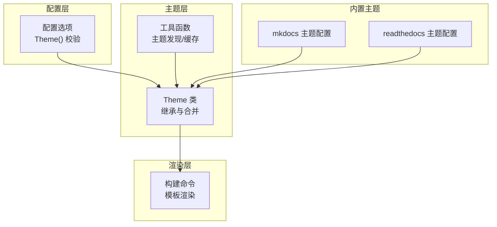
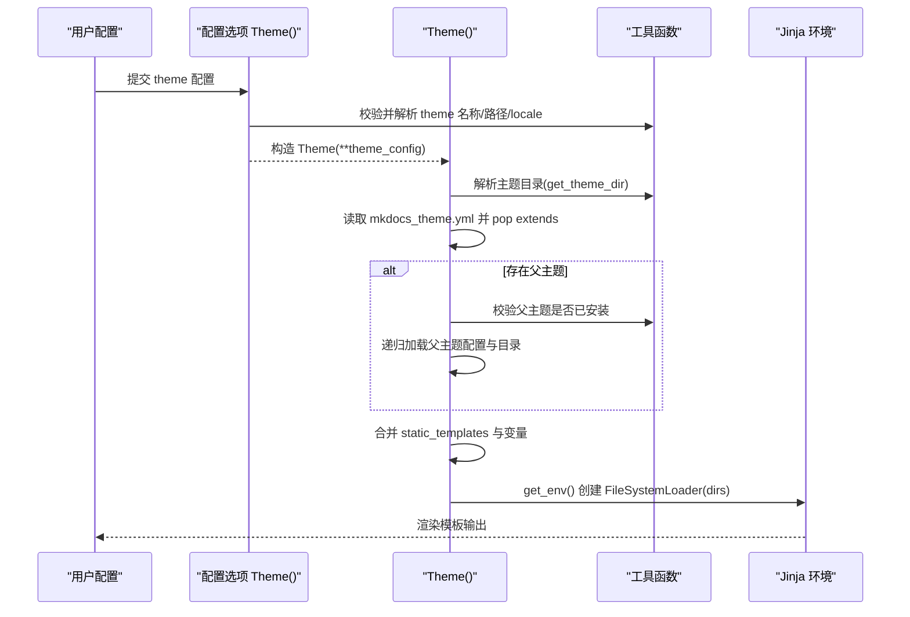
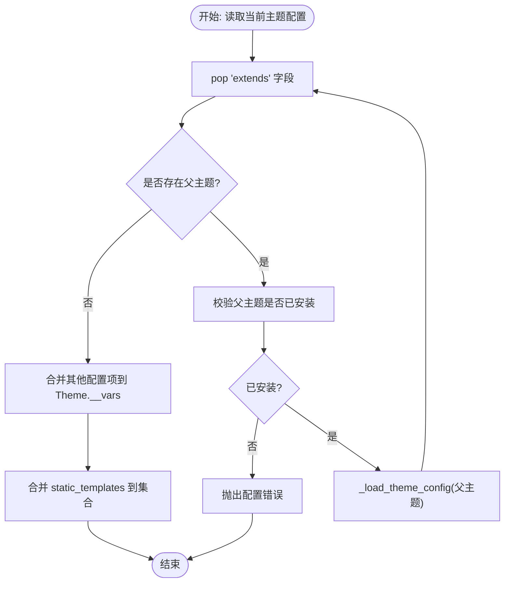
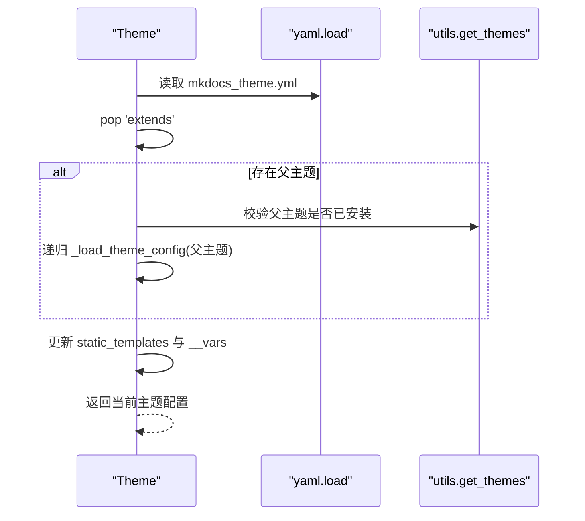
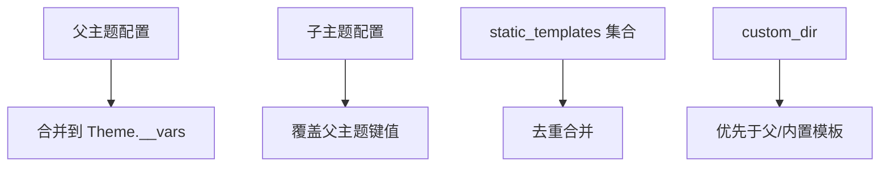
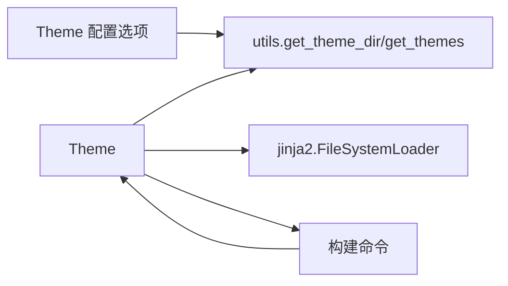

# 主题继承机制

<cite>
**本文引用的文件**   
- [mkdocs/theme.py](file://mkdocs/theme.py)
- [mkdocs/utils/__init__.py](file://mkdocs/utils/__init__.py)
- [mkdocs/config/config_options.py](file://mkdocs/config/config_options.py)
- [mkdocs/commands/build.py](file://mkdocs/commands/build.py)
- [mkdocs/tests/theme_tests.py](file://mkdocs/tests/theme_tests.py)
- [mkdocs/themes/mkdocs/mkdocs_theme.yml](file://mkdocs/themes/mkdocs/mkdocs_theme.yml)
- [mkdocs/themes/readthedocs/mkdocs_theme.yml](file://mkdocs/themes/readthedocs/mkdocs_theme.yml)
- [docs/user-guide/customizing-your-theme.md](file://docs/user-guide/customizing-your-theme.md)
</cite>

## 目录
1. [引言](#引言)
2. [项目结构](#项目结构)
3. [核心组件](#核心组件)
4. [架构总览](#架构总览)
5. [详细组件分析](#详细组件分析)
6. [依赖关系分析](#依赖关系分析)
7. [性能考量](#性能考量)
8. [故障排查指南](#故障排查指南)
9. [结论](#结论)
10. [附录](#附录)

## 引言
本文件系统性阐述 MkDocs 的主题继承机制，围绕以下关键点展开：extends 配置项与父主题加载流程、主题目录搜索顺序与优先级、链式继承的实现原理与工作流、配置合并策略与冲突处理、最佳实践与设计模式、调试与排障方法，以及复杂继承场景的应用示例。目标是帮助主题开发者与使用者在理解底层实现的同时，高效地构建与维护可复用、可扩展的主题体系。

## 项目结构
与主题继承直接相关的代码主要分布在如下模块：
- 主题类与继承逻辑：mkdocs/theme.py
- 主题发现与入口点解析：mkdocs/utils/__init__.py
- 配置校验与 Theme 实例化：mkdocs/config/config_options.py
- 模板渲染与主题环境：mkdocs/commands/build.py
- 行为验证与示例：mkdocs/tests/theme_tests.py
- 内置主题配置样例：mkdocs/themes/*/mkdocs_theme.yml
- 用户指南（自定义目录与覆盖规则）：docs/user-guide/customizing-your-theme.md



**图表来源**
- [mkdocs/config/config_options.py](file://mkdocs/config/config_options.py#L819-L858)
- [mkdocs/theme.py](file://mkdocs/theme.py#L35-L74)
- [mkdocs/utils/__init__.py](file://mkdocs/utils/__init__.py#L256-L288)
- [mkdocs/commands/build.py](file://mkdocs/commands/build.py#L91-L107)
- [mkdocs/themes/mkdocs/mkdocs_theme.yml](file://mkdocs/themes/mkdocs/mkdocs_theme.yml#L1-L29)
- [mkdocs/themes/readthedocs/mkdocs_theme.yml](file://mkdocs/themes/readthedocs/mkdocs_theme.yml#L1-L26)

**章节来源**
- [mkdocs/theme.py](file://mkdocs/theme.py#L35-L74)
- [mkdocs/utils/__init__.py](file://mkdocs/utils/__init__.py#L256-L288)
- [mkdocs/config/config_options.py](file://mkdocs/config/config_options.py#L819-L858)
- [mkdocs/commands/build.py](file://mkdocs/commands/build.py#L91-L107)

## 核心组件
- Theme 类：负责主题初始化、目录优先级构建、递归加载父主题、配置合并、静态模板集合管理、Jinja 环境构建。
- 工具函数：提供主题名称到目录的映射、已安装主题列表缓存、重复主题警告等。
- 配置选项 Theme：对用户配置进行校验，确保 name 或 custom_dir 至少其一，解析 custom_dir 绝对路径，最终构造 Theme 实例。
- 构建命令：使用 Theme.get_env() 获取 Jinja 环境，按目录顺序查找模板并渲染输出。

**章节来源**
- [mkdocs/theme.py](file://mkdocs/theme.py#L23-L167)
- [mkdocs/utils/__init__.py](file://mkdocs/utils/__init__.py#L256-L288)
- [mkdocs/config/config_options.py](file://mkdocs/config/config_options.py#L819-L858)
- [mkdocs/commands/build.py](file://mkdocs/commands/build.py#L91-L107)

## 架构总览
主题继承的总体流程如下：
- 配置校验阶段：Theme 配置选项校验 name 存在性、custom_dir 合法性、locale 类型等，并构造 Theme。
- Theme 初始化阶段：确定目录优先级（custom_dir → 父主题链 → MkDocs 内置模板），加载当前主题配置。
- 递归加载父主题：若当前主题配置包含 extends，则检查父主题是否已安装，递归加载父主题配置与目录。
- 配置合并：父主题配置逐层覆盖子主题配置；static_templates 以集合方式合并。
- 渲染阶段：Theme.get_env() 基于 dirs 创建 FileSystemLoader，按目录顺序查找模板，完成渲染。



**图表来源**
- [mkdocs/config/config_options.py](file://mkdocs/config/config_options.py#L819-L858)
- [mkdocs/theme.py](file://mkdocs/theme.py#L124-L167)
- [mkdocs/utils/__init__.py](file://mkdocs/utils/__init__.py#L256-L288)
- [mkdocs/commands/build.py](file://mkdocs/commands/build.py#L91-L107)

## 详细组件分析

### extends 配置与父主题加载
- 配置项位置：主题配置文件中通过 extends 指定父主题名称。
- 加载流程：Theme._load_theme_config 在读取当前主题配置后，pop 出 extends 字段，检查父主题是否存在于已安装主题列表，若存在则递归调用自身加载父主题。
- 错误处理：若父主题未安装，抛出配置错误，提示可用主题列表。



**图表来源**
- [mkdocs/theme.py](file://mkdocs/theme.py#L146-L156)

**章节来源**
- [mkdocs/theme.py](file://mkdocs/theme.py#L146-L156)

### 主题目录搜索顺序与优先级
Theme 初始化时构建 dirs 的顺序与优先级如下：
1) 自定义目录 custom_dir（若提供）
2) 当前主题目录（name 对应的主题）
3) 父主题目录（递归加载）
4) MkDocs 内置模板目录（始终包含）

Jinja 环境基于 dirs 创建 FileSystemLoader，模板查找遵循“先添加者优先”的顺序：custom_dir > 父主题链 > MkDocs 内置模板。这意味着自定义目录中的同名文件会覆盖父主题或内置模板。

```mermaid
classDiagram
class Theme {
+dirs : list[str]
+static_templates : set[str]
+get_env() jinja2.Environment
-_load_theme_config(name)
}
Theme : "目录优先级"
Theme : "1) custom_dir"
Theme : "2) 当前主题"
Theme : "3) 父主题链"
Theme : "4) MkDocs 内置模板"
```

**图表来源**
- [mkdocs/theme.py](file://mkdocs/theme.py#L54-L74)
- [mkdocs/theme.py](file://mkdocs/theme.py#L158-L167)

**章节来源**
- [mkdocs/theme.py](file://mkdocs/theme.py#L54-L74)
- [mkdocs/theme.py](file://mkdocs/theme.py#L158-L167)
- [docs/user-guide/customizing-your-theme.md](file://docs/user-guide/customizing-your-theme.md#L47-L101)

### 链式继承的实现原理与工作流
- 递归加载：每次加载一个主题配置后，若存在 extends，则立即切换到父主题并重复上述流程，直到没有父主题为止。
- 目录叠加：每个主题的目录都会被追加到 Theme.dirs 中，形成“自定义 → 子主题 → 父主题 → 内置”的查找链。
- 配置合并：非 extends 的键值逐层覆盖，static_templates 以集合去重合并。



**图表来源**
- [mkdocs/theme.py](file://mkdocs/theme.py#L124-L156)
- [mkdocs/utils/__init__.py](file://mkdocs/utils/__init__.py#L262-L288)

**章节来源**
- [mkdocs/theme.py](file://mkdocs/theme.py#L124-L156)
- [mkdocs/tests/theme_tests.py](file://mkdocs/tests/theme_tests.py#L88-L107)

### 配置合并策略与冲突解决
- 变量合并：除 extends 外的键值逐层覆盖，子主题配置覆盖父主题配置。
- 静态模板：static_templates 以集合方式合并，避免重复。
- locale：由 Theme 初始化时统一解析为 Locale 对象，最终以 Theme['locale'] 暴露。
- 自定义目录优先：custom_dir 中的文件优先于父主题与内置模板。



**图表来源**
- [mkdocs/theme.py](file://mkdocs/theme.py#L155-L156)
- [mkdocs/theme.py](file://mkdocs/theme.py#L66-L68)
- [docs/user-guide/customizing-your-theme.md](file://docs/user-guide/customizing-your-theme.md#L47-L101)

**章节来源**
- [mkdocs/theme.py](file://mkdocs/theme.py#L66-L68)
- [mkdocs/theme.py](file://mkdocs/theme.py#L155-L156)
- [docs/user-guide/customizing-your-theme.md](file://docs/user-guide/customizing-your-theme.md#L47-L101)

### 最佳实践与设计模式
- 使用 extends 构建主题层次：将通用样式与布局抽象到父主题，子主题仅声明差异配置，减少重复。
- 自定义覆盖策略：通过 custom_dir 覆盖父主题模板与资源，保持与父主题目录结构一致。
- 明确配置合并预期：子主题配置覆盖父主题配置，static_templates 通过集合合并，避免重复。
- 主题命名与冲突：避免同一名称被多个包提供；如出现重复，日志会给出警告并采用某个包提供的主题。
- locale 规范：locale 应为字符串类型，Theme 初始化时统一解析为 Locale 对象。

**章节来源**
- [mkdocs/theme.py](file://mkdocs/theme.py#L66-L74)
- [mkdocs/utils/__init__.py](file://mkdocs/utils/__init__.py#L277-L283)
- [docs/user-guide/customizing-your-theme.md](file://docs/user-guide/customizing-your-theme.md#L47-L101)

### 继承链调试与问题排查
- 日志与异常：
  - 父主题未安装：抛出配置错误，提示可用主题列表。
  - 主题配置文件缺失：提示主题缺少配置文件。
  - 自定义目录不存在：校验失败并报错。
- 调试建议：
  - 打开调试日志，观察 Theme._load_theme_config 的日志输出，确认继承链加载顺序。
  - 检查 Theme.dirs 顺序，确认 custom_dir 是否在最前。
  - 检查 static_templates 集合，确认合并结果符合预期。
  - 使用测试用例思路：通过 mock yaml.load 返回不同层级的配置，验证目录与集合合并行为。

**章节来源**
- [mkdocs/theme.py](file://mkdocs/theme.py#L134-L152)
- [mkdocs/tests/theme_tests.py](file://mkdocs/tests/theme_tests.py#L88-L107)

### 复杂主题继承场景示例
- 场景：子主题继承 readthedocs，同时自定义部分模板与资源。
- 目录顺序：子主题目录 → readthedocs → MkDocs 内置模板。
- 配置合并：子主题覆盖 readthedocs 的导航深度、搜索页开关等；static_templates 合并两者的集合。
- 示例参考：测试用例模拟了子主题声明 extends readthedocs，并包含自己的 static_templates，最终 dirs 与集合合并结果均符合预期。

**章节来源**
- [mkdocs/tests/theme_tests.py](file://mkdocs/tests/theme_tests.py#L88-L107)
- [mkdocs/themes/mkdocs/mkdocs_theme.yml](file://mkdocs/themes/mkdocs/mkdocs_theme.yml#L1-L29)
- [mkdocs/themes/readthedocs/mkdocs_theme.yml](file://mkdocs/themes/readthedocs/mkdocs_theme.yml#L1-L26)

## 依赖关系分析
- Theme 依赖 utils.get_theme_dir 与 utils.get_themes 获取主题目录与已安装主题列表。
- Theme.get_env 依赖 jinja2.FileSystemLoader，按 dirs 顺序查找模板。
- 配置选项 Theme() 依赖 utils.get_theme_names 进行主题存在性校验。
- 构建命令通过 Theme.get_env 获取环境并渲染模板。



**图表来源**
- [mkdocs/theme.py](file://mkdocs/theme.py#L124-L167)
- [mkdocs/utils/__init__.py](file://mkdocs/utils/__init__.py#L256-L288)
- [mkdocs/config/config_options.py](file://mkdocs/config/config_options.py#L833-L838)
- [mkdocs/commands/build.py](file://mkdocs/commands/build.py#L91-L107)

**章节来源**
- [mkdocs/theme.py](file://mkdocs/theme.py#L124-L167)
- [mkdocs/utils/__init__.py](file://mkdocs/utils/__init__.py#L256-L288)
- [mkdocs/config/config_options.py](file://mkdocs/config/config_options.py#L833-L838)
- [mkdocs/commands/build.py](file://mkdocs/commands/build.py#L91-L107)

## 性能考量
- 目录查找顺序：Jinja FileSystemLoader 按 dirs 顺序查找，custom_dir 放在前面可减少后续目录扫描次数。
- 缓存：utils.get_themes 使用 LRU 缓存，避免重复解析入口点。
- 静态模板集合：以集合合并 static_templates，避免重复渲染与写入。
- 本地化与过滤器：Theme.get_env 安装翻译与过滤器，一次性完成，避免重复初始化。

**章节来源**
- [mkdocs/theme.py](file://mkdocs/theme.py#L158-L167)
- [mkdocs/utils/__init__.py](file://mkdocs/utils/__init__.py#L262-L288)

## 故障排查指南
- 症状：提示“父主题未安装”
  - 排查：确认父主题名称拼写正确，且已在环境中安装；查看可用主题列表。
- 症状：提示“主题缺少配置文件”
  - 排查：确认主题目录下存在 mkdocs_theme.yml。
- 症状：custom_dir 路径无效
  - 排查：确认路径存在且为绝对路径（配置中相对路径会被解析为相对于配置文件目录）。
- 症状：模板未生效
  - 排查：检查 Theme.dirs 顺序，确认 custom_dir 在最前；确认模板名与路径一致。

**章节来源**
- [mkdocs/theme.py](file://mkdocs/theme.py#L134-L152)
- [mkdocs/config/config_options.py](file://mkdocs/config/config_options.py#L843-L853)

## 结论
MkDocs 的主题继承机制通过简洁的 extends 配置与严格的目录优先级，实现了清晰、可预测的主题链式加载与配置合并。配合自定义目录覆盖策略与内置模板兜底，开发者可以高效地构建可复用的主题体系。遵循本文的最佳实践与排障方法，可在复杂场景中稳定地实现主题继承与定制。

## 附录
- 相关内置主题配置示例：
  - mkdocs 主题配置：包含默认 static_templates、高亮与导航等基础配置。
  - readthedocs 主题配置：包含搜索页、导航深度、侧边栏等扩展配置。

**章节来源**
- [mkdocs/themes/mkdocs/mkdocs_theme.yml](file://mkdocs/themes/mkdocs/mkdocs_theme.yml#L1-L29)
- [mkdocs/themes/readthedocs/mkdocs_theme.yml](file://mkdocs/themes/readthedocs/mkdocs_theme.yml#L1-L26)