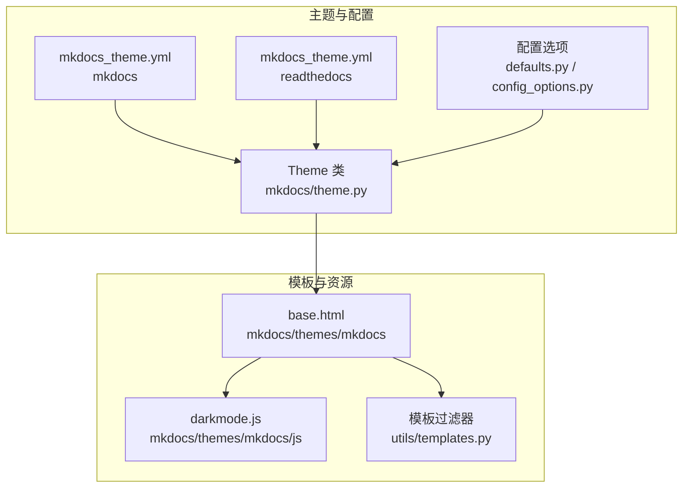
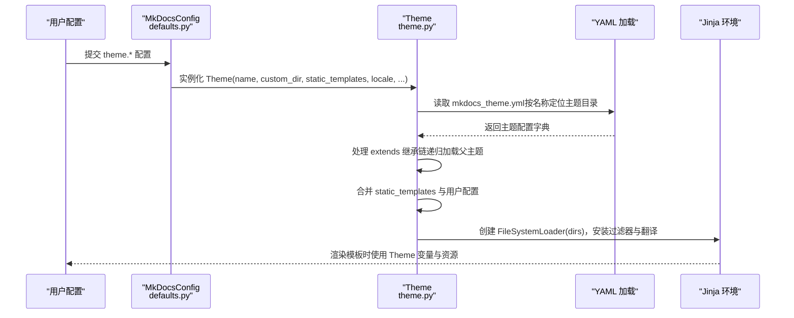
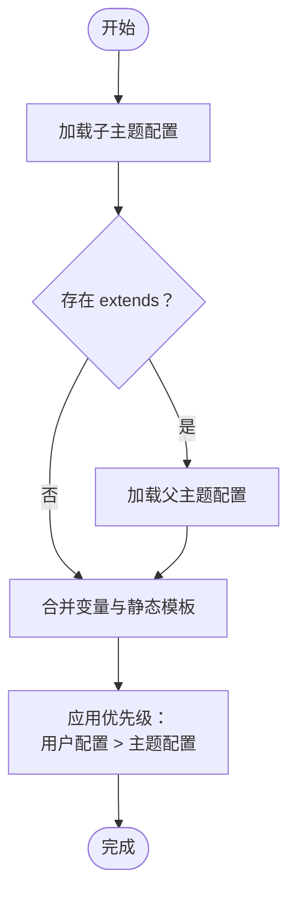
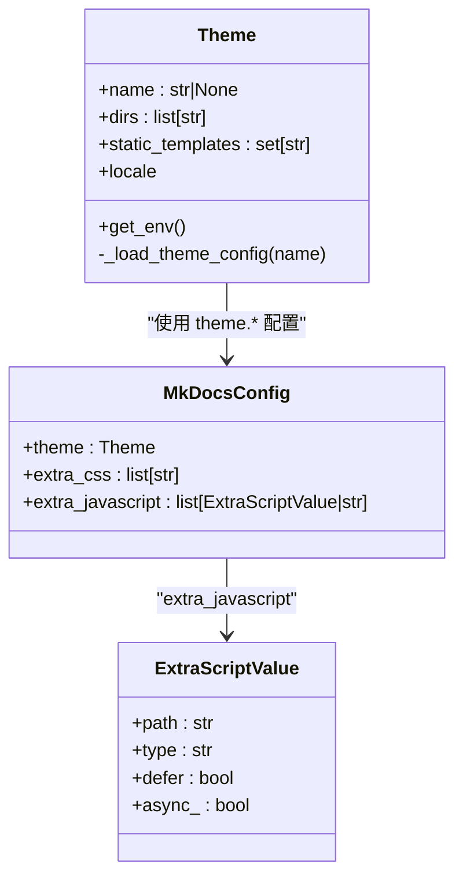

# 主题配置

<cite>
**本文引用的文件**
- [mkdocs/theme.py](file://mkdocs/theme.py)
- [mkdocs/config/defaults.py](file://mkdocs/config/defaults.py)
- [mkdocs/config/config_options.py](file://mkdocs/config/config_options.py)
- [mkdocs/utils/templates.py](file://mkdocs/utils/templates.py)
- [mkdocs/themes/mkdocs/mkdocs_theme.yml](file://mkdocs/themes/mkdocs/mkdocs_theme.yml)
- [mkdocs/themes/readthedocs/mkdocs_theme.yml](file://mkdocs/themes/readthedocs/mkdocs_theme.yml)
- [docs/dev-guide/themes.md](file://docs/dev-guide/themes.md)
- [docs/user-guide/choosing-your-theme.md](file://docs/user-guide/choosing-your-theme.md)
- [mkdocs/themes/mkdocs/js/darkmode.js](file://mkdocs/themes/mkdocs/js/darkmode.js)
- [mkdocs/themes/mkdocs/base.html](file://mkdocs/themes/mkdocs/base.html)
- [mkdocs/tests/theme_tests.py](file://mkdocs/tests/theme_tests.py)
- [mkdocs/tests/config/config_options_tests.py](file://mkdocs/tests/config/config_options_tests.py)
- [mkdocs/tests/config/config_options_legacy_tests.py](file://mkdocs/tests/config/config_options_legacy_tests.py)
- [mkdocs/tests/utils/templates_tests.py](file://mkdocs/tests/utils/templates_tests.py)
</cite>

## 目录
1. [简介](#简介)
2. [项目结构](#项目结构)
3. [核心组件](#核心组件)
4. [架构总览](#架构总览)
5. [详细组件分析](#详细组件分析)
6. [依赖关系分析](#依赖关系分析)
7. [性能考量](#性能考量)
8. [故障排除指南](#故障排除指南)
9. [结论](#结论)
10. [附录](#附录)

## 简介
本文件系统化梳理 MkDocs 主题配置，围绕 mkdocs_theme.yml 的结构与选项、主题继承与配置优先级、静态模板与自定义模板、CSS/JS 资源配置、以及验证与故障排除进行深入说明。内容基于代码实现与官方文档，帮助主题作者与使用者正确配置与扩展主题。

## 项目结构
- 主题配置文件位于各内置主题目录下，如 mkdocs 与 readthedocs 主题均包含 mkdocs_theme.yml。
- 主题对象 Theme 负责加载主题配置、处理继承、合并用户配置，并构建模板环境。
- 配置选项在 defaults.py 与 config_options.py 中定义，extra_javascript 通过 ExtraScript 类型支持模块化脚本与属性。
- 模板工具 templates.py 提供 url 与 script_tag 过滤器，用于生成正确的资源链接与 script 标签。

图表来源
- [mkdocs/themes/mkdocs/mkdocs_theme.yml](file://mkdocs/themes/mkdocs/mkdocs_theme.yml#L1-L29)
- [mkdocs/themes/readthedocs/mkdocs_theme.yml](file://mkdocs/themes/readthedocs/mkdocs_theme.yml#L1-L26)
- [mkdocs/theme.py](file://mkdocs/theme.py#L23-L167)
- [mkdocs/config/defaults.py](file://mkdocs/config/defaults.py#L38-L219)
- [mkdocs/utils/templates.py](file://mkdocs/utils/templates.py#L25-L55)
- [mkdocs/themes/mkdocs/base.html](file://mkdocs/themes/mkdocs/base.html#L153-L208)
- [mkdocs/themes/mkdocs/js/darkmode.js](file://mkdocs/themes/mkdocs/js/darkmode.js#L1-L34)

章节来源
- [mkdocs/theme.py](file://mkdocs/theme.py#L23-L167)
- [mkdocs/config/defaults.py](file://mkdocs/config/defaults.py#L38-L219)
- [mkdocs/config/config_options.py](file://mkdocs/config/config_options.py#L941-L957)
- [mkdocs/utils/templates.py](file://mkdocs/utils/templates.py#L25-L55)

## 核心组件
- 主题类 Theme：负责加载主题配置、解析继承链、合并用户配置、构建模板搜索路径与静态模板集合，并提供模板环境。
- 配置选项：主题配置项由 defaults.py 与 config_options.py 定义，包括 theme.name、theme.custom_dir、theme.static_templates、extra_css、extra_javascript 等。
- 模板过滤器：url 与 script_tag 过滤器确保资源链接正确与 script 标签可带属性（type/module/async/defer）。

章节来源
- [mkdocs/theme.py](file://mkdocs/theme.py#L23-L167)
- [mkdocs/config/defaults.py](file://mkdocs/config/defaults.py#L73-L160)
- [mkdocs/config/config_options.py](file://mkdocs/config/config_options.py#L941-L957)
- [mkdocs/utils/templates.py](file://mkdocs/utils/templates.py#L37-L55)

## 架构总览
主题配置的加载与应用流程如下：

图表来源
- [mkdocs/config/defaults.py](file://mkdocs/config/defaults.py#L73-L74)
- [mkdocs/theme.py](file://mkdocs/theme.py#L35-L74)
- [mkdocs/theme.py](file://mkdocs/theme.py#L124-L156)
- [mkdocs/theme.py](file://mkdocs/theme.py#L158-L166)

## 详细组件分析

### 主题配置文件 mkdocs_theme.yml 结构与选项
- 基本字段
  - static_templates：主题默认静态模板列表（如 404.html），用户可在配置中追加但不可移除。
  - locale：主题语言标识，默认为 en；最终会转换为 Locale 对象。
  - extends：指定父主题名称，支持多层继承。
- 搜索相关
  - include_search_page：是否生成独立搜索页模板。
  - search_index_only：仅生成索引，不注入额外模板或脚本。
- 代码高亮
  - highlightjs：启用 highlight.js。
  - hljs_style / hljs_style_dark：亮/暗模式下的样式名。
  - hljs_languages：额外语言支持列表。
- 导航与外观
  - navigation_depth：侧边栏导航最大层级。
  - nav_style：顶部导航条风格（primary/dark/light）。
  - color_mode：默认颜色模式（light/dark/auto）。
  - user_color_mode_toggle：是否显示用户切换菜单。
- 分析与快捷键
  - analytics.gtag：Google Analytics 4 跟踪 ID（可选）。
  - shortcuts：键盘快捷键映射（help/next/previous/search）。
- 默认值与行为
  - 未显式设置时，部分字段有默认值（如 mkdocs 主题的 navigation_depth、nav_style、color_mode 等）。
  - 若主题配置为空文件，将只保留 name 与 locale 的最小变量集。

章节来源
- [mkdocs/themes/mkdocs/mkdocs_theme.yml](file://mkdocs/themes/mkdocs/mkdocs_theme.yml#L1-L29)
- [mkdocs/themes/readthedocs/mkdocs_theme.yml](file://mkdocs/themes/readthedocs/mkdocs_theme.yml#L1-L26)
- [docs/dev-guide/themes.md](file://docs/dev-guide/themes.md#L936-L991)
- [docs/user-guide/choosing-your-theme.md](file://docs/user-guide/choosing-your-theme.md#L35-L131)
- [mkdocs/tests/theme_tests.py](file://mkdocs/tests/theme_tests.py#L108-L126)

### 主题继承机制与配置优先级
- 继承链
  - 通过 mkdocs_theme.yml 的 extends 字段声明父主题；Theme._load_theme_config 递归加载父主题配置。
  - 搜索路径 dirs 按“子主题 → 父主题 → MkDocs 内置模板”顺序组织，保证覆盖关系。
- 静态模板
  - static_templates 在父主题基础上追加用户配置；用户无法从主题移除已包含的模板。
- 变量合并
  - 用户传入的配置键值覆盖主题配置；Theme.__init__ 最终将用户配置更新到内部映射。
- 本地化
  - locale 由用户配置优先，否则回退到主题配置；最终统一转换为 Locale 对象。

图表来源
- [mkdocs/theme.py](file://mkdocs/theme.py#L124-L156)
- [mkdocs/theme.py](file://mkdocs/theme.py#L54-L74)
- [mkdocs/tests/theme_tests.py](file://mkdocs/tests/theme_tests.py#L88-L107)

章节来源
- [mkdocs/theme.py](file://mkdocs/theme.py#L124-L156)
- [mkdocs/theme.py](file://mkdocs/theme.py#L54-L74)
- [mkdocs/tests/theme_tests.py](file://mkdocs/tests/theme_tests.py#L88-L107)

### 静态模板与自定义模板设置
- 静态模板
  - static_templates 列表中的模板无论扩展名如何都会被当作模板渲染。
  - 主题可预设默认静态模板，用户可在配置中追加。
- 自定义模板
  - 使用 theme.custom_dir 指向自定义目录，其内同名文件将覆盖父主题对应文件。
  - 当 theme.name 为 null 时，custom_dir 必须包含完整主题；当 name 指定已有主题时，custom_dir 仅覆盖指定文件。
- 模板搜索顺序
  - Theme.dirs 顺序决定模板查找优先级，确保自定义覆盖父主题，再覆盖 MkDocs 内置模板。

章节来源
- [docs/dev-guide/themes.md](file://docs/dev-guide/themes.md#L63-L78)
- [docs/user-guide/customizing-your-theme.md](file://docs/user-guide/customizing-your-theme.md#L47-L101)
- [mkdocs/theme.py](file://mkdocs/theme.py#L54-L74)

### CSS、JavaScript 资源配置方法
- extra_css 与 extra_javascript
  - 通过顶层配置 extra_css 与 extra_javascript 注入样式与脚本。
  - extra_javascript 支持对象形式，包含 path、type、defer、async 等字段；.mjs 文件自动识别为 module 类型。
- 模板中使用
  - 推荐使用 script_tag 过滤器输出 script 标签，以正确处理属性与 URL。
  - 基础模板示例展示了如何遍历 config.extra_css 与 config.extra_javascript 并输出资源。
- 主题中的脚本与样式
  - 主题自带脚本（如 darkmode.js）与样式在必要时才引入（例如根据 color_mode 或 user_color_mode_toggle 条件加载）。

章节来源
- [mkdocs/config/defaults.py](file://mkdocs/config/defaults.py#L123-L125)
- [mkdocs/config/config_options.py](file://mkdocs/config/config_options.py#L941-L957)
- [mkdocs/utils/templates.py](file://mkdocs/utils/templates.py#L43-L55)
- [docs/dev-guide/themes.md](file://docs/dev-guide/themes.md#L126-L177)
- [mkdocs/themes/mkdocs/base.html](file://mkdocs/themes/mkdocs/base.html#L153-L208)
- [mkdocs/themes/mkdocs/js/darkmode.js](file://mkdocs/themes/mkdocs/js/darkmode.js#L1-L34)

### 配置验证与错误处理
- 主题名称与目录
  - name 与 custom_dir 至少需其一；若仅设置 custom_dir 且无 theme.name，则 custom_dir 视为完整主题。
- 继承主题有效性
  - 若 extends 指向未安装的主题，将抛出验证错误。
- 配置类型与格式
  - extra_javascript 支持字符串与对象混合；对象必须包含 path，type/defer/async 为布尔或字符串类型。
- 测试用例覆盖
  - 单元测试验证了简单主题、自定义目录、继承链、空配置等场景的行为与默认值。

章节来源
- [mkdocs/tests/config/config_options_tests.py](file://mkdocs/tests/config/config_options_tests.py#L1144-L1189)
- [mkdocs/tests/config/config_options_legacy_tests.py](file://mkdocs/tests/config/config_options_legacy_tests.py#L936-L983)
- [mkdocs/tests/theme_tests.py](file://mkdocs/tests/theme_tests.py#L16-L42)
- [mkdocs/theme.py](file://mkdocs/theme.py#L146-L153)

## 依赖关系分析
- Theme 依赖
  - 从 utils.get_theme_dir 获取主题目录，读取 mkdocs_theme.yml 并递归处理 extends。
  - 将用户传入的 static_templates 与 user_config 合并到内部映射。
  - 构建 Jinja 环境，注册 url 与 script_tag 过滤器，并安装翻译。
- 配置选项依赖
  - MkDocsConfig.theme 使用 Theme 类型，extra_css 与 extra_javascript 由 defaults.py 定义。
  - ExtraScriptValue/ExtraScript 由 config_options.py 定义，支持 .mjs 与属性化脚本。

图表来源
- [mkdocs/theme.py](file://mkdocs/theme.py#L23-L167)
- [mkdocs/config/defaults.py](file://mkdocs/config/defaults.py#L73-L160)
- [mkdocs/config/config_options.py](file://mkdocs/config/config_options.py#L918-L957)

章节来源
- [mkdocs/theme.py](file://mkdocs/theme.py#L23-L167)
- [mkdocs/config/defaults.py](file://mkdocs/config/defaults.py#L73-L160)
- [mkdocs/config/config_options.py](file://mkdocs/config/config_options.py#L918-L957)

## 性能考量
- 模板加载与缓存
  - Theme.get_env 使用 FileSystemLoader，禁用自动重载以避免构建过程中模板编辑导致的开销。
  - 模板搜索路径按优先级组织，减少不必要的文件系统扫描。
- 资源加载
  - 通过 script_tag 过滤器统一生成 script 标签，避免重复拼接与 URL 规范化问题。
- 搜索插件
  - include_search_page 与 search_index_only 控制是否生成完整搜索体验或仅索引，影响模板与脚本注入数量。

章节来源
- [mkdocs/theme.py](file://mkdocs/theme.py#L158-L166)
- [docs/dev-guide/themes.md](file://docs/dev-guide/themes.md#L744-L770)

## 故障排除指南
- 继承主题不存在
  - 现象：提示继承的主题未安装。
  - 处理：确认已安装该主题或修正 extends 名称。
- 自定义目录未生效
  - 现象：custom_dir 未覆盖父主题文件。
  - 处理：确保 theme.name 指向有效主题；或当 theme.name 为 null 时，custom_dir 包含完整主题。
- extra_javascript 类型错误
  - 现象：配置为非字符串/对象时报错。
  - 处理：使用字符串或包含 path 的对象；.mjs 文件将自动视为 module。
- 模板未按预期渲染
  - 现象：静态模板未被渲染或被覆盖。
  - 处理：检查 static_templates 列表与 theme.custom_dir 的覆盖关系；确认模板扩展名为 .html 或在 static_templates 中。

章节来源
- [mkdocs/theme.py](file://mkdocs/theme.py#L146-L153)
- [docs/dev-guide/themes.md](file://docs/dev-guide/themes.md#L63-L78)
- [mkdocs/tests/config/config_options_tests.py](file://mkdocs/tests/config/config_options_tests.py#L723-L734)
- [mkdocs/tests/utils/templates_tests.py](file://mkdocs/tests/utils/templates_tests.py#L11-L49)

## 结论
- mkdocs_theme.yml 是主题默认配置的核心载体，支持静态模板、继承、本地化与主题特定功能开关。
- Theme 类实现了严格的继承链加载与配置合并策略，确保用户配置优先于主题配置。
- 通过 extra_css/extra_javascript 与 script_tag 过滤器，主题可灵活管理资源并兼容模块化脚本。
- 建议在主题开发中明确默认值、提供清晰的继承关系与本地化支持，并在文档中说明关键配置项与最佳实践。

## 附录

### 配置参数参考与默认值（摘要）
- 主题基础
  - name：主题名称（字符串）
  - custom_dir：自定义模板目录（字符串）
  - static_templates：静态模板列表（列表）
  - locale：语言标识（字符串，默认 en）
- 搜索
  - include_search_page：是否生成搜索页（布尔，默认 false）
  - search_index_only：仅生成索引（布尔，默认 false）
- 代码高亮
  - highlightjs：启用高亮（布尔，默认 true）
  - hljs_style / hljs_style_dark：样式名（字符串）
  - hljs_languages：语言列表（列表，默认 []）
- 导航与外观
  - navigation_depth：导航层级（整数，默认 2）
  - nav_style：导航风格（字符串，默认 primary）
  - color_mode：颜色模式（字符串，默认 light）
  - user_color_mode_toggle：显示切换菜单（布尔，默认 false）
- 分析与快捷键
  - analytics.gtag：GA4 ID（字符串/空）
  - shortcuts.help/next/previous/search：键码（整数）

章节来源
- [mkdocs/themes/mkdocs/mkdocs_theme.yml](file://mkdocs/themes/mkdocs/mkdocs_theme.yml#L1-L29)
- [mkdocs/themes/readthedocs/mkdocs_theme.yml](file://mkdocs/themes/readthedocs/mkdocs_theme.yml#L1-L26)
- [docs/user-guide/choosing-your-theme.md](file://docs/user-guide/choosing-your-theme.md#L35-L131)
- [mkdocs/tests/theme_tests.py](file://mkdocs/tests/theme_tests.py#L16-L42)