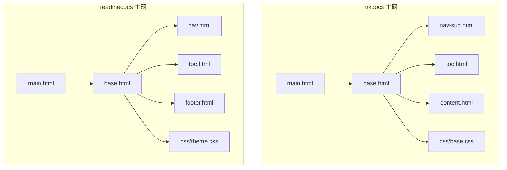
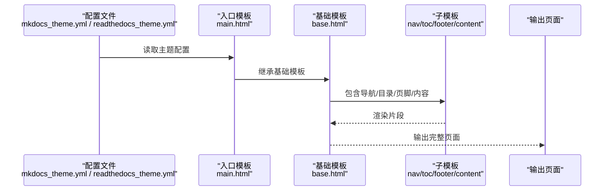
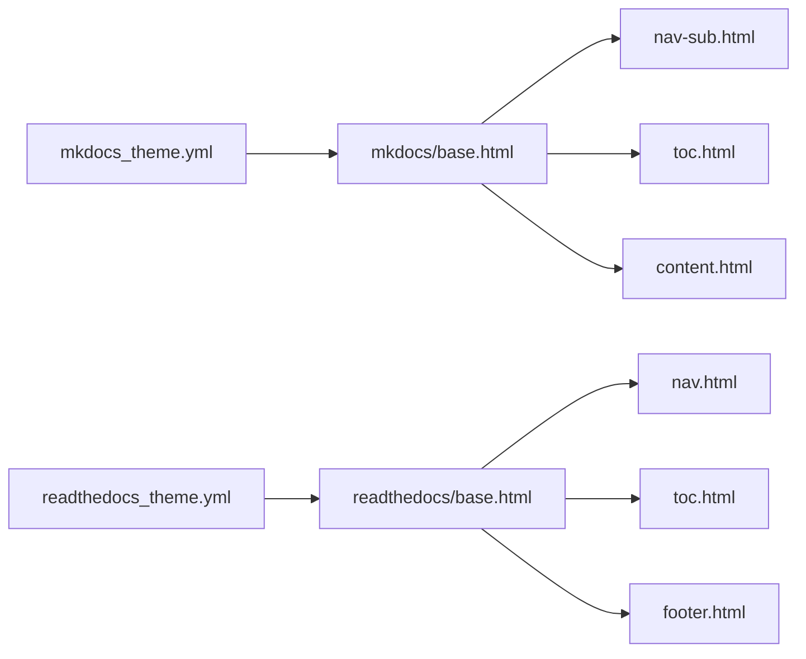

# 内置主题

<cite>
**本文引用的文件**   
- [mkdocs_theme.yml](file://mkdocs/themes/mkdocs/mkdocs_theme.yml)
- [readthedocs_theme.yml](file://mkdocs/themes/readthedocs/mkdocs_theme.yml)
- [mkdocs 基础模板 base.html](file://mkdocs/themes/mkdocs/base.html)
- [readthedocs 基础模板 base.html](file://mkdocs/themes/readthedocs/base.html)
- [mkdocs 入口模板 main.html](file://mkdocs/themes/mkdocs/main.html)
- [readthedocs 入口模板 main.html](file://mkdocs/themes/readthedocs/main.html)
- [mkdocs 导航子项 nav-sub.html](file://mkdocs/themes/mkdocs/nav-sub.html)
- [readthedocs 导航 nav.html](file://mkdocs/themes/readthedocs/nav.html)
- [mkdocs 目录 toc.html](file://mkdocs/themes/mkdocs/toc.html)
- [readthedocs 目录 toc.html](file://mkdocs/themes/readthedocs/toc.html)
- [mkdocs 内容 content.html](file://mkdocs/themes/mkdocs/content.html)
- [readthedocs 页脚 footer.html](file://mkdocs/themes/readthedocs/footer.html)
- [mkdocs 样式 base.css](file://mkdocs/themes/mkdocs/css/base.css)
- [readthedocs 样式 theme.css](file://mkdocs/themes/readthedocs/css/theme.css)
- [主题选择指南 choosing-your-theme.md](file://docs/user-guide/choosing-your-theme.md)
- [主题定制指南 customizing-your-theme.md](file://docs/user-guide/customizing-your-theme.md)
- [项目配置 configuration.md](file://docs/user-guide/configuration.md)
</cite>

## 目录
1. [简介](#简介)
2. [项目结构](#项目结构)
3. [核心组件](#核心组件)
4. [架构总览](#架构总览)
5. [详细组件分析](#详细组件分析)
6. [依赖关系分析](#依赖关系分析)
7. [性能考量](#性能考量)
8. [故障排查指南](#故障排查指南)
9. [结论](#结论)
10. [附录](#附录)

## 简介
本篇文档系统梳理 MkDocs 两个内置主题：mkdocs 与 readthedocs 的设计理念、布局特点、功能特性与适用场景，并通过配置参数与定制化路径帮助读者完成主题选择与切换。文档同时提供主题差异对比、使用建议、配置示例与常见问题排查，帮助不同背景的用户快速上手并高效落地。

## 项目结构
- 两个内置主题均采用 Jinja 模板与静态资源（CSS/JS/字体/图标）组织，入口模板 main.html 继承基础模板 base.html，再由 base.html 调用若干子模板（如导航、目录、页脚等）拼装页面。
- mkdocs 主题强调现代化 Bootstrap 风格与深色模式支持；readthedocs 主题复刻 Read the Docs 官方主题风格，强调侧边栏导航与可粘性滚动。



**图表来源**
- [mkdocs 基础模板 base.html](file://mkdocs/themes/mkdocs/base.html#L1-L252)
- [readthedocs 基础模板 base.html](file://mkdocs/themes/readthedocs/base.html#L1-L200)
- [mkdocs 导航子项 nav-sub.html](file://mkdocs/themes/mkdocs/nav-sub.html#L1-L15)
- [readthedocs 导航 nav.html](file://mkdocs/themes/readthedocs/nav.html#L1-L23)
- [mkdocs 目录 toc.html](file://mkdocs/themes/mkdocs/toc.html#L1-L27)
- [readthedocs 目录 toc.html](file://mkdocs/themes/readthedocs/toc.html#L1-L13)
- [mkdocs 内容 content.html](file://mkdocs/themes/mkdocs/content.html#L1-L10)
- [readthedocs 页脚 footer.html](file://mkdocs/themes/readthedocs/footer.html#L1-L27)
- [mkdocs 样式 base.css](file://mkdocs/themes/mkdocs/css/base.css#L1-L200)
- [readthedocs 样式 theme.css](file://mkdocs/themes/readthedocs/css/theme.css#L1-L14)

**章节来源**
- [mkdocs 基础模板 base.html](file://mkdocs/themes/mkdocs/base.html#L1-L252)
- [readthedocs 基础模板 base.html](file://mkdocs/themes/readthedocs/base.html#L1-L200)
- [mkdocs 入口模板 main.html](file://mkdocs/themes/mkdocs/main.html#L1-L11)
- [readthedocs 入口模板 main.html](file://mkdocs/themes/readthedocs/main.html#L1-L11)

## 核心组件
- 主题配置文件
  - mkdocs 主题配置：[mkdocs_theme.yml](file://mkdocs/themes/mkdocs/mkdocs_theme.yml#L1-L29)
  - readthedocs 主题配置：[readthedocs_theme.yml](file://mkdocs/themes/readthedocs/mkdocs_theme.yml#L1-L26)
- 基础模板与入口模板
  - mkdocs：base.html、main.html、nav-sub.html、toc.html、content.html、css/base.css
  - readthedocs：base.html、main.html、nav.html、toc.html、footer.html、css/theme.css
- 文档指南
  - 主题选择与参数：[主题选择指南 choosing-your-theme.md](file://docs/user-guide/choosing-your-theme.md#L1-L230)
  - 主题定制与覆盖：[主题定制指南 customizing-your-theme.md](file://docs/user-guide/customizing-your-theme.md#L1-L227)
  - 项目配置要点：[项目配置 configuration.md](file://docs/user-guide/configuration.md#L1-L200)

**章节来源**
- [mkdocs_theme.yml](file://mkdocs/themes/mkdocs/mkdocs_theme.yml#L1-L29)
- [readthedocs_theme.yml](file://mkdocs/themes/readthedocs/mkdocs_theme.yml#L1-L26)
- [mkdocs 基础模板 base.html](file://mkdocs/themes/mkdocs/base.html#L1-L252)
- [readthedocs 基础模板 base.html](file://mkdocs/themes/readthedocs/base.html#L1-L200)
- [mkdocs 入口模板 main.html](file://mkdocs/themes/mkdocs/main.html#L1-L11)
- [readthedocs 入口模板 main.html](file://mkdocs/themes/readthedocs/main.html#L1-L11)
- [mkdocs 导航子项 nav-sub.html](file://mkdocs/themes/mkdocs/nav-sub.html#L1-L15)
- [readthedocs 导航 nav.html](file://mkdocs/themes/readthedocs/nav.html#L1-L23)
- [mkdocs 目录 toc.html](file://mkdocs/themes/mkdocs/toc.html#L1-L27)
- [readthedocs 目录 toc.html](file://mkdocs/themes/readthedocs/toc.html#L1-L13)
- [mkdocs 内容 content.html](file://mkdocs/themes/mkdocs/content.html#L1-L10)
- [readthedocs 页脚 footer.html](file://mkdocs/themes/readthedocs/footer.html#L1-L27)
- [mkdocs 样式 base.css](file://mkdocs/themes/mkdocs/css/base.css#L1-L200)
- [readthedocs 样式 theme.css](file://mkdocs/themes/readthedocs/css/theme.css#L1-L14)
- [主题选择指南 choosing-your-theme.md](file://docs/user-guide/choosing-your-theme.md#L1-L230)
- [主题定制指南 customizing-your-theme.md](file://docs/user-guide/customizing-your-theme.md#L1-L227)
- [项目配置 configuration.md](file://docs/user-guide/configuration.md#L1-L200)

## 架构总览
- 模板继承链
  - main.html 继承 base.html，再由 base.html 引入导航、目录、页脚等子模板，最终渲染为完整的 HTML 页面。
- 数据流
  - 配置文件（mkdocs_theme.yml 或 readthedocs_theme.yml）与 mkdocs.yml 中的 theme.* 选项共同决定模板行为（如高亮、导航深度、颜色模式、快捷键等）。
- 外部依赖
  - mkdocs 主题默认加载 highlight.js 与 Bootstrap；readthedocs 主题加载 jQuery 与 RTD 自身样式。
- 主题切换
  - 通过修改 mkdocs.yml 的 theme.name 即可切换主题；若需扩展或覆盖，可结合 custom_dir 使用。



**图表来源**
- [mkdocs 基础模板 base.html](file://mkdocs/themes/mkdocs/base.html#L1-L252)
- [readthedocs 基础模板 base.html](file://mkdocs/themes/readthedocs/base.html#L1-L200)
- [mkdocs 入口模板 main.html](file://mkdocs/themes/mkdocs/main.html#L1-L11)
- [readthedocs 入口模板 main.html](file://mkdocs/themes/readthedocs/main.html#L1-L11)
- [mkdocs 导航子项 nav-sub.html](file://mkdocs/themes/mkdocs/nav-sub.html#L1-L15)
- [readthedocs 导航 nav.html](file://mkdocs/themes/readthedocs/nav.html#L1-L23)
- [mkdocs 目录 toc.html](file://mkdocs/themes/mkdocs/toc.html#L1-L27)
- [readthedocs 目录 toc.html](file://mkdocs/themes/readthedocs/toc.html#L1-L13)
- [mkdocs 内容 content.html](file://mkdocs/themes/mkdocs/content.html#L1-L10)
- [readthedocs 页脚 footer.html](file://mkdocs/themes/readthedocs/footer.html#L1-L27)

## 详细组件分析

### mkdocs 主题
- 设计理念
  - 现代化、响应式、可深色模式；强调导航栏与内容区分离，支持用户级颜色模式切换。
- 关键特性
  - 颜色模式：支持 light/dark/auto，默认 light；可通过 user_color_mode_toggle 开启用户切换菜单。
  - 导航风格：nav_style 支持 primary/dark/light。
  - 代码高亮：默认启用 highlight.js，支持自定义样式与语言列表。
  - 快捷键：可配置 help/next/previous/search 键码。
  - 分析埋点：支持 gtag（GA4）。
- 模板与样式
  - 基础模板引入 Bootstrap 与 Font Awesome，加载 highlight.js 并按颜色模式切换样式表。
  - 导航子项模板支持多级下拉。
  - 目录模板基于页面 TOC 生成，受 navigation_depth 控制。
  - 内容模板处理页面源文件信息展示。
- 适用场景
  - 追求现代界面与深色模式体验的项目文档；需要键盘快捷键与 GA4 分析集成。

```mermaid
classDiagram
class MkDocsTheme {
"+颜色模式 : light/dark/auto"
"+导航风格 : primary/dark/light"
"+高亮 : highlight.js"
"+快捷键 : help/next/previous/search"
"+分析 : gtag(GA4)"
}
class MkBase {
"+引入Bootstrap/FontAwesome"
"+加载highlight.js"
"+用户颜色切换菜单"
}
class MkNavSub {
"+多级下拉导航"
}
class MkTOC {
"+基于页面TOC生成"
"+受navigation_depth控制"
}
class MkContent {
"+展示页面源文件信息"
}
MkDocsTheme --> MkBase : "配置驱动"
MkBase --> MkNavSub : "包含"
MkBase --> MkTOC : "包含"
MkBase --> MkContent : "包含"
```

**图表来源**
- [mkdocs 基础模板 base.html](file://mkdocs/themes/mkdocs/base.html#L1-L252)
- [mkdocs 导航子项 nav-sub.html](file://mkdocs/themes/mkdocs/nav-sub.html#L1-L15)
- [mkdocs 目录 toc.html](file://mkdocs/themes/mkdocs/toc.html#L1-L27)
- [mkdocs 内容 content.html](file://mkdocs/themes/mkdocs/content.html#L1-L10)
- [mkdocs 样式 base.css](file://mkdocs/themes/mkdocs/css/base.css#L1-L200)

**章节来源**
- [mkdocs 基础模板 base.html](file://mkdocs/themes/mkdocs/base.html#L1-L252)
- [mkdocs 导航子项 nav-sub.html](file://mkdocs/themes/mkdocs/nav-sub.html#L1-L15)
- [mkdocs 目录 toc.html](file://mkdocs/themes/mkdocs/toc.html#L1-L27)
- [mkdocs 内容 content.html](file://mkdocs/themes/mkdocs/content.html#L1-L10)
- [mkdocs 样式 base.css](file://mkdocs/themes/mkdocs/css/base.css#L1-L200)
- [mkdocs_theme.yml](file://mkdocs/themes/mkdocs/mkdocs_theme.yml#L1-L29)

### readthedocs 主题
- 设计理念
  - 复刻 Read the Docs 官方主题风格，强调侧边栏导航与可粘性滚动，适合长文档与层级较深的站点。
- 关键特性
  - 侧边栏：支持 include_homepage_in_sidebar、titles_only、collapse_navigation、sticky_navigation。
  - 导航深度：默认 navigation_depth=4，支持更深层级。
  - 版本与面包屑：包含版本选择与面包屑模板。
  - 分析埋点：支持 gtag（可选匿名 IP）。
  - Logo：支持设置 logo 图片替代站点名称。
- 模板与样式
  - 基础模板引入 jQuery 与 RTD 样式，侧边栏菜单根据 navigation_depth 递归生成。
  - 页脚模板在底部显示“上一页/下一页”按钮（受 prev_next_buttons_location 控制）。
  - 样式文件遵循 RTD 主题规范，避免直接编辑以利于升级。
- 适用场景
  - 需要强侧边栏导航与可粘性滚动的大型技术文档；偏好 RTD 风格的团队。

```mermaid
classDiagram
class ReadTheDocsTheme {
"+侧边栏 : include_homepage_in_sidebar"
"+深度 : navigation_depth=4"
"+粘性 : sticky_navigation"
"+折叠 : collapse_navigation"
"+标题仅 : titles_only"
"+分析 : gtag(可匿名IP)"
"+Logo : 可配置"
}
class RtdBase {
"+引入jQuery/RTD样式"
"+侧边栏菜单递归"
"+版本/面包屑"
}
class RtdNav {
"+按深度递归生成"
}
class RtdTOC {
"+嵌套TOC"
}
class RtdFooter {
"+上一页/下一页按钮"
}
ReadTheDocsTheme --> RtdBase : "配置驱动"
RtdBase --> RtdNav : "包含"
RtdBase --> RtdTOC : "包含"
RtdBase --> RtdFooter : "包含"
```

**图表来源**
- [readthedocs 基础模板 base.html](file://mkdocs/themes/readthedocs/base.html#L1-L200)
- [readthedocs 导航 nav.html](file://mkdocs/themes/readthedocs/nav.html#L1-L23)
- [readthedocs 目录 toc.html](file://mkdocs/themes/readthedocs/toc.html#L1-L13)
- [readthedocs 页脚 footer.html](file://mkdocs/themes/readthedocs/footer.html#L1-L27)
- [readthedocs 样式 theme.css](file://mkdocs/themes/readthedocs/css/theme.css#L1-L14)

**章节来源**
- [readthedocs 基础模板 base.html](file://mkdocs/themes/readthedocs/base.html#L1-L200)
- [readthedocs 导航 nav.html](file://mkdocs/themes/readthedocs/nav.html#L1-L23)
- [readthedocs 目录 toc.html](file://mkdocs/themes/readthedocs/toc.html#L1-L13)
- [readthedocs 页脚 footer.html](file://mkdocs/themes/readthedocs/footer.html#L1-L27)
- [readthedocs 样式 theme.css](file://mkdocs/themes/readthedocs/css/theme.css#L1-L14)
- [readthedocs_theme.yml](file://mkdocs/themes/readthedocs/mkdocs_theme.yml#L1-L26)

### 主题差异与优势对比
- 导航与布局
  - mkdocs：顶部导航栏 + 右侧目录卡片，适合中短文档与现代风格。
  - readthedocs：左侧侧边栏 + 可粘性滚动，适合长文档与深度导航。
- 颜色模式与交互
  - mkdocs：支持用户级颜色模式切换菜单；readthedocs：无内置切换菜单。
- 高亮与分析
  - 两者均支持 highlight.js；readthedocs 提供匿名 IP 选项。
- 适用范围
  - mkdocs：追求简洁现代、可深色模式的项目；readthedocs：需要强侧边栏与 RTD 风格的文档。

**章节来源**
- [mkdocs 基础模板 base.html](file://mkdocs/themes/mkdocs/base.html#L1-L252)
- [readthedocs 基础模板 base.html](file://mkdocs/themes/readthedocs/base.html#L1-L200)
- [mkdocs_theme.yml](file://mkdocs/themes/mkdocs/mkdocs_theme.yml#L1-L29)
- [readthedocs_theme.yml](file://mkdocs/themes/readthedocs/mkdocs_theme.yml#L1-L26)

### 主题选择指南与使用建议
- 选择依据
  - 若文档层级较浅、希望现代简洁风格且需要深色模式切换，优先 mkdocs。
  - 若文档层级深、需要强侧边栏与可粘性滚动、偏好 RTD 风格，优先 readthedocs。
- 切换步骤
  - 在 mkdocs.yml 中设置 theme.name 为 mkdocs 或 readthedocs。
  - 如需覆盖模板或添加资源，使用 theme.custom_dir 指向自定义目录。
- 配置示例
  - mkdocs 示例：见 [主题选择指南 choosing-your-theme.md](file://docs/user-guide/choosing-your-theme.md#L14-L118)
  - readthedocs 示例：见 [主题选择指南 choosing-your-theme.md](file://docs/user-guide/choosing-your-theme.md#L150-L212)
- 定制化路径
  - 少量样式/脚本调整：使用 extra_css/extra_javascript（见 [主题定制指南 customizing-your-theme.md](file://docs/user-guide/customizing-your-theme.md#L13-L46)）
  - 模板覆盖：使用 theme.custom_dir（见 [主题定制指南 customizing-your-theme.md](file://docs/user-guide/customizing-your-theme.md#L47-L129)）

**章节来源**
- [主题选择指南 choosing-your-theme.md](file://docs/user-guide/choosing-your-theme.md#L1-L230)
- [主题定制指南 customizing-your-theme.md](file://docs/user-guide/customizing-your-theme.md#L1-L227)

### 主题配置参数与自定义选项
- mkdocs 主题关键参数
  - color_mode、user_color_mode_toggle、nav_style、highlightjs、hljs_style、hljs_style_dark、hljs_languages、analytics.gtag、shortcuts.*、navigation_depth、locale
  - 参考：[mkdocs_theme.yml](file://mkdocs/themes/mkdocs/mkdocs_theme.yml#L1-L29)，[主题选择指南 choosing-your-theme.md](file://docs/user-guide/choosing-your-theme.md#L35-L132)
- readthedocs 主题关键参数
  - highlightjs、hljs_languages、analytics.gtag、analytics.anonymize_ip、include_homepage_in_sidebar、prev_next_buttons_location、navigation_depth、collapse_navigation、titles_only、sticky_navigation、logo、locale
  - 参考：[readthedocs_theme.yml](file://mkdocs/themes/readthedocs/mkdocs_theme.yml#L1-L26)，[主题选择指南 choosing-your-theme.md](file://docs/user-guide/choosing-your-theme.md#L141-L212)

**章节来源**
- [mkdocs_theme.yml](file://mkdocs/themes/mkdocs/mkdocs_theme.yml#L1-L29)
- [readthedocs_theme.yml](file://mkdocs/themes/readthedocs/mkdocs_theme.yml#L1-L26)
- [主题选择指南 choosing-your-theme.md](file://docs/user-guide/choosing-your-theme.md#L35-L212)

### 主题切换与配置示例
- 切换方法
  - 修改 mkdocs.yml 的 theme.name 字段为 mkdocs 或 readthedocs。
- 示例参考
  - 基本切换示例：见 [主题选择指南 choosing-your-theme.md](file://docs/user-guide/choosing-your-theme.md#L14-L17)
  - mkdocs 高亮与快捷键示例：见 [主题选择指南 choosing-your-theme.md](file://docs/user-guide/choosing-your-theme.md#L67-L104)
  - readthedocs 分析与匿名 IP 示例：见 [主题选择指南 choosing-your-theme.md](file://docs/user-guide/choosing-your-theme.md#L166-L177)

**章节来源**
- [主题选择指南 choosing-your-theme.md](file://docs/user-guide/choosing-your-theme.md#L14-L17)
- [主题选择指南 choosing-your-theme.md](file://docs/user-guide/choosing-your-theme.md#L67-L104)
- [主题选择指南 choosing-your-theme.md](file://docs/user-guide/choosing-your-theme.md#L166-L177)

## 依赖关系分析
- 模块耦合
  - main.html 与 base.html 强耦合，base.html 再耦合到各子模板。
  - 配置文件与模板通过上下文变量绑定，配置变更直接影响模板行为。
- 外部依赖
  - mkdocs：Bootstrap、Font Awesome、highlight.js
  - readthedocs：jQuery、RTD 样式
- 潜在风险
  - 直接修改样式文件可能影响升级；建议通过 custom_dir 或 extra_css 覆盖。



**图表来源**
- [mkdocs_theme.yml](file://mkdocs/themes/mkdocs/mkdocs_theme.yml#L1-L29)
- [readthedocs_theme.yml](file://mkdocs/themes/readthedocs/mkdocs_theme.yml#L1-L26)
- [mkdocs 基础模板 base.html](file://mkdocs/themes/mkdocs/base.html#L1-L252)
- [readthedocs 基础模板 base.html](file://mkdocs/themes/readthedocs/base.html#L1-L200)
- [mkdocs 导航子项 nav-sub.html](file://mkdocs/themes/mkdocs/nav-sub.html#L1-L15)
- [readthedocs 导航 nav.html](file://mkdocs/themes/readthedocs/nav.html#L1-L23)
- [mkdocs 目录 toc.html](file://mkdocs/themes/mkdocs/toc.html#L1-L27)
- [readthedocs 目录 toc.html](file://mkdocs/themes/readthedocs/toc.html#L1-L13)
- [mkdocs 内容 content.html](file://mkdocs/themes/mkdocs/content.html#L1-L10)
- [readthedocs 页脚 footer.html](file://mkdocs/themes/readthedocs/footer.html#L1-L27)

**章节来源**
- [mkdocs_theme.yml](file://mkdocs/themes/mkdocs/mkdocs_theme.yml#L1-L29)
- [readthedocs_theme.yml](file://mkdocs/themes/readthedocs/mkdocs_theme.yml#L1-L26)
- [mkdocs 基础模板 base.html](file://mkdocs/themes/mkdocs/base.html#L1-L252)
- [readthedocs 基础模板 base.html](file://mkdocs/themes/readthedocs/base.html#L1-L200)

## 性能考量
- 代码高亮
  - highlight.js 默认启用，建议按需开启与限制语言列表，减少加载体积。
- 样式与脚本
  - 优先使用 extra_css/extra_javascript 或 custom_dir 覆盖，避免直接修改主题样式文件导致升级成本高。
- 导航深度
  - 合理设置 navigation_depth，避免过深导致侧边栏渲染与滚动性能下降。

[本节为通用指导，不直接分析具体文件]

## 故障排查指南
- 无法加载高亮样式
  - 检查 theme.highlightjs 与 hljs_style/hljs_style_dark 设置是否正确。
  - 参考：[mkdocs_theme.yml](file://mkdocs/themes/mkdocs/mkdocs_theme.yml#L11-L14)，[readthedocs_theme.yml](file://mkdocs/themes/readthedocs/mkdocs_theme.yml#L11-L13)
- 分析脚本未生效
  - 确认 analytics.gtag 是否设置；readthedocs 还可启用 anonymize_ip。
  - 参考：[mkdocs_theme.yml](file://mkdocs/themes/mkdocs/mkdocs_theme.yml#L21-L22)，[readthedocs_theme.yml](file://mkdocs/themes/readthedocs/mkdocs_theme.yml#L15-L17)
- 侧边栏未显示首页
  - 设置 include_homepage_in_sidebar=true。
  - 参考：[readthedocs_theme.yml](file://mkdocs/themes/readthedocs/mkdocs_theme.yml#L19)
- 上一页/下一页按钮不显示
  - 检查 prev_next_buttons_location 与页面上下文。
  - 参考：[readthedocs 页脚 footer.html](file://mkdocs/themes/readthedocs/footer.html#L3-L13)
- 主题切换后样式异常
  - 使用 theme.custom_dir 覆盖而非直接修改主题文件；必要时清理浏览器缓存。
  - 参考：[主题定制指南 customizing-your-theme.md](file://docs/user-guide/customizing-your-theme.md#L47-L129)

**章节来源**
- [mkdocs_theme.yml](file://mkdocs/themes/mkdocs/mkdocs_theme.yml#L11-L22)
- [readthedocs_theme.yml](file://mkdocs/themes/readthedocs/mkdocs_theme.yml#L11-L19)
- [readthedocs 页脚 footer.html](file://mkdocs/themes/readthedocs/footer.html#L3-L13)
- [主题定制指南 customizing-your-theme.md](file://docs/user-guide/customizing-your-theme.md#L47-L129)

## 结论
- mkdocs 主题适合追求现代风格与深色模式体验的中小型项目；readthedocs 主题适合大型长文档与需要强侧边栏导航的场景。
- 通过合理的配置与定制化路径，可在不破坏升级性的前提下满足多样化的视觉与交互需求。
- 建议在项目初期明确文档体量与团队偏好，据此选择主题并制定长期维护策略。

[本节为总结性内容，不直接分析具体文件]

## 附录
- 截图与实际效果
  - mkdocs 主题截图（亮/暗模式）：见 [主题选择指南 choosing-your-theme.md](file://docs/user-guide/choosing-your-theme.md#L24-L33)
  - readthedocs 主题截图：见 [主题选择指南 choosing-your-theme.md](file://docs/user-guide/choosing-your-theme.md#L139-L139)
- 相关文档链接
  - 主题选择与参数：[主题选择指南 choosing-your-theme.md](file://docs/user-guide/choosing-your-theme.md#L1-L230)
  - 主题定制与覆盖：[主题定制指南 customizing-your-theme.md](file://docs/user-guide/customizing-your-theme.md#L1-L227)
  - 项目配置要点：[项目配置 configuration.md](file://docs/user-guide/configuration.md#L1-L200)

**章节来源**
- [主题选择指南 choosing-your-theme.md](file://docs/user-guide/choosing-your-theme.md#L24-L33)
- [主题选择指南 choosing-your-theme.md](file://docs/user-guide/choosing-your-theme.md#L139-L139)
- [主题定制指南 customizing-your-theme.md](file://docs/user-guide/customizing-your-theme.md#L1-L227)
- [项目配置 configuration.md](file://docs/user-guide/configuration.md#L1-L200)