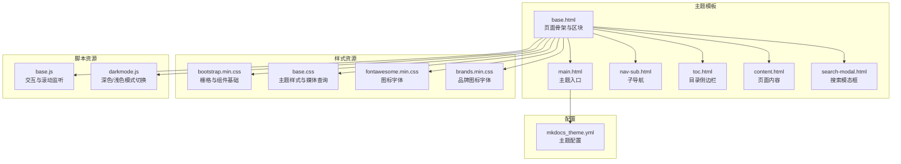
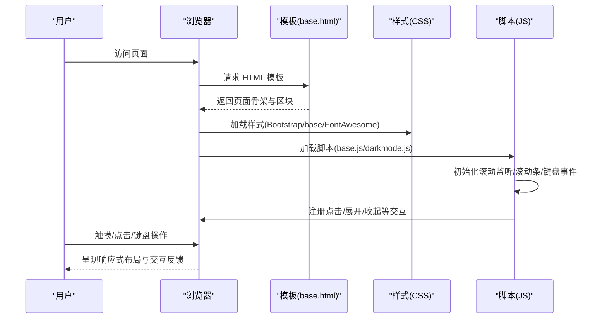
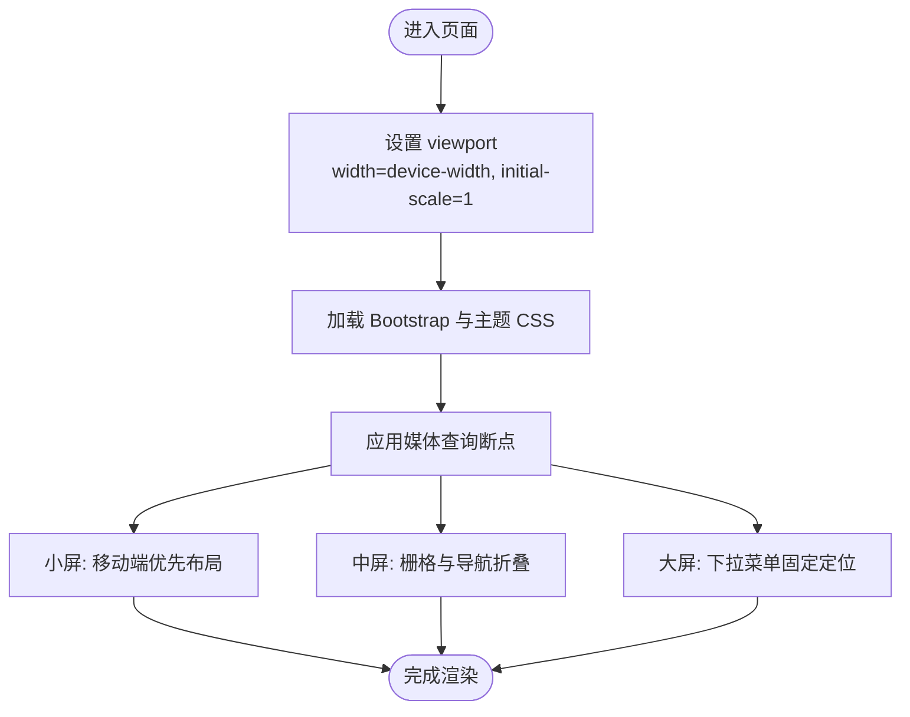
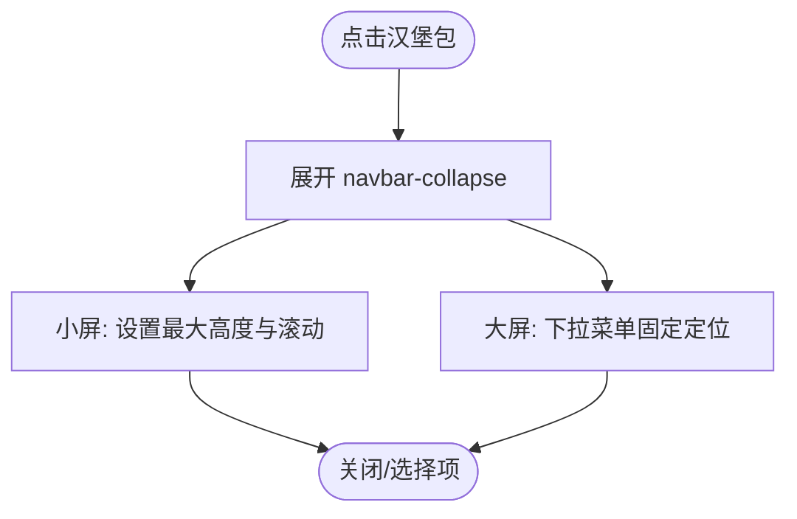
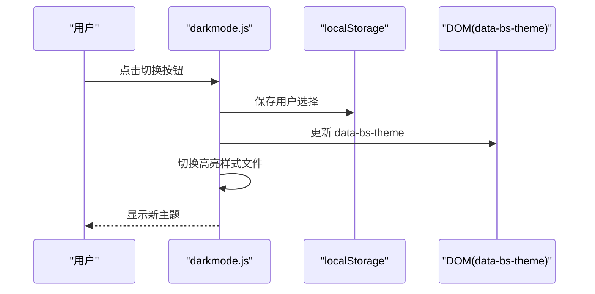
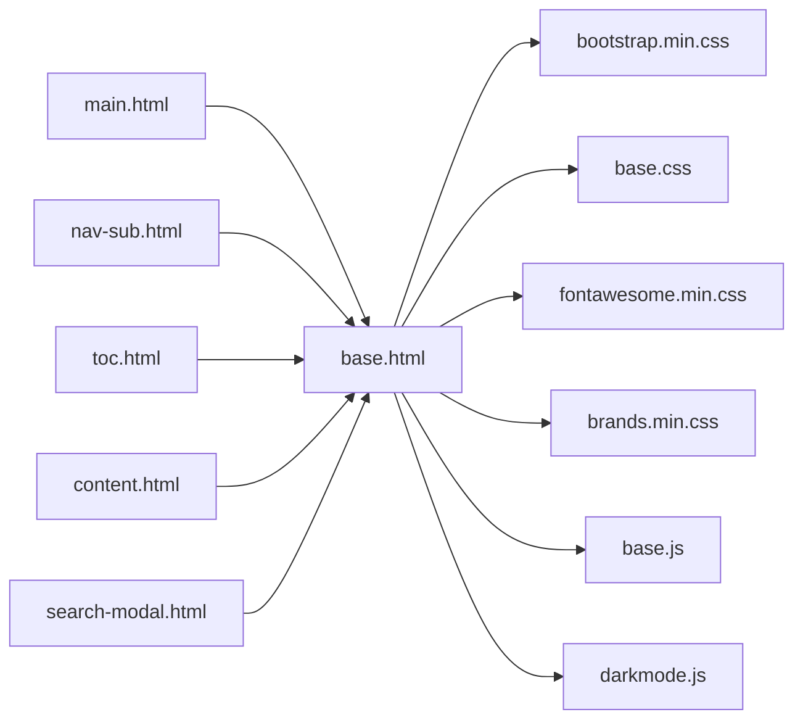

# 响应式设计

<cite>
**本文引用的文件**
- [mkdocs/themes/mkdocs/base.html](file://mkdocs/themes/mkdocs/base.html)
- [mkdocs/themes/mkdocs/main.html](file://mkdocs/themes/mkdocs/main.html)
- [mkdocs/themes/mkdocs/nav-sub.html](file://mkdocs/themes/mkdocs/nav-sub.html)
- [mkdocs/themes/mkdocs/toc.html](file://mkdocs/themes/mkdocs/toc.html)
- [mkdocs/themes/mkdocs/css/base.css](file://mkdocs/themes/mkdocs/css/base.css)
- [mkdocs/themes/mkdocs/js/base.js](file://mkdocs/themes/mkdocs/js/base.js)
- [mkdocs/themes/mkdocs/js/darkmode.js](file://mkdocs/themes/mkdocs/js/darkmode.js)
- [mkdocs/themes/mkdocs/css/bootstrap.min.css](file://mkdocs/themes/mkdocs/css/bootstrap.min.css)
- [mkdocs/themes/mkdocs/css/fontawesome.min.css](file://mkdocs/themes/mkdocs/css/fontawesome.min.css)
- [mkdocs/themes/mkdocs/css/brands.min.css](file://mkdocs/themes/mkdocs/css/brands.min.css)
- [mkdocs/themes/mkdocs/content.html](file://mkdocs/themes/mkdocs/content.html)
- [mkdocs/themes/mkdocs/search-modal.html](file://mkdocs/themes/mkdocs/search-modal.html)
- [mkdocs/themes/mkdocs/mkdocs_theme.yml](file://mkdocs/themes/mkdocs/mkdocs_theme.yml)
- [docs/user-guide/customizing-your-theme.md](file://docs/user-guide/customizing-your-theme.md)
- [docs/dev-guide/themes.md](file://docs/dev-guide/themes.md)
- [docs/css/extra.css](file://docs/css/extra.css)
</cite>

## 目录
1. [简介](#简介)
2. [项目结构](#项目结构)
3. [核心组件](#核心组件)
4. [架构总览](#架构总览)
5. [详细组件分析](#详细组件分析)
6. [依赖关系分析](#依赖关系分析)
7. [性能考量](#性能考量)
8. [故障排查指南](#故障排查指南)
9. [结论](#结论)
10. [附录](#附录)

## 简介
本指南围绕 MkDocs 内置主题的响应式设计实践，系统讲解 CSS 媒体查询与断点、移动端导航与菜单适配、触摸设备交互优化、字体与间距的响应式调整、图片与媒体内容的自适应处理、浏览器兼容性与 polyfill 使用、响应式测试与调试方法，并结合仓库中的真实实现进行案例解析，帮助读者在不改动核心逻辑的前提下，安全地扩展与定制响应式体验。

## 项目结构
MkDocs 主题采用模板与样式分离的组织方式：HTML 模板负责结构与区块，CSS 负责样式与布局，JS 负责交互与行为增强；同时通过配置文件控制主题行为（如颜色模式、导航深度等）。

图表来源
- [mkdocs/themes/mkdocs/base.html](file://mkdocs/themes/mkdocs/base.html#L1-L252)
- [mkdocs/themes/mkdocs/main.html](file://mkdocs/themes/mkdocs/main.html#L1-L11)
- [mkdocs/themes/mkdocs/nav-sub.html](file://mkdocs/themes/mkdocs/nav-sub.html#L1-L15)
- [mkdocs/themes/mkdocs/toc.html](file://mkdocs/themes/mkdocs/toc.html#L1-L27)
- [mkdocs/themes/mkdocs/css/bootstrap.min.css](file://mkdocs/themes/mkdocs/css/bootstrap.min.css#L1-L11)
- [mkdocs/themes/mkdocs/css/base.css](file://mkdocs/themes/mkdocs/css/base.css#L1-L367)
- [mkdocs/themes/mkdocs/js/base.js](file://mkdocs/themes/mkdocs/js/base.js#L1-L288)
- [mkdocs/themes/mkdocs/js/darkmode.js](file://mkdocs/themes/mkdocs/js/darkmode.js#L1-L66)
- [mkdocs/themes/mkdocs/css/fontawesome.min.css](file://mkdocs/themes/mkdocs/css/fontawesome.min.css#L1-L9)
- [mkdocs/themes/mkdocs/css/brands.min.css](file://mkdocs/themes/mkdocs/css/brands.min.css#L1-L6)
- [mkdocs/themes/mkdocs/mkdocs_theme.yml](file://mkdocs/themes/mkdocs/mkdocs_theme.yml#L1-L29)

章节来源
- [mkdocs/themes/mkdocs/base.html](file://mkdocs/themes/mkdocs/base.html#L1-L252)
- [mkdocs/themes/mkdocs/css/bootstrap.min.css](file://mkdocs/themes/mkdocs/css/bootstrap.min.css#L1-L11)
- [mkdocs/themes/mkdocs/css/base.css](file://mkdocs/themes/mkdocs/css/base.css#L1-L367)
- [mkdocs/themes/mkdocs/js/base.js](file://mkdocs/themes/mkdocs/js/base.js#L1-L288)
- [mkdocs/themes/mkdocs/js/darkmode.js](file://mkdocs/themes/mkdocs/js/darkmode.js#L1-L66)
- [mkdocs/themes/mkdocs/mkdocs_theme.yml](file://mkdocs/themes/mkdocs/mkdocs_theme.yml#L1-L29)

## 核心组件
- 页面骨架与区块：通过 base.html 定义 viewport、样式链接、脚本注入、导航、内容区、页脚等；支持用户自定义区块覆盖。
- 导航与目录：使用 Bootstrap 的 navbar 组件与折叠行为，配合自定义样式实现移动端可折叠与滚动定位。
- 深色/浅色模式：通过 data-bs-theme 属性与本地存储实现自动/手动切换，并同步高亮样式。
- 搜索与键盘快捷键：内置搜索模态框与键盘导航，提升移动端可用性。
- 自定义样式与主题配置：通过 extra_css 与 mkdocs_theme.yml 扩展与定制主题行为。

章节来源
- [mkdocs/themes/mkdocs/base.html](file://mkdocs/themes/mkdocs/base.html#L1-L252)
- [mkdocs/themes/mkdocs/mkdocs_theme.yml](file://mkdocs/themes/mkdocs/mkdocs_theme.yml#L1-L29)
- [docs/user-guide/customizing-your-theme.md](file://docs/user-guide/customizing-your-theme.md#L1-L227)
- [docs/dev-guide/themes.md](file://docs/dev-guide/themes.md#L1-L800)

## 架构总览
下图展示了页面加载到交互的关键流程：模板渲染 → 样式加载 → 脚本初始化 → 用户交互增强。

图表来源
- [mkdocs/themes/mkdocs/base.html](file://mkdocs/themes/mkdocs/base.html#L1-L252)
- [mkdocs/themes/mkdocs/css/bootstrap.min.css](file://mkdocs/themes/mkdocs/css/bootstrap.min.css#L1-L11)
- [mkdocs/themes/mkdocs/css/base.css](file://mkdocs/themes/mkdocs/css/base.css#L1-L367)
- [mkdocs/themes/mkdocs/js/base.js](file://mkdocs/themes/mkdocs/js/base.js#L1-L288)
- [mkdocs/themes/mkdocs/js/darkmode.js](file://mkdocs/themes/mkdocs/js/darkmode.js#L1-L66)

## 详细组件分析

### 媒体查询与断点设置
- Bootstrap 断点：主题内使用了完整的 Bootstrap 断点体系（xs/sm/md/lg/xl/xxl），并在 CSS 中广泛使用 min-width/max-width 媒体查询实现不同屏幕下的布局切换。
- 主题特定断点：在 base.css 中定义了针对导航与下拉菜单的断点规则，确保在小屏设备上滚动与溢出处理得当，在大屏设备上提供更丰富的下拉层级与固定定位。

图表来源
- [mkdocs/themes/mkdocs/base.html](file://mkdocs/themes/mkdocs/base.html#L7-L7)
- [mkdocs/themes/mkdocs/css/bootstrap.min.css](file://mkdocs/themes/mkdocs/css/bootstrap.min.css#L1-L11)
- [mkdocs/themes/mkdocs/css/base.css](file://mkdocs/themes/mkdocs/css/base.css#L299-L367)

章节来源
- [mkdocs/themes/mkdocs/css/bootstrap.min.css](file://mkdocs/themes/mkdocs/css/bootstrap.min.css#L1-L11)
- [mkdocs/themes/mkdocs/css/base.css](file://mkdocs/themes/mkdocs/css/base.css#L299-L367)

### 移动端导航与菜单适配
- 折叠触发器：通过 navbar-toggler 在小屏设备上显示“汉堡包”菜单，点击后展开导航列表。
- 导航折叠容器：使用 navbar-collapse 并结合 data-bs-toggle/data-bs-target 实现 Bootstrap 的折叠动画与滚动溢出处理。
- 子菜单与下拉：在大屏设备上启用固定定位与滚动条，小屏设备上提供垂直滚动与图标翻转指示器。

图表来源
- [mkdocs/themes/mkdocs/base.html](file://mkdocs/themes/mkdocs/base.html#L72-L205)
- [mkdocs/themes/mkdocs/css/base.css](file://mkdocs/themes/mkdocs/css/base.css#L299-L367)
- [mkdocs/themes/mkdocs/nav-sub.html](file://mkdocs/themes/mkdocs/nav-sub.html#L1-L15)

章节来源
- [mkdocs/themes/mkdocs/base.html](file://mkdocs/themes/mkdocs/base.html#L72-L205)
- [mkdocs/themes/mkdocs/nav-sub.html](file://mkdocs/themes/mkdocs/nav-sub.html#L1-L15)
- [mkdocs/themes/mkdocs/css/base.css](file://mkdocs/themes/mkdocs/css/base.css#L299-L367)

### 触摸设备交互优化
- 触摸目标尺寸：按钮与链接具备合适的最小点击区域，避免误触。
- 滚动与粘性定位：滚动监听动态更新侧边栏与标题锚点的顶部偏移，保证内容可见性。
- 键盘与焦点：为键盘快捷键提供焦点管理与模态框自动聚焦，提升可访问性。

章节来源
- [mkdocs/themes/mkdocs/js/base.js](file://mkdocs/themes/mkdocs/js/base.js#L12-L160)
- [mkdocs/themes/mkdocs/search-modal.html](file://mkdocs/themes/mkdocs/search-modal.html#L1-L22)

### 字体大小与间距的响应式调整
- 字体缩放：Bootstrap 在大屏设备上使用 calc() 动态计算标题字号，确保视觉层级一致。
- 行高与间距：通过 CSS 变量与栅格系统统一行高与内外边距，减少重复定义。
- 主题样式：base.css 对 h1/h2/h3 等标题设置了权重与字号，配合媒体查询在小屏上进一步优化可读性。

章节来源
- [mkdocs/themes/mkdocs/css/bootstrap.min.css](file://mkdocs/themes/mkdocs/css/bootstrap.min.css#L1-L11)
- [mkdocs/themes/mkdocs/css/base.css](file://mkdocs/themes/mkdocs/css/base.css#L47-L61)

### 图片与媒体内容的自适应处理
- 图片自适应：内容区图片设置 max-width: 100%，保持宽高比与容器比例一致。
- SVG 自适应：卡片内的 SVG 设置宽度 100% 并留白填充，适配不同容器宽度。
- 媒体背景网格：body::before 使用网格背景图作为“固定背景”，避免滚动时性能问题。

章节来源
- [mkdocs/themes/mkdocs/css/base.css](file://mkdocs/themes/mkdocs/css/base.css#L36-L45)
- [docs/css/extra.css](file://docs/css/extra.css#L40-L44)

### 浏览器兼容性与 polyfill 使用
- CSS 变量与暗色模式：通过 data-bs-theme 属性与 CSS 变量实现跨浏览器的颜色主题切换。
- 高亮样式：根据当前主题自动切换高亮样式文件，避免硬编码。
- 降级策略：在存在 prefers-reduced-motion 的情况下，禁用或简化动画过渡。

章节来源
- [mkdocs/themes/mkdocs/js/darkmode.js](file://mkdocs/themes/mkdocs/js/darkmode.js#L1-L66)
- [mkdocs/themes/mkdocs/base.html](file://mkdocs/themes/mkdocs/base.html#L26-L29)

### 深色/浅色模式与主题切换
- 切换机制：通过 data-bs-theme 属性与本地存储记录用户偏好，支持“自动/浅色/深色”三种模式。
- 同步高亮：根据当前模式动态启用对应高亮样式文件。
- 系统联动：监听系统颜色模式变化，自动更新站点主题。

图表来源
- [mkdocs/themes/mkdocs/js/darkmode.js](file://mkdocs/themes/mkdocs/js/darkmode.js#L1-L66)
- [mkdocs/themes/mkdocs/base.html](file://mkdocs/themes/mkdocs/base.html#L26-L29)

章节来源
- [mkdocs/themes/mkdocs/js/darkmode.js](file://mkdocs/themes/mkdocs/js/darkmode.js#L1-L66)
- [mkdocs/themes/mkdocs/base.html](file://mkdocs/themes/mkdocs/base.html#L26-L29)

### 搜索与键盘导航
- 搜索模态框：提供独立的搜索输入与结果容器，支持回车打开与点击关闭。
- 键盘快捷键：通过事件监听绑定快捷键，支持打开搜索、跳转上下页等操作。
- 自动聚焦：模态框显示时自动聚焦到搜索输入框，提升移动端效率。

章节来源
- [mkdocs/themes/mkdocs/search-modal.html](file://mkdocs/themes/mkdocs/search-modal.html#L1-L22)
- [mkdocs/themes/mkdocs/js/base.js](file://mkdocs/themes/mkdocs/js/base.js#L54-L81)

### 主题配置与自定义
- 主题配置：通过 mkdocs_theme.yml 控制导航深度、颜色模式、快捷键等。
- 自定义样式：通过 extra_css 引入自定义样式，不影响核心模板结构。
- 模板覆盖：通过 custom_dir 与 main.html 覆盖默认区块，实现最小改动的定制。

章节来源
- [mkdocs/themes/mkdocs/mkdocs_theme.yml](file://mkdocs/themes/mkdocs/mkdocs_theme.yml#L1-L29)
- [docs/user-guide/customizing-your-theme.md](file://docs/user-guide/customizing-your-theme.md#L1-L227)
- [docs/dev-guide/themes.md](file://docs/dev-guide/themes.md#L1-L800)

## 依赖关系分析
- 模板依赖：main.html 继承 base.html，其他子模板（nav-sub.html、toc.html、content.html、search-modal.html）被 base.html 包含。
- 样式依赖：base.css 依赖于 Bootstrap 的栅格与组件样式；FontAwesome 提供图标字体。
- 脚本依赖：base.js 依赖 Bootstrap 的 JS 组件（ScrollSpy、Modal、Dropdown 等）；darkmode.js 依赖 data-bs-theme 与本地存储。

图表来源
- [mkdocs/themes/mkdocs/main.html](file://mkdocs/themes/mkdocs/main.html#L1-L11)
- [mkdocs/themes/mkdocs/base.html](file://mkdocs/themes/mkdocs/base.html#L1-L252)
- [mkdocs/themes/mkdocs/nav-sub.html](file://mkdocs/themes/mkdocs/nav-sub.html#L1-L15)
- [mkdocs/themes/mkdocs/toc.html](file://mkdocs/themes/mkdocs/toc.html#L1-L27)
- [mkdocs/themes/mkdocs/content.html](file://mkdocs/themes/mkdocs/content.html#L1-L10)
- [mkdocs/themes/mkdocs/search-modal.html](file://mkdocs/themes/mkdocs/search-modal.html#L1-L22)
- [mkdocs/themes/mkdocs/css/bootstrap.min.css](file://mkdocs/themes/mkdocs/css/bootstrap.min.css#L1-L11)
- [mkdocs/themes/mkdocs/css/base.css](file://mkdocs/themes/mkdocs/css/base.css#L1-L367)
- [mkdocs/themes/mkdocs/css/fontawesome.min.css](file://mkdocs/themes/mkdocs/css/fontawesome.min.css#L1-L9)
- [mkdocs/themes/mkdocs/css/brands.min.css](file://mkdocs/themes/mkdocs/css/brands.min.css#L1-L6)
- [mkdocs/themes/mkdocs/js/base.js](file://mkdocs/themes/mkdocs/js/base.js#L1-L288)
- [mkdocs/themes/mkdocs/js/darkmode.js](file://mkdocs/themes/mkdocs/js/darkmode.js#L1-L66)

章节来源
- [mkdocs/themes/mkdocs/base.html](file://mkdocs/themes/mkdocs/base.html#L1-L252)
- [mkdocs/themes/mkdocs/css/bootstrap.min.css](file://mkdocs/themes/mkdocs/css/bootstrap.min.css#L1-L11)
- [mkdocs/themes/mkdocs/js/base.js](file://mkdocs/themes/mkdocs/js/base.js#L1-L288)
- [mkdocs/themes/mkdocs/js/darkmode.js](file://mkdocs/themes/mkdocs/js/darkmode.js#L1-L66)

## 性能考量
- 滚动性能：body::before 使用 fixed 与 will-change 减少滚动重绘开销；避免在大图上使用 fixed 背景导致的卡顿。
- 样式加载：按需引入高亮样式，避免不必要的网络请求；在非目标模式下禁用对应样式以减少渲染负担。
- 脚本延迟：将非关键脚本置于文档末尾或按需加载，减少首屏阻塞。

## 故障排查指南
- 搜索框无响应：检查是否启用了 search 插件，确认模板中包含搜索区块与脚本注入。
- 深色模式不生效：确认 data-bs-theme 属性是否正确设置，以及高亮样式文件是否按当前模式启用。
- 导航无法折叠：检查 navbar-toggler 的 data-bs-toggle 与 data-bs-target 是否指向正确的容器 ID。
- 图标不显示：确认 fontawesome 与 brands 字体资源路径正确，且未被 CSP 或网络策略拦截。

章节来源
- [mkdocs/themes/mkdocs/base.html](file://mkdocs/themes/mkdocs/base.html#L1-L252)
- [mkdocs/themes/mkdocs/js/darkmode.js](file://mkdocs/themes/mkdocs/js/darkmode.js#L1-L66)
- [mkdocs/themes/mkdocs/search-modal.html](file://mkdocs/themes/mkdocs/search-modal.html#L1-L22)

## 结论
MkDocs 内置主题通过 Bootstrap 的栅格系统与组件、合理的媒体查询断点、以及轻量的 JS 交互，构建了良好的响应式基础。结合主题配置与自定义样式，可以在不破坏现有结构的前提下，安全地扩展移动端体验与可访问性。建议在定制时遵循“最小改动、可维护性优先”的原则，充分利用模板区块与配置选项。

## 附录
- 响应式测试清单
  - 在多种设备与浏览器中验证导航折叠、滚动定位、下拉菜单与模态框行为。
  - 检查图片与 SVG 的自适应表现，确保在不同 DPR 下清晰度。
  - 验证深色/浅色模式在系统设置变化时的同步与持久化。
  - 使用开发者工具的设备模拟与网络节流测试，评估加载与交互性能。
- 常见问题速查
  - 搜索功能缺失：确认已启用 search 插件并在模板中包含搜索区块。
  - 快捷键无效：检查键盘事件绑定与模态框焦点管理。
  - 自定义样式未生效：确认 extra_css 路径正确且未被覆盖。