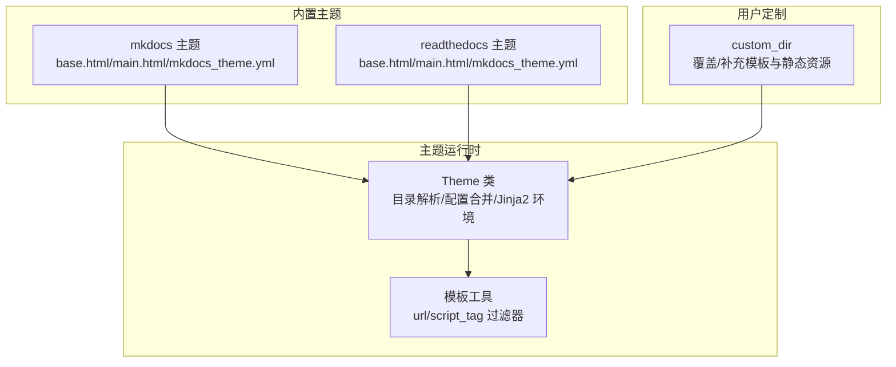
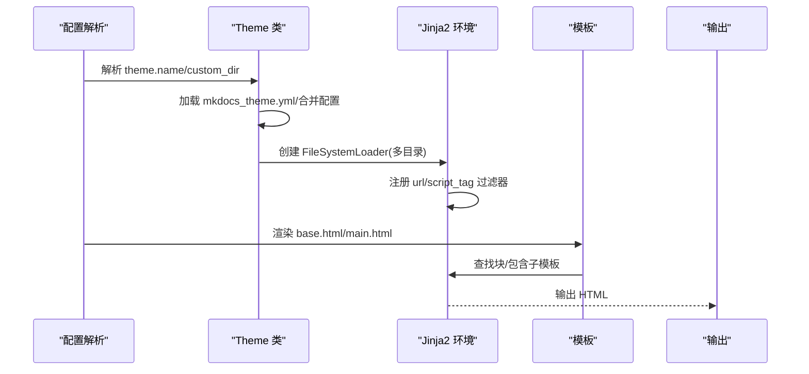
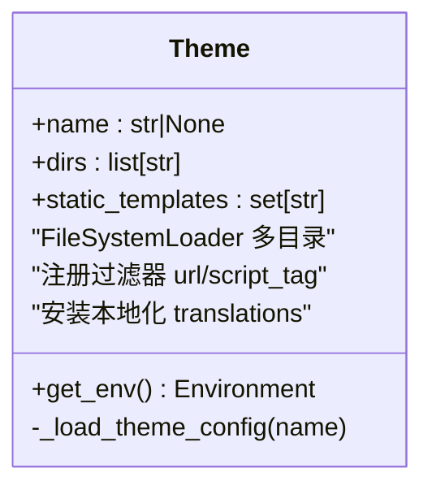
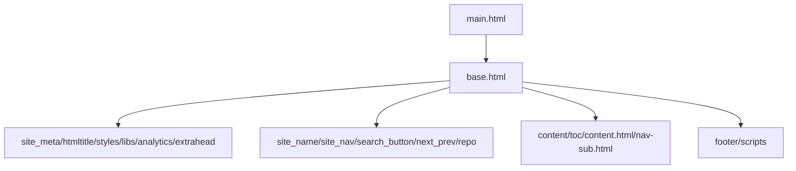
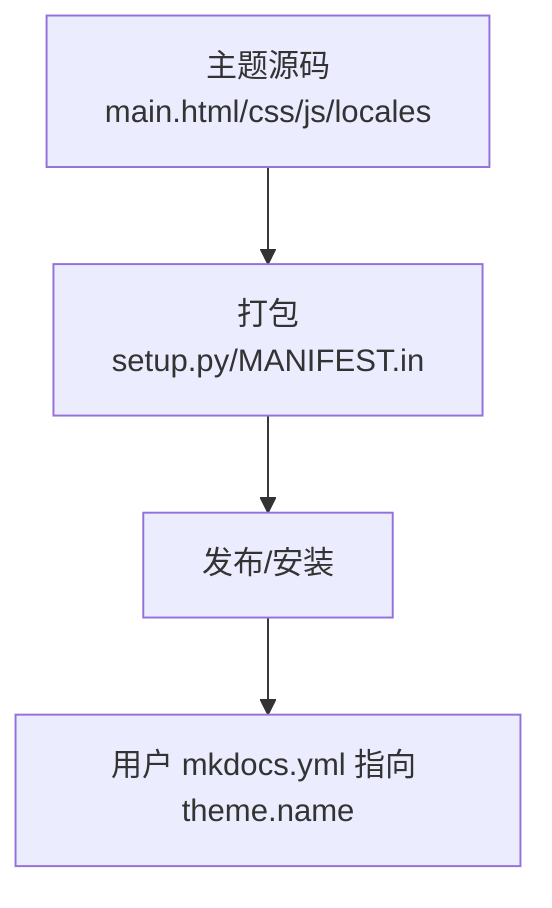
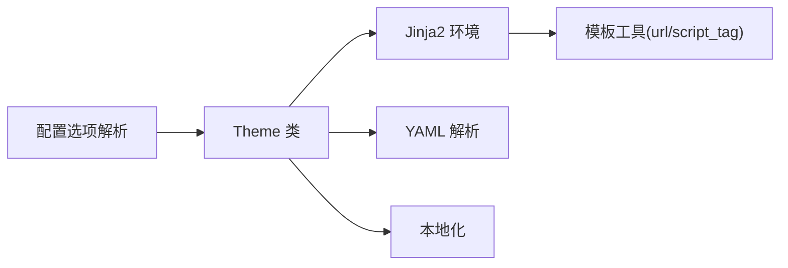

# 自定义主题开发

<cite>
**本文引用的文件**
- [docs/dev-guide/themes.md](file://docs/dev-guide/themes.md)
- [docs/user-guide/customizing-your-theme.md](file://docs/user-guide/customizing-your-theme.md)
- [mkdocs/theme.py](file://mkdocs/theme.py)
- [mkdocs/utils/templates.py](file://mkdocs/utils/templates.py)
- [mkdocs/themes/mkdocs/mkdocs_theme.yml](file://mkdocs/themes/mkdocs/mkdocs_theme.yml)
- [mkdocs/themes/readthedocs/mkdocs_theme.yml](file://mkdocs/themes/readthedocs/mkdocs_theme.yml)
- [mkdocs/themes/mkdocs/base.html](file://mkdocs/themes/mkdocs/base.html)
- [mkdocs/themes/mkdocs/main.html](file://mkdocs/themes/mkdocs/main.html)
- [mkdocs/themes/readthedocs/base.html](file://mkdocs/themes/readthedocs/base.html)
- [mkdocs/themes/readthedocs/main.html](file://mkdocs/themes/readthedocs/main.html)
- [mkdocs/config/config_options.py](file://mkdocs/config/config_options.py)
- [mkdocs/utils/__init__.py](file://mkdocs/utils/__init__.py)
- [mkdocs/themes/babel.cfg](file://mkdocs/themes/babel.cfg)
- [setup.py](file://setup.py)
</cite>

## 目录
1. [引言](#引言)
2. [项目结构](#项目结构)
3. [核心组件](#核心组件)
4. [架构总览](#架构总览)
5. [详细组件分析](#详细组件分析)
6. [依赖分析](#依赖分析)
7. [性能考虑](#性能考虑)
8. [故障排查指南](#故障排查指南)
9. [结论](#结论)
10. [附录](#附录)

## 引言
本指南面向希望创建、定制与分发 MkDocs 自定义主题的开发者，系统讲解主题开发的基本原理、模板与数据流、Jinja2 继承与块机制、静态资源与 CDN 策略、打包与分发流程，并提供调试与性能优化建议及完整示例路径。

## 项目结构
围绕主题开发的关键目录与文件包括：
- 内置主题：mkdocs 与 readthedocs 主题及其配置文件、模板与静态资源
- 主题运行时：Theme 类负责加载主题目录、合并配置、构建 Jinja2 环境
- 模板工具：URL 规范化与脚本标签过滤器
- 用户定制：通过 custom_dir 覆盖父主题或独立主题
- 打包与本地化：主题元数据、入口点与翻译提取配置

图表来源
- [mkdocs/theme.py](file://mkdocs/theme.py#L158-L167)
- [mkdocs/utils/templates.py](file://mkdocs/utils/templates.py#L37-L56)
- [mkdocs/themes/mkdocs/base.html](file://mkdocs/themes/mkdocs/base.html#L1-L252)
- [mkdocs/themes/readthedocs/base.html](file://mkdocs/themes/readthedocs/base.html#L1-L200)

章节来源
- [mkdocs/theme.py](file://mkdocs/theme.py#L54-L68)
- [mkdocs/utils/templates.py](file://mkdocs/utils/templates.py#L25-L56)

## 核心组件
- 主题类 Theme：管理主题目录顺序（优先 custom_dir，再父主题，最后 MkDocs 内置模板），加载 mkdocs_theme.yml 并合并配置，构建 Jinja2 环境并注册过滤器
- 模板过滤器：url 用于相对/绝对链接规范化；script_tag 将 extra_javascript 的对象安全渲染为 script 标签
- 内置主题：mkdocs 与 readthedocs 提供完整的模板继承体系（base.html → main.html），并定义可被覆盖的块（如 styles、scripts、content 等）

章节来源
- [mkdocs/theme.py](file://mkdocs/theme.py#L23-L104)
- [mkdocs/theme.py](file://mkdocs/theme.py#L124-L167)
- [mkdocs/utils/templates.py](file://mkdocs/utils/templates.py#L37-L56)
- [mkdocs/themes/mkdocs/base.html](file://mkdocs/themes/mkdocs/base.html#L1-L252)
- [mkdocs/themes/readthedocs/base.html](file://mkdocs/themes/readthedocs/base.html#L1-L200)

## 架构总览
主题加载与渲染的总体流程如下：

图表来源
- [mkdocs/theme.py](file://mkdocs/theme.py#L158-L167)
- [mkdocs/utils/templates.py](file://mkdocs/utils/templates.py#L37-L56)
- [mkdocs/themes/mkdocs/base.html](file://mkdocs/themes/mkdocs/base.html#L1-L252)
- [mkdocs/themes/readthedocs/base.html](file://mkdocs/themes/readthedocs/base.html#L1-L200)

## 详细组件分析

### 主题类与目录解析
- 目录优先级：custom_dir → 父主题目录 → MkDocs 内置模板目录 → 用户静态模板集合
- 配置合并：读取 mkdocs_theme.yml，支持 extends 继承链；合并 static_templates 与用户配置
- 环境构建：禁用自动重载，注册 url 与 script_tag 过滤器，安装本地化翻译

图表来源
- [mkdocs/theme.py](file://mkdocs/theme.py#L23-L104)
- [mkdocs/theme.py](file://mkdocs/theme.py#L124-L167)

章节来源
- [mkdocs/theme.py](file://mkdocs/theme.py#L54-L68)
- [mkdocs/theme.py](file://mkdocs/theme.py#L124-L167)

### 模板变量与上下文
- 全局上下文：config、nav、pages、base_url、mkdocs_version、build_date_utc、page（可能为空）
- 页面上下文：page 对象包含 title、content、toc、meta、url、abs_url、canonical_url、edit_url、is_* 等属性
- 导航对象：section/page/link，支持 children 与 active 状态

章节来源
- [docs/dev-guide/themes.md](file://docs/dev-guide/themes.md#L228-L498)

### 模板过滤器
- url：根据当前页面与 base_url 规范化链接
- script_tag：将 extra_javascript 的对象渲染为带 type/defer/async 的 script 标签

章节来源
- [mkdocs/utils/templates.py](file://mkdocs/utils/templates.py#L37-L56)

### 模板继承与块机制
- 基础模板：base.html 定义大量可覆盖块（如 site_meta、htmltitle、styles、libs、analytics、extrahead、site_name、site_nav、search_button、next_prev、repo、content、footer、scripts）
- 入口模板：main.html 通常仅扩展 base.html 并在其中重新定义若干块
- 子模板：如 toc.html、content.html、nav-sub.html 等通过 include 在 base.html 中使用

图表来源
- [mkdocs/themes/mkdocs/base.html](file://mkdocs/themes/mkdocs/base.html#L1-L252)
- [mkdocs/themes/mkdocs/main.html](file://mkdocs/themes/mkdocs/main.html#L1-L11)
- [mkdocs/themes/readthedocs/base.html](file://mkdocs/themes/readthedocs/base.html#L1-L200)
- [mkdocs/themes/readthedocs/main.html](file://mkdocs/themes/readthedocs/main.html#L1-L11)

章节来源
- [docs/dev-guide/themes.md](file://docs/dev-guide/themes.md#L111-L125)
- [docs/user-guide/customizing-your-theme.md](file://docs/user-guide/customizing-your-theme.md#L130-L175)

### 主题配置与静态模板
- mkdocs_theme.yml：定义 static_templates、locale、搜索与高亮选项、导航深度、快捷键等
- 内置主题示例：
  - mkdocs：include_search_page=false，search_index_only=false，highlightjs 开关与样式
  - readthedocs：include_search_page=true，search_index_only=false，侧边栏与导航配置

章节来源
- [mkdocs/themes/mkdocs/mkdocs_theme.yml](file://mkdocs/themes/mkdocs/mkdocs_theme.yml#L1-L29)
- [mkdocs/themes/readthedocs/mkdocs_theme.yml](file://mkdocs/themes/readthedocs/mkdocs_theme.yml#L1-L26)

### 搜索与主题集成
- 插件开关：通过 config.plugins 判断是否启用搜索
- 基础模板需注入 base_url 变量，以便搜索脚本定位
- 搜索页策略：include_search_page 控制是否生成 dedicated search/search.html

章节来源
- [docs/dev-guide/themes.md](file://docs/dev-guide/themes.md#L691-L796)

### 静态资源与 CDN 策略
- extra_css/extra_javascript：通过模板直接引入
- highlight.js：可从 CDN 加载并在 base.html 中按主题配色条件性启用
- 图标字体与第三方库：可通过 CDN 或本地资源引入，注意 url 过滤器保证相对路径正确

章节来源
- [docs/dev-guide/themes.md](file://docs/dev-guide/themes.md#L126-L177)
- [mkdocs/themes/mkdocs/base.html](file://mkdocs/themes/mkdocs/base.html#L26-L42)
- [mkdocs/themes/readthedocs/base.html](file://mkdocs/themes/readthedocs/base.html#L25-L51)

### 用户定制与覆盖
- 使用 custom_dir 覆盖父主题同名模板与静态资源
- 通过 super() 合并父主题块内容，避免破坏原有库与脚本
- 支持仅替换部分文件，其余沿用父主题

章节来源
- [docs/user-guide/customizing-your-theme.md](file://docs/user-guide/customizing-your-theme.md#L47-L227)

### 打包与分发
- 包布局：setup.py、MANIFEST.in、主题目录（含 __init__.py、mkdocs_theme.yml、模板与媒体文件）
- 入口点：entry_points['mkdocs.themes'] 指定主题名称与包映射
- 本地化：babel.cfg 配置 Jinja2 提取规则，便于翻译

图表来源
- [docs/dev-guide/themes.md](file://docs/dev-guide/themes.md#L827-L897)
- [mkdocs/themes/babel.cfg](file://mkdocs/themes/babel.cfg#L1-L7)

章节来源
- [docs/dev-guide/themes.md](file://docs/dev-guide/themes.md#L814-L897)
- [mkdocs/themes/babel.cfg](file://mkdocs/themes/babel.cfg#L1-L7)

## 依赖分析
- 主题类依赖：Jinja2 FileSystemLoader、YAML 解析、本地化模块、模板工具
- 模板依赖：过滤器依赖 URL 规范化工具
- 配置依赖：Theme 构造函数接收 theme.name 与 custom_dir，最终由配置解析模块校验与补全

图表来源
- [mkdocs/config/config_options.py](file://mkdocs/config/config_options.py#L819-L846)
- [mkdocs/theme.py](file://mkdocs/theme.py#L158-L167)
- [mkdocs/utils/templates.py](file://mkdocs/utils/templates.py#L37-L56)

章节来源
- [mkdocs/config/config_options.py](file://mkdocs/config/config_options.py#L819-L846)
- [mkdocs/theme.py](file://mkdocs/theme.py#L158-L167)

## 性能考虑
- 禁用模板自动重载：Theme 构建环境时关闭 auto_reload，避免构建中模板编辑带来的开销
- CDN 与缓存：合理使用 CDN 加载第三方库，结合浏览器缓存策略提升加载速度
- 资源合并：将多个 CSS/JS 合并以减少请求数，同时保留按需加载能力
- 搜索索引：预构建索引可显著提升大站点搜索性能（见主题配置项）

章节来源
- [mkdocs/theme.py](file://mkdocs/theme.py#L160-L162)
- [mkdocs/themes/mkdocs/mkdocs_theme.yml](file://mkdocs/themes/mkdocs/mkdocs_theme.yml#L8-L14)

## 故障排查指南
- 主题未找到：确认 theme.name 是否存在于已安装主题列表
- custom_dir 无效：确保 theme.name 正确且 custom_dir 为绝对路径或相对于配置文件的相对路径
- 模板未生效：检查模板是否位于主题目录且未被忽略（. 开头的文件会被忽略；Markdown 文档与 README 文件会被忽略）
- 链接错误：使用 url 过滤器处理相对路径；确认 base_url 注入
- extra_javascript 未加载：确认使用 script_tag 过滤器渲染对象格式的脚本条目

章节来源
- [docs/dev-guide/themes.md](file://docs/dev-guide/themes.md#L178-L218)
- [docs/user-guide/customizing-your-theme.md](file://docs/user-guide/customizing-your-theme.md#L47-L64)
- [mkdocs/utils/templates.py](file://mkdocs/utils/templates.py#L37-L56)
- [mkdocs/config/config_options.py](file://mkdocs/config/config_options.py#L833-L846)

## 结论
自定义主题的核心在于理解 Theme 类如何组织目录与配置、Jinja2 如何通过块机制实现可插拔的页面结构，以及如何通过 extra_css/extra_javascript 与 CDN 实现灵活的静态资源管理。遵循内置主题的块命名约定与模板继承模式，配合合理的打包与本地化配置，即可高效完成主题开发、定制与分发。

## 附录
- 示例路径（不展示具体代码内容）：
  - 最简主题模板：[基础主题示例](file://docs/dev-guide/themes.md#L83-L102)
  - 模板变量参考：[全局与页面上下文](file://docs/dev-guide/themes.md#L228-L498)
  - 块覆盖示例：[覆盖模板块](file://docs/user-guide/customizing-your-theme.md#L130-L175)
  - URL 与脚本过滤器：[url/script_tag](file://mkdocs/utils/templates.py#L37-L56)
  - mkdocs 主题配置：[mkdocs_theme.yml](file://mkdocs/themes/mkdocs/mkdocs_theme.yml#L1-L29)
  - readthedocs 主题配置：[mkdocs_theme.yml](file://mkdocs/themes/readthedocs/mkdocs_theme.yml#L1-L26)
  - 主题打包模板：[包布局与入口点](file://docs/dev-guide/themes.md#L827-L897)
  - 安装方式提示：[setup.py 说明](file://setup.py#L1-L2)