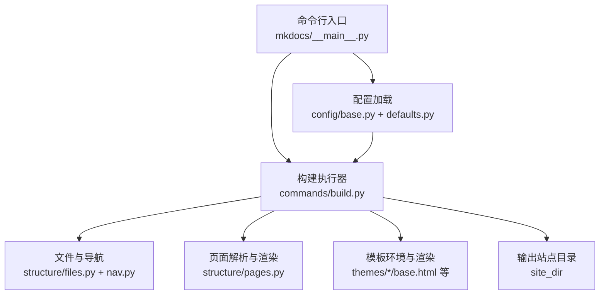
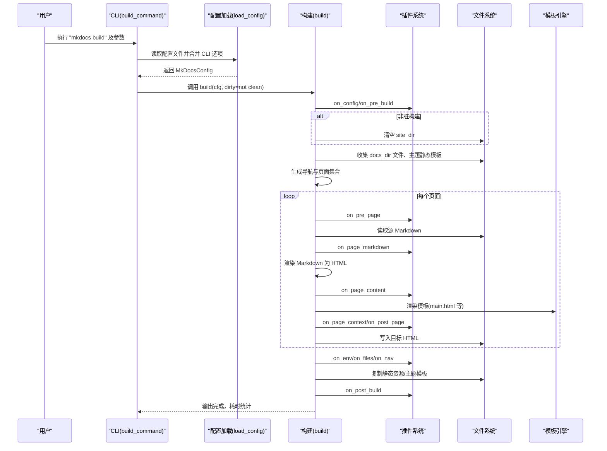
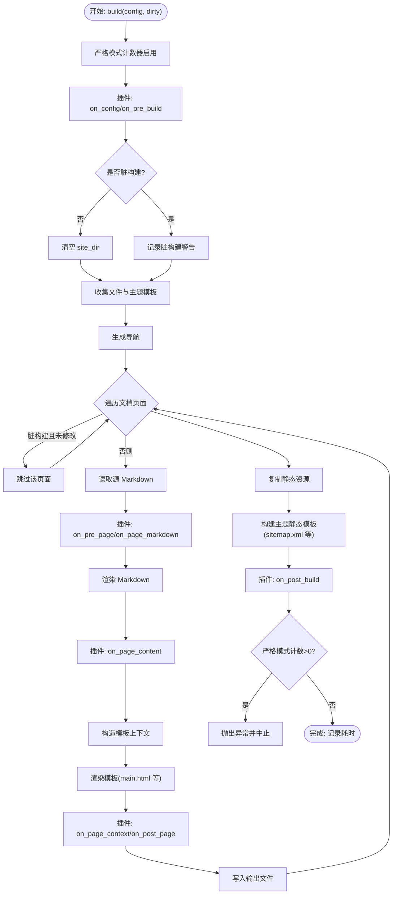
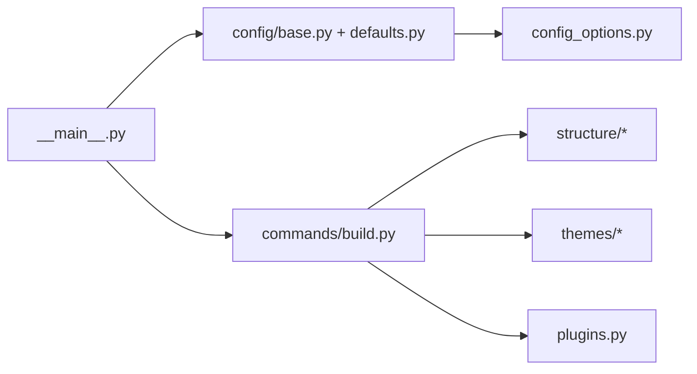

# build 命令

<cite>
**本文引用的文件**
- [mkdocs/commands/build.py](file://mkdocs/commands/build.py)
- [mkdocs/__main__.py](file://mkdocs/__main__.py)
- [mkdocs/config/base.py](file://mkdocs/config/base.py)
- [mkdocs/config/defaults.py](file://mkdocs/config/defaults.py)
- [mkdocs/config/config_options.py](file://mkdocs/config/config_options.py)
- [mkdocs/tests/integration.py](file://mkdocs/tests/integration.py)
- [mkdocs/tests/cli_tests.py](file://mkdocs/tests/cli_tests.py)
- [mkdocs/tests/build_tests.py](file://mkdocs/tests/build_tests.py)
</cite>

## 目录
1. [简介](#简介)
2. [项目结构](#项目结构)
3. [核心组件](#核心组件)
4. [架构总览](#架构总览)
5. [详细组件分析](#详细组件分析)
6. [依赖关系分析](#依赖关系分析)
7. [性能考虑](#性能考虑)
8. [故障排查指南](#故障排查指南)
9. [结论](#结论)
10. [附录](#附录)

## 简介
本文件系统性阐述 MkDocs 的 build 命令：将 Markdown 文档转换为静态 HTML 网站。内容涵盖：
- 命令作用与工作流程
- 参数选项详解（--clean/--dirty、--site-dir、--config-file、--strict、--theme 等）
- 配置加载、页面解析、模板渲染等构建步骤
- 使用示例（基础构建、指定输出目录、严格模式等）
- 性能优化建议与常见问题解决方案

## 项目结构
与 build 命令直接相关的关键模块如下：
- CLI 定义与参数绑定：mkdocs/__main__.py
- 构建执行逻辑：mkdocs/commands/build.py
- 配置加载与校验：mkdocs/config/base.py、mkdocs/config/defaults.py、mkdocs/config/config_options.py
- 测试与示例：mkdocs/tests/integration.py、mkdocs/tests/cli_tests.py、mkdocs/tests/build_tests.py

图表来源
- [mkdocs/__main__.py](file://mkdocs/__main__.py#L275-L291)
- [mkdocs/commands/build.py](file://mkdocs/commands/build.py#L249-L365)
- [mkdocs/config/base.py](file://mkdocs/config/base.py#L340-L392)
- [mkdocs/config/defaults.py](file://mkdocs/config/defaults.py#L38-L219)

章节来源
- [mkdocs/__main__.py](file://mkdocs/__main__.py#L275-L291)
- [mkdocs/commands/build.py](file://mkdocs/commands/build.py#L249-L365)
- [mkdocs/config/base.py](file://mkdocs/config/base.py#L340-L392)
- [mkdocs/config/defaults.py](file://mkdocs/config/defaults.py#L38-L219)

## 核心组件
- CLI 命令与参数
  - build 子命令通过 Click 定义，支持 --clean/--dirty、--site-dir、--config-file、--strict、--theme 等选项，并将用户输入传递给配置加载器与构建执行器。
- 配置系统
  - 配置从 mkdocs.yml 加载，支持类型校验、默认值、子配置与严格模式；CLI 传入的选项会覆盖配置文件中的对应项。
- 构建执行器
  - 负责清理/增量构建、收集文件、生成导航、读取页面、渲染模板、写入输出、执行插件事件钩子。

章节来源
- [mkdocs/__main__.py](file://mkdocs/__main__.py#L275-L291)
- [mkdocs/config/base.py](file://mkdocs/config/base.py#L340-L392)
- [mkdocs/config/defaults.py](file://mkdocs/config/defaults.py#L38-L219)
- [mkdocs/commands/build.py](file://mkdocs/commands/build.py#L249-L365)

## 架构总览
下图展示 build 命令从 CLI 到最终输出的端到端流程：

图表来源
- [mkdocs/__main__.py](file://mkdocs/__main__.py#L275-L291)
- [mkdocs/commands/build.py](file://mkdocs/commands/build.py#L249-L365)

## 详细组件分析

### CLI 与参数绑定
- build 子命令定义
  - 选项：--clean/--dirty、--site-dir、--config-file、--strict、--theme、--use-directory-urls 等
  - 行为：加载配置、触发插件启动事件、调用构建函数、收尾关闭插件
- 关键帮助文本与默认值
  - clean_help、config_help、strict_help、theme_help、site_dir_help 等
  - theme_choices 来源于可用主题名列表

章节来源
- [mkdocs/__main__.py](file://mkdocs/__main__.py#L110-L126)
- [mkdocs/__main__.py](file://mkdocs/__main__.py#L219-L233)
- [mkdocs/__main__.py](file://mkdocs/__main__.py#L275-L291)

### 配置加载与校验
- load_config 流程
  - 打开配置文件（支持标准名或传入路径/文件描述符），初始化 MkDocsConfig 并加载
  - 合并 CLI 传入的选项（过滤 None 值）
  - 进行验证，记录警告/错误日志；strict 模式下若存在警告则中止
- MkDocsConfig 关键字段
  - site_dir、theme、strict、validation.*、extra_*、plugins 等
  - URL、SiteDir、Theme 等专用校验器确保配置正确性

章节来源
- [mkdocs/config/base.py](file://mkdocs/config/base.py#L340-L392)
- [mkdocs/config/defaults.py](file://mkdocs/config/defaults.py#L38-L219)
- [mkdocs/config/config_options.py](file://mkdocs/config/config_options.py#L491-L527)
- [mkdocs/config/config_options.py](file://mkdocs/config/config_options.py#L773-L802)
- [mkdocs/config/config_options.py](file://mkdocs/config/config_options.py#L805-L858)

### 构建执行器（核心流程）
- 入口函数 build(config, dirty=False)
  - 严格模式计数器：启用后将警告转为可统计计数
  - 插件事件：on_config → on_pre_build
  - 清理策略：非脏构建时清空 site_dir；脏构建发出警告提示
  - 文件与模板：收集文件、构建主题模板环境、注册静态模板
  - 导航与页面：生成导航；遍历文档页面，按需跳过未修改文件（脏构建）
  - 页面渲染：预处理、Markdown 渲染、内容钩子、模板渲染、写入输出
  - 验证与收尾：锚点链接验证、on_post_build、严格模式计数汇总
- 辅助函数
  - get_context：构造模板上下文（base_url、extra_css/js、版本信息等）
  - _build_template/_build_theme_template/_build_extra_template：模板渲染与输出
  - _populate_page/_build_page：页面读取、插件事件、渲染与写入

图表来源
- [mkdocs/commands/build.py](file://mkdocs/commands/build.py#L249-L365)

章节来源
- [mkdocs/commands/build.py](file://mkdocs/commands/build.py#L29-L58)
- [mkdocs/commands/build.py](file://mkdocs/commands/build.py#L61-L88)
- [mkdocs/commands/build.py](file://mkdocs/commands/build.py#L91-L122)
- [mkdocs/commands/build.py](file://mkdocs/commands/build.py#L124-L145)
- [mkdocs/commands/build.py](file://mkdocs/commands/build.py#L147-L183)
- [mkdocs/commands/build.py](file://mkdocs/commands/build.py#L185-L247)
- [mkdocs/commands/build.py](file://mkdocs/commands/build.py#L249-L365)

### 参数选项详解
- --clean/--dirty
  - --clean：默认行为，构建前清空 site_dir
  - --dirty：仅重建自上次以来有变更的文件，适合开发阶段；会提示可能产生不准确的导航与链接
- --site-dir PATH
  - 指定输出目录，默认由配置项 site_dir 决定；校验规则防止 docs_dir 与 site_dir 相互包含
- --config-file PATH 或 "-"（从标准输入读取）
  - 指定配置文件路径；默认尝试 mkdocs.yml 或 mkdocs.yaml；支持从 stdin 读取
- --strict
  - 启用严格模式：配置阶段若出现警告即中止；构建阶段若严格模式计数>0也中止
- --theme NAME 或 {name/custom_dir/static_templates/locale,...}
  - 指定主题名称或复杂主题配置；校验主题是否存在、custom_dir 是否有效、locale 类型等
- --use-directory-urls/--no-directory-urls
  - 控制 URL 形态（目录风格 vs 文件风格）

章节来源
- [mkdocs/__main__.py](file://mkdocs/__main__.py#L110-L126)
- [mkdocs/__main__.py](file://mkdocs/__main__.py#L219-L233)
- [mkdocs/__main__.py](file://mkdocs/__main__.py#L275-L291)
- [mkdocs/config/config_options.py](file://mkdocs/config/config_options.py#L773-L802)
- [mkdocs/config/config_options.py](file://mkdocs/config/config_options.py#L805-L858)
- [mkdocs/config/defaults.py](file://mkdocs/config/defaults.py#L140-L142)

### 使用示例
以下示例基于仓库内测试与集成脚本，展示常见用法：
- 基础构建
  - 在项目根目录执行构建，输出到默认 site_dir
  - 示例命令片段参考：[mkdocs/tests/integration.py](file://mkdocs/tests/integration.py#L51-L59)
- 指定输出目录
  - 使用 --site-dir 指向自定义目录
  - 示例命令片段参考：[mkdocs/tests/integration.py](file://mkdocs/tests/integration.py#L51-L59)
- 严格模式
  - 使用 -s/--strict 在配置或构建阶段对警告进行严格控制
  - 示例命令片段参考：[mkdocs/tests/integration.py](file://mkdocs/tests/integration.py#L51-L59)
- 指定主题
  - 使用 --theme 指定内置主题名称
  - 示例命令片段参考：[mkdocs/tests/integration.py](file://mkdocs/tests/integration.py#L54-L58)
- 从标准输入读取配置
  - 使用 --config-file "-" 从标准输入读取配置内容
  - 示例参考：[mkdocs/config/base.py](file://mkdocs/config/base.py#L340-L392)

章节来源
- [mkdocs/tests/integration.py](file://mkdocs/tests/integration.py#L51-L59)
- [mkdocs/config/base.py](file://mkdocs/config/base.py#L340-L392)

## 依赖关系分析
- CLI 依赖配置加载器与构建执行器
- 构建执行器依赖文件系统、导航与页面结构、模板引擎、插件系统
- 配置系统依赖各类配置选项校验器（URL、SiteDir、Theme、PathSpec 等）

图表来源
- [mkdocs/__main__.py](file://mkdocs/__main__.py#L275-L291)
- [mkdocs/commands/build.py](file://mkdocs/commands/build.py#L249-L365)
- [mkdocs/config/base.py](file://mkdocs/config/base.py#L340-L392)
- [mkdocs/config/defaults.py](file://mkdocs/config/defaults.py#L38-L219)
- [mkdocs/config/config_options.py](file://mkdocs/config/config_options.py#L491-L527)

章节来源
- [mkdocs/__main__.py](file://mkdocs/__main__.py#L275-L291)
- [mkdocs/commands/build.py](file://mkdocs/commands/build.py#L249-L365)
- [mkdocs/config/base.py](file://mkdocs/config/base.py#L340-L392)
- [mkdocs/config/defaults.py](file://mkdocs/config/defaults.py#L38-L219)
- [mkdocs/config/config_options.py](file://mkdocs/config/config_options.py#L491-L527)

## 性能考虑
- 脏构建（--dirty）仅重建变更文件，显著缩短开发期构建时间
- 合理使用 --site-dir 与 --config-file 减少不必要的 I/O
- 将大型静态资源放置于外部托管，减少复制与压缩开销
- 严格模式有助于提前发现潜在问题，避免在 CI 中浪费资源

## 故障排查指南
- 构建失败或中止
  - 检查配置文件语法与字段拼写；严格模式下任何警告都会导致中止
  - 查看插件事件钩子是否抛出异常
- 输出目录冲突
  - 若 docs_dir 与 site_dir 相互包含，将触发校验错误；请调整配置
- 主题不可用
  - 确认主题名称存在于已安装主题列表；自定义主题目录需为绝对路径且存在
- 链接与锚点问题
  - 构建末尾会对锚点链接进行验证；根据日志修正无效锚点或相对路径

章节来源
- [mkdocs/commands/build.py](file://mkdocs/commands/build.py#L341-L344)
- [mkdocs/config/config_options.py](file://mkdocs/config/config_options.py#L781-L802)
- [mkdocs/config/config_options.py](file://mkdocs/config/config_options.py#L833-L838)

## 结论
build 命令通过清晰的插件事件钩子、严格的配置校验与高效的页面渲染机制，实现了从 Markdown 到静态 HTML 的可靠转换。合理使用 --clean/--dirty、--site-dir、--strict、--theme 等选项，可在开发效率与产物质量之间取得平衡。

## 附录
- CLI 与配置交互的单元测试示例可参考：
  - [mkdocs/tests/cli_tests.py](file://mkdocs/tests/cli_tests.py#L1-L200)
- 构建上下文与模板渲染的测试示例可参考：
  - [mkdocs/tests/build_tests.py](file://mkdocs/tests/build_tests.py#L1-L200)