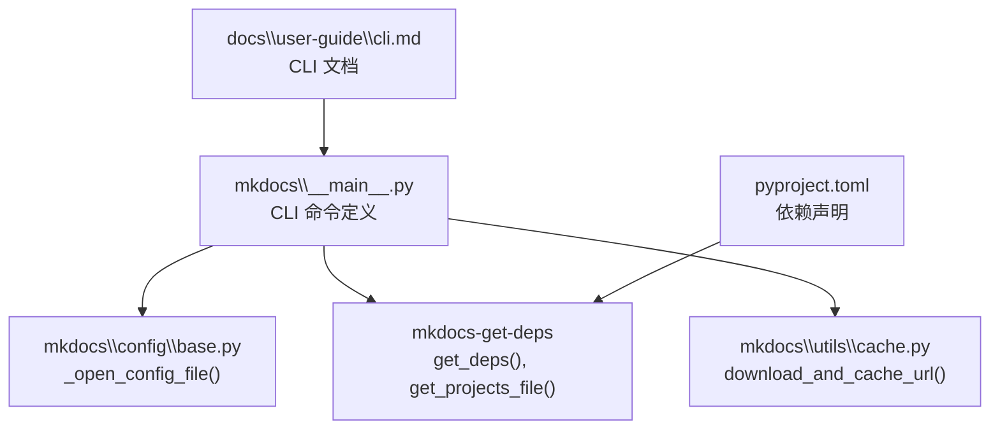
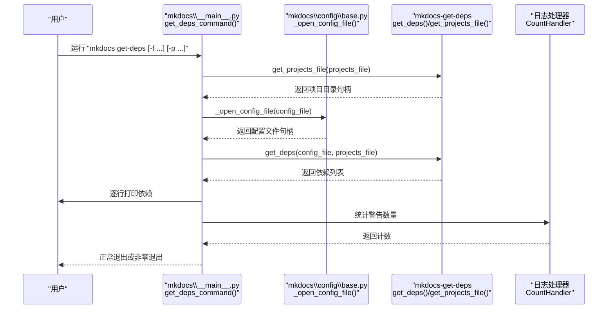
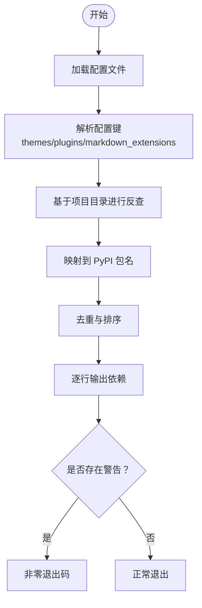
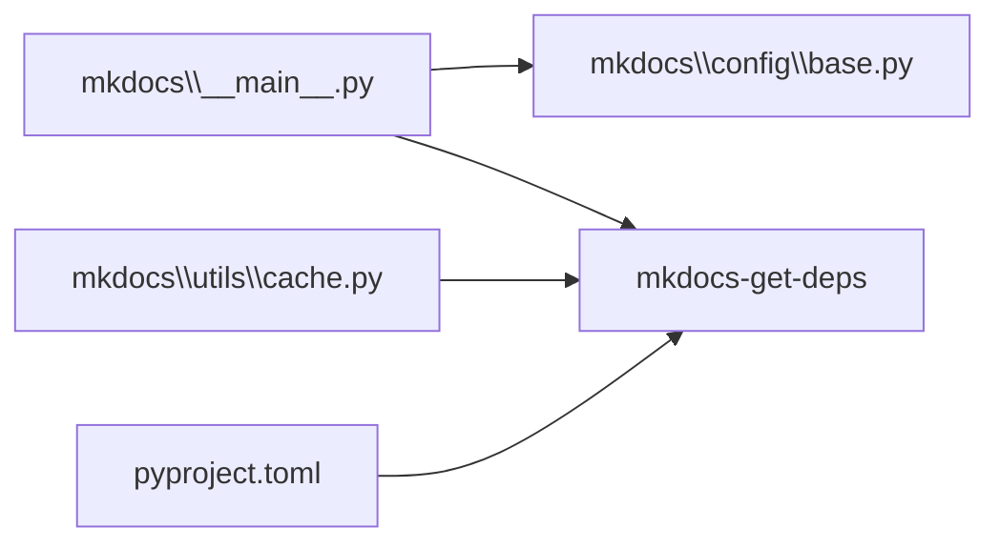

# get-deps 命令

<cite>
**本文引用的文件**
- [mkdocs\__main__.py](file://mkdocs\__main__.py)
- [pyproject.toml](file://pyproject.toml)
- [mkdocs\config\base.py](file://mkdocs\config\base.py)
- [mkdocs\utils\cache.py](file://mkdocs\utils\cache.py)
- [docs\user-guide\cli.md](file://docs\user-guide\cli.md)
- [docs\about\release-notes.md](file://docs\about\release-notes.md)
</cite>

## 目录
1. [简介](#简介)
2. [项目结构](#项目结构)
3. [核心组件](#核心组件)
4. [架构总览](#架构总览)
5. [详细组件分析](#详细组件分析)
6. [依赖关系分析](#依赖关系分析)
7. [性能考量](#性能考量)
8. [故障排查指南](#故障排查指南)
9. [结论](#结论)
10. [附录](#附录)

## 简介
get-deps 命令用于根据配置文件（默认为当前目录下的 mkdocs.yml）中声明的主题、插件与 Markdown 扩展，自动推断出所需的 Python 包依赖，并将这些依赖逐行输出。该命令的设计目标是“运行后即可直接构建站点”，减少手动维护依赖清单的工作量。

命令工作原理概述：
- 解析配置文件，识别 themes、plugins、markdown_extensions 等关键节点
- 基于已知项目目录（官方或自定义）进行反向查询，映射到 PyPI 包名
- 输出去重后的包名列表，便于直接安装

在 CI 环境中，建议结合虚拟环境与固定版本策略，避免因动态解析导致的不稳定性。

章节来源
- file://docs\about\release-notes.md#L329-L343

## 项目结构
与 get-deps 命令相关的关键位置：
- CLI 定义与命令入口：mkdocs\__main__.py
- 依赖声明（外部模块 mkdocs-get-deps）：pyproject.toml
- 配置文件打开与上下文管理：mkdocs\config\base.py
- 缓存下载工具（委托给 mkdocs-get-deps）：mkdocs\utils\cache.py
- CLI 文档生成：docs\user-guide\cli.md

图表来源
- [mkdocs\__main__.py](file://mkdocs\__main__.py#L328-L357)
- [mkdocs\config\base.py](file://mkdocs\config\base.py#L289-L338)
- [mkdocs\utils\cache.py](file://mkdocs\utils\cache.py#L16-L36)
- [pyproject.toml](file://pyproject.toml#L48-L48)

章节来源
- file://mkdocs\__main__.py#L328-L357
- file://pyproject.toml#L48-L48
- file://docs\user-guide\cli.md#L1-L9

## 核心组件
- get-deps 命令实现
  - 参数
    - -f, --config-file：指定配置文件路径或从标准输入读取（当传入 - 时）
    - -p, --projects-file：指定项目目录（catalog）文件路径或 URL；可覆盖默认位置
    - -v, --verbose：启用详细日志输出
  - 行为
    - 加载项目目录（支持本地路径或远程 URL）
    - 打开并读取配置文件（默认优先 mkdocs.yml，其次 mkdocs.yaml）
    - 调用外部模块 mkdocs-get-deps 推断依赖
    - 将结果逐行打印
    - 若存在警告计数，则以非零退出码结束

- 外部模块依赖
  - mkdocs-get-deps：提供 get_deps()、get_projects_file() 等能力
  - 通过 pyproject.toml 声明为 >=0.2.0 的可选依赖

章节来源
- file://mkdocs\__main__.py#L328-L357
- file://pyproject.toml#L48-L48
- file://docs\about\release-notes.md#L329-L343

## 架构总览
get-deps 命令的执行流程如下：

图表来源
- [mkdocs\__main__.py](file://mkdocs\__main__.py#L328-L357)
- [mkdocs\config\base.py](file://mkdocs\config\base.py#L289-L338)
- [mkdocs\utils\cache.py](file://mkdocs\utils\cache.py#L16-L36)

## 详细组件分析

### 命令参数与帮助
- -f, --config-file
  - 作用：指定配置文件路径；若未提供则默认尝试 mkdocs.yml 或 mkdocs.yaml
  - 支持从标准输入读取（传入 -）
- -p, --projects-file
  - 作用：指定项目目录（catalog）文件路径或 URL；可覆盖默认位置
- -v, --verbose
  - 作用：启用详细日志输出
- --help
  - 作用：显示命令帮助信息（由 Click 自动生成）

章节来源
- file://mkdocs\__main__.py#L111-L151
- file://docs\user-guide\cli.md#L1-L9

### 配置文件加载机制
- 默认行为
  - 当未显式提供配置文件时，按顺序尝试 mkdocs.yml 与 mkdocs.yaml
  - 支持传入已打开的文件描述符或字符串路径
- 上下文管理
  - 使用上下文管理器确保文件在使用后正确关闭
- 错误处理
  - 若文件不存在，抛出配置错误异常

章节来源
- file://mkdocs\config\base.py#L289-L338

### 依赖推断与输出
- 项目目录获取
  - 通过 mkdocs-get-deps 提供的 get_projects_file() 获取项目目录
  - 支持本地路径与远程 URL，并可能使用缓存机制
- 依赖推断
  - 通过 mkdocs-get-deps 提供的 get_deps() 对配置进行分析，返回依赖列表
- 输出与退出
  - 逐行打印依赖
  - 若存在警告计数，则以非零退出码结束

章节来源
- file://mkdocs\__main__.py#L338-L357
- file://mkdocs\utils\cache.py#L16-L36
- file://docs\about\release-notes.md#L329-L343

### 依赖推断工作原理（概念流程）

说明：该图为概念流程，展示从配置到依赖输出的整体思路。

## 依赖关系分析
- 内部依赖
  - mkdocs\__main__.py 依赖 mkdocs.config.base._open_config_file 以安全地打开配置文件
  - mkdocs\utils\cache.py 将缓存下载委托给 mkdocs-get-deps.cache
- 外部依赖
  - mkdocs-get-deps：>=0.2.0，提供 get_deps() 与 get_projects_file() 等能力
- 版本约束
  - 在 pyproject.toml 中声明了最小版本要求，确保兼容性

图表来源
- [mkdocs\__main__.py](file://mkdocs\__main__.py#L328-L357)
- [mkdocs\config\base.py](file://mkdocs\config\base.py#L289-L338)
- [mkdocs\utils\cache.py](file://mkdocs\utils\cache.py#L16-L36)
- [pyproject.toml](file://pyproject.toml#L48-L48)

章节来源
- file://pyproject.toml#L48-L48
- file://mkdocs\__main__.py#L328-L357

## 性能考量
- 项目目录缓存
  - 通过缓存机制减少网络请求与重复解析，提升后续执行速度
- 并发与 I/O
  - 依赖推断过程涉及文件读取与网络访问，建议在 CI 中使用稳定网络与缓存策略
- 输出与日志
  - 逐行输出依赖，避免一次性缓冲大量文本，利于流水线实时反馈

章节来源
- file://mkdocs\utils\cache.py#L16-L36

## 故障排查指南
- 配置文件路径问题
  - 确认 -f/--config-file 指向有效路径；若使用相对路径，请确保在正确的项目根目录执行
- 项目目录不可达
  - -p/--projects-file 指定的 URL 或路径应可访问；必要时切换到默认目录或本地镜像
- 无依赖输出
  - 检查配置文件中是否包含 themes、plugins、markdown_extensions 等条目
- 警告导致失败
  - 命令在存在警告时会以非零退出码结束；可在本地先修复配置问题后再进入 CI

章节来源
- file://mkdocs\__main__.py#L344-L357
- file://docs\about\release-notes.md#L329-L343

## 结论
get-deps 命令通过解析配置文件并借助项目目录实现对所需 Python 包的自动推断，显著降低了依赖管理的复杂度。在日常开发中可直接使用该命令快速获得依赖列表；在 CI 环境中，建议结合虚拟环境与固定版本策略，确保构建的稳定性与可重复性。

## 附录

### 使用示例
- 显示依赖列表
  - 在项目根目录执行：mkdocs get-deps
  - 指定配置文件：mkdocs get-deps -f ./mkdocs.yml
  - 指定项目目录：mkdocs get-deps -p ./projects.yaml
- 集成到 CI/CD 流水线
  - 在安装步骤中使用：mkdocs get-deps | xargs -r pip install
  - 在虚拟环境中执行，避免污染系统环境
  - 为稳定性考虑，在生产环境固定依赖版本

章节来源
- file://docs\about\release-notes.md#L329-L343