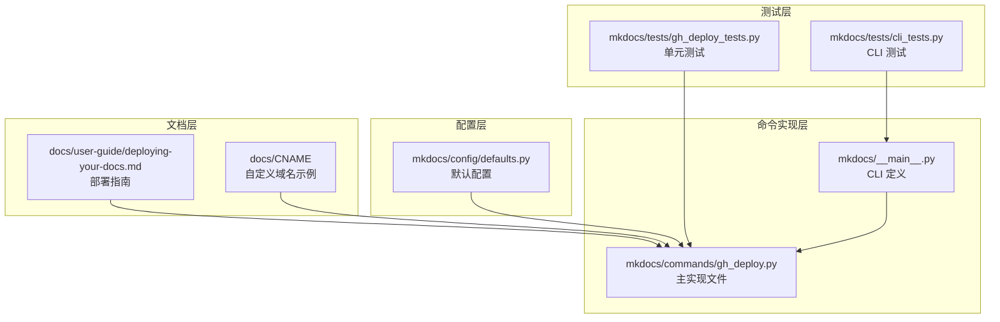
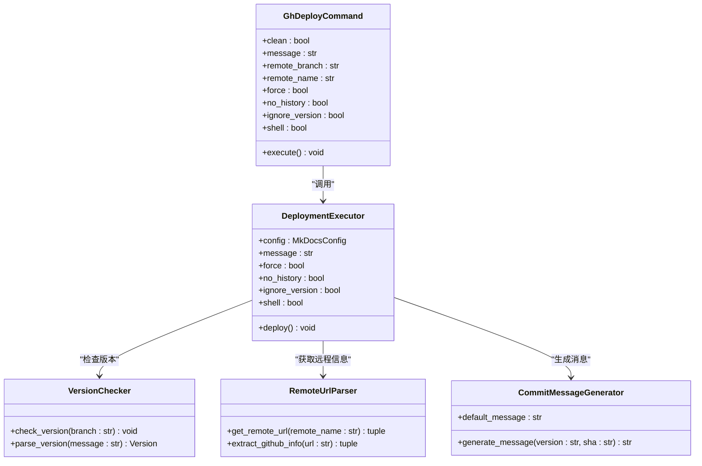
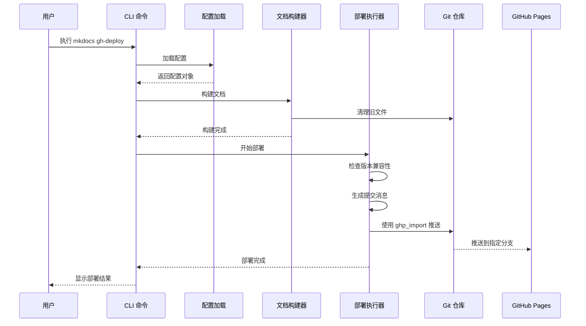
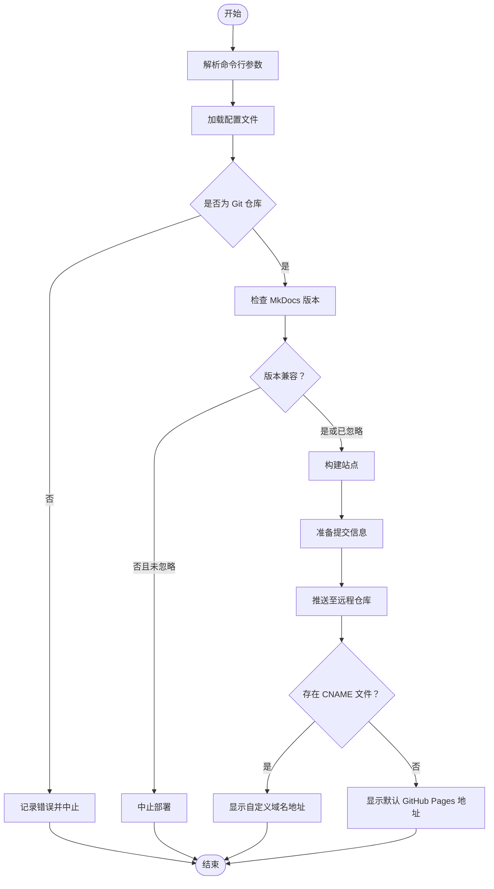
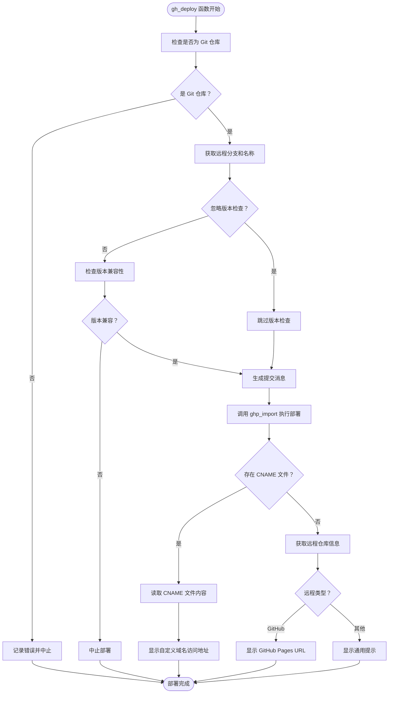
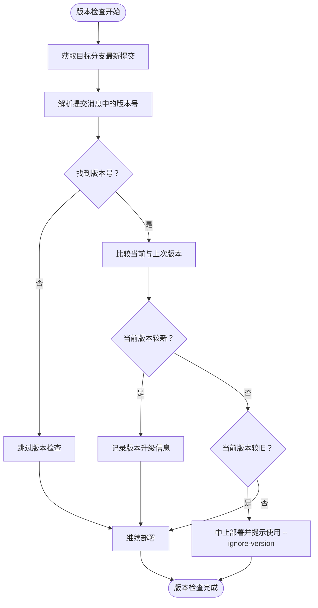
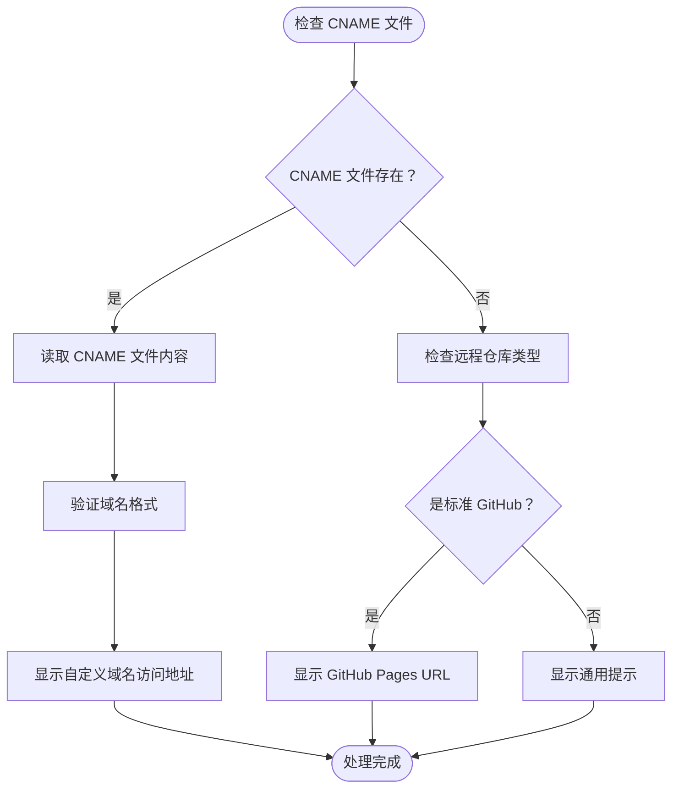
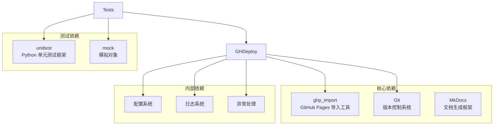
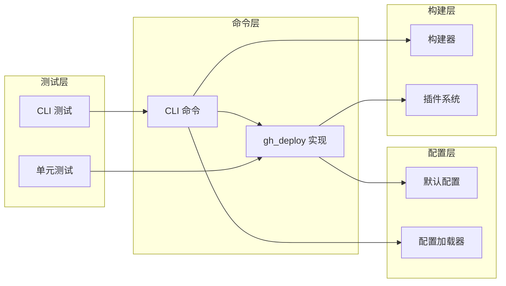

# gh-deploy 命令

<cite>
**本文档引用的文件**
- [mkdocs/commands/gh_deploy.py](file://mkdocs/commands/gh_deploy.py)
- [mkdocs/__main__.py](file://mkdocs/__main__.py)
- [mkdocs/config/defaults.py](file://mkdocs/config/defaults.py)
- [mkdocs/tests/gh_deploy_tests.py](file://mkdocs/tests/gh_deploy_tests.py)
- [mkdocs/tests/cli_tests.py](file://mkdocs/tests/cli_tests.py)
- [docs/user-guide/deploying-your-docs.md](file://docs/user-guide/deploying-your-docs.md)
- [docs/CNAME](file://docs/CNAME)
</cite>

## 目录
1. [简介](#简介)
2. [项目结构](#项目结构)
3. [核心组件](#核心组件)
4. [架构概览](#架构概览)
5. [详细组件分析](#详细组件分析)
6. [依赖关系分析](#依赖关系分析)
7. [性能考虑](#性能考虑)
8. [故障排除指南](#故障排除指南)
9. [结论](#结论)

## 简介

gh-deploy 命令是 MkDocs 提供的一个专门用于将构建好的文档直接部署到 GitHub Pages 的功能。该命令通过自动化的方式完成文档构建、版本控制提交和远程推送等操作，为开发者提供了便捷的静态站点托管解决方案。

该命令的核心优势在于：
- 自动化部署流程，无需手动执行多个命令
- 支持多种部署场景（项目页面、用户/组织页面、自定义域名）
- 内置版本检查机制，防止使用过旧版本的 MkDocs 进行部署
- 支持自定义提交消息和部署分支

## 项目结构

gh-deploy 命令在 MkDocs 项目中的位置和相关文件分布如下：



**图表来源**
- [mkdocs/commands/gh_deploy.py](file://mkdocs/commands/gh_deploy.py#L1-L170)
- [mkdocs/__main__.py](file://mkdocs/__main__.py#L293-L325)
- [mkdocs/config/defaults.py](file://mkdocs/config/defaults.py#L144-L148)

**章节来源**
- [mkdocs/commands/gh_deploy.py](file://mkdocs/commands/gh_deploy.py#L1-L170)
- [mkdocs/__main__.py](file://mkdocs/__main__.py#L110-L151)

## 核心组件

### 主要功能模块

gh-deploy 命令由以下核心组件构成：

1. **命令入口点** - CLI 参数解析和调用链管理
2. **部署执行器** - 实际的部署逻辑实现
3. **版本检查器** - MkDocs 版本兼容性验证
4. **远程信息获取器** - GitHub 远程仓库信息解析
5. **提交消息生成器** - 动态生成部署提交信息

### 关键数据结构



**图表来源**
- [mkdocs/commands/gh_deploy.py](file://mkdocs/commands/gh_deploy.py#L100-L170)
- [mkdocs/__main__.py](file://mkdocs/__main__.py#L293-L325)

**章节来源**
- [mkdocs/commands/gh_deploy.py](file://mkdocs/commands/gh_deploy.py#L100-L170)
- [mkdocs/config/defaults.py](file://mkdocs/config/defaults.py#L144-L148)

## 架构概览

### 整体工作流程



**图表来源**
- [mkdocs/__main__.py](file://mkdocs/__main__.py#L293-L325)
- [mkdocs/commands/gh_deploy.py](file://mkdocs/commands/gh_deploy.py#L100-L170)

### 参数处理流程



**图表来源**
- [mkdocs/commands/gh_deploy.py](file://mkdocs/commands/gh_deploy.py#L100-L170)

**章节来源**
- [mkdocs/__main__.py](file://mkdocs/__main__.py#L293-L325)
- [mkdocs/commands/gh_deploy.py](file://mkdocs/commands/gh_deploy.py#L100-L170)

## 详细组件分析

### 命令行接口定义

gh-deploy 命令通过 Click 框架定义了完整的命令行接口，支持丰富的参数选项：

#### 基础参数

| 参数 | 类型 | 默认值 | 描述 |
|------|------|--------|------|
| `--clean/--dirty` | 布尔标志 | `--clean` | 在构建前清理站点目录中的旧文件 |
| `--message` | 字符串 | 自动生成 | 自定义提交消息，支持 `{sha}` 和 `{version}` 占位符 |
| `--remote-branch` | 字符串 | `gh-pages` | 要推送的远程分支名称 |
| `--remote-name` | 字符串 | `origin` | 远程仓库名称 |
| `--force` | 布尔标志 | `False` | 强制推送，覆盖远程历史 |
| `--no-history` | 布尔标志 | `False` | 使用新提交替换整个 Git 历史 |
| `--ignore-version` | 布尔标志 | `False` | 忽略 MkDocs 版本检查 |
| `--shell` | 布尔标志 | `False` | 使用 shell 执行 Git 命令 |

#### 配置参数

| 参数 | 类型 | 默认值 | 描述 |
|------|------|--------|------|
| `--config-file` | 文件路径 | 当前目录 | 指定配置文件路径 |
| `--strict` | 布尔标志 | `False` | 启用严格模式 |
| `--theme` | 字符串 | `mkdocs` | 指定主题名称 |
| `--site-dir` | 字符串 | `site` | 指定站点输出目录 |
| `--use-directory-urls` | 布尔标志 | `True` | 使用目录风格 URL |
| `--no-directory-urls` | 布尔标志 | `False` | 禁用目录风格 URL |

**章节来源**
- [mkdocs/__main__.py](file://mkdocs/__main__.py#L110-L151)
- [mkdocs/__main__.py](file://mkdocs/__main__.py#L293-L325)

### 部署执行器实现

部署执行器是 gh-deploy 命令的核心实现，负责协调整个部署流程：

#### 核心部署流程



**图表来源**
- [mkdocs/commands/gh_deploy.py](file://mkdocs/commands/gh_deploy.py#L100-L170)

#### 版本检查机制

版本检查功能确保部署时使用的 MkDocs 版本不会比之前部署时的版本更旧：



**图表来源**
- [mkdocs/commands/gh_deploy.py](file://mkdocs/commands/gh_deploy.py#L72-L98)

**章节来源**
- [mkdocs/commands/gh_deploy.py](file://mkdocs/commands/gh_deploy.py#L72-L170)

### 远程仓库信息处理

系统能够智能识别不同类型的远程仓库配置，并相应地提供部署信息：

#### 远程仓库类型识别

| 远程类型 | URL 格式示例 | 识别特征 | 处理方式 |
|----------|-------------|----------|----------|
| GitHub HTTPS | `https://github.com/user/repo.git` | 包含 `github.com/` | 解析用户名和仓库名 |
| GitHub SSH | `git@github.com:user/repo.git` | 以 `git@github.com:` 开头 | 解析用户名和仓库名 |
| GitHub Enterprise | `https://github.company.com/user/repo.git` | 不包含标准 `github.com` | 识别为企业版，显示通用提示 |
| 其他 Git 服务 | `https://gitlab.com/user/repo.git` | 不匹配上述模式 | 显示通用提示 |

**章节来源**
- [mkdocs/commands/gh_deploy.py](file://mkdocs/commands/gh_deploy.py#L50-L98)

### CNAME 文件支持

gh-deploy 命令原生支持 GitHub Pages 的自定义域名功能：

#### CNAME 文件处理流程



**图表来源**
- [mkdocs/commands/gh_deploy.py](file://mkdocs/commands/gh_deploy.py#L144-L170)

**章节来源**
- [mkdocs/commands/gh_deploy.py](file://mkdocs/commands/gh_deploy.py#L144-L170)

## 依赖关系分析

### 外部依赖

gh-deploy 命令依赖于以下外部组件：



**图表来源**
- [mkdocs/commands/gh_deploy.py](file://mkdocs/commands/gh_deploy.py#L1-L170)

### 内部模块依赖



**图表来源**
- [mkdocs/__main__.py](file://mkdocs/__main__.py#L293-L325)
- [mkdocs/commands/gh_deploy.py](file://mkdocs/commands/gh_deploy.py#L100-L170)

**章节来源**
- [mkdocs/commands/gh_deploy.py](file://mkdocs/commands/gh_deploy.py#L1-L170)
- [mkdocs/__main__.py](file://mkdocs/__main__.py#L293-L325)

## 性能考虑

### 部署性能优化

1. **增量构建** - 使用 `--dirty` 参数可以避免清理旧文件，提高重复部署速度
2. **版本缓存** - 版本检查只在必要时进行，避免不必要的性能开销
3. **并行处理** - 构建和部署过程可以并行执行，提高整体效率

### 内存使用优化

- 临时文件处理采用流式处理，避免大文件内存占用
- 日志输出采用异步方式，减少阻塞
- 进程间通信使用标准输入输出，降低内存开销

### 网络传输优化

- 使用 `--force` 参数可以避免重复的网络传输
- 支持 `--no-history` 参数减少历史记录传输量

## 故障排除指南

### 常见问题及解决方案

#### Git 仓库检测失败

**问题症状**：部署时提示不是 Git 仓库

**可能原因**：
- 当前目录不在 Git 仓库中
- Git 未正确安装或未添加到 PATH

**解决方法**：
```bash
# 确认当前目录为 Git 仓库
git status

# 检查 Git 是否可用
git --version

# 初始化 Git 仓库（如果需要）
git init
```

#### 版本冲突错误

**问题症状**：部署被中止，提示使用较旧版本的 MkDocs

**解决方法**：
```bash
# 升级 MkDocs 到最新版本
pip install --upgrade mkdocs

# 或者使用 --ignore-version 参数强制部署
mkdocs gh-deploy --ignore-version
```

#### 远程推送权限问题

**问题症状**：推送失败，提示权限不足

**解决方法**：
```bash
# 检查远程仓库配置
git remote -v

# 更新远程仓库 URL
git remote set-url origin https://github.com/username/repository.git

# 配置 Git 凭据
git config --global credential.helper store
```

#### CNAME 文件问题

**问题症状**：自定义域名无法正常访问

**解决方法**：
```bash
# 确认 CNAME 文件格式正确
cat docs/CNAME

# 检查 DNS 配置
dig www.yourdomain.com

# 确保 GitHub Pages 设置正确
# 在仓库设置中启用 GitHub Pages
```

#### 权限不足错误

**问题症状**：部署过程中出现权限相关错误

**解决方法**：
```bash
# 检查文件权限
ls -la docs/

# 修复权限问题
chmod -R 755 docs/

# 检查 Git 配置
git config --global user.name "Your Name"
git config --global user.email "your.email@example.com"
```

**章节来源**
- [mkdocs/commands/gh_deploy.py](file://mkdocs/commands/gh_deploy.py#L30-L32)
- [mkdocs/commands/gh_deploy.py](file://mkdocs/commands/gh_deploy.py#L92-L97)

### 调试模式

启用调试模式可以获取更详细的错误信息：

```bash
# 启用详细日志输出
mkdocs gh-deploy -v

# 启用详细调试信息
mkdocs gh-deploy --verbose

# 查看帮助信息
mkdocs gh-deploy --help
```

## 结论

gh-deploy 命令为 MkDocs 用户提供了一个强大而灵活的 GitHub Pages 部署解决方案。通过其精心设计的架构和丰富的功能特性，该命令能够满足从简单项目到复杂企业环境的各种部署需求。

### 主要优势

1. **易用性** - 单命令完成完整部署流程
2. **灵活性** - 支持多种部署场景和自定义选项
3. **可靠性** - 内置版本检查和错误处理机制
4. **可扩展性** - 与 MkDocs 生态系统无缝集成

### 最佳实践建议

1. **定期更新** - 保持 MkDocs 版本更新，确保获得最新功能和安全补丁
2. **备份策略** - 在重要部署前备份现有文档
3. **测试环境** - 在生产环境部署前先在测试环境中验证
4. **监控设置** - 配置适当的监控和告警机制

### 未来发展

随着 MkDocs 生态系统的不断发展，gh-deploy 命令将继续演进，支持更多托管平台和部署场景，为用户提供更加便捷和强大的文档发布体验。