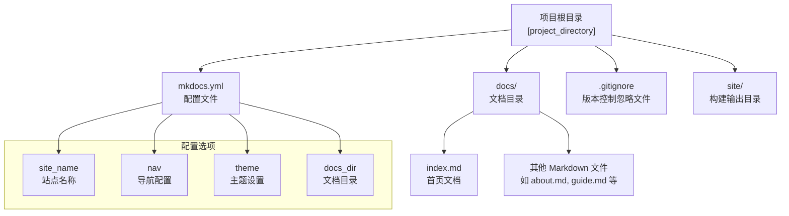
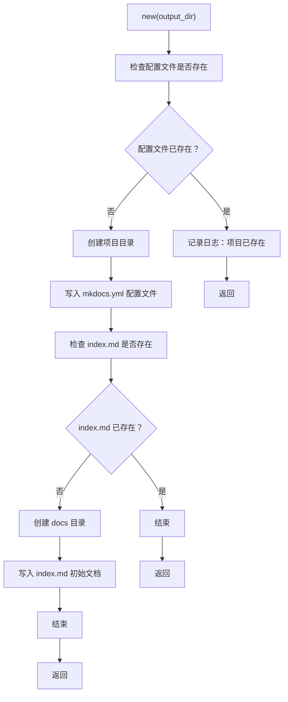
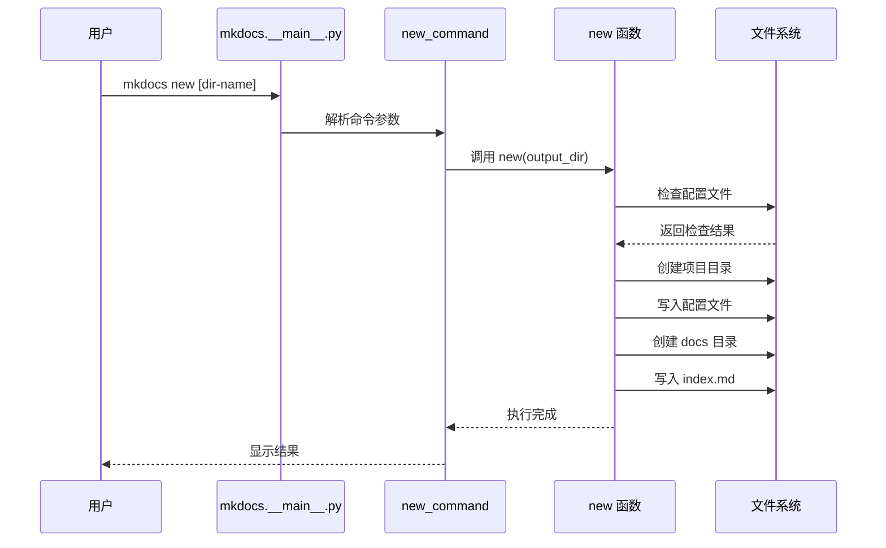
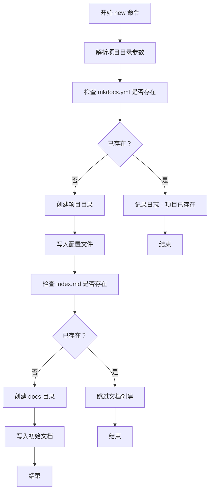
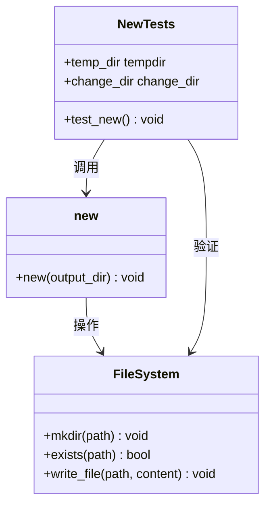
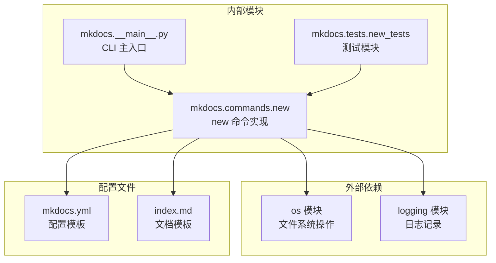

# new 命令

<cite>
**本文档引用的文件**
- [mkdocs/commands/new.py](file://mkdocs/commands/new.py)
- [mkdocs/__main__.py](file://mkdocs/__main__.py)
- [mkdocs/tests/new_tests.py](file://mkdocs/tests/new_tests.py)
- [docs/getting-started.md](file://docs/getting-started.md)
- [docs/user-guide/cli.md](file://docs/user-guide/cli.md)
- [mkdocs/tests/integration/minimal/mkdocs.yml](file://mkdocs/tests/integration/minimal/mkdocs.yml)
- [mkdocs/tests/integration/minimal/docs/testing.md](file://mkdocs/tests/integration/minimal/docs/testing.md)
</cite>

## 目录
1. [简介](#简介)
2. [项目结构](#项目结构)
3. [核心组件](#核心组件)
4. [架构概览](#架构概览)
5. [详细组件分析](#详细组件分析)
6. [依赖关系分析](#依赖关系分析)
7. [性能考虑](#性能考虑)
8. [故障排除指南](#故障排除指南)
9. [结论](#结论)
10. [附录](#附录)

## 简介

new 命令是 MkDocs 提供的一个便捷工具，用于快速创建新的 MkDocs 项目骨架。该命令能够自动创建标准的项目目录结构，包括配置文件和初始文档页面，为用户提供了开箱即用的项目基础。

new 命令的主要作用：
- 快速生成标准的 MkDocs 项目结构
- 创建必要的配置文件和文档目录
- 提供初始的文档内容作为起点
- 简化新项目的启动流程

## 项目结构

new 命令创建的项目遵循 MkDocs 的标准目录结构：



**图表来源**
- [mkdocs/commands/new.py](file://mkdocs/commands/new.py#L29-L53)
- [mkdocs/tests/integration/minimal/mkdocs.yml](file://mkdocs/tests/integration/minimal/mkdocs.yml#L1-L7)

**章节来源**
- [mkdocs/commands/new.py](file://mkdocs/commands/new.py#L29-L53)
- [docs/getting-started.md](file://docs/getting-started.md#L17-L35)

## 核心组件

new 命令的核心实现位于 `mkdocs/commands/new.py` 文件中，包含以下关键组件：

### 主要函数

new 命令的核心是一个简单的函数，负责创建项目文件结构：



**图表来源**
- [mkdocs/commands/new.py](file://mkdocs/commands/new.py#L29-L53)

### 配置文件模板

new 命令使用预定义的配置模板来创建初始配置文件：

- **默认站点名称**: `My Docs`
- **基本配置结构**: 包含站点基本信息和基础设置
- **编码格式**: UTF-8 编码确保多语言支持

### 文档模板

初始文档包含标准的欢迎信息和基本使用说明，帮助用户快速了解 MkDocs 的基本功能。

**章节来源**
- [mkdocs/commands/new.py](file://mkdocs/commands/new.py#L6-L24)
- [mkdocs/commands/new.py](file://mkdocs/commands/new.py#L29-L53)

## 架构概览

new 命令在整个 MkDocs 系统中的位置和交互关系：

```mermaid
graph TB
subgraph "命令行界面层"
A[mkdocs.__main__.py<br/>CLI 主入口]
B[click.group<br/>命令注册]
end
subgraph "命令实现层"
C[new_command<br/>CLI 命令]
D[new 函数<br/>核心逻辑]
end
subgraph "文件系统层"
E[项目目录<br/>[project_directory]]
F[mkdocs.yml<br/>配置文件]
G[docs/<br/>文档目录]
H[index.md<br/>首页文档]
end
subgraph "测试层"
I[new_tests.py<br/>单元测试]
end
A --> B
B --> C
C --> D
D --> E
E --> F
E --> G
G --> H
I --> D
```

**图表来源**
- [mkdocs/__main__.py](file://mkdocs/__main__.py#L359-L366)
- [mkdocs/commands/new.py](file://mkdocs/commands/new.py#L29-L53)
- [mkdocs/tests/new_tests.py](file://mkdocs/tests/new_tests.py#L10-L24)

**章节来源**
- [mkdocs/__main__.py](file://mkdocs/__main__.py#L359-L366)
- [mkdocs/commands/new.py](file://mkdocs/commands/new.py#L29-L53)

## 详细组件分析

### CLI 命令定义

new 命令通过 Click 框架进行定义，具有明确的参数和帮助信息：



**图表来源**
- [mkdocs/__main__.py](file://mkdocs/__main__.py#L359-L366)
- [mkdocs/commands/new.py](file://mkdocs/commands/new.py#L29-L53)

### 文件创建流程

new 命令的文件创建遵循严格的顺序和条件检查：



**图表来源**
- [mkdocs/commands/new.py](file://mkdocs/commands/new.py#L34-L53)

**章节来源**
- [mkdocs/commands/new.py](file://mkdocs/commands/new.py#L29-L53)

### 测试验证机制

new 命令的正确性通过单元测试进行验证：



**图表来源**
- [mkdocs/tests/new_tests.py](file://mkdocs/tests/new_tests.py#L10-L24)
- [mkdocs/commands/new.py](file://mkdocs/commands/new.py#L29-L53)

**章节来源**
- [mkdocs/tests/new_tests.py](file://mkdocs/tests/new_tests.py#L10-L24)

## 依赖关系分析

new 命令的依赖关系相对简单但功能明确：



**图表来源**
- [mkdocs/commands/new.py](file://mkdocs/commands/new.py#L1-L53)
- [mkdocs/__main__.py](file://mkdocs/__main__.py#L359-L366)
- [mkdocs/tests/new_tests.py](file://mkdocs/tests/new_tests.py#L1-L25)

**章节来源**
- [mkdocs/commands/new.py](file://mkdocs/commands/new.py#L1-L53)
- [mkdocs/__main__.py](file://mkdocs/__main__.py#L359-L366)

## 性能考虑

new 命令的性能特点：

- **时间复杂度**: O(1) - 固定数量的文件操作
- **空间复杂度**: O(1) - 使用固定大小的字符串常量
- **I/O 操作**: 最多 4 次文件写入操作
- **内存使用**: 仅在内存中存储少量字符串常量

由于 new 命令只进行少量的文件系统操作，其执行速度非常快，通常在毫秒级别内完成。

## 故障排除指南

### 常见问题及解决方案

1. **权限错误**
   - 症状: 无法创建项目目录或文件
   - 解决方案: 检查目标目录的写入权限

2. **目录已存在**
   - 症状: 命令提示项目已存在
   - 解决方案: 使用不同的项目名称或删除现有目录

3. **磁盘空间不足**
   - 症状: 文件创建失败
   - 解决方案: 清理磁盘空间或选择其他位置

4. **编码问题**
   - 症状: 中文字符显示异常
   - 解决方案: 确保使用 UTF-8 编码（new 命令已内置此支持）

**章节来源**
- [mkdocs/commands/new.py](file://mkdocs/commands/new.py#L34-L53)

## 结论

new 命令是 MkDocs 生态系统中的一个重要工具，它简化了新项目的创建过程。通过提供标准化的项目结构和初始内容，new 命令帮助用户快速开始文档编写工作。

该命令的设计简洁而有效，具有以下优势：
- 实现简单，易于维护
- 功能明确，满足基本需求
- 性能优异，响应迅速
- 兼容性强，支持多种操作系统

对于需要快速启动文档项目的用户来说，new 命令是一个不可或缺的工具。

## 附录

### 使用示例

以下是一些常见的使用场景：

1. **创建新项目**
   ```bash
   mkdocs new my-awesome-project
   cd my-awesome-project
   ```

2. **初始化项目结构**
   - 创建项目目录
   - 生成配置文件
   - 设置文档目录
   - 添加初始文档

3. **项目初始化后的下一步**
   - 修改 `mkdocs.yml` 配置
   - 编辑 `docs/index.md`
   - 添加更多文档页面
   - 运行 `mkdocs serve` 预览效果

### 后续配置建议

1. **基础配置**
   - 设置 `site_name` 和 `site_description`
   - 配置 `nav` 导航结构
   - 选择合适的 `theme`

2. **高级配置**
   - 配置 `plugins` 插件系统
   - 设置 `extra_css` 和 `extra_javascript`
   - 配置 `google_analytics`

3. **部署准备**
   - 添加 `.gitignore` 文件
   - 配置 CI/CD 流程
   - 设置域名和自定义域名

**章节来源**
- [docs/getting-started.md](file://docs/getting-started.md#L17-L78)
- [mkdocs/tests/integration/minimal/mkdocs.yml](file://mkdocs/tests/integration/minimal/mkdocs.yml#L1-L7)