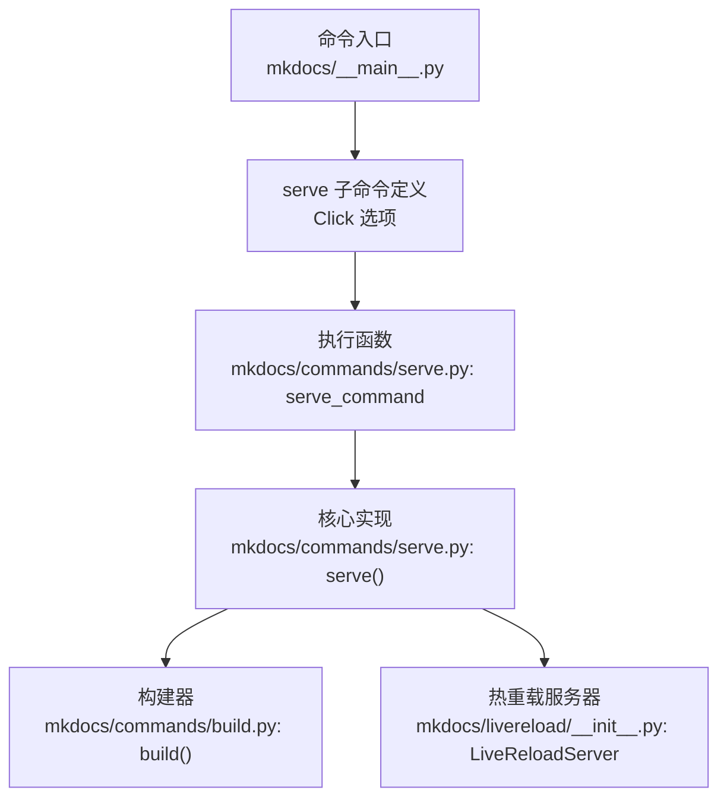
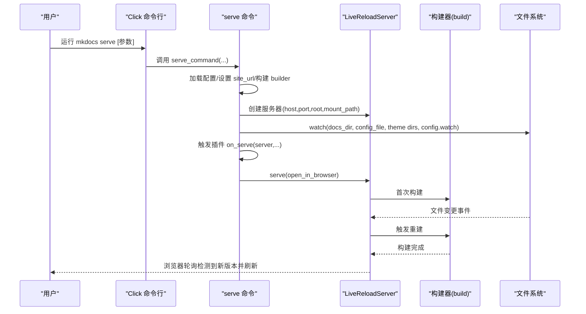
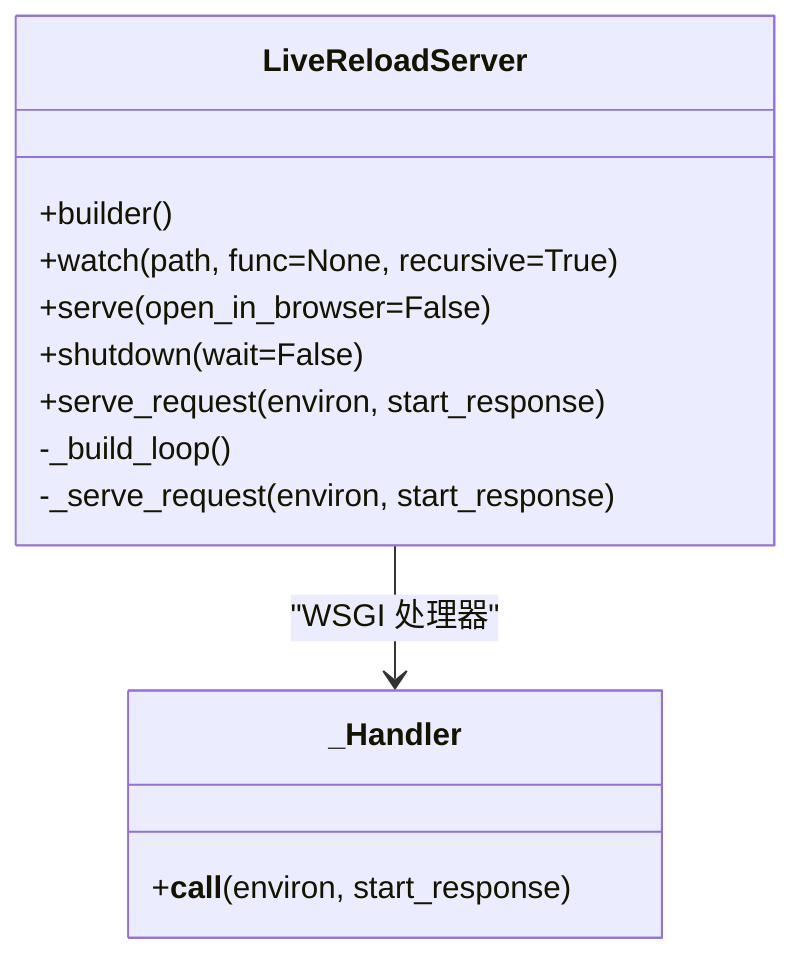
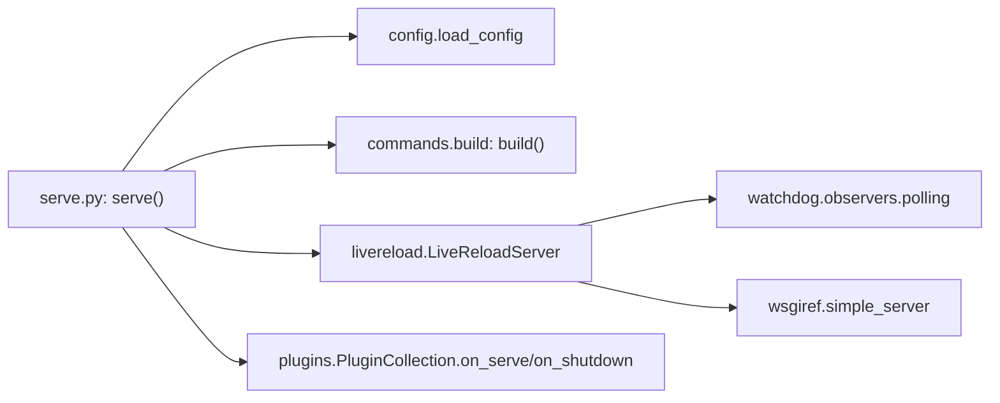

# serve 命令

<cite>
**本文引用的文件列表**
- [mkdocs/commands/serve.py](file://mkdocs/commands/serve.py)
- [mkdocs/__main__.py](file://mkdocs/__main__.py)
- [mkdocs/livereload/__init__.py](file://mkdocs/livereload/__init__.py)
- [mkdocs/config/defaults.py](file://mkdocs/config/defaults.py)
- [mkdocs/commands/build.py](file://mkdocs/commands/build.py)
- [mkdocs/plugins.py](file://mkdocs/plugins.py)
- [mkdocs/tests/cli_tests.py](file://mkdocs/tests/cli_tests.py)
</cite>

## 目录
1. [简介](#简介)
2. [项目结构与入口](#项目结构与入口)
3. [核心组件](#核心组件)
4. [架构总览](#架构总览)
5. [详细组件解析](#详细组件解析)
6. [依赖关系分析](#依赖关系分析)
7. [性能与优化](#性能与优化)
8. [使用示例与场景](#使用示例与场景)
9. [故障排查指南](#故障排查指南)
10. [结论](#结论)

## 简介
serve 命令用于启动 MkDocs 内置的开发服务器，提供本地实时预览能力。它会：
- 在本地启动一个静态文件服务器（支持热重载）
- 监控文档源文件、配置文件与主题文件的变化
- 自动重建站点并在浏览器中刷新页面
- 支持通过命令行参数控制监听地址、是否打开浏览器、是否启用热重载、增量重建等

## 项目结构与入口
- 命令入口由主程序注册为子命令，参数定义在 Click 组件中
- 实际逻辑在命令模块中实现，调用构建器与热重载服务器
- 热重载服务器封装了文件监控、WSGI 请求处理与浏览器轮询刷新

图表来源
- [mkdocs/__main__.py](file://mkdocs/__main__.py#L253-L273)
- [mkdocs/commands/serve.py](file://mkdocs/commands/serve.py#L20-L111)
- [mkdocs/commands/build.py](file://mkdocs/commands/build.py#L1-L200)
- [mkdocs/livereload/__init__.py](file://mkdocs/livereload/__init__.py#L94-L294)

章节来源
- [mkdocs/__main__.py](file://mkdocs/__main__.py#L253-L273)
- [mkdocs/commands/serve.py](file://mkdocs/commands/serve.py#L20-L111)

## 核心组件
- serve 命令实现：负责加载配置、初始化临时站点目录、设置 serve_url、构造 builder、创建并启动 LiveReloadServer、注册文件监控与插件事件回调
- LiveReloadServer：基于 WSGI 的轻量服务器，内置文件监控与浏览器轮询刷新机制
- 构建器：调用 build() 执行构建流程，支持 clean/dirty 模式
- 插件系统：在 serve 生命周期内触发 on_serve/on_shutdown 等事件

章节来源
- [mkdocs/commands/serve.py](file://mkdocs/commands/serve.py#L20-L111)
- [mkdocs/livereload/__init__.py](file://mkdocs/livereload/__init__.py#L94-L294)
- [mkdocs/commands/build.py](file://mkdocs/commands/build.py#L1-L200)
- [mkdocs/plugins.py](file://mkdocs/plugins.py#L134-L147)

## 架构总览
serve 命令的运行时架构如下：
- CLI 解析参数并调用 serve_command
- serve_command 调用 serve()，内部：
  - 加载配置并设置 site_url（指向临时站点目录）
  - 初始化 LiveReloadServer，绑定 builder
  - 注册默认监控路径（docs_dir、config_file、可选 theme dirs）
  - 触发插件 on_serve 钩子以允许扩展监控项
  - 启动服务器并可选打开浏览器
  - 文件变化触发 builder 重建，服务器通知浏览器刷新

图表来源
- [mkdocs/__main__.py](file://mkdocs/__main__.py#L253-L273)
- [mkdocs/commands/serve.py](file://mkdocs/commands/serve.py#L59-L106)
- [mkdocs/livereload/__init__.py](file://mkdocs/livereload/__init__.py#L172-L226)

## 详细组件解析

### 命令参数与行为
- --dev-addr：指定开发服务器监听地址与端口，默认值来自配置项 dev_addr
- --open/-o：首次构建完成后自动打开浏览器
- --no-livereload：禁用热重载（不启动文件监控与浏览器轮询）
- --dirty/-c/--clean：控制构建模式
  - --dirty：仅重建变更过的文件（增量构建）
  - --clean：先清理旧输出再构建（纯 build 行为）
  - 默认：完整构建后 serve
- --watch-theme：将主题目录加入监控范围（仅在启用热重载时生效）
- --watch/-w：追加额外监控路径（可多次指定）

章节来源
- [mkdocs/__main__.py](file://mkdocs/__main__.py#L254-L264)
- [mkdocs/commands/serve.py](file://mkdocs/commands/serve.py#L20-L29)
- [mkdocs/config/defaults.py](file://mkdocs/config/defaults.py#L96-L97)

### 开发服务器工作原理
- 服务器类型：基于 WSGI 的简单服务器，支持多线程
- 文件监控：使用轮询观察者监控被 watch 的路径，文件变更后触发重建
- 构建流程：调用 build()，根据 dirty/clean 参数决定增量或全量
- 浏览器刷新：通过 /livereload/{epoch}/{requestId} 接口进行轮询；当服务器可见版本号大于浏览器持有的 epoch 时触发刷新
- 错误页：支持自定义 404/500 页面（从站点目录读取对应文件名）

图表来源
- [mkdocs/livereload/__init__.py](file://mkdocs/livereload/__init__.py#L94-L294)

章节来源
- [mkdocs/livereload/__init__.py](file://mkdocs/livereload/__init__.py#L94-L294)

### 插件集成点
- on_serve：在首次构建完成后触发，允许插件对服务器进行扩展（如添加额外监控路径）
- on_shutdown：在 serve 结束时触发，用于资源清理

章节来源
- [mkdocs/commands/serve.py](file://mkdocs/commands/serve.py#L96-L96)
- [mkdocs/plugins.py](file://mkdocs/plugins.py#L134-L147)
- [mkdocs/plugins.py](file://mkdocs/plugins.py#L581-L584)

### 配置与 URL 计算
- dev_addr：默认 127.0.0.1:8000
- site_url：在 serve 中被重写为 _serve_url(host, port, mount_path)，确保浏览器访问的是实际服务地址
- mount_path：来自 site_url 的路径部分，服务器会将请求映射到 root 下的相对路径

章节来源
- [mkdocs/config/defaults.py](file://mkdocs/config/defaults.py#L96-L97)
- [mkdocs/commands/serve.py](file://mkdocs/commands/serve.py#L55-L57)
- [mkdocs/livereload/__init__.py](file://mkdocs/livereload/__init__.py#L85-L91)

## 依赖关系分析
- serve 命令依赖：
  - 配置加载：load_config
  - 构建：build
  - 热重载：LiveReloadServer
  - 插件系统：on_serve/on_shutdown
- LiveReloadServer 依赖：
  - watchdog 文件监控
  - WSGI 简易服务器
  - 浏览器轮询脚本模板

图表来源
- [mkdocs/commands/serve.py](file://mkdocs/commands/serve.py#L10-L12)
- [mkdocs/livereload/__init__.py](file://mkdocs/livereload/__init__.py#L26-L27)
- [mkdocs/plugins.py](file://mkdocs/plugins.py#L581-L584)

章节来源
- [mkdocs/commands/serve.py](file://mkdocs/commands/serve.py#L10-L12)
- [mkdocs/livereload/__init__.py](file://mkdocs/livereload/__init__.py#L26-L27)
- [mkdocs/plugins.py](file://mkdocs/plugins.py#L581-L584)

## 性能与优化
- 监控粒度
  - 默认监控 docs_dir 与配置文件；开启 --watch-theme 时监控主题目录；可通过 --watch 追加路径
  - 建议仅监控必要目录，避免过多文件导致轮询开销增大
- 轮询间隔
  - LiveReloadServer 使用轮询观察者，可通过构造参数调整轮询间隔（默认值在实现中定义）
- 增量构建
  - 使用 --dirty 可显著减少大项目在频繁编辑时的等待时间
- 端口与网络
  - --dev-addr 可绑定到 0.0.0.0 以允许局域网访问，但需注意安全风险
- 日志与错误页
  - 自定义 404/500 页面可提升调试效率

章节来源
- [mkdocs/commands/serve.py](file://mkdocs/commands/serve.py#L85-L99)
- [mkdocs/livereload/__init__.py](file://mkdocs/livereload/__init__.py#L134-L134)
- [mkdocs/commands/build.py](file://mkdocs/commands/build.py#L147-L200)

## 使用示例与场景

- 本地开发（默认）
  - 命令：mkdocs serve
  - 行为：监听本地 127.0.0.1:8000，自动打开浏览器，监控文档与配置文件
- 远程访问
  - 命令：mkdocs serve --dev-addr 0.0.0.0:8000
  - 行为：允许同一网络内的设备访问
- 禁用热重载
  - 命令：mkdocs serve --no-livereload
  - 行为：仅构建一次，不启动文件监控
- 增量构建
  - 命令：mkdocs serve --dirty
  - 行为：仅重建变更文件，适合大项目频繁编辑
- 清理后构建
  - 命令：mkdocs serve --clean
  - 行为：先清理旧输出再构建，等同于纯 build 后 serve
- 监控主题
  - 命令：mkdocs serve --watch-theme
  - 行为：将主题目录加入监控范围
- 追加监控路径
  - 命令：mkdocs serve --watch ./custom_dir --watch ./other_file.ext
  - 行为：将额外路径加入监控列表

章节来源
- [mkdocs/__main__.py](file://mkdocs/__main__.py#L254-L264)
- [mkdocs/commands/serve.py](file://mkdocs/commands/serve.py#L85-L99)
- [mkdocs/tests/cli_tests.py](file://mkdocs/tests/cli_tests.py#L17-L236)

## 故障排查指南
- 无法访问
  - 检查 --dev-addr 是否正确，确认防火墙放行端口
  - 若绑定到 0.0.0.0，请评估网络安全
- 热重载无效
  - 确认未使用 --no-livereload
  - 检查是否监控到了目标路径（docs_dir、config_file、主题目录、--watch）
  - 查看日志中“Watching paths for changes”提示
- 构建失败
  - 查看构建日志中的错误信息
  - 使用 --strict 提升严格度，便于早期发现问题
- 浏览器未刷新
  - 检查浏览器控制台是否有轮询错误
  - 确认未被代理或 CORS 设置阻断 /livereload/* 请求
- 自定义错误页
  - 在站点目录下提供 404.html 或 500.html，服务器会优先返回该页面内容

章节来源
- [mkdocs/commands/serve.py](file://mkdocs/commands/serve.py#L71-L77)
- [mkdocs/livereload/__init__.py](file://mkdocs/livereload/__init__.py#L240-L262)

## 结论
serve 命令通过组合配置加载、构建器与热重载服务器，提供了高效便捷的本地开发体验。合理使用参数（如 --dirty、--watch-theme、--watch）可以显著提升迭代效率；在团队协作或远程开发场景下，应谨慎配置监听地址与安全策略。通过插件 on_serve 钩子，开发者可进一步扩展监控范围与功能。