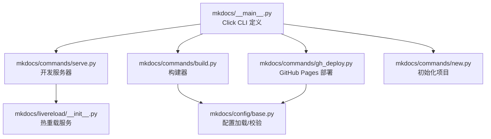
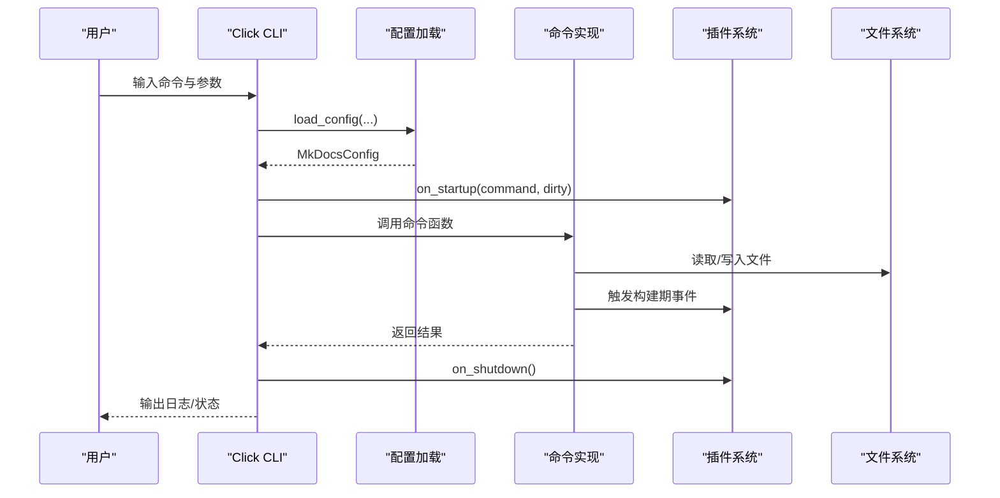
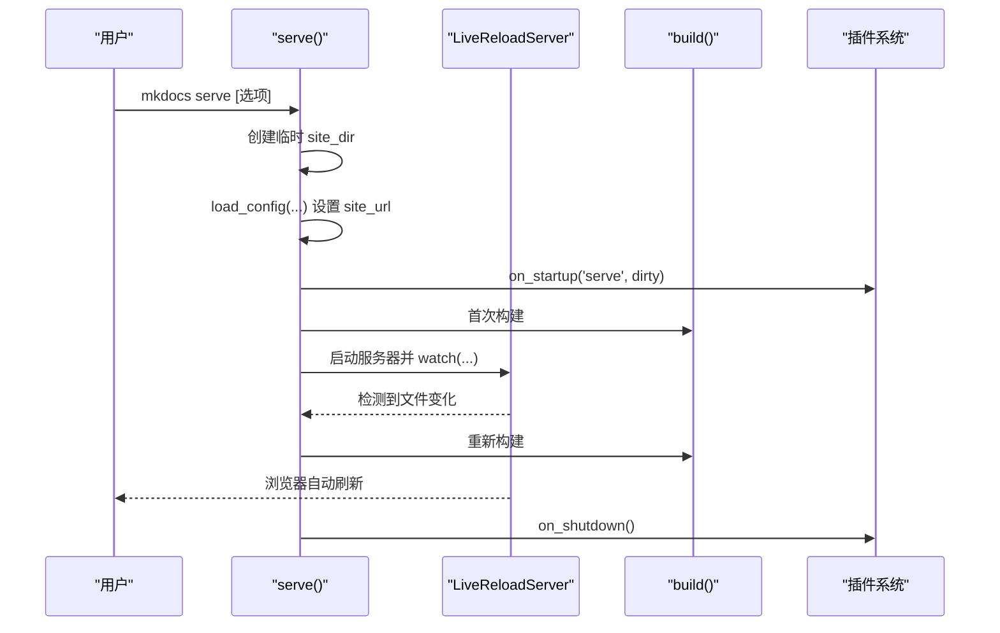
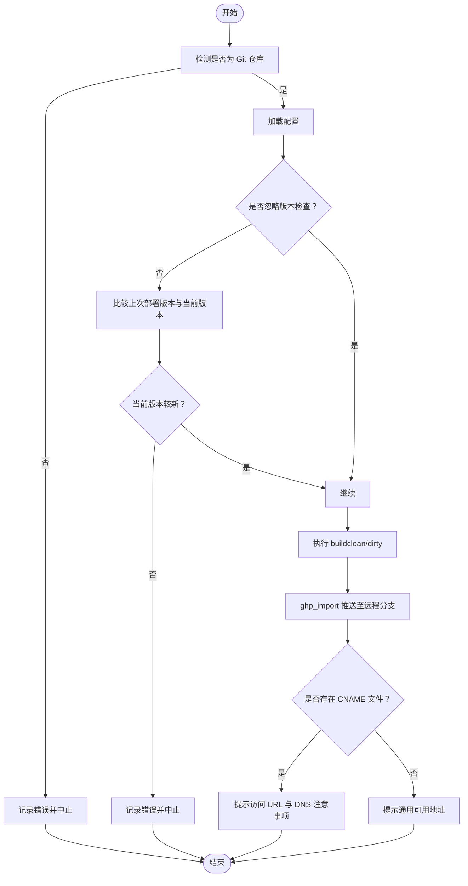
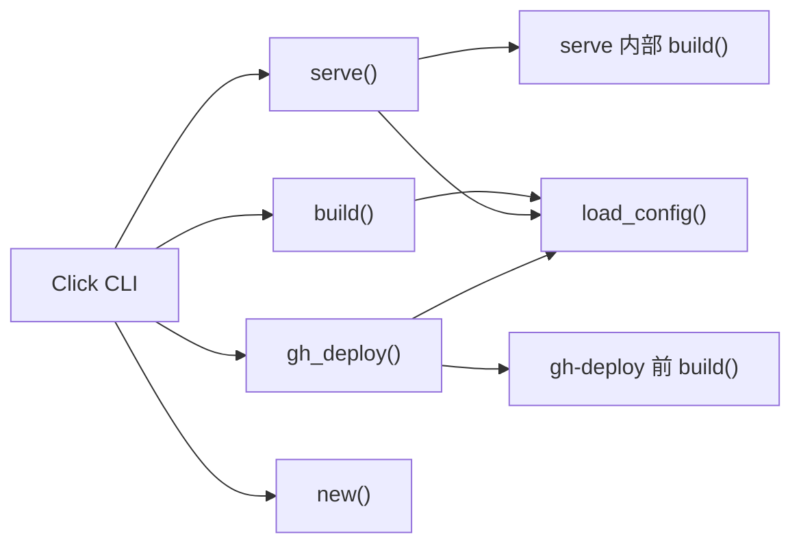

# 命令行界面

<cite>
**本文引用的文件列表**
- [mkdocs/__main__.py](file://mkdocs/__main__.py)
- [mkdocs/commands/build.py](file://mkdocs/commands/build.py)
- [mkdocs/commands/serve.py](file://mkdocs/commands/serve.py)
- [mkdocs/commands/gh_deploy.py](file://mkdocs/commands/gh_deploy.py)
- [mkdocs/commands/new.py](file://mkdocs/commands/new.py)
- [mkdocs/livereload/__init__.py](file://mkdocs/livereload/__init__.py)
- [mkdocs/config/base.py](file://mkdocs/config/base.py)
- [mkdocs/tests/cli_tests.py](file://mkdocs/tests/cli_tests.py)
- [docs/user-guide/cli.md](file://docs/user-guide/cli.md)
</cite>

## 目录
1. [简介](#简介)
2. [项目结构与入口](#项目结构与入口)
3. [核心命令总览](#核心命令总览)
4. [架构概览](#架构概览)
5. [命令详解与最佳实践](#命令详解与最佳实践)
6. [依赖关系与事件流](#依赖关系与事件流)
7. [性能与批量处理建议](#性能与批量处理建议)
8. [CI/CD 使用指南](#cicd-使用指南)
9. [故障排除与常见问题](#故障排除与常见问题)
10. [结论](#结论)

## 简介
本文件系统性梳理 MkDocs 的命令行接口，覆盖 build、serve、gh-deploy、new 等命令的参数、行为、工作流程、最佳实践与故障排除，并给出 CI/CD 集成建议与性能优化要点。读者无需深入源码即可高效使用 CLI 并理解其内部机制。

## 项目结构与入口
- 命令入口由 Click 定义，集中于主模块，按子命令分发到各命令实现：
  - serve：开发服务器与热重载
  - build：静态站点构建
  - gh-deploy：部署到 GitHub Pages
  - new：初始化项目骨架
- 配置加载与校验由配置层完成，贯穿各命令执行前后的生命周期。

图表来源
- [mkdocs/__main__.py](file://mkdocs/__main__.py#L240-L371)
- [mkdocs/commands/serve.py](file://mkdocs/commands/serve.py#L1-L111)
- [mkdocs/commands/build.py](file://mkdocs/commands/build.py#L1-L370)
- [mkdocs/commands/gh_deploy.py](file://mkdocs/commands/gh_deploy.py#L1-L170)
- [mkdocs/commands/new.py](file://mkdocs/commands/new.py#L1-L54)
- [mkdocs/livereload/__init__.py](file://mkdocs/livereload/__init__.py#L1-L382)
- [mkdocs/config/base.py](file://mkdocs/config/base.py#L340-L393)

章节来源
- [mkdocs/__main__.py](file://mkdocs/__main__.py#L240-L371)
- [docs/user-guide/cli.md](file://docs/user-guide/cli.md#L1-L9)

## 核心命令总览
- build：生成静态站点，默认清理旧产物；支持 --clean/--dirty 切换。
- serve：本地开发服务器，自动热重载；支持 --dirty/--clean 模式、主题监听、自定义监听路径。
- gh-deploy：构建后推送至 GitHub Pages 分支；支持提交信息、强制推送、历史替换、版本检查等。
- new：在指定目录生成基础项目结构（mkdocs.yml、docs/index.md）。

章节来源
- [mkdocs/__main__.py](file://mkdocs/__main__.py#L253-L326)
- [mkdocs/commands/build.py](file://mkdocs/commands/build.py#L249-L370)
- [mkdocs/commands/serve.py](file://mkdocs/commands/serve.py#L20-L111)
- [mkdocs/commands/gh_deploy.py](file://mkdocs/commands/gh_deploy.py#L100-L170)
- [mkdocs/commands/new.py](file://mkdocs/commands/new.py#L29-L54)

## 架构概览
命令执行的通用流程：
- 解析 CLI 参数（Click）
- 加载配置（配置层）
- 触发插件启动事件
- 执行具体命令逻辑（构建/服务/部署/初始化）
- 触发插件关闭事件

图表来源
- [mkdocs/__main__.py](file://mkdocs/__main__.py#L275-L326)
- [mkdocs/config/base.py](file://mkdocs/config/base.py#L340-L393)
- [mkdocs/commands/build.py](file://mkdocs/commands/build.py#L249-L370)
- [mkdocs/commands/serve.py](file://mkdocs/commands/serve.py#L59-L111)
- [mkdocs/commands/gh_deploy.py](file://mkdocs/commands/gh_deploy.py#L100-L170)

## 命令详解与最佳实践

### build 命令
- 功能：根据配置生成静态站点，可选择清理或增量模式。
- 关键参数
  - --clean/--dirty：默认 --clean；--dirty 仅重建变更文件（开发用途）
  - --config-file/-f：指定配置文件
  - --strict/--no-strict：严格模式，警告即终止
  - --theme/-t：指定主题
  - --use-directory-urls/--no-directory-urls：控制链接风格
  - --site-dir/-d：输出目录
  - -v/--verbose、-q/--quiet、--color/--no-color：日志级别与颜色
- 行为细节
  - 清理输出目录（若非 --dirty）
  - 收集文件、构建导航、渲染页面、复制静态资源、生成模板
  - 严格模式下统计警告并可能中止
- 最佳实践
  - 在 CI 中使用 --strict 以尽早发现配置与内容问题
  - 开发时配合 serve 的 --dirty 或 --clean 模式进行快速迭代
  - 大型站点建议使用 --dirty 与缓存策略减少重复构建

章节来源
- [mkdocs/__main__.py](file://mkdocs/__main__.py#L275-L291)
- [mkdocs/commands/build.py](file://mkdocs/commands/build.py#L249-L370)
- [mkdocs/config/base.py](file://mkdocs/config/base.py#L340-L393)

### serve 命令
- 功能：本地开发服务器，自动热重载，支持打开浏览器、监听主题与自定义路径。
- 关键参数
  - --dev-addr/-a：本地地址与端口（如 0.0.0.0:8000）
  - --open/-o：首次构建完成后打开浏览器
  - --livereload/--no-livereload：启用/禁用热重载
  - --dirty/--dirtyreload：增量构建（仅变更文件）
  - --clean：纯 build 后 serve（不带 serve 特性）
  - --watch-theme：监听主题文件变化
  - --watch/-w：额外监听目录/文件（可多次）
  - --config-file/-f、--strict、--theme、--use-directory-urls、-v/-q、--color
- 行为细节
  - 使用临时目录作为站点根，避免污染当前目录
  - 初始化配置，设置 site_url 与挂载路径
  - 启动热重载服务器，监听 docs_dir、config 文件与主题目录
  - 插件可通过 on_serve 注入自定义行为
- 最佳实践
  - 多人协作时优先使用 --dirty 以提升响应速度
  - 自定义监听路径用于外部资源或第三方模板
  - 结合 --open 快速预览

图表来源
- [mkdocs/commands/serve.py](file://mkdocs/commands/serve.py#L20-L111)
- [mkdocs/livereload/__init__.py](file://mkdocs/livereload/__init__.py#L94-L382)
- [mkdocs/commands/build.py](file://mkdocs/commands/build.py#L249-L370)

章节来源
- [mkdocs/__main__.py](file://mkdocs/__main__.py#L253-L273)
- [mkdocs/commands/serve.py](file://mkdocs/commands/serve.py#L20-L111)
- [mkdocs/livereload/__init__.py](file://mkdocs/livereload/__init__.py#L94-L382)

### gh-deploy 命令
- 功能：构建后将站点推送到 GitHub Pages 分支（默认 gh-pages），支持多种推送选项与版本检查。
- 关键参数
  - --clean/--dirty：构建策略
  - -m/--message：提交信息（支持 {sha}、{version} 占位）
  - -b/--remote-branch：远程分支名（覆盖配置）
  - -r/--remote-name：远程名（覆盖配置）
  - --force：强制推送
  - --no-history：替换整条历史为单次提交
  - --ignore-version：忽略版本检查
  - --shell：通过 shell 调用 git
  - --config-file/-f、--strict、--theme、--use-directory-urls、-d/--site-dir、-v/-q、--color
- 行为细节
  - 校验是否为 git 仓库
  - 可选版本检查（比较上次部署版本与当前版本）
  - 使用 ghp-import 将站点目录导入远程分支并推送
  - 若存在 CNAME 文件，提示访问域名与 DNS 注意事项
- 最佳实践
  - 生产部署前使用 --dry-run 思考流程（可在 CI 中模拟）
  - 使用 --no-history 进行“干净历史”发布
  - 避免在 CI 中直接暴露敏感凭据，使用环境变量与令牌

图表来源
- [mkdocs/commands/gh_deploy.py](file://mkdocs/commands/gh_deploy.py#L100-L170)
- [mkdocs/commands/build.py](file://mkdocs/commands/build.py#L249-L370)

章节来源
- [mkdocs/__main__.py](file://mkdocs/__main__.py#L293-L326)
- [mkdocs/commands/gh_deploy.py](file://mkdocs/commands/gh_deploy.py#L100-L170)

### new 命令
- 功能：在目标目录生成基础项目结构（mkdocs.yml、docs/index.md），若已存在则跳过。
- 关键参数
  - 位置参数：project_directory
  - -v/-q、--color：日志级别与颜色
- 最佳实践
  - 作为脚手架自动化的一部分，结合 CI 初始化新仓库
  - 生成后立即运行 serve 验证基本链路

章节来源
- [mkdocs/__main__.py](file://mkdocs/__main__.py#L359-L367)
- [mkdocs/commands/new.py](file://mkdocs/commands/new.py#L29-L54)

## 依赖关系与事件流

### 命令间关系与调用链
- serve 内部会调用 build 并注入 serve_url；gh-deploy 先 build 再 gh_deploy
- 配置加载与校验贯穿所有命令，严格模式下会在构建阶段对警告计数并可能中止

图表来源
- [mkdocs/__main__.py](file://mkdocs/__main__.py#L253-L326)
- [mkdocs/commands/serve.py](file://mkdocs/commands/serve.py#L59-L66)
- [mkdocs/commands/gh_deploy.py](file://mkdocs/commands/gh_deploy.py#L315-L325)
- [mkdocs/config/base.py](file://mkdocs/config/base.py#L340-L393)

### 插件事件与生命周期
- 启动/关闭：on_startup(command, dirty)、on_shutdown()
- 构建期：on_config、on_pre_build、on_files、on_nav、on_env、on_pre_page、on_page_markdown、on_page_content、on_page_context、on_post_page、on_post_build、on_build_error
- 服务期：on_serve（可注入 LiveReloadServer）

章节来源
- [mkdocs/__main__.py](file://mkdocs/__main__.py#L284-L290)
- [mkdocs/commands/serve.py](file://mkdocs/commands/serve.py#L95-L96)
- [mkdocs/commands/build.py](file://mkdocs/commands/build.py#L264-L357)

## 性能与批量处理建议
- 使用 --dirty 模式进行增量构建，减少不必要的页面渲染与静态资源复制
- serve 时启用 --dirty 或 --clean 以平衡首次构建与热更新体验
- 大型站点建议：
  - 将大体积资源移出 docs_dir 或使用 CDN
  - 合理拆分文档，减少单页体量
  - 在 CI 中缓存依赖与中间产物（如 Python 包、主题资源）
- 批量处理技巧
  - 通过 --watch/-w 指定多个目录，统一纳入热重载范围
  - 使用 --use-directory-urls 减少链接转换开销（视部署平台而定）

[本节为通用建议，不直接分析特定文件]

## CI/CD 使用指南
- 建议流程
  - 安装依赖（pip/conda）
  - 运行 mkdocs build（或 mkdocs gh-deploy）
  - 在 gh-pages 分支推送站点（或使用静态托管服务）
- 常见集成点
  - GitHub Actions：触发条件可设为 push 到 main 或 PR 合并
  - GitLab CI：使用 artifacts 缓存构建结果
  - Azure DevOps：结合静态网站托管
- 最佳实践
  - 在 CI 中启用 --strict，确保质量门禁
  - 使用 --site-dir 指向 CI 产物目录，便于上传
  - 对于 gh-deploy，使用专用令牌而非明文凭据

[本节为通用指导，不直接分析特定文件]

## 故障排除与常见问题
- 配置错误
  - 症状：启动即报错并中止
  - 排查：查看严格模式下的警告与错误；确认配置文件语法与字段正确
- 构建失败
  - 症状：页面渲染异常、空输出、链接失效
  - 排查：检查插件事件链（on_page_markdown/on_page_content/on_post_page）；使用 --verbose 查看详细日志
- 热重载无效
  - 症状：修改文件后未自动刷新
  - 排查：确认监听路径（docs_dir、config、主题、--watch）；Windows 下注意文件系统差异
- 部署失败
  - 症状：无法找到 git、推送被拒绝、版本不匹配
  - 排查：确保 git 工具可用；检查远程分支与权限；必要时使用 --ignore-version 或 --force

章节来源
- [mkdocs/commands/build.py](file://mkdocs/commands/build.py#L349-L361)
- [mkdocs/commands/gh_deploy.py](file://mkdocs/commands/gh_deploy.py#L108-L142)
- [mkdocs/livereload/__init__.py](file://mkdocs/livereload/__init__.py#L192-L225)
- [mkdocs/tests/plugin_tests.py](file://mkdocs/tests/plugin_tests.py#L293-L328)

## 结论
MkDocs 的命令行接口以 Click 统一入口，围绕配置加载与插件事件形成清晰的生命周期。通过合理使用 build、serve、gh-deploy、new 等命令及参数，可在本地高效迭代并在 CI/CD 中稳定交付。建议在团队内统一规范（严格模式、增量构建、热重载策略、部署流程），并结合性能优化与故障排查清单，持续提升文档工程化水平。