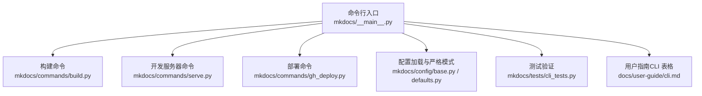
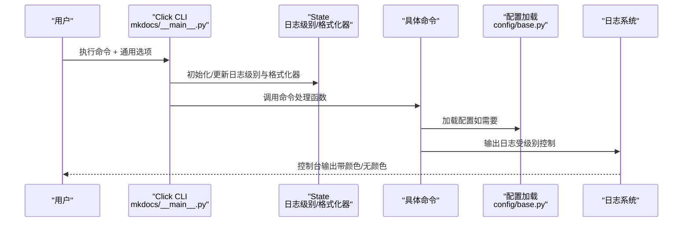
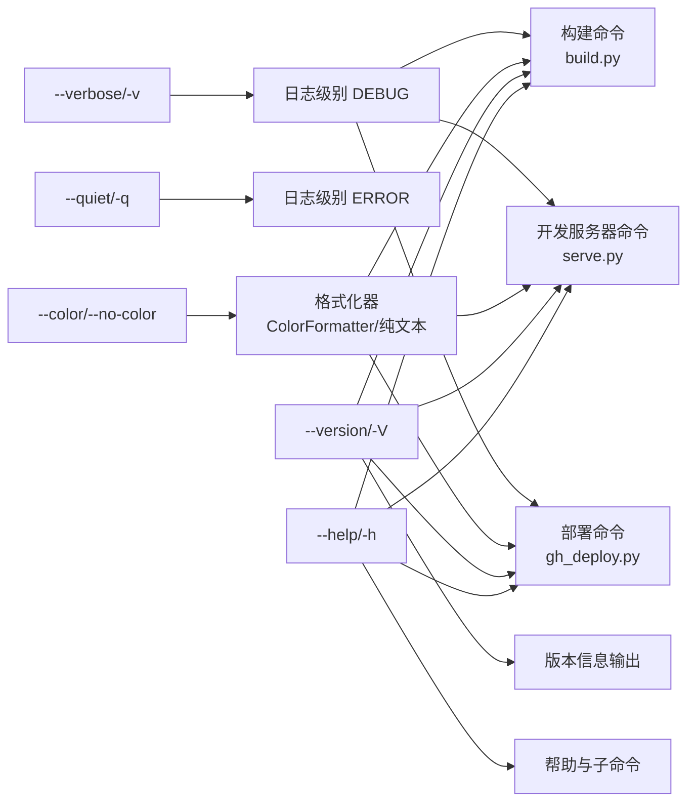

# 通用选项

<cite>
**本文引用的文件列表**
- [mkdocs/__main__.py](file://mkdocs/__main__.py)
- [mkdocs/commands/build.py](file://mkdocs/commands/build.py)
- [mkdocs/commands/serve.py](file://mkdocs/commands/serve.py)
- [mkdocs/commands/gh_deploy.py](file://mkdocs/commands/gh_deploy.py)
- [mkdocs/config/base.py](file://mkdocs/config/base.py)
- [mkdocs/config/defaults.py](file://mkdocs/config/defaults.py)
- [mkdocs/tests/cli_tests.py](file://mkdocs/tests/cli_tests.py)
- [docs/user-guide/cli.md](file://docs/user-guide/cli.md)
</cite>

## 目录
1. [简介](#简介)
2. [项目结构与入口](#项目结构与入口)
3. [核心组件与通用选项](#核心组件与通用选项)
4. [架构总览](#架构总览)
5. [详细组件分析](#详细组件分析)
6. [依赖关系分析](#依赖关系分析)
7. [性能与行为特性](#性能与行为特性)
8. [使用示例与组合技巧](#使用示例与组合技巧)
9. [故障排除指南](#故障排除指南)
10. [结论](#结论)

## 简介
本章节面向 MkDocs 命令行使用者，系统性说明通用选项的作用与用法，包括：
- 日志级别控制：--verbose/-v、--quiet/-q
- 颜色输出控制：--color/--no-color
- 版本信息：--version/-V
- 帮助信息：--help/-h
并解释这些选项如何影响所有命令的行为，提供常见场景下的组合使用技巧与调试建议。

## 项目结构与入口
MkDocs 的命令行入口位于主模块，通过 Click 定义 CLI 组合与全局通用选项，并将通用选项应用到各子命令。核心文件如下：
- 入口与通用选项定义：mkdocs/__main__.py
- 各命令实现：mkdocs/commands/build.py、mkdocs/commands/serve.py、mkdocs/commands/gh_deploy.py
- 配置加载与严格模式：mkdocs/config/base.py、mkdocs/config/defaults.py
- 测试验证：mkdocs/tests/cli_tests.py
- 用户指南（CLI 表格）：docs/user-guide/cli.md

图表来源
- [mkdocs/__main__.py](file://mkdocs/__main__.py#L240-L251)
- [mkdocs/commands/build.py](file://mkdocs/commands/build.py#L249-L370)
- [mkdocs/commands/serve.py](file://mkdocs/commands/serve.py#L20-L111)
- [mkdocs/commands/gh_deploy.py](file://mkdocs/commands/gh_deploy.py#L100-L170)
- [mkdocs/config/base.py](file://mkdocs/config/base.py#L340-L393)
- [mkdocs/config/defaults.py](file://mkdocs/config/defaults.py#L13-L26)
- [mkdocs/tests/cli_tests.py](file://mkdocs/tests/cli_tests.py#L360-L377)
- [docs/user-guide/cli.md](file://docs/user-guide/cli.md#L1-L9)

章节来源
- [mkdocs/__main__.py](file://mkdocs/__main__.py#L240-L251)
- [docs/user-guide/cli.md](file://docs/user-guide/cli.md#L1-L9)

## 核心组件与通用选项
通用选项由入口模块集中定义并通过装饰器注入到各命令。它们对日志级别、颜色输出、帮助与版本信息进行统一控制。

- 日志级别控制
  - --verbose/-v：启用详细输出，将日志级别设置为 DEBUG
  - --quiet/-q：静默警告，将日志级别设置为 ERROR
- 颜色输出控制
  - --color/--no-color：强制启用或禁用颜色与换行；默认自动检测终端能力
- 版本信息
  - --version/-V：显示版本与运行环境信息
- 帮助信息
  - --help/-h：显示帮助与子命令列表

这些选项通过 Click 的回调函数在上下文中维护一个 State 对象，该对象持有日志记录器与 StreamHandler，并根据选项动态调整日志级别与格式化器。

章节来源
- [mkdocs/__main__.py](file://mkdocs/__main__.py#L163-L216)
- [mkdocs/__main__.py](file://mkdocs/__main__.py#L91-L106)

## 架构总览
通用选项在 CLI 层面的交互流程如下：

图表来源
- [mkdocs/__main__.py](file://mkdocs/__main__.py#L240-L251)
- [mkdocs/__main__.py](file://mkdocs/__main__.py#L91-L106)
- [mkdocs/config/base.py](file://mkdocs/config/base.py#L340-L393)

## 详细组件分析

### 通用选项实现与行为
- verbose_option
  - 触发条件：传入 --verbose/-v
  - 行为：将日志级别提升至 DEBUG，便于排查细节
- quiet_option
  - 触发条件：传入 --quiet/-q
  - 行为：将日志级别提升至 ERROR，仅输出错误与严重问题
- color_option
  - 触发条件：显式传入 --color 或 --no-color；或未显式指定但自动检测不支持颜色（TTY 不可用、NO_COLOR 环境变量存在、TERM=dumb）
  - 行为：切换彩色前缀与换行包装；否则使用纯文本格式化器
- version_option
  - 触发条件：传入 --version/-V
  - 行为：打印程序名、版本与 Python 版本等信息
- help_option_names
  - 触发条件：传入 -h/--help
  - 行为：打印帮助与子命令列表

章节来源
- [mkdocs/__main__.py](file://mkdocs/__main__.py#L163-L216)
- [mkdocs/__main__.py](file://mkdocs/__main__.py#L240-L248)

### 日志级别与颜色输出机制
- 日志级别映射
  - INFO（默认）：输出常规信息
  - DEBUG（--verbose）：输出详细调试信息
  - ERROR（--quiet）：仅输出错误
- 颜色输出
  - 彩色前缀：对 CRITICAL/ERROR/WARNING/DEBUG 设置不同颜色
  - 自动检测：若非 TTY、NO_COLOR 存在或 TERM=dumb，则禁用颜色
  - 换行包装：根据终端宽度自动换行，避免长行溢出

章节来源
- [mkdocs/__main__.py](file://mkdocs/__main__.py#L61-L89)
- [mkdocs/__main__.py](file://mkdocs/__main__.py#L195-L216)

### 严格模式与配置加载
- 严格模式（--strict）由配置层控制，当启用时，配置警告会触发构建中断
- 配置加载过程中会输出配置项的调试信息，便于定位问题

章节来源
- [mkdocs/config/defaults.py](file://mkdocs/config/defaults.py#L140-L143)
- [mkdocs/config/base.py](file://mkdocs/config/base.py#L374-L392)

### 命令对通用选项的继承
- 所有命令均通过装饰器继承通用选项，确保日志级别与颜色策略一致
- 部分命令（如 get-deps）单独定义了 verbose 选项，以满足特定需求

章节来源
- [mkdocs/__main__.py](file://mkdocs/__main__.py#L247-L248)
- [mkdocs/__main__.py](file://mkdocs/__main__.py#L329-L337)

## 依赖关系分析
通用选项与命令实现之间的依赖关系如下：

图表来源
- [mkdocs/__main__.py](file://mkdocs/__main__.py#L163-L216)
- [mkdocs/commands/build.py](file://mkdocs/commands/build.py#L249-L370)
- [mkdocs/commands/serve.py](file://mkdocs/commands/serve.py#L20-L111)
- [mkdocs/commands/gh_deploy.py](file://mkdocs/commands/gh_deploy.py#L100-L170)

章节来源
- [mkdocs/__main__.py](file://mkdocs/__main__.py#L163-L216)
- [mkdocs/commands/build.py](file://mkdocs/commands/build.py#L249-L370)
- [mkdocs/commands/serve.py](file://mkdocs/commands/serve.py#L20-L111)
- [mkdocs/commands/gh_deploy.py](file://mkdocs/commands/gh_deploy.py#L100-L170)

## 性能与行为特性
- 日志级别变更不会改变命令执行逻辑，仅影响输出量与粒度
- 颜色输出在非 TTY 环境（如管道、CI）会自动降级为纯文本，避免污染输出
- 严格模式会增加配置校验成本，但在 CI 中有助于提前发现潜在问题

[本节为通用指导，无需列出具体文件来源]

## 使用示例与组合技巧
以下示例基于测试用例与实现逻辑整理，展示不同场景下的组合方式与预期效果。

- 查看版本
  - 示例：mkdocs -V 或 mkdocs --version
  - 效果：打印版本与运行环境信息
  章节来源
  - [mkdocs/__main__.py](file://mkdocs/__main__.py#L241-L246)

- 显示帮助
  - 示例：mkdocs -h 或 mkdocs --help
  - 效果：打印帮助与子命令列表
  章节来源
  - [mkdocs/__main__.py](file://mkdocs/__main__.py#L240-L241)

- 详细输出（调试）
  - 示例：mkdocs build --verbose
  - 效果：日志级别提升至 DEBUG，输出更多细节
  章节来源
  - [mkdocs/tests/cli_tests.py](file://mkdocs/tests/cli_tests.py#L360-L367)
  - [mkdocs/commands/build.py](file://mkdocs/commands/build.py#L249-L370)

- 静默警告（仅错误）
  - 示例：mkdocs build --quiet
  - 效果：日志级别提升至 ERROR，仅输出错误
  章节来源
  - [mkdocs/tests/cli_tests.py](file://mkdocs/tests/cli_tests.py#L370-L377)

- 强制启用/禁用颜色
  - 示例：mkdocs build --color
  - 示例：mkdocs build --no-color
  - 效果：在非 TTY 环境中强制启用/禁用颜色输出
  章节来源
  - [mkdocs/__main__.py](file://mkdocs/__main__.py#L195-L216)

- 组合使用技巧
  - 调试构建：mkdocs build --verbose --color
  - 静默部署：mkdocs gh-deploy --quiet --no-color
  - CI 场景：mkdocs build --strict --quiet（严格模式 + 只输出错误）
  - 开发预览：mkdocs serve --verbose --open（开启浏览器）

[本节为使用示例汇总，无需列出具体文件来源]

## 故障排除指南
- 严格模式导致构建失败
  - 现象：启用 --strict 后，任何配置警告都会导致构建中断
  - 处理：先用 --verbose 查看详细警告，修复配置后再尝试构建
  章节来源
  - [mkdocs/config/defaults.py](file://mkdocs/config/defaults.py#L140-L143)
  - [mkdocs/config/base.py](file://mkdocs/config/base.py#L387-L391)

- 颜色输出异常（CI/管道）
  - 现象：CI 环境输出带颜色或换行异常
  - 处理：显式添加 --no-color，或在环境变量中设置 NO_COLOR
  章节来源
  - [mkdocs/__main__.py](file://mkdocs/__main__.py#L195-L216)

- 日志过多或过少
  - 过多：使用 --quiet 将日志级别提升至 ERROR
  - 过少：使用 --verbose 将日志级别降至 DEBUG
  章节来源
  - [mkdocs/tests/cli_tests.py](file://mkdocs/tests/cli_tests.py#L360-L377)

- 帮助信息不完整
  - 现象：某些子命令参数未显示
  - 处理：使用 -h/--help 查看当前命令的帮助；或参考用户指南中的 CLI 表格
  章节来源
  - [docs/user-guide/cli.md](file://docs/user-guide/cli.md#L1-L9)

## 结论
通用选项为 MkDocs 提供了一致的日志级别、颜色输出与帮助/版本控制体验。通过合理组合 --verbose/--quiet、--color/--no-color、--version/-V、--help/-h，可以在开发调试、CI 部署与日常使用中获得最佳的可观测性与可读性。严格模式配合 --quiet 可在自动化环境中实现“零容忍”的质量保障。