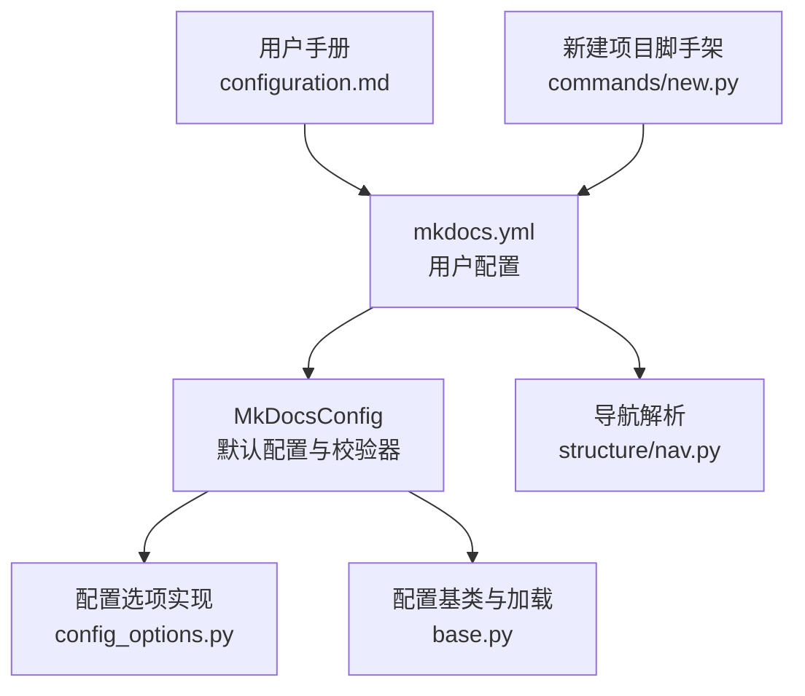
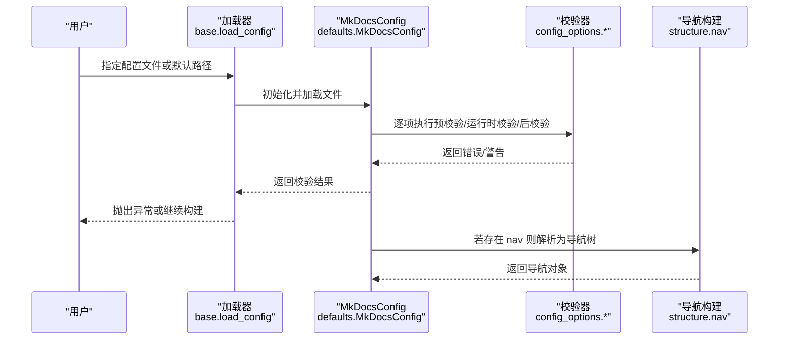
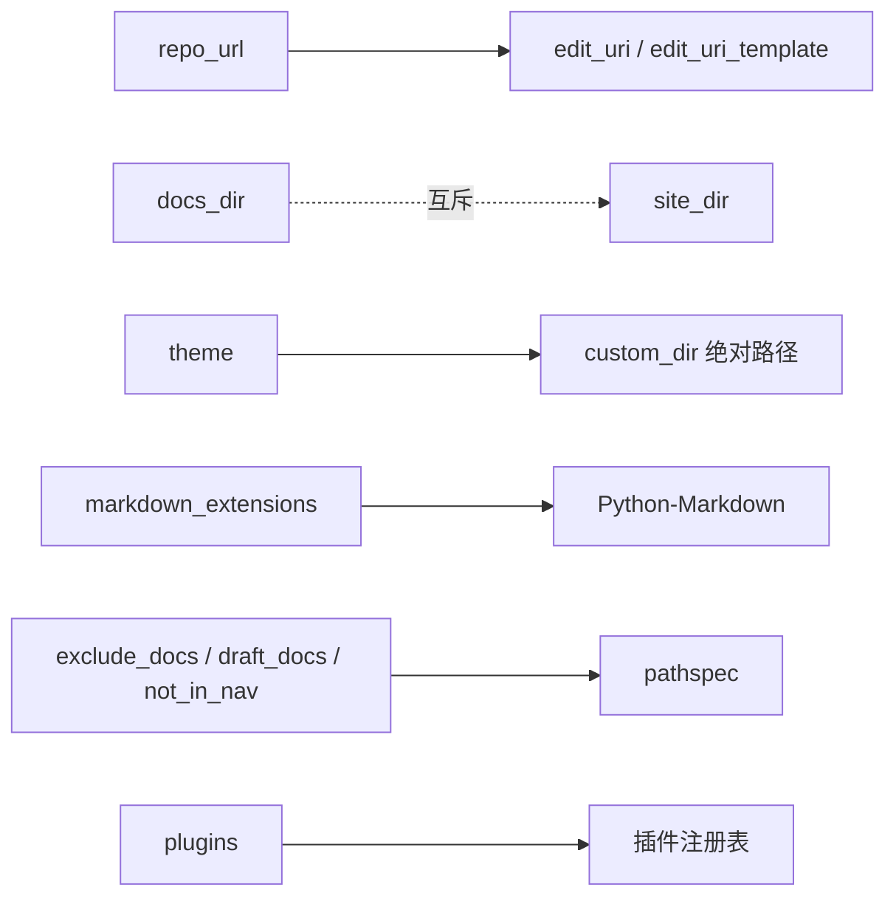

# 基本配置

<cite>
**本文引用的文件**
- [mkdocs.yml](file://mkdocs.yml)
- [配置指南（用户手册）](file://docs/user-guide/configuration.md)
- [默认配置与校验器](file://mkdocs/config/defaults.py)
- [配置选项实现](file://mkdocs/config/config_options.py)
- [配置基类与加载流程](file://mkdocs/config/base.py)
- [导航解析与渲染](file://mkdocs/structure/nav.py)
- [最小化集成测试配置](file://mkdocs/tests/integration/minimal/mkdocs.yml)
- [子页面集成测试配置](file://mkdocs/tests/integration/subpages/mkdocs.yml)
- [新建项目脚手架](file://mkdocs/commands/new.py)
- [异常定义](file://mkdocs/exceptions.py)
</cite>

## 目录
1. [简介](#简介)
2. [项目结构](#项目结构)
3. [核心组件](#核心组件)
4. [架构总览](#架构总览)
5. [详细组件分析](#详细组件分析)
6. [依赖关系分析](#依赖关系分析)
7. [性能考量](#性能考量)
8. [故障排查指南](#故障排查指南)
9. [结论](#结论)
10. [附录](#附录)

## 简介
本篇“基本配置”文档面向首次使用或需要系统掌握 MkDocs 配置的读者，围绕 mkdocs.yml 的基本结构、常用配置项、配置优先级与覆盖规则、配置验证与常见错误诊断，以及不同项目类型的模板与最佳实践展开。内容基于仓库中实际的配置定义、校验逻辑与用户手册文档整理而成，确保可操作性与准确性。

## 项目结构
- 配置文件：mkdocs.yml（位于仓库根目录）
- 用户手册：docs/user-guide/configuration.md（包含所有可用配置项的权威说明）
- 核心配置实现：mkdocs/config/defaults.py（定义配置项与默认值）、mkdocs/config/config_options.py（类型与校验器）、mkdocs/config/base.py（配置基类与加载流程）
- 导航解析：mkdocs/structure/nav.py（导航树构建与校验）
- 测试样例：mkdocs/tests/integration/minimal/mkdocs.yml、mkdocs/tests/integration/subpages/mkdocs.yml
- 新建项目脚手架：mkdocs/commands/new.py（生成基础配置）

图表来源
- [mkdocs.yml](file://mkdocs.yml#L1-L80)
- [默认配置与校验器](file://mkdocs/config/defaults.py#L38-L219)
- [配置选项实现](file://mkdocs/config/config_options.py#L1-L1227)
- [配置基类与加载流程](file://mkdocs/config/base.py#L123-L393)
- [导航解析与渲染](file://mkdocs/structure/nav.py#L130-L186)
- [配置指南（用户手册）](file://docs/user-guide/configuration.md#L1-L1290)
- [新建项目脚手架](file://mkdocs/commands/new.py#L29-L54)

章节来源
- [mkdocs.yml](file://mkdocs.yml#L1-L80)
- [配置指南（用户手册）](file://docs/user-guide/configuration.md#L1-L1290)
- [默认配置与校验器](file://mkdocs/config/defaults.py#L38-L219)
- [配置基类与加载流程](file://mkdocs/config/base.py#L123-L393)
- [导航解析与渲染](file://mkdocs/structure/nav.py#L130-L186)
- [新建项目脚手架](file://mkdocs/commands/new.py#L29-L54)

## 核心组件
- 配置文件定位与加载
  - 默认文件名：mkdocs.yml 或 mkdocs.yaml；可通过命令行参数指定路径
  - 加载顺序：先加载默认 schema，再从文件读取，最后合并命令行传入的覆盖项
- 核心配置项（节选）
  - 项目信息：site_name、site_url、site_description、site_author、repo_url、repo_name、edit_uri、edit_uri_template、copyright、remote_branch、remote_name
  - 文档布局：nav、exclude_docs、draft_docs、not_in_nav、validation
  - 构建目录：docs_dir、site_dir、use_directory_urls
  - 主题与样式：theme、extra_css、extra_javascript、extra_templates、extra
  - 预览与热重载：watch、dev_addr、strict
  - Markdown 扩展：markdown_extensions
  - 插件与钩子：plugins、hooks
  - 监视目录：watch
- 校验与错误处理
  - 配置在三个阶段执行：预校验（pre_validation）、运行时校验（run_validation）、后校验（post_validation）
  - 严格模式 strict 控制警告是否导致中断
  - 未识别配置项会记录警告

章节来源
- [配置基类与加载流程](file://mkdocs/config/base.py#L340-L393)
- [默认配置与校验器](file://mkdocs/config/defaults.py#L38-L219)
- [配置选项实现](file://mkdocs/config/config_options.py#L1-L1227)
- [配置指南（用户手册）](file://docs/user-guide/configuration.md#L1-L1290)

## 架构总览
下图展示从配置文件到最终校验与应用的关键流程：

图表来源
- [配置基类与加载流程](file://mkdocs/config/base.py#L340-L393)
- [默认配置与校验器](file://mkdocs/config/defaults.py#L38-L219)
- [配置选项实现](file://mkdocs/config/config_options.py#L1-L1227)
- [导航解析与渲染](file://mkdocs/structure/nav.py#L130-L186)

## 详细组件分析

### 1) 项目信息与元数据
- site_name（必需）
  - 含义：站点主标题，传递给主题上下文
  - 位置：用户手册“项目信息”章节
- site_url
  - 含义：站点规范 URL，用于 HTML head 的 canonical 标签与本地服务路径挂载
  - 注意：若站点位于域名子目录，需包含该子目录
- repo_url / repo_name
  - 含义：源码仓库链接与名称，影响页面上的仓库链接
- edit_uri / edit_uri_template
  - 含义：直接跳转到源仓库对应页面的编辑链接
  - 行为：若仅设置 repo_url，某些平台会自动推断默认 edit_uri；也可通过 edit_uri_template 使用占位符定制
- site_description / site_author / copyright
  - 含义：HTML meta 与页脚版权信息
- remote_branch / remote_name
  - 含义：gh-deploy 推送目标分支与远程名

章节来源
- [配置指南（用户手册）](file://docs/user-guide/configuration.md#L15-L234)
- [默认配置与校验器](file://mkdocs/config/defaults.py#L44-L148)
- [配置选项实现](file://mkdocs/config/config_options.py#L569-L687)

### 2) 文档布局与导航
- nav
  - 含义：全局导航结构；默认为按字母排序的嵌套文档列表
  - 支持：内部文件、外部链接、相对/绝对路径；可分组为多级
  - 行为：未显式配置时，会根据 docs_dir 内部文件自动生成导航
- exclude_docs / draft_docs / not_in_nav
  - 含义：排除/草稿/不在导航中的文件匹配规则（.gitignore 语法）
  - 行为：exclude_docs 优先于 not_in_nav；draft_docs 在 serve 时可见并标注草稿
- validation
  - 含义：链接与导航的严格度控制，支持 warn/info/ignore 及特殊值 relative_to_docs
  - 影响：导航缺失文件、未找到、绝对链接、Markdown 链接锚点/未知链接等

章节来源
- [配置指南（用户手册）](file://docs/user-guide/configuration.md#L235-L483)
- [默认配置与校验器](file://mkdocs/config/defaults.py#L47-L199)
- [导航解析与渲染](file://mkdocs/structure/nav.py#L130-L186)
- [配置选项实现](file://mkdocs/config/config_options.py#L1217-L1227)

### 3) 构建目录与输出
- docs_dir / site_dir
  - 含义：文档源目录与构建输出目录
  - 行为：两者不能互相包含，避免循环复制
- use_directory_urls
  - 含义：是否使用目录风格 URL（/page/），默认开启
  - 场景：文件系统直开或 S3 等不支持 index.html 的环境建议关闭

章节来源
- [配置指南（用户手册）](file://docs/user-guide/configuration.md#L484-L732)
- [默认配置与校验器](file://mkdocs/config/defaults.py#L76-L104)
- [配置选项实现](file://mkdocs/config/config_options.py#L774-L803)

### 4) 主题与样式扩展
- theme
  - 含义：主题名称或键值对（name、locale、custom_dir、static_templates 等）
  - 行为：校验主题是否存在，custom_dir 必须为绝对路径且存在
- extra_css / extra_javascript / extra_templates / extra
  - 含义：注入 CSS/JS/模板与自定义变量
  - 注意：JS 支持 type/async/defer 等属性；.js/.css 会被复制到站点

章节来源
- [配置指南（用户手册）](file://docs/user-guide/configuration.md#L577-L651)
- [默认配置与校验器](file://mkdocs/config/defaults.py#L73-L131)
- [配置选项实现](file://mkdocs/config/config_options.py#L805-L859)

### 5) Markdown 扩展与插件生态
- markdown_extensions
  - 含义：启用的扩展列表及各自配置
  - 行为：内置扩展会自动生效；扩展名必须可被 Python-Markdown 识别
- plugins
  - 含义：插件列表或字典；支持命名空间插件与多实例
  - 行为：校验插件存在性与配置合法性；支持缓存与多次实例提示

章节来源
- [配置指南（用户手册）](file://docs/user-guide/configuration.md#L735-L800)
- [默认配置与校验器](file://mkdocs/config/defaults.py#L132-L160)
- [配置选项实现](file://mkdocs/config/config_options.py#L955-L1040)
- [配置选项实现](file://mkdocs/config/config_options.py#L1041-L1166)

### 6) 预览控制与热重载
- watch
  - 含义：serve 时额外监视的目录
- dev_addr
  - 含义：本地开发服务器地址，默认 127.0.0.1:8000
- strict
  - 含义：遇到警告是否中断构建

章节来源
- [配置指南（用户手册）](file://docs/user-guide/configuration.md#L652-L732)
- [默认配置与校验器](file://mkdocs/config/defaults.py#L96-L142)
- [配置选项实现](file://mkdocs/config/config_options.py#L463-L490)

### 7) 配置优先级与覆盖规则
- 文件优先级
  - 默认配置文件：mkdocs.yml 或 mkdocs.yaml
  - 命令行覆盖：通过命令行参数传入的选项会覆盖配置文件中的同名项
- 校验阶段
  - 预校验：执行依赖前置条件的检查
  - 运行时校验：类型与格式验证
  - 后校验：基于其他配置项的二次处理（如派生 edit_uri）
- 严格模式
  - strict=true 时，任何警告都会导致构建中断

章节来源
- [配置基类与加载流程](file://mkdocs/config/base.py#L340-L393)
- [默认配置与校验器](file://mkdocs/config/defaults.py#L140-L142)

### 8) 配置验证方法与常见错误
- 验证流程
  - 预校验 → 运行时校验 → 后校验
  - 未识别项：记录警告
  - 错误项：抛出异常并终止
- 常见错误与诊断
  - 未设置 site_name：必填项缺失
  - URL 格式错误：缺少协议或网络部分
  - 主题不存在或 custom_dir 路径无效
  - 插件未安装或配置非法
  - docs_dir/site_dir 互相包含
  - 导航项未找到或被排除
  - 绝对链接未启用 relative_to_docs 却未修正

章节来源
- [配置基类与加载流程](file://mkdocs/config/base.py#L181-L243)
- [异常定义](file://mkdocs/exceptions.py#L22-L27)
- [默认配置与校验器](file://mkdocs/config/defaults.py#L38-L219)
- [配置选项实现](file://mkdocs/config/config_options.py#L492-L527)
- [配置选项实现](file://mkdocs/config/config_options.py#L805-L859)
- [配置选项实现](file://mkdocs/config/config_options.py#L1041-L1166)
- [导航解析与渲染](file://mkdocs/structure/nav.py#L148-L185)

### 9) 创建向导与最佳实践
- 创建向导（步骤）
  - 使用脚手架生成基础项目结构与 mkdocs.yml
  - 至少填写 site_name
  - 明确 docs_dir/site_dir/use_directory_urls
  - 配置 theme、extra_css/extra_javascript（如需）
  - 定义 nav 或接受默认自动生成
  - 设置 repo_url/edit_uri（可选）
  - 启用 plugins（如 search、autorefs 等）
- 最佳实践
  - 将构建产物 site/ 添加至版本控制忽略列表
  - 使用 validation 逐步提升严格度
  - 对外链接使用绝对路径时明确意图
  - 草稿内容使用 draft_docs 区分构建与预览

章节来源
- [新建项目脚手架](file://mkdocs/commands/new.py#L29-L54)
- [配置指南（用户手册）](file://docs/user-guide/configuration.md#L1-L14)
- [默认配置与校验器](file://mkdocs/config/defaults.py#L544-L576)

### 10) 不同项目类型的配置模板与示例
- 最小化示例（仅包含 site_name 与基础导航）
  - 参考：mkdocs/tests/integration/minimal/mkdocs.yml
- 子页面示例（仅包含 site_name）
  - 参考：mkdocs/tests/integration/subpages/mkdocs.yml
- 官方示例（完整功能）
  - 参考：mkdocs.yml（仓库根目录）

章节来源
- [最小化集成测试配置](file://mkdocs/tests/integration/minimal/mkdocs.yml#L1-L7)
- [子页面集成测试配置](file://mkdocs/tests/integration/subpages/mkdocs.yml#L1-L2)
- [mkdocs.yml](file://mkdocs.yml#L1-L80)

## 依赖关系分析
- 配置项之间的耦合
  - repo_url 与 edit_uri/edit_uri_template 存在互斥与派生关系
  - docs_dir/site_dir 互斥关系在后校验中强制约束
  - theme 与 custom_dir 的路径解析
- 外部依赖
  - Python-Markdown：markdown_extensions 的有效性由其校验
  - pathspec：exclude_docs/draft_docs/not_in_nav 的模式匹配
  - 插件注册表：plugins 的可用性与实例化

图表来源
- [默认配置与校验器](file://mkdocs/config/defaults.py#L106-L122)
- [配置选项实现](file://mkdocs/config/config_options.py#L569-L687)
- [配置选项实现](file://mkdocs/config/config_options.py#L774-L803)
- [配置选项实现](file://mkdocs/config/config_options.py#L805-L859)
- [配置选项实现](file://mkdocs/config/config_options.py#L955-L1040)
- [配置选项实现](file://mkdocs/config/config_options.py#L1217-L1227)
- [配置选项实现](file://mkdocs/config/config_options.py#L1041-L1166)

章节来源
- [默认配置与校验器](file://mkdocs/config/defaults.py#L106-L122)
- [配置选项实现](file://mkdocs/config/config_options.py#L569-L687)
- [配置选项实现](file://mkdocs/config/config_options.py#L774-L803)
- [配置选项实现](file://mkdocs/config/config_options.py#L805-L859)
- [配置选项实现](file://mkdocs/config/config_options.py#L955-L1040)
- [配置选项实现](file://mkdocs/config/config_options.py#L1217-L1227)
- [配置选项实现](file://mkdocs/config/config_options.py#L1041-L1166)

## 性能考量
- 导航生成：未显式配置 nav 时，会扫描 docs_dir 并进行排序与嵌套，文件较多时建议显式配置以减少扫描成本
- 插件加载：插件数量与复杂度直接影响启动时间，建议按需启用
- 热重载：watch 目录过多会增加文件监控开销，建议仅添加必要目录

## 故障排查指南
- “配置值未识别”
  - 检查拼写与层级；确认是否为新增/废弃项
- “URL 格式错误”
  - 确保包含协议与主机部分；必要时使用 is_dir=True 的 URL 校验器
- “主题不存在或 custom_dir 无效”
  - 确认主题名称正确；custom_dir 为绝对路径且存在
- “插件未安装”
  - 确认插件已安装；命名空间插件需使用 theme/ 名称前缀
- “docs_dir/site_dir 互相包含”
  - 调整目录结构，避免相互包含
- “导航项未找到或被排除”
  - 检查路径是否相对于 docs_dir；确认未被 exclude_docs 排除
- “绝对链接未生效”
  - 在 validation.links.absolute_links 中启用 relative_to_docs

章节来源
- [配置基类与加载流程](file://mkdocs/config/base.py#L181-L243)
- [异常定义](file://mkdocs/exceptions.py#L22-L27)
- [默认配置与校验器](file://mkdocs/config/defaults.py#L38-L219)
- [配置选项实现](file://mkdocs/config/config_options.py#L492-L527)
- [配置选项实现](file://mkdocs/config/config_options.py#L805-L859)
- [配置选项实现](file://mkdocs/config/config_options.py#L1041-L1166)
- [导航解析与渲染](file://mkdocs/structure/nav.py#L148-L185)

## 结论
mkdocs.yml 是 MkDocs 的核心入口，通过严格的类型与行为校验保障构建质量。建议从最小化配置起步，逐步引入主题、插件与导航，并结合 validation 逐步提升严格度。遵循目录与链接约定、合理使用草稿与排除规则，可显著提升维护效率与用户体验。

## 附录
- 快速参考（常用项）
  - 必填：site_name
  - 项目信息：site_url、repo_url、edit_uri、copyright
  - 导航：nav、exclude_docs、validation
  - 目录：docs_dir、site_dir、use_directory_urls
  - 主题与样式：theme、extra_css、extra_javascript
  - Markdown 扩展：markdown_extensions
  - 插件：plugins
  - 预览：watch、dev_addr、strict

章节来源
- [配置指南（用户手册）](file://docs/user-guide/configuration.md#L1-L1290)
- [默认配置与校验器](file://mkdocs/config/defaults.py#L38-L219)
- [mkdocs.yml](file://mkdocs.yml#L1-L80)