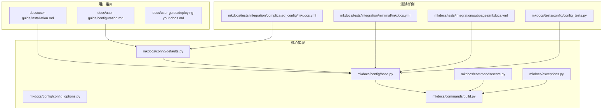
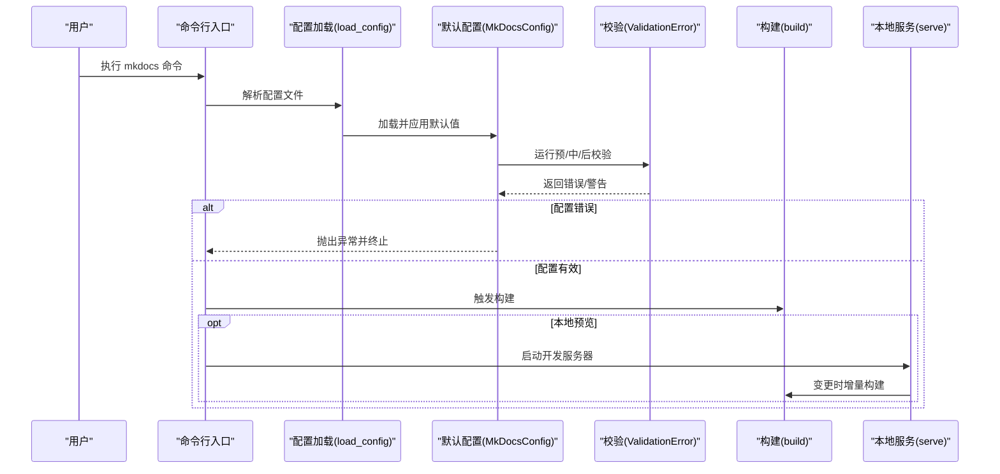
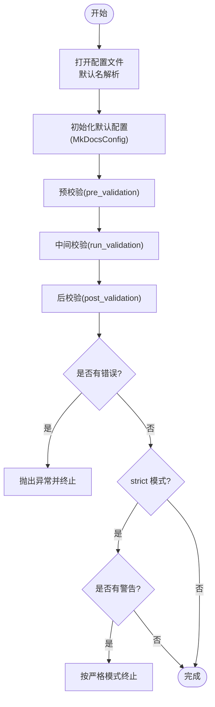
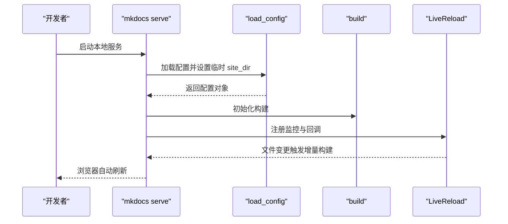
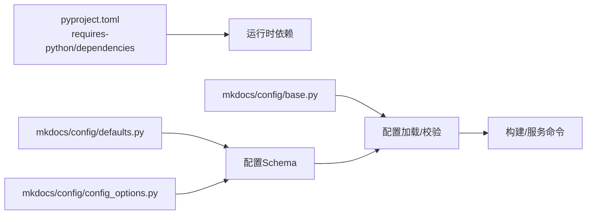

# 安装与配置

<cite>
**本文引用的文件**
- [docs/user-guide/installation.md](file://docs/user-guide/installation.md)
- [docs/user-guide/configuration.md](file://docs/user-guide/configuration.md)
- [pyproject.toml](file://pyproject.toml)
- [mkdocs/config/defaults.py](file://mkdocs/config/defaults.py)
- [mkdocs/config/base.py](file://mkdocs/config/base.py)
- [mkdocs/config/config_options.py](file://mkdocs/config/config_options.py)
- [mkdocs/commands/serve.py](file://mkdocs/commands/serve.py)
- [mkdocs/commands/build.py](file://mkdocs/commands/build.py)
- [mkdocs/exceptions.py](file://mkdocs/exceptions.py)
- [mkdocs/tests/config/config_tests.py](file://mkdocs/tests/config/config_tests.py)
- [mkdocs/tests/integration/minimal/mkdocs.yml](file://mkdocs/tests/integration/minimal/mkdocs.yml)
- [mkdocs/tests/integration/subpages/mkdocs.yml](file://mkdocs/tests/integration/subpages/mkdocs.yml)
- [mkdocs/tests/integration/complicated_config/mkdocs.yml](file://mkdocs/tests/integration/complicated_config/mkdocs.yml)
- [docs/user-guide/deploying-your-docs.md](file://docs/user-guide/deploying-your-docs.md)
</cite>

## 目录
1. [简介](#简介)
2. [项目结构](#项目结构)
3. [核心组件](#核心组件)
4. [架构总览](#架构总览)
5. [详细组件分析](#详细组件分析)
6. [依赖关系分析](#依赖关系分析)
7. [性能考量](#性能考量)
8. [故障排除指南](#故障排除指南)
9. [结论](#结论)
10. [附录](#附录)

## 简介
本指南面向首次接触或需要在多平台部署 MkDocs 的用户，系统讲解安装与配置流程，覆盖以下要点：
- 多操作系统安装：Windows、macOS、Linux
- 多安装方式：pip、可选 conda（官方未提供官方包）、Docker（社区镜像）
- Python 版本要求与依赖管理
- 虚拟环境设置建议
- mkdocs.yml 基本结构与常用选项
- 配置验证与测试方法
- 常见安装问题与排障

## 项目结构
围绕“安装与配置”主题，本文重点参考以下文件：
- 用户指南：安装与配置文档
- 核心实现：配置加载、校验与命令执行
- 测试样例：最小化与复杂配置示例
- 发布与部署：构建产物与部署流程

**图表来源**
- [docs/user-guide/installation.md](file://docs/user-guide/installation.md#L1-L108)
- [docs/user-guide/configuration.md](file://docs/user-guide/configuration.md#L1-L1290)
- [docs/user-guide/deploying-your-docs.md](file://docs/user-guide/deploying-your-docs.md#L1-L144)
- [mkdocs/config/defaults.py](file://mkdocs/config/defaults.py#L38-L219)
- [mkdocs/config/base.py](file://mkdocs/config/base.py#L340-L393)
- [mkdocs/config/config_options.py](file://mkdocs/config/config_options.py#L1-L800)
- [mkdocs/commands/serve.py](file://mkdocs/commands/serve.py#L1-L111)
- [mkdocs/commands/build.py](file://mkdocs/commands/build.py#L1-L200)
- [mkdocs/tests/integration/minimal/mkdocs.yml](file://mkdocs/tests/integration/minimal/mkdocs.yml#L1-L7)
- [mkdocs/tests/integration/subpages/mkdocs.yml](file://mkdocs/tests/integration/subpages/mkdocs.yml#L1-L2)
- [mkdocs/tests/integration/complicated_config/mkdocs.yml](file://mkdocs/tests/integration/complicated_config/mkdocs.yml#L1-L47)
- [mkdocs/tests/config/config_tests.py](file://mkdocs/tests/config/config_tests.py#L1-L272)

**章节来源**
- [docs/user-guide/installation.md](file://docs/user-guide/installation.md#L1-L108)
- [docs/user-guide/configuration.md](file://docs/user-guide/configuration.md#L1-L1290)

## 核心组件
- Python 与 pip：MkDocs 运行时与包管理器要求
- 配置系统：默认配置、校验规则、加载流程
- 命令系统：本地预览与构建
- 部署：静态站点生成与托管

**章节来源**
- [pyproject.toml](file://pyproject.toml#L34-L50)
- [mkdocs/config/defaults.py](file://mkdocs/config/defaults.py#L38-L219)
- [mkdocs/config/base.py](file://mkdocs/config/base.py#L340-L393)
- [mkdocs/commands/serve.py](file://mkdocs/commands/serve.py#L1-L111)
- [mkdocs/commands/build.py](file://mkdocs/commands/build.py#L1-L200)

## 架构总览
下图展示从配置文件到命令执行的关键路径，以及配置校验与异常处理。

**图表来源**
- [mkdocs/config/base.py](file://mkdocs/config/base.py#L340-L393)
- [mkdocs/config/defaults.py](file://mkdocs/config/defaults.py#L38-L219)
- [mkdocs/commands/build.py](file://mkdocs/commands/build.py#L1-L200)
- [mkdocs/commands/serve.py](file://mkdocs/commands/serve.py#L1-L111)
- [mkdocs/exceptions.py](file://mkdocs/exceptions.py#L1-L42)

## 详细组件分析

### 安装方式与环境准备
- Python 版本要求
  - 最低版本：Python 3.8
  - 支持版本：3.8 至 3.12；同时支持 PyPy3
- pip 安装
  - 使用 pip 安装 mkdocs 包
  - 建议先升级 pip 到最新版本
- Windows 注意事项
  - 若直接使用 pip/mkdocs 不生效，可尝试以 python -m 方式调用
  - 将 Python Scripts 目录加入 PATH，或使用 win_add2path.py 自动添加
- conda
  - 官方未提供 conda 包；可考虑社区渠道或使用 pip 在 conda 环境中安装
- Docker
  - 官方未提供官方镜像；可使用社区镜像或自行构建基于官方包的镜像

**章节来源**
- [pyproject.toml](file://pyproject.toml#L22-L34)
- [docs/user-guide/installation.md](file://docs/user-guide/installation.md#L7-L108)

### 虚拟环境设置
- 推荐为每个项目创建独立虚拟环境，避免全局污染
- 在虚拟环境中使用 pip 安装 mkdocs
- 保持依赖一致性，必要时导出并锁定依赖

[本节为通用实践说明，不直接分析具体文件]

### mkdocs.yml 配置文件基础
- 默认位置与加载
  - 默认读取项目根目录下的 mkdocs.yml 或 mkdocs.yaml
  - 可通过 -f/--config-file 指定其他路径
- 必填项
  - site_name：项目站点标题（必填）
- 常用选项概览
  - 项目信息：site_url、repo_url、repo_name、edit_uri、edit_uri_template、site_description、site_author、copyright、remote_branch、remote_name
  - 导航与布局：nav、exclude_docs、draft_docs、not_in_nav、validation
  - 构建目录：theme、docs_dir、site_dir、extra_css、extra_javascript、extra_templates、extra
  - 预览控制：watch、use_directory_urls、strict、dev_addr
  - Markdown 扩展：markdown_extensions
- 验证与严格模式
  - strict：开启后警告将被视为错误
  - validation：可配置导航与链接的诊断级别

**章节来源**
- [docs/user-guide/configuration.md](file://docs/user-guide/configuration.md#L1-L1290)
- [mkdocs/config/base.py](file://mkdocs/config/base.py#L290-L393)
- [mkdocs/config/defaults.py](file://mkdocs/config/defaults.py#L38-L219)

### 配置加载与校验流程
- 配置文件打开与默认名解析
  - 支持 mkdocs.yml 与 mkdocs.yaml，默认优先级与路径解析
- 默认配置与 Schema
  - MkDocsConfig 定义了所有可用配置项及其默认值与类型约束
- 校验阶段
  - 预校验：字段存在性与前置条件检查
  - 中间校验：类型、范围、格式等
  - 后校验：跨字段依赖与派生逻辑
- 错误与警告
  - 配置错误会中断构建
  - 严格模式下，任何警告也会导致失败

**图表来源**
- [mkdocs/config/base.py](file://mkdocs/config/base.py#L181-L243)
- [mkdocs/config/defaults.py](file://mkdocs/config/defaults.py#L38-L219)

**章节来源**
- [mkdocs/config/base.py](file://mkdocs/config/base.py#L181-L243)
- [mkdocs/config/defaults.py](file://mkdocs/config/defaults.py#L38-L219)

### 本地预览与构建
- 本地服务
  - mkdocs serve 启动开发服务器，默认监听 127.0.0.1:8000
  - 可通过 dev_addr 指定地址与端口
  - 支持热重载与主题文件监控
- 构建
  - mkdocs build 输出静态站点至 site_dir
  - 支持增量构建（dirty）与清理构建（clean）

**图表来源**
- [mkdocs/commands/serve.py](file://mkdocs/commands/serve.py#L20-L111)
- [mkdocs/commands/build.py](file://mkdocs/commands/build.py#L1-L200)
- [mkdocs/config/base.py](file://mkdocs/config/base.py#L340-L393)

**章节来源**
- [mkdocs/commands/serve.py](file://mkdocs/commands/serve.py#L1-L111)
- [mkdocs/commands/build.py](file://mkdocs/commands/build.py#L1-L200)

### 部署与静态站点输出
- 构建产物
  - 默认输出目录 site_dir（默认 site）
- 静态托管
  - 可直接复制 site_dir 内容到任意静态服务器
- GitHub Pages
  - 提供 gh-deploy 命令一键部署到 gh-pages 分支
  - 组织/用户页面需注意分支与仓库结构差异

**章节来源**
- [docs/user-guide/deploying-your-docs.md](file://docs/user-guide/deploying-your-docs.md#L1-L144)
- [mkdocs/config/defaults.py](file://mkdocs/config/defaults.py#L76-L80)

## 依赖关系分析
- Python 版本与依赖
  - requires-python >= 3.8
  - 关键运行时依赖：click、Jinja2、Markdown、PyYAML、watchdog、ghp-import 等
- 配置项与校验
  - defaults.py 定义配置项与默认值
  - config_options.py 提供类型、URL、路径、列表等校验器
  - base.py 提供配置加载、校验框架与异常类型

**图表来源**
- [pyproject.toml](file://pyproject.toml#L34-L50)
- [mkdocs/config/defaults.py](file://mkdocs/config/defaults.py#L38-L219)
- [mkdocs/config/config_options.py](file://mkdocs/config/config_options.py#L1-L800)
- [mkdocs/config/base.py](file://mkdocs/config/base.py#L340-L393)

**章节来源**
- [pyproject.toml](file://pyproject.toml#L34-L50)
- [mkdocs/config/defaults.py](file://mkdocs/config/defaults.py#L38-L219)
- [mkdocs/config/config_options.py](file://mkdocs/config/config_options.py#L1-L800)
- [mkdocs/config/base.py](file://mkdocs/config/base.py#L340-L393)

## 性能考量
- 热重载与增量构建
  - 仅在变更文件上执行增量构建，减少等待时间
- 目录结构与 URL
  - use_directory_urls: true 生成更友好的 URL，但可能影响某些静态托管平台
- 插件与扩展
  - 合理选择 markdown_extensions，避免过多扩展导致渲染开销增大

[本节为通用指导，不直接分析具体文件]

## 故障排除指南
- 常见安装问题
  - Windows PATH 未包含 Python/Scripts 导致命令不可用
  - 使用 python -m pip/python -m mkdocs 作为临时解决方案
- 配置错误
  - 缺少 site_name：必填项缺失将导致校验失败
  - docs_dir 与 site_dir 互相包含：可能导致循环复制或覆盖
  - URL 格式不合法：site_url、repo_url 需包含协议与主机
- 严格模式
  - 开启 strict 后，任何警告都会导致构建失败
- 异常处理
  - 配置错误会抛出异常并终止；可在日志中查看详细信息

**章节来源**
- [docs/user-guide/installation.md](file://docs/user-guide/installation.md#L81-L100)
- [mkdocs/tests/config/config_tests.py](file://mkdocs/tests/config/config_tests.py#L21-L272)
- [mkdocs/exceptions.py](file://mkdocs/exceptions.py#L1-L42)

## 结论
- 选择合适的安装方式与 Python 版本
- 使用虚拟环境隔离依赖
- 正确编写 mkdocs.yml 并通过严格模式与校验保障质量
- 利用本地服务进行迭代开发，最终将 site_dir 部署到目标平台

[本节为总结性内容，不直接分析具体文件]

## 附录

### 配置示例参考
- 最小化配置：包含 site_name、nav、site_author
- 子页配置：简洁导航结构
- 复杂配置：覆盖主题、目录、URL、扩展、严格模式等

**章节来源**
- [mkdocs/tests/integration/minimal/mkdocs.yml](file://mkdocs/tests/integration/minimal/mkdocs.yml#L1-L7)
- [mkdocs/tests/integration/subpages/mkdocs.yml](file://mkdocs/tests/integration/subpages/mkdocs.yml#L1-L2)
- [mkdocs/tests/integration/complicated_config/mkdocs.yml](file://mkdocs/tests/integration/complicated_config/mkdocs.yml#L1-L47)