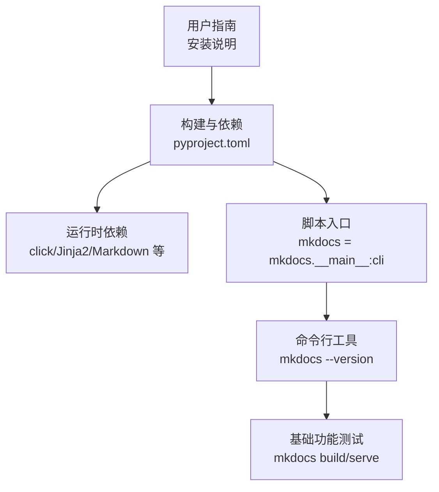
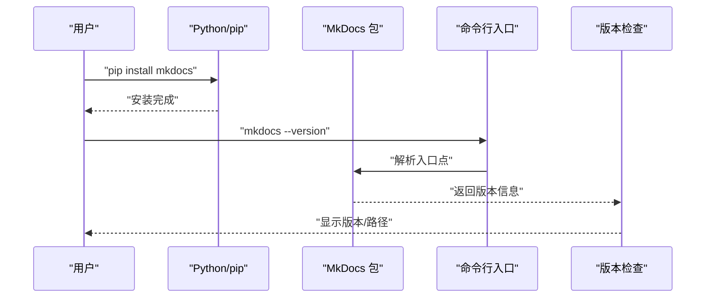
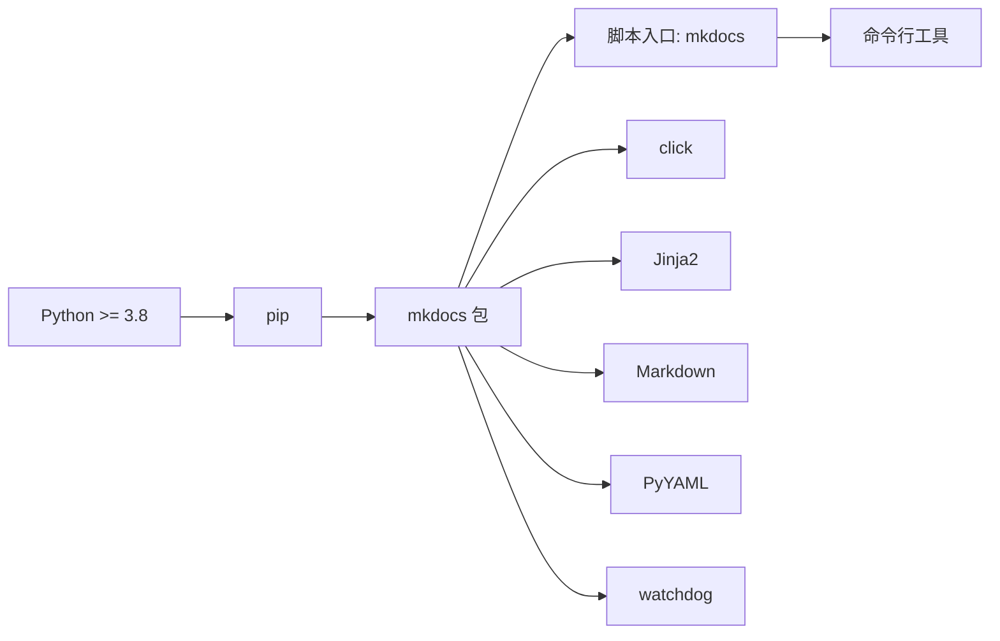
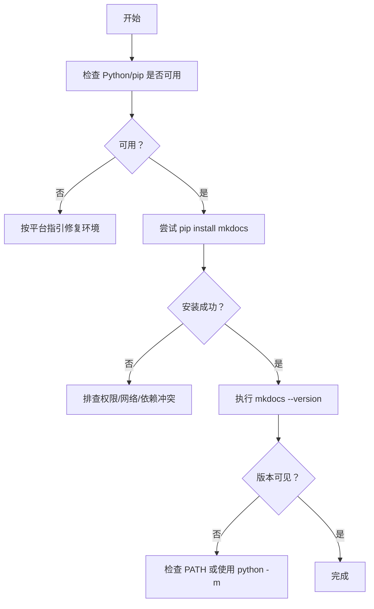

# 安装方法

<cite>
**本文引用的文件**
- [docs/用户指南/安装.md](file://docs/user-guide/installation.md)
- [pyproject.toml](file://pyproject.toml)
- [setup.py](file://setup.py)
- [mkdocs.yml](file://mkdocs.yml)
- [mkdocs/exceptions.py](file://mkdocs/exceptions.py)
- [mkdocs/commands/gh_deploy.py](file://mkdocs/commands/gh_deploy.py)
- [mkdocs/tests/gh_deploy_tests.py](file://mkdocs/tests/gh_deploy_tests.py)
</cite>

## 目录
1. [简介](#简介)
2. [项目结构](#项目结构)
3. [核心组件](#核心组件)
4. [架构总览](#架构总览)
5. [详细组件分析](#详细组件分析)
6. [依赖关系分析](#依赖关系分析)
7. [性能考虑](#性能考虑)
8. [故障排除指南](#故障排除指南)
9. [结论](#结论)
10. [附录](#附录)

## 简介
本指南面向希望在本地或 CI 环境中安装 MkDocs 的用户，系统性介绍以下内容：
- 使用 pip 进行全新安装与升级安装
- 在不同操作系统（Linux/macOS/Windows）下的注意事项与命令差异
- 常见安装问题排查（权限、网络、依赖冲突等）
- 安装后的验证步骤（版本检查、基础功能测试）

为确保准确性，本指南严格基于仓库中的官方文档与配置文件进行整理。

## 项目结构
与“安装方法”直接相关的核心位置如下：
- 用户指南：包含安装说明与平台注意事项
- 构建与依赖定义：pyproject.toml 指定 Python 版本要求与运行时依赖
- 安装入口：通过脚本入口分发器提供命令行工具
- 验证与部署：命令实现与测试用例可作为验证参考

图表来源
- [docs/用户指南/安装.md](file://docs/user-guide/installation.md#L1-L108)
- [pyproject.toml](file://pyproject.toml#L34-L50)
- [pyproject.toml](file://pyproject.toml#L79-L80)

章节来源
- [docs/用户指南/安装.md](file://docs/user-guide/installation.md#L1-L108)
- [pyproject.toml](file://pyproject.toml#L34-L50)
- [pyproject.toml](file://pyproject.toml#L79-L80)

## 核心组件
- Python 与 pip 要求
  - 需要较新的 Python 版本与 pip 包管理器；建议先检查版本以确认环境可用
- MkDocs 安装
  - 使用 pip 安装主包；安装后可通过命令行查看版本以验证
- 平台差异
  - Windows 环境下建议使用 python -m 前缀或调整 PATH，避免命令不可用
- 可选增强
  - 可通过 click-man 生成并安装 man 手册页

章节来源
- [docs/用户指南/安装.md](file://docs/user-guide/installation.md#L7-L108)

## 架构总览
从安装到验证的端到端流程如下：

图表来源
- [docs/用户指南/安装.md](file://docs/user-guide/installation.md#L53-L67)
- [pyproject.toml](file://pyproject.toml#L79-L80)

## 详细组件分析

### pip 安装与升级
- 全新安装
  - 使用 pip 安装 mkdocs 主包
- 升级安装
  - 若已存在旧版本，可先升级 pip 再安装以获得最新版本
- Windows 注意事项
  - 如直接命令无效，使用 python -m 前缀调用 pip 与 mkdocs
  - 或将 Python Scripts 目录加入 PATH

章节来源
- [docs/用户指南/安装.md](file://docs/user-guide/installation.md#L36-L100)

### Python 与 pip 准备
- Python 版本要求
  - 项目要求 Python 版本不低于指定范围（由构建配置声明）
- pip 安装与升级
  - 若未安装 pip，可下载安装脚本进行首次安装
  - 建议升级 pip 到最新版本以减少兼容性问题

章节来源
- [docs/用户指南/安装.md](file://docs/user-guide/installation.md#L24-L51)
- [pyproject.toml](file://pyproject.toml#L34-L34)

### 安装入口与命令行
- 入口点定义
  - 通过脚本入口将命令映射到模块主函数，从而提供统一的命令行体验
- 命令行验证
  - 安装完成后执行版本查询命令，确认安装成功且可正常运行

章节来源
- [pyproject.toml](file://pyproject.toml#L79-L80)
- [docs/用户指南/安装.md](file://docs/user-guide/installation.md#L53-L67)

### 不同操作系统的安装要点
- Linux/macOS
  - 使用系统包管理器或直接使用 pip 安装
- Windows
  - 推荐使用 python -m pip 与 python -m mkdocs
  - 将 Python Scripts 目录添加至 PATH，便于直接调用命令

章节来源
- [docs/用户指南/安装.md](file://docs/user-guide/installation.md#L81-L100)

### 安装验证步骤
- 版本检查
  - 使用版本查询命令核对安装是否成功
- 基础功能测试
  - 可结合项目根目录的配置文件进行最小化构建或服务启动，验证核心功能

章节来源
- [docs/用户指南/安装.md](file://docs/user-guide/installation.md#L61-L67)
- [mkdocs.yml](file://mkdocs.yml#L1-L20)

### 依赖关系与运行时要求
- Python 版本与运行时依赖
  - 项目在构建配置中声明了最低 Python 版本与主要运行时依赖
- 可选依赖
  - 提供国际化支持的可选依赖项

章节来源
- [pyproject.toml](file://pyproject.toml#L34-L50)
- [pyproject.toml](file://pyproject.toml#L51-L71)

### 安装方式对比与替代方案
- pip（推荐）
  - 标准安装方式，适合大多数用户
- conda（社区维护）
  - 可通过 conda-forge 获取 MkDocs；具体配方以社区发布为准
- Docker（社区维护）
  - 可使用官方或社区提供的镜像进行容器化安装与运行；具体镜像以社区发布为准
- 其他方式
  - 仓库不提供官方安装脚本；如需离线安装，请遵循官方包管理渠道

章节来源
- [docs/用户指南/安装.md](file://docs/user-guide/installation.md#L53-L67)
- [setup.py](file://setup.py#L1-L8)

## 依赖关系分析
MkDocs 的安装与运行依赖于 Python 生态系统中的若干关键组件。下图展示了核心依赖关系与入口点映射：

图表来源
- [pyproject.toml](file://pyproject.toml#L34-L50)
- [pyproject.toml](file://pyproject.toml#L79-L80)

章节来源
- [pyproject.toml](file://pyproject.toml#L34-L50)
- [pyproject.toml](file://pyproject.toml#L79-L80)

## 性能考虑
- 选择合适的 Python 版本与 pip 版本，有助于提升安装与运行效率
- 在大型项目中，优先使用稳定版本的依赖，减少不必要的重装与重建

## 故障排除指南
- 权限错误（Linux/macOS）
  - 使用系统包管理器安装 Python 与 pip，避免手动编译带来的权限问题
  - 若必须使用用户级安装，确保用户目录写权限正常
- Windows 命令不可用
  - 使用 python -m pip 与 python -m mkdocs
  - 将 Python Scripts 目录加入 PATH，或使用官方提供的脚本自动添加
- 网络问题
  - 更换 pip 源或使用代理；必要时离线安装
- 依赖冲突
  - 清理虚拟环境，重新安装；或使用隔离的虚拟环境
- 版本不一致导致的部署失败
  - 当使用 gh-deploy 时，若检测到历史部署版本较新，会阻止降级部署；请使用允许降级的选项或升级当前版本后再部署

图表来源
- [docs/用户指南/安装.md](file://docs/user-guide/installation.md#L12-L19)
- [docs/用户指南/安装.md](file://docs/user-guide/installation.md#L81-L100)

章节来源
- [docs/用户指南/安装.md](file://docs/user-guide/installation.md#L12-L19)
- [docs/用户指南/安装.md](file://docs/user-guide/installation.md#L81-L100)

## 结论
- 使用 pip 是最直接可靠的安装方式；Windows 用户应特别注意命令前缀与 PATH 设置
- 安装后务必进行版本检查与基础功能验证
- 遇到问题时，优先检查 Python/pip 版本、网络与权限，并参考本指南的故障排除流程

## 附录
- 额外验证建议
  - 使用项目根目录的配置文件进行一次最小化构建或本地服务启动，确保核心功能正常
- 相关测试参考
  - 部署流程的版本校验逻辑可作为安装后验证的参考依据

章节来源
- [mkdocs.yml](file://mkdocs.yml#L1-L20)
- [mkdocs/commands/gh_deploy.py](file://mkdocs/commands/gh_deploy.py#L72-L98)
- [mkdocs/tests/gh_deploy_tests.py](file://mkdocs/tests/gh_deploy_tests.py#L159-L185)