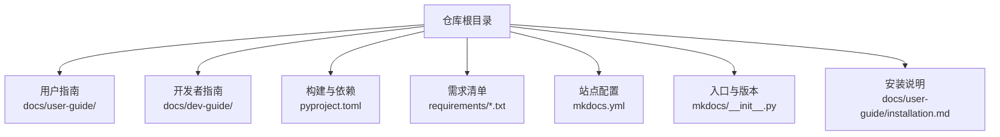
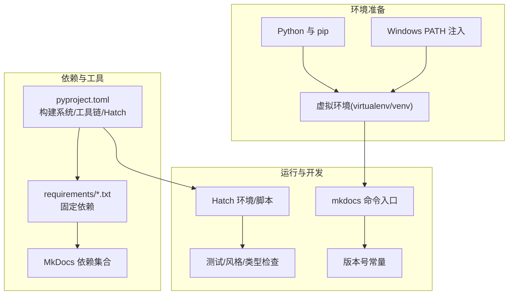
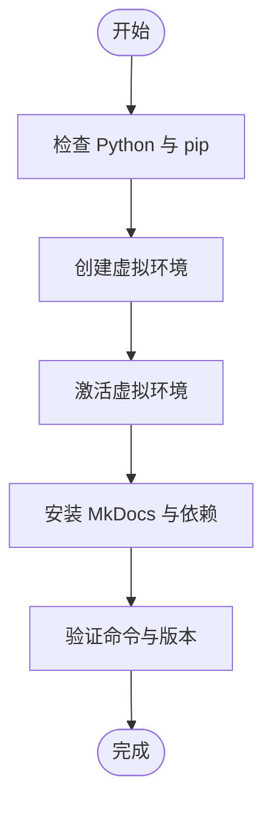
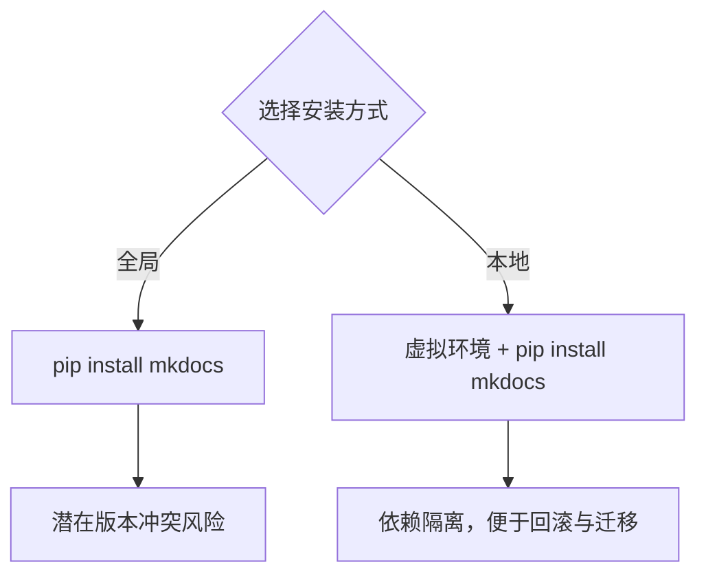
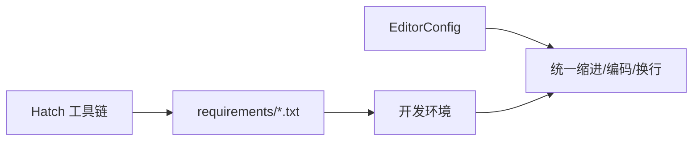
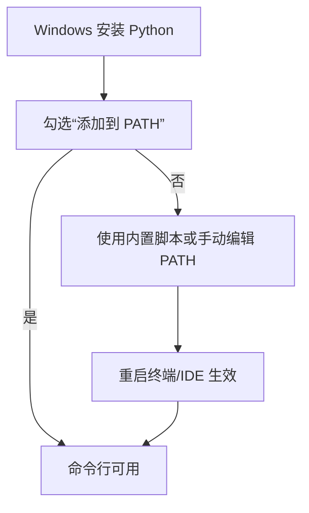
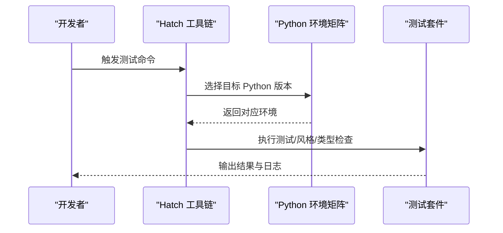
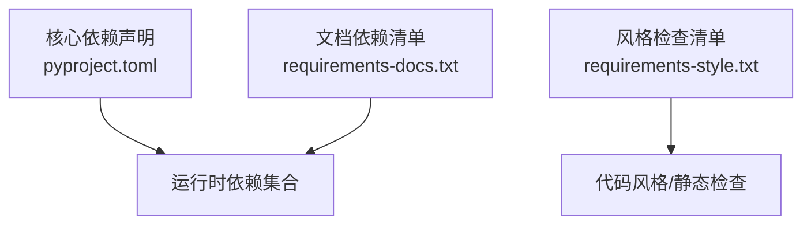

# 环境配置

<cite>
**本文引用的文件**   
- [README.md](file://README.md)
- [pyproject.toml](file://pyproject.toml)
- [setup.py](file://setup.py)
- [mkdocs.yml](file://mkdocs.yml)
- [docs/用户指南/安装.md](file://docs/user-guide/installation.md)
- [docs/用户指南/配置.md](file://docs/user-guide/configuration.md)
- [CONTRIBUTING.md](file://CONTRIBUTING.md)
- [requirements/requirements-docs.txt](file://requirements/requirements-docs.txt)
- [requirements/requirements-style.txt](file://requirements/requirements-style.txt)
- [.gitignore](file://.gitignore)
- [.editorconfig](file://.editorconfig)
- [mkdocs/__init__.py](file://mkdocs/__init__.py)
</cite>

## 目录
1. [简介](#简介)
2. [项目结构](#项目结构)
3. [核心组件](#核心组件)
4. [架构总览](#架构总览)
5. [详细组件分析](#详细组件分析)
6. [依赖分析](#依赖分析)
7. [性能考虑](#性能考虑)
8. [故障排查指南](#故障排查指南)
9. [结论](#结论)
10. [附录](#附录)

## 简介
本指南面向需要搭建 MkDocs 开发与使用环境的读者，围绕“如何隔离安装 MkDocs”“全局安装 vs 本地安装”“不同开发环境配置”“环境变量与 PATH 注意事项”“多版本 Python 切换策略”等主题，结合仓库中的官方文档与配置文件进行系统化说明，并提供可操作的步骤与图示。

## 项目结构
本仓库为 MkDocs 源码与官方文档所在，其中与环境配置直接相关的关键位置包括：
- 用户指南与开发者指南：提供安装、配置与开发流程的权威说明
- 构建与依赖管理：通过构建系统与工具链定义运行时依赖
- 需求清单：固定依赖版本，便于复现一致的开发环境
- 版本号与入口：明确命令入口与版本标识

**图表来源**
- [pyproject.toml](file://pyproject.toml#L1-L240)
- [mkdocs.yml](file://mkdocs.yml#L1-L80)
- [docs/user-guide/installation.md](file://docs/user-guide/installation.md#L1-L108)
- [requirements/requirements-docs.txt](file://requirements/requirements-docs.txt#L1-L135)

**章节来源**
- [README.md](file://README.md#L1-L80)
- [pyproject.toml](file://pyproject.toml#L1-L240)
- [mkdocs.yml](file://mkdocs.yml#L1-L80)

## 核心组件
- Python 运行时与包管理器：MkDocs 要求 Python 与 pip；Windows 安装时需注意 PATH 注入
- 构建系统与工具链：Hatch 作为统一的环境与命令执行器，支持多 Python 版本矩阵测试
- 依赖声明与锁定：核心依赖与风格检查工具在构建配置中集中定义
- 命令入口与版本：通过脚本入口与版本常量暴露 CLI 与版本信息

**章节来源**
- [docs/user-guide/installation.md](file://docs/user-guide/installation.md#L7-L108)
- [pyproject.toml](file://pyproject.toml#L1-L240)
- [mkdocs/__init__.py](file://mkdocs/__init__.py#L1-L5)

## 架构总览
下图展示了从“安装与环境准备”到“运行与开发”的整体流程，涵盖虚拟环境、依赖解析、命令入口与版本控制等关键环节。

**图表来源**
- [docs/user-guide/installation.md](file://docs/user-guide/installation.md#L24-L108)
- [pyproject.toml](file://pyproject.toml#L1-L240)
- [requirements/requirements-docs.txt](file://requirements/requirements-docs.txt#L1-L135)
- [mkdocs/__init__.py](file://mkdocs/__init__.py#L1-L5)

## 详细组件分析

### 虚拟环境隔离策略
- 推荐在独立虚拟环境中安装与运行 MkDocs，避免污染系统 Python 或与其他项目冲突
- 使用标准库 venv 或第三方工具（如 virtualenv）创建隔离环境
- 在虚拟环境中安装 MkDocs 及其依赖，确保命令入口与版本信息正确

**图表来源**
- [docs/user-guide/installation.md](file://docs/user-guide/installation.md#L53-L108)
- [pyproject.toml](file://pyproject.toml#L1-L240)

**章节来源**
- [docs/user-guide/installation.md](file://docs/user-guide/installation.md#L53-L108)
- [CONTRIBUTING.md](file://CONTRIBUTING.md#L47-L56)

### 全局安装 vs 本地安装
- 全局安装：适合一次性使用或系统级工具，但易造成版本冲突
- 本地安装（推荐）：在项目内隔离依赖，便于团队协作与版本一致性
- 开发场景建议：使用可编辑安装或通过工具链统一管理

**图表来源**
- [docs/user-guide/installation.md](file://docs/user-guide/installation.md#L53-L67)
- [CONTRIBUTING.md](file://CONTRIBUTING.md#L47-L56)

**章节来源**
- [docs/user-guide/installation.md](file://docs/user-guide/installation.md#L53-L67)
- [CONTRIBUTING.md](file://CONTRIBUTING.md#L47-L56)

### 不同开发环境的配置建议
- 统一使用工具链（如 Hatch）管理依赖与命令，减少环境差异
- 固定依赖清单用于复现一致的开发与文档构建环境
- 编辑器配置遵循仓库的 EditorConfig，保持代码风格一致

**图表来源**
- [pyproject.toml](file://pyproject.toml#L104-L202)
- [requirements/requirements-docs.txt](file://requirements/requirements-docs.txt#L1-L135)
- [.editorconfig](file://.editorconfig#L1-L16)

**章节来源**
- [pyproject.toml](file://pyproject.toml#L104-L202)
- [requirements/requirements-docs.txt](file://requirements/requirements-docs.txt#L1-L135)
- [.editorconfig](file://.editorconfig#L1-L16)

### 环境变量与 PATH 配置（Windows 注意事项）
- Windows 安装 Python 时务必勾选“添加到 PATH”，否则命令行无法识别 Python 与 pip
- 若已安装但未注入 PATH，可通过 Python 自带脚本或手动编辑系统 PATH
- 建议在虚拟环境中运行，避免对系统 PATH 的长期修改

**图表来源**
- [docs/user-guide/installation.md](file://docs/user-guide/installation.md#L29-L99)

**章节来源**
- [docs/user-guide/installation.md](file://docs/user-guide/installation.md#L29-L99)

### 多版本 Python 环境下的安装与切换
- 使用工具链（如 Hatch）自动管理多 Python 版本矩阵，统一执行测试与检查
- 在同一项目中可针对不同 Python 版本运行测试，确保兼容性
- 对于本地开发，建议在虚拟环境中安装目标 Python 版本对应的 MkDocs

**图表来源**
- [pyproject.toml](file://pyproject.toml#L129-L138)
- [pyproject.toml](file://pyproject.toml#L146-L153)

**章节来源**
- [pyproject.toml](file://pyproject.toml#L129-L138)
- [pyproject.toml](file://pyproject.toml#L146-L153)

### 命令入口与版本标识
- MkDocs 通过脚本入口暴露命令行接口，版本号在模块常量中定义
- 在虚拟环境中运行命令，可确保使用正确的版本与依赖

**图表来源**
- [pyproject.toml](file://pyproject.toml#L79-L80)
- [mkdocs/__init__.py](file://mkdocs/__init__.py#L1-L5)

**章节来源**
- [pyproject.toml](file://pyproject.toml#L79-L80)
- [mkdocs/__init__.py](file://mkdocs/__init__.py#L1-L5)

## 依赖分析
- 核心依赖：MkDocs 的运行时依赖在构建配置中集中声明，保证最小可用集
- 文档与样式依赖：通过需求清单固定版本，确保文档构建一致性
- 可选依赖：国际化等功能按需启用

**图表来源**
- [pyproject.toml](file://pyproject.toml#L35-L50)
- [requirements/requirements-docs.txt](file://requirements/requirements-docs.txt#L30-L135)
- [requirements/requirements-style.txt](file://requirements/requirements-style.txt#L9-L25)

**章节来源**
- [pyproject.toml](file://pyproject.toml#L35-L50)
- [requirements/requirements-docs.txt](file://requirements/requirements-docs.txt#L1-L135)
- [requirements/requirements-style.txt](file://requirements/requirements-style.txt#L1-L25)

## 性能考虑
- 在虚拟环境中安装与运行，避免不必要的系统级扫描与冲突检测
- 使用工具链统一管理依赖与命令，减少重复安装与版本不一致带来的开销
- 对大型项目，合理组织文档目录与忽略规则，降低构建扫描范围

[本节为通用建议，无需特定文件引用]

## 故障排查指南
- 命令不可用或版本不符：确认是否在正确的虚拟环境中激活，并重新安装 MkDocs
- Windows 命令行异常：检查 PATH 是否包含 Python 与 Scripts 目录，必要时重新运行安装脚本
- 依赖冲突：使用固定依赖清单或工具链隔离环境，避免全局安装导致的版本混杂
- 版本不一致：通过工具链矩阵或明确的 Python 版本指定，确保跨平台一致性

**章节来源**
- [docs/user-guide/installation.md](file://docs/user-guide/installation.md#L81-L108)
- [pyproject.toml](file://pyproject.toml#L129-L138)
- [.gitignore](file://.gitignore#L62-L68)

## 结论
通过在虚拟环境中安装与运行 MkDocs，并借助工具链与固定依赖清单，可以有效避免版本冲突与环境差异问题。针对 Windows 用户，务必在安装 Python 时将路径加入系统 PATH，或使用官方脚本完成注入。对于多版本 Python 场景，建议使用工具链矩阵统一管理测试与检查流程，确保项目在不同运行时下的稳定性与一致性。

[本节为总结性内容，无需特定文件引用]

## 附录
- 快速参考
  - 安装 Python 与 pip 并检查版本
  - 创建并激活虚拟环境
  - 在虚拟环境中安装 MkDocs
  - 使用工具链运行测试与检查
  - Windows 用户确保 PATH 包含 Python 与 Scripts 目录

**章节来源**
- [docs/user-guide/installation.md](file://docs/user-guide/installation.md#L12-L108)
- [pyproject.toml](file://pyproject.toml#L104-L202)