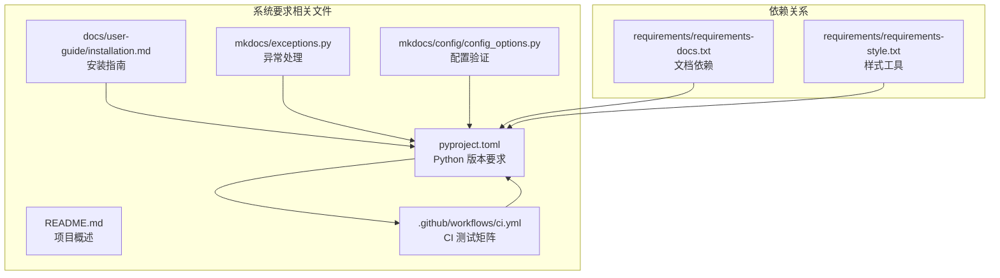
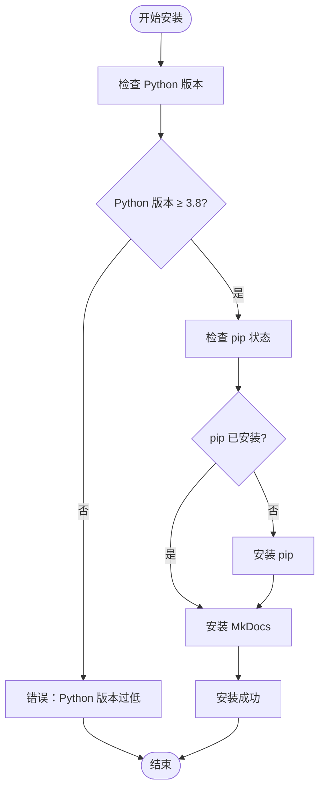
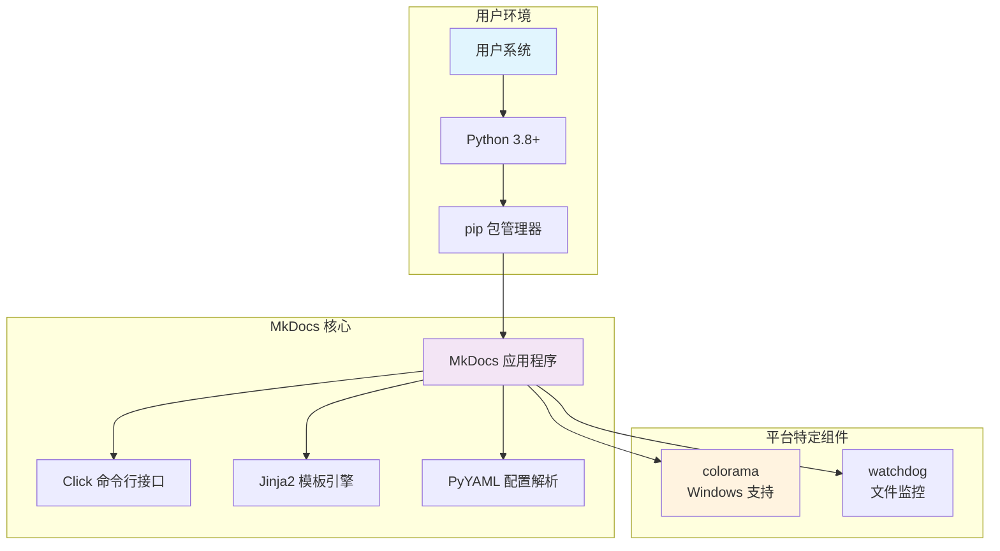
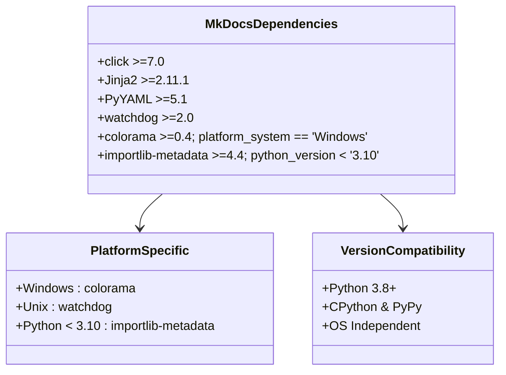
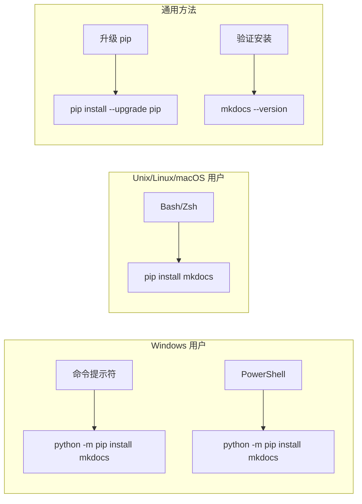
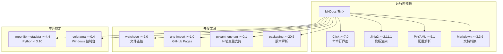
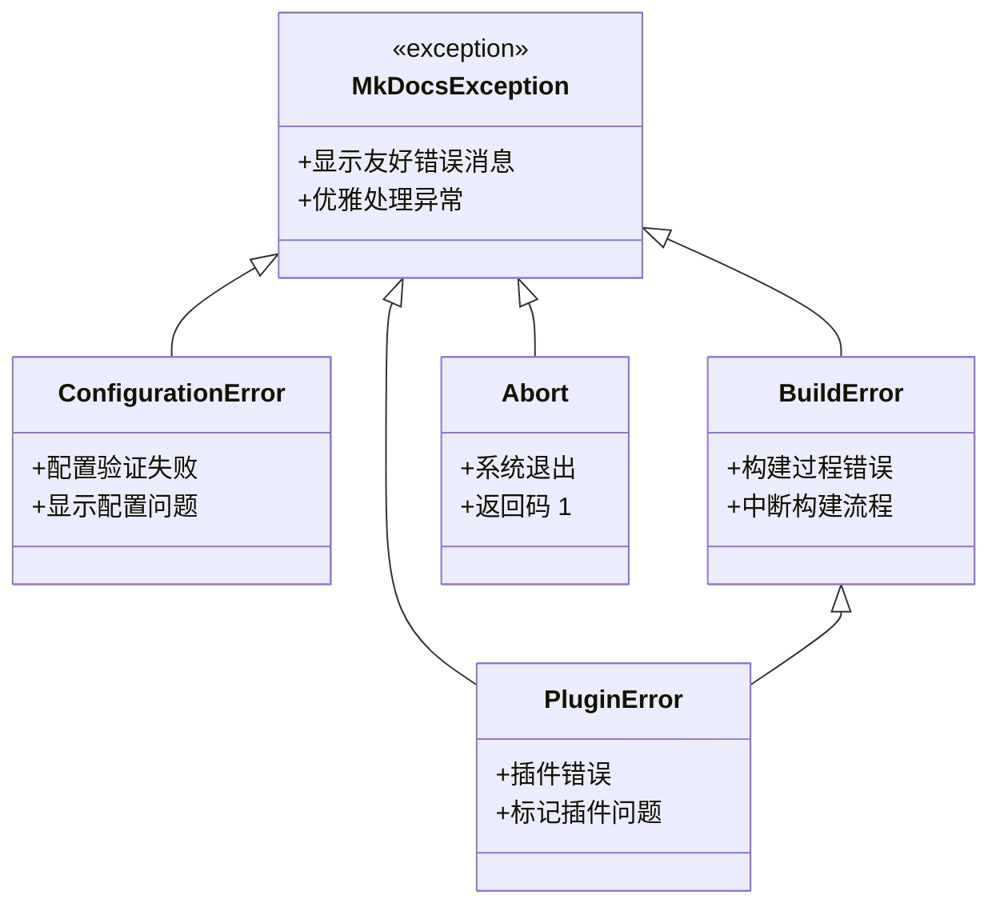

# 系统要求

<cite>
**本文档引用的文件**
- [README.md](file://README.md)
- [pyproject.toml](file://pyproject.toml)
- [docs/user-guide/installation.md](file://docs/user-guide/installation.md)
- [docs/getting-started.md](file://docs/getting-started.md)
- [.github/workflows/ci.yml](file://.github/workflows/ci.yml)
- [mkdocs/exceptions.py](file://mkdocs/exceptions.py)
- [mkdocs/config/config_options.py](file://mkdocs/config/config_options.py)
- [requirements/requirements-docs.txt](file://requirements/requirements-docs.txt)
</cite>

## 目录
1. [简介](#简介)
2. [项目结构](#项目结构)
3. [核心组件](#核心组件)
4. [架构概览](#架构概览)
5. [详细组件分析](#详细组件分析)
6. [依赖关系分析](#依赖关系分析)
7. [性能考虑](#性能考虑)
8. [故障排除指南](#故障排除指南)
9. [结论](#结论)

## 简介

MkDocs 是一个快速、简单且美观的静态站点生成器，专门用于构建项目文档。它支持多种操作系统，包括 Windows、macOS 和 Linux，并提供了完整的 Python 版本兼容性支持。

根据项目元数据和官方文档，MkDocs 的系统要求如下：

- **操作系统支持**：Windows、macOS、Linux（跨平台）
- **Python 版本要求**：Python 3.8 及以上版本
- **包管理器**：pip（Python 包管理器）

## 项目结构

MkDocs 项目的系统要求主要体现在以下几个关键文件中：



**图表来源**
- [pyproject.toml](file://pyproject.toml#L1-L240)
- [.github/workflows/ci.yml](file://.github/workflows/ci.yml#L1-L53)

**章节来源**
- [pyproject.toml](file://pyproject.toml#L1-L240)
- [README.md](file://README.md#L1-L80)

## 核心组件

### 操作系统兼容性

MkDocs 在多个操作系统上进行测试和验证：

- **Windows**：通过 Windows Server 2019/2022 进行测试
- **macOS**：通过 macOS 10.15+ 进行测试  
- **Linux**：通过 Ubuntu 20.04+ 进行测试

所有测试均在 Python 3.8 到 3.12 版本范围内执行，确保跨平台兼容性。

### Python 版本要求

根据项目配置，MkDocs 的 Python 版本要求为：

- **最低版本**：Python 3.8
- **推荐版本**：Python 3.8 - 3.12
- **实现支持**：CPython 和 PyPy



**图表来源**
- [pyproject.toml](file://pyproject.toml#L34-L34)
- [docs/user-guide/installation.md](file://docs/user-guide/installation.md#L9-L18)

**章节来源**
- [pyproject.toml](file://pyproject.toml#L13-L32)
- [pyproject.toml](file://pyproject.toml#L34-L34)
- [.github/workflows/ci.yml](file://.github/workflows/ci.yml#L12-L12)

## 架构概览

MkDocs 的系统要求架构设计体现了以下特点：



**图表来源**
- [pyproject.toml](file://pyproject.toml#L35-L50)
- [pyproject.toml](file://pyproject.toml#L49-L49)

## 详细组件分析

### Python 版本兼容性

MkDocs 的 Python 版本兼容性通过多个层面保证：

#### 版本声明和验证
- **PEP 440 版本格式**：遵循 Python 兼容版本规范
- **测试矩阵覆盖**：在 CI 中测试 Python 3.8-3.12 和 PyPy
- **动态版本管理**：使用 Hatch 进行版本控制

#### 平台特定依赖


**图表来源**
- [pyproject.toml](file://pyproject.toml#L35-L50)
- [pyproject.toml](file://pyproject.toml#L49-L49)

**章节来源**
- [pyproject.toml](file://pyproject.toml#L13-L32)
- [pyproject.toml](file://pyproject.toml#L35-L50)

### pip 包管理器要求

#### 安装和升级要求
- **默认安装**：现代 Python 发行版通常包含 pip
- **升级要求**：建议使用最新版本的 pip
- **首次安装**：可使用 get-pip.py 脚本

#### 平台特定注意事项


**图表来源**
- [docs/user-guide/installation.md](file://docs/user-guide/installation.md#L86-L98)
- [docs/user-guide/installation.md](file://docs/user-guide/installation.md#L42-L51)

**章节来源**
- [docs/user-guide/installation.md](file://docs/user-guide/installation.md#L36-L51)
- [docs/user-guide/installation.md](file://docs/user-guide/installation.md#L86-L98)

### 安装前检查方法

#### Python 检查
```bash
# 检查 Python 版本
python --version
python3 --version

# 检查 Python 路径
which python
which python3
```

#### pip 检查
```bash
# 检查 pip 版本
pip --version
pip3 --version

# 检查 pip 路径
which pip
which pip3
```

#### MkDocs 检查
```bash
# 验证安装
mkdocs --version

# 查看帮助
mkdocs --help
```

**章节来源**
- [docs/user-guide/installation.md](file://docs/user-guide/installation.md#L12-L19)
- [docs/getting-started.md](file://docs/getting-started.md#L178-L189)

## 依赖关系分析

### 核心依赖关系

MkDocs 的依赖关系通过 pyproject.toml 明确定义：



**图表来源**
- [pyproject.toml](file://pyproject.toml#L35-L50)
- [requirements/requirements-docs.txt](file://requirements/requirements-docs.txt#L14-L27)

### CI 测试矩阵

项目使用 GitHub Actions 进行跨平台测试，确保系统要求的有效性：

| 操作系统 | Python 版本 | 测试状态 |
|---------|------------|----------|
| Ubuntu | 3.8, 3.9, 3.10, 3.11, 3.12, pypy3 | ✅ |
| Windows | 3.8, 3.9, 3.10, 3.11, 3.12, pypy3 | ✅ |
| macOS | 3.8, 3.9, 3.10, 3.11, 3.12, pypy3 | ✅ |

**章节来源**
- [.github/workflows/ci.yml](file://.github/workflows/ci.yml#L12-L28)

## 性能考虑

### 跨平台性能优化

- **文件监控**：使用 watchdog 库进行高效的文件变更检测
- **模板渲染**：Jinja2 提供高性能的模板处理能力
- **内存管理**：Python 3.8+ 的内存优化特性
- **并发处理**：多线程文件操作支持

### 平台特定优化

- **Windows**：colorama 提供跨平台控制台颜色支持
- **Unix 系统**：原生文件系统支持
- **macOS**：优化的文件系统访问

## 故障排除指南

### 常见系统环境问题

#### PATH 环境变量配置

**Windows 用户问题**：
```cmd
# 问题：命令无法识别
'mkdocs' 不是内部或外部命令

# 解决方案：添加到 PATH
# 方法1：使用 python -m 前缀
python -m mkdocs --version

# 方法2：编辑 PATH 环境变量
# 添加 Python Scripts 目录到 PATH
```

**Unix/Linux/macOS 用户问题**：
```bash
# 问题：权限不足
Permission denied

# 解决方案：使用 sudo 或修复权限
sudo pip install mkdocs
# 或
chmod +x /usr/local/bin/mkdocs
```

#### Python 版本冲突

**问题**：多个 Python 版本导致的问题
```bash
# 检查当前使用的 Python
which python
which python3

# 使用特定版本
python3.11 -m pip install mkdocs
```

#### pip 升级问题

**问题**：pip 版本过旧
```bash
# 升级 pip
python -m pip install --upgrade pip
# 或
python -m pip install -U pip
```

### 错误处理机制

MkDocs 实现了完善的错误处理机制：



**图表来源**
- [mkdocs/exceptions.py](file://mkdocs/exceptions.py#L6-L42)

**章节来源**
- [mkdocs/exceptions.py](file://mkdocs/exceptions.py#L6-L42)

### 配置验证和路径检查

MkDocs 对配置文件进行严格的路径验证：

- **绝对路径转换**：自动将相对路径转换为绝对路径
- **存在性检查**：验证目录和文件的存在性
- **权限验证**：检查文件访问权限
- **配置有效性**：确保配置项符合预期格式

**章节来源**
- [mkdocs/config/config_options.py](file://mkdocs/config/config_options.py#L690-L752)

## 结论

MkDocs 的系统要求设计体现了以下特点：

1. **广泛的兼容性**：支持 Windows、macOS、Linux 三大主流操作系统
2. **现代 Python 支持**：从 Python 3.8 到 3.12 的完整支持
3. **跨平台一致性**：通过 CI 测试确保各平台行为一致
4. **清晰的依赖管理**：明确的依赖关系和版本要求
5. **完善的错误处理**：友好的错误消息和优雅的异常处理

这些系统要求确保了 MkDocs 能够在各种开发环境中稳定运行，为用户提供一致的文档生成体验。