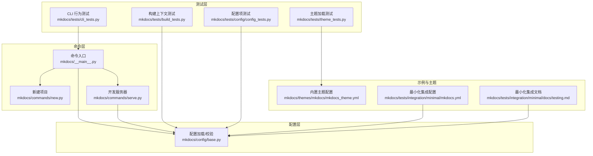
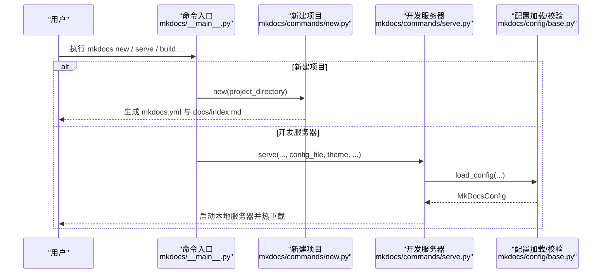
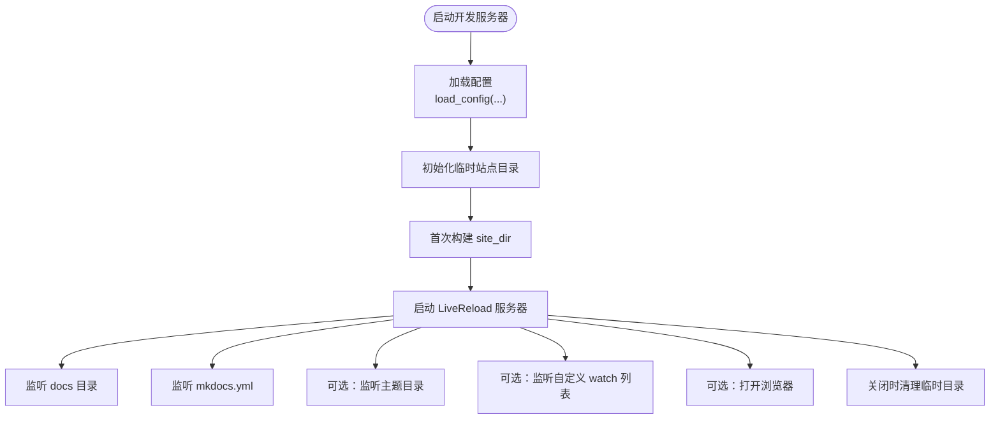
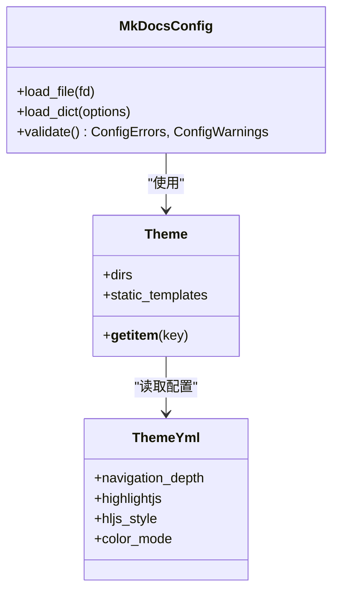
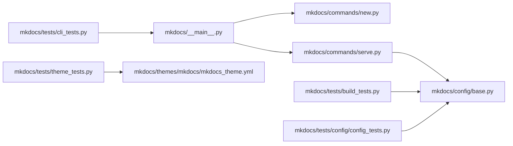

# 验证与测试

<cite>
**本文引用的文件**
- [README.md](file://README.md)
- [docs/用户指南/安装.md](file://docs/user-guide/installation.md)
- [docs/用户指南/命令行接口.md](file://docs/user-guide/cli.md)
- [mkdocs/__main__.py](file://mkdocs/__main__.py)
- [mkdocs/commands/new.py](file://mkdocs/commands/new.py)
- [mkdocs/commands/serve.py](file://mkdocs/commands/serve.py)
- [mkdocs/config/base.py](file://mkdocs/config/base.py)
- [mkdocs/tests/cli_tests.py](file://mkdocs/tests/cli_tests.py)
- [mkdocs/tests/build_tests.py](file://mkdocs/tests/build_tests.py)
- [mkdocs/tests/theme_tests.py](file://mkdocs/tests/theme_tests.py)
- [mkdocs/tests/config/config_tests.py](file://mkdocs/tests/config/config_tests.py)
- [mkdocs/themes/mkdocs/mkdocs_theme.yml](file://mkdocs/themes/mkdocs/mkdocs_theme.yml)
- [mkdocs/tests/integration/minimal/mkdocs.yml](file://mkdocs/tests/integration/minimal/mkdocs.yml)
- [mkdocs/tests/integration/minimal/docs/testing.md](file://mkdocs/tests/integration/minimal/docs/testing.md)
</cite>

## 目录
1. [简介](#简介)
2. [项目结构](#项目结构)
3. [核心组件](#核心组件)
4. [架构总览](#架构总览)
5. [详细组件分析](#详细组件分析)
6. [依赖关系分析](#依赖关系分析)
7. [性能考虑](#性能考虑)
8. [故障排查指南](#故障排查指南)
9. [结论](#结论)
10. [附录](#附录)

## 简介
本指南面向安装后的 MkDocs 用户与维护者，提供从命令行工具验证到基础功能测试的完整流程；指导如何创建首个 MkDocs 项目并验证开发服务器；给出配置文件有效性与主题加载的验证方法；汇总常见安装问题的诊断与解决思路，并提供性能基准与功能完整性检查清单。

## 项目结构
围绕“安装验证与测试”，以下文件是关键入口与实现：
- 命令行入口与子命令定义：mkdocs/__main__.py
- 新建项目命令实现：mkdocs/commands/new.py
- 开发服务器命令实现：mkdocs/commands/serve.py
- 配置加载与校验：mkdocs/config/base.py
- CLI 行为与参数映射测试：mkdocs/tests/cli_tests.py
- 构建上下文与页面渲染测试：mkdocs/tests/build_tests.py
- 主题加载与变量解析测试：mkdocs/tests/theme_tests.py
- 配置项与主题行为测试：mkdocs/tests/config/config_tests.py
- 内置主题配置示例：mkdocs/themes/mkdocs/mkdocs_theme.yml
- 最小化集成测试样例（配置与文档）：mkdocs/tests/integration/minimal/*

**图示来源**
- [mkdocs/__main__.py](file://mkdocs/__main__.py#L240-L371)
- [mkdocs/commands/new.py](file://mkdocs/commands/new.py#L29-L54)
- [mkdocs/commands/serve.py](file://mkdocs/commands/serve.py#L20-L111)
- [mkdocs/config/base.py](file://mkdocs/config/base.py#L340-L393)
- [mkdocs/tests/cli_tests.py](file://mkdocs/tests/cli_tests.py#L1-L647)
- [mkdocs/tests/build_tests.py](file://mkdocs/tests/build_tests.py#L1-L200)
- [mkdocs/tests/theme_tests.py](file://mkdocs/tests/theme_tests.py#L1-L126)
- [mkdocs/tests/config/config_tests.py](file://mkdocs/tests/config/config_tests.py#L1-L200)
- [mkdocs/themes/mkdocs/mkdocs_theme.yml](file://mkdocs/themes/mkdocs/mkdocs_theme.yml#L1-L29)
- [mkdocs/tests/integration/minimal/mkdocs.yml](file://mkdocs/tests/integration/minimal/mkdocs.yml#L1-L7)
- [mkdocs/tests/integration/minimal/docs/testing.md](file://mkdocs/tests/integration/minimal/docs/testing.md#L1-L18)

**章节来源**
- [README.md](file://README.md#L1-L80)
- [docs/用户指南/安装.md](file://docs/user-guide/installation.md#L1-L108)
- [docs/用户指南/命令行接口.md](file://docs/user-guide/cli.md#L1-L9)

## 核心组件
- 命令行入口与子命令
  - 入口函数定义了全局选项、颜色输出、版本显示等；子命令包括 serve、build、gh-deploy、get-deps、new 等。
  - 参考路径：[mkdocs/__main__.py](file://mkdocs/__main__.py#L240-L371)
- 新建项目命令
  - 创建项目目录、生成默认 mkdocs.yml 与 docs/index.md。
  - 参考路径：[mkdocs/commands/new.py](file://mkdocs/commands/new.py#L29-L54)
- 开发服务器命令
  - 加载配置、初始化临时站点目录、启动 LiveReload 服务、监听文档与主题变更。
  - 参考路径：[mkdocs/commands/serve.py](file://mkdocs/commands/serve.py#L20-L111)
- 配置加载与校验
  - 打开配置文件、合并 CLI 覆盖项、执行预/运行/后验证、记录警告与错误。
  - 参考路径：[mkdocs/config/base.py](file://mkdocs/config/base.py#L340-L393)

**章节来源**
- [mkdocs/__main__.py](file://mkdocs/__main__.py#L240-L371)
- [mkdocs/commands/new.py](file://mkdocs/commands/new.py#L29-L54)
- [mkdocs/commands/serve.py](file://mkdocs/commands/serve.py#L20-L111)
- [mkdocs/config/base.py](file://mkdocs/config/base.py#L340-L393)

## 架构总览
下图展示从命令行到配置加载与开发服务器启动的调用链路，以及测试对这些组件的行为覆盖。

**图示来源**
- [mkdocs/__main__.py](file://mkdocs/__main__.py#L253-L371)
- [mkdocs/commands/new.py](file://mkdocs/commands/new.py#L29-L54)
- [mkdocs/commands/serve.py](file://mkdocs/commands/serve.py#L20-L111)
- [mkdocs/config/base.py](file://mkdocs/config/base.py#L340-L393)

## 详细组件分析

### 命令行工具验证
- 安装后验证
  - 使用命令查看版本与帮助信息，确认可执行文件已正确安装。
  - 参考路径：[docs/用户指南/安装.md](file://docs/user-guide/installation.md#L53-L108)
- 子命令可用性
  - 通过命令入口的子命令列表与帮助表格，确认各子命令存在且可调用。
  - 参考路径：[docs/用户指南/命令行接口.md](file://docs/user-guide/cli.md#L1-L9)、[mkdocs/__main__.py](file://mkdocs/__main__.py#L240-L371)
- CLI 行为测试覆盖
  - 测试用例覆盖 serve/build/gh-deploy/new 等命令及其参数映射，确保 CLI 与实现一致。
  - 参考路径：[mkdocs/tests/cli_tests.py](file://mkdocs/tests/cli_tests.py#L1-L647)

**章节来源**
- [docs/用户指南/安装.md](file://docs/user-guide/installation.md#L53-L108)
- [docs/用户指南/命令行接口.md](file://docs/user-guide/cli.md#L1-L9)
- [mkdocs/tests/cli_tests.py](file://mkdocs/tests/cli_tests.py#L1-L647)

### 创建第一个 MkDocs 项目
- 步骤
  - 使用新建命令在指定目录创建项目骨架。
  - 参考路径：[mkdocs/commands/new.py](file://mkdocs/commands/new.py#L29-L54)
- 生成内容
  - 默认生成配置文件与首页文档，便于快速开始。
  - 参考路径：[mkdocs/commands/new.py](file://mkdocs/commands/new.py#L6-L24)

**章节来源**
- [mkdocs/commands/new.py](file://mkdocs/commands/new.py#L29-L54)

### 开发服务器启动与验证
- 启动流程
  - 读取配置、设置站点目录、启动 LiveReload 服务器、监听文档与主题变化。
  - 参考路径：[mkdocs/commands/serve.py](file://mkdocs/commands/serve.py#L20-L111)
- 参数与行为
  - 支持 dev-addr、livereload、watch-theme、watch 等参数；严格模式与日志级别可调。
  - 参考路径：[mkdocs/__main__.py](file://mkdocs/__main__.py#L253-L371)
- 测试覆盖
  - CLI 测试用例验证 serve 子命令的参数传递与默认值。
  - 参考路径：[mkdocs/tests/cli_tests.py](file://mkdocs/tests/cli_tests.py#L17-L217)

**图示来源**
- [mkdocs/commands/serve.py](file://mkdocs/commands/serve.py#L20-L111)
- [mkdocs/config/base.py](file://mkdocs/config/base.py#L340-L393)

**章节来源**
- [mkdocs/commands/serve.py](file://mkdocs/commands/serve.py#L20-L111)
- [mkdocs/tests/cli_tests.py](file://mkdocs/tests/cli_tests.py#L17-L217)

### 配置文件有效性与主题加载验证
- 配置加载与校验
  - 从文件或标准输入读取配置，合并 CLI 覆盖项，执行三阶段验证，记录警告与错误。
  - 参考路径：[mkdocs/config/base.py](file://mkdocs/config/base.py#L340-L393)
- 主题加载
  - 主题目录顺序、静态模板集合、主题变量（如导航深度、高亮样式等）由主题配置文件决定。
  - 参考路径：[mkdocs/themes/mkdocs/mkdocs_theme.yml](file://mkdocs/themes/mkdocs/mkdocs_theme.yml#L1-L29)
- 测试验证
  - 主题测试覆盖主题目录拼接、静态模板集合、继承主题与空配置处理。
  - 参考路径：[mkdocs/tests/theme_tests.py](file://mkdocs/tests/theme_tests.py#L16-L126)
  - 配置测试覆盖主题选择、自定义目录、用户变量等场景。
  - 参考路径：[mkdocs/tests/config/config_tests.py](file://mkdocs/tests/config/config_tests.py#L76-L200)

**图示来源**
- [mkdocs/config/base.py](file://mkdocs/config/base.py#L340-L393)
- [mkdocs/themes/mkdocs/mkdocs_theme.yml](file://mkdocs/themes/mkdocs/mkdocs_theme.yml#L1-L29)
- [mkdocs/tests/theme_tests.py](file://mkdocs/tests/theme_tests.py#L16-L126)

**章节来源**
- [mkdocs/config/base.py](file://mkdocs/config/base.py#L340-L393)
- [mkdocs/themes/mkdocs/mkdocs_theme.yml](file://mkdocs/themes/mkdocs/mkdocs_theme.yml#L1-L29)
- [mkdocs/tests/theme_tests.py](file://mkdocs/tests/theme_tests.py#L16-L126)
- [mkdocs/tests/config/config_tests.py](file://mkdocs/tests/config/config_tests.py#L76-L200)

### 基础功能测试
- 构建上下文与页面渲染
  - 测试 base_url 计算、extra_css/js 路径推导、跨平台路径警告等。
  - 参考路径：[mkdocs/tests/build_tests.py](file://mkdocs/tests/build_tests.py#L38-L200)
- 集成测试样例
  - 提供最小化配置与文档，便于端到端验证构建与导航。
  - 参考路径：[mkdocs/tests/integration/minimal/mkdocs.yml](file://mkdocs/tests/integration/minimal/mkdocs.yml#L1-L7)、[mkdocs/tests/integration/minimal/docs/testing.md](file://mkdocs/tests/integration/minimal/docs/testing.md#L1-L18)

**章节来源**
- [mkdocs/tests/build_tests.py](file://mkdocs/tests/build_tests.py#L38-L200)
- [mkdocs/tests/integration/minimal/mkdocs.yml](file://mkdocs/tests/integration/minimal/mkdocs.yml#L1-L7)
- [mkdocs/tests/integration/minimal/docs/testing.md](file://mkdocs/tests/integration/minimal/docs/testing.md#L1-L18)

## 依赖关系分析
- 组件耦合
  - 命令入口依赖各命令模块；开发服务器依赖配置加载与构建模块；测试用例通过模拟器覆盖命令与配置行为。
- 外部依赖
  - CLI 使用 click；配置加载依赖 YAML 解析；主题系统依赖 Jinja2 环境与静态模板。

**图示来源**
- [mkdocs/__main__.py](file://mkdocs/__main__.py#L240-L371)
- [mkdocs/commands/new.py](file://mkdocs/commands/new.py#L29-L54)
- [mkdocs/commands/serve.py](file://mkdocs/commands/serve.py#L20-L111)
- [mkdocs/config/base.py](file://mkdocs/config/base.py#L340-L393)
- [mkdocs/tests/cli_tests.py](file://mkdocs/tests/cli_tests.py#L1-L647)
- [mkdocs/tests/build_tests.py](file://mkdocs/tests/build_tests.py#L1-L200)
- [mkdocs/tests/theme_tests.py](file://mkdocs/tests/theme_tests.py#L1-L126)
- [mkdocs/tests/config/config_tests.py](file://mkdocs/tests/config/config_tests.py#L1-L200)
- [mkdocs/themes/mkdocs/mkdocs_theme.yml](file://mkdocs/themes/mkdocs/mkdocs_theme.yml#L1-L29)

**章节来源**
- [mkdocs/__main__.py](file://mkdocs/__main__.py#L240-L371)
- [mkdocs/commands/serve.py](file://mkdocs/commands/serve.py#L20-L111)
- [mkdocs/config/base.py](file://mkdocs/config/base.py#L340-L393)
- [mkdocs/tests/cli_tests.py](file://mkdocs/tests/cli_tests.py#L1-L647)

## 性能考虑
- 本地开发建议
  - 使用开发服务器的热重载功能，仅在需要时启用严格模式以减少构建时间。
  - 参考路径：[mkdocs/commands/serve.py](file://mkdocs/commands/serve.py#L20-L111)、[mkdocs/__main__.py](file://mkdocs/__main__.py#L253-L371)
- 构建优化
  - 在 CI 中优先使用增量构建与缓存策略；避免不必要的主题监听与额外 watch 目标。
  - 参考路径：[mkdocs/tests/build_tests.py](file://mkdocs/tests/build_tests.py#L38-L200)

[本节为通用建议，不直接分析具体文件]

## 故障排查指南
- 常见问题与定位
  - 配置文件缺失或格式错误：配置加载会抛出配置错误异常；可通过严格模式提前发现警告。
    - 参考路径：[mkdocs/config/base.py](file://mkdocs/config/base.py#L340-L393)、[mkdocs/tests/config/config_tests.py](file://mkdocs/tests/config/config_tests.py#L16-L49)
  - 主题变量无效或冲突：通过主题测试用例可验证主题目录顺序与静态模板集合。
    - 参考路径：[mkdocs/tests/theme_tests.py](file://mkdocs/tests/theme_tests.py#L16-L126)
  - CLI 参数未生效：通过 CLI 行为测试用例核对参数映射是否正确。
    - 参考路径：[mkdocs/tests/cli_tests.py](file://mkdocs/tests/cli_tests.py#L17-L217)
- 诊断步骤
  - 使用 verbose/quiet 控制日志级别，定位问题来源。
    - 参考路径：[mkdocs/__main__.py](file://mkdocs/__main__.py#L163-L216)
  - 在 Windows 环境中注意 PATH 与 Python -m 前缀使用。
    - 参考路径：[docs/用户指南/安装.md](file://docs/user-guide/installation.md#L81-L100)

**章节来源**
- [mkdocs/config/base.py](file://mkdocs/config/base.py#L340-L393)
- [mkdocs/tests/config/config_tests.py](file://mkdocs/tests/config/config_tests.py#L16-L49)
- [mkdocs/tests/theme_tests.py](file://mkdocs/tests/theme_tests.py#L16-L126)
- [mkdocs/tests/cli_tests.py](file://mkdocs/tests/cli_tests.py#L17-L217)
- [mkdocs/__main__.py](file://mkdocs/__main__.py#L163-L216)
- [docs/用户指南/安装.md](file://docs/user-guide/installation.md#L81-L100)

## 结论
通过命令行工具验证、最小化项目创建、开发服务器启动与验证、配置与主题加载测试，以及常见问题的诊断流程，可以系统性地完成安装后的验证与测试。结合测试用例与内置示例，能够高效定位问题并确保功能完整性。

[本节为总结，不直接分析具体文件]

## 附录

### 安装后测试清单
- 命令行工具
  - 版本与帮助：确认 mkdocs --version 与 mkdocs --help 正常。
  - 参考路径：[docs/用户指南/安装.md](file://docs/user-guide/installation.md#L53-L108)、[docs/用户指南/命令行接口.md](file://docs/user-guide/cli.md#L1-L9)
- 基本功能
  - 新建项目：mkdocs new <dir>，检查生成的 mkdocs.yml 与 docs/index.md。
  - 参考路径：[mkdocs/commands/new.py](file://mkdocs/commands/new.py#L29-L54)
  - 开发服务器：mkdocs serve，访问本地地址并验证热重载。
  - 参考路径：[mkdocs/commands/serve.py](file://mkdocs/commands/serve.py#L20-L111)、[mkdocs/tests/cli_tests.py](file://mkdocs/tests/cli_tests.py#L17-L217)
- 配置与主题
  - 配置有效性：使用严格模式构建，检查警告与错误。
  - 参考路径：[mkdocs/config/base.py](file://mkdocs/config/base.py#L340-L393)
  - 主题加载：验证主题目录顺序、静态模板与变量。
  - 参考路径：[mkdocs/tests/theme_tests.py](file://mkdocs/tests/theme_tests.py#L16-L126)、[mkdocs/themes/mkdocs/mkdocs_theme.yml](file://mkdocs/themes/mkdocs/mkdocs_theme.yml#L1-L29)
- 集成验证
  - 使用最小化集成样例进行端到端验证。
  - 参考路径：[mkdocs/tests/integration/minimal/mkdocs.yml](file://mkdocs/tests/integration/minimal/mkdocs.yml#L1-L7)、[mkdocs/tests/integration/minimal/docs/testing.md](file://mkdocs/tests/integration/minimal/docs/testing.md#L1-L18)

### 功能完整性检查清单
- 命令可用性：new、serve、build、gh-deploy、get-deps、new。
- 参数覆盖：--config-file、--theme、--use-directory-urls、--strict、--verbose/--quiet、--watch、--watch-theme 等。
- 配置校验：必填项、未知键、类型与范围校验。
- 主题行为：目录顺序、静态模板、变量覆盖与继承。
- 构建上下文：base_url 推导、extra_css/js 路径、跨平台路径警告。

**章节来源**
- [mkdocs/tests/cli_tests.py](file://mkdocs/tests/cli_tests.py#L17-L647)
- [mkdocs/tests/config/config_tests.py](file://mkdocs/tests/config/config_tests.py#L16-L200)
- [mkdocs/tests/theme_tests.py](file://mkdocs/tests/theme_tests.py#L16-L126)
- [mkdocs/tests/build_tests.py](file://mkdocs/tests/build_tests.py#L38-L200)