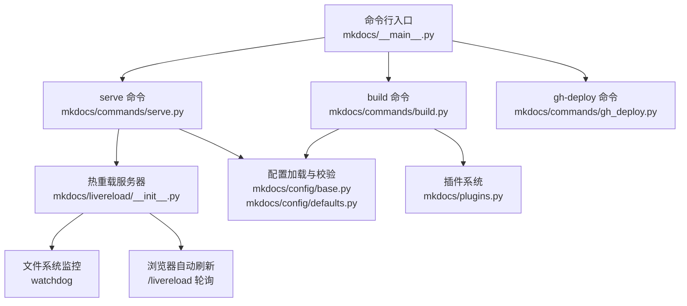
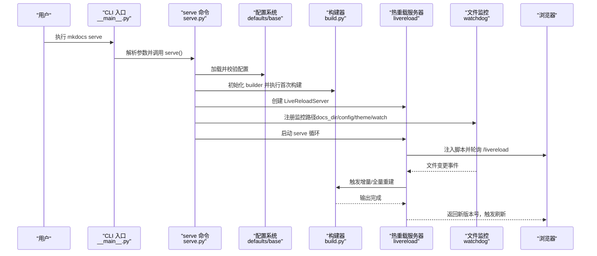
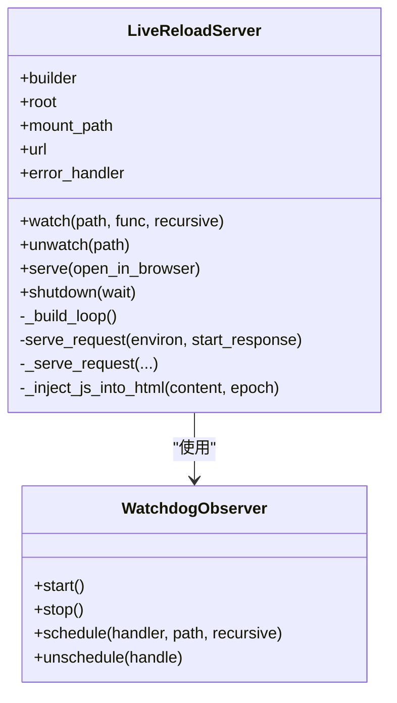
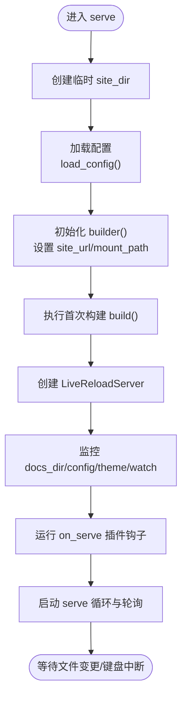
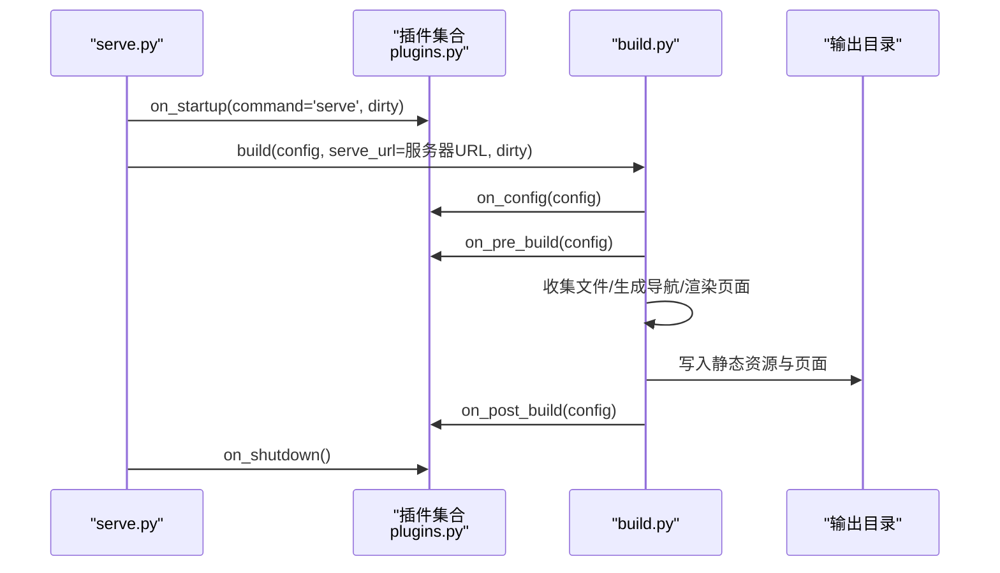
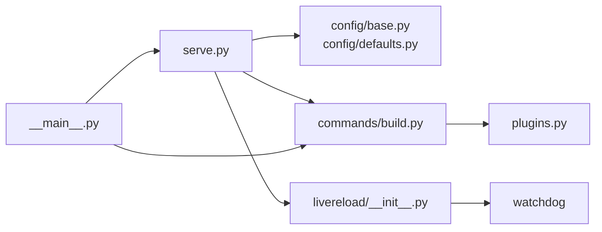
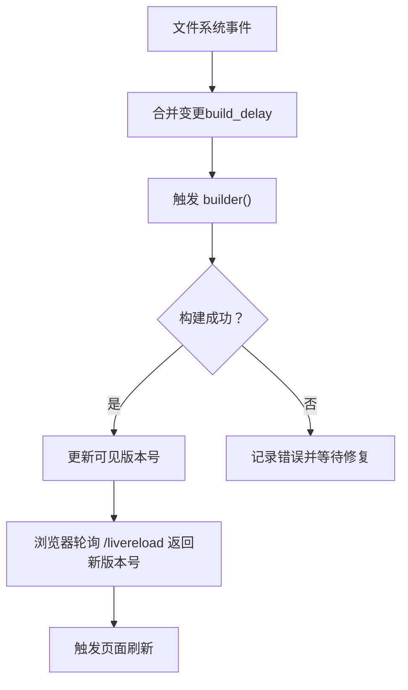
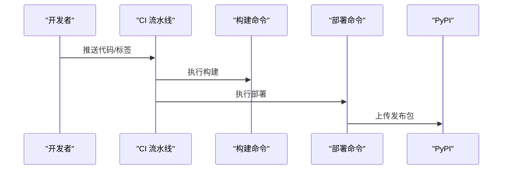

# 开发工具

<cite>
**本文引用的文件**   
- [mkdocs/commands/serve.py](file://mkdocs/commands/serve.py)
- [mkdocs/livereload/__init__.py](file://mkdocs/livereload/__init__.py)
- [mkdocs/commands/build.py](file://mkdocs/commands/build.py)
- [mkdocs/config/defaults.py](file://mkdocs/config/defaults.py)
- [mkdocs/config/base.py](file://mkdocs/config/base.py)
- [mkdocs/config/config_options.py](file://mkdocs/config/config_options.py)
- [mkdocs/plugins.py](file://mkdocs/plugins.py)
- [mkdocs/__main__.py](file://mkdocs/__main__.py)
- [mkdocs/tests/cli_tests.py](file://mkdocs/tests/cli_tests.py)
- [mkdocs/tests/livereload_tests.py](file://mkdocs/tests/livereload_tests.py)
- [mkdocs/utils/cache.py](file://mkdocs/utils/cache.py)
- [.github/workflows/deploy-release.yml](file://.github/workflows/deploy-release.yml)
</cite>

## 目录
1. [简介](#简介)
2. [项目结构](#项目结构)
3. [核心组件](#核心组件)
4. [架构总览](#架构总览)
5. [详细组件分析](#详细组件分析)
6. [依赖关系分析](#依赖关系分析)
7. [性能考虑](#性能考虑)
8. [故障排除指南](#故障排除指南)
9. [结论](#结论)
10. [附录](#附录)

## 简介
本指南围绕 MkDocs 的开发工具，系统讲解热重载开发服务器的工作原理、实时预览与文件监控机制、配置项与命令行参数、最佳实践与性能优化、调试与故障排除、以及如何将开发工具集成到 CI/CD 流水线中。文档面向不同技术背景的读者，既提供高层概览，也给出可操作的步骤与可视化图示。

## 项目结构
MkDocs 的开发工具主要由以下模块组成：
- 命令层：CLI 定义与命令分发（serve/build/gh-deploy/new 等）
- 配置层：配置加载、校验与默认值
- 构建层：站点构建流程（收集文件、渲染页面、写入输出）
- 热重载层：内置开发服务器、文件监控与浏览器自动刷新
- 插件层：事件钩子扩展开发服务器行为
- 测试与示例：CLI 行为验证、热重载行为测试

**图表来源**
- [mkdocs/__main__.py](file://mkdocs/__main__.py#L240-L371)
- [mkdocs/commands/serve.py](file://mkdocs/commands/serve.py#L20-L111)
- [mkdocs/livereload/__init__.py](file://mkdocs/livereload/__init__.py#L94-L382)
- [mkdocs/commands/build.py](file://mkdocs/commands/build.py#L249-L370)
- [mkdocs/config/base.py](file://mkdocs/config/base.py#L340-L393)
- [mkdocs/config/defaults.py](file://mkdocs/config/defaults.py#L38-L219)
- [mkdocs/plugins.py](file://mkdocs/plugins.py#L493-L698)

**章节来源**
- [mkdocs/__main__.py](file://mkdocs/__main__.py#L240-L371)
- [mkdocs/commands/serve.py](file://mkdocs/commands/serve.py#L20-L111)
- [mkdocs/commands/build.py](file://mkdocs/commands/build.py#L249-L370)
- [mkdocs/config/base.py](file://mkdocs/config/base.py#L340-L393)
- [mkdocs/config/defaults.py](file://mkdocs/config/defaults.py#L38-L219)
- [mkdocs/livereload/__init__.py](file://mkdocs/livereload/__init__.py#L94-L382)
- [mkdocs/plugins.py](file://mkdocs/plugins.py#L493-L698)

## 核心组件
- 热重载开发服务器：基于 WSGI 的轻量服务器，结合文件系统监控实现变更检测与自动刷新。
- 配置系统：类型化配置项、默认值、严格模式与校验。
- 构建流程：从收集文件、生成导航、渲染页面到写入输出目录。
- 插件系统：在构建与开发阶段提供事件钩子，扩展或定制行为。
- CLI 命令：统一入口，提供 serve/build/gh-deploy/new 等命令及参数。

**章节来源**
- [mkdocs/livereload/__init__.py](file://mkdocs/livereload/__init__.py#L94-L382)
- [mkdocs/config/defaults.py](file://mkdocs/config/defaults.py#L38-L219)
- [mkdocs/commands/build.py](file://mkdocs/commands/build.py#L249-L370)
- [mkdocs/plugins.py](file://mkdocs/plugins.py#L493-L698)
- [mkdocs/__main__.py](file://mkdocs/__main__.py#L240-L371)

## 架构总览
下图展示了开发服务器启动到首次构建、文件监控与浏览器刷新的端到端流程：

**图表来源**
- [mkdocs/__main__.py](file://mkdocs/__main__.py#L253-L273)
- [mkdocs/commands/serve.py](file://mkdocs/commands/serve.py#L20-L111)
- [mkdocs/config/defaults.py](file://mkdocs/config/defaults.py#L38-L219)
- [mkdocs/commands/build.py](file://mkdocs/commands/build.py#L249-L370)
- [mkdocs/livereload/__init__.py](file://mkdocs/livereload/__init__.py#L94-L382)

## 详细组件分析

### 热重载开发服务器（LiveReloadServer）
- 服务器职责：提供静态文件服务、注入浏览器脚本、处理 /livereload 轮询、错误页回调。
- 文件监控：通过 watchdog 的轮询观察者监听文件变更，合并短时间内的多次变更后触发重建。
- 刷新机制：向 HTML 注入脚本，浏览器以 XHR 轮询 /livereload/{epoch}/{requestId}，当服务器可见版本号大于客户端 epoch 时触发刷新。
- 生命周期：启动时开启观察者与 serve 线程；收到 KeyboardInterrupt 或 shutdown 调用后优雅关闭。

**图表来源**
- [mkdocs/livereload/__init__.py](file://mkdocs/livereload/__init__.py#L94-L382)

**章节来源**
- [mkdocs/livereload/__init__.py](file://mkdocs/livereload/__init__.py#L94-L382)
- [mkdocs/tests/livereload_tests.py](file://mkdocs/tests/livereload_tests.py#L70-L120)

### serve 命令与配置加载
- serve 命令：解析 CLI 参数，创建临时 site_dir，加载配置，初始化 builder，启动 LiveReloadServer，并在首次构建完成后开始监控与刷新。
- 配置加载：支持从 mkdocs.yml 加载，支持覆盖参数（如 theme、use_directory_urls、strict 等），严格模式下警告即停止。
- 默认地址与挂载路径：dev_addr 控制监听地址，mount_path 影响 /livereload 与静态资源路径。

**图表来源**
- [mkdocs/commands/serve.py](file://mkdocs/commands/serve.py#L20-L111)
- [mkdocs/config/base.py](file://mkdocs/config/base.py#L340-L393)
- [mkdocs/config/defaults.py](file://mkdocs/config/defaults.py#L96-L97)

**章节来源**
- [mkdocs/commands/serve.py](file://mkdocs/commands/serve.py#L20-L111)
- [mkdocs/config/base.py](file://mkdocs/config/base.py#L340-L393)
- [mkdocs/config/defaults.py](file://mkdocs/config/defaults.py#L96-L97)

### 构建流程与插件事件
- 构建阶段：清理输出目录（或脏构建）、收集文件、生成导航、渲染页面、写入模板与静态资源、运行插件事件。
- 插件事件：startup/shutdown、config、pre_build、files、nav、env、post_build、build_error 等，serve 场景下通过 on_serve 可扩展监控路径。
- 脏构建（--dirty）：仅重建自上次构建以来修改过的页面，适合大型站点快速迭代。

**图表来源**
- [mkdocs/commands/serve.py](file://mkdocs/commands/serve.py#L52-L108)
- [mkdocs/commands/build.py](file://mkdocs/commands/build.py#L249-L370)
- [mkdocs/plugins.py](file://mkdocs/plugins.py#L575-L606)

**章节来源**
- [mkdocs/commands/build.py](file://mkdocs/commands/build.py#L249-L370)
- [mkdocs/plugins.py](file://mkdocs/plugins.py#L575-L606)

### 配置系统与关键选项
- 类型化配置：通过 config_options 与 Config 子类定义，支持默认值、必填、校验与后处理。
- 关键选项（开发相关）：
  - dev_addr：本地开发服务器监听地址与端口
  - site_url：站点根 URL，影响 /livereload 轮询与错误页绝对链接
  - watch：额外监控路径列表
  - strict：严格模式，警告即停止
  - use_directory_urls：是否使用目录式 URL
  - theme：主题名称
- 验证与日志：配置加载后进行预校验、校验与后处理，记录警告与错误。

**章节来源**
- [mkdocs/config/defaults.py](file://mkdocs/config/defaults.py#L38-L219)
- [mkdocs/config/config_options.py](file://mkdocs/config/config_options.py#L1-L200)
- [mkdocs/config/base.py](file://mkdocs/config/base.py#L123-L243)

## 依赖关系分析
- serve 命令依赖配置系统与构建器，并创建热重载服务器。
- 热重载服务器依赖 watchdog 进行文件监控，WSGI 服务器提供 HTTP 服务。
- 构建器依赖插件系统以执行事件钩子。
- CLI 命令通过 Click 定义参数与帮助信息，映射到具体命令实现。

**图表来源**
- [mkdocs/commands/serve.py](file://mkdocs/commands/serve.py#L20-L111)
- [mkdocs/livereload/__init__.py](file://mkdocs/livereload/__init__.py#L94-L382)
- [mkdocs/commands/build.py](file://mkdocs/commands/build.py#L249-L370)
- [mkdocs/plugins.py](file://mkdocs/plugins.py#L493-L698)
- [mkdocs/__main__.py](file://mkdocs/__main__.py#L240-L371)

**章节来源**
- [mkdocs/commands/serve.py](file://mkdocs/commands/serve.py#L20-L111)
- [mkdocs/livereload/__init__.py](file://mkdocs/livereload/__init__.py#L94-L382)
- [mkdocs/commands/build.py](file://mkdocs/commands/build.py#L249-L370)
- [mkdocs/plugins.py](file://mkdocs/plugins.py#L493-L698)
- [mkdocs/__main__.py](file://mkdocs/__main__.py#L240-L371)

## 性能考虑
- 使用脏构建（--dirty）仅重建变更页面，减少大型站点的构建时间。
- 合理设置监控路径，避免监控过多无关目录导致频繁触发重建。
- 在严格模式（--strict）下尽早发现配置问题，避免后续失败。
- 静态资源与模板渲染的开销可通过减少复杂模板与压缩资源降低。
- 浏览器轮询间隔与服务器响应超时（poll_response_timeout）会影响刷新延迟与资源占用，可根据网络环境调整。

[本节为通用指导，不直接分析具体文件]

## 故障排除指南
- 端口占用：dev_addr 默认 127.0.0.1:8000，若被占用请更换端口。
- 权限与路径：确保 docs_dir、site_dir、theme 目录存在且可读写。
- 配置错误：启用严格模式（--strict）可将警告转为错误，便于定位问题。
- 插件冲突：检查插件 on_serve 钩子是否正确返回服务器实例并注册了监控路径。
- 构建异常：查看构建日志中的错误堆栈；热重载服务器会在重建失败时提示“服务器看起来卡住”直到修复。
- 浏览器未刷新：确认 HTML 中已注入脚本，检查 /livereload 轮询是否返回新版本号。

**章节来源**
- [mkdocs/commands/serve.py](file://mkdocs/commands/serve.py#L71-L79)
- [mkdocs/livereload/__init__.py](file://mkdocs/livereload/__init__.py#L210-L221)
- [mkdocs/tests/livereload_tests.py](file://mkdocs/tests/livereload_tests.py#L270-L307)

## 结论
MkDocs 的开发工具以热重载为核心，结合配置系统、构建流程与插件机制，提供了高效、可扩展的本地开发体验。通过合理配置监控路径、利用脏构建与严格模式、以及在 CI/CD 中复用构建流程，可以显著提升开发效率与发布质量。

[本节为总结性内容，不直接分析具体文件]

## 附录

### 开发服务器使用与配置要点
- 启动开发服务器：mkdocs serve
- 指定监听地址与端口：--dev-addr IP:PORT
- 自动打开浏览器：--open
- 禁用热重载：--no-livereload
- 脏构建仅重建变更：--dirty
- 清洁构建后再启动：--clean
- 监控主题文件：--watch-theme
- 添加额外监控路径：--watch PATH（可多次）

**章节来源**
- [mkdocs/__main__.py](file://mkdocs/__main__.py#L253-L273)
- [mkdocs/commands/serve.py](file://mkdocs/commands/serve.py#L20-L111)
- [mkdocs/tests/cli_tests.py](file://mkdocs/tests/cli_tests.py#L17-L217)

### 实时预览与文件监控机制
- 浏览器注入脚本：向 HTML 注入脚本，轮询 /livereload/{epoch}/{requestId}
- 服务器轮询处理：/_livereload 路径根据可见版本号决定是否刷新
- 文件监控：watchdog 轮询观察者监听文件变更，合并短时间内的多次变更
- 构建触发：变更发生后，服务器在短暂延迟后触发构建，完成后广播新版本号

**图表来源**
- [mkdocs/livereload/__init__.py](file://mkdocs/livereload/__init__.py#L192-L226)
- [mkdocs/livereload/__init__.py](file://mkdocs/livereload/__init__.py#L264-L284)

**章节来源**
- [mkdocs/livereload/__init__.py](file://mkdocs/livereload/__init__.py#L192-L226)
- [mkdocs/livereload/__init__.py](file://mkdocs/livereload/__init__.py#L264-L284)
- [mkdocs/tests/livereload_tests.py](file://mkdocs/tests/livereload_tests.py#L406-L430)

### 集成到 CI/CD 流水线
- 构建与部署：在流水线中先执行构建（build/gh-deploy），再进行部署。
- 版本检查：gh-deploy 会检查当前 MkDocs 版本与上次部署版本的关系，避免回滚。
- 发布包：可参考仓库的 PyPI 发布工作流，使用构建产物发布到 PyPI。

**图表来源**
- [.github/workflows/deploy-release.yml](file://.github/workflows/deploy-release.yml#L1-L22)

**章节来源**
- [.github/workflows/deploy-release.yml](file://.github/workflows/deploy-release.yml#L1-L22)

### 最佳实践与团队协作建议
- 团队规范：统一 dev_addr、theme、use_directory_urls 等配置，减少差异。
- 监控范围：仅监控必要的目录，避免误触发。
- 日志级别：开发阶段使用 --verbose，生产构建使用 --quiet。
- 插件管理：通过 on_serve 钩子集中管理监控路径，避免分散配置。
- 缓存与网络：合理设置轮询超时，避免在慢速网络下频繁失败。

[本节为通用指导，不直接分析具体文件]