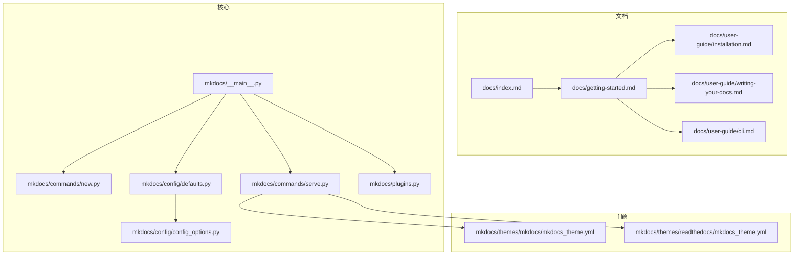
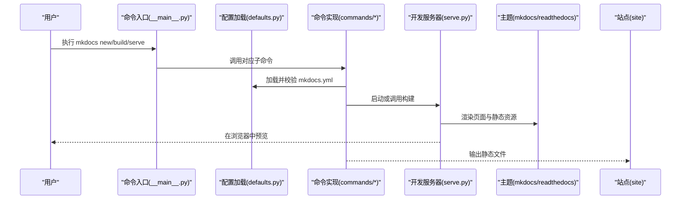
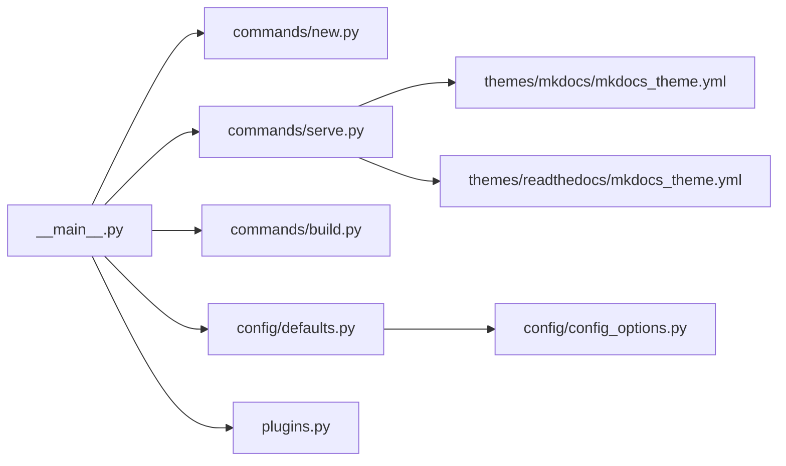

# 快速开始

<cite>
**本文引用的文件**
- [README.md](file://README.md)
- [docs/getting-started.md](file://docs/getting-started.md)
- [docs/index.md](file://docs/index.md)
- [docs/user-guide/installation.md](file://docs/user-guide/installation.md)
- [docs/user-guide/writing-your-docs.md](file://docs/user-guide/writing-your-docs.md)
- [docs/user-guide/cli.md](file://docs/user-guide/cli.md)
- [mkdocs/__main__.py](file://mkdocs/__main__.py)
- [mkdocs/commands/new.py](file://mkdocs/commands/new.py)
- [mkdocs/commands/serve.py](file://mkdocs/commands/serve.py)
- [mkdocs/config/defaults.py](file://mkdocs/config/defaults.py)
- [mkdocs/config/config_options.py](file://mkdocs/config/config_options.py)
- [mkdocs/themes/mkdocs/mkdocs_theme.yml](file://mkdocs/themes/mkdocs/mkdocs_theme.yml)
- [mkdocs/themes/readthedocs/mkdocs_theme.yml](file://mkdocs/themes/readthedocs/mkdocs_theme.yml)
- [mkdocs/plugins.py](file://mkdocs/plugins.py)
</cite>

## 目录
1. [简介](#简介)
2. [项目结构](#项目结构)
3. [核心组件](#核心组件)
4. [架构总览](#架构总览)
5. [详细组件解析](#详细组件解析)
6. [依赖关系分析](#依赖关系分析)
7. [性能与实践建议](#性能与实践建议)
8. [故障排查指南](#故障排查指南)
9. [结语](#结语)
10. [附录：命令与配置速查](#附录命令与配置速查)

## 简介
本指南面向初学者，帮助你在约 10 分钟内完成从零到一的 MkDocs 文档站点：安装、创建项目、本地预览、构建与部署。你将了解静态网站生成器的基本工作原理，以及 MkDocs 如何用 Markdown 和少量配置，快速产出美观、可搜索、可扩展的文档站点。

## 项目结构
仓库包含官方文档、核心代码与主题资源。对新手而言，最相关的部分是：
- 官方文档：位于 docs/ 下，涵盖安装、入门、CLI、配置、写作、主题与部署等
- 核心命令与配置：位于 mkdocs/ 下，包括命令入口、构建、开发服务器、配置选项与默认值
- 主题与插件：位于 mkdocs/themes/ 与 mkdocs/plugins.py 中

图表来源
- [docs/index.md](file://docs/index.md#L1-L90)
- [docs/getting-started.md](file://docs/getting-started.md#L1-L214)
- [docs/user-guide/installation.md](file://docs/user-guide/installation.md#L1-L108)
- [docs/user-guide/writing-your-docs.md](file://docs/user-guide/writing-your-docs.md#L1-L541)
- [docs/user-guide/cli.md](file://docs/user-guide/cli.md#L1-L9)
- [mkdocs/__main__.py](file://mkdocs/__main__.py#L240-L371)
- [mkdocs/commands/new.py](file://mkdocs/commands/new.py#L1-L54)
- [mkdocs/commands/serve.py](file://mkdocs/commands/serve.py#L1-L111)
- [mkdocs/config/defaults.py](file://mkdocs/config/defaults.py#L38-L219)
- [mkdocs/config/config_options.py](file://mkdocs/config/config_options.py#L1-L200)
- [mkdocs/plugins.py](file://mkdocs/plugins.py#L1-L200)
- [mkdocs/themes/mkdocs/mkdocs_theme.yml](file://mkdocs/themes/mkdocs/mkdocs_theme.yml#L1-L29)
- [mkdocs/themes/readthedocs/mkdocs_theme.yml](file://mkdocs/themes/readthedocs/mkdocs_theme.yml#L1-L26)

章节来源
- [docs/index.md](file://docs/index.md#L1-L90)
- [docs/getting-started.md](file://docs/getting-started.md#L1-L214)

## 核心组件
- 命令行入口与子命令
  - 入口模块负责解析参数、设置日志与颜色输出，并注册 serve/build/gh-deploy/new 等子命令
- 初始化与项目模板
  - new 子命令用于生成初始项目结构（mkdocs.yml 与 docs/index.md）
- 开发服务器
  - serve 子命令启动内置 LiveReload 服务，自动监听变更并刷新浏览器
- 配置系统
  - defaults.py 定义了核心配置项（如 site_name、theme、docs_dir、site_dir、plugins 等）及默认值；config_options.py 提供类型与校验逻辑
- 主题与插件
  - 内置 mkdocs 与 readthedocs 主题；plugins.py 定义插件 API 与生命周期事件

章节来源
- [mkdocs/__main__.py](file://mkdocs/__main__.py#L240-L371)
- [mkdocs/commands/new.py](file://mkdocs/commands/new.py#L1-L54)
- [mkdocs/commands/serve.py](file://mkdocs/commands/serve.py#L1-L111)
- [mkdocs/config/defaults.py](file://mkdocs/config/defaults.py#L38-L219)
- [mkdocs/config/config_options.py](file://mkdocs/config/config_options.py#L1-L200)
- [mkdocs/plugins.py](file://mkdocs/plugins.py#L1-L200)

## 架构总览
下图展示了从命令行到站点生成与预览的整体流程。

图表来源
- [mkdocs/__main__.py](file://mkdocs/__main__.py#L240-L371)
- [mkdocs/commands/serve.py](file://mkdocs/commands/serve.py#L1-L111)
- [mkdocs/config/defaults.py](file://mkdocs/config/defaults.py#L38-L219)
- [mkdocs/themes/mkdocs/mkdocs_theme.yml](file://mkdocs/themes/mkdocs/mkdocs_theme.yml#L1-L29)
- [mkdocs/themes/readthedocs/mkdocs_theme.yml](file://mkdocs/themes/readthedocs/mkdocs_theme.yml#L1-L26)

## 详细组件解析

### 1) 安装与系统要求
- 系统要求：需要 Python 与 pip。可通过命令行检查版本
- 安装方式：使用 pip 安装 mkdocs
- 版本验证：执行命令查看版本信息
- Windows 注意事项：可能需要使用 python -m 前缀或调整 PATH

章节来源
- [docs/user-guide/installation.md](file://docs/user-guide/installation.md#L1-L108)

### 2) 创建你的第一个项目
- 使用 new 子命令快速生成项目骨架
- 生成内容：mkdocs.yml（配置文件）与 docs/index.md（首页）
- 初始配置要点：site_name 是必填项；默认 docs 为文档目录，site 默认输出到 site/

章节来源
- [docs/getting-started.md](file://docs/getting-started.md#L17-L38)
- [mkdocs/commands/new.py](file://mkdocs/commands/new.py#L1-L54)
- [mkdocs/config/defaults.py](file://mkdocs/config/defaults.py#L76-L80)

### 3) 本地预览与热重载
- 使用 serve 子命令启动开发服务器，默认监听 127.0.0.1:8000
- 修改 mkdocs.yml 或 docs 下文件后，浏览器自动刷新
- 可通过 --open 自动打开浏览器；支持 --dirty 仅重建变更文件

章节来源
- [docs/getting-started.md](file://docs/getting-started.md#L36-L77)
- [mkdocs/commands/serve.py](file://mkdocs/commands/serve.py#L1-L111)
- [mkdocs/__main__.py](file://mkdocs/__main__.py#L253-L273)

### 4) 添加页面与导航
- 新增 Markdown 页面到 docs 目录
- 在 mkdocs.yml 中通过 nav 配置定义导航顺序、标题与分组
- 导航项路径相对 docs_dir，支持嵌套与多级分组

章节来源
- [docs/getting-started.md](file://docs/getting-started.md#L79-L113)
- [docs/user-guide/writing-your-docs.md](file://docs/user-guide/writing-your-docs.md#L97-L167)
- [mkdocs/config/defaults.py](file://mkdocs/config/defaults.py#L47-L48)

### 5) 主题与外观
- 通过 theme 配置切换主题（如 mkdocs、readthedocs）
- 不同主题有各自的配置项（如导航深度、快捷键、高亮样式等）
- 可在 docs/img 下放置自定义 favicon.ico

章节来源
- [docs/getting-started.md](file://docs/getting-started.md#L114-L139)
- [mkdocs/themes/mkdocs/mkdocs_theme.yml](file://mkdocs/themes/mkdocs/mkdocs_theme.yml#L1-L29)
- [mkdocs/themes/readthedocs/mkdocs_theme.yml](file://mkdocs/themes/readthedocs/mkdocs_theme.yml#L1-L26)

### 6) 构建与输出
- 使用 build 子命令生成静态站点到 site/ 目录
- 输出包含 HTML、CSS、JS、图片与 sitemap 等
- 建议将 site/ 加入 .gitignore

章节来源
- [docs/getting-started.md](file://docs/getting-started.md#L140-L173)
- [mkdocs/__main__.py](file://mkdocs/__main__.py#L275-L291)

### 7) 插件与扩展
- 通过 plugins 列表启用插件（默认包含 search）
- 通过 markdown_extensions 与 mdx_configs 启用 Markdown 扩展（如表格、围栏代码块、目录等）
- 插件 API 支持 on_config、on_files、on_nav、on_page_* 等生命周期事件

章节来源
- [mkdocs/config/defaults.py](file://mkdocs/config/defaults.py#L157-L158)
- [mkdocs/config/defaults.py](file://mkdocs/config/defaults.py#L132-L139)
- [mkdocs/plugins.py](file://mkdocs/plugins.py#L1-L200)

### 8) 命令行参考
- mkdocs --help 查看所有命令
- mkdocs <command> --help 查看具体命令选项
- 常用命令：new、serve、build、gh-deploy、get-deps

章节来源
- [docs/user-guide/cli.md](file://docs/user-guide/cli.md#L1-L9)
- [mkdocs/__main__.py](file://mkdocs/__main__.py#L240-L371)

## 依赖关系分析
- 命令入口依赖各命令模块与配置系统
- serve 依赖 LiveReload 与主题渲染
- 配置系统由 defaults 与 config_options 共同构成
- 主题通过其主题配置文件参与渲染
- 插件系统贯穿构建生命周期

图表来源
- [mkdocs/__main__.py](file://mkdocs/__main__.py#L240-L371)
- [mkdocs/commands/new.py](file://mkdocs/commands/new.py#L1-L54)
- [mkdocs/commands/serve.py](file://mkdocs/commands/serve.py#L1-L111)
- [mkdocs/config/defaults.py](file://mkdocs/config/defaults.py#L38-L219)
- [mkdocs/config/config_options.py](file://mkdocs/config/config_options.py#L1-L200)
- [mkdocs/themes/mkdocs/mkdocs_theme.yml](file://mkdocs/themes/mkdocs/mkdocs_theme.yml#L1-L29)
- [mkdocs/themes/readthedocs/mkdocs_theme.yml](file://mkdocs/themes/readthedocs/mkdocs_theme.yml#L1-L26)
- [mkdocs/plugins.py](file://mkdocs/plugins.py#L1-L200)

章节来源
- [mkdocs/__main__.py](file://mkdocs/__main__.py#L240-L371)
- [mkdocs/commands/serve.py](file://mkdocs/commands/serve.py#L1-L111)
- [mkdocs/config/defaults.py](file://mkdocs/config/defaults.py#L38-L219)

## 性能与实践建议
- 使用 --dirty 模式在 serve 时仅重建变更文件，提升迭代速度
- 将大型媒体资源放在 docs/img 等目录，避免过多静态资源影响构建时间
- 合理组织导航层级，避免过深嵌套导致维护困难
- 在 mkdocs.yml 中按需启用插件与 Markdown 扩展，减少不必要的处理开销

## 故障排查指南
- 无法找到 mkdocs 命令
  - 确认已安装并正确配置 PATH；Windows 可尝试 python -m mkdocs
- serve 启动失败或端口占用
  - 指定不同地址与端口，或关闭占用端口的进程
- 主题或插件报错
  - 检查 plugins 与 markdown_extensions 配置是否正确
  - 使用 --verbose 查看详细日志
- 本地预览正常但构建失败
  - 使用 --strict 模式定位问题；检查链接与元数据格式

章节来源
- [docs/user-guide/installation.md](file://docs/user-guide/installation.md#L81-L100)
- [mkdocs/__main__.py](file://mkdocs/__main__.py#L163-L218)
- [mkdocs/config/defaults.py](file://mkdocs/config/defaults.py#L140-L143)

## 结语
通过本指南，你已经完成了 MkDocs 的安装、项目初始化、本地预览、页面添加、主题切换与站点构建。接下来可以探索更多主题与插件，完善导航与搜索体验，并将站点部署到任意静态托管平台。

## 附录：命令与配置速查
- 安装与版本
  - 安装：pip install mkdocs
  - 版本：mkdocs --version
- 创建项目
  - mkdocs new <项目目录>
- 本地开发
  - mkdocs serve [--open] [--dirty]
- 构建站点
  - mkdocs build
- 常用配置
  - site_name：站点名称（必填）
  - theme：主题名称（如 mkdocs、readthedocs）
  - nav：导航结构
  - docs_dir/site_dir：文档与输出目录
  - plugins/markdown_extensions：插件与 Markdown 扩展

章节来源
- [docs/getting-started.md](file://docs/getting-started.md#L7-L189)
- [docs/user-guide/installation.md](file://docs/user-guide/installation.md#L53-L67)
- [mkdocs/config/defaults.py](file://mkdocs/config/defaults.py#L44-L80)
- [mkdocs/config/defaults.py](file://mkdocs/config/defaults.py#L132-L158)