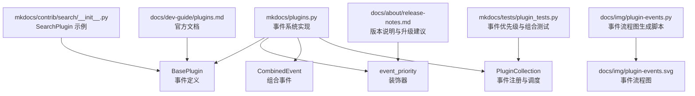
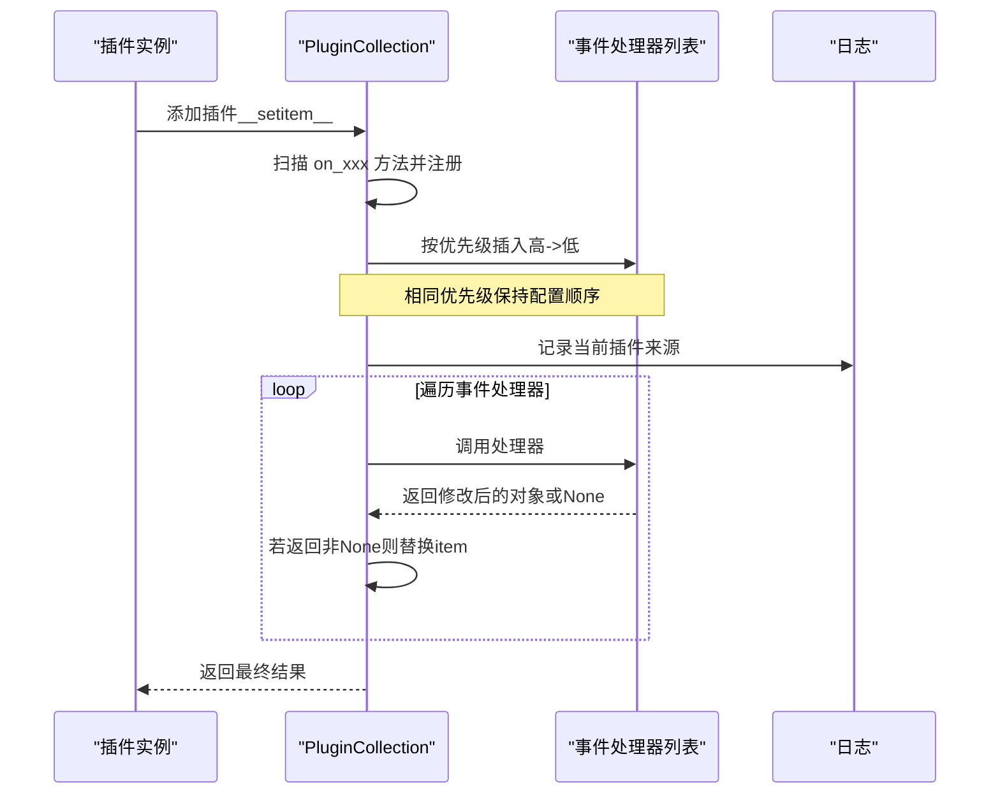
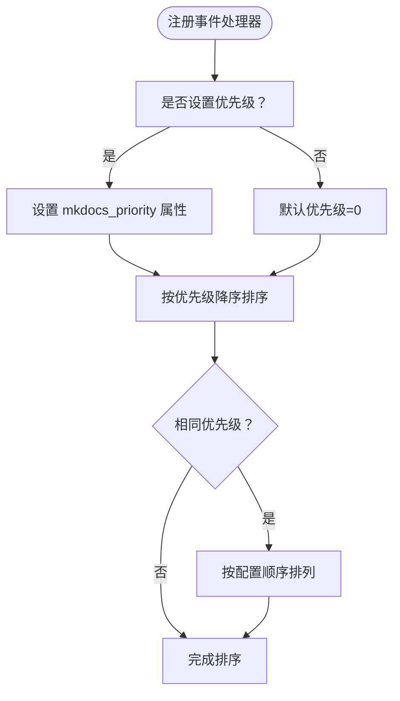
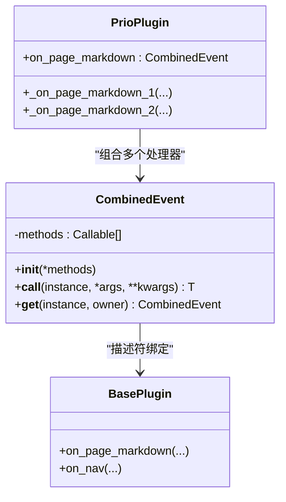
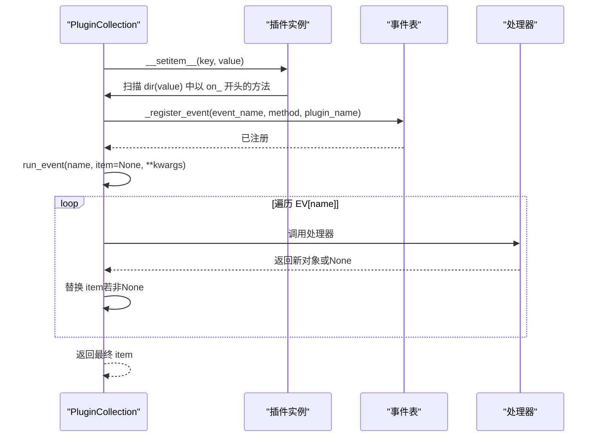
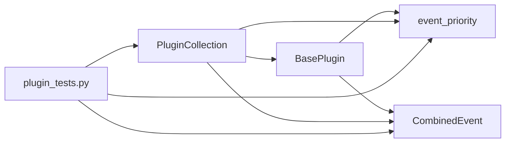
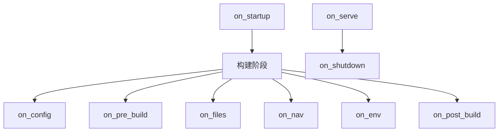

# 事件系统

<cite>
**本文引用的文件**
- [mkdocs/plugins.py](file://mkdocs/plugins.py)
- [mkdocs/tests/plugin_tests.py](file://mkdocs/tests/plugin_tests.py)
- [mkdocs/contrib/search/__init__.py](file://mkdocs/contrib/search/__init__.py)
- [docs/dev-guide/plugins.md](file://docs/dev-guide/plugins.md)
- [docs/about/release-notes.md](file://docs/about/release-notes.md)
- [docs/img/plugin-events.py](file://docs/img/plugin-events.py)
- [docs/img/plugin-events.svg](file://docs/img/plugin-events.svg)
</cite>

## 目录
1. [简介](#简介)
2. [项目结构](#项目结构)
3. [核心组件](#核心组件)
4. [架构总览](#架构总览)
5. [详细组件分析](#详细组件分析)
6. [依赖关系分析](#依赖关系分析)
7. [性能考量](#性能考量)
8. [故障排查指南](#故障排查指南)
9. [结论](#结论)
10. [附录](#附录)

## 简介
本指南系统性介绍 MkDocs 的事件系统，覆盖以下主题：
- 所有可用事件钩子：全局事件、模板事件、页面事件、一次性事件
- 每个事件的触发时机、参数传递与返回值处理
- 事件优先级机制与最佳实践
- 使用 event_priority 装饰器控制执行顺序
- CombinedEvent 的使用方法与多处理器组合模式
- 完整的事件处理示例与常见使用场景

## 项目结构
事件系统的核心实现位于 mkdocs/plugins.py，配套测试位于 mkdocs/tests/plugin_tests.py，官方文档在 docs/dev-guide/plugins.md 中有详细说明；事件时序图由 docs/img/plugin-events.py 生成。

图表来源
- [mkdocs/plugins.py](file://mkdocs/plugins.py#L58-L417)
- [mkdocs/tests/plugin_tests.py](file://mkdocs/tests/plugin_tests.py#L105-L185)
- [mkdocs/contrib/search/__init__.py](file://mkdocs/contrib/search/__init__.py#L62-L121)
- [docs/dev-guide/plugins.md](file://docs/dev-guide/plugins.md#L247-L465)
- [docs/about/release-notes.md](file://docs/about/release-notes.md#L662-L671)
- [docs/img/plugin-events.py](file://docs/img/plugin-events.py#L1-L172)

章节来源
- [mkdocs/plugins.py](file://mkdocs/plugins.py#L1-L698)
- [mkdocs/tests/plugin_tests.py](file://mkdocs/tests/plugin_tests.py#L1-L329)
- [docs/dev-guide/plugins.md](file://docs/dev-guide/plugins.md#L247-L465)

## 核心组件
- BasePlugin：定义所有事件钩子方法签名（一次性事件、全局事件、模板事件、页面事件）
- event_priority：为事件处理器设置优先级的装饰器
- CombinedEvent：将多个子处理器合并为一个事件名下的处理器
- PluginCollection：维护插件集合与事件注册表，按优先级顺序执行事件

章节来源
- [mkdocs/plugins.py](file://mkdocs/plugins.py#L58-L417)
- [mkdocs/plugins.py](file://mkdocs/plugins.py#L426-L457)
- [mkdocs/plugins.py](file://mkdocs/plugins.py#L460-L491)
- [mkdocs/plugins.py](file://mkdocs/plugins.py#L493-L647)

## 架构总览
事件系统采用“插件注册 + 有序调度”的模式：
- 插件类通过方法名以 on_xxx 命名声明事件处理器
- PluginCollection 在添加插件时扫描并注册所有事件处理器
- 对于支持优先级的事件，按优先级降序排序；相同优先级按配置顺序
- 运行时对每个事件调用已注册的处理器，支持“传入对象”和“无参对象”的两种模式

图表来源
- [mkdocs/plugins.py](file://mkdocs/plugins.py#L535-L573)

章节来源
- [mkdocs/plugins.py](file://mkdocs/plugins.py#L493-L647)

## 详细组件分析

### BasePlugin 事件钩子一览
- 一次性事件
  - on_startup(command, dirty)
  - on_shutdown()
  - on_serve(server, config, builder)
- 全局事件
  - on_config(config)
  - on_pre_build(config)
  - on_files(files, config)
  - on_nav(nav, config, files)
  - on_env(env, config, files)
  - on_post_build(config)
  - on_build_error(error)
- 模板事件
  - on_pre_template(template, template_name, config)
  - on_template_context(context, template_name, config)
  - on_post_template(output_content, template_name, config)
- 页面事件
  - on_pre_page(page, config, files)
  - on_page_read_source(page, config)（已弃用替代方案）
  - on_page_markdown(markdown, page, config, files)
  - on_page_content(html, page, config, files)
  - on_page_context(context, page, config, nav)
  - on_post_page(output, page, config)

参数与返回值约定：
- 大多数事件接收上下文参数（如 config、files、nav、page 等），部分事件还接收“可变对象”作为第一个参数
- 若事件返回非 None，则作为新的对象传递给后续处理器；若返回 None，则保留原对象
- 无参事件通常用于副作用（如 on_pre_build、on_post_build）

章节来源
- [mkdocs/plugins.py](file://mkdocs/plugins.py#L98-L417)

### 事件优先级机制
- 通过 event_priority 装饰器为事件处理器设置优先级
- 默认优先级为 0；数值越高越先执行
- 相同优先级按插件在配置中的顺序执行
- 推荐优先级值：100（first）、50（early）、0（default）、-50（late）、-100（last）

图表来源
- [mkdocs/plugins.py](file://mkdocs/plugins.py#L509-L531)
- [mkdocs/plugins.py](file://mkdocs/plugins.py#L426-L457)

章节来源
- [mkdocs/plugins.py](file://mkdocs/plugins.py#L426-L457)
- [docs/about/release-notes.md](file://docs/about/release-notes.md#L662-L671)

### CombinedEvent 组合事件
- 将多个子处理器合并到同一事件名下，便于在同一事件中定义不同优先级的处理逻辑
- 子方法命名不能以 on_ 开头，推荐以 _on_ 或其他前缀
- 描述符机制确保在实例化后绑定到具体实例

图表来源
- [mkdocs/plugins.py](file://mkdocs/plugins.py#L460-L491)

章节来源
- [mkdocs/plugins.py](file://mkdocs/plugins.py#L460-L491)
- [mkdocs/tests/plugin_tests.py](file://mkdocs/tests/plugin_tests.py#L135-L185)

### PluginCollection 事件注册与调度
- 注册：扫描插件上以 on_ 开头的方法，去除前缀后登记到事件表
- 调度：run_event 按事件表顺序依次调用处理器，支持“传入对象”和“无参对象”
- 特殊处理：对 page_read_source 事件，若已有处理器则发出警告并仅保留最新注册者

图表来源
- [mkdocs/plugins.py](file://mkdocs/plugins.py#L535-L573)
- [mkdocs/plugins.py](file://mkdocs/plugins.py#L509-L531)

章节来源
- [mkdocs/plugins.py](file://mkdocs/plugins.py#L493-L647)

### 事件处理示例与常见场景

- 在 on_config 中扩展主题模板与脚本
  - 参考：[SearchPlugin.on_config](file://mkdocs/contrib/search/__init__.py#L65-L85)
- 在 on_pre_build 中准备资源（如搜索索引）
  - 参考：[SearchPlugin.on_pre_build](file://mkdocs/contrib/search/__init__.py#L87-L89)
- 在 on_page_context 中收集页面条目加入索引
  - 参考：[SearchPlugin.on_page_context](file://mkdocs/contrib/search/__init__.py#L91-L93)
- 在 on_post_build 中输出静态资源
  - 参考：[SearchPlugin.on_post_build](file://mkdocs/contrib/search/__init__.py#L95-L121)
- 使用 event_priority 控制事件顺序
  - 测试用例展示了不同优先级的处理器顺序与警告行为
  - 参考：[测试：事件优先级](file://mkdocs/tests/plugin_tests.py#L135-L185)
- 使用 CombinedEvent 组合多个处理器
  - 测试用例演示了在同一事件下定义多个子处理器并分别设置优先级
  - 参考：[测试：组合事件](file://mkdocs/tests/plugin_tests.py#L135-L185)

章节来源
- [mkdocs/contrib/search/__init__.py](file://mkdocs/contrib/search/__init__.py#L62-L121)
- [mkdocs/tests/plugin_tests.py](file://mkdocs/tests/plugin_tests.py#L135-L185)

## 依赖关系分析
- BasePlugin 定义事件接口，各事件处理器遵循统一签名
- event_priority 为处理器附加优先级属性，影响排序
- CombinedEvent 提供组合能力，内部仍通过 _register_event 注册子处理器
- PluginCollection 负责注册与调度，依赖排序算法保证执行顺序
- 测试用例验证优先级排序、重复处理器警告、事件返回值处理等行为

图表来源
- [mkdocs/plugins.py](file://mkdocs/plugins.py#L58-L417)
- [mkdocs/plugins.py](file://mkdocs/plugins.py#L426-L491)
- [mkdocs/plugins.py](file://mkdocs/plugins.py#L493-L647)
- [mkdocs/tests/plugin_tests.py](file://mkdocs/tests/plugin_tests.py#L105-L185)

章节来源
- [mkdocs/plugins.py](file://mkdocs/plugins.py#L493-L647)
- [mkdocs/tests/plugin_tests.py](file://mkdocs/tests/plugin_tests.py#L105-L185)

## 性能考量
- 事件处理器数量与优先级排序开销：排序基于 insort，复杂度 O(n log n)，n 为该事件已注册处理器数
- 事件链路较长时，建议：
  - 合理拆分处理器职责，避免单个处理器承担过多逻辑
  - 使用 CombinedEvent 将相关逻辑分层但保持单一事件入口
  - 对昂贵操作尽量延迟到必要阶段（如 on_post_build）

## 故障排查指南
- 多个插件注册同一事件处理器
  - 现象：出现“Multiple 'on_page_read_source' handlers can't work”警告
  - 原因：page_read_source 事件只允许一个处理器
  - 处理：合并功能到单一插件或使用 CombinedEvent 将逻辑拆分为多个子处理器
  - 参考：[警告与测试](file://mkdocs/plugins.py#L518-L524)、[测试用例](file://mkdocs/tests/plugin_tests.py#L162-L167)
- 事件返回值为 None 导致对象未更新
  - 现象：后续处理器未收到预期输入
  - 处理：确保事件处理器返回新对象或 None；None 表示不改变对象
  - 参考：[run_event 逻辑](file://mkdocs/plugins.py#L560-L573)
- 错误处理与 on_build_error
  - 现象：构建过程中抛出异常
  - 处理：在处理器中捕获异常并抛出 PluginError/BuildError，以便用户友好提示；on_build_error 会接收到错误
  - 参考：[错误处理说明](file://docs/dev-guide/plugins.md#L442-L465)、[测试用例](file://mkdocs/tests/plugin_tests.py#L267-L329)

章节来源
- [mkdocs/plugins.py](file://mkdocs/plugins.py#L518-L524)
- [mkdocs/plugins.py](file://mkdocs/plugins.py#L560-L573)
- [docs/dev-guide/plugins.md](file://docs/dev-guide/plugins.md#L442-L465)
- [mkdocs/tests/plugin_tests.py](file://mkdocs/tests/plugin_tests.py#L267-L329)

## 结论
MkDocs 的事件系统通过 BasePlugin 的统一接口、event_priority 的优先级控制、CombinedEvent 的组合能力以及 PluginCollection 的有序调度，提供了强大而灵活的扩展点。合理使用这些机制，可以实现复杂的插件协作与稳定的构建流程。

## 附录

### 事件时序图（概览）
事件时序图由 docs/img/plugin-events.py 生成，展示了从启动到关闭的完整流程，以及全局事件与页面事件之间的关系。

图表来源
- [docs/img/plugin-events.py](file://docs/img/plugin-events.py#L90-L154)

章节来源
- [docs/img/plugin-events.py](file://docs/img/plugin-events.py#L1-L172)