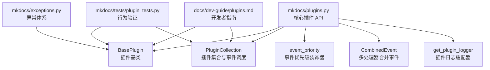
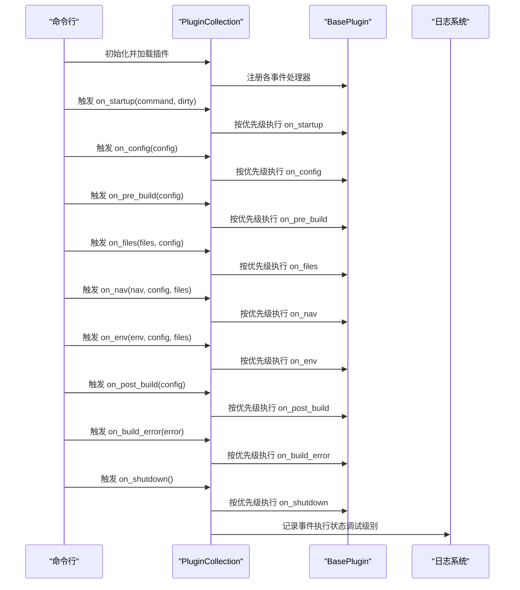
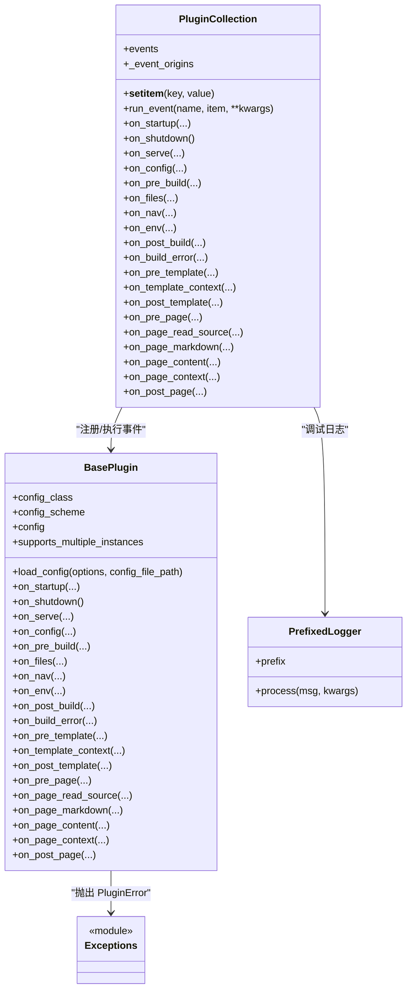

# 插件 API 参考

<cite>
**本文引用的文件列表**
- [mkdocs/plugins.py](file://mkdocs/plugins.py)
- [mkdocs/exceptions.py](file://mkdocs/exceptions.py)
- [mkdocs/tests/plugin_tests.py](file://mkdocs/tests/plugin_tests.py)
- [docs/dev-guide/plugins.md](file://docs/dev-guide/plugins.md)
</cite>

## 目录
1. [简介](#简介)
2. [项目结构](#项目结构)
3. [核心组件](#核心组件)
4. [架构总览](#架构总览)
5. [详细组件分析](#详细组件分析)
6. [依赖关系分析](#依赖关系分析)
7. [性能与并发特性](#性能与并发特性)
8. [故障排查指南](#故障排查指南)
9. [结论](#结论)
10. [附录：常用示例与最佳实践](#附录常用示例与最佳实践)

## 简介
本参考文档面向 MkDocs 插件开发者，系统梳理插件 API 的核心接口与使用规范，重点覆盖：
- BasePlugin 类的公共方法与属性（含 load_config、on_config、on_pre_build 等）
- PluginCollection 类的事件注册、执行与管理机制
- event_priority 装饰器与 CombinedEvent 的组合使用
- 插件日志系统与 get_plugin_logger 的用法
- 参数类型、返回值与异常处理约定
- 实际使用场景与示例路径

## 项目结构
围绕插件系统的关键文件与职责如下：
- mkdocs/plugins.py：定义 BasePlugin、PluginCollection、event_priority、CombinedEvent、get_plugin_logger 等核心 API
- mkdocs/exceptions.py：定义 MkDocs 异常体系，用于插件抛错与错误处理
- mkdocs/tests/plugin_tests.py：对 BasePlugin、PluginCollection、事件优先级与日志等行为进行单元测试
- docs/dev-guide/plugins.md：官方开发者指南，包含事件流程图、错误处理与日志建议

图表来源
- [mkdocs/plugins.py](file://mkdocs/plugins.py#L58-L698)
- [mkdocs/exceptions.py](file://mkdocs/exceptions.py#L1-L42)
- [mkdocs/tests/plugin_tests.py](file://mkdocs/tests/plugin_tests.py#L1-L329)
- [docs/dev-guide/plugins.md](file://docs/dev-guide/plugins.md#L1-L567)

章节来源
- [mkdocs/plugins.py](file://mkdocs/plugins.py#L1-L698)
- [docs/dev-guide/plugins.md](file://docs/dev-guide/plugins.md#L1-L567)

## 核心组件
本节概述 BasePlugin、PluginCollection、event_priority、CombinedEvent、get_plugin_logger 的职责与关键点。

- BasePlugin
  - 作为所有插件的基类，提供配置加载、事件钩子方法与类型约束
  - 支持通过泛型指定配置类，获得更强的类型安全
- PluginCollection
  - 维护插件实例字典，并为每个事件维护有序回调列表
  - 提供 run_event 方法按优先级顺序执行事件
- event_priority
  - 为事件处理器设置优先级，数值越高越先执行；默认 0
- CombinedEvent
  - 将多个子处理器合并到同一事件名下，便于在同一事件上注册不同优先级的处理器
- get_plugin_logger
  - 返回带前缀的 LoggerAdapter，统一插件日志格式与级别控制

章节来源
- [mkdocs/plugins.py](file://mkdocs/plugins.py#L58-L698)
- [docs/dev-guide/plugins.md](file://docs/dev-guide/plugins.md#L426-L514)

## 架构总览
插件生命周期与事件流概览（基于官方文档与源码注释）：

图表来源
- [mkdocs/plugins.py](file://mkdocs/plugins.py#L575-L646)
- [docs/dev-guide/plugins.md](file://docs/dev-guide/plugins.md#L270-L425)

章节来源
- [mkdocs/plugins.py](file://mkdocs/plugins.py#L575-L646)
- [docs/dev-guide/plugins.md](file://docs/dev-guide/plugins.md#L270-L425)

## 详细组件分析

### BasePlugin 类 API
- 公共属性
  - config_class：配置类类型，默认 LegacyConfig；支持通过泛型指定具体配置类以获得类型安全
  - config_scheme：配置模式元组；当 config_class 非 LegacyConfig 时自动从配置类推导
  - config：已加载并验证后的配置对象；可通过字典或属性访问（取决于配置类）
  - supports_multiple_instances：是否允许同一插件多次添加（默认 False）

- 关键方法
  - load_config(options, config_file_path=None) -> tuple[ConfigErrors, ConfigWarnings]
    - 作用：从字典加载配置并校验，返回错误与警告元组
    - 注意：LegacyConfig 与新式配置类的处理差异
  - on_startup(command, dirty) -> None
    - 作用：一次性的启动事件，适合初始化跨构建资源
  - on_shutdown() -> None
    - 作用：一次性的关闭事件，适合清理资源
  - on_serve(server, config, builder) -> LiveReloadServer | None
    - 作用：开发服务器启动后一次性调用，可修改 LiveReloadServer
  - on_config(config) -> MkDocsConfig | None
    - 作用：全局配置加载完成后调用，可修改全局配置
  - on_pre_build(config) -> None
    - 作用：构建开始前调用，执行预构建脚本
  - on_files(files, config) -> Files | None
    - 作用：文件收集完成后调用，可增删改文件集合
  - on_nav(nav, config, files) -> Navigation | None
    - 作用：导航生成后调用，可修改导航
  - on_env(env, config, files) -> jinja2.Environment | None
    - 作用：模板环境创建后调用，可修改 Jinja2 环境
  - on_post_build(config) -> None
    - 作用：构建结束后调用，执行后置脚本
  - on_build_error(error) -> None
    - 作用：捕获任何构建期异常后调用，用于收尾清理
  - on_pre_template(template, template_name, config) -> jinja2.Template | None
    - 作用：模板加载后调用，可修改模板
  - on_template_context(context, template_name, config) -> TemplateContext | None
    - 作用：模板上下文创建后调用，可修改特定模板上下文
  - on_post_template(output_content, template_name, config) -> str | None
    - 作用：模板渲染后写盘前调用，可修改输出内容
  - on_pre_page(page, config, files) -> Page | None
    - 作用：页面处理前调用，可修改 Page 对象
  - on_page_read_source(page, config) -> str | None
    - 作用：页面源读取阶段，可替换默认读取逻辑（已弃用替代方案见文档）
  - on_page_markdown(markdown, page, config, files) -> str | None
    - 作用：Markdown 加载后调用，可修改 Markdown 文本
  - on_page_content(html, page, config, files) -> str | None
    - 作用：Markdown 渲染为 HTML 后调用，可修改 HTML
  - on_page_context(context, page, config, nav) -> TemplateContext | None
    - 作用：页面上下文创建后调用，可修改页面上下文
  - on_post_page(output, page, config) -> str | None
    - 作用：页面模板渲染后写盘前调用，可修改输出内容

- 参数与返回值要点
  - 大多数事件接收一个“被处理对象”作为位置参数，以及若干关键字参数（如 config、files、nav 等）
  - 若事件处理器返回非 None，则将该对象作为新的输入传递给下一个处理器；若返回 None，则沿用原对象
  - 事件方法通常接受 **kwargs 以兼容未来扩展

- 异常处理
  - 建议在插件中捕获异常并抛出 PluginError，以便用户看到友好提示
  - on_build_error 会在任何异常被捕获后触发，适合做清理工作

章节来源
- [mkdocs/plugins.py](file://mkdocs/plugins.py#L58-L417)
- [docs/dev-guide/plugins.md](file://docs/dev-guide/plugins.md#L202-L485)

### PluginCollection 类 API
- 职责
  - 维护插件实例字典，同时为每个事件维护有序回调列表
  - 在插件加入时自动注册其事件处理器
  - 提供 run_event 方法按优先级顺序执行事件

- 关键方法
  - __init__()
    - 初始化内部事件表与来源映射
  - __setitem__(key, value)
    - 将插件实例加入集合，并扫描其 on_* 方法进行事件注册
  - _register_event(event_name, method, plugin_name=None)
    - 注册单个事件处理器，支持 CombinedEvent 展开
    - 对于 page_read_source 事件，若已有处理器会发出警告
    - 使用 insort 按优先级排序（高优先级先执行），未显式设置优先级的默认 0
  - run_event(name, item=None, **kwargs)
    - 执行指定事件的所有处理器
    - 支持两种重载：无 item 或有 item
    - 调试级别下会记录当前执行的插件来源
    - 返回最终结果（若无返回则沿用原对象）
  - on_startup/on_shutdown/on_serve/on_config/on_pre_build/on_files/on_nav/on_env/on_post_build/on_build_error/on_pre_template/on_template_context/on_post_template/on_pre_page/on_page_read_source/on_page_markdown/on_page_content/on_page_context/on_post_page
    - 为每个事件提供便捷包装方法，直接委托 run_event

- 事件注册与执行顺序
  - 事件处理器按优先级降序执行（数值越大越先）
  - 相同优先级时，按配置中出现顺序执行
  - page_read_source 事件仅允许一个处理器，重复注册会告警

章节来源
- [mkdocs/plugins.py](file://mkdocs/plugins.py#L493-L647)
- [mkdocs/tests/plugin_tests.py](file://mkdocs/tests/plugin_tests.py#L105-L185)

### event_priority 装饰器
- 作用
  - 为事件处理器方法设置优先级，数值越高越先执行
  - 推荐优先级：100（最早）、50（早）、0（默认）、-50（晚）、-100（最晚）
- 用法
  - @plugins.event_priority(数值) 修饰事件方法
  - 适用于 BasePlugin 子类的任意 on_* 方法
- 兼容性
  - 旧版本可使用回退装饰器以兼容

章节来源
- [mkdocs/plugins.py](file://mkdocs/plugins.py#L426-L457)
- [docs/dev-guide/plugins.md](file://docs/dev-guide/plugins.md#L426-L441)

### CombinedEvent
- 作用
  - 将多个子处理器合并到同一事件名下，便于在同一事件上注册不同优先级的处理器
- 限制
  - 子方法名称不能以 on_ 开头，推荐以下划线或其它前缀命名
- 用法
  - 定义多个子方法，分别设置不同优先级
  - 将这些子方法赋值给 on_事件名 = plugins.CombinedEvent(...)

章节来源
- [mkdocs/plugins.py](file://mkdocs/plugins.py#L460-L491)
- [docs/dev-guide/plugins.md](file://docs/dev-guide/plugins.md#L436-L441)

### 日志系统与 get_plugin_logger
- 日志命名空间
  - 插件应使用以 mkdocs.plugins. 开头的日志器，确保与 --verbose/--debug 行为一致
- get_plugin_logger(name)
  - 返回带前缀的 LoggerAdapter，前缀为包名首段
  - 示例：from mkdocs.plugins import get_plugin_logger；log = get_plugin_logger(__name__)
- 日志级别
  - warning/info/debug 等级别与 MkDocs 保持一致
  - 建议使用 PluginError 中断构建并输出友好消息

章节来源
- [mkdocs/plugins.py](file://mkdocs/plugins.py#L649-L697)
- [docs/dev-guide/plugins.md](file://docs/dev-guide/plugins.md#L487-L514)

## 依赖关系分析
- BasePlugin 依赖
  - 配置系统（Config、LegacyConfig、PlainConfigSchema）
  - 结构体类型（Files、Navigation、Page、TemplateContext）
  - Jinja2 环境类型（jinja2.Environment）
  - 工具函数（insort 等）
- PluginCollection 依赖
  - BasePlugin 的事件方法扫描与注册
  - 日志系统（logging）与工具函数（utils.insort）
- 异常体系
  - MkDocs 异常（MkDocsException、ConfigurationError、BuildError、PluginError）
  - 插件应抛出 PluginError 以获得用户友好的错误提示

图表来源
- [mkdocs/plugins.py](file://mkdocs/plugins.py#L58-L698)
- [mkdocs/exceptions.py](file://mkdocs/exceptions.py#L1-L42)

章节来源
- [mkdocs/plugins.py](file://mkdocs/plugins.py#L58-L698)
- [mkdocs/exceptions.py](file://mkdocs/exceptions.py#L1-L42)

## 性能与并发特性
- 事件执行顺序
  - 通过 insort 按优先级排序，时间复杂度 O(n) 插入；整体执行为 O(n*m)，n 为插件数，m 为事件数
- 并发模型
  - 插件系统未内置并发执行；事件按顺序串行执行，避免竞态条件
- 资源管理
  - on_startup/on_shutdown 适合跨构建的资源初始化与释放
  - on_build_error 适合在异常发生时进行清理

章节来源
- [mkdocs/plugins.py](file://mkdocs/plugins.py#L509-L531)
- [docs/dev-guide/plugins.md](file://docs/dev-guide/plugins.md#L270-L294)

## 故障排查指南
- 配置加载失败
  - 检查 load_config 返回的错误与警告，确认配置项类型与默认值
  - 参考测试用例中的错误场景与预期
- 事件未触发或顺序异常
  - 确认事件方法是否以 on_ 命名且可调用
  - 检查是否正确使用 event_priority 设置优先级
  - 对于 page_read_source，仅允许一个处理器，重复注册会告警
- 日志不显示或格式不正确
  - 使用 get_plugin_logger 或在 mkdocs.plugins. 命名空间下创建日志器
  - 确保日志级别与 --verbose/--debug 一致
- 异常中断构建
  - 在插件中捕获异常并抛出 PluginError，避免原始 Traceback
  - 利用 on_build_error 进行清理

章节来源
- [mkdocs/tests/plugin_tests.py](file://mkdocs/tests/plugin_tests.py#L51-L103)
- [mkdocs/tests/plugin_tests.py](file://mkdocs/tests/plugin_tests.py#L135-L185)
- [mkdocs/exceptions.py](file://mkdocs/exceptions.py#L37-L42)
- [docs/dev-guide/plugins.md](file://docs/dev-guide/plugins.md#L442-L485)

## 结论
MkDocs 插件 API 通过 BasePlugin 与 PluginCollection 提供了清晰、可扩展的事件驱动框架。借助 event_priority 与 CombinedEvent，插件可在同一事件上灵活组织多级处理器；get_plugin_logger 统一了日志风格与级别控制。遵循本文档的参数、返回值与异常处理约定，可编写高质量、可维护的 MkDocs 插件。

## 附录：常用示例与最佳实践
- 配置加载与类型安全
  - 使用 BasePlugin[MyConfig] 泛型声明配置类，获得属性访问与类型检查
  - 在 load_config 中传入 config_file_path 以支持相对路径解析
- 事件优先级与组合
  - 对于需要在特定事件上注册多个处理器的场景，使用 CombinedEvent 将不同优先级的子处理器合并
  - 避免在同一事件上注册多个 page_read_source 处理器
- 错误处理
  - 在插件中捕获异常并抛出 PluginError，确保用户看到友好消息
  - 利用 on_build_error 进行清理与资源回收
- 日志
  - 使用 get_plugin_logger 获取带前缀的日志器
  - 使用 warning/info/debug 级别输出，必要时在 debug 条件下输出昂贵诊断信息

章节来源
- [docs/dev-guide/plugins.md](file://docs/dev-guide/plugins.md#L487-L514)
- [docs/dev-guide/plugins.md](file://docs/dev-guide/plugins.md#L426-L441)
- [docs/dev-guide/plugins.md](file://docs/dev-guide/plugins.md#L442-L485)