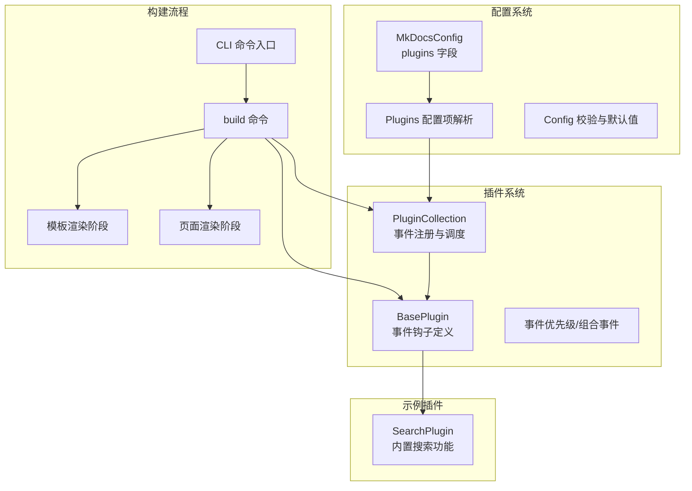
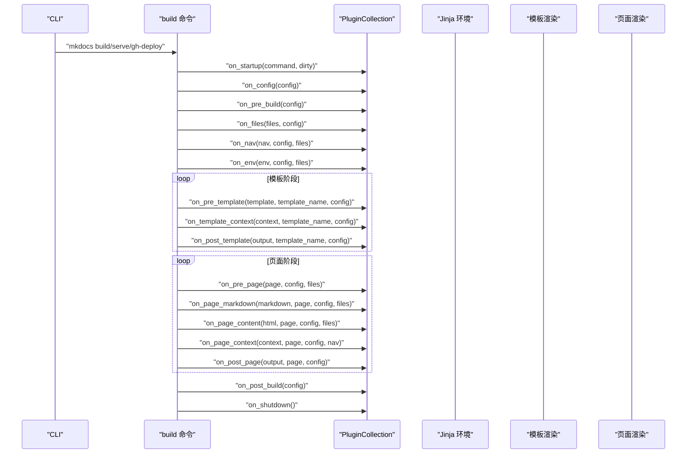
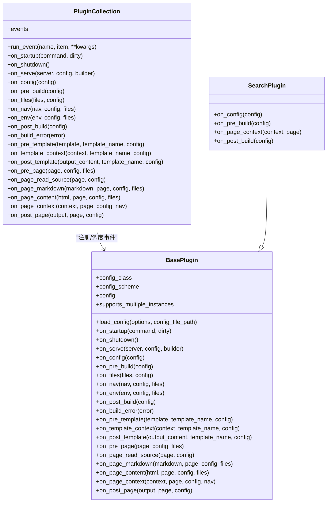
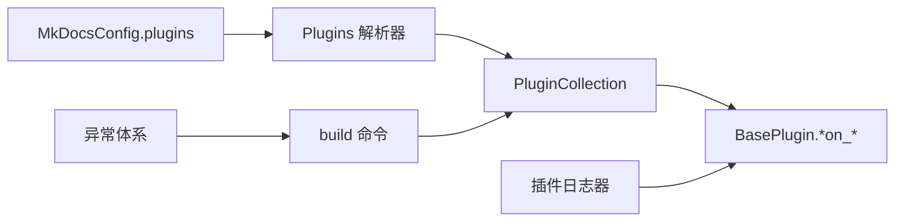

# 插件开发

<cite>
**本文引用的文件**
- [mkdocs/plugins.py](file://mkdocs/plugins.py)
- [docs/dev-guide/plugins.md](file://docs/dev-guide/plugins.md)
- [mkdocs/commands/build.py](file://mkdocs/commands/build.py)
- [mkdocs/__main__.py](file://mkdocs/__main__.py)
- [mkdocs/contrib/search/__init__.py](file://mkdocs/contrib/search/__init__.py)
- [mkdocs/config/base.py](file://mkdocs/config/base.py)
- [mkdocs/config/config_options.py](file://mkdocs/config/config_options.py)
- [mkdocs/config/defaults.py](file://mkdocs/config/defaults.py)
- [mkdocs/exceptions.py](file://mkdocs/exceptions.py)
- [mkdocs/tests/plugin_tests.py](file://mkdocs/tests/plugin_tests.py)
- [mkdocs/tests/config/config_options_tests.py](file://mkdocs/tests/config/config_options_tests.py)
- [mkdocs/tests/base.py](file://mkdocs/tests/base.py)
</cite>

## 目录
1. [简介](#简介)
2. [项目结构](#项目结构)
3. [核心组件](#核心组件)
4. [架构总览](#架构总览)
5. [组件详解](#组件详解)
6. [依赖关系分析](#依赖关系分析)
7. [性能考量](#性能考量)
8. [故障排查指南](#故障排查指南)
9. [结论](#结论)
10. [附录](#附录)

## 简介
本指南面向希望为 MkDocs 开发插件的开发者，系统讲解插件架构与事件驱动机制，覆盖事件钩子、插件生命周期、开发流程（从初始化到发布）、插件 API 使用与最佳实践、调试技巧、性能优化以及常见插件类型的实现思路（构建后处理、内容转换、自定义校验等），并提供测试与质量保障方法。

## 项目结构
围绕插件系统的关键模块与文档如下：
- 核心插件 API：定义 BasePlugin、事件集合、优先级与组合事件、插件收集器与事件调度
- 构建命令：在构建流程中触发各事件钩子
- 配置系统：插件配置项的定义、校验与实例化
- 示例插件：搜索插件作为内置插件的参考实现
- 测试：单元测试与集成测试覆盖插件行为、错误处理与优先级排序

图表来源
- [mkdocs/plugins.py](file://mkdocs/plugins.py#L58-L698)
- [mkdocs/commands/build.py](file://mkdocs/commands/build.py#L249-L365)
- [mkdocs/config/config_options.py](file://mkdocs/config/config_options.py#L1045-L1138)
- [mkdocs/config/defaults.py](file://mkdocs/config/defaults.py#L157-L160)
- [mkdocs/contrib/search/__init__.py](file://mkdocs/contrib/search/__init__.py#L62-L121)

章节来源
- [mkdocs/plugins.py](file://mkdocs/plugins.py#L58-L698)
- [docs/dev-guide/plugins.md](file://docs/dev-guide/plugins.md#L1-L567)
- [mkdocs/commands/build.py](file://mkdocs/commands/build.py#L249-L365)
- [mkdocs/config/config_options.py](file://mkdocs/config/config_options.py#L1045-L1138)
- [mkdocs/config/defaults.py](file://mkdocs/config/defaults.py#L157-L160)
- [mkdocs/contrib/search/__init__.py](file://mkdocs/contrib/search/__init__.py#L62-L121)

## 核心组件
- BasePlugin：所有插件的基类，定义事件钩子签名与配置加载接口
- PluginCollection：插件集合，负责事件注册、优先级排序与事件调度
- 事件优先级与组合事件：支持同一事件多处理器与优先级控制
- 配置系统：通过 Config/ConfigOption 定义插件配置模式，支持类型安全与嵌套结构
- 构建命令：在构建生命周期中调用相应事件钩子

章节来源
- [mkdocs/plugins.py](file://mkdocs/plugins.py#L58-L698)
- [mkdocs/config/base.py](file://mkdocs/config/base.py#L123-L243)
- [mkdocs/config/config_options.py](file://mkdocs/config/config_options.py#L52-L122)
- [mkdocs/commands/build.py](file://mkdocs/commands/build.py#L249-L365)

## 架构总览
下图展示了插件在构建过程中的生命周期与事件触发顺序，包括全局事件、模板事件与页面事件的分层关系。

图表来源
- [mkdocs/commands/build.py](file://mkdocs/commands/build.py#L249-L365)
- [mkdocs/plugins.py](file://mkdocs/plugins.py#L575-L646)
- [mkdocs/__main__.py](file://mkdocs/__main__.py#L286-L290)

章节来源
- [mkdocs/commands/build.py](file://mkdocs/commands/build.py#L249-L365)
- [mkdocs/plugins.py](file://mkdocs/plugins.py#L575-L646)
- [mkdocs/__main__.py](file://mkdocs/__main__.py#L286-L290)

## 组件详解

### 事件钩子与生命周期
- 启动/关闭事件：仅在一次命令执行周期内触发，用于跨构建的资源管理
- 全局事件：对站点整体生效，如配置修改、文件集合、导航与模板环境
- 模板事件：针对每个非页面模板的上下文与输出进行处理
- 页面事件：针对每篇 Markdown 页面的源码、渲染 HTML、上下文与最终输出进行处理
- 错误事件：捕获构建过程中抛出的异常，便于清理与统一提示

章节来源
- [docs/dev-guide/plugins.md](file://docs/dev-guide/plugins.md#L270-L425)
- [mkdocs/plugins.py](file://mkdocs/plugins.py#L100-L132)
- [mkdocs/plugins.py](file://mkdocs/plugins.py#L156-L306)
- [mkdocs/plugins.py](file://mkdocs/plugins.py#L310-L416)
- [mkdocs/plugins.py](file://mkdocs/plugins.py#L254-L306)
- [mkdocs/plugins.py](file://mkdocs/plugins.py#L240-L251)

### 事件优先级与组合事件
- 通过装饰器设置事件优先级，数值越大越早执行；默认优先级为 0
- 对于同一事件需要多个处理器的场景，可使用组合事件将多个子处理器合并为一个事件名

章节来源
- [docs/dev-guide/plugins.md](file://docs/dev-guide/plugins.md#L426-L441)
- [mkdocs/plugins.py](file://mkdocs/plugins.py#L426-L457)
- [mkdocs/plugins.py](file://mkdocs/plugins.py#L460-L491)

### 插件配置与类型安全
- 支持两类配置定义方式：旧式元组 schema 与新式类式 Config
- 类式配置提供属性访问与类型推断，推荐仅在目标版本为 1.4+ 时采用
- 支持嵌套子配置、列表项约束、可选字段与默认值

章节来源
- [docs/dev-guide/plugins.md](file://docs/dev-guide/plugins.md#L91-L168)
- [mkdocs/config/base.py](file://mkdocs/config/base.py#L123-L243)
- [mkdocs/config/config_options.py](file://mkdocs/config/config_options.py#L52-L122)

### 插件集合与事件调度
- 插件被注册到集合后，会自动扫描并注册其 on_* 事件方法
- 调度时按优先级降序执行，未返回值则保留原对象
- 对于 page_read_source 等互斥事件，若多个插件同时注册会发出警告

章节来源
- [mkdocs/plugins.py](file://mkdocs/plugins.py#L493-L647)
- [mkdocs/plugins.py](file://mkdocs/plugins.py#L509-L573)
- [mkdocs/tests/plugin_tests.py](file://mkdocs/tests/plugin_tests.py#L105-L203)

### 构建命令中的事件触发
- 在构建开始与结束、文件收集、导航生成、模板渲染、页面渲染等关键节点调用对应事件
- 错误发生时触发构建错误事件，以便插件做清理或记录

章节来源
- [mkdocs/commands/build.py](file://mkdocs/commands/build.py#L249-L365)

### 示例：搜索插件
- 展示了如何在配置阶段添加模板与脚本、在页面上下文中收集索引条目、在构建完成后生成搜索索引与语言资源

章节来源
- [mkdocs/contrib/search/__init__.py](file://mkdocs/contrib/search/__init__.py#L62-L121)

### 错误处理与日志
- 使用专用异常类型区分不同错误级别
- 推荐使用插件日志器以获得一致的格式与级别控制

章节来源
- [mkdocs/exceptions.py](file://mkdocs/exceptions.py#L6-L42)
- [docs/dev-guide/plugins.md](file://docs/dev-guide/plugins.md#L442-L514)

### 类图：插件与集合

图表来源
- [mkdocs/plugins.py](file://mkdocs/plugins.py#L58-L698)
- [mkdocs/contrib/search/__init__.py](file://mkdocs/contrib/search/__init__.py#L62-L121)

## 依赖关系分析
- 配置系统通过 Plugins 配置项解析用户配置，实例化插件并缓存支持持久化的插件对象
- 构建命令在关键阶段调用 PluginCollection 的事件方法，形成“事件驱动”的扩展点
- 异常体系与日志工具贯穿插件开发与运行期

图表来源
- [mkdocs/config/config_options.py](file://mkdocs/config/config_options.py#L1045-L1138)
- [mkdocs/plugins.py](file://mkdocs/plugins.py#L493-L647)
- [mkdocs/commands/build.py](file://mkdocs/commands/build.py#L249-L365)
- [mkdocs/exceptions.py](file://mkdocs/exceptions.py#L6-L42)

章节来源
- [mkdocs/config/config_options.py](file://mkdocs/config/config_options.py#L1045-L1138)
- [mkdocs/plugins.py](file://mkdocs/plugins.py#L493-L647)
- [mkdocs/commands/build.py](file://mkdocs/commands/build.py#L249-L365)
- [mkdocs/exceptions.py](file://mkdocs/exceptions.py#L6-L42)

## 性能考量
- 事件优先级与组合事件：合理设置优先级避免重复处理，必要时拆分为多个处理器并通过组合事件聚合
- 仅在必要时读取与解析文件：利用构建阶段的“脏”模式与增量更新减少重复工作
- 控制日志量：在调试模式下才进行昂贵计算，避免在生产路径上产生大量日志
- 模板与页面事件：尽量在合适阶段处理，避免在模板渲染前进行重计算

[本节为通用指导，无需列出章节来源]

## 故障排查指南
- 日志与级别：使用插件日志器并在调试模式下观察详细输出
- 错误类型：区分配置错误、构建错误与插件错误，按需抛出并配合 on_build_error 清理
- 多插件冲突：对于互斥事件（如 page_read_source）多个插件同时注册会发出警告，应避免
- 单元测试：通过测试用例验证事件顺序、优先级与错误传播

章节来源
- [docs/dev-guide/plugins.md](file://docs/dev-guide/plugins.md#L442-L514)
- [mkdocs/exceptions.py](file://mkdocs/exceptions.py#L6-L42)
- [mkdocs/tests/plugin_tests.py](file://mkdocs/tests/plugin_tests.py#L162-L202)
- [mkdocs/tests/plugin_tests.py](file://mkdocs/tests/plugin_tests.py#L267-L329)

## 结论
MkDocs 的插件系统以事件驱动为核心，通过清晰的生命周期与灵活的优先级机制，使第三方扩展能够无缝融入构建流程。遵循本文的开发流程、API 使用规范与最佳实践，可高效实现从内容转换到构建后处理的各类插件，并确保稳定性与可维护性。

[本节为总结性内容，无需列出章节来源]

## 附录

### 开发流程（从初始化到发布）
- 初始化项目与包结构，声明入口点
- 编写插件类，定义配置 schema 与事件钩子
- 在配置文件启用插件并传入参数
- 运行构建命令验证功能与日志输出
- 编写单元测试与集成测试
- 打包发布至 PyPI 并加入目录

章节来源
- [docs/dev-guide/plugins.md](file://docs/dev-guide/plugins.md#L515-L567)

### 常见插件类型与实现要点
- 构建后处理：在 post_build 或 post_template 中生成额外资源或进行校验
- 内容转换：在 page_markdown 或 page_content 中修改 Markdown 文本或 HTML
- 自定义校验：在页面渲染前后进行链接、锚点或元数据校验
- 主题与模板增强：在 env 或 template_context 中扩展模板环境与上下文

章节来源
- [docs/dev-guide/plugins.md](file://docs/dev-guide/plugins.md#L247-L425)
- [mkdocs/commands/build.py](file://mkdocs/commands/build.py#L61-L88)
- [mkdocs/commands/build.py](file://mkdocs/commands/build.py#L147-L247)

### 调试技巧
- 使用调试模式查看详细日志
- 将昂贵逻辑置于条件日志块中，仅在需要时执行
- 利用测试夹具快速搭建最小化配置与文档树

章节来源
- [docs/dev-guide/plugins.md](file://docs/dev-guide/plugins.md#L487-L514)
- [mkdocs/tests/base.py](file://mkdocs/tests/base.py#L26-L41)

### 性能优化建议
- 合理划分事件处理职责，避免在高频事件中进行重 IO
- 使用增量构建与“脏”模式减少重复工作
- 控制模板渲染阶段的处理范围，避免不必要的上下文修改

[本节为通用指导，无需列出章节来源]

### 测试与质量保证
- 单元测试：验证配置解析、事件顺序、优先级与错误传播
- 集成测试：在真实构建流程中验证插件行为
- 覆盖边界情况：空输出、无效配置、异常路径

章节来源
- [mkdocs/tests/plugin_tests.py](file://mkdocs/tests/plugin_tests.py#L105-L329)
- [mkdocs/tests/config/config_options_tests.py](file://mkdocs/tests/config/config_options_tests.py#L2196-L2263)