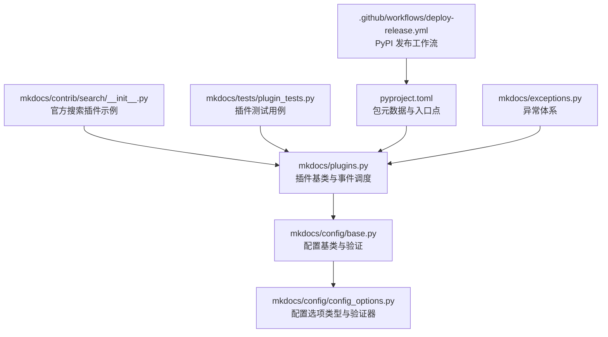
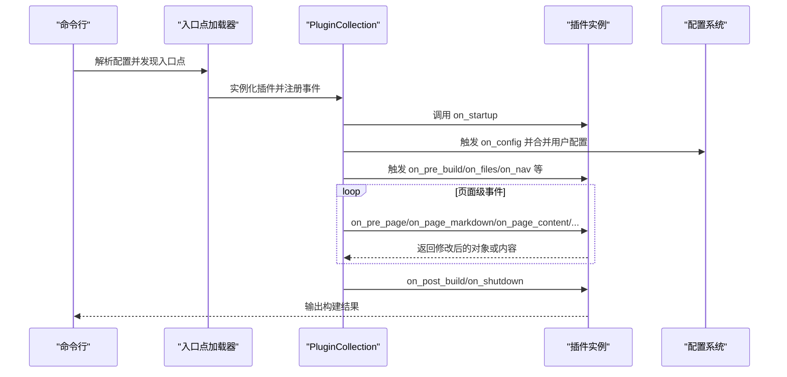
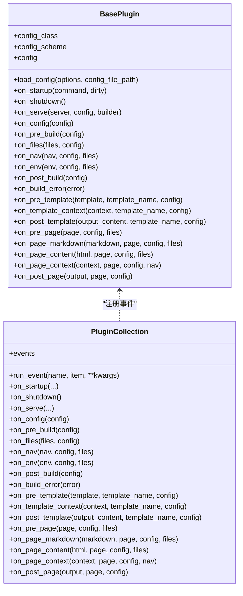
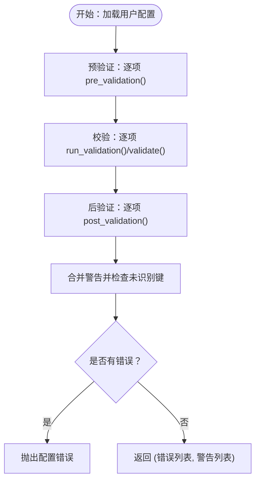
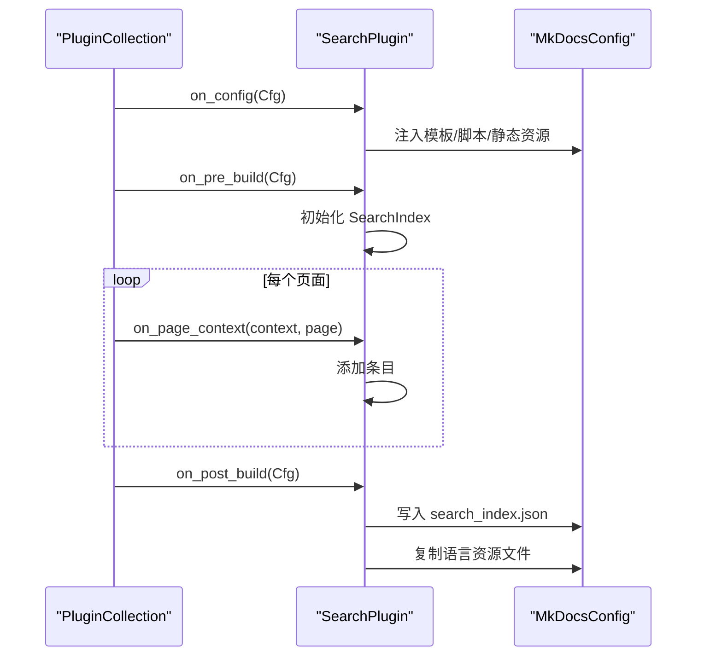
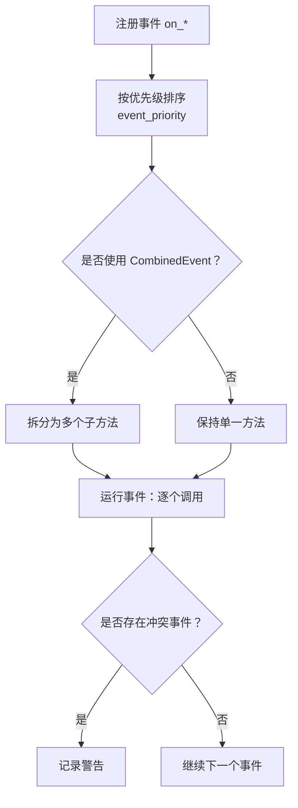
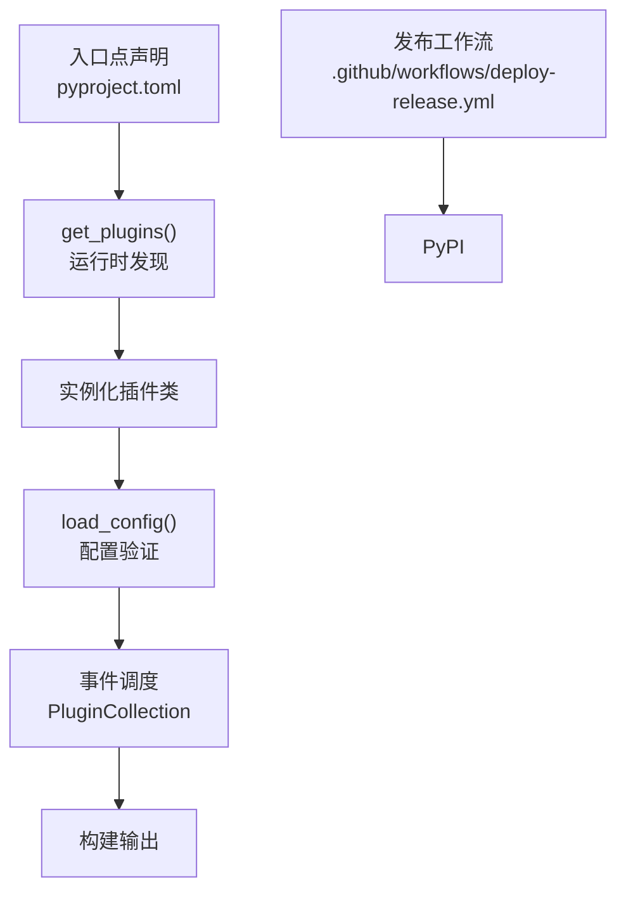

# 插件开发指南

<cite>
**本文档引用的文件**
- [mkdocs/plugins.py](file://mkdocs/plugins.py)
- [docs/dev-guide/plugins.md](file://docs/dev-guide/plugins.md)
- [mkdocs/config/base.py](file://mkdocs/config/base.py)
- [mkdocs/config/config_options.py](file://mkdocs/config/config_options.py)
- [mkdocs/contrib/search/__init__.py](file://mkdocs/contrib/search/__init__.py)
- [mkdocs/tests/plugin_tests.py](file://mkdocs/tests/plugin_tests.py)
- [pyproject.toml](file://pyproject.toml)
- [.github/workflows/deploy-release.yml](file://.github/workflows/deploy-release.yml)
- [mkdocs/exceptions.py](file://mkdocs/exceptions.py)
</cite>

## 目录
1. [简介](#简介)
2. [项目结构](#项目结构)
3. [核心组件](#核心组件)
4. [架构总览](#架构总览)
5. [详细组件分析](#详细组件分析)
6. [依赖关系分析](#依赖关系分析)
7. [性能考虑](#性能考虑)
8. [故障排除指南](#故障排除指南)
9. [结论](#结论)
10. [附录](#附录)

## 简介
本指南面向希望为 MkDocs 开发插件的开发者，提供从零开始的完整实践路径：项目初始化、配置系统与验证、事件驱动的插件行为实现、以及打包、分发与发布流程。文档基于 MkDocs 源码中的插件 API、配置系统与官方示例插件进行深入解析，并通过图示帮助理解插件生命周期与事件流。

## 项目结构
MkDocs 的插件系统由以下关键模块组成：
- 插件 API 与事件调度：位于 mkdocs/plugins.py
- 配置系统与验证：位于 mkdocs/config/base.py 与 mkdocs/config/config_options.py
- 官方搜索插件示例：位于 mkdocs/contrib/search/__init__.py
- 插件测试用例：位于 mkdocs/tests/plugin_tests.py
- 发布与打包配置：位于 pyproject.toml 与 .github/workflows/deploy-release.yml
- 异常体系：位于 mkdocs/exceptions.py

图表来源
- [mkdocs/plugins.py](file://mkdocs/plugins.py#L58-L698)
- [mkdocs/config/base.py](file://mkdocs/config/base.py#L123-L392)
- [mkdocs/config/config_options.py](file://mkdocs/config/config_options.py#L52-L800)
- [mkdocs/contrib/search/__init__.py](file://mkdocs/contrib/search/__init__.py#L54-L121)
- [mkdocs/tests/plugin_tests.py](file://mkdocs/tests/plugin_tests.py#L27-L329)
- [pyproject.toml](file://pyproject.toml#L86-L88)
- [.github/workflows/deploy-release.yml](file://.github/workflows/deploy-release.yml#L1-L22)
- [mkdocs/exceptions.py](file://mkdocs/exceptions.py#L6-L42)

章节来源
- [mkdocs/plugins.py](file://mkdocs/plugins.py#L1-L698)
- [docs/dev-guide/plugins.md](file://docs/dev-guide/plugins.md#L57-L567)

## 核心组件
- BasePlugin：所有插件必须继承的基类，定义了事件钩子与配置加载机制。
- PluginCollection：插件集合，负责注册与按序执行事件。
- Config 与 ConfigOptions：类型安全的配置定义与验证框架。
- SearchPlugin：官方插件示例，展示配置类、事件处理与资源集成。

章节来源
- [mkdocs/plugins.py](file://mkdocs/plugins.py#L58-L698)
- [mkdocs/config/base.py](file://mkdocs/config/base.py#L123-L392)
- [mkdocs/config/config_options.py](file://mkdocs/config/config_options.py#L52-L800)
- [mkdocs/contrib/search/__init__.py](file://mkdocs/contrib/search/__init__.py#L54-L121)

## 架构总览
MkDocs 在启动时通过入口点发现插件，实例化后调用 load_config 进行配置验证；随后在构建生命周期中按顺序触发各类事件，插件通过实现相应的 on_* 方法参与内容转换、文件处理与模板渲染。

图表来源
- [mkdocs/plugins.py](file://mkdocs/plugins.py#L40-L53)
- [mkdocs/config/config_options.py](file://mkdocs/config/config_options.py#L1059-L1166)
- [docs/dev-guide/plugins.md](file://docs/dev-guide/plugins.md#L247-L425)

## 详细组件分析

### 插件基类与事件系统（BasePlugin）
- 事件钩子：涵盖一次性事件（on_startup/on_shutdown/on_serve）、全局事件（on_config/on_pre_build/on_files/on_nav/on_env/on_post_build/on_build_error）、模板事件（on_pre_template/on_template_context/on_post_template）与页面事件（on_pre_page/on_page_markdown/on_page_content/on_page_context/on_post_page）。
- 配置加载：load_config 接收用户配置字典，填充到 config_class 或 LegacyConfig，并返回错误与警告列表。
- 事件优先级：支持 event_priority 装饰器与 CombinedEvent 组合多个处理器，确保多插件协作时的可控顺序。

图表来源
- [mkdocs/plugins.py](file://mkdocs/plugins.py#L58-L698)

章节来源
- [mkdocs/plugins.py](file://mkdocs/plugins.py#L58-L698)
- [docs/dev-guide/plugins.md](file://docs/dev-guide/plugins.md#L247-L425)

### 配置系统与验证（Config 与 ConfigOptions）
- 类型安全配置：通过定义 Config 子类并在其中声明字段，实现属性访问与默认值设置。
- 验证器：Type、Choice、Optional、ListOfItems、DictOfItems、SubConfig 等，覆盖常见校验场景。
- 验证流程：预验证（pre_validation）→ 校验（validate）→ 后验证（post_validation），统一收集错误与警告。

图表来源
- [mkdocs/config/base.py](file://mkdocs/config/base.py#L181-L243)
- [mkdocs/config/config_options.py](file://mkdocs/config/config_options.py#L52-L800)

章节来源
- [mkdocs/config/base.py](file://mkdocs/config/base.py#L123-L392)
- [mkdocs/config/config_options.py](file://mkdocs/config/config_options.py#L52-L800)
- [docs/dev-guide/plugins.md](file://docs/dev-guide/plugins.md#L71-L246)

### 官方插件示例：搜索插件（SearchPlugin）
- 配置类：_PluginConfig 定义语言、分词器、索引策略等选项。
- 事件处理：在 on_config 中注入模板与脚本，在 on_pre_build 创建索引，在 on_page_context 收集页面条目，在 on_post_build 写入 JSON 与复制语言资源。

图表来源
- [mkdocs/contrib/search/__init__.py](file://mkdocs/contrib/search/__init__.py#L54-L121)

章节来源
- [mkdocs/contrib/search/__init__.py](file://mkdocs/contrib/search/__init__.py#L54-L121)
- [docs/dev-guide/plugins.md](file://docs/dev-guide/plugins.md#L57-L168)

### 插件事件流程与优先级
- 事件注册：PluginCollection 在 __setitem__ 中扫描插件上的 on_* 方法并按优先级排序。
- 多处理器组合：CombinedEvent 允许同一事件注册多个处理器，event_priority 控制执行顺序。
- 冲突检测：当多个插件注册同一“唯一处理器”事件（如 on_page_read_source）时发出警告。

图表来源
- [mkdocs/plugins.py](file://mkdocs/plugins.py#L509-L573)
- [mkdocs/tests/plugin_tests.py](file://mkdocs/tests/plugin_tests.py#L105-L184)

章节来源
- [mkdocs/plugins.py](file://mkdocs/plugins.py#L426-L491)
- [mkdocs/tests/plugin_tests.py](file://mkdocs/tests/plugin_tests.py#L105-L184)

### 错误处理与日志
- 异常体系：MkDocs 提供 MkDocsException、ConfigurationError、BuildError、PluginError 等，插件应抛出 PluginError 以向用户提供友好信息。
- 构建错误事件：on_build_error 可用于清理与记录错误上下文。
- 日志规范：建议使用 get_plugin_logger 或以 mkdocs.plugins.<name> 命名空间记录日志，遵循 --verbose/--debug 行为。

章节来源
- [mkdocs/exceptions.py](file://mkdocs/exceptions.py#L6-L42)
- [docs/dev-guide/plugins.md](file://docs/dev-guide/plugins.md#L442-L514)

## 依赖关系分析
- 入口点与插件发现：通过 [pyproject.toml](file://pyproject.toml#L86-L88) 中的 entry-points."mkdocs.plugins" 声明，运行时由 get_plugins() 加载。
- 插件实例化与配置：在配置解析阶段，Plugins 验证器会加载插件类、实例化并调用 load_config。
- 发布流程：使用 GitHub Actions 自动构建并发布至 PyPI。

图表来源
- [pyproject.toml](file://pyproject.toml#L86-L88)
- [mkdocs/plugins.py](file://mkdocs/plugins.py#L40-L52)
- [mkdocs/config/config_options.py](file://mkdocs/config/config_options.py#L1059-L1166)
- [.github/workflows/deploy-release.yml](file://.github/workflows/deploy-release.yml#L1-L22)

章节来源
- [pyproject.toml](file://pyproject.toml#L86-L88)
- [mkdocs/plugins.py](file://mkdocs/plugins.py#L40-L52)
- [mkdocs/config/config_options.py](file://mkdocs/config/config_options.py#L1059-L1166)
- [.github/workflows/deploy-release.yml](file://.github/workflows/deploy-release.yml#L1-L22)

## 性能考虑
- 事件优先级：合理使用 event_priority，避免在高频事件（如 on_page_content）中执行昂贵操作。
- 缓存与惰性计算：对昂贵的预处理或外部资源读取采用缓存策略。
- 批量处理：尽量在 on_pre_build/on_files 等全局事件中完成一次性准备，减少页面级重复工作。
- 警告与错误控制：严格控制警告数量，避免在热路径上产生大量日志。

## 故障排除指南
- 配置验证失败：检查 config_scheme 定义与输入类型，关注返回的错误与警告列表。
- 事件冲突：当多个插件注册同一“唯一处理器”事件时会记录警告，需调整插件设计或优先级。
- 构建中断：插件应抛出 PluginError 以提供清晰的用户提示；对于未捕获异常，系统会在 on_build_error 中记录上下文。
- 日志调试：使用 get_plugin_logger 获取带前缀的日志器，结合 --verbose/--debug 查看详细输出。

章节来源
- [mkdocs/tests/plugin_tests.py](file://mkdocs/tests/plugin_tests.py#L266-L329)
- [docs/dev-guide/plugins.md](file://docs/dev-guide/plugins.md#L442-L514)

## 结论
通过本指南，您可以在 MkDocs 中实现类型安全的配置、灵活的事件驱动插件，并以标准流程完成打包与发布。建议参考官方搜索插件示例，结合测试用例验证插件行为，确保在不同版本与场景下的稳定性。

## 附录

### 从零开始：插件开发步骤清单
- 项目初始化：创建 Python 包，定义插件类继承 BasePlugin 或 BasePlugin[YourConfig]。
- 配置定义：在 Config 子类中声明字段，使用 Type/Choice/Optional/ListOfItems/SubConfig 等验证器。
- 事件实现：在合适的 on_* 钩子中实现内容转换、文件处理或模板增强。
- 配置加载：在 on_config 中合并用户配置，必要时注入模板或静态资源。
- 测试：编写单元测试，覆盖配置验证、事件执行与边界情况。
- 打包与发布：在 pyproject.toml 中声明入口点，使用 GitHub Actions 自动发布至 PyPI。

章节来源
- [docs/dev-guide/plugins.md](file://docs/dev-guide/plugins.md#L57-L567)
- [pyproject.toml](file://pyproject.toml#L86-L88)
- [.github/workflows/deploy-release.yml](file://.github/workflows/deploy-release.yml#L1-L22)