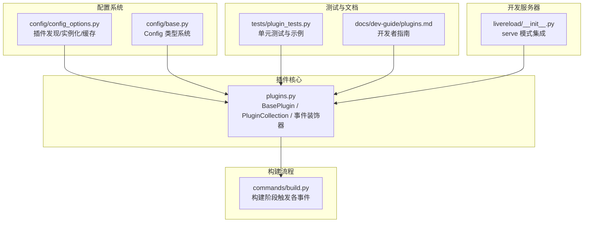
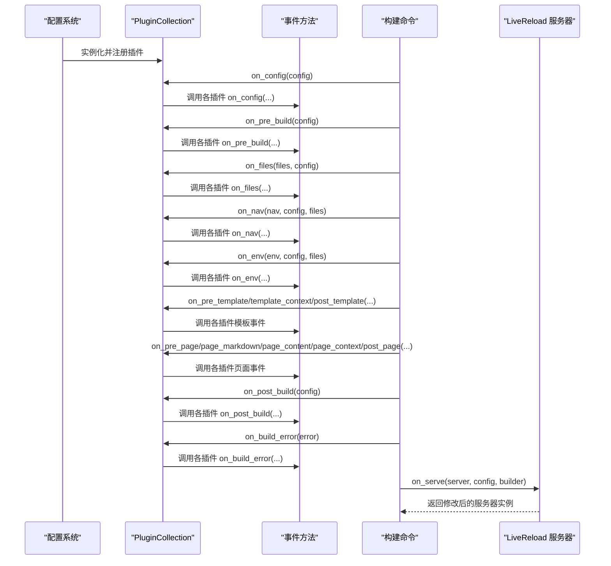
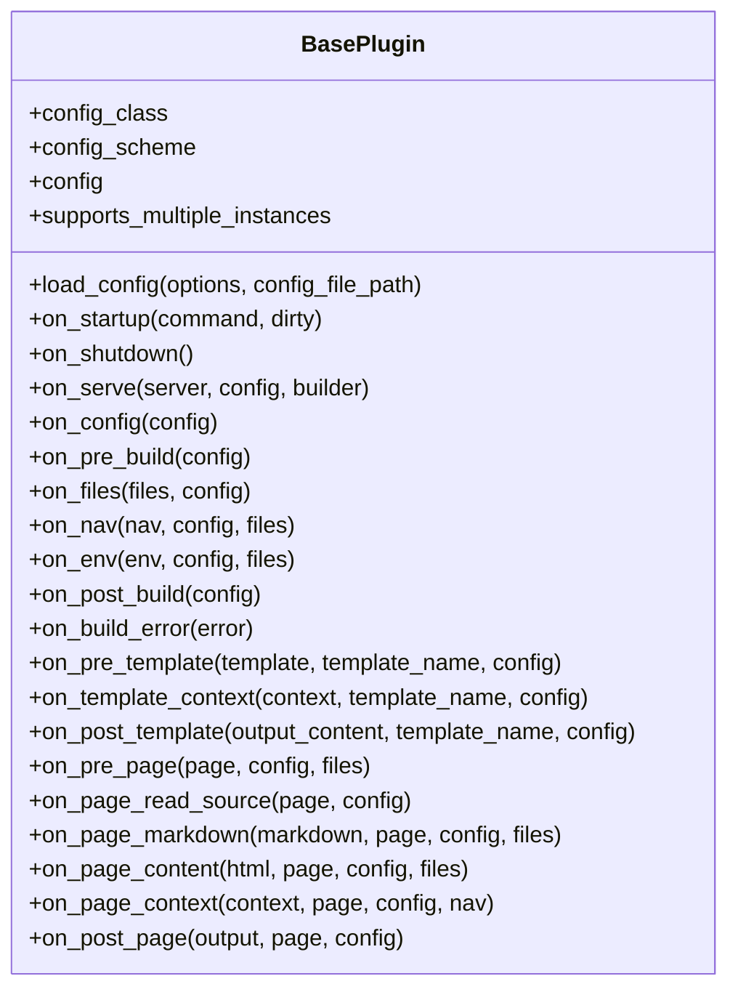
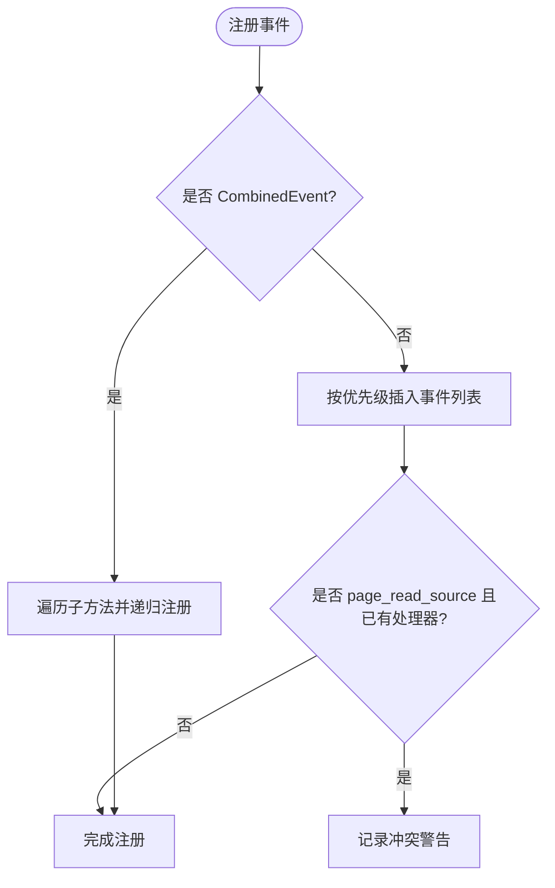
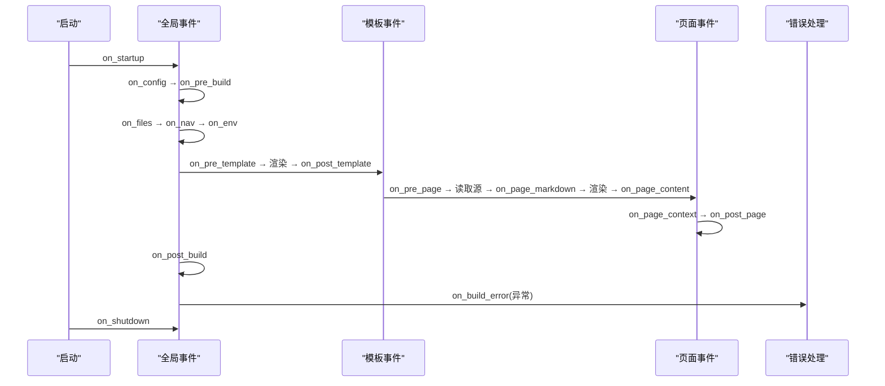

# 插件架构

<cite>
**本文引用的文件列表**
- [mkdocs/plugins.py](file://mkdocs/plugins.py)
- [mkdocs/tests/plugin_tests.py](file://mkdocs/tests/plugin_tests.py)
- [docs/dev-guide/plugins.md](file://docs/dev-guide/plugins.md)
- [mkdocs/commands/build.py](file://mkdocs/commands/build.py)
- [mkdocs/config/base.py](file://mkdocs/config/base.py)
- [mkdocs/config/config_options.py](file://mkdocs/config/config_options.py)
- [mkdocs/livereload/__init__.py](file://mkdocs/livereload/__init__.py)
</cite>

## 目录
1. [简介](#简介)
2. [项目结构](#项目结构)
3. [核心组件](#核心组件)
4. [架构总览](#架构总览)
5. [详细组件分析](#详细组件分析)
6. [依赖关系分析](#依赖关系分析)
7. [性能考量](#性能考量)
8. [故障排查指南](#故障排查指南)
9. [结论](#结论)
10. [附录：最佳实践与示例路径](#附录最佳实践与示例路径)

## 简介
本文件系统性阐述 MkDocs 插件架构，重点围绕以下主题：
- BasePlugin 基类的设计原理与继承机制
- PluginCollection 的实现细节，包括事件注册、优先级管理与事件调度
- 事件驱动架构的工作原理（事件生命周期与插件间交互）
- 插件开发最佳实践与常见设计模式
- 具体示例路径，展示如何正确继承与扩展插件基类

## 项目结构
围绕插件系统的关键文件与职责如下：
- 插件核心定义与调度：mkdocs/plugins.py
- 构建流程中事件触发点：mkdocs/commands/build.py
- 配置系统与插件实例化：mkdocs/config/config_options.py、mkdocs/config/base.py
- 测试用例与示例：mkdocs/tests/plugin_tests.py
- 开发者文档：docs/dev-guide/plugins.md
- 开发服务器集成：mkdocs/livereload/__init__.py

图表来源
- [mkdocs/plugins.py](file://mkdocs/plugins.py#L58-L698)
- [mkdocs/commands/build.py](file://mkdocs/commands/build.py#L249-L370)
- [mkdocs/config/config_options.py](file://mkdocs/config/config_options.py#L1119-L1138)
- [mkdocs/config/base.py](file://mkdocs/config/base.py#L123-L200)
- [mkdocs/tests/plugin_tests.py](file://mkdocs/tests/plugin_tests.py#L1-L329)
- [docs/dev-guide/plugins.md](file://docs/dev-guide/plugins.md#L1-L567)
- [mkdocs/livereload/__init__.py](file://mkdocs/livereload/__init__.py#L129-L156)

章节来源
- [mkdocs/plugins.py](file://mkdocs/plugins.py#L1-L698)
- [mkdocs/commands/build.py](file://mkdocs/commands/build.py#L1-L370)
- [mkdocs/config/config_options.py](file://mkdocs/config/config_options.py#L1119-L1138)
- [mkdocs/config/base.py](file://mkdocs/config/base.py#L1-L200)
- [mkdocs/tests/plugin_tests.py](file://mkdocs/tests/plugin_tests.py#L1-L329)
- [docs/dev-guide/plugins.md](file://docs/dev-guide/plugins.md#L1-L567)
- [mkdocs/livereload/__init__.py](file://mkdocs/livereload/__init__.py#L129-L156)

## 核心组件
- BasePlugin：所有插件的基类，定义事件钩子方法与配置加载能力；支持通过泛型指定强类型配置类。
- PluginCollection：插件集合，负责事件注册、优先级排序与事件调度；维护每个事件对应的方法列表。
- 事件装饰器与组合器：event_priority 为事件方法设置优先级；CombinedEvent 将多个子方法合并为一个事件名下的处理链。
- 构建流程中的事件触发：在构建主流程中按阶段调用 PluginCollection 的事件方法，形成完整的事件生命周期。

章节来源
- [mkdocs/plugins.py](file://mkdocs/plugins.py#L58-L698)
- [mkdocs/commands/build.py](file://mkdocs/commands/build.py#L249-L370)

## 架构总览
下图展示了从配置加载到构建完成的事件驱动流程，以及插件集合在其中的角色。

图表来源
- [mkdocs/commands/build.py](file://mkdocs/commands/build.py#L249-L370)
- [mkdocs/plugins.py](file://mkdocs/plugins.py#L575-L647)
- [mkdocs/livereload/__init__.py](file://mkdocs/livereload/__init__.py#L129-L156)

## 详细组件分析

### BasePlugin 基类设计与继承机制
- 泛型配置：通过 BasePlugin[SomeConfig] 形式直接绑定配置类，避免在子类中重复声明 config_class。
- 配置加载：load_config 接收用户配置字典，基于 config_class 或 LegacyConfig 进行验证与填充默认值。
- 事件钩子：定义了从启动到页面渲染的完整事件集，返回值遵循“若返回 None 则保持原对象”的约定。
- 生命周期钩子：on_startup/on_shutdown 在 serve 场景下用于跨构建复用插件实例；on_serve 仅在开发模式触发一次。

图表来源
- [mkdocs/plugins.py](file://mkdocs/plugins.py#L58-L418)

章节来源
- [mkdocs/plugins.py](file://mkdocs/plugins.py#L58-L120)
- [mkdocs/plugins.py](file://mkdocs/plugins.py#L85-L97)
- [mkdocs/plugins.py](file://mkdocs/plugins.py#L100-L153)
- [mkdocs/plugins.py](file://mkdocs/plugins.py#L156-L418)

### PluginCollection 实现：事件注册、优先级与调度
- 事件注册：当向集合添加插件时，自动扫描其 on_* 方法并注册到对应事件列表。
- 优先级管理：使用 event_priority 为方法设置优先级；注册时按优先级降序插入，相同优先级按配置顺序维持。
- 组合事件：CombinedEvent 可将多个子方法合并为同一事件名，便于在同一事件上定义多段处理逻辑。
- 调度机制：run_event 遍历事件列表，按顺序调用；若方法返回非 None，则替换传递的对象；同时记录当前插件来源以支持调试日志。
- 特殊处理：page_read_source 事件仅允许一个处理器，若检测到冲突会发出警告。

图表来源
- [mkdocs/plugins.py](file://mkdocs/plugins.py#L509-L531)

章节来源
- [mkdocs/plugins.py](file://mkdocs/plugins.py#L493-L574)
- [mkdocs/plugins.py](file://mkdocs/plugins.py#L509-L531)

### 事件装饰器与组合器
- event_priority：为事件方法设置优先级属性，影响注册时的排序。
- CombinedEvent：将多个子方法合并为一个事件名下的处理链，子方法命名不得以 on_ 开头。

章节来源
- [mkdocs/plugins.py](file://mkdocs/plugins.py#L426-L458)
- [mkdocs/plugins.py](file://mkdocs/plugins.py#L460-L491)

### 事件驱动架构与生命周期
- 启动/关闭：on_startup/on_shutdown 在每次 mkdocs 调用开始与结束时运行；serve 模式下可跨构建复用插件实例。
- 全局事件：on_config → on_pre_build → on_files → on_nav → on_env → on_post_build。
- 模板事件：on_pre_template → on_template_context → 渲染 → on_post_template。
- 页面事件：on_pre_page → 读取源 → on_page_markdown → 渲染 → on_page_content → on_page_context → on_post_page。
- 错误处理：on_build_error 在任何异常发生时被调用，用于清理或记录。

图表来源
- [mkdocs/commands/build.py](file://mkdocs/commands/build.py#L249-L370)
- [mkdocs/plugins.py](file://mkdocs/plugins.py#L575-L647)

章节来源
- [mkdocs/commands/build.py](file://mkdocs/commands/build.py#L61-L88)
- [mkdocs/commands/build.py](file://mkdocs/commands/build.py#L147-L247)
- [mkdocs/commands/build.py](file://mkdocs/commands/build.py#L249-L370)
- [mkdocs/plugins.py](file://mkdocs/plugins.py#L575-L647)

### 插件间交互与优先级策略
- 多插件同事件：按优先级降序执行；未显式设置优先级的事件默认优先级为 0。
- 相同优先级：按配置中插件出现顺序执行。
- 冲突处理：page_read_source 仅允许一个处理器，冲突时发出警告并保留后注册的处理器。
- 组合事件：通过 CombinedEvent 将多个子方法合并为同一事件名，便于在同一事件上定义多段处理逻辑。

章节来源
- [mkdocs/plugins.py](file://mkdocs/plugins.py#L518-L531)
- [mkdocs/plugins.py](file://mkdocs/plugins.py#L460-L491)
- [mkdocs/tests/plugin_tests.py](file://mkdocs/tests/plugin_tests.py#L135-L185)

### 开发服务器集成（on_serve）
- 仅在 mkdocs serve 时触发一次，用于修改 LiveReload 服务器实例（如添加监视目录）。
- 服务器实例由插件返回，最终由构建流程使用。

章节来源
- [mkdocs/plugins.py](file://mkdocs/plugins.py#L134-L152)
- [mkdocs/livereload/__init__.py](file://mkdocs/livereload/__init__.py#L129-L156)

## 依赖关系分析
- 插件发现与实例化：配置系统通过入口点发现插件类，并确保其实例化为 BasePlugin 子类；若插件声明了 on_startup/on_shutdown，则会被缓存以便 serve 场景复用。
- 配置类型系统：BasePlugin 支持两种配置方式：传统元组 schema 与类式 Config；后者提供更强的类型安全。
- 事件注册与调度：PluginCollection 在插件加入时扫描并注册事件方法，随后在构建流程中按阶段调用。

图表来源
- [mkdocs/config/config_options.py](file://mkdocs/config/config_options.py#L1119-L1138)
- [mkdocs/plugins.py](file://mkdocs/plugins.py#L58-L120)
- [mkdocs/plugins.py](file://mkdocs/plugins.py#L535-L542)

章节来源
- [mkdocs/config/config_options.py](file://mkdocs/config/config_options.py#L1119-L1138)
- [mkdocs/config/base.py](file://mkdocs/config/base.py#L123-L200)
- [mkdocs/plugins.py](file://mkdocs/plugins.py#L58-L120)
- [mkdocs/plugins.py](file://mkdocs/plugins.py#L535-L542)

## 性能考量
- 事件排序：注册时按优先级插入，复杂度 O(n)；建议合理设置优先级，避免过多子方法导致链路过长。
- 调试日志：在 DEBUG 级别下会输出事件来源插件信息，有助于定位问题但可能带来额外开销。
- 服务器集成：on_serve 仅在开发模式触发，通常成本较低；注意不要在该事件中执行耗时操作。
- 错误处理：on_build_error 用于清理资源，尽量避免在此事件中抛出异常，以免影响整体流程。

[本节为通用指导，不直接分析具体文件]

## 故障排查指南
- 事件未生效：确认插件已正确注册到 PluginCollection，且事件方法名称与签名一致。
- 优先级不生效：检查是否使用 event_priority 设置了优先级，或是否与其它插件冲突。
- page_read_source 冲突：仅允许一个处理器，避免多个插件同时注册该事件。
- 错误处理：在 on_build_error 中进行必要的清理工作，确保不会干扰后续流程。
- 日志：使用 get_plugin_logger 或标准日志记录器，确保日志级别与 --verbose/--debug 一致。

章节来源
- [mkdocs/plugins.py](file://mkdocs/plugins.py#L518-L531)
- [mkdocs/plugins.py](file://mkdocs/plugins.py#L677-L698)
- [docs/dev-guide/plugins.md](file://docs/dev-guide/plugins.md#L487-L514)

## 结论
MkDocs 插件架构以 BasePlugin 为核心，通过 PluginCollection 提供统一的事件注册、优先级管理与调度机制。构建流程在关键节点触发事件，形成清晰的生命周期。开发者可通过 event_priority 与 CombinedEvent 精细控制事件执行顺序与组合逻辑。遵循本文最佳实践，可编写出健壮、可维护的插件。

[本节为总结性内容，不直接分析具体文件]

## 附录：最佳实践与示例路径
- 正确继承与扩展
  - 使用泛型配置类：参考 [BasePlugin[SomeConfig]](file://mkdocs/plugins.py#L72-L75)
  - 定义事件方法：参考 [on_page_content 示例](file://mkdocs/tests/plugin_tests.py#L33-L45)
  - 设置优先级：参考 [event_priority 使用](file://mkdocs/plugins.py#L426-L458)
  - 组合事件：参考 [CombinedEvent 使用](file://mkdocs/plugins.py#L460-L491)
- 事件生命周期与交互
  - 全局事件顺序：参考 [构建流程中的事件调用](file://mkdocs/commands/build.py#L249-L370)
  - 模板事件顺序：参考 [模板渲染前后事件](file://mkdocs/commands/build.py#L61-L88)
  - 页面事件顺序：参考 [页面读取与渲染事件](file://mkdocs/commands/build.py#L147-L247)
- 错误处理与日志
  - 错误事件：参考 [on_build_error 触发](file://mkdocs/commands/build.py#L355-L361)
  - 日志记录：参考 [get_plugin_logger](file://mkdocs/plugins.py#L677-L698)
- 开发服务器集成
  - 仅在开发模式触发：参考 [on_serve](file://mkdocs/plugins.py#L134-L152)
  - 服务器实例修改：参考 [LiveReload 服务器集成](file://mkdocs/livereload/__init__.py#L129-L156)

章节来源
- [mkdocs/plugins.py](file://mkdocs/plugins.py#L72-L75)
- [mkdocs/tests/plugin_tests.py](file://mkdocs/tests/plugin_tests.py#L33-L45)
- [mkdocs/plugins.py](file://mkdocs/plugins.py#L426-L458)
- [mkdocs/plugins.py](file://mkdocs/plugins.py#L460-L491)
- [mkdocs/commands/build.py](file://mkdocs/commands/build.py#L249-L370)
- [mkdocs/commands/build.py](file://mkdocs/commands/build.py#L61-L88)
- [mkdocs/commands/build.py](file://mkdocs/commands/build.py#L147-L247)
- [mkdocs/plugins.py](file://mkdocs/plugins.py#L677-L698)
- [mkdocs/plugins.py](file://mkdocs/plugins.py#L134-L152)
- [mkdocs/livereload/__init__.py](file://mkdocs/livereload/__init__.py#L129-L156)