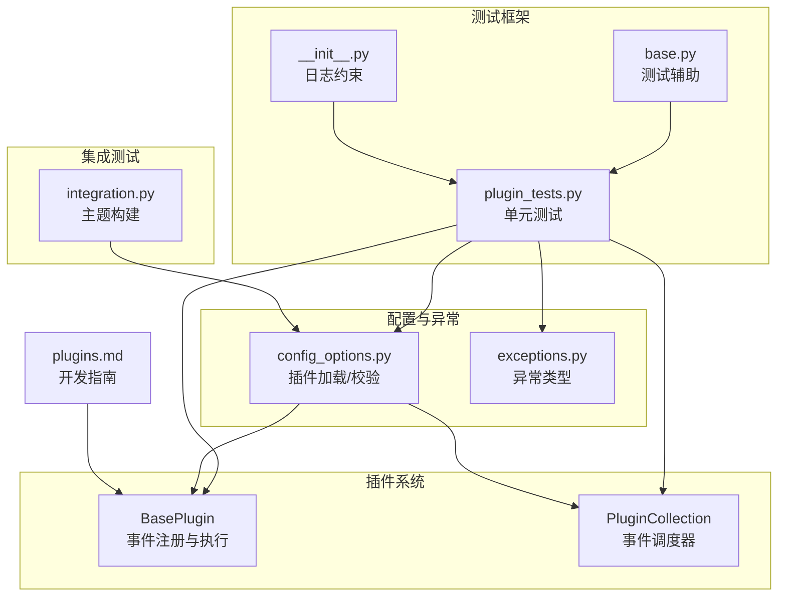
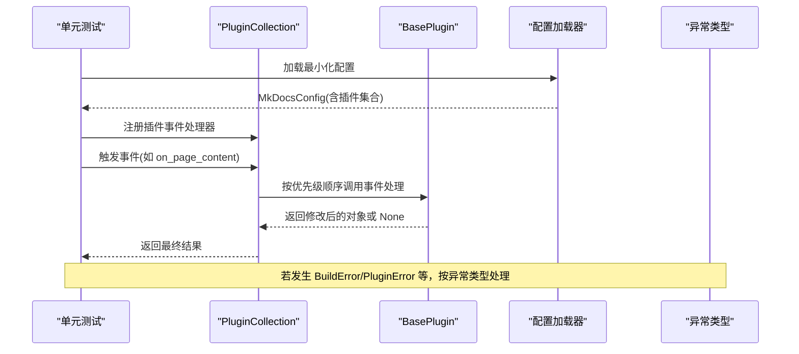
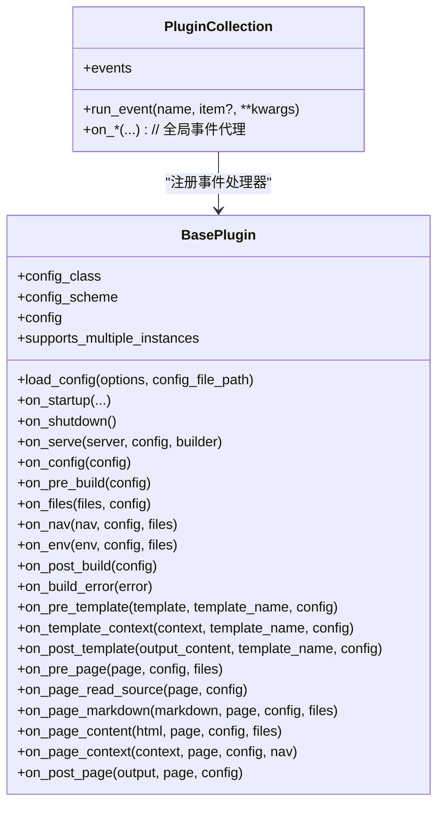
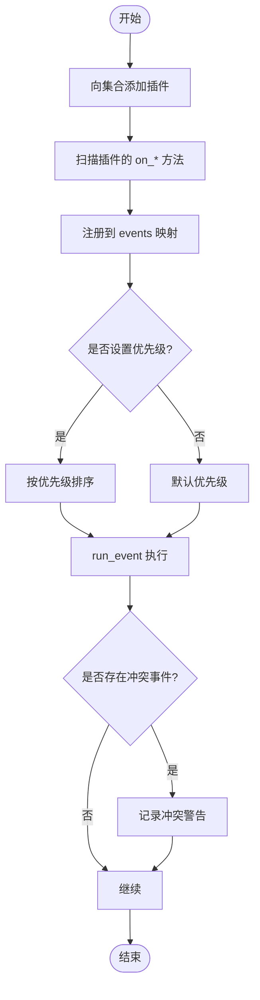
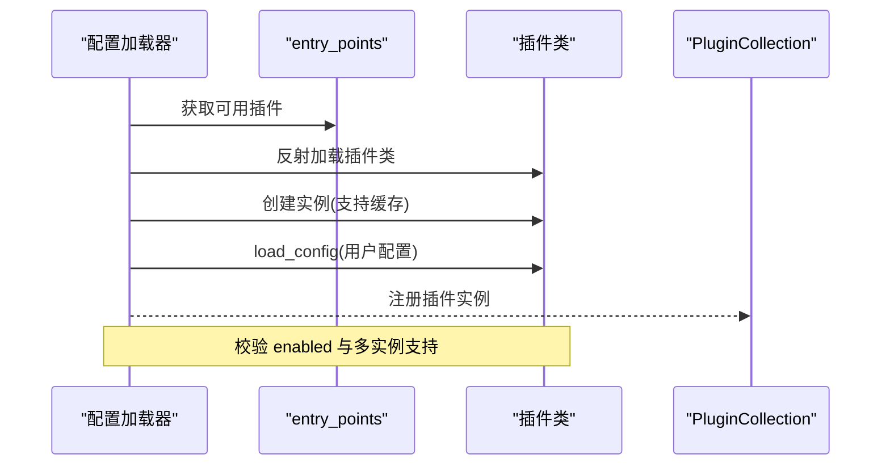
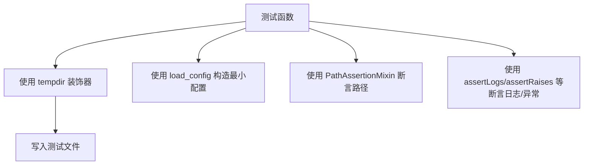
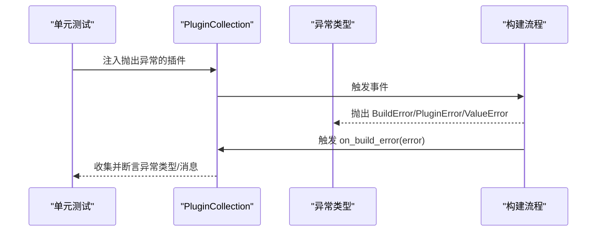
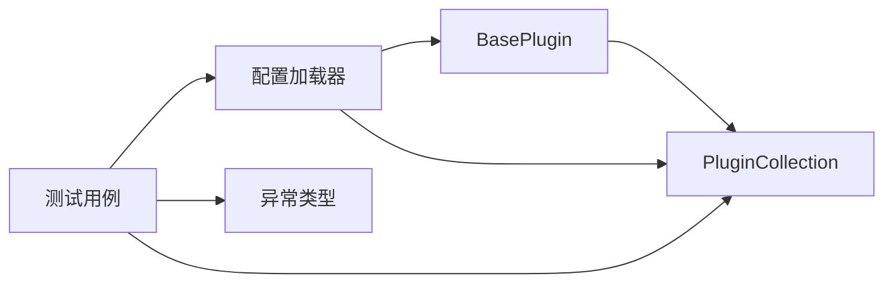

# 插件测试与调试

<cite>
**本文引用的文件**
- [mkdocs/plugins.py](file://mkdocs/plugins.py)
- [mkdocs/tests/plugin_tests.py](file://mkdocs/tests/plugin_tests.py)
- [mkdocs/tests/base.py](file://mkdocs/tests/base.py)
- [docs/dev-guide/plugins.md](file://docs/dev-guide/plugins.md)
- [mkdocs/exceptions.py](file://mkdocs/exceptions.py)
- [mkdocs/config/config_options.py](file://mkdocs/config/config_options.py)
- [mkdocs/tests/integration.py](file://mkdocs/tests/integration.py)
- [mkdocs/tests/__init__.py](file://mkdocs/tests/__init__.py)
</cite>

## 目录
1. [引言](#引言)
2. [项目结构](#项目结构)
3. [核心组件](#核心组件)
4. [架构总览](#架构总览)
5. [详细组件分析](#详细组件分析)
6. [依赖分析](#依赖分析)
7. [性能考虑](#性能考虑)
8. [故障排查指南](#故障排查指南)
9. [结论](#结论)
10. [附录：测试用例模板与调试工具](#附录测试用例模板与调试工具)

## 引言
本指南面向 MkDocs 插件开发者，系统讲解如何编写与调试插件测试，覆盖以下主题：
- 单元测试：模拟配置对象、事件环境与插件集合行为
- 调试技巧：日志记录、断点调试、错误追踪
- 使用 MkDocs 测试框架进行功能验证
- 性能测试与基准测试方法
- 常见问题诊断与解决方案
- 测试用例模板与调试工具使用示例

## 项目结构
围绕插件测试与调试，本仓库的关键目录与文件如下：
- 插件运行时与事件系统：mkdocs/plugins.py
- 插件测试用例：mkdocs/tests/plugin_tests.py
- 测试辅助工具：mkdocs/tests/base.py、mkdocs/tests/__init__.py
- 配置加载与插件实例化：mkdocs/config/config_options.py
- 集成测试（主题构建）：mkdocs/tests/integration.py
- 开发者文档（插件开发与事件）：docs/dev-guide/plugins.md
- 异常类型定义：mkdocs/exceptions.py

**图表来源**
- [mkdocs/plugins.py](file://mkdocs/plugins.py#L58-L698)
- [mkdocs/tests/plugin_tests.py](file://mkdocs/tests/plugin_tests.py#L1-L329)
- [mkdocs/tests/base.py](file://mkdocs/tests/base.py#L1-L130)
- [mkdocs/tests/__init__.py](file://mkdocs/tests/__init__.py#L1-L17)
- [mkdocs/config/config_options.py](file://mkdocs/config/config_options.py#L1100-L1166)
- [docs/dev-guide/plugins.md](file://docs/dev-guide/plugins.md#L1-L567)

**章节来源**
- [mkdocs/plugins.py](file://mkdocs/plugins.py#L1-L698)
- [mkdocs/tests/plugin_tests.py](file://mkdocs/tests/plugin_tests.py#L1-L329)
- [mkdocs/tests/base.py](file://mkdocs/tests/base.py#L1-L130)
- [docs/dev-guide/plugins.md](file://docs/dev-guide/plugins.md#L1-L567)

## 核心组件
- BasePlugin：插件基类，定义事件钩子与配置加载流程
- PluginCollection：插件集合，负责事件注册与按优先级顺序执行
- 配置加载器：从用户配置中解析插件并实例化，支持启用/禁用、多实例、警告与错误
- 测试辅助：提供最小化配置构造、临时目录装饰器、路径断言等
- 异常体系：统一的异常类型，便于在构建过程中中断并输出友好消息

**章节来源**
- [mkdocs/plugins.py](file://mkdocs/plugins.py#L58-L698)
- [mkdocs/config/config_options.py](file://mkdocs/config/config_options.py#L1100-L1166)
- [mkdocs/tests/base.py](file://mkdocs/tests/base.py#L26-L84)
- [mkdocs/exceptions.py](file://mkdocs/exceptions.py#L1-L42)

## 架构总览
下图展示了插件事件在测试与构建中的调用关系：测试通过 PluginCollection 注册与执行事件；配置加载器负责实例化插件并注入配置；异常类型用于在构建阶段中断并输出用户可读信息。

**图表来源**
- [mkdocs/tests/plugin_tests.py](file://mkdocs/tests/plugin_tests.py#L105-L260)
- [mkdocs/plugins.py](file://mkdocs/plugins.py#L493-L647)
- [mkdocs/config/config_options.py](file://mkdocs/config/config_options.py#L1100-L1166)
- [mkdocs/exceptions.py](file://mkdocs/exceptions.py#L30-L42)

## 详细组件分析

### 组件一：BasePlugin 与事件系统
- 事件钩子：涵盖启动/关闭、全局、模板、页面事件等
- 配置加载：load_config 将用户提供的字典配置转换为强类型配置对象，并返回校验错误与警告
- 日志：推荐使用命名空间日志或 get_plugin_logger 获取带前缀的日志器

**图表来源**
- [mkdocs/plugins.py](file://mkdocs/plugins.py#L58-L647)

**章节来源**
- [mkdocs/plugins.py](file://mkdocs/plugins.py#L58-L698)

### 组件二：PluginCollection 事件调度
- 事件注册：当向集合添加插件时，自动扫描其 on_* 方法并注册到对应事件列表
- 优先级与合并：支持 event_priority 与 CombinedEvent 合并多个处理器
- 多处理器冲突：对某些事件（如 page_read_source）发出冲突警告
- 错误传播：在构建错误时触发 on_build_error 并收集异常

**图表来源**
- [mkdocs/plugins.py](file://mkdocs/plugins.py#L493-L647)

**章节来源**
- [mkdocs/plugins.py](file://mkdocs/plugins.py#L493-L647)

### 组件三：配置加载与插件实例化
- 插件发现：基于 entry_points 解析可用插件
- 实例化：校验类型、缓存支持启动/关闭生命周期的插件、应用 enabled 选项、加载配置并校验
- 多实例：支持同名插件多次声明，但需插件声明支持多实例

**图表来源**
- [mkdocs/config/config_options.py](file://mkdocs/config/config_options.py#L1100-L1166)

**章节来源**
- [mkdocs/config/config_options.py](file://mkdocs/config/config_options.py#L1100-L1166)

### 组件四：测试框架与工具
- 最小化配置：load_config 提供默认 docs_dir、site_name 等，避免验证失败
- 临时目录：tempdir 装饰器在测试前后创建/销毁临时文件树
- 日志约束：tests/__init__.py 设置 logging.lastResort，禁止未预期日志
- 断言工具：PathAssertionMixin 提供路径存在性与相等性断言

**图表来源**
- [mkdocs/tests/base.py](file://mkdocs/tests/base.py#L26-L84)
- [mkdocs/tests/__init__.py](file://mkdocs/tests/__init__.py#L1-L17)

**章节来源**
- [mkdocs/tests/base.py](file://mkdocs/tests/base.py#L26-L130)
- [mkdocs/tests/__init__.py](file://mkdocs/tests/__init__.py#L1-L17)

### 组件五：构建错误与异常处理
- 异常类型：MkDocsException、Abort、ConfigurationError、BuildError、PluginError
- 构建错误事件：on_build_error 在任何异常后被触发，便于清理资源
- 测试验证：通过构建流程触发不同阶段的异常，确保 on_build_error 收集到正确的异常类型与消息

**图表来源**
- [mkdocs/tests/plugin_tests.py](file://mkdocs/tests/plugin_tests.py#L266-L329)
- [mkdocs/exceptions.py](file://mkdocs/exceptions.py#L13-L42)

**章节来源**
- [mkdocs/tests/plugin_tests.py](file://mkdocs/tests/plugin_tests.py#L266-L329)
- [mkdocs/exceptions.py](file://mkdocs/exceptions.py#L1-L42)

## 依赖分析
- 插件事件与集合：BasePlugin 定义事件，PluginCollection 注册与调度
- 配置与插件：配置加载器负责插件发现、实例化、启用/禁用与配置校验
- 测试耦合：测试用例依赖 PluginCollection 与最小化配置，同时利用日志与异常断言

**图表来源**
- [mkdocs/plugins.py](file://mkdocs/plugins.py#L58-L647)
- [mkdocs/config/config_options.py](file://mkdocs/config/config_options.py#L1100-L1166)
- [mkdocs/tests/plugin_tests.py](file://mkdocs/tests/plugin_tests.py#L105-L260)
- [mkdocs/exceptions.py](file://mkdocs/exceptions.py#L1-L42)

**章节来源**
- [mkdocs/plugins.py](file://mkdocs/plugins.py#L58-L698)
- [mkdocs/config/config_options.py](file://mkdocs/config/config_options.py#L1100-L1166)
- [mkdocs/tests/plugin_tests.py](file://mkdocs/tests/plugin_tests.py#L105-L260)
- [mkdocs/exceptions.py](file://mkdocs/exceptions.py#L1-L42)

## 性能考虑
- 事件执行顺序与优先级：合理设置 event_priority，避免过多处理器导致链路变长
- 缓存策略：支持 on_startup/on_shutdown 生命周期的插件会被缓存，减少重复初始化开销
- 多实例限制：非声明支持多实例的插件多次声明会触发警告，应避免不必要的重复
- I/O 与临时文件：测试中使用 tempdir 装饰器集中管理临时文件，减少磁盘抖动

[本节为通用指导，不直接分析具体文件]

## 故障排查指南
- 配置校验失败：检查 config_scheme 与 load_config 返回的错误/警告
- 事件冲突：对 page_read_source 等事件，多个插件注册会触发冲突警告
- 构建异常：区分 BuildError、PluginError 与普通异常，确保在 on_build_error 中清理资源
- 日志级别：使用 --verbose/--debug 控制日志输出，必要时在插件中按需输出 debug 信息
- 集成测试：通过 integration.py 对内置主题进行端到端构建验证

**章节来源**
- [mkdocs/tests/plugin_tests.py](file://mkdocs/tests/plugin_tests.py#L135-L203)
- [mkdocs/exceptions.py](file://mkdocs/exceptions.py#L30-L42)
- [mkdocs/tests/integration.py](file://mkdocs/tests/integration.py#L1-L76)

## 结论
通过结合 BasePlugin 的事件模型、PluginCollection 的调度机制、配置加载器的实例化流程以及完善的测试工具链，可以系统地完成插件的单元测试、调试与集成验证。建议在开发中遵循：
- 明确事件职责与优先级
- 使用最小化配置与临时目录进行隔离测试
- 正确处理异常并在 on_build_error 中清理
- 利用日志与断言工具定位问题

[本节为总结性内容，不直接分析具体文件]

## 附录：测试用例模板与调试工具

### 测试用例模板
- 配置加载与校验
  - 使用 load_config 构造最小配置
  - 使用 DummyPlugin 子类与自定义 Config 类型
  - 断言 load_config 返回的错误/警告
  - 参考路径：[mkdocs/tests/plugin_tests.py](file://mkdocs/tests/plugin_tests.py#L52-L103)

- 事件注册与执行
  - 构造 PluginCollection，添加插件
  - 断言 events 映射与处理器顺序
  - 使用 run_event 或 on_* 代理方法验证返回值
  - 参考路径：[mkdocs/tests/plugin_tests.py](file://mkdocs/tests/plugin_tests.py#L105-L260)

- 优先级与合并事件
  - 使用 event_priority 与 CombinedEvent
  - 断言处理器顺序与冲突警告
  - 参考路径：[mkdocs/tests/plugin_tests.py](file://mkdocs/tests/plugin_tests.py#L135-L185)

- 构建错误与 on_build_error
  - 在插件事件中抛出 BuildError/PluginError/ValueError
  - 断言 on_build_error 收集到的异常类型与消息
  - 参考路径：[mkdocs/tests/plugin_tests.py](file://mkdocs/tests/plugin_tests.py#L266-L329)

- 临时目录与路径断言
  - 使用 @tempdir 装饰器准备测试文件
  - 使用 PathAssertionMixin 断言路径存在/不存在/为文件/为目录
  - 参考路径：[mkdocs/tests/base.py](file://mkdocs/tests/base.py#L44-L130)

### 调试工具与技巧
- 日志记录
  - 推荐使用命名空间日志或 get_plugin_logger 输出带前缀的日志
  - 使用 --verbose/--debug 控制日志级别
  - 参考路径：[docs/dev-guide/plugins.md](file://docs/dev-guide/plugins.md#L487-L514)，[mkdocs/plugins.py](file://mkdocs/plugins.py#L677-L697)

- 断点调试
  - 在事件处理器中设置断点，观察传入参数与返回值
  - 使用 unittest 的断言方法验证中间状态

- 错误追踪
  - 区分 BuildError 与 PluginError，前者由构建流程捕获，后者由插件抛出
  - 在 on_build_error 中记录上下文并清理资源
  - 参考路径：[mkdocs/exceptions.py](file://mkdocs/exceptions.py#L30-L42)，[mkdocs/tests/plugin_tests.py](file://mkdocs/tests/plugin_tests.py#L293-L295)

- 集成测试
  - 使用 integration.py 对内置主题进行构建验证
  - 参考路径：[mkdocs/tests/integration.py](file://mkdocs/tests/integration.py#L1-L76)