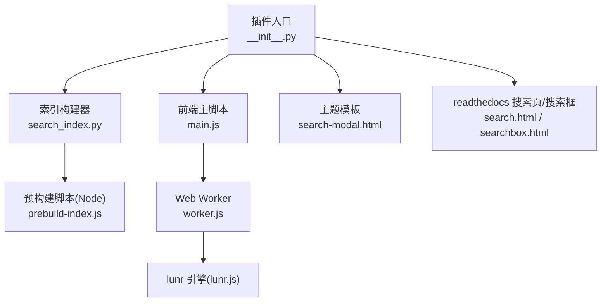
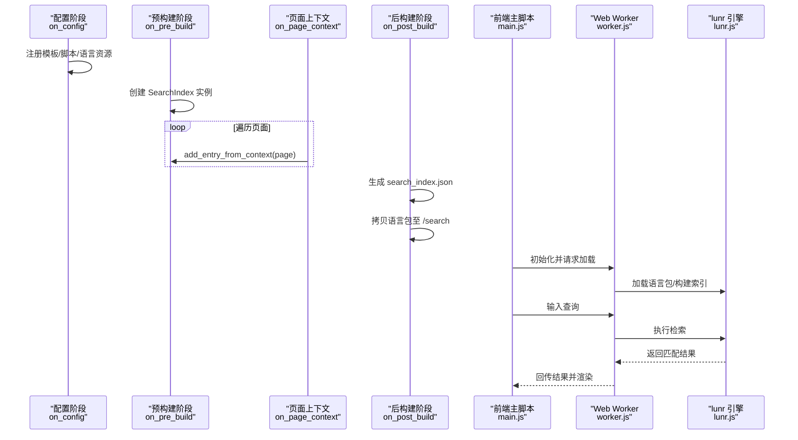
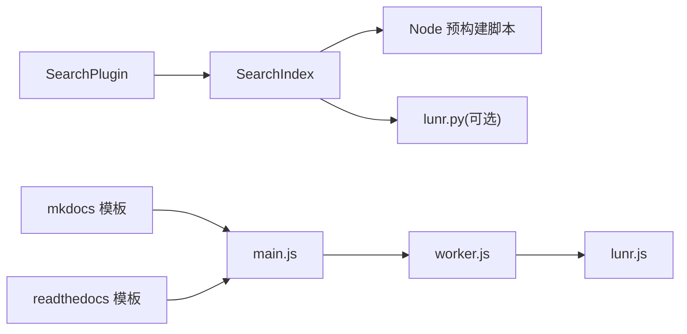

# 搜索功能

<cite>
**本文引用的文件**
- [mkdocs\contrib\search\__init__.py](file://mkdocs/contrib/search/__init__.py)
- [mkdocs\contrib\search\search_index.py](file://mkdocs/contrib/search/search_index.py)
- [mkdocs\contrib\search\prebuild-index.js](file://mkdocs/contrib/search/prebuild-index.js)
- [mkdocs\contrib\search\templates\search\main.js](file://mkdocs/contrib/search/templates/search/main.js)
- [mkdocs\contrib\search\templates\search\worker.js](file://mkdocs/contrib/search/templates/search/worker.js)
- [mkdocs\contrib\search\templates\search\lunr.js](file://mkdocs/contrib/search/templates/search/lunr.js)
- [mkdocs\themes\mkdocs\search-modal.html](file://mkdocs/themes/mkdocs/search-modal.html)
- [mkdocs\themes\readthedocs\search.html](file://mkdocs/themes/readthedocs/search.html)
- [mkdocs\themes\readthedocs\searchbox.html](file://mkdocs/themes/readthedocs/searchbox.html)
- [mkdocs\themes\mkdocs\base.html](file://mkdocs/themes/mkdocs/base.html)
- [mkdocs\tests\search_tests.py](file://mkdocs/tests/search_tests.py)
- [mkdocs.yml](file://mkdocs.yml)
</cite>

## 目录
1. [简介](#简介)
2. [项目结构](#项目结构)
3. [核心组件](#核心组件)
4. [架构总览](#架构总览)
5. [组件详解](#组件详解)
6. [依赖关系分析](#依赖关系分析)
7. [性能与缓存](#性能与缓存)
8. [故障排查](#故障排查)
9. [结论](#结论)
10. [附录：配置与使用指南](#附录配置与使用指南)

## 简介
本文件系统性阐述 MkDocs 内置搜索功能的架构、实现与使用方式，覆盖以下要点：
- 搜索系统整体工作流程与事件驱动机制
- 多语言支持与语言包选择逻辑
- 搜索索引构建（含预构建）与优化策略
- 前端搜索界面与交互行为
- 性能优化与缓存策略
- 大型站点的搜索实践建议
- 测试与验证方法

## 项目结构
与搜索功能直接相关的模块分布如下：
- 插件入口与配置：mkdocs/contrib/search/__init__.py
- 索引构建器与内容解析：mkdocs/contrib/search/search_index.py
- Node 预构建脚本：mkdocs/contrib/search/prebuild-index.js
- 前端脚本与 Web Worker：mkdocs/contrib/search/templates/search/main.js、worker.js
- 搜索引擎核心（lunr.js）与语言包：mkdocs/contrib/search/templates/search/lunr.js 及其语言扩展
- 主题模板：mkdocs/themes/mkdocs/search-modal.html；readthedocs 主题的搜索页与搜索框模板
- 测试用例：mkdocs/tests/search_tests.py
- 示例配置：mkdocs.yml

图表来源
- [mkdocs\contrib\search\__init__.py](file://mkdocs/contrib/search/__init__.py#L62-L121)
- [mkdocs\contrib\search\search_index.py](file://mkdocs/contrib/search/search_index.py#L25-L139)
- [mkdocs\contrib\search\prebuild-index.js](file://mkdocs/contrib/search/prebuild-index.js#L1-L57)
- [mkdocs\contrib\search\templates\search\main.js](file://mkdocs/contrib/search/templates/search/main.js#L1-L110)
- [mkdocs\contrib\search\templates\search\worker.js](file://mkdocs/contrib/search/templates/search/worker.js#L1-L134)
- [mkdocs\themes\mkdocs\search-modal.html](file://mkdocs/themes/mkdocs/search-modal.html#L1-L22)
- [mkdocs\themes\readthedocs\search.html](file://mkdocs/themes/readthedocs/search.html#L1-L17)
- [mkdocs\themes\readthedocs\searchbox.html](file://mkdocs/themes/readthedocs/searchbox.html#L1-L6)

章节来源
- [mkdocs\contrib\search\__init__.py](file://mkdocs/contrib/search/__init__.py#L62-L121)
- [mkdocs\contrib\search\search_index.py](file://mkdocs/contrib/search/search_index.py#L25-L139)
- [mkdocs\contrib\search\prebuild-index.js](file://mkdocs/contrib/search/prebuild-index.js#L1-L57)
- [mkdocs\contrib\search\templates\search\main.js](file://mkdocs/contrib/search/templates/search/main.js#L1-L110)
- [mkdocs\contrib\search\templates\search\worker.js](file://mkdocs/contrib/search/templates/search/worker.js#L1-L134)
- [mkdocs\themes\mkdocs\search-modal.html](file://mkdocs/themes/mkdocs/search-modal.html#L1-L22)
- [mkdocs\themes\readthedocs\search.html](file://mkdocs/themes/readthedocs/search.html#L1-L17)
- [mkdocs\themes\readthedocs\searchbox.html](file://mkdocs/themes/readthedocs/searchbox.html#L1-L6)

## 核心组件
- 搜索插件（SearchPlugin）
  - 负责在构建生命周期中注册模板、脚本与语言资源，收集页面条目，生成搜索索引，并输出到站点目录。
- 搜索索引构建器（SearchIndex）
  - 解析页面 HTML，按标题分段提取文本，构造条目集合；支持“全文/仅节/仅标题”三种索引模式；可调用 Node 或 Python 预构建索引。
- 预构建脚本（prebuild-index.js）
  - 使用 Node 执行，读取构建器传入的文档与配置，动态加载所需语言包，构建 lunr 索引并返回序列化结果。
- 前端脚本（main.js / worker.js）
  - 提供搜索输入监听、结果展示、最小长度控制；优先使用 Web Worker 执行搜索，兼容不支持 Worker 的环境。
- lunr.js 与语言包
  - 提供分词、停用词过滤、词干提取等语言处理能力；多语言场景下按需加载对应语言脚本。

章节来源
- [mkdocs\contrib\search\__init__.py](file://mkdocs/contrib/search/__init__.py#L62-L121)
- [mkdocs\contrib\search\search_index.py](file://mkdocs/contrib/search/search_index.py#L25-L139)
- [mkdocs\contrib\search\prebuild-index.js](file://mkdocs/contrib/search/prebuild-index.js#L1-L57)
- [mkdocs\contrib\search\templates\search\main.js](file://mkdocs/contrib/search/templates/search/main.js#L1-L110)
- [mkdocs\contrib\search\templates\search\worker.js](file://mkdocs/contrib/search/templates/search/worker.js#L1-L134)

## 架构总览
下面以时序图展示从页面渲染到前端搜索执行的关键步骤：

图表来源
- [mkdocs\contrib\search\__init__.py](file://mkdocs/contrib/search/__init__.py#L65-L121)
- [mkdocs\contrib\search\search_index.py](file://mkdocs/contrib/search/search_index.py#L55-L139)
- [mkdocs\contrib\search\templates\search\main.js](file://mkdocs/contrib/search/templates/search/main.js#L69-L110)
- [mkdocs\contrib\search\templates\search\worker.js](file://mkdocs/contrib/search/templates/search/worker.js#L95-L134)
- [mkdocs\contrib\search\templates\search\lunr.js](file://mkdocs/contrib/search/templates/search/lunr.js#L1-L800)

## 组件详解

### 搜索插件（SearchPlugin）
- 配置阶段（on_config）
  - 根据主题设置决定是否包含搜索页模板与静态模板集合
  - 将前端脚本加入额外 JavaScript 列表
  - 若未显式配置语言，则基于主题 locale 自动推断
- 预构建阶段（on_pre_build）
  - 初始化 SearchIndex 实例
- 页面上下文（on_page_context）
  - 将每个页面加入索引条目
- 后构建阶段（on_post_build）
  - 生成 search_index.json 并写入站点目录
  - 条件拷贝所需的 lunr 语言包与多语支持脚本至 /search 输出目录

章节来源
- [mkdocs\contrib\search\__init__.py](file://mkdocs/contrib/search/__init__.py#L65-L121)

### 搜索索引构建器（SearchIndex）
- 内容解析（ContentParser）
  - 通过 HTMLParser 识别标题标签，将正文内容按节分组，剥离注释与多余空白
- 条目生成
  - 支持“全文/仅节/仅标题”三种模式；根据配置决定是否填充 text 字段
  - 为每个节（含页面自身）生成条目，包含 title、text、location
- 索引生成（generate_search_index）
  - 默认输出包含 docs 与 config 的 JSON
  - 支持三种预构建方式：
    - False：不预构建
    - True 或 'node'：调用 Node 脚本进行预构建
    - 'python'：尝试使用 lunr.py 在 Python 端构建并序列化
  - 预构建失败时记录警告日志并回退到运行时构建

章节来源
- [mkdocs\contrib\search\search_index.py](file://mkdocs/contrib/search/search_index.py#L25-L139)

### 预构建脚本（prebuild-index.js）
- 接收来自 Python 的 JSON 数据（包含 docs 与 config）
- 动态加载语言包（stemmer.support、multi、tinyseg 等），按配置设置分词器正则
- 使用 lunr 构建索引并输出序列化结果

章节来源
- [mkdocs\contrib\search\prebuild-index.js](file://mkdocs/contrib/search/prebuild-index.js#L1-L57)

### 前端搜索（main.js / worker.js）
- main.js
  - 从 URL 查询参数读取初始搜索词
  - 监听输入框变化，触发搜索或清空结果
  - 若浏览器不支持 Worker，则降级加载 worker 脚本并在主线程执行
  - 通过 postMessage 与 Worker 通信，接收配置与结果并渲染
- worker.js
  - 按需加载 lunr 与语言包
  - 从 search_index.json 加载已预构建索引或在本地构建
  - 执行检索并将摘要文本注入结果返回给主线程

章节来源
- [mkdocs\contrib\search\templates\search\main.js](file://mkdocs/contrib/search/templates/search/main.js#L1-L110)
- [mkdocs\contrib\search\templates\search\worker.js](file://mkdocs/contrib/search/templates/search/worker.js#L1-L134)

### 多语言支持与配置
- 语言检测与回退
  - 通过 LangOption 校验语言列表，自动回退到英文并记录日志
  - 支持带地域的语言代码（如 zh_CN、pt_BR），内部转换为可用语言码
- 语言包加载
  - 根据配置语言列表，按需复制 stemmer.support、multi、tinyseg 以及对应 lunr.xx.js 至输出目录
- 分词器与分隔符
  - 支持通过配置项自定义分词分隔符，预构建脚本会将其应用到 lunr.tokenizer.separator

章节来源
- [mkdocs\contrib\search\__init__.py](file://mkdocs/contrib/search/__init__.py#L23-L51)
- [mkdocs\contrib\search\__init__.py](file://mkdocs/contrib/search/__init__.py#L102-L121)
- [mkdocs\contrib\search\prebuild-index.js](file://mkdocs/contrib/search/prebuild-index.js#L35-L37)

### 搜索界面与主题集成
- mkdocs 主题
  - 导航栏中提供“搜索”入口，弹出搜索模态框
  - 模态框内包含输入框与结果容器
- readthedocs 主题
  - 提供独立的搜索结果页与搜索框模板，便于在页面中嵌入搜索表单

章节来源
- [mkdocs\themes\mkdocs\base.html](file://mkdocs/themes/mkdocs/base.html#L113-L121)
- [mkdocs\themes\mkdocs\search-modal.html](file://mkdocs/themes/mkdocs/search-modal.html#L1-L22)
- [mkdocs\themes\readthedocs\search.html](file://mkdocs/themes/readthedocs/search.html#L1-L17)
- [mkdocs\themes\readthedocs\searchbox.html](file://mkdocs/themes/readthedocs/searchbox.html#L1-L6)

## 依赖关系分析
- 插件对索引构建器的依赖：SearchPlugin 在构建阶段委托 SearchIndex 完成条目收集与索引生成
- 索引构建器对 Node/Python 的依赖：当启用预构建时，SearchIndex 通过 subprocess 调用 Node 脚本；或在 Python 环境下使用 lunr.py
- 前端对引擎与语言包的依赖：main.js 与 worker.js 依赖 lunr.js 与对应语言包
- 主题对搜索 UI 的依赖：模板负责渲染搜索入口与结果容器

图表来源
- [mkdocs\contrib\search\__init__.py](file://mkdocs/contrib/search/__init__.py#L62-L121)
- [mkdocs\contrib\search\search_index.py](file://mkdocs/contrib/search/search_index.py#L95-L139)
- [mkdocs\contrib\search\prebuild-index.js](file://mkdocs/contrib/search/prebuild-index.js#L1-L57)
- [mkdocs\contrib\search\templates\search\main.js](file://mkdocs/contrib/search/templates/search/main.js#L1-L110)
- [mkdocs\contrib\search\templates\search\worker.js](file://mkdocs/contrib/search/templates/search/worker.js#L1-L134)
- [mkdocs\themes\mkdocs\search-modal.html](file://mkdocs/themes/mkdocs/search-modal.html#L1-L22)
- [mkdocs\themes\readthedocs\search.html](file://mkdocs/themes/readthedocs/search.html#L1-L17)

## 性能与缓存
- 预构建索引
  - 通过在构建阶段调用 Node 脚本或 Python 端 lunr.py，将索引序列化后直接由前端加载，减少运行时构建开销
  - 当 Node 或依赖缺失时，会记录警告并回退到运行时构建
- 语言包按需加载
  - 仅复制实际使用的语言包与多语支持脚本，避免冗余资源
- 前端搜索线程分离
  - 使用 Web Worker 执行检索，避免阻塞 UI 线程；不支持 Worker 的环境自动降级
- 缓存策略建议
  - 将 search_index.json 与语言包置于 CDN，结合强缓存策略提升二次访问速度
  - 对于大型站点，考虑拆分索引或按主题/版本分别构建，降低单次加载体积
- 分词与索引粒度
  - “仅标题”模式可显著减小索引体积，适合超大站点；“仅节”在体积与召回间折中；“全文”召回率最高但体积最大

章节来源
- [mkdocs\contrib\search\search_index.py](file://mkdocs/contrib/search/search_index.py#L100-L139)
- [mkdocs\contrib\search\__init__.py](file://mkdocs/contrib/search/__init__.py#L102-L121)
- [mkdocs\contrib\search\templates\search\worker.js](file://mkdocs/contrib/search/templates/search/worker.js#L95-L134)

## 故障排查
- 预构建失败
  - 现象：构建日志出现警告，未生成预构建索引
  - 原因：Node 未安装、预构建脚本异常、lunr.py 未安装且选择了 'python' 方法
  - 处理：确认 Node 可用；若使用 'python'，安装 lunr.py 与对应语言包
- 语言包缺失
  - 现象：搜索无结果或报错
  - 原因：配置语言不在支持列表或未正确复制语言包
  - 处理：检查配置语言码并确保对应 lunr.xx.js 存在
- 最小搜索长度导致无结果
  - 现象：输入短词无结果
  - 原因：前端限制了最小长度
  - 处理：调整配置中的最小长度参数
- 大型站点加载缓慢
  - 现象：搜索页面首屏慢
  - 原因：索引过大、未启用预构建、未做缓存
  - 处理：启用预构建、按需裁剪索引、CDN 缓存、拆分索引

章节来源
- [mkdocs\contrib\search\search_index.py](file://mkdocs/contrib/search/search_index.py#L117-L139)
- [mkdocs\contrib\search\__init__.py](file://mkdocs/contrib/search/__init__.py#L102-L121)
- [mkdocs\tests\search_tests.py](file://mkdocs/tests/search_tests.py#L481-L634)

## 结论
MkDocs 的内置搜索以插件为核心，结合 Python 端索引构建与前端 Web Worker 检索，实现了轻量、可扩展且多语言友好的搜索体验。通过预构建与按需语言包加载，可在保证召回的同时控制体积与加载时间。针对大型站点，建议采用预构建、CDN 缓存与索引裁剪等策略，持续优化搜索性能与用户体验。

## 附录：配置与使用指南

### 配置项说明
- lang
  - 类型：字符串或字符串列表
  - 作用：指定用于检索的语言；支持多语言混合；不支持的语言将回退到英文
- separator
  - 类型：正则字符串
  - 作用：自定义分词分隔符，影响索引与查询的分词行为
- min_search_length
  - 类型：整数
  - 作用：前端最小搜索长度阈值，低于该长度的查询将清空结果
- prebuild_index
  - 取值：False/True/'node'/'python'
  - 作用：是否在构建阶段预构建索引；'python' 已标记为弃用提示
- indexing
  - 取值：full/sections/titles
  - 作用：控制索引粒度（全文/仅节/仅标题）

章节来源
- [mkdocs\contrib\search\__init__.py](file://mkdocs/contrib/search/__init__.py#L54-L60)
- [mkdocs\contrib\search\prebuild-index.js](file://mkdocs/contrib/search/prebuild-index.js#L35-L37)
- [mkdocs\contrib\search\templates\search\main.js](file://mkdocs/contrib/search/templates/search/main.js#L87-L90)
- [mkdocs\tests\search_tests.py](file://mkdocs/tests/search_tests.py#L77-L161)

### 多语言搜索配置示例
- 单语言：lang: en
- 多语言：lang: [zh, en, ja]
- 带地域：lang: [zh_CN, pt_BR, fr]
- 自动继承主题语言：不设置 lang，插件将使用 theme.locale.language

章节来源
- [mkdocs\contrib\search\__init__.py](file://mkdocs/contrib/search/__init__.py#L23-L51)
- [mkdocs\contrib\search\__init__.py](file://mkdocs/contrib/search/__init__.py#L74-L85)

### 搜索界面定制
- 使用 mkdocs 主题
  - 在导航中显示搜索入口，弹出模态框进行搜索
- 使用 readthedocs 主题
  - 可在页面中嵌入搜索框，或使用独立搜索结果页
- 自定义样式
  - 通过主题的 extra_css 与模板覆盖实现外观定制

章节来源
- [mkdocs\themes\mkdocs\base.html](file://mkdocs/themes/mkdocs/base.html#L113-L121)
- [mkdocs\themes\mkdocs\search-modal.html](file://mkdocs/themes/mkdocs/search-modal.html#L1-L22)
- [mkdocs\themes\readthedocs\search.html](file://mkdocs/themes/readthedocs/search.html#L1-L17)
- [mkdocs\themes\readthedocs\searchbox.html](file://mkdocs/themes/readthedocs/searchbox.html#L1-L6)

### 大型站点实践建议
- 启用预构建索引（推荐 'node'）
- 选择合适的 indexing 策略（建议 sections 或 titles）
- 仅保留必要语言包，避免复制无关语言脚本
- 将 search_index.json 与语言包部署到 CDN，设置长缓存
- 如需进一步瘦身，可按主题/版本拆分索引并动态切换

章节来源
- [mkdocs\contrib\search\__init__.py](file://mkdocs/contrib/search/__init__.py#L102-L121)
- [mkdocs\contrib\search\search_index.py](file://mkdocs/contrib/search/search_index.py#L100-L139)

### 测试与验证方法
- 配置与事件行为
  - 验证默认值、语言列表校验、主题 locale 推断、静态模板与脚本注入
- 索引构建
  - 验证不同 indexing 模式下的条目数量与字段内容
  - 验证预构建（'node'/'python'/False）的行为与错误日志
- 前端交互
  - 验证最小长度控制、Worker 降级路径、结果渲染与无结果文案

章节来源
- [mkdocs\tests\search_tests.py](file://mkdocs/tests/search_tests.py#L20-L76)
- [mkdocs\tests\search_tests.py](file://mkdocs/tests/search_tests.py#L162-L210)
- [mkdocs\tests\search_tests.py](file://mkdocs/tests/search_tests.py#L271-L480)
- [mkdocs\tests\search_tests.py](file://mkdocs/tests/search_tests.py#L481-L634)