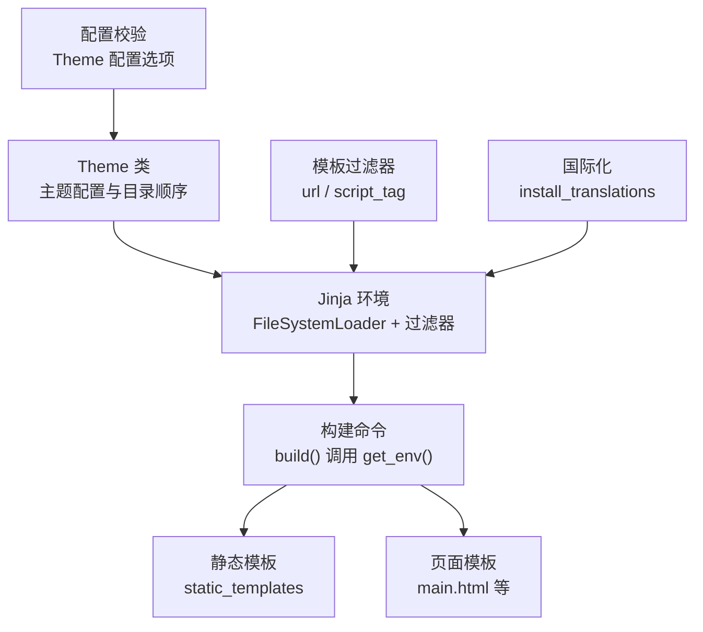
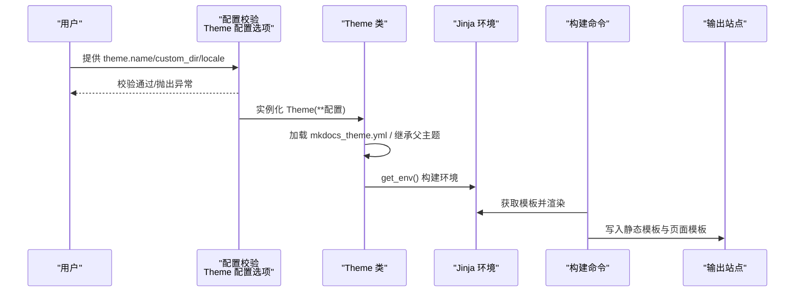
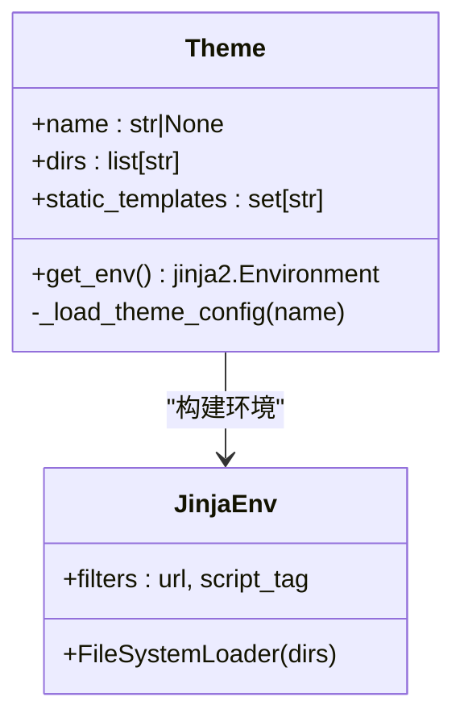
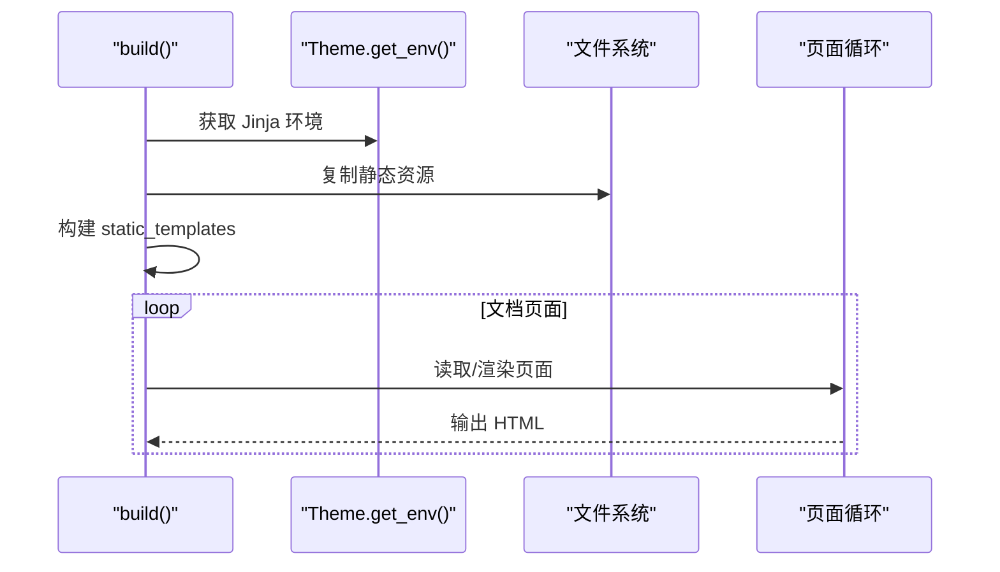
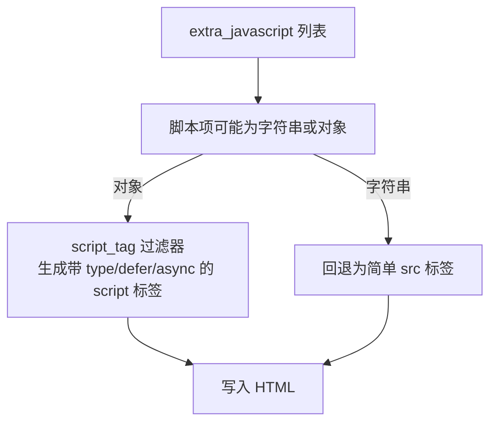
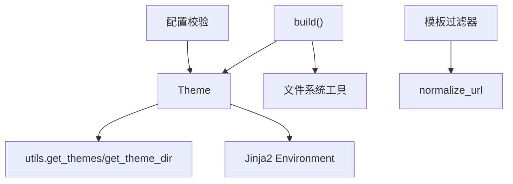
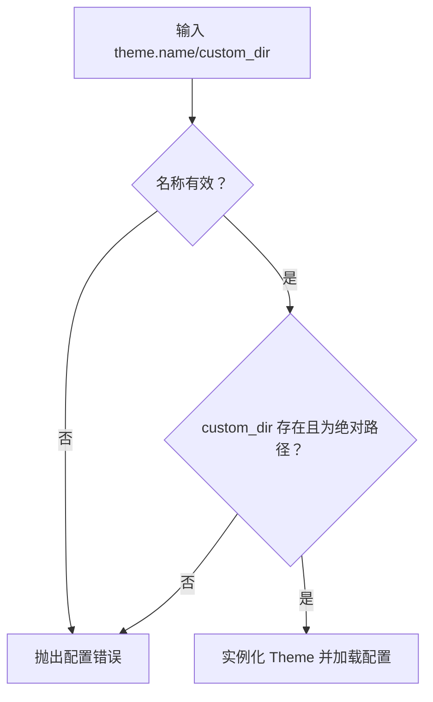

# 主题问题

<cite>
**本文引用的文件**
- [mkdocs/theme.py](file://mkdocs/theme.py)
- [mkdocs/utils/templates.py](file://mkdocs/utils/templates.py)
- [mkdocs/commands/build.py](file://mkdocs/commands/build.py)
- [mkdocs/utils/__init__.py](file://mkdocs/utils/__init__.py)
- [mkdocs/localization.py](file://mkdocs/localization.py)
- [mkdocs/config/base.py](file://mkdocs/config/base.py)
- [mkdocs/exceptions.py](file://mkdocs/exceptions.py)
- [mkdocs/tests/theme_tests.py](file://mkdocs/tests/theme_tests.py)
- [docs/dev-guide/themes.md](file://docs/dev-guide/themes.md)
- [docs/user-guide/customizing-your-theme.md](file://docs/user-guide/customizing-your-theme.md)
- [mkdocs/config/config_options.py](file://mkdocs/config/config_options.py)
</cite>

## 目录
1. [简介](#简介)
2. [项目结构](#项目结构)
3. [核心组件](#核心组件)
4. [架构总览](#架构总览)
5. [详细组件分析](#详细组件分析)
6. [依赖分析](#依赖分析)
7. [性能考虑](#性能考虑)
8. [故障排除指南](#故障排除指南)
9. [结论](#结论)
10. [附录](#附录)

## 简介
本指南聚焦于 MkDocs 主题系统的常见问题与排障流程，覆盖主题加载失败、样式显示异常、模板渲染错误、CSS/JS 资源加载失败、主题继承与覆盖调试等场景。内容基于代码库中主题类、构建流程、配置校验、国际化与模板过滤器等实现，帮助你快速定位并修复问题。

## 项目结构
围绕主题系统的关键模块与文件如下：
- 主题类与环境：Theme 类负责主题配置加载、目录顺序、静态模板集合与 Jinja 环境构建
- 构建流程：build 命令在构建阶段调用 Theme.get_env() 获取模板环境，按静态模板与页面模板顺序输出
- 配置校验：Theme 配置选项在配置层进行校验（名称、custom_dir、locale）
- 模板工具：URL 规范化与 script 标签生成过滤器
- 国际化：主题翻译安装与回退策略
- 测试与文档：主题行为验证、开发者指南与定制指南

图表来源
- [mkdocs/theme.py](file://mkdocs/theme.py#L158-L167)
- [mkdocs/commands/build.py](file://mkdocs/commands/build.py#L288-L339)
- [mkdocs/utils/templates.py](file://mkdocs/utils/templates.py#L37-L56)
- [mkdocs/localization.py](file://mkdocs/localization.py#L45-L64)

章节来源
- [mkdocs/theme.py](file://mkdocs/theme.py#L23-L167)
- [mkdocs/commands/build.py](file://mkdocs/commands/build.py#L249-L354)
- [mkdocs/utils/templates.py](file://mkdocs/utils/templates.py#L25-L56)
- [mkdocs/localization.py](file://mkdocs/localization.py#L38-L93)

## 核心组件
- Theme 类
  - 负责解析主题配置、递归加载父主题、合并 static_templates、设置 locale，并构建 Jinja2 Environment
  - 目录优先级：custom_dir → 父主题目录 → 当前主题目录 → MkDocs 内置模板目录
- 构建命令
  - 在构建开始时获取 Theme 的 Jinja 环境，先复制静态资源，再依次构建 static_templates 与页面模板
- 模板过滤器
  - url：相对/绝对 URL 规范化
  - script_tag：根据 extra_javascript 的对象字段生成 script 标签
- 国际化
  - 安装翻译或回退到空翻译；当 locale 语言非英语且无翻译时发出警告
- 配置校验
  - 校验 theme.name 是否存在于已安装主题列表
  - 校验 custom_dir 是否存在且为绝对路径
  - 校验 locale 必须为字符串

章节来源
- [mkdocs/theme.py](file://mkdocs/theme.py#L35-L167)
- [mkdocs/commands/build.py](file://mkdocs/commands/build.py#L288-L339)
- [mkdocs/utils/templates.py](file://mkdocs/utils/templates.py#L37-L56)
- [mkdocs/localization.py](file://mkdocs/localization.py#L38-L93)
- [mkdocs/config/config_options.py](file://mkdocs/config/config_options.py#L816-L858)

## 架构总览
主题系统从配置到渲染的关键流程如下：

图表来源
- [mkdocs/config/config_options.py](file://mkdocs/config/config_options.py#L816-L858)
- [mkdocs/theme.py](file://mkdocs/theme.py#L124-L167)
- [mkdocs/commands/build.py](file://mkdocs/commands/build.py#L288-L339)

## 详细组件分析

### 组件 A：Theme 类与主题继承
- 关键点
  - 通过入口点发现已安装主题，支持 theme.name 与 theme.custom_dir 并存
  - 递归加载父主题（extends），目录顺序决定模板覆盖优先级
  - 合并 static_templates，支持内置静态模板与主题定义的静态模板
  - locale 解析与国际化安装
- 典型问题
  - 父主题未安装导致继承失败
  - 自定义目录不存在或不是绝对路径
  - mkdocs_theme.yml 缺失或为空导致默认变量不完整

图表来源
- [mkdocs/theme.py](file://mkdocs/theme.py#L23-L167)

章节来源
- [mkdocs/theme.py](file://mkdocs/theme.py#L124-L167)
- [mkdocs/utils/__init__.py](file://mkdocs/utils/__init__.py#L256-L293)

### 组件 B：构建流程与模板渲染
- 关键点
  - 构建开始清理 site_dir，随后获取 Theme 环境并添加主题静态文件
  - 先构建 static_templates，再逐页渲染 main.html 等页面模板
  - 页面模板渲染前可被插件事件修改上下文
- 典型问题
  - 模板缺失（TemplateNotFound）被跳过并记录警告
  - 页面渲染异常被包装为 BuildError 或 Abort
  - 严格模式下警告计数触发中断

图表来源
- [mkdocs/commands/build.py](file://mkdocs/commands/build.py#L249-L354)

章节来源
- [mkdocs/commands/build.py](file://mkdocs/commands/build.py#L61-L123)
- [mkdocs/commands/build.py](file://mkdocs/commands/build.py#L185-L247)

### 组件 C：模板过滤器与资源链接
- 关键点
  - url 过滤器根据当前页面或 base_url 生成规范 URL
  - script_tag 过滤器根据 extra_javascript 对象字段生成 script 标签（含 type、defer、async）
- 典型问题
  - 使用旧版字符串列表导致 script_tag 字段丢失
  - 相对路径与 base_url 计算错误导致资源 404

图表来源
- [mkdocs/utils/templates.py](file://mkdocs/utils/templates.py#L37-L56)
- [docs/dev-guide/themes.md](file://docs/dev-guide/themes.md#L132-L177)

章节来源
- [mkdocs/utils/templates.py](file://mkdocs/utils/templates.py#L37-L56)
- [docs/dev-guide/themes.md](file://docs/dev-guide/themes.md#L126-L177)

### 组件 D：国际化与本地化
- 关键点
  - 解析 locale 字符串为 Locale 对象，非法值触发配置错误
  - 安装主题翻译，若无可用翻译则回退到空翻译并警告
- 典型问题
  - locale 非法或拼写错误
  - 主题 locales 目录缺失导致翻译未生效

章节来源
- [mkdocs/localization.py](file://mkdocs/localization.py#L38-L93)
- [mkdocs/theme.py](file://mkdocs/theme.py#L70-L74)

## 依赖分析
- Theme 依赖 utils.get_themes 与 utils.get_theme_dir 获取主题入口点与目录
- 构建命令依赖 Theme.get_env 与文件系统工具复制静态资源
- 模板过滤器依赖 utils.normalize_url 与 config 中的 extra_* 列表
- 配置层对 theme.name、custom_dir、locale 进行严格校验

图表来源
- [mkdocs/utils/__init__.py](file://mkdocs/utils/__init__.py#L256-L293)
- [mkdocs/commands/build.py](file://mkdocs/commands/build.py#L288-L339)
- [mkdocs/utils/templates.py](file://mkdocs/utils/templates.py#L205-L217)
- [mkdocs/config/config_options.py](file://mkdocs/config/config_options.py#L816-L858)

章节来源
- [mkdocs/utils/__init__.py](file://mkdocs/utils/__init__.py#L256-L293)
- [mkdocs/commands/build.py](file://mkdocs/commands/build.py#L288-L339)
- [mkdocs/utils/templates.py](file://mkdocs/utils/templates.py#L205-L217)
- [mkdocs/config/config_options.py](file://mkdocs/config/config_options.py#L816-L858)

## 性能考虑
- 模板查找顺序与缓存
  - FileSystemLoader 按 dirs 顺序查找模板，目录顺序影响覆盖与性能
  - get_themes 使用 LRU 缓存，避免重复扫描入口点
- 渲染阶段
  - 构建命令在严格模式下统计警告数量，过多警告会触发中断
- 建议
  - 合理组织 custom_dir 与父主题继承层级，减少不必要的模板覆盖
  - 控制 extra_javascript 数量与体积，避免阻塞渲染

章节来源
- [mkdocs/utils/__init__.py](file://mkdocs/utils/__init__.py#L262-L287)
- [mkdocs/commands/build.py](file://mkdocs/commands/build.py#L254-L257)

## 故障排除指南

### 一、主题加载失败
- 症状
  - 报错提示主题未找到或未安装
  - 继承的父主题不存在
- 排查步骤
  - 确认 theme.name 是否存在于已安装主题列表
  - 若使用 custom_dir，请确认路径存在且为绝对路径
  - 若使用 theme.name=null 且仅提供 custom_dir，请确保自定义主题完整（不含 mkdocs_theme.yml）
- 参考实现
  - 配置校验在 Theme 配置选项中执行，包含名称与 custom_dir 校验
  - 主题发现通过入口点扫描，返回 {name: EntryPoint}

图表来源
- [mkdocs/config/config_options.py](file://mkdocs/config/config_options.py#L816-L858)
- [mkdocs/utils/__init__.py](file://mkdocs/utils/__init__.py#L262-L293)

章节来源
- [mkdocs/config/config_options.py](file://mkdocs/config/config_options.py#L816-L858)
- [mkdocs/utils/__init__.py](file://mkdocs/utils/__init__.py#L262-L293)

### 二、样式显示异常
- 症状
  - CSS 未生效、覆盖顺序错误、字体/图标缺失
- 排查步骤
  - 检查 extra_css 是否正确配置并被模板引用
  - 确认自定义 CSS 文件路径与 base_url 结合后可访问
  - 若使用自定义主题覆盖，请确认 custom_dir 与父主题目录顺序
- 参考实现
  - 主题开发指南说明了 extra_css 的使用方式与模板引用建议

章节来源
- [docs/dev-guide/themes.md](file://docs/dev-guide/themes.md#L126-L131)
- [docs/user-guide/customizing-your-theme.md](file://docs/user-guide/customizing-your-theme.md#L13-L46)

### 三、模板渲染错误
- 症状
  - 模板缺失（TemplateNotFound）被跳过
  - 页面渲染异常被包装为 BuildError
- 排查步骤
  - 检查 static_templates 与页面模板命名是否正确
  - 查看构建日志中的警告与错误信息
  - 在严格模式下关注警告计数
- 参考实现
  - 构建命令对模板缺失与空输出进行记录与处理

章节来源
- [mkdocs/commands/build.py](file://mkdocs/commands/build.py#L91-L123)
- [mkdocs/commands/build.py](file://mkdocs/commands/build.py#L185-L247)
- [mkdocs/exceptions.py](file://mkdocs/exceptions.py#L30-L42)

### 四、CSS/JavaScript 资源加载失败
- 症状
  - 404 错误、模块脚本类型不匹配、异步/延迟属性未生效
- 排查步骤
  - 使用 url 过滤器规范化路径，结合 base_url
  - 使用 script_tag 过滤器生成带 type/defer/async 的 script 标签
  - 确保 extra_javascript 采用对象格式以启用新特性
- 参考实现
  - script_tag 过滤器与 url 过滤器的行为定义

章节来源
- [mkdocs/utils/templates.py](file://mkdocs/utils/templates.py#L37-L56)
- [docs/dev-guide/themes.md](file://docs/dev-guide/themes.md#L132-L177)

### 五、主题继承与覆盖调试
- 症状
  - 自定义模板未生效、父主题覆盖顺序不符合预期
- 排查步骤
  - 确认 mkdocs_theme.yml 的 extends 字段指向已安装主题
  - 检查 Theme.dirs 的顺序：custom_dir → 父主题 → 当前主题 → 内置模板
  - 使用测试用例思路验证 static_templates 合并与目录顺序
- 参考实现
  - Theme._load_theme_config 递归加载父主题并合并配置
  - 测试用例验证目录顺序与 static_templates 合并

章节来源
- [mkdocs/theme.py](file://mkdocs/theme.py#L124-L156)
- [mkdocs/tests/theme_tests.py](file://mkdocs/tests/theme_tests.py#L88-L107)

### 六、国际化与本地化问题
- 症状
  - locale 非法导致配置错误
  - 翻译未生效或回退到空翻译
- 排查步骤
  - 确认 locale 字符串格式正确
  - 检查主题 locales 目录是否存在对应语言包
  - 若无翻译，确认是否期望回退到英语
- 参考实现
  - locale 解析与翻译安装逻辑

章节来源
- [mkdocs/localization.py](file://mkdocs/localization.py#L38-L93)
- [mkdocs/theme.py](file://mkdocs/theme.py#L70-L74)

### 七、兼容性检查方法
- 检查点
  - 主题入口点是否注册成功
  - 主题名称是否唯一且未被其他包覆盖
  - 自定义主题是否提供完整文件集（不含 mkdocs_theme.yml 时）
- 参考实现
  - 主题发现与冲突检测逻辑

章节来源
- [mkdocs/utils/__init__.py](file://mkdocs/utils/__init__.py#L262-L293)

## 结论
主题系统的核心在于“配置校验—主题加载—环境构建—模板渲染”的链路。通过理解 Theme 类的目录顺序、构建命令的执行顺序、模板过滤器的 URL/脚本生成机制以及国际化安装策略，可以高效定位并解决主题相关问题。建议在排查时优先核对配置与目录顺序，再逐步深入到模板与资源链接层面。

## 附录
- 相关文档与指南
  - 主题开发与定制指南
  - 用户指南中的主题定制章节

章节来源
- [docs/dev-guide/themes.md](file://docs/dev-guide/themes.md#L1-L120)
- [docs/user-guide/customizing-your-theme.md](file://docs/user-guide/customizing-your-theme.md#L1-L120)