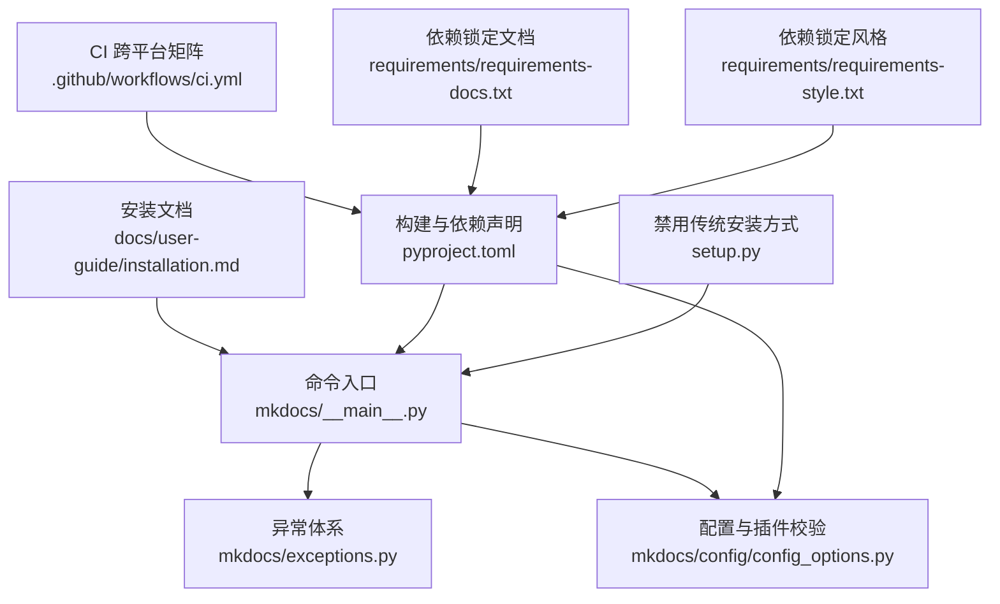
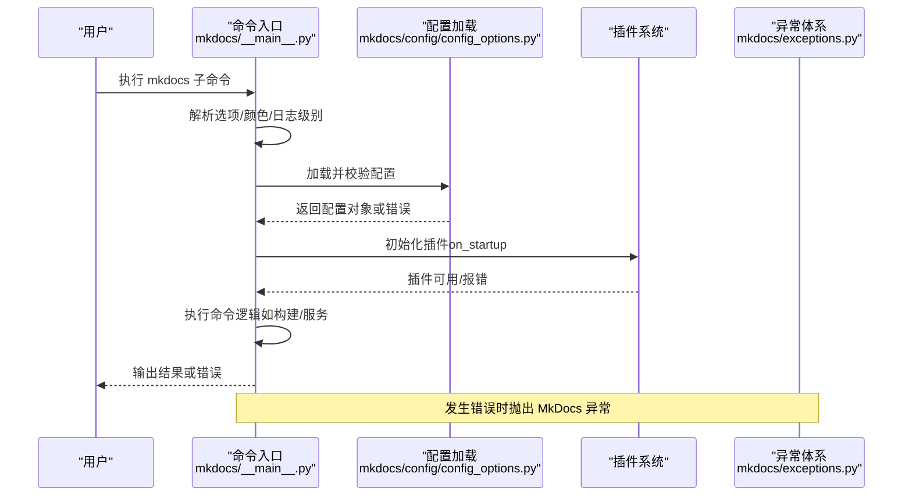
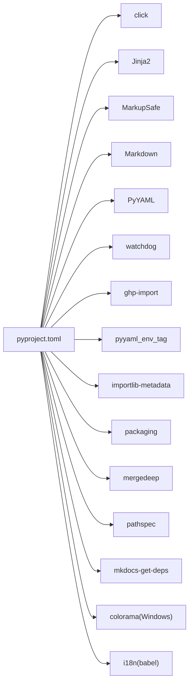
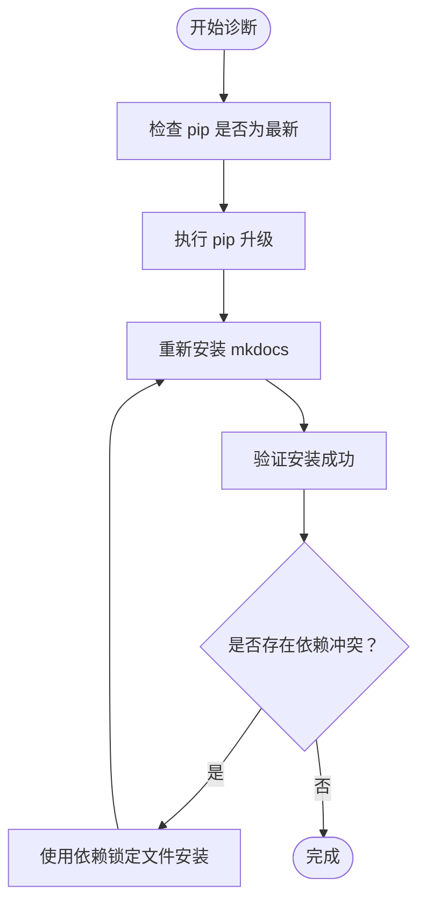

# 安装问题

<cite>
**本文引用的文件**
- [docs/用户指南/安装.md](file://docs/user-guide/installation.md)
- [pyproject.toml](file://pyproject.toml)
- [mkdocs/__main__.py](file://mkdocs/__main__.py)
- [mkdocs/exceptions.py](file://mkdocs/exceptions.py)
- [mkdocs/config/config_options.py](file://mkdocs/config/config_options.py)
- [mkdocs/tests/integration.py](file://mkdocs/tests/integration.py)
- [.github/workflows/ci.yml](file://.github/workflows/ci.yml)
- [requirements/requirements-docs.txt](file://requirements/requirements-docs.txt)
- [requirements/requirements-style.txt](file://requirements/requirements-style.txt)
- [setup.py](file://setup.py)
</cite>

## 目录
1. [简介](#简介)
2. [项目结构](#项目结构)
3. [核心组件](#核心组件)
4. [架构总览](#架构总览)
5. [详细组件分析](#详细组件分析)
6. [依赖关系分析](#依赖关系分析)
7. [性能考虑](#性能考虑)
8. [故障排除指南](#故障排除指南)
9. [结论](#结论)
10. [附录](#附录)

## 简介
本指南聚焦于 MkDocs 的安装问题，覆盖 Python 版本兼容性、pip 安装失败、权限与路径问题、虚拟环境配置错误、依赖冲突诊断与修复、安装成功验证、以及离线与代理环境下的安装策略。内容基于仓库中的官方安装文档、构建与依赖声明、命令入口与异常类型、以及跨平台集成测试配置进行整理，帮助你在 Windows、macOS、Linux 上快速定位并解决问题。

## 项目结构
围绕安装与故障排除的关键文件与职责如下：
- 官方安装说明：提供 Python 与 pip 要求、安装步骤、Windows 路径注意事项与 manpage 安装提示
- 构建与依赖声明：定义最低 Python 版本、核心依赖与可选依赖、脚本入口
- 命令入口与异常：命令行入口、版本输出、异常基类与错误分类
- 配置校验与插件加载：插件未安装、重复实例化等配置错误
- 集成测试与 CI：跨平台矩阵（Windows/macOS/Linux）、Python 版本矩阵
- 依赖锁定示例：文档与风格工具的依赖锁定文件

图表来源
- [docs/用户指南/安装.md](file://docs/user-guide/installation.md#L1-L108)
- [pyproject.toml](file://pyproject.toml#L1-L240)
- [mkdocs/__main__.py](file://mkdocs/__main__.py#L1-L371)
- [mkdocs/exceptions.py](file://mkdocs/exceptions.py#L1-L42)
- [mkdocs/config/config_options.py](file://mkdocs/config/config_options.py#L1088-L1117)
- [.github/workflows/ci.yml](file://.github/workflows/ci.yml#L1-L53)
- [requirements/requirements-docs.txt](file://requirements/requirements-docs.txt#L1-L135)
- [requirements/requirements-style.txt](file://requirements/requirements-style.txt#L1-L25)
- [setup.py](file://setup.py#L1-L14)

章节来源
- [docs/用户指南/安装.md](file://docs/user-guide/installation.md#L1-L108)
- [pyproject.toml](file://pyproject.toml#L1-L240)
- [mkdocs/__main__.py](file://mkdocs/__main__.py#L1-L371)
- [mkdocs/exceptions.py](file://mkdocs/exceptions.py#L1-L42)
- [mkdocs/config/config_options.py](file://mkdocs/config/config_options.py#L1088-L1117)
- [.github/workflows/ci.yml](file://.github/workflows/ci.yml#L1-L53)
- [requirements/requirements-docs.txt](file://requirements/requirements-docs.txt#L1-L135)
- [requirements/requirements-style.txt](file://requirements/requirements-style.txt#L1-L25)
- [setup.py](file://setup.py#L1-L14)

## 核心组件
- Python 与 pip 要求：需较新版本的 Python 与 pip；Windows 用户需确保 PATH 包含 Scripts 目录或使用 python -m 前缀
- 最低 Python 版本与依赖：pyproject.toml 明确 requires-python >= 3.8，并列出核心依赖与可选依赖
- 命令入口与版本输出：通过 __main__.py 提供 mkdocs 命令与版本信息，Windows 下自动初始化 colorama
- 异常体系：MkDocs 自定义异常基类，用于区分中止、配置错误、构建错误与插件错误
- 插件加载与配置校验：当插件未安装或配置无效时抛出校验错误
- CI 与跨平台支持：GitHub Actions 在 Windows/macOS/Linux 上多 Python 版本矩阵运行测试

章节来源
- [docs/用户指南/安装.md](file://docs/user-guide/installation.md#L7-L108)
- [pyproject.toml](file://pyproject.toml#L34-L50)
- [mkdocs/__main__.py](file://mkdocs/__main__.py#L17-L24)
- [mkdocs/exceptions.py](file://mkdocs/exceptions.py#L6-L42)
- [mkdocs/config/config_options.py](file://mkdocs/config/config_options.py#L1088-L1117)
- [.github/workflows/ci.yml](file://.github/workflows/ci.yml#L12-L29)

## 架构总览
下图展示了从命令行到配置校验与插件加载的整体流程，以及异常在其中的作用位置。

图表来源
- [mkdocs/__main__.py](file://mkdocs/__main__.py#L240-L371)
- [mkdocs/config/config_options.py](file://mkdocs/config/config_options.py#L1088-L1117)
- [mkdocs/exceptions.py](file://mkdocs/exceptions.py#L6-L42)

## 详细组件分析

### Python 与 pip 兼容性
- 最低 Python 版本：requires-python >= 3.8
- 推荐 pip 升级：建议先升级 pip 再安装
- Windows 注意事项：确保 PATH 包含 Scripts 目录，否则使用 python -m 前缀调用 pip 与 mkdocs

章节来源
- [pyproject.toml](file://pyproject.toml#L34-L34)
- [docs/用户指南/安装.md](file://docs/user-guide/installation.md#L36-L100)

### 命令入口与版本输出
- 入口脚本提供 mkdocs 命令，版本信息包含包路径与 Python 主次版本
- Windows 平台自动初始化 colorama，避免控制台颜色问题

章节来源
- [mkdocs/__main__.py](file://mkdocs/__main__.py#L240-L246)
- [mkdocs/__main__.py](file://mkdocs/__main__.py#L17-L24)

### 异常体系与错误分类
- MkDocsException：所有异常的基类
- Abort：中止构建
- ConfigurationError：配置校验阶段的错误
- BuildError：构建过程中的错误
- PluginError：插件事件引发的构建错误

章节来源
- [mkdocs/exceptions.py](file://mkdocs/exceptions.py#L6-L42)

### 插件加载与配置校验
- 当指定的插件未安装时，会触发“插件未安装”的校验错误
- 对重复实例化且未声明支持多实例的插件，会给出警告

章节来源
- [mkdocs/config/config_options.py](file://mkdocs/config/config_options.py#L1088-L1117)
- [mkdocs/config/config_options.py](file://mkdocs/config/config_options.py#L1134-L1138)

### CI 与跨平台支持
- GitHub Actions 在 Windows/macOS/Linux 上对多个 Python 版本进行测试
- 这为安装兼容性提供了实际验证基础

章节来源
- [.github/workflows/ci.yml](file://.github/workflows/ci.yml#L12-L29)

## 依赖关系分析
- 核心依赖：click、Jinja2、MarkupSafe、Markdown、PyYAML、watchdog、ghp-import、pyyaml_env_tag、importlib-metadata（特定版本条件）、packaging、mergedeep、pathspec、mkdocs-get-deps、colorama（Windows 条件）
- 可选依赖：i18n（babel）
- 最小版本约束：min-versions 列表用于 pin 依赖的最小版本，便于回归与一致性测试

图表来源
- [pyproject.toml](file://pyproject.toml#L35-L50)
- [pyproject.toml](file://pyproject.toml#L51-L71)

章节来源
- [pyproject.toml](file://pyproject.toml#L35-L71)

## 性能考虑
- 使用最新 pip 可减少缓存与解析开销
- 在 CI 中使用矩阵测试有助于提前发现性能退化与兼容性问题
- 依赖锁定文件（requirements-docs.txt、requirements-style.txt）可稳定开发与文档构建环境

章节来源
- [requirements/requirements-docs.txt](file://requirements/requirements-docs.txt#L1-L135)
- [requirements/requirements-style.txt](file://requirements/requirements-style.txt#L1-L25)
- [.github/workflows/ci.yml](file://.github/workflows/ci.yml#L36-L45)

## 故障排除指南

### 一、Python 版本兼容性问题
症状
- 安装或运行时报“不支持的 Python 版本”或“requires-python >= 3.8”
- Windows 控制台颜色异常或命令不可用

排查与解决
- 检查 Python 版本是否满足 requires-python >= 3.8
- Windows 用户确认 PATH 是否包含 Python Scripts 目录；若未包含，使用 python -m pip 与 python -m mkdocs 前缀
- 若仍无法识别命令，参考安装文档中的 Windows 路径添加说明

章节来源
- [pyproject.toml](file://pyproject.toml#L34-L34)
- [docs/用户指南/安装.md](file://docs/user-guide/installation.md#L81-L100)

### 二、pip 安装失败
症状
- pip 报错、下载超时、权限不足、网络受限

排查与解决
- 升级 pip：优先执行 pip 升级后再安装
- 使用国内镜像源或代理：在 pip 命令中增加 --trusted-host 与 -i 参数
- 离线安装：准备完整 wheel 包与依赖包，使用 pip install --find-links 或 --no-index
- Windows 建议使用 python -m pip 避免 PATH 问题

章节来源
- [docs/用户指南/安装.md](file://docs/user-guide/installation.md#L36-L60)
- [docs/用户指南/安装.md](file://docs/user-guide/installation.md#L81-L100)

### 三、权限问题
症状
- 安装到系统目录失败（Permission Denied）
- Windows 控制台颜色异常

排查与解决
- 使用用户目录安装：pip install --user mkdocs
- Linux/macOS：避免 sudo 安装到系统路径；必要时使用虚拟环境
- Windows：确保以管理员身份运行终端或启用开发者模式；colorama 会在 Windows 自动初始化

章节来源
- [docs/用户指南/安装.md](file://docs/user-guide/installation.md#L81-L100)
- [mkdocs/__main__.py](file://mkdocs/__main__.py#L17-L24)

### 四、虚拟环境配置错误
症状
- 在虚拟环境中找不到 mkdocs 命令
- 多个 Python 版本共存导致路径混乱

排查与解决
- 确认已激活正确的虚拟环境后再执行 pip 安装
- 使用 python -m pip 与 python -m mkdocs 强制使用当前解释器
- 避免在系统 Python 与虚拟环境之间混用命令

章节来源
- [docs/用户指南/安装.md](file://docs/user-guide/installation.md#L81-L100)

### 五、依赖冲突与版本不一致
症状
- 安装后运行报错，提示模块导入失败或版本不匹配
- CI 或本地测试在不同 Python 版本表现不一致

排查与解决
- 使用依赖锁定文件（requirements-docs.txt、requirements-style.txt）复现一致环境
- 通过 pyproject.toml 的 min-versions 锁定最小版本，验证最小可行配置
- 使用 get-deps 命令查看由插件推导的依赖清单，核对缺失项

图表来源
- [requirements/requirements-docs.txt](file://requirements/requirements-docs.txt#L1-L135)
- [pyproject.toml](file://pyproject.toml#L55-L71)
- [mkdocs/__main__.py](file://mkdocs/__main__.py#L328-L357)

章节来源
- [requirements/requirements-docs.txt](file://requirements/requirements-docs.txt#L1-L135)
- [pyproject.toml](file://pyproject.toml#L55-L71)
- [mkdocs/__main__.py](file://mkdocs/__main__.py#L328-L357)

### 六、安装成功验证
症状
- 不确定是否安装成功或版本信息是否正确

排查与解决
- 执行 mkdocs --version，应显示版本与 Python 主次版本
- 在 Windows 上若命令不可用，改用 python -m mkdocs --version

章节来源
- [docs/用户指南/安装.md](file://docs/user-guide/installation.md#L61-L67)
- [mkdocs/__main__.py](file://mkdocs/__main__.py#L240-L246)

### 七、离线安装与代理环境
症状
- 无外网或受限网络环境下无法安装

排查与解决
- 离线安装：在有网络的机器下载所需 wheel 与依赖包，拷贝至目标机后使用 pip install --find-links 或 --no-index
- 代理环境：使用 --trusted-host 与 -i 指定镜像源；Windows 使用 python -m pip 前缀

章节来源
- [docs/用户指南/安装.md](file://docs/user-guide/installation.md#L36-L60)
- [docs/用户指南/安装.md](file://docs/user-guide/installation.md#L81-L100)

### 八、Windows 特有问题
症状
- 命令不可用、控制台颜色异常、PATH 未包含 Scripts

排查与解决
- 使用 python -m pip 与 python -m mkdocs
- 将 Python 安装目录下的 Scripts 添加到 PATH；可使用 win_add2path.py 辅助脚本
- Windows 下 colorama 会自动初始化

章节来源
- [docs/用户指南/安装.md](file://docs/user-guide/installation.md#L81-L100)
- [mkdocs/__main__.py](file://mkdocs/__main__.py#L17-L24)

### 九、插件相关安装错误
症状
- 指定插件未安装导致校验失败
- 插件重复实例化产生警告

排查与解决
- 安装缺失插件后重试
- 若插件不支持多实例，请避免重复配置

章节来源
- [mkdocs/config/config_options.py](file://mkdocs/config/config_options.py#L1105-L1117)
- [mkdocs/config/config_options.py](file://mkdocs/config/config_options.py#L1134-L1138)

### 十、CI 与跨平台一致性
症状
- 本地可运行，CI 报错或平台差异

排查与解决
- 参考 CI 矩阵（Windows/macOS/Linux + 多 Python 版本）在相同环境复现
- 使用 hatch 环境与测试命令复现

章节来源
- [.github/workflows/ci.yml](file://.github/workflows/ci.yml#L12-L29)
- [mkdocs/tests/integration.py](file://mkdocs/tests/integration.py#L33-L75)

## 结论
- 安装问题的核心在于 Python 版本、pip 状态、PATH 与权限
- 通过依赖锁定与 CI 矩阵可显著降低环境差异带来的不确定性
- 出错时优先使用 python -m 前缀、升级 pip、按平台要求修正 PATH，并借助 get-deps 与配置校验定位问题

## 附录

### A. 常见命令速查
- 检查 Python 与 pip：python --version、pip --version
- 升级 pip：pip install --upgrade pip
- 安装 MkDocs：pip install mkdocs
- 验证安装：mkdocs --version 或 python -m mkdocs --version
- 查看依赖清单：mkdocs get-deps

章节来源
- [docs/用户指南/安装.md](file://docs/user-guide/installation.md#L12-L67)
- [mkdocs/__main__.py](file://mkdocs/__main__.py#L328-L357)

### B. 禁用传统安装方式
说明
- 传统 python setup.py install 已被禁用，需使用 python -m pip install .

章节来源
- [setup.py](file://setup.py#L1-L14)