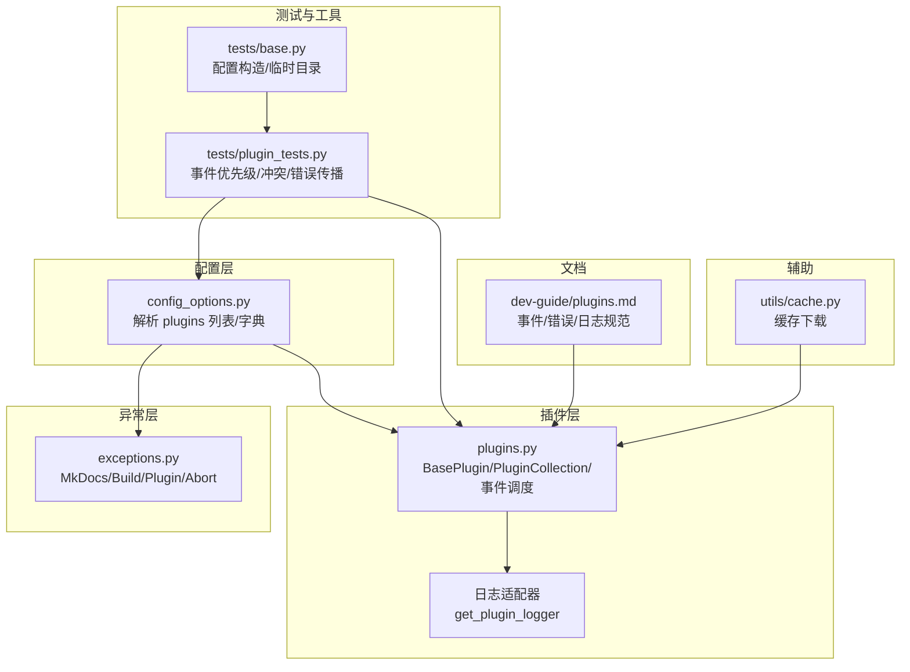
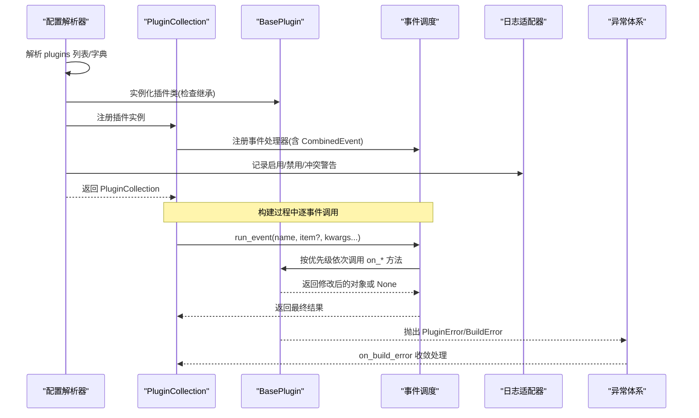
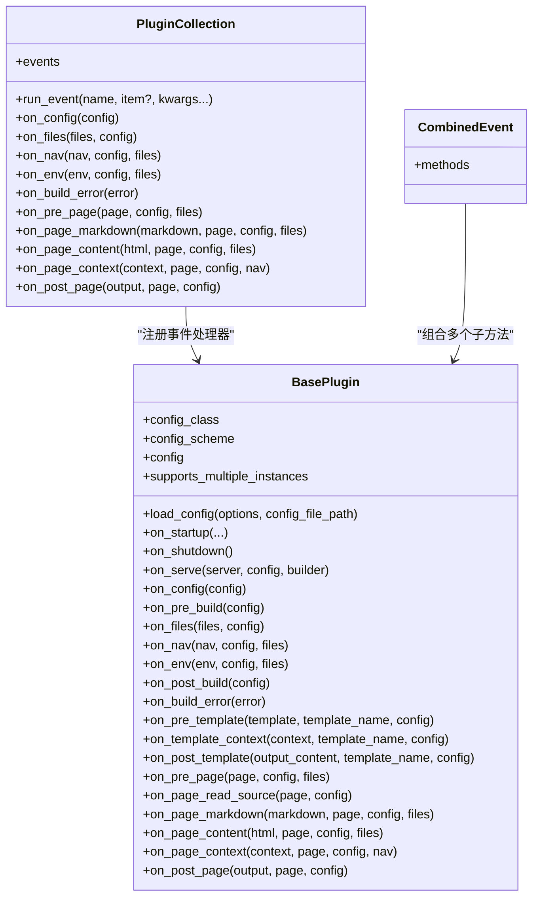
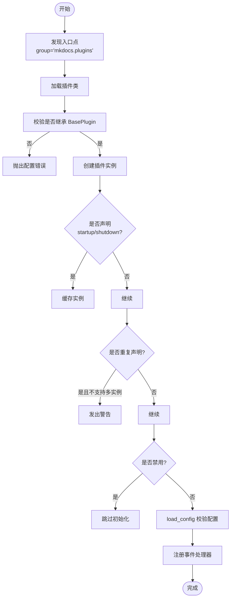
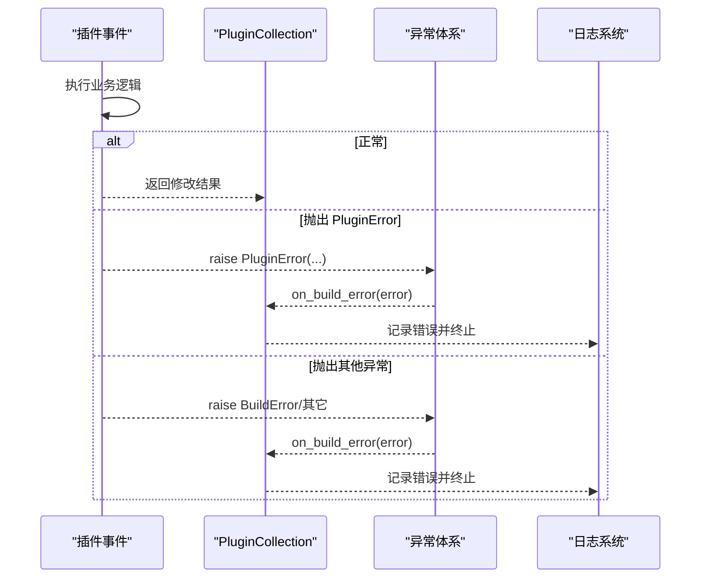

# 插件问题

<cite>
**本文引用的文件**
- [mkdocs/plugins.py](file://mkdocs/plugins.py)
- [mkdocs/config/config_options.py](file://mkdocs/config/config_options.py)
- [mkdocs/exceptions.py](file://mkdocs/exceptions.py)
- [mkdocs/tests/plugin_tests.py](file://mkdocs/tests/plugin_tests.py)
- [docs/dev-guide/plugins.md](file://docs/dev-guide/plugins.md)
- [mkdocs/tests/base.py](file://mkdocs/tests/base.py)
- [mkdocs/utils/cache.py](file://mkdocs/utils/cache.py)
</cite>

## 目录
1. [简介](#简介)
2. [项目结构](#项目结构)
3. [核心组件](#核心组件)
4. [架构总览](#架构总览)
5. [详细组件分析](#详细组件分析)
6. [依赖关系分析](#依赖关系分析)
7. [性能考量](#性能考量)
8. [故障排除指南](#故障排除指南)
9. [结论](#结论)
10. [附录](#附录)

## 简介
本指南聚焦 MkDocs 插件系统的故障排除与调试，覆盖插件加载失败、事件钩子冲突、插件间兼容性问题、日志与调试方法、性能与内存问题诊断、版本与依赖冲突处理，以及插件开发与测试最佳实践。内容基于源码与官方文档，帮助用户快速定位并解决常见问题。

## 项目结构
围绕插件系统的关键模块：
- 插件运行时与事件调度：mkdocs/plugins.py
- 配置解析与插件实例化：mkdocs/config/config_options.py
- 异常类型与错误传播：mkdocs/exceptions.py
- 测试用例与断言工具：mkdocs/tests/plugin_tests.py、mkdocs/tests/base.py
- 开发者文档与事件说明：docs/dev-guide/plugins.md
- 缓存与网络下载辅助：mkdocs/utils/cache.py

图表来源
- [mkdocs/config/config_options.py](file://mkdocs/config/config_options.py#L1045-L1165)
- [mkdocs/plugins.py](file://mkdocs/plugins.py#L493-L698)
- [mkdocs/exceptions.py](file://mkdocs/exceptions.py#L1-L42)
- [mkdocs/tests/plugin_tests.py](file://mkdocs/tests/plugin_tests.py#L105-L329)
- [docs/dev-guide/plugins.md](file://docs/dev-guide/plugins.md#L426-L514)
- [mkdocs/utils/cache.py](file://mkdocs/utils/cache.py#L1-L37)

章节来源
- [mkdocs/plugins.py](file://mkdocs/plugins.py#L1-L698)
- [mkdocs/config/config_options.py](file://mkdocs/config/config_options.py#L1045-L1165)
- [docs/dev-guide/plugins.md](file://docs/dev-guide/plugins.md#L1-L567)

## 核心组件
- BasePlugin：定义插件基类与所有事件钩子签名，提供配置加载与事件装饰器。
- PluginCollection：维护插件集合与事件注册，按优先级顺序执行事件。
- 配置解析器 Plugins：从配置中解析插件列表/字典，实例化插件并校验。
- 异常体系：MkDocsException、ConfigurationError、BuildError、PluginError、Abort。
- 日志适配器：PrefixedLogger 与 get_plugin_logger，统一插件日志格式。
- 测试框架：断言插件事件注册、优先级排序、冲突警告、错误传播。

章节来源
- [mkdocs/plugins.py](file://mkdocs/plugins.py#L58-L698)
- [mkdocs/config/config_options.py](file://mkdocs/config/config_options.py#L1045-L1165)
- [mkdocs/exceptions.py](file://mkdocs/exceptions.py#L1-L42)
- [docs/dev-guide/plugins.md](file://docs/dev-guide/plugins.md#L426-L514)

## 架构总览
下图展示插件从配置到事件执行的端到端流程，包括冲突检测、优先级排序与错误传播。

图表来源
- [mkdocs/config/config_options.py](file://mkdocs/config/config_options.py#L1045-L1165)
- [mkdocs/plugins.py](file://mkdocs/plugins.py#L493-L698)
- [mkdocs/exceptions.py](file://mkdocs/exceptions.py#L1-L42)

## 详细组件分析

### 插件事件与优先级
- 事件类型：一次性事件（startup/shutdown/serve）、全局事件（config/pre_build/files/nav/env/post_build/build_error）、模板事件（pre_template/template_context/post_template）、页面事件（pre_page/page_read_source/page_markdown/page_content/page_context/post_page）。
- 事件优先级：通过装饰器设置，数值越高越先执行；未设置默认为 0；同优先级按配置顺序执行。
- 组合事件：CombinedEvent 允许同一事件在不同优先级注册多个子方法，形成“多路合并”效果。

图表来源
- [mkdocs/plugins.py](file://mkdocs/plugins.py#L58-L698)

章节来源
- [mkdocs/plugins.py](file://mkdocs/plugins.py#L426-L647)
- [docs/dev-guide/plugins.md](file://docs/dev-guide/plugins.md#L247-L441)

### 插件加载与实例化
- 插件发现：通过入口点 group='mkdocs.plugins' 获取已安装插件，支持覆盖核心插件。
- 实例化：加载插件类，校验是否继承自 BasePlugin；若声明了 startup/shutdown，则缓存实例以跨构建复用。
- 多实例：支持多次声明同一插件，但需插件显式声明支持多实例；否则会发出警告。
- 启用控制：若插件无自身 enabled 选项，可使用通用 enabled 控制；禁用时跳过初始化。

图表来源
- [mkdocs/config/config_options.py](file://mkdocs/config/config_options.py#L1088-L1165)
- [mkdocs/plugins.py](file://mkdocs/plugins.py#L40-L52)

章节来源
- [mkdocs/config/config_options.py](file://mkdocs/config/config_options.py#L1088-L1165)
- [mkdocs/plugins.py](file://mkdocs/plugins.py#L40-L52)

### 错误处理与日志
- 异常类型：MkDocsException 基类；ConfigurationError 用于配置校验；BuildError 由构建过程触发；PluginError 由插件事件抛出；Abort 用于中断构建。
- 错误传播：事件中抛出的异常会被捕获并转换为用户友好的消息；on_build_error 可用于清理资源。
- 日志规范：建议使用 mkdocs.plugins.<name> 命名空间；get_plugin_logger 提供带插件名前缀的日志器；DEBUG 级别仅在 --verbose/--debug 下显示。

图表来源
- [mkdocs/exceptions.py](file://mkdocs/exceptions.py#L1-L42)
- [mkdocs/plugins.py](file://mkdocs/plugins.py#L240-L251)
- [docs/dev-guide/plugins.md](file://docs/dev-guide/plugins.md#L442-L514)

章节来源
- [mkdocs/exceptions.py](file://mkdocs/exceptions.py#L1-L42)
- [docs/dev-guide/plugins.md](file://docs/dev-guide/plugins.md#L442-L514)

## 依赖关系分析
- 插件发现依赖 importlib.metadata 或 importlib_metadata 的 EntryPoint。
- 配置解析依赖插件入口点映射与实例计数，决定是否缓存实例。
- 事件调度依赖事件名到方法列表的映射，并按优先级排序。
- 日志适配器依赖标准 logging 模块，统一输出格式。

图表来源
- [mkdocs/plugins.py](file://mkdocs/plugins.py#L40-L52)
- [mkdocs/config/config_options.py](file://mkdocs/config/config_options.py#L1105-L1165)
- [mkdocs/plugins.py](file://mkdocs/plugins.py#L509-L573)

章节来源
- [mkdocs/plugins.py](file://mkdocs/plugins.py#L40-L52)
- [mkdocs/config/config_options.py](file://mkdocs/config/config_options.py#L1105-L1165)

## 性能考量
- 事件执行顺序：高优先级先执行，同优先级按配置顺序；避免在高频事件中做昂贵计算。
- 跨构建复用：声明 startup/shutdown 的插件实例会被缓存，减少重复初始化开销。
- 缓存策略：使用缓存下载工具进行外部资源获取，降低重复 I/O。
- 内存管理：避免在事件中持有大对象的长期引用；必要时在 on_build_error 中清理。

章节来源
- [mkdocs/plugins.py](file://mkdocs/plugins.py#L1131-L1132)
- [mkdocs/utils/cache.py](file://mkdocs/utils/cache.py#L16-L36)

## 故障排除指南

### 一、插件加载失败
- 现象
  - “插件未安装”：配置中指定的插件名称不在入口点映射中。
  - “配置无效”：plugins 字段类型不符或子项类型非法。
  - “配置选项非字典”：某插件配置不是字典。
  - “插件类非 BasePlugin 子类”：入口点指向的类不符合要求。
- 排查步骤
  - 确认插件已安装且入口点正确注册。
  - 检查配置 plugins 的类型与结构（列表/字典），确保键值合法。
  - 若插件有 enabled 选项，确认布尔值有效；否则使用通用 enabled 控制。
  - 查看日志中的警告与错误信息，定位具体插件与键名。
- 相关实现
  - 插件发现与实例化：[mkdocs/config/config_options.py](file://mkdocs/config/config_options.py#L1088-L1165)
  - 插件启用/禁用与多实例警告：[mkdocs/config/config_options.py](file://mkdocs/config/config_options.py#L1134-L1149)

章节来源
- [mkdocs/config/config_options.py](file://mkdocs/config/config_options.py#L1088-L1165)

### 二、事件钩子冲突
- 现象
  - 多个插件同时注册同一事件（如 page_read_source），导致冲突。
  - 事件返回 None 时不会改变对象，可能被忽略。
- 排查步骤
  - 使用测试断言验证事件注册与优先级顺序。
  - 在日志中观察冲突警告（例如 page_read_source 冲突）。
  - 通过 CombinedEvent 将同一事件拆分为不同优先级的子方法，避免直接冲突。
- 相关实现
  - 冲突检测与警告：[mkdocs/plugins.py](file://mkdocs/plugins.py#L518-L524)
  - 事件返回行为与空对象处理：[mkdocs/tests/plugin_tests.py](file://mkdocs/tests/plugin_tests.py#L233-L253)
  - 组合事件示例与优先级：[docs/dev-guide/plugins.md](file://docs/dev-guide/plugins.md#L426-L441)

章节来源
- [mkdocs/plugins.py](file://mkdocs/plugins.py#L518-L524)
- [mkdocs/tests/plugin_tests.py](file://mkdocs/tests/plugin_tests.py#L135-L184)
- [docs/dev-guide/plugins.md](file://docs/dev-guide/plugins.md#L426-L441)

### 三、插件间兼容性问题
- 现象
  - 多插件修改同一对象（如 page_content、files、nav），顺序不当造成覆盖或破坏。
  - 插件未声明支持多实例却重复声明，引发警告。
- 排查步骤
  - 明确各插件职责边界，使用事件优先级控制执行顺序。
  - 对需要合并的事件使用 CombinedEvent。
  - 避免在同一事件中对同一对象进行不可逆修改。
- 相关实现
  - 优先级排序与事件注册：[mkdocs/plugins.py](file://mkdocs/plugins.py#L509-L531)
  - 多实例声明警告：[mkdocs/config/config_options.py](file://mkdocs/config/config_options.py#L1134-L1138)

章节来源
- [mkdocs/plugins.py](file://mkdocs/plugins.py#L509-L531)
- [mkdocs/config/config_options.py](file://mkdocs/config/config_options.py#L1134-L1138)

### 四、插件调试与日志记录
- 日志规范
  - 使用 mkdocs.plugins.<name> 命名空间；推荐使用 get_plugin_logger 自动加前缀。
  - DEBUG 级别仅在 --verbose/--debug 下可见；INFO/WARNING 通常可见。
- 调试技巧
  - 在关键事件中打印当前插件名与对象状态。
  - 使用测试断言验证事件返回值与顺序。
- 相关实现
  - 日志适配器与 get_plugin_logger：[mkdocs/plugins.py](file://mkdocs/plugins.py#L649-L698)
  - 文档示例与级别说明：[docs/dev-guide/plugins.md](file://docs/dev-guide/plugins.md#L487-L514)

章节来源
- [mkdocs/plugins.py](file://mkdocs/plugins.py#L649-L698)
- [docs/dev-guide/plugins.md](file://docs/dev-guide/plugins.md#L487-L514)

### 五、插件性能问题与内存泄漏
- 性能问题
  - 高频事件中避免昂贵计算；必要时缓存中间结果。
  - 使用缓存下载工具减少重复 I/O。
- 内存泄漏排查
  - 避免在事件中持有大对象的长期引用。
  - 在 on_build_error 中清理资源，确保异常路径也能回收。
- 相关实现
  - 缓存下载工具：[mkdocs/utils/cache.py](file://mkdocs/utils/cache.py#L16-L36)
  - 资源清理钩子：[mkdocs/plugins.py](file://mkdocs/plugins.py#L240-L251)

章节来源
- [mkdocs/utils/cache.py](file://mkdocs/utils/cache.py#L16-L36)
- [mkdocs/plugins.py](file://mkdocs/plugins.py#L240-L251)

### 六、插件版本兼容性与依赖冲突
- 版本兼容
  - 新版特性（如 CombinedEvent、event_priority）需插件侧向后兼容处理。
  - 对旧版本回退装饰器与描述符的使用。
- 依赖冲突
  - 确保插件依赖与 MkDocs 版本匹配；避免第三方库版本不一致。
  - 使用虚拟环境隔离不同项目的依赖。
- 相关实现
  - 事件优先级装饰器与回退：[mkdocs/plugins.py](file://mkdocs/plugins.py#L426-L457)
  - 组合事件描述符：[mkdocs/plugins.py](file://mkdocs/plugins.py#L460-L491)

章节来源
- [mkdocs/plugins.py](file://mkdocs/plugins.py#L426-L491)

### 七、插件开发与测试最佳实践
- 开发规范
  - 明确 config_scheme，提供默认值与类型校验。
  - 在 on_build_error 中清理资源，保证异常安全。
  - 使用 get_plugin_logger 输出统一格式日志。
- 测试建议
  - 使用测试断言验证事件注册、优先级与冲突警告。
  - 使用临时目录与最小配置快速回归。
- 相关实现
  - 事件优先级与组合事件测试：[mkdocs/tests/plugin_tests.py](file://mkdocs/tests/plugin_tests.py#L135-L184)
  - 配置构造与断言工具：[mkdocs/tests/base.py](file://mkdocs/tests/base.py#L26-L41)
  - 开发者文档与示例：[docs/dev-guide/plugins.md](file://docs/dev-guide/plugins.md#L57-L567)

章节来源
- [mkdocs/tests/plugin_tests.py](file://mkdocs/tests/plugin_tests.py#L105-L329)
- [mkdocs/tests/base.py](file://mkdocs/tests/base.py#L26-L41)
- [docs/dev-guide/plugins.md](file://docs/dev-guide/plugins.md#L57-L567)

## 结论
通过理解插件系统的核心组件、事件机制与错误传播路径，结合日志与测试工具，可以高效定位并解决插件加载、事件冲突、兼容性与性能问题。遵循开发者文档中的最佳实践，有助于提升插件质量与稳定性。

## 附录
- 快速检查清单
  - 插件入口点是否正确注册？
  - 配置 plugins 类型与键值是否合法？
  - 是否存在同一事件的多重注册？是否使用 CombinedEvent？
  - 事件优先级是否合理？是否影响其他插件？
  - 日志是否使用统一命名空间？DEBUG 级别是否按预期显示？
  - 是否在 on_build_error 中清理资源？