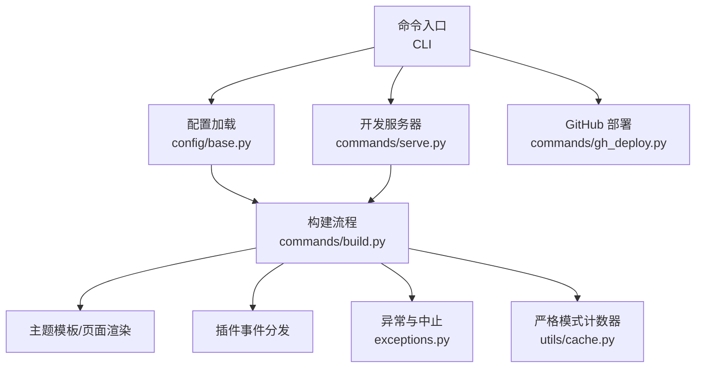
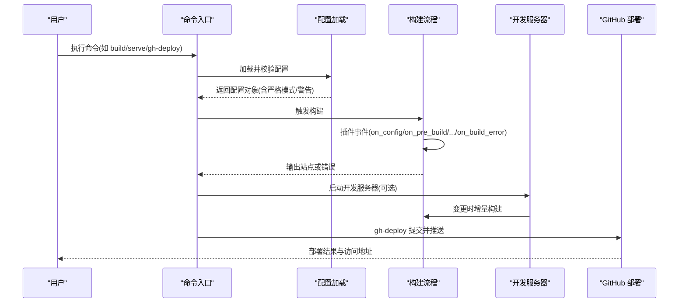
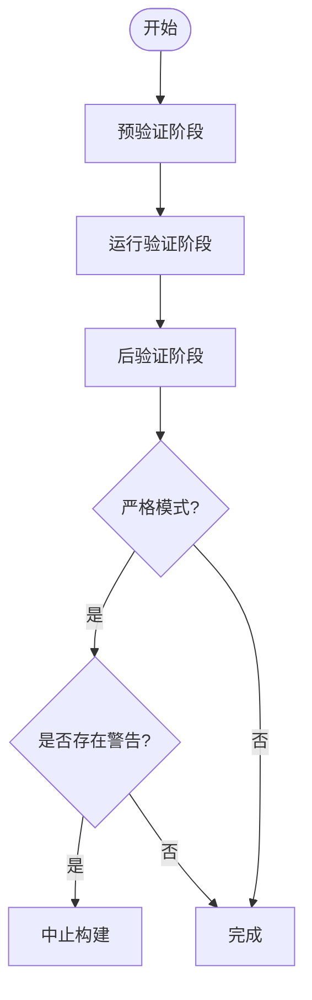
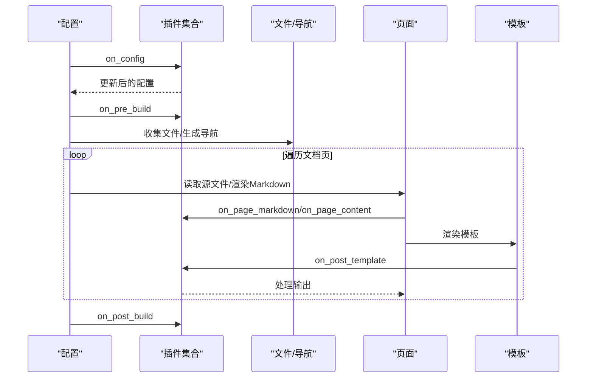
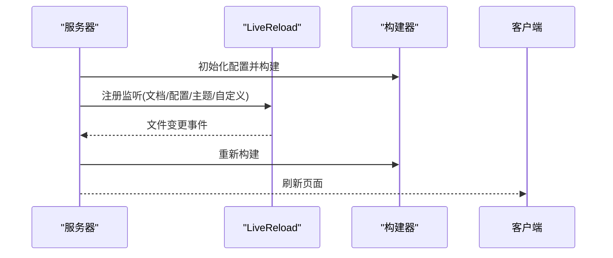
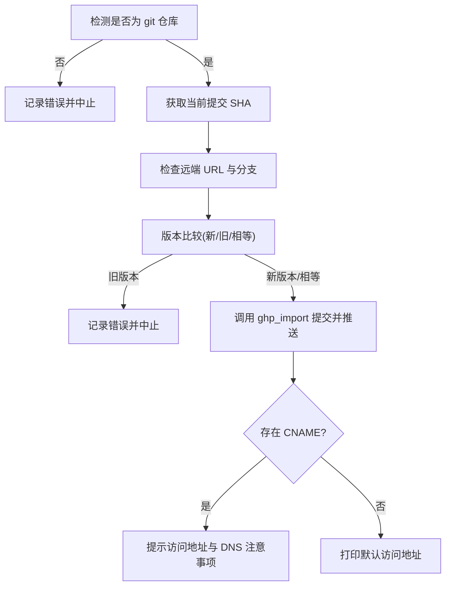
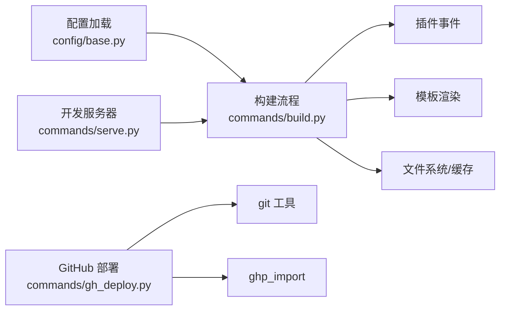

# 故障排除

<cite>
**本文引用的文件**   
- [README.md](file://README.md)
- [mkdocs/exceptions.py](file://mkdocs/exceptions.py)
- [mkdocs/config/base.py](file://mkdocs/config/base.py)
- [mkdocs/commands/build.py](file://mkdocs/commands/build.py)
- [mkdocs/commands/serve.py](file://mkdocs/commands/serve.py)
- [mkdocs/commands/gh_deploy.py](file://mkdocs/commands/gh_deploy.py)
- [docs/user-guide/installation.md](file://docs/user-guide/installation.md)
- [docs/user-guide/configuration.md](file://docs/user-guide/configuration.md)
- [docs/user-guide/deploying-your-docs.md](file://docs/user-guide/deploying-your-docs.md)
- [mkdocs/utils/cache.py](file://mkdocs/utils/cache.py)
- [mkdocs/tests/plugin_tests.py](file://mkdocs/tests/plugin_tests.py)
- [mkdocs/tests/config/base_tests.py](file://mkdocs/tests/config/base_tests.py)
- [mkdocs/tests/cli_tests.py](file://mkdocs/tests/cli_tests.py)
</cite>

## 目录
1. [简介](#简介)
2. [项目结构](#项目结构)
3. [核心组件](#核心组件)
4. [架构总览](#架构总览)
5. [详细组件分析](#详细组件分析)
6. [依赖关系分析](#依赖关系分析)
7. [性能考量](#性能考量)
8. [故障排除指南](#故障排除指南)
9. [结论](#结论)
10. [附录](#附录)

## 简介
本指南面向 MkDocs 用户与维护者，系统化梳理安装、配置、构建与部署等常见问题及解决方案，并提供可操作的诊断流程、调试技巧与最佳实践。文档基于仓库中的实现与用户文档，确保建议与行为一致。

## 项目结构
围绕“故障排除”目标，以下模块与文件最为关键：
- 配置加载与校验：config/base.py
- 构建流程与错误处理：commands/build.py
- 开发服务器与热重载：commands/serve.py
- GitHub Pages 部署：commands/gh_deploy.py
- 异常类型与中止机制：exceptions.py
- 安装与环境要求：docs/user-guide/installation.md
- 配置项与严格模式：docs/user-guide/configuration.md
- 部署与自定义域名：docs/user-guide/deploying-your-docs.md
- 缓存与网络下载：utils/cache.py
- 测试用例（验证异常、严格模式、插件事件）：tests/*

**图表来源**
- [mkdocs/config/base.py](file://mkdocs/config/base.py#L340-L392)
- [mkdocs/commands/build.py](file://mkdocs/commands/build.py#L249-L365)
- [mkdocs/commands/serve.py](file://mkdocs/commands/serve.py#L20-L111)
- [mkdocs/commands/gh_deploy.py](file://mkdocs/commands/gh_deploy.py#L100-L170)
- [mkdocs/exceptions.py](file://mkdocs/exceptions.py#L6-L42)
- [mkdocs/utils/cache.py](file://mkdocs/utils/cache.py#L16-L37)

**章节来源**
- [mkdocs/config/base.py](file://mkdocs/config/base.py#L340-L392)
- [mkdocs/commands/build.py](file://mkdocs/commands/build.py#L249-L365)
- [mkdocs/commands/serve.py](file://mkdocs/commands/serve.py#L20-L111)
- [mkdocs/commands/gh_deploy.py](file://mkdocs/commands/gh_deploy.py#L100-L170)
- [mkdocs/exceptions.py](file://mkdocs/exceptions.py#L6-L42)
- [mkdocs/utils/cache.py](file://mkdocs/utils/cache.py#L16-L37)

## 核心组件
- 配置系统与严格模式
  - 配置加载与校验：支持预/运行/后验证阶段，记录警告并按严格模式中止；支持 strict 模式下统计警告数量并中止。
  - 参考路径：[mkdocs/config/base.py](file://mkdocs/config/base.py#L181-L243)、[mkdocs/config/base.py](file://mkdocs/config/base.py#L340-L392)
- 构建流程与错误传播
  - 插件事件贯穿构建生命周期；对页面/模板读取与渲染过程捕获异常并统一记录；严格模式下根据计数中止。
  - 参考路径：[mkdocs/commands/build.py](file://mkdocs/commands/build.py#L249-L365)
- 开发服务器与热重载
  - 临时目录构建站点，监听变更自动重建；支持禁用 LiveReload、指定监听目录、主题目录监听等。
  - 参考路径：[mkdocs/commands/serve.py](file://mkdocs/commands/serve.py#L20-L111)
- GitHub Pages 部署
  - 检测 git 环境、版本比较、ghp_import 提交与推送；支持 CNAME 文件提示与远程分支/名称配置。
  - 参考路径：[mkdocs/commands/gh_deploy.py](file://mkdocs/commands/gh_deploy.py#L100-L170)
- 异常体系
  - 统一的异常基类、中止、配置错误、构建错误与插件错误类型，便于区分与处理。
  - 参考路径：[mkdocs/exceptions.py](file://mkdocs/exceptions.py#L6-L42)

**章节来源**
- [mkdocs/config/base.py](file://mkdocs/config/base.py#L181-L243)
- [mkdocs/config/base.py](file://mkdocs/config/base.py#L340-L392)
- [mkdocs/commands/build.py](file://mkdocs/commands/build.py#L249-L365)
- [mkdocs/commands/serve.py](file://mkdocs/commands/serve.py#L20-L111)
- [mkdocs/commands/gh_deploy.py](file://mkdocs/commands/gh_deploy.py#L100-L170)
- [mkdocs/exceptions.py](file://mkdocs/exceptions.py#L6-L42)

## 架构总览
下图展示从 CLI 到配置、构建、插件与部署的关键交互：

**图表来源**
- [mkdocs/config/base.py](file://mkdocs/config/base.py#L340-L392)
- [mkdocs/commands/build.py](file://mkdocs/commands/build.py#L249-L365)
- [mkdocs/commands/serve.py](file://mkdocs/commands/serve.py#L20-L111)
- [mkdocs/commands/gh_deploy.py](file://mkdocs/commands/gh_deploy.py#L100-L170)

## 详细组件分析

### 配置加载与严格模式
- 关键点
  - 预验证/运行验证/后验证三阶段，统一抛出校验异常；未识别键名产生警告；严格模式下任何警告导致中止。
  - 支持从文件/字典加载配置，记录调试日志。
- 常见问题定位
  - 配置键拼写错误、类型不匹配、必填项缺失。
  - 严格模式下出现任何警告即失败，需逐条修复。
- 参考路径
  - [mkdocs/config/base.py](file://mkdocs/config/base.py#L181-L243)
  - [mkdocs/config/base.py](file://mkdocs/config/base.py#L340-L392)

**图表来源**
- [mkdocs/config/base.py](file://mkdocs/config/base.py#L181-L243)
- [mkdocs/config/base.py](file://mkdocs/config/base.py#L340-L392)

**章节来源**
- [mkdocs/config/base.py](file://mkdocs/config/base.py#L181-L243)
- [mkdocs/config/base.py](file://mkdocs/config/base.py#L340-L392)

### 构建流程与插件事件
- 关键点
  - 构建前清理站点目录、收集文件、生成导航、渲染页面与模板、校验锚点链接、触发插件事件。
  - 页面/模板读取异常统一记录并抛出；严格模式下统计并可能中止。
- 常见问题定位
  - 模板缺失、页面元数据异常、插件报错、静态资源复制失败。
- 参考路径
  - [mkdocs/commands/build.py](file://mkdocs/commands/build.py#L249-L365)

**图表来源**
- [mkdocs/commands/build.py](file://mkdocs/commands/build.py#L249-L365)

**章节来源**
- [mkdocs/commands/build.py](file://mkdocs/commands/build.py#L249-L365)

### 开发服务器与热重载
- 关键点
  - 使用临时目录作为站点根，监听文档目录、配置文件与主题目录；支持禁用 LiveReload、打开浏览器、指定监听额外目录。
- 常见问题定位
  - 端口占用、路径映射错误、主题文件未被监听、LiveReload 不生效。
- 参考路径
  - [mkdocs/commands/serve.py](file://mkdocs/commands/serve.py#L20-L111)

**图表来源**
- [mkdocs/commands/serve.py](file://mkdocs/commands/serve.py#L20-L111)

**章节来源**
- [mkdocs/commands/serve.py](file://mkdocs/commands/serve.py#L20-L111)

### GitHub Pages 部署
- 关键点
  - 检查 git 环境、当前 SHA、远程分支/名称、版本比较；通过 ghp_import 提交与推送；支持 CNAME 文件提示。
- 常见问题定位
  - 未在 git 仓库中、权限不足、远程分支/名称错误、版本回退限制、CNAME 未同步。
- 参考路径
  - [mkdocs/commands/gh_deploy.py](file://mkdocs/commands/gh_deploy.py#L100-L170)

**图表来源**
- [mkdocs/commands/gh_deploy.py](file://mkdocs/commands/gh_deploy.py#L100-L170)

**章节来源**
- [mkdocs/commands/gh_deploy.py](file://mkdocs/commands/gh_deploy.py#L100-L170)

## 依赖关系分析
- 配置层依赖
  - 配置加载依赖 YAML 解析与 schema 校验，严格模式依赖计数处理器。
- 构建层依赖
  - 构建流程依赖插件事件、Jinja2 模板、文件系统与缓存工具。
- 服务器与部署
  - 服务器依赖 LiveReload；部署依赖 git 与第三方导入工具。

**图表来源**
- [mkdocs/config/base.py](file://mkdocs/config/base.py#L340-L392)
- [mkdocs/commands/build.py](file://mkdocs/commands/build.py#L249-L365)
- [mkdocs/commands/serve.py](file://mkdocs/commands/serve.py#L20-L111)
- [mkdocs/commands/gh_deploy.py](file://mkdocs/commands/gh_deploy.py#L100-L170)

**章节来源**
- [mkdocs/config/base.py](file://mkdocs/config/base.py#L340-L392)
- [mkdocs/commands/build.py](file://mkdocs/commands/build.py#L249-L365)
- [mkdocs/commands/serve.py](file://mkdocs/commands/serve.py#L20-L111)
- [mkdocs/commands/gh_deploy.py](file://mkdocs/commands/gh_deploy.py#L100-L170)

## 性能考量
- 仅在必要时进行全量构建：开发时使用服务器与增量构建，避免不必要的磁盘 IO。
- 谨慎启用严格模式于 CI：严格模式会将警告转为错误，有助于质量控制但可能阻塞流水线。
- 插件事件开销：避免在高频事件中执行昂贵操作，必要时使用延迟计算或缓存。
- 静态资源与模板：减少不必要的 extra 资源与模板，降低渲染压力。

## 故障排除指南

### 一、安装与环境问题
- 症状
  - 命令不可用、版本信息无法显示、Windows 下命令无效。
- 排查步骤
  - 确认已安装 Python 与 pip；升级 pip 至最新版本。
  - 在 Windows 上使用 python -m pip 与 python -m mkdocs。
  - 将 Python Scripts 目录加入 PATH。
- 参考路径
  - [docs/user-guide/installation.md](file://docs/user-guide/installation.md#L1-L108)

**章节来源**
- [docs/user-guide/installation.md](file://docs/user-guide/installation.md#L1-L108)

### 二、配置错误
- 症状
  - 配置加载失败、键名拼写错误、类型不匹配、严格模式下构建中止。
- 排查步骤
  - 检查配置文件路径与命名（默认 mkdocs.yml 或 mkdocs.yaml）。
  - 使用严格模式定位警告来源，逐项修正。
  - 查看未识别键名警告，确认键名正确。
- 参考路径
  - [mkdocs/config/base.py](file://mkdocs/config/base.py#L340-L392)
  - [mkdocs/tests/config/base_tests.py](file://mkdocs/tests/config/base_tests.py#L160-L225)

**章节来源**
- [mkdocs/config/base.py](file://mkdocs/config/base.py#L340-L392)
- [mkdocs/tests/config/base_tests.py](file://mkdocs/tests/config/base_tests.py#L160-L225)

### 三、构建失败
- 症状
  - 页面渲染失败、模板缺失、空输出、锚点链接失效。
- 排查步骤
  - 查看页面/模板读取日志，确认路径与权限。
  - 检查插件事件链路，定位具体环节。
  - 严格模式下查看警告计数并修复。
- 参考路径
  - [mkdocs/commands/build.py](file://mkdocs/commands/build.py#L147-L247)
  - [mkdocs/commands/build.py](file://mkdocs/commands/build.py#L341-L351)

**章节来源**
- [mkdocs/commands/build.py](file://mkdocs/commands/build.py#L147-L247)
- [mkdocs/commands/build.py](file://mkdocs/commands/build.py#L341-L351)

### 四、开发服务器与热重载问题
- 症状
  - 无法启动、端口占用、LiveReload 不刷新、路径映射错误。
- 排查步骤
  - 更换 dev_addr，确认端口可用。
  - 检查 site_url 与 mount 路径，确保与预期一致。
  - 确认监听目录包含 docs_dir、config_file_path 与主题目录。
- 参考路径
  - [mkdocs/commands/serve.py](file://mkdocs/commands/serve.py#L20-L111)

**章节来源**
- [mkdocs/commands/serve.py](file://mkdocs/commands/serve.py#L20-L111)

### 五、部署到 GitHub Pages 问题
- 症状
  - 非 git 仓库、版本回退限制、CNAME 未生效、自定义域名解析失败。
- 排查步骤
  - 确保在 git 仓库中运行部署命令。
  - 若使用旧版本部署，按提示使用忽略版本参数或升级。
  - 将 CNAME 文件置于 docs_dir 并随构建一起推送。
  - 检查 DNS 记录与 GitHub Pages 设置。
- 参考路径
  - [mkdocs/commands/gh_deploy.py](file://mkdocs/commands/gh_deploy.py#L100-L170)
  - [docs/user-guide/deploying-your-docs.md](file://docs/user-guide/deploying-your-docs.md#L78-L95)

**章节来源**
- [mkdocs/commands/gh_deploy.py](file://mkdocs/commands/gh_deploy.py#L100-L170)
- [docs/user-guide/deploying-your-docs.md](file://docs/user-guide/deploying-your-docs.md#L78-L95)

### 六、调试模式与详细日志
- 使用方式
  - CLI 提供详细/安静选项，调整日志级别；严格模式下统计警告并可能中止。
- 参考路径
  - [mkdocs/__main__.py](file://mkdocs/__main__.py#L163-L206)
  - [mkdocs/commands/build.py](file://mkdocs/commands/build.py#L253-L257)

**章节来源**
- [mkdocs/__main__.py](file://mkdocs/__main__.py#L163-L206)
- [mkdocs/commands/build.py](file://mkdocs/commands/build.py#L253-L257)

### 七、插件错误与事件冲突
- 症状
  - 插件抛出异常、多个插件注册同一事件导致冲突、构建错误事件未处理。
- 排查步骤
  - 使用插件日志记录并在严格模式下观察警告。
  - 避免重复注册互斥事件；在 on_build_error 中清理资源。
- 参考路径
  - [mkdocs/tests/plugin_tests.py](file://mkdocs/tests/plugin_tests.py#L266-L328)
  - [docs/dev-guide/plugins.md](file://docs/dev-guide/plugins.md#L467-L514)

**章节来源**
- [mkdocs/tests/plugin_tests.py](file://mkdocs/tests/plugin_tests.py#L266-L328)
- [docs/dev-guide/plugins.md](file://docs/dev-guide/plugins.md#L467-L514)

### 八、网络与缓存问题
- 症状
  - 下载外部资源失败、缓存过期或损坏。
- 排查步骤
  - 检查网络连通性与代理设置；更新缓存策略或手动清理缓存目录。
- 参考路径
  - [mkdocs/utils/cache.py](file://mkdocs/utils/cache.py#L16-L37)

**章节来源**
- [mkdocs/utils/cache.py](file://mkdocs/utils/cache.py#L16-L37)

### 九、社区支持与获取帮助
- 获取帮助
  - 使用 Discussions 进行提问与讨论；小问题可在聊天室沟通；Bug 报告与功能请求提交 Issue。
- 参考路径
  - [README.md](file://README.md#L26-L42)

**章节来源**
- [README.md](file://README.md#L26-L42)

## 结论
通过理解配置、构建、服务器与部署的内部流程，结合严格模式与日志级别控制，可以高效定位并解决大多数 MkDocs 使用问题。建议在本地开发中使用服务器与热重载，在 CI 中启用严格模式以提升质量，并在部署前核对配置与环境。

## 附录

### A. 常见命令与选项速查
- 安装与版本
  - 参考路径：[docs/user-guide/installation.md](file://docs/user-guide/installation.md#L53-L67)
- 配置与严格模式
  - 参考路径：[docs/user-guide/configuration.md](file://docs/user-guide/configuration.md#L714-L722)
- 部署到 GitHub Pages
  - 参考路径：[docs/user-guide/deploying-your-docs.md](file://docs/user-guide/deploying-your-docs.md#L22-L31)

**章节来源**
- [docs/user-guide/installation.md](file://docs/user-guide/installation.md#L53-L67)
- [docs/user-guide/configuration.md](file://docs/user-guide/configuration.md#L714-L722)
- [docs/user-guide/deploying-your-docs.md](file://docs/user-guide/deploying-your-docs.md#L22-L31)