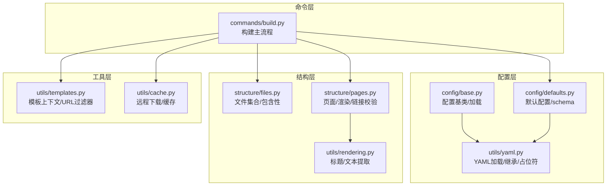
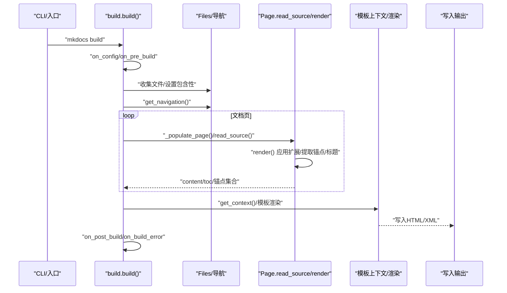
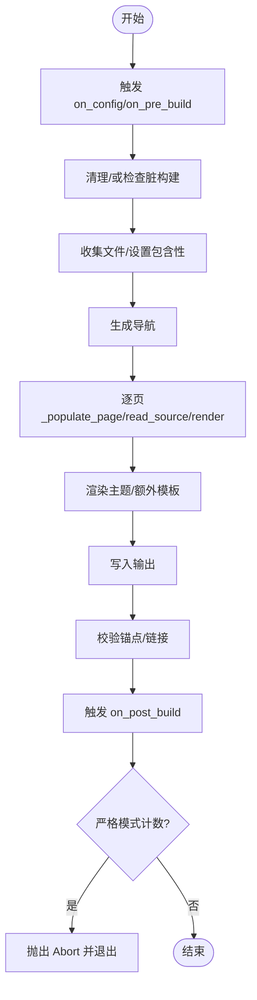
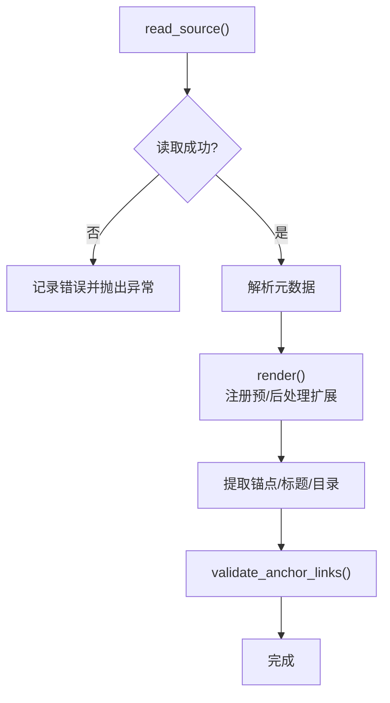
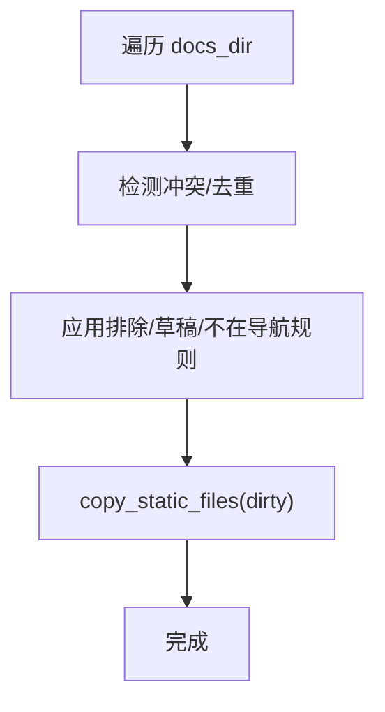
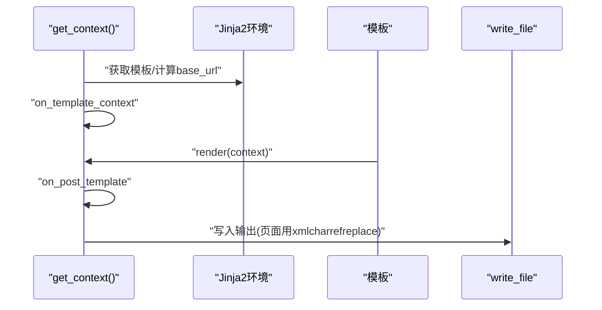
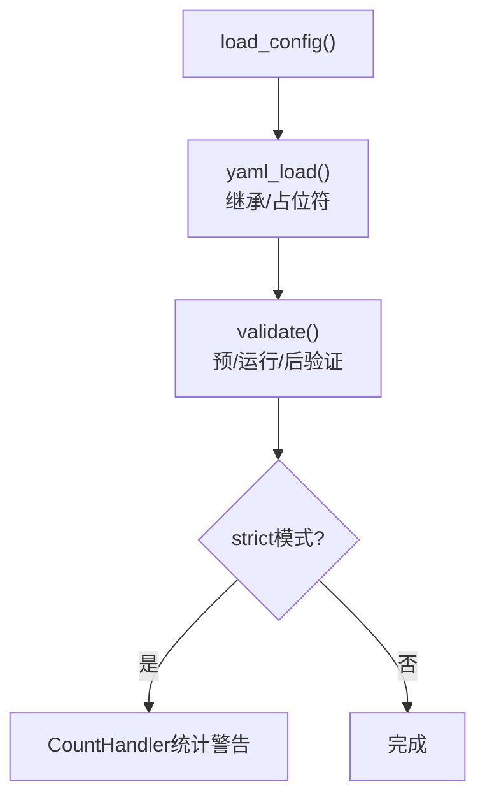
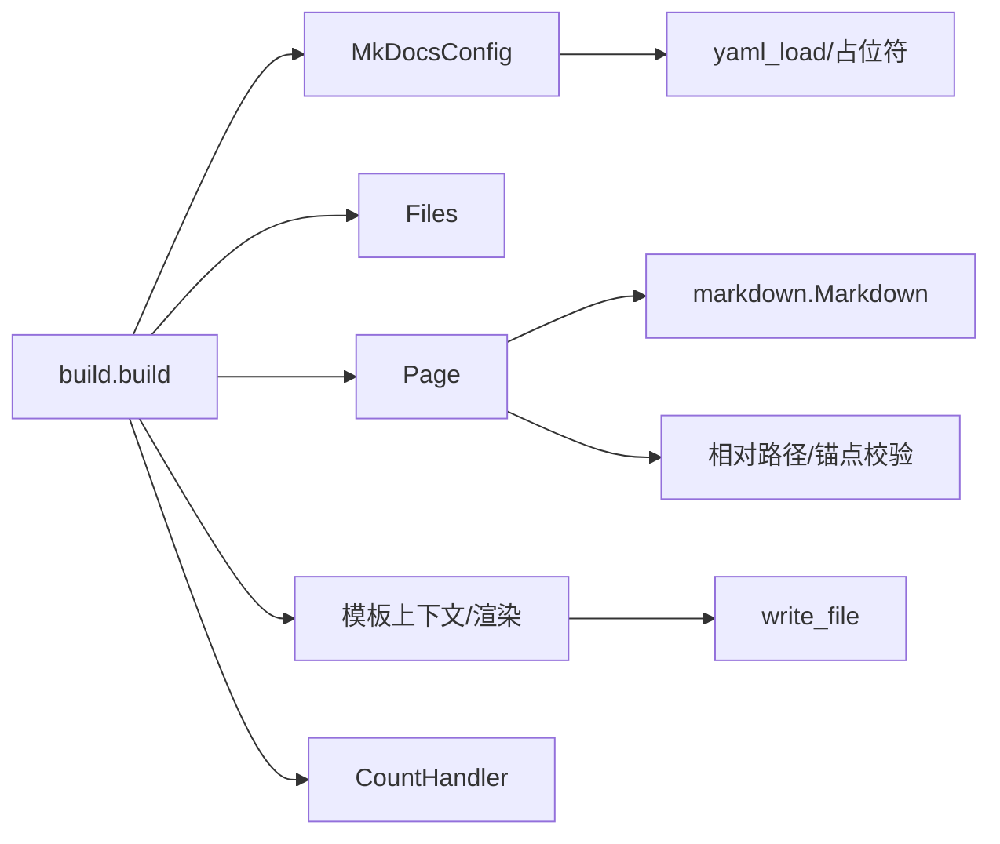

# 构建失败

<cite>
**本文引用的文件**
- [mkdocs/commands/build.py](file://mkdocs/commands/build.py)
- [mkdocs/exceptions.py](file://mkdocs/exceptions.py)
- [mkdocs/utils/rendering.py](file://mkdocs/utils/rendering.py)
- [mkdocs/structure/pages.py](file://mkdocs/structure/pages.py)
- [mkdocs/config/base.py](file://mkdocs/config/base.py)
- [mkdocs/config/defaults.py](file://mkdocs/config/defaults.py)
- [mkdocs/utils/templates.py](file://mkdocs/utils/templates.py)
- [mkdocs/structure/files.py](file://mkdocs/structure/files.py)
- [mkdocs/utils/yaml.py](file://mkdocs/utils/yaml.py)
- [mkdocs/utils/cache.py](file://mkdocs/utils/cache.py)
- [mkdocs/tests/plugin_tests.py](file://mkdocs/tests/plugin_tests.py)
- [mkdocs/tests/build_tests.py](file://mkdocs/tests/build_tests.py)
- [mkdocs/tests/utils/utils_tests.py](file://mkdocs/tests/utils/utils_tests.py)
- [mkdocs/__main__.py](file://mkdocs/__main__.py)
</cite>

## 目录
1. [简介](#简介)
2. [项目结构](#项目结构)
3. [核心组件](#核心组件)
4. [架构总览](#架构总览)
5. [详细组件分析](#详细组件分析)
6. [依赖关系分析](#依赖关系分析)
7. [性能考量](#性能考量)
8. [故障排除指南](#故障排除指南)
9. [结论](#结论)
10. [附录](#附录)

## 简介
本指南聚焦于 MkDocs 构建过程中的常见故障与排错方法，覆盖以下方面：
- Markdown 解析错误：元数据读取、编码问题、扩展配置导致的解析异常
- 模板渲染失败：Jinja2 模板缺失、上下文构造错误、过滤器与脚本注入异常
- 页面生成异常：页面内容为空、相对路径转换、锚点链接校验失败
- 链接失效：内部文档链接未找到、绝对链接策略、锚点不存在
- 文件编码与特殊字符：UTF-8/UTF-8-sig 读取、Windows 路径分隔符、非 ASCII 字符
- 调试模式与严格模式：日志级别、计数处理器、插件事件钩子
- 性能问题：静态资源复制、增量构建、缓存与网络下载

## 项目结构
MkDocs 的构建流程由命令层、配置层、结构层、工具层协同完成。命令层负责编排构建步骤；配置层负责加载与验证配置；结构层负责文件与页面对象；工具层提供渲染、模板、YAML 加载、缓存等通用能力。

**图表来源**
- [mkdocs/commands/build.py](file://mkdocs/commands/build.py#L249-L370)
- [mkdocs/config/base.py](file://mkdocs/config/base.py#L340-L393)
- [mkdocs/config/defaults.py](file://mkdocs/config/defaults.py#L38-L219)
- [mkdocs/utils/yaml.py](file://mkdocs/utils/yaml.py#L128-L151)
- [mkdocs/structure/files.py](file://mkdocs/structure/files.py#L62-L137)
- [mkdocs/structure/pages.py](file://mkdocs/structure/pages.py#L208-L327)
- [mkdocs/utils/rendering.py](file://mkdocs/utils/rendering.py#L22-L105)
- [mkdocs/utils/templates.py](file://mkdocs/utils/templates.py#L25-L56)
- [mkdocs/utils/cache.py](file://mkdocs/utils/cache.py#L10-L37)

**章节来源**
- [mkdocs/commands/build.py](file://mkdocs/commands/build.py#L249-L370)
- [mkdocs/config/defaults.py](file://mkdocs/config/defaults.py#L38-L219)
- [mkdocs/structure/files.py](file://mkdocs/structure/files.py#L62-L137)
- [mkdocs/structure/pages.py](file://mkdocs/structure/pages.py#L208-L327)
- [mkdocs/utils/templates.py](file://mkdocs/utils/templates.py#L25-L56)
- [mkdocs/utils/yaml.py](file://mkdocs/utils/yaml.py#L128-L151)
- [mkdocs/utils/rendering.py](file://mkdocs/utils/rendering.py#L22-L105)
- [mkdocs/utils/cache.py](file://mkdocs/utils/cache.py#L10-L37)

## 核心组件
- 构建主流程：负责清理站点目录、收集文件、生成导航、渲染页面与模板、执行插件事件、输出结果与统计
- 页面对象：负责读取源文件、解析元数据、应用 Markdown 扩展、提取锚点与标题、进行链接校验
- 文件集合：负责遍历 docs 目录、设置包含性（排除/草稿/不在导航）、复制静态资源
- 模板上下文：负责构造全局上下文、URL 规范化、脚本标签生成
- 配置系统：负责加载 YAML、继承父配置、占位符替换、严格模式与警告计数
- 工具函数：渲染辅助（标题/文本提取）、缓存下载、YAML 加载

**章节来源**
- [mkdocs/commands/build.py](file://mkdocs/commands/build.py#L249-L370)
- [mkdocs/structure/pages.py](file://mkdocs/structure/pages.py#L208-L327)
- [mkdocs/structure/files.py](file://mkdocs/structure/files.py#L62-L137)
- [mkdocs/utils/templates.py](file://mkdocs/utils/templates.py#L25-L56)
- [mkdocs/config/base.py](file://mkdocs/config/base.py#L340-L393)
- [mkdocs/utils/yaml.py](file://mkdocs/utils/yaml.py#L128-L151)
- [mkdocs/utils/rendering.py](file://mkdocs/utils/rendering.py#L22-L105)
- [mkdocs/utils/cache.py](file://mkdocs/utils/cache.py#L10-L37)

## 架构总览
下图展示了从命令到页面渲染与模板输出的关键调用链，以及插件事件在各阶段的触发点。

**图表来源**
- [mkdocs/commands/build.py](file://mkdocs/commands/build.py#L249-L370)
- [mkdocs/structure/pages.py](file://mkdocs/structure/pages.py#L263-L293)
- [mkdocs/utils/templates.py](file://mkdocs/utils/templates.py#L25-L56)
- [mkdocs/structure/files.py](file://mkdocs/structure/files.py#L546-L588)

**章节来源**
- [mkdocs/commands/build.py](file://mkdocs/commands/build.py#L249-L370)
- [mkdocs/structure/pages.py](file://mkdocs/structure/pages.py#L263-L293)
- [mkdocs/utils/templates.py](file://mkdocs/utils/templates.py#L25-L56)
- [mkdocs/structure/files.py](file://mkdocs/structure/files.py#L546-L588)

## 详细组件分析

### 组件A：构建主流程（build.build）
- 清理站点目录、严格模式计数器、插件事件触发
- 收集文件、添加主题静态模板、复制静态资源
- 渲染主题模板与用户自定义模板
- 逐页渲染并写入输出，最后执行链接锚点校验
- 异常处理：区分 BuildError 与普通异常，触发 build_error 插件事件

**图表来源**
- [mkdocs/commands/build.py](file://mkdocs/commands/build.py#L249-L370)

**章节来源**
- [mkdocs/commands/build.py](file://mkdocs/commands/build.py#L249-L370)

### 组件B：页面读取与渲染（Page.read_source/render）
- 读取源文件内容，捕获“文件不存在/编码错误”并转为 BuildError
- 解析元数据（标题、元信息），应用 Markdown 扩展
- 提取锚点 ID、标题、目录，记录跨页锚点引用
- 链接校验：未找到目标、绝对链接策略、锚点不存在、草稿页排除

**图表来源**
- [mkdocs/structure/pages.py](file://mkdocs/structure/pages.py#L208-L327)

**章节来源**
- [mkdocs/structure/pages.py](file://mkdocs/structure/pages.py#L208-L327)

### 组件C：文件集合与包含性（Files/InclusionLevel）
- 遍历 docs 目录，去重与冲突处理（如 index 与 README 冲突）
- 基于 gitignore 风格规则设置包含性（排除/草稿/不在导航）
- 复制静态资源，支持脏构建跳过未修改文件

**图表来源**
- [mkdocs/structure/files.py](file://mkdocs/structure/files.py#L546-L588)
- [mkdocs/structure/files.py](file://mkdocs/structure/files.py#L527-L544)

**章节来源**
- [mkdocs/structure/files.py](file://mkdocs/structure/files.py#L527-L588)

### 组件D：模板上下文与渲染（get_context/_build_template）
- 构造模板上下文（导航、页面序列、base_url、额外脚本/CSS、版本、时间戳）
- 主题模板与用户模板分别处理：缺失模板跳过、空输出告警
- 输出写入时对页面使用 XML 字符引用回退策略，确保字符安全

**图表来源**
- [mkdocs/commands/build.py](file://mkdocs/commands/build.py#L29-L88)
- [mkdocs/utils/templates.py](file://mkdocs/utils/templates.py#L25-L56)

**章节来源**
- [mkdocs/commands/build.py](file://mkdocs/commands/build.py#L29-L88)
- [mkdocs/utils/templates.py](file://mkdocs/utils/templates.py#L25-L56)

### 组件E：配置加载与严格模式（load_config/strict）
- YAML 加载与继承、环境变量标签、相对路径占位符
- 严格模式启用时，统计 WARNING 数量并在结束时中断
- 日志级别控制：--verbose/--quiet/--no-color

**图表来源**
- [mkdocs/config/base.py](file://mkdocs/config/base.py#L340-L393)
- [mkdocs/utils/yaml.py](file://mkdocs/utils/yaml.py#L128-L151)
- [mkdocs/__main__.py](file://mkdocs/__main__.py#L163-L206)

**章节来源**
- [mkdocs/config/base.py](file://mkdocs/config/base.py#L340-L393)
- [mkdocs/utils/yaml.py](file://mkdocs/utils/yaml.py#L128-L151)
- [mkdocs/__main__.py](file://mkdocs/__main__.py#L163-L206)

## 依赖关系分析
- 构建主流程依赖配置系统（MkDocsConfig）与结构层（Files/Navigation/Page）
- 页面渲染依赖 Markdown 扩展与 treeprocessors，同时与链接校验逻辑耦合
- 模板渲染依赖 Jinja2 环境与模板上下文，输出写入依赖 utils.write_file
- 配置层依赖 YAML 加载器与占位符解析，严格模式依赖计数处理器

**图表来源**
- [mkdocs/commands/build.py](file://mkdocs/commands/build.py#L249-L370)
- [mkdocs/structure/pages.py](file://mkdocs/structure/pages.py#L263-L327)
- [mkdocs/utils/templates.py](file://mkdocs/utils/templates.py#L25-L56)
- [mkdocs/config/defaults.py](file://mkdocs/config/defaults.py#L38-L219)
- [mkdocs/utils/yaml.py](file://mkdocs/utils/yaml.py#L128-L151)

**章节来源**
- [mkdocs/commands/build.py](file://mkdocs/commands/build.py#L249-L370)
- [mkdocs/structure/pages.py](file://mkdocs/structure/pages.py#L263-L327)
- [mkdocs/utils/templates.py](file://mkdocs/utils/templates.py#L25-L56)
- [mkdocs/config/defaults.py](file://mkdocs/config/defaults.py#L38-L219)
- [mkdocs/utils/yaml.py](file://mkdocs/utils/yaml.py#L128-L151)

## 性能考量
- 静态资源复制：支持脏构建跳过未修改文件，减少 I/O
- 增量构建：仅在文件修改后重建页面，避免全量重跑
- 缓存下载：远程资源通过缓存模块下载并复用，降低网络开销
- 模板压缩：sitemap.xml 在写入后进行 gzip 压缩，减小体积

**章节来源**
- [mkdocs/commands/build.py](file://mkdocs/commands/build.py#L324-L340)
- [mkdocs/structure/files.py](file://mkdocs/structure/files.py#L495-L501)
- [mkdocs/utils/cache.py](file://mkdocs/utils/cache.py#L16-L37)

## 故障排除指南

### 一、Markdown 解析错误
- 典型症状
  - “文件未找到”或“编码错误”出现在页面读取阶段
  - 元数据解析失败（YAML 错误）
- 排查步骤
  - 检查文档文件是否存在、路径是否正确
  - 确认文件编码为 UTF-8/UTF-8-sig，避免 BOM 导致解析异常
  - 使用严格模式（--strict）查看配置警告汇总
  - 关注插件事件 on_page_read_source 的自定义读取逻辑
- 相关实现位置
  - 页面读取与错误抛出：[mkdocs/structure/pages.py](file://mkdocs/structure/pages.py#L208-L220)
  - YAML 加载与继承：[mkdocs/utils/yaml.py](file://mkdocs/utils/yaml.py#L128-L151)
  - 配置严格模式与警告计数：[mkdocs/config/base.py](file://mkdocs/config/base.py#L340-L393)

**章节来源**
- [mkdocs/structure/pages.py](file://mkdocs/structure/pages.py#L208-L220)
- [mkdocs/utils/yaml.py](file://mkdocs/utils/yaml.py#L128-L151)
- [mkdocs/config/base.py](file://mkdocs/config/base.py#L340-L393)

### 二、模板渲染失败
- 典型症状
  - 主题模板缺失（被跳过）或输出为空（被跳过）
  - 用户自定义模板读取异常
  - 页面输出为空（被跳过）
- 排查步骤
  - 确认模板名称存在于主题或 docs 目录
  - 检查模板语法与上下文变量是否匹配
  - 对页面输出使用 xmlcharrefreplace 回退策略，避免字符编码问题
- 相关实现位置
  - 主题模板构建与写入：[mkdocs/commands/build.py](file://mkdocs/commands/build.py#L91-L122)
  - 用户模板构建与写入：[mkdocs/commands/build.py](file://mkdocs/commands/build.py#L124-L145)
  - 页面写入与回退策略：[mkdocs/commands/build.py](file://mkdocs/commands/build.py#L229-L234)

**章节来源**
- [mkdocs/commands/build.py](file://mkdocs/commands/build.py#L91-L145)
- [mkdocs/commands/build.py](file://mkdocs/commands/build.py#L229-L234)

### 三、页面生成异常
- 典型症状
  - 页面内容为空（被跳过）
  - 相对路径转换异常（图片/链接）
  - 锚点链接校验失败（未找到锚点）
- 排查步骤
  - 检查页面是否被标记为草稿或排除（包含性）
  - 审核链接目标是否存在、是否指向正确的文档或锚点
  - 启用严格模式与详细日志，观察链接校验输出
- 相关实现位置
  - 包含性与排除：[mkdocs/structure/files.py](file://mkdocs/structure/files.py#L527-L544)
  - 相对路径与锚点处理：[mkdocs/structure/pages.py](file://mkdocs/structure/pages.py#L346-L520)
  - 锚点校验：[mkdocs/structure/pages.py](file://mkdocs/structure/pages.py#L304-L327)

**章节来源**
- [mkdocs/structure/files.py](file://mkdocs/structure/files.py#L527-L544)
- [mkdocs/structure/pages.py](file://mkdocs/structure/pages.py#L304-L520)

### 四、链接失效
- 典型症状
  - 未识别的相对链接、未找到的目标、绝对链接策略不一致
  - 锚点不存在或未引用
- 排查步骤
  - 使用配置 validation.links.* 控制日志级别
  - 对草稿页链接进行降级处理（仅记录 INFO）
  - 对邮箱链接自动建议 mailto
- 相关实现位置
  - 链接校验与建议：[mkdocs/structure/pages.py](file://mkdocs/structure/pages.py#L420-L496)

**章节来源**
- [mkdocs/structure/pages.py](file://mkdocs/structure/pages.py#L420-L496)

### 五、文件编码与特殊字符
- 典型症状
  - 读取文件时报编码错误
  - 特殊字符显示异常或模板输出乱码
- 排查步骤
  - 统一使用 UTF-8/UTF-8-sig 编码
  - 页面写入时采用 xmlcharrefreplace 回退策略
  - Windows 路径分隔符在链接中需注意统一为正斜杠
- 相关实现位置
  - 文件读取编码与回退：[mkdocs/structure/files.py](file://mkdocs/structure/files.py#L450-L465)
  - 页面写入回退策略：[mkdocs/commands/build.py](file://mkdocs/commands/build.py#L230-L232)

**章节来源**
- [mkdocs/structure/files.py](file://mkdocs/structure/files.py#L450-L465)
- [mkdocs/commands/build.py](file://mkdocs/commands/build.py#L230-L232)

### 六、调试模式与严格模式
- 调试模式
  - 使用 --verbose 提升日志级别至 DEBUG
  - 使用 --quiet 将日志级别降至 ERROR
  - 使用 --no-color 自定义格式化器
- 严格模式
  - 启用 strict 后，统计 WARNING 并在结束时中断
  - 插件可在事件中记录警告并被严格模式计数
- 相关实现位置
  - 日志级别选项回调：[mkdocs/__main__.py](file://mkdocs/__main__.py#L163-L206)
  - 严格模式计数器：[mkdocs/commands/build.py](file://mkdocs/commands/build.py#L253-L257)
  - 计数器行为测试：[mkdocs/tests/utils/utils_tests.py](file://mkdocs/tests/utils/utils_tests.py#L555-L584)

**章节来源**
- [mkdocs/__main__.py](file://mkdocs/__main__.py#L163-L206)
- [mkdocs/commands/build.py](file://mkdocs/commands/build.py#L253-L257)
- [mkdocs/tests/utils/utils_tests.py](file://mkdocs/tests/utils/utils_tests.py#L555-L584)

### 七、插件错误与构建错误
- 典型症状
  - 插件在不同阶段抛出异常导致构建中断
  - BuildError 与 PluginError 的区别与处理
- 排查步骤
  - 在插件事件中使用 get_plugin_logger 记录日志
  - on_build_error 中进行清理工作
  - 使用测试用例风格定位错误发生阶段
- 相关实现位置
  - 异常类型定义：[mkdocs/exceptions.py](file://mkdocs/exceptions.py#L6-L42)
  - 插件错误示例与日志规范：[docs/dev-guide/plugins.md](file://docs/dev-guide/plugins.md#L467-L514)
  - 构建错误事件与测试：[mkdocs/tests/plugin_tests.py](file://mkdocs/tests/plugin_tests.py#L311-L328)

**章节来源**
- [mkdocs/exceptions.py](file://mkdocs/exceptions.py#L6-L42)
- [docs/dev-guide/plugins.md](file://docs/dev-guide/plugins.md#L467-L514)
- [mkdocs/tests/plugin_tests.py](file://mkdocs/tests/plugin_tests.py#L311-L328)

### 八、性能问题排查与优化
- 静态资源复制
  - 使用脏构建跳过未修改文件，减少 I/O
- 增量构建
  - 仅在文件修改后重建页面
- 缓存与网络
  - 远程资源通过缓存模块下载并复用
- 模板输出
  - sitemap.xml 写入后进行 gzip 压缩
- 相关实现位置
  - 脏构建与跳过逻辑：[mkdocs/structure/files.py](file://mkdocs/structure/files.py#L495-L501)
  - 下载与缓存：[mkdocs/utils/cache.py](file://mkdocs/utils/cache.py#L16-L37)
  - sitemap 压缩：[mkdocs/commands/build.py](file://mkdocs/commands/build.py#L109-L119)

**章节来源**
- [mkdocs/structure/files.py](file://mkdocs/structure/files.py#L495-L501)
- [mkdocs/utils/cache.py](file://mkdocs/utils/cache.py#L16-L37)
- [mkdocs/commands/build.py](file://mkdocs/commands/build.py#L109-L119)

## 结论
MkDocs 的构建过程围绕“配置—文件—页面—模板—输出”的主线展开，关键在于：
- 正确的配置与严格模式下的警告统计
- 页面读取与渲染的健壮性（编码、扩展、锚点）
- 链接与包含性的准确判定
- 插件事件与异常类型的清晰边界
- 增量与缓存机制提升性能

通过本指南提供的定位思路与实现依据，可快速定位并解决大多数构建失败问题。

## 附录
- 常用命令与标志
  - --verbose：提升日志级别至 DEBUG
  - --quiet：将日志级别降至 ERROR
  - --strict：严格模式，统计警告并可能中断
- 参考测试用例
  - 构建上下文与模板渲染测试：[mkdocs/tests/build_tests.py](file://mkdocs/tests/build_tests.py#L29-L200)
  - 插件错误与构建错误测试：[mkdocs/tests/plugin_tests.py](file://mkdocs/tests/plugin_tests.py#L311-L328)
  - 日志计数器行为测试：[mkdocs/tests/utils/utils_tests.py](file://mkdocs/tests/utils/utils_tests.py#L555-L584)