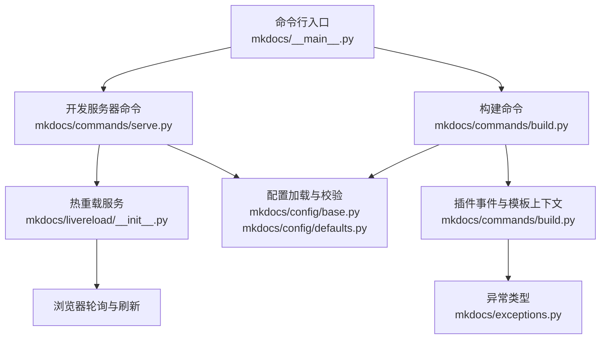
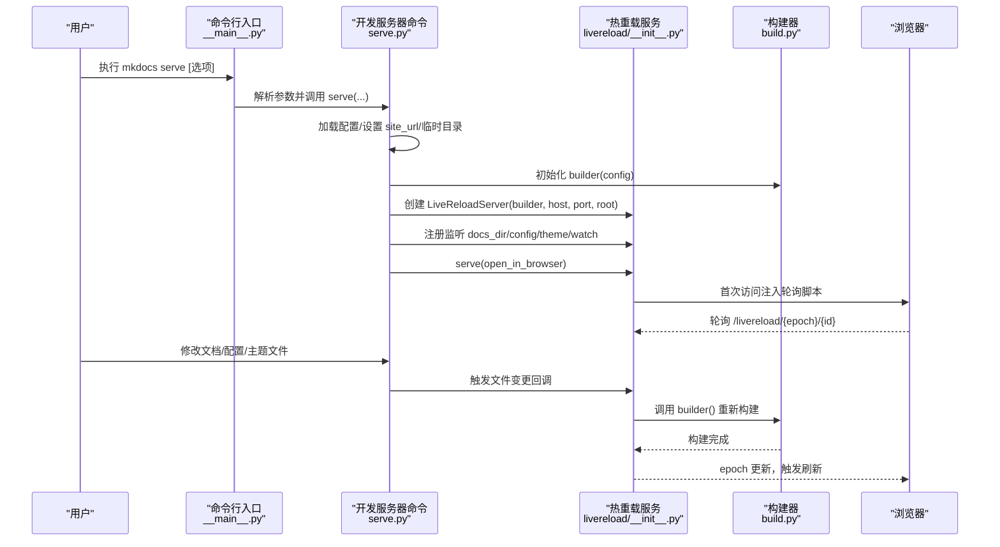
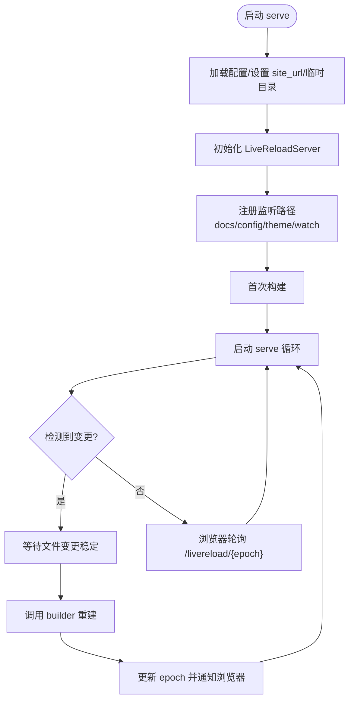
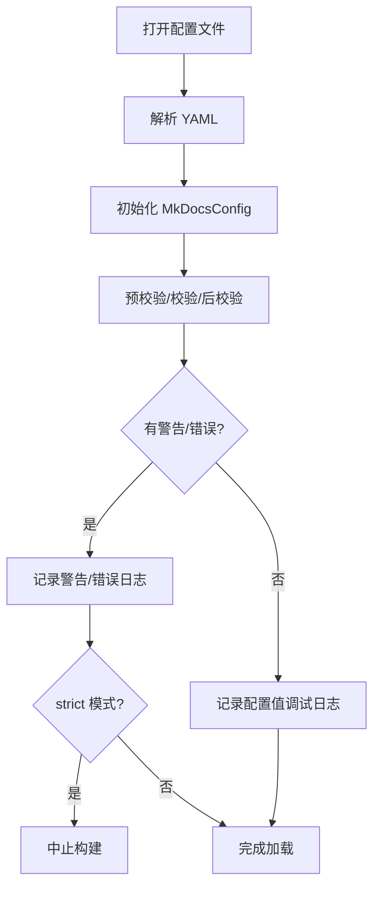
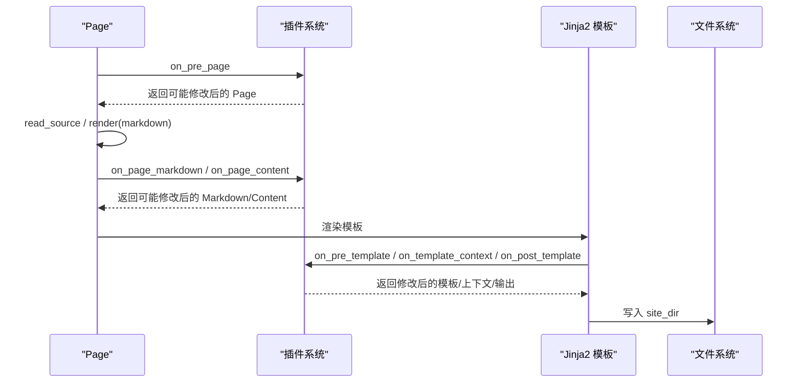
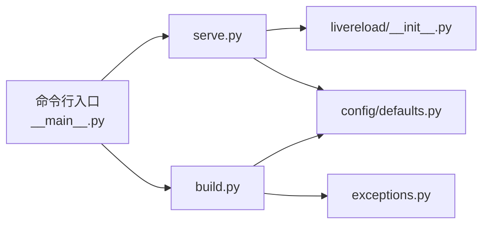

# 调试工具

<cite>
**本文引用的文件**
- [mkdocs\commands\serve.py](file://mkdocs/commands/serve.py)
- [mkdocs\livereload\__init__.py](file://mkdocs/livereload/__init__.py)
- [mkdocs\config\defaults.py](file://mkdocs/config/defaults.py)
- [mkdocs\config\base.py](file://mkdocs/config/base.py)
- [mkdocs\config\config_options.py](file://mkdocs/config/config_options.py)
- [mkdocs\commands\build.py](file://mkdocs/commands/build.py)
- [mkdocs\__main__.py](file://mkdocs/__main__.py)
- [mkdocs\exceptions.py](file://mkdocs/exceptions.py)
- [docs\user-guide\cli.md](file://docs/user-guide/cli.md)
- [docs\dev-guide\plugins.md](file://docs/dev-guide/plugins.md)
- [mkdocs\contrib\search\templates\search\worker.js](file://mkdocs/contrib/search/templates/search/worker.js)
</cite>

## 目录
1. [简介](#简介)
2. [项目结构](#项目结构)
3. [核心组件](#核心组件)
4. [架构总览](#架构总览)
5. [详细组件分析](#详细组件分析)
6. [依赖关系分析](#依赖关系分析)
7. [性能与内存监控](#性能与内存监控)
8. [故障排查指南](#故障排查指南)
9. [结论](#结论)
10. [附录：常用调试命令与技巧](#附录常用调试命令与技巧)

## 简介
本指南面向 MkDocs 用户与插件开发者，系统讲解如何在本地开发与构建过程中进行高效调试。内容覆盖：
- 调试模式与详细日志配置
- 开发服务器（热重载）的调试能力与行为
- 错误日志分析与常见问题定位
- 使用浏览器开发者工具进行前端调试
- 性能分析与内存监控建议
- 自动化调试脚本与工具推荐

## 项目结构
围绕“调试”主题的关键模块与职责：
- 命令入口与日志：命令行参数解析、日志级别控制、颜色输出格式化
- 配置系统：配置加载、校验、严格模式、日志级别映射
- 构建流程：页面读取、Markdown 渲染、模板渲染、静态资源处理
- 开发服务器：热重载、文件监听、浏览器轮询刷新、自定义错误页
- 插件与异常：插件日志规范、统一异常类型

图表来源
- [mkdocs\__main__.py](file://mkdocs/__main__.py#L154-L237)
- [mkdocs\commands\serve.py](file://mkdocs/commands/serve.py#L20-L111)
- [mkdocs\livereload\__init__.py](file://mkdocs/livereload/__init__.py#L94-L382)
- [mkdocs\config\defaults.py](file://mkdocs/config/defaults.py#L38-L219)
- [mkdocs\config\base.py](file://mkdocs/config/base.py#L340-L392)
- [mkdocs\commands\build.py](file://mkdocs/commands/build.py#L29-L122)
- [mkdocs\exceptions.py](file://mkdocs/exceptions.py#L6-L42)

章节来源
- [mkdocs\__main__.py](file://mkdocs/__main__.py#L154-L237)
- [mkdocs\commands\serve.py](file://mkdocs/commands/serve.py#L20-L111)
- [mkdocs\livereload\__init__.py](file://mkdocs/livereload/__init__.py#L94-L382)
- [mkdocs\config\defaults.py](file://mkdocs/config/defaults.py#L38-L219)
- [mkdocs\config\base.py](file://mkdocs/config/base.py#L340-L392)
- [mkdocs\commands\build.py](file://mkdocs/commands/build.py#L29-L122)
- [mkdocs\exceptions.py](file://mkdocs/exceptions.py#L6-L42)

## 核心组件
- 日志与输出控制
  - 通过命令行选项切换日志级别（-v/-q），并使用彩色格式化输出，便于快速定位问题
  - 参考路径：[mkdocs\__main__.py](file://mkdocs/__main__.py#L163-L215)
- 配置系统与严格模式
  - 配置加载、校验、警告与错误记录；严格模式下警告也会中止构建
  - 参考路径：[mkdocs\config\base.py](file://mkdocs/config/base.py#L340-L392)、[mkdocs\config\defaults.py](file://mkdocs/config/defaults.py#L12-L26)
- 开发服务器与热重载
  - 启动临时目录、监听文档、配置与主题变更，自动重建并通知浏览器刷新
  - 参考路径：[mkdocs\commands\serve.py](file://mkdocs/commands/serve.py#L20-L111)、[mkdocs\livereload\__init__.py](file://mkdocs/livereload/__init__.py#L94-L382)
- 构建流程与插件事件
  - 页面读取、Markdown 渲染、模板渲染、插件事件钩子贯穿全流程
  - 参考路径：[mkdocs\commands\build.py](file://mkdocs/commands/build.py#L147-L200)
- 异常体系
  - 统一异常基类、中止、配置错误、构建错误、插件错误
  - 参考路径：[mkdocs\exceptions.py](file://mkdocs/exceptions.py#L6-L42)

章节来源
- [mkdocs\__main__.py](file://mkdocs/__main__.py#L163-L215)
- [mkdocs\config\base.py](file://mkdocs/config/base.py#L340-L392)
- [mkdocs\config\defaults.py](file://mkdocs/config/defaults.py#L12-L26)
- [mkdocs\commands\serve.py](file://mkdocs/commands/serve.py#L20-L111)
- [mkdocs\livereload\__init__.py](file://mkdocs/livereload/__init__.py#L94-L382)
- [mkdocs\commands\build.py](file://mkdocs/commands/build.py#L147-L200)
- [mkdocs\exceptions.py](file://mkdocs/exceptions.py#L6-L42)

## 架构总览
下面以“启动开发服务器并热重载”的主流程为例，展示从命令行到浏览器刷新的关键调用链。

图表来源
- [mkdocs\__main__.py](file://mkdocs/__main__.py#L154-L237)
- [mkdocs\commands\serve.py](file://mkdocs/commands/serve.py#L20-L111)
- [mkdocs\livereload\__init__.py](file://mkdocs/livereload/__init__.py#L94-L382)
- [mkdocs\commands\build.py](file://mkdocs/commands/build.py#L29-L122)

章节来源
- [mkdocs\__main__.py](file://mkdocs/__main__.py#L154-L237)
- [mkdocs\commands\serve.py](file://mkdocs/commands/serve.py#L20-L111)
- [mkdocs\livereload\__init__.py](file://mkdocs/livereload/__init__.py#L94-L382)
- [mkdocs\commands\build.py](file://mkdocs/commands/build.py#L29-L122)

## 详细组件分析

### 组件A：开发服务器与热重载
- 关键点
  - 临时站点目录、默认地址与端口、挂载路径、错误页处理
  - 文件监听策略：文档目录、配置文件、主题目录、额外 watch 列表
  - 构建循环：检测变更、等待稳定、执行 builder、更新 epoch、通知浏览器
  - 浏览器侧：注入轮询脚本，按可见性与超时策略轮询
- 调试要点
  - 使用 -v 提升日志级别，观察“检测到文件变更”“正在重建”“浏览器连接”等关键日志
  - 使用 --open-in-browser 快速验证页面
  - 使用 --livereload/--no-livereload 控制是否启用热重载
  - 使用 --watch 指定额外监听路径
- 参考路径
  - [mkdocs\commands\serve.py](file://mkdocs/commands/serve.py#L20-L111)
  - [mkdocs\livereload\__init__.py](file://mkdocs/livereload/__init__.py#L94-L382)

图表来源
- [mkdocs\commands\serve.py](file://mkdocs/commands/serve.py#L59-L108)
- [mkdocs\livereload\__init__.py](file://mkdocs/livereload/__init__.py#L192-L226)

章节来源
- [mkdocs\commands\serve.py](file://mkdocs/commands/serve.py#L20-L111)
- [mkdocs\livereload\__init__.py](file://mkdocs/livereload/__init__.py#L94-L382)

### 组件B：配置加载与严格模式
- 关键点
  - 配置文件打开、YAML 解析、逐项校验、警告与错误收集
  - 严格模式：警告也会导致构建中止
  - 日志记录：配置项名称、值、警告、错误
- 调试要点
  - 使用 -v 查看“Config value ...”调试信息
  - 使用 --strict 在 CI 中强制质量门槛
  - 使用自定义日志级别映射（如“ignore”对应 DEBUG）
- 参考路径
  - [mkdocs\config\base.py](file://mkdocs/config/base.py#L340-L392)
  - [mkdocs\config\defaults.py](file://mkdocs/config/defaults.py#L12-L26)

图表来源
- [mkdocs\config\base.py](file://mkdocs/config/base.py#L181-L243)
- [mkdocs\config\defaults.py](file://mkdocs/config/defaults.py#L12-L26)

章节来源
- [mkdocs\config\base.py](file://mkdocs/config/base.py#L340-L392)
- [mkdocs\config\defaults.py](file://mkdocs/config/defaults.py#L12-L26)

### 组件C：构建流程与插件事件
- 关键点
  - 页面读取源文件、Markdown 渲染、模板上下文生成、主题模板渲染
  - 插件事件贯穿：预模板、模板上下文、后模板、预页面、页面 Markdown、页面内容
  - 错误处理：捕获异常并记录，必要时抛出构建错误
- 调试要点
  - 使用 -v 查看模板渲染、空输出跳过等信息
  - 在插件中使用命名空间日志（见插件指南），区分不同插件输出
- 参考路径
  - [mkdocs\commands\build.py](file://mkdocs/commands/build.py#L29-L122)
  - [docs\dev-guide\plugins.md](file://docs/dev-guide/plugins.md#L487-L514)

图表来源
- [mkdocs\commands\build.py](file://mkdocs/commands/build.py#L147-L200)
- [docs\dev-guide\plugins.md](file://docs/dev-guide/plugins.md#L487-L514)

章节来源
- [mkdocs\commands\build.py](file://mkdocs/commands/build.py#L29-L122)
- [docs\dev-guide\plugins.md](file://docs/dev-guide/plugins.md#L487-L514)

### 组件D：异常与错误日志
- 关键点
  - 统一异常基类、中止、配置错误、构建错误、插件错误
  - 日志记录：错误消息、堆栈、颜色输出
- 调试要点
  - 遇到构建失败时，优先查看“Error reading page”“Template skipped”等日志
  - 插件抛错应使用 PluginError，以便统一记录与中断
- 参考路径
  - [mkdocs\exceptions.py](file://mkdocs/exceptions.py#L6-L42)
  - [mkdocs\commands\build.py](file://mkdocs/commands/build.py#L174-L180)

章节来源
- [mkdocs\exceptions.py](file://mkdocs/exceptions.py#L6-L42)
- [mkdocs\commands\build.py](file://mkdocs/commands/build.py#L174-L180)

## 依赖关系分析
- 命令行层
  - 通过 Click 定义命令与选项，统一日志状态对象 State，支持 -v/-q、颜色输出、终端宽度自适应
  - 参考路径：[mkdocs\__main__.py](file://mkdocs/__main__.py#L154-L237)
- 服务器层
  - LiveReloadServer 组合 WSGI 与线程池，基于 watchdog 监听文件变化，注入轮询脚本到 HTML
  - 参考路径：[mkdocs\livereload\__init__.py](file://mkdocs/livereload/__init__.py#L94-L382)
- 配置层
  - MkDocsConfig 定义核心配置项（dev_addr、strict、watch、validation 等），并提供日志级别映射
  - 参考路径：[mkdocs\config\defaults.py](file://mkdocs/config/defaults.py#L38-L219)
- 构建层
  - 构建器串联页面读取、插件事件、模板渲染与写盘
  - 参考路径：[mkdocs\commands\build.py](file://mkdocs/commands/build.py#L29-L122)

图表来源
- [mkdocs\__main__.py](file://mkdocs/__main__.py#L154-L237)
- [mkdocs\commands\serve.py](file://mkdocs/commands/serve.py#L20-L111)
- [mkdocs\livereload\__init__.py](file://mkdocs/livereload/__init__.py#L94-L382)
- [mkdocs\config\defaults.py](file://mkdocs/config/defaults.py#L38-L219)
- [mkdocs\commands\build.py](file://mkdocs/commands/build.py#L29-L122)
- [mkdocs\exceptions.py](file://mkdocs/exceptions.py#L6-L42)

章节来源
- [mkdocs\__main__.py](file://mkdocs/__main__.py#L154-L237)
- [mkdocs\commands\serve.py](file://mkdocs/commands/serve.py#L20-L111)
- [mkdocs\livereload\__init__.py](file://mkdocs/livereload/__init__.py#L94-L382)
- [mkdocs\config\defaults.py](file://mkdocs/config/defaults.py#L38-L219)
- [mkdocs\commands\build.py](file://mkdocs/commands/build.py#L29-L122)
- [mkdocs\exceptions.py](file://mkdocs/exceptions.py#L6-L42)

## 性能与内存监控
- 通用建议
  - 使用 -v 获取更详细的构建步骤日志，定位耗时环节（如模板渲染、插件事件）
  - 在 CI 中启用 --strict，提前暴露潜在问题
  - 对大型站点，优先使用 --dirty 仅增量重建（由 serve 的 dirty 参数驱动）
- 前端搜索性能
  - 搜索索引与多语言分词脚本按需加载，可通过浏览器网络面板观察加载顺序与耗时
  - 参考路径：[mkdocs\contrib\search\templates\search\worker.js](file://mkdocs/contrib/search/templates/search/worker.js#L1-L133)
- 实践提示
  - 将大体积资源外链或延迟加载，减少模板渲染压力
  - 合理拆分插件逻辑，避免在 on_pre_template/on_post_template 中做重型计算

[本节为通用指导，不直接分析具体文件，故无章节来源]

## 故障排查指南
- 常见症状与定位
  - “模板为空被跳过”：检查模板是否存在、渲染是否产生空输出
    - 参考路径：[mkdocs\commands\build.py](file://mkdocs/commands/build.py#L120-L122)
  - “页面读取错误”：检查源文件编码、路径、Markdown 语法
    - 参考路径：[mkdocs\commands\build.py](file://mkdocs/commands/build.py#L174-L180)
  - “配置校验失败/警告”：根据日志修正配置项，必要时开启 --strict
    - 参考路径：[mkdocs\config\base.py](file://mkdocs/config/base.py#L374-L392)
- 浏览器端调试
  - 确认轮询脚本已注入（浏览器控制台输出“Enabled live reload”）
  - 观察 Network 面板中 /livereload/* 请求与响应时间
  - 检查 Console 中是否有脚本错误或跨域问题
  - 参考路径：[mkdocs\livereload\__init__.py](file://mkdocs/livereload/__init__.py#L327-L344)
- 插件日志
  - 使用命名空间日志并在 -v 下查看详细调试信息
  - 参考路径：[docs\dev-guide\plugins.md](file://docs/dev-guide/plugins.md#L487-L514)

章节来源
- [mkdocs\commands\build.py](file://mkdocs/commands/build.py#L120-L122)
- [mkdocs\commands\build.py](file://mkdocs/commands/build.py#L174-L180)
- [mkdocs\config\base.py](file://mkdocs/config/base.py#L374-L392)
- [mkdocs\livereload\__init__.py](file://mkdocs/livereload/__init__.py#L327-L344)
- [docs\dev-guide\plugins.md](file://docs/dev-guide/plugins.md#L487-L514)

## 结论
- 通过命令行日志级别与颜色输出快速定位问题
- 利用严格模式与配置校验在早期发现隐患
- 借助热重载与浏览器轮询实现高效迭代
- 使用插件日志规范与异常体系统一调试体验
- 前端搜索与模板渲染是性能优化的重点方向

[本节为总结，不直接分析具体文件，故无章节来源]

## 附录：常用调试命令与技巧
- 基础命令与帮助
  - 参考路径：[docs\user-guide\cli.md](file://docs/user-guide/cli.md#L1-L9)
- 常用选项
  - -v：启用详细输出
  - -q：静音警告
  - --strict：严格模式
  - --livereload / --no-livereload：控制热重载
  - --open-in-browser：首次构建完成后打开浏览器
  - --watch：追加监听路径
  - 参考路径：[mkdocs\__main__.py](file://mkdocs/__main__.py#L154-L237)、[mkdocs\commands\serve.py](file://mkdocs/commands/serve.py#L20-L29)
- 自动化调试脚本建议
  - 使用 shell 脚本或批处理封装常用组合（如 -v --strict --open-in-browser）
  - 在 CI 中固定日志级别并结合严格模式
- 工具推荐
  - 浏览器开发者工具：Network（轮询与资源加载）、Console（脚本错误）、Sources（断点）
  - 终端：配合 -v 输出与颜色格式化，便于快速筛选关键日志

章节来源
- [docs\user-guide\cli.md](file://docs/user-guide/cli.md#L1-L9)
- [mkdocs\__main__.py](file://mkdocs/__main__.py#L154-L237)
- [mkdocs\commands\serve.py](file://mkdocs/commands/serve.py#L20-L29)