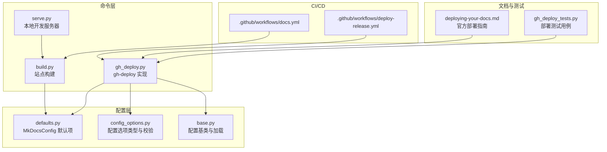
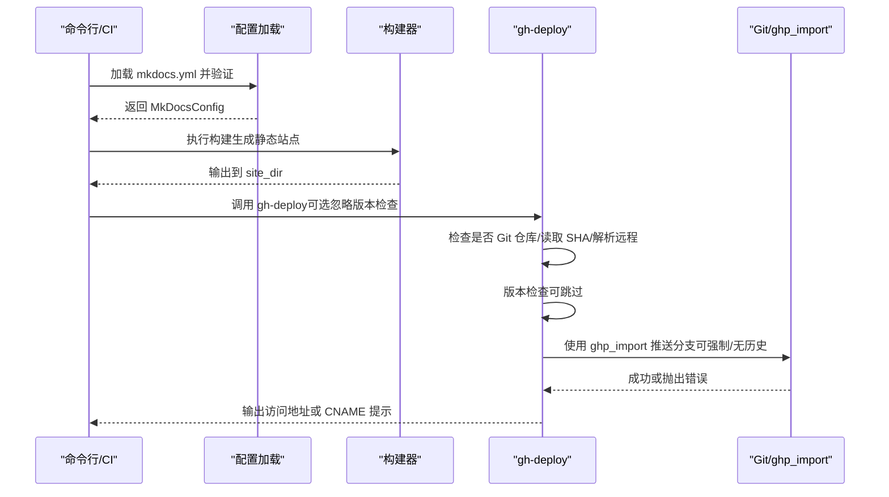
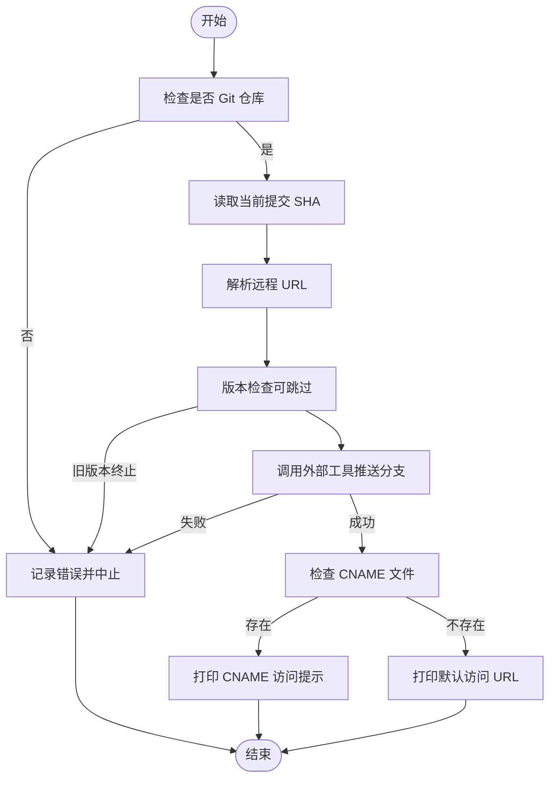
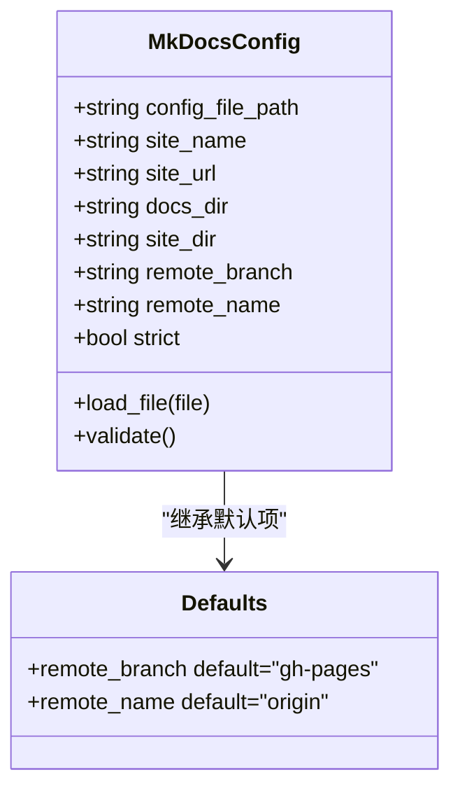
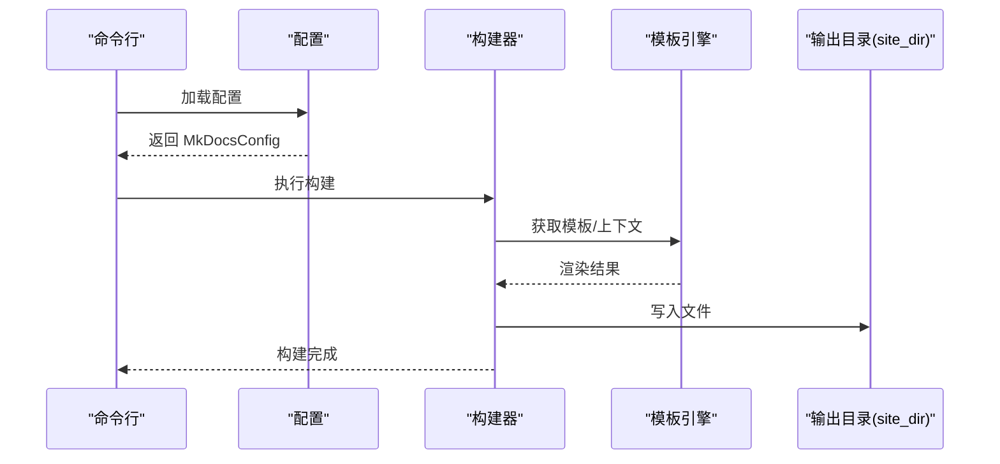
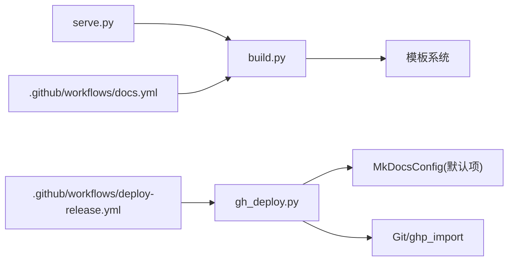

# 部署问题

<cite>
**本文引用的文件**
- [mkdocs/commands/gh_deploy.py](file://mkdocs/commands/gh_deploy.py)
- [mkdocs/config/defaults.py](file://mkdocs/config/defaults.py)
- [mkdocs/config/base.py](file://mkdocs/config/base.py)
- [mkdocs/config/config_options.py](file://mkdocs/config/config_options.py)
- [mkdocs/exceptions.py](file://mkdocs/exceptions.py)
- [mkdocs/commands/build.py](file://mkdocs/commands/build.py)
- [mkdocs/commands/serve.py](file://mkdocs/commands/serve.py)
- [.github/workflows/docs.yml](file://.github/workflows/docs.yml)
- [.github/workflows/deploy-release.yml](file://.github/workflows/deploy-release.yml)
- [docs/user-guide/deploying-your-docs.md](file://docs/user-guide/deploying-your-docs.md)
- [mkdocs/tests/gh_deploy_tests.py](file://mkdocs/tests/gh_deploy_tests.py)
</cite>

## 目录
1. [简介](#简介)
2. [项目结构](#项目结构)
3. [核心组件](#核心组件)
4. [架构总览](#架构总览)
5. [详细组件分析](#详细组件分析)
6. [依赖关系分析](#依赖关系分析)
7. [性能考量](#性能考量)
8. [故障排除指南](#故障排除指南)
9. [结论](#结论)
10. [附录](#附录)

## 简介
本指南聚焦于 MkDocs 的部署问题，覆盖 GitHub Pages 部署失败、自定义域名配置错误、CI/CD 集成问题等常见场景，并提供针对不同部署方式（本地命令与 CI）的诊断方法。同时给出网络与权限排查思路、缓存清理与强制更新建议、部署监控与回滚策略，帮助快速定位并解决问题。

## 项目结构
围绕部署相关的代码主要分布在以下模块：
- 命令层：gh-deploy 实现、构建与本地预览
- 配置层：默认配置项、配置校验与类型约束
- 文档与测试：官方部署指南与单元测试用例
- 工作流：GitHub Actions 示例

图表来源
- [mkdocs/commands/gh_deploy.py](file://mkdocs/commands/gh_deploy.py#L100-L170)
- [mkdocs/config/defaults.py](file://mkdocs/config/defaults.py#L144-L148)
- [mkdocs/config/base.py](file://mkdocs/config/base.py#L340-L392)
- [mkdocs/config/config_options.py](file://mkdocs/config/config_options.py#L774-L803)
- [mkdocs/commands/build.py](file://mkdocs/commands/build.py#L1-L200)
- [mkdocs/commands/serve.py](file://mkdocs/commands/serve.py#L1-L111)
- [.github/workflows/docs.yml](file://.github/workflows/docs.yml#L1-L21)
- [.github/workflows/deploy-release.yml](file://.github/workflows/deploy-release.yml#L1-L23)
- [docs/user-guide/deploying-your-docs.md](file://docs/user-guide/deploying-your-docs.md#L1-L224)
- [mkdocs/tests/gh_deploy_tests.py](file://mkdocs/tests/gh_deploy_tests.py#L1-L186)

章节来源
- [mkdocs/commands/gh_deploy.py](file://mkdocs/commands/gh_deploy.py#L100-L170)
- [mkdocs/config/defaults.py](file://mkdocs/config/defaults.py#L144-L148)
- [mkdocs/config/base.py](file://mkdocs/config/base.py#L340-L392)
- [mkdocs/config/config_options.py](file://mkdocs/config/config_options.py#L774-L803)
- [mkdocs/commands/build.py](file://mkdocs/commands/build.py#L1-L200)
- [mkdocs/commands/serve.py](file://mkdocs/commands/serve.py#L1-L111)
- [.github/workflows/docs.yml](file://.github/workflows/docs.yml#L1-L21)
- [.github/workflows/deploy-release.yml](file://.github/workflows/deploy-release.yml#L1-L23)
- [docs/user-guide/deploying-your-docs.md](file://docs/user-guide/deploying-your-docs.md#L1-L224)
- [mkdocs/tests/gh_deploy_tests.py](file://mkdocs/tests/gh_deploy_tests.py#L1-L186)

## 核心组件
- 部署命令实现（gh-deploy）
  - 检查当前目录是否为 Git 仓库、读取当前提交 SHA、解析远程 URL、版本检查、调用外部工具推送分支、处理 CNAME 文件提示与最终访问地址提示。
- 配置系统
  - 提供 remote_branch、remote_name 等部署相关默认值；配置加载与严格模式；路径与 URL 类型校验。
- 构建与本地服务
  - 构建模板、页面渲染、写入输出；本地开发服务器与热重载。
- CI/CD 工作流
  - 文档构建工作流与发布工作流示例，便于在 CI 中复用。
- 官方部署指南与测试
  - 官方文档说明部署流程与注意事项；测试覆盖关键分支逻辑与日志行为。

章节来源
- [mkdocs/commands/gh_deploy.py](file://mkdocs/commands/gh_deploy.py#L23-L170)
- [mkdocs/config/defaults.py](file://mkdocs/config/defaults.py#L144-L148)
- [mkdocs/config/base.py](file://mkdocs/config/base.py#L340-L392)
- [mkdocs/commands/build.py](file://mkdocs/commands/build.py#L61-L122)
- [mkdocs/commands/serve.py](file://mkdocs/commands/serve.py#L20-L111)
- [docs/user-guide/deploying-your-docs.md](file://docs/user-guide/deploying-your-docs.md#L1-L224)
- [mkdocs/tests/gh_deploy_tests.py](file://mkdocs/tests/gh_deploy_tests.py#L1-L186)

## 架构总览
下图展示了从命令到配置、构建与推送的整体流程，以及 CI 触发点。

图表来源
- [mkdocs/commands/gh_deploy.py](file://mkdocs/commands/gh_deploy.py#L100-L170)
- [mkdocs/config/base.py](file://mkdocs/config/base.py#L340-L392)
- [mkdocs/commands/build.py](file://mkdocs/commands/build.py#L1-L200)
- [.github/workflows/docs.yml](file://.github/workflows/docs.yml#L18-L21)

章节来源
- [mkdocs/commands/gh_deploy.py](file://mkdocs/commands/gh_deploy.py#L100-L170)
- [mkdocs/config/base.py](file://mkdocs/config/base.py#L340-L392)
- [mkdocs/commands/build.py](file://mkdocs/commands/build.py#L1-L200)
- [.github/workflows/docs.yml](file://.github/workflows/docs.yml#L18-L21)

## 详细组件分析

### 组件 A：GitHub Pages 部署流程（gh-deploy）
- 关键职责
  - 校验 Git 仓库状态、读取当前提交 SHA、解析远程 URL、版本检查、调用外部工具推送分支、处理 CNAME 文件与最终访问提示。
- 失败点与诊断
  - 非 Git 仓库：会记录错误并中止。
  - 远程 URL 解析失败：可能指向非 GitHub 场景，需确认企业版或自托管环境。
  - 版本检查：若检测到旧版本部署记录且当前版本更旧，会中止并提示使用忽略参数。
  - 外部工具错误：捕获并记录错误后中止。
- 参数与行为
  - 支持强制推送、不保留历史、忽略版本检查、使用 shell 等选项，影响推送行为与兼容性。

图表来源
- [mkdocs/commands/gh_deploy.py](file://mkdocs/commands/gh_deploy.py#L100-L170)

章节来源
- [mkdocs/commands/gh_deploy.py](file://mkdocs/commands/gh_deploy.py#L23-L170)
- [mkdocs/tests/gh_deploy_tests.py](file://mkdocs/tests/gh_deploy_tests.py#L12-L141)

### 组件 B：配置系统与部署相关项
- 关键配置项
  - remote_branch：默认分支名（用于 gh-deploy 推送）。
  - remote_name：默认远程名（用于 gh-deploy 推送）。
- 配置加载与严格模式
  - 加载 YAML 配置、执行 schema 校验、输出警告与错误、严格模式下遇警告即中止。
- 路径与 URL 校验
  - 对 site_dir、docs_dir、URL 等进行类型与存在性校验，避免部署时路径错误。

图表来源
- [mkdocs/config/defaults.py](file://mkdocs/config/defaults.py#L144-L148)
- [mkdocs/config/base.py](file://mkdocs/config/base.py#L340-L392)
- [mkdocs/config/config_options.py](file://mkdocs/config/config_options.py#L774-L803)

章节来源
- [mkdocs/config/defaults.py](file://mkdocs/config/defaults.py#L144-L148)
- [mkdocs/config/base.py](file://mkdocs/config/base.py#L340-L392)
- [mkdocs/config/config_options.py](file://mkdocs/config/config_options.py#L774-L803)

### 组件 C：构建与本地服务
- 构建流程
  - 渲染主题模板、处理额外模板、页面内容与导航，写入 site_dir。
- 本地服务
  - 启动开发服务器，支持热重载、监听配置与主题变更、错误页回退。

图表来源
- [mkdocs/commands/build.py](file://mkdocs/commands/build.py#L61-L122)
- [mkdocs/commands/serve.py](file://mkdocs/commands/serve.py#L20-L111)

章节来源
- [mkdocs/commands/build.py](file://mkdocs/commands/build.py#L1-L200)
- [mkdocs/commands/serve.py](file://mkdocs/commands/serve.py#L1-L111)

## 依赖关系分析
- 组件耦合
  - gh-deploy 依赖配置系统提供的 remote_branch、remote_name；依赖外部工具进行推送；依赖 Git 子进程调用。
  - 构建器依赖模板系统与插件事件钩子；本地服务依赖构建器与热重载服务器。
- 外部依赖
  - Git 与 ghp_import：用于推送分支与处理 CNAME。
  - GitHub Actions：用于 CI 构建与发布。

图表来源
- [mkdocs/commands/gh_deploy.py](file://mkdocs/commands/gh_deploy.py#L100-L170)
- [mkdocs/config/defaults.py](file://mkdocs/config/defaults.py#L144-L148)
- [mkdocs/commands/build.py](file://mkdocs/commands/build.py#L1-L200)
- [mkdocs/commands/serve.py](file://mkdocs/commands/serve.py#L1-L111)
- [.github/workflows/docs.yml](file://.github/workflows/docs.yml#L18-L21)
- [.github/workflows/deploy-release.yml](file://.github/workflows/deploy-release.yml#L1-L23)

章节来源
- [mkdocs/commands/gh_deploy.py](file://mkdocs/commands/gh_deploy.py#L100-L170)
- [mkdocs/config/defaults.py](file://mkdocs/config/defaults.py#L144-L148)
- [mkdocs/commands/build.py](file://mkdocs/commands/build.py#L1-L200)
- [mkdocs/commands/serve.py](file://mkdocs/commands/serve.py#L1-L111)
- [.github/workflows/docs.yml](file://.github/workflows/docs.yml#L18-L21)
- [.github/workflows/deploy-release.yml](file://.github/workflows/deploy-release.yml#L1-L23)

## 性能考量
- 构建阶段
  - 模板渲染与页面处理的复杂度与文档数量、插件数量、主题大小相关；可通过减少不必要的插件与大资源文件提升速度。
- 传输与推送
  - 使用强制推送与无历史选项可减少历史传播开销，但需谨慎以避免破坏回溯能力。
- 本地开发
  - 热重载仅监听必要路径，避免无关文件频繁触发重建。

## 故障排除指南

### 一、GitHub Pages 部署失败
- 症状
  - 部署中止、日志显示“无法找到 git”、“不是 Git 仓库”、“版本检查失败”、“外部工具错误”等。
- 诊断步骤
  - 确认当前目录为 Git 仓库，且 Git 可用。
  - 检查 remote 名称与分支是否正确（remote_name、remote_branch）。
  - 若启用版本检查且检测到旧版本记录，按提示使用忽略参数或升级版本。
  - 查看外部工具返回的错误信息，确认推送目标可达。
- 解决方案
  - 安装并配置 Git；确保远程 URL 正确；必要时使用忽略版本参数；检查网络与凭据。
  - 如为私有仓库或企业版，确认远程 URL 与认证方式。

章节来源
- [mkdocs/commands/gh_deploy.py](file://mkdocs/commands/gh_deploy.py#L23-L170)
- [mkdocs/tests/gh_deploy_tests.py](file://mkdocs/tests/gh_deploy_tests.py#L12-L141)

### 二、自定义域名配置错误
- 症状
  - 自定义域名未生效、DNS 未解析或 404。
- 诊断步骤
  - 在 docs_dir 根目录放置 CNAME 文件，确保内容为单行裸域名或子域。
  - 确认已复制 CNAME 至 pages 分支根目录，避免下次部署被覆盖。
  - 检查 DNS 记录与 CNAME/ALIAS 设置。
- 解决方案
  - 将 CNAME 文件纳入版本控制并在部署前复制到 docs_dir；遵循官方指南配置 DNS。

章节来源
- [docs/user-guide/deploying-your-docs.md](file://docs/user-guide/deploying-your-docs.md#L78-L95)
- [mkdocs/commands/gh_deploy.py](file://mkdocs/commands/gh_deploy.py#L144-L157)

### 三、CI/CD 集成问题
- 症状
  - CI 构建失败、权限不足、网络超时、缓存冲突。
- 诊断步骤
  - 检查工作流文件中的依赖安装顺序与 Python 版本。
  - 确认构建命令与严格模式设置。
  - 验证部署工作流是否正确配置令牌与推送权限。
- 解决方案
  - 在 CI 中先安装依赖再构建；如需推送，配置合适的令牌与权限；必要时清理缓存后重试。

章节来源
- [.github/workflows/docs.yml](file://.github/workflows/docs.yml#L1-L21)
- [.github/workflows/deploy-release.yml](file://.github/workflows/deploy-release.yml#L1-L23)

### 四、网络连接与权限问题
- 症状
  - 远程不可达、认证失败、网络超时。
- 诊断步骤
  - 使用本地命令验证 Git 远程连通性与凭据。
  - 在 CI 中检查令牌有效期与权限范围。
- 解决方案
  - 更新凭据或使用 SSH 密钥；在 CI 中使用受信令牌；必要时配置代理或镜像源。

### 五、缓存清理与强制更新
- 缓存清理
  - 清理本地缓存与临时构建目录，避免陈旧内容影响。
- 强制更新
  - 使用强制推送与无历史选项加速更新，但需注意回溯能力。
- 建议
  - 在 CI 中显式清理缓存；在本地调试时使用干净构建。

章节来源
- [mkdocs/commands/gh_deploy.py](file://mkdocs/commands/gh_deploy.py#L100-L170)
- [mkdocs/commands/build.py](file://mkdocs/commands/build.py#L1-L200)

### 六、部署监控与回滚策略
- 监控
  - 关注构建日志与部署日志，留意版本检查、远程 URL、CNAME 提示等关键信息。
- 回滚
  - 利用 Git 历史进行回滚；在 CI 中保留最近构建产物以便回滚。
- 建议
  - 在 CI 中记录构建元数据与部署时间戳；对重要变更采用灰度发布。

章节来源
- [mkdocs/commands/gh_deploy.py](file://mkdocs/commands/gh_deploy.py#L100-L170)
- [mkdocs/exceptions.py](file://mkdocs/exceptions.py#L13-L20)

## 结论
通过理解 gh-deploy 的实现、配置系统的默认项与校验机制、构建与本地服务流程，以及 CI 工作流的集成方式，可以系统化地定位与解决部署问题。建议在日常维护中关注版本一致性、CNAME 配置、网络与权限、缓存与回滚策略，以提升部署稳定性与可运维性。

## 附录
- 相关配置项速览
  - remote_branch：默认分支名（gh-pages）
  - remote_name：默认远程名（origin）
  - strict：严格模式（遇警告即中止）
  - site_dir/docs_dir：构建输出与文档目录（存在性与互斥校验）

章节来源
- [mkdocs/config/defaults.py](file://mkdocs/config/defaults.py#L144-L148)
- [mkdocs/config/config_options.py](file://mkdocs/config/config_options.py#L774-L803)
- [mkdocs/config/base.py](file://mkdocs/config/base.py#L340-L392)