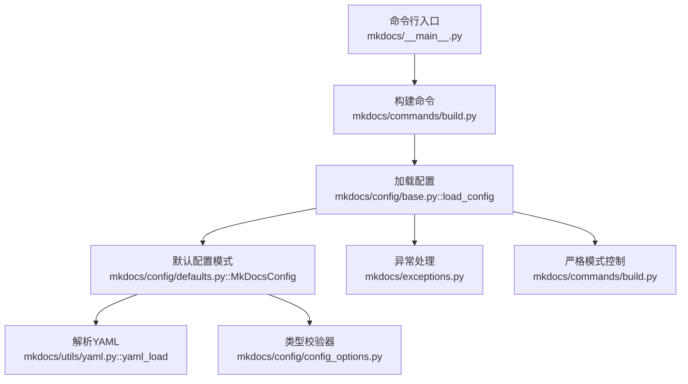
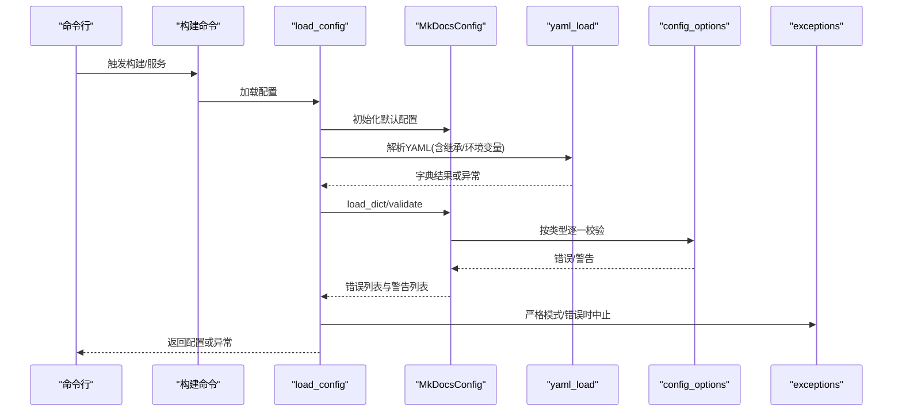
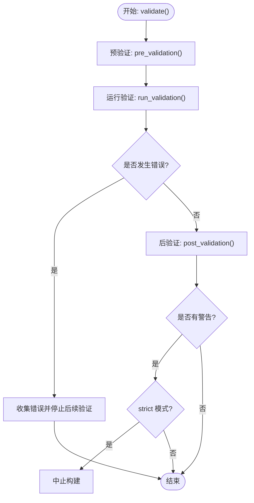
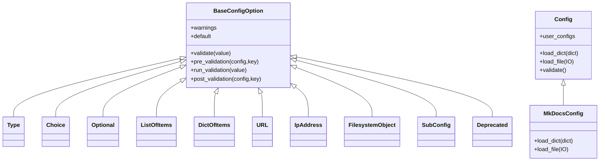
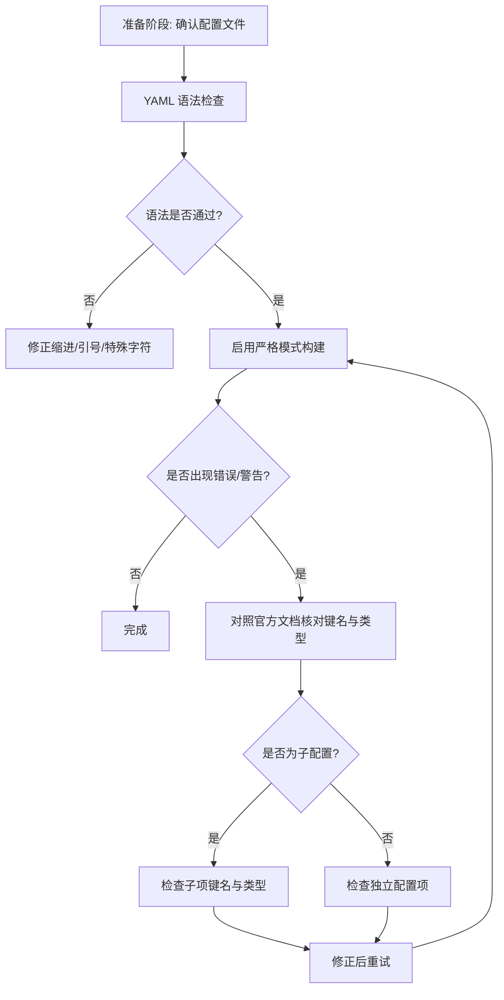

# 配置错误

<cite>
**本文引用的文件**
- [mkdocs/config/base.py](file://mkdocs/config/base.py)
- [mkdocs/config/config_options.py](file://mkdocs/config/config_options.py)
- [mkdocs/config/defaults.py](file://mkdocs/config/defaults.py)
- [mkdocs/utils/yaml.py](file://mkdocs/utils/yaml.py)
- [mkdocs/exceptions.py](file://mkdocs/exceptions.py)
- [mkdocs/tests/config/config_tests.py](file://mkdocs/tests/config/config_tests.py)
- [mkdocs/tests/config/config_options_tests.py](file://mkdocs/tests/config/config_options_tests.py)
- [mkdocs/tests/config/base_tests.py](file://mkdocs/tests/config/base_tests.py)
- [docs/user-guide/configuration.md](file://docs/user-guide/configuration.md)
- [mkdocs/commands/build.py](file://mkdocs/commands/build.py)
- [mkdocs/__main__.py](file://mkdocs/__main__.py)
</cite>

## 目录
1. [简介](#简介)
2. [项目结构](#项目结构)
3. [核心组件](#核心组件)
4. [架构总览](#架构总览)
5. [详细组件分析](#详细组件分析)
6. [依赖关系分析](#依赖关系分析)
7. [性能考量](#性能考量)
8. [故障排除指南](#故障排除指南)
9. [结论](#结论)
10. [附录](#附录)

## 简介
本指南聚焦于 MkDocs 配置系统的“配置错误”主题，围绕 YAML 语法错误、配置项拼写错误、值类型不匹配等常见问题，提供可操作的诊断与修复步骤，并结合源码中的验证流程、错误类型与日志输出，帮助用户快速定位与解决问题。同时给出配置验证工具的使用方法、逐步排查流程以及最佳实践与常见陷阱提示。

## 项目结构
与配置错误相关的代码主要分布在以下模块：
- 配置加载与验证：mkdocs/config/base.py、mkdocs/config/defaults.py
- 配置项类型与校验器：mkdocs/config/config_options.py
- YAML 解析与环境变量扩展：mkdocs/utils/yaml.py
- 异常类型定义：mkdocs/exceptions.py
- 命令行严格模式与构建流程：mkdocs/commands/build.py、mkdocs/__main__.py
- 测试用例（覆盖常见错误模式）：mkdocs/tests/config/*.py
- 官方用户指南（配置项说明与示例）：docs/user-guide/configuration.md

**图表来源**
- [mkdocs/__main__.py](file://mkdocs/__main__.py#L115-L120)
- [mkdocs/commands/build.py](file://mkdocs/commands/build.py#L252-L350)
- [mkdocs/config/base.py](file://mkdocs/config/base.py#L340-L392)
- [mkdocs/config/defaults.py](file://mkdocs/config/defaults.py#L38-L214)
- [mkdocs/utils/yaml.py](file://mkdocs/utils/yaml.py#L128-L151)
- [mkdocs/config/config_options.py](file://mkdocs/config/config_options.py#L323-L382)
- [mkdocs/exceptions.py](file://mkdocs/exceptions.py#L22-L28)
- [mkdocs/commands/build.py](file://mkdocs/commands/build.py#L350-L350)

**章节来源**
- [mkdocs/config/base.py](file://mkdocs/config/base.py#L340-L392)
- [mkdocs/config/defaults.py](file://mkdocs/config/defaults.py#L38-L214)
- [mkdocs/utils/yaml.py](file://mkdocs/utils/yaml.py#L128-L151)
- [mkdocs/exceptions.py](file://mkdocs/exceptions.py#L22-L28)
- [mkdocs/commands/build.py](file://mkdocs/commands/build.py#L252-L350)
- [mkdocs/__main__.py](file://mkdocs/__main__.py#L115-L120)

## 核心组件
- 配置对象与验证框架
  - Config 类型系统与 BaseConfigOption 抽象，支持预/运行/后验证三阶段，统一收集错误与警告。
  - MkDocsConfig 作为根配置，定义所有可用配置项及其类型约束。
- 配置项类型与校验器
  - Type、Choice、Optional、ListOfItems、DictOfItems、URL、IpAddress、File/Dir、SubConfig 等，覆盖常见配置场景。
- YAML 解析与继承
  - 支持环境变量扩展与继承标签，解析失败会抛出配置错误。
- 异常与严格模式
  - ConfigurationError 用于配置错误；严格模式下警告也会导致中止。

**章节来源**
- [mkdocs/config/base.py](file://mkdocs/config/base.py#L37-L107)
- [mkdocs/config/base.py](file://mkdocs/config/base.py#L123-L243)
- [mkdocs/config/defaults.py](file://mkdocs/config/defaults.py#L38-L214)
- [mkdocs/config/config_options.py](file://mkdocs/config/config_options.py#L323-L382)
- [mkdocs/utils/yaml.py](file://mkdocs/utils/yaml.py#L128-L151)
- [mkdocs/exceptions.py](file://mkdocs/exceptions.py#L22-L28)

## 架构总览
配置从文件到生效的关键流程如下：

**图表来源**
- [mkdocs/config/base.py](file://mkdocs/config/base.py#L340-L392)
- [mkdocs/config/defaults.py](file://mkdocs/config/defaults.py#L205-L214)
- [mkdocs/utils/yaml.py](file://mkdocs/utils/yaml.py#L128-L151)
- [mkdocs/config/config_options.py](file://mkdocs/config/config_options.py#L323-L382)
- [mkdocs/exceptions.py](file://mkdocs/exceptions.py#L22-L28)
- [mkdocs/commands/build.py](file://mkdocs/commands/build.py#L350-L350)

## 详细组件分析

### 配置验证与错误收集
- 验证阶段
  - 预验证：执行每个选项的 pre_validation，收集警告。
  - 运行验证：调用 run_validation，按类型规则校验，收集错误与警告。
  - 后验证：执行 post_validation，进行跨字段依赖检查，收集错误与警告。
- 未知键处理
  - 超出 schema 的键会被记录为“未识别配置名”的警告。
- 严格模式
  - strict=true 且存在任何警告时，将中止构建。

**图表来源**
- [mkdocs/config/base.py](file://mkdocs/config/base.py#L181-L243)

**章节来源**
- [mkdocs/config/base.py](file://mkdocs/config/base.py#L181-L243)
- [mkdocs/commands/build.py](file://mkdocs/commands/build.py#L252-L350)

### YAML 解析与继承
- 继承机制
  - 支持 INHERIT 关键字，读取相对路径并合并父级配置。
  - 若继承文件不存在，抛出配置错误。
- 环境变量扩展
  - 使用 yaml_env_tag，允许在 YAML 中通过 !ENV 注入环境变量。
- 目录占位符
  - 提供 !relative 标签，支持基于配置目录、docs 目录或当前页面的相对路径解析。

**章节来源**
- [mkdocs/utils/yaml.py](file://mkdocs/utils/yaml.py#L128-L151)

### 常见配置项类型与错误模式
- Type/Choice
  - 类型不匹配、长度不满足、非法选择值。
- ListOfItems/DictOfItems
  - 非列表/非字典、键类型不符、子项校验失败。
- URL/IpAddress/File/Dir
  - URL 缺少协议、端口格式错误、路径不存在或非法。
- SubConfig/PropagatingSubConfig
  - 子配置类型错误、未知键、子项校验失败。

**章节来源**
- [mkdocs/config/config_options.py](file://mkdocs/config/config_options.py#L323-L382)
- [mkdocs/config/config_options.py](file://mkdocs/config/config_options.py#L189-L242)
- [mkdocs/config/config_options.py](file://mkdocs/config/config_options.py#L244-L298)
- [mkdocs/config/config_options.py](file://mkdocs/config/config_options.py#L492-L527)
- [mkdocs/config/config_options.py](file://mkdocs/config/config_options.py#L463-L489)
- [mkdocs/config/config_options.py](file://mkdocs/config/config_options.py#L689-L711)

## 依赖关系分析

**图表来源**
- [mkdocs/config/base.py](file://mkdocs/config/base.py#L37-L107)
- [mkdocs/config/defaults.py](file://mkdocs/config/defaults.py#L38-L214)
- [mkdocs/config/config_options.py](file://mkdocs/config/config_options.py#L323-L382)

**章节来源**
- [mkdocs/config/base.py](file://mkdocs/config/base.py#L37-L107)
- [mkdocs/config/defaults.py](file://mkdocs/config/defaults.py#L38-L214)
- [mkdocs/config/config_options.py](file://mkdocs/config/config_options.py#L323-L382)

## 性能考量
- 验证顺序与短路
  - 运行验证阶段出现错误会跳过后续验证，减少无效计算。
- 列表/字典项验证
  - 对空列表/字典直接返回，避免无意义遍历。
- LRU 缓存
  - get_schema 使用缓存以复用 schema 计算结果。

**章节来源**
- [mkdocs/config/base.py](file://mkdocs/config/base.py#L181-L243)
- [mkdocs/config/config_options.py](file://mkdocs/config/config_options.py#L211-L241)
- [mkdocs/config/config_options.py](file://mkdocs/config/config_options.py#L266-L298)

## 故障排除指南

### 一、常见错误类型与定位方法
- YAML 语法错误
  - 现象：解析阶段即报错，无法进入配置验证。
  - 定位：查看解析异常消息，确认缩进、引号、特殊字符。
  - 参考：YAML 解析器在解析失败时抛出配置错误。
- 配置项拼写错误
  - 现象：出现“未识别配置名”的警告；严格模式下可能中止。
  - 定位：核对配置项名称是否在官方文档或默认 schema 中。
  - 参考：未知键会在验证阶段被记录为警告。
- 值类型不匹配
  - 现象：Type/Choice/List/Dict 等类型校验失败。
  - 定位：根据具体类型校验器的错误信息，检查值类型、长度、取值范围。
- URL/IP 地址格式错误
  - 现象：URL 缺少协议、端口格式错误。
  - 定位：核对 URL 是否包含 scheme/netloc，端口是否为整数。
- 文件/目录不存在
  - 现象：File/Dir/DocsDir/SiteDir 校验失败。
  - 定位：确认路径是否存在、是否与配置文件相对路径一致。

**章节来源**
- [mkdocs/utils/yaml.py](file://mkdocs/utils/yaml.py#L133-L136)
- [mkdocs/config/base.py](file://mkdocs/config/base.py#L195-L196)
- [mkdocs/config/config_options.py](file://mkdocs/config/config_options.py#L343-L354)
- [mkdocs/config/config_options.py](file://mkdocs/config/config_options.py#L511-L526)
- [mkdocs/config/config_options.py](file://mkdocs/config/config_options.py#L470-L489)
- [mkdocs/config/config_options.py](file://mkdocs/config/config_options.py#L705-L711)
- [mkdocs/config/defaults.py](file://mkdocs/config/defaults.py#L76-L80)

### 二、逐步排查流程
- 步骤 1：确认配置文件路径与默认文件名
  - 默认优先尝试 mkdocs.yml 或 mkdocs.yaml；若指定文件不存在，会抛出配置错误。
- 步骤 2：检查 YAML 语法
  - 使用外部 YAML 校验工具先行验证；关注缩进、冒号后空格、布尔/数值写法。
- 步骤 3：启用严格模式定位问题
  - 在构建命令中启用严格模式，使警告也导致中止，便于一次性发现全部问题。
- 步骤 4：逐项核对配置项
  - 对照官方文档与默认 schema，确认键名正确、类型匹配、取值合法。
- 步骤 5：检查依赖关系与子配置
  - SubConfig/PropagatingSubConfig 的子项同样会参与验证，注意嵌套结构与键名。

**图表来源**
- [mkdocs/config/base.py](file://mkdocs/config/base.py#L300-L324)
- [mkdocs/utils/yaml.py](file://mkdocs/utils/yaml.py#L133-L136)
- [mkdocs/commands/build.py](file://mkdocs/commands/build.py#L350-L350)
- [docs/user-guide/configuration.md](file://docs/user-guide/configuration.md#L1-L14)

**章节来源**
- [mkdocs/config/base.py](file://mkdocs/config/base.py#L300-L324)
- [mkdocs/utils/yaml.py](file://mkdocs/utils/yaml.py#L133-L136)
- [mkdocs/commands/build.py](file://mkdocs/commands/build.py#L350-L350)
- [docs/user-guide/configuration.md](file://docs/user-guide/configuration.md#L1-L14)

### 三、配置验证工具与技巧
- 内置验证
  - load_config 会加载 YAML 并执行完整验证，输出错误与警告日志。
- 严格模式
  - 通过命令行开关或配置项启用严格模式，使警告也导致中止。
- 外部工具
  - 使用 YAML 校验器提前发现问题；使用编辑器插件高亮语法错误。

**章节来源**
- [mkdocs/config/base.py](file://mkdocs/config/base.py#L340-L392)
- [mkdocs/commands/build.py](file://mkdocs/commands/build.py#L252-L350)
- [mkdocs/__main__.py](file://mkdocs/__main__.py#L115-L120)

### 四、最佳实践与常见陷阱
- 最佳实践
  - 使用官方文档作为权威参考，确保键名与取值范围正确。
  - 将复杂配置拆分为多个子配置，利用 SubConfig/PropagatingSubConfig 明确边界。
  - 在 CI 中启用严格模式，尽早暴露问题。
- 常见陷阱
  - 忽略“未识别配置名”警告，导致配置未生效。
  - 列表/字典项类型错误，未按类型校验器要求提供。
  - URL 缺少协议或端口格式错误。
  - 文件/目录路径与配置文件相对路径不一致。
  - 继承文件路径错误，导致解析失败。

**章节来源**
- [docs/user-guide/configuration.md](file://docs/user-guide/configuration.md#L1-L14)
- [mkdocs/config/base.py](file://mkdocs/config/base.py#L195-L196)
- [mkdocs/config/config_options.py](file://mkdocs/config/config_options.py#L211-L241)
- [mkdocs/config/config_options.py](file://mkdocs/config/config_options.py#L266-L298)
- [mkdocs/config/config_options.py](file://mkdocs/config/config_options.py#L511-L526)
- [mkdocs/utils/yaml.py](file://mkdocs/utils/yaml.py#L139-L145)

## 结论
MkDocs 的配置系统通过分层验证与明确的错误/警告收集机制，为用户提供了清晰的排障线索。遵循本文提供的排查流程与最佳实践，可高效定位并修复 YAML 语法、键名拼写与类型不匹配等问题。建议在开发与 CI 环境中始终启用严格模式，以获得更稳健的构建体验。

## 附录

### A. 常见错误模式速查
- YAML 解析失败
  - 现象：解析阶段异常。
  - 排查：检查缩进、引号、特殊字符。
- 未知配置项
  - 现象：出现“未识别配置名”警告。
  - 排查：核对键名是否存在于默认 schema。
- 类型不匹配
  - 现象：Type/Choice/URL/IP 地址等校验失败。
  - 排查：确认值类型、长度、取值范围。
- 列表/字典结构错误
  - 现象：ListOfItems/DictOfItems 报错。
  - 排查：确认顶层为 list/dict，键类型为 str，子项符合类型约束。
- 文件/目录不存在
  - 现象：File/Dir/DocsDir/SiteDir 校验失败。
  - 排查：确认路径存在且与配置文件相对路径一致。

**章节来源**
- [mkdocs/utils/yaml.py](file://mkdocs/utils/yaml.py#L133-L136)
- [mkdocs/config/base.py](file://mkdocs/config/base.py#L195-L196)
- [mkdocs/config/config_options.py](file://mkdocs/config/config_options.py#L343-L354)
- [mkdocs/config/config_options.py](file://mkdocs/config/config_options.py#L211-L241)
- [mkdocs/config/config_options.py](file://mkdocs/config/config_options.py#L266-L298)
- [mkdocs/config/config_options.py](file://mkdocs/config/config_options.py#L511-L526)
- [mkdocs/config/config_options.py](file://mkdocs/config/config_options.py#L705-L711)