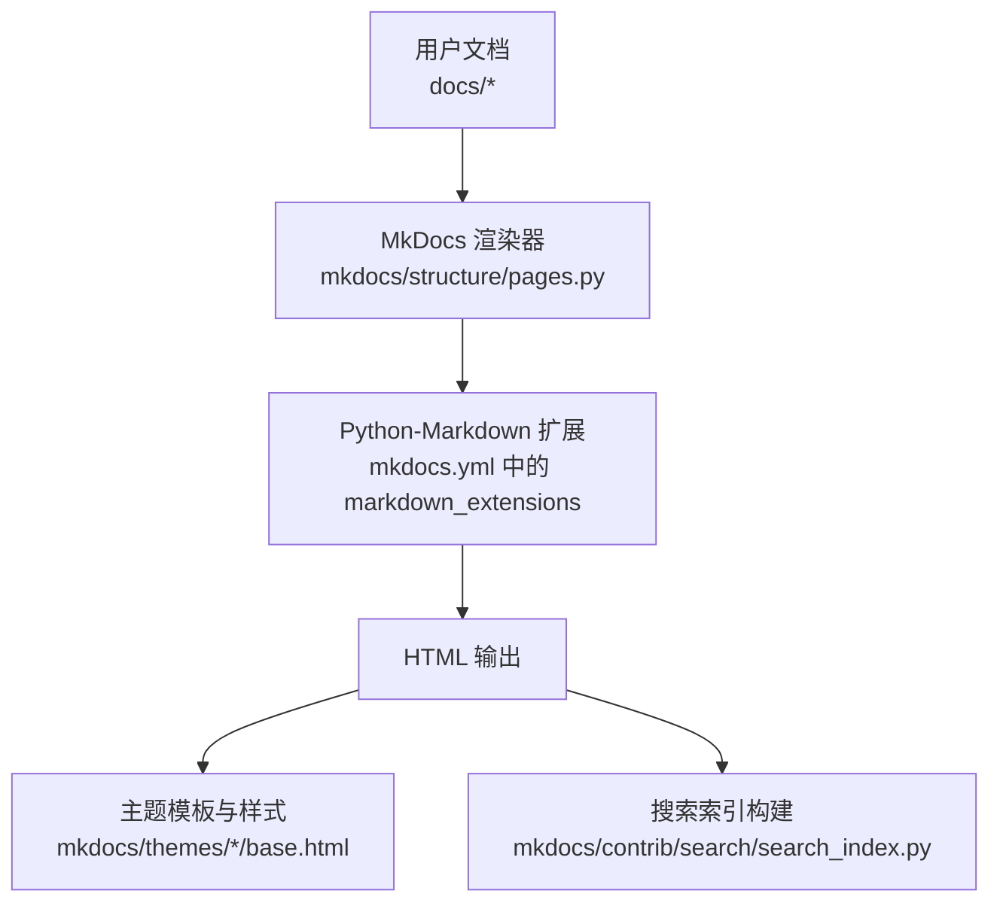
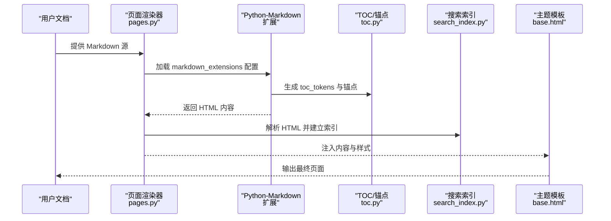
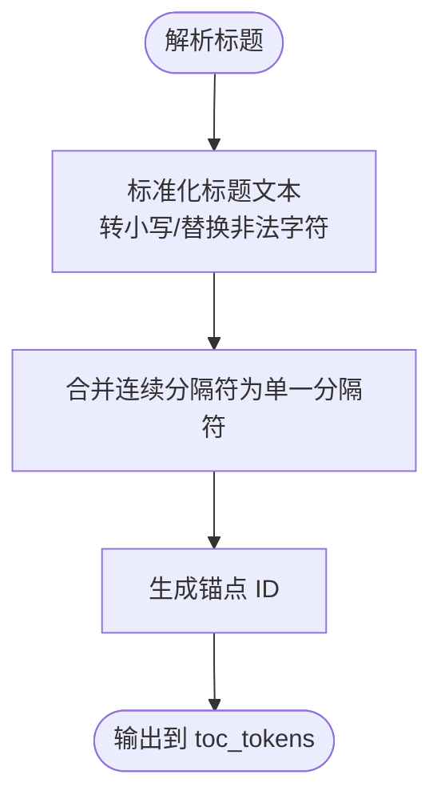
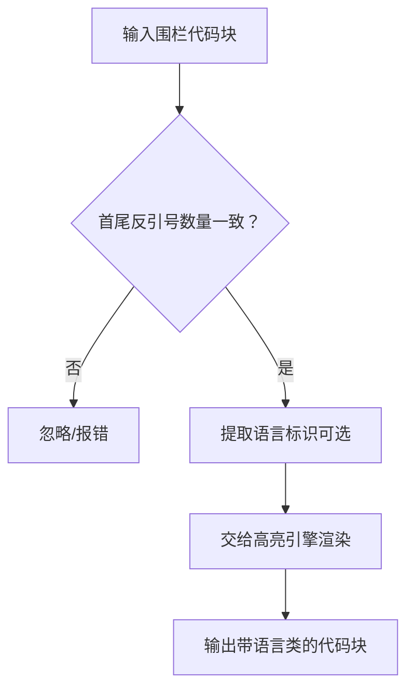
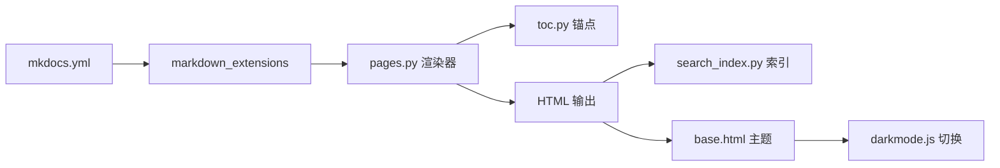

# Markdown 语法基础

<cite>
**本文引用的文件**
- [docs/getting-started.md](file://docs/getting-started.md)
- [docs/user-guide/writing-your-docs.md](file://docs/user-guide/writing-your-docs.md)
- [docs/user-guide/configuration.md](file://docs/user-guide/configuration.md)
- [mkdocs.yml](file://mkdocs.yml)
- [mkdocs/structure/pages.py](file://mkdocs/structure/pages.py)
- [mkdocs/structure/toc.py](file://mkdocs/structure/toc.py)
- [mkdocs/contrib/search/search_index.py](file://mkdocs/contrib/search/search_index.py)
- [mkdocs/themes/mkdocs/base.html](file://mkdocs/themes/mkdocs/base.html)
- [mkdocs/themes/mkdocs/js/darkmode.js](file://mkdocs/themes/mkdocs/js/darkmode.js)
- [mkdocs/themes/readthedocs/js/theme_extra.js](file://mkdocs/themes/readthedocs/js/theme_extra.js)
- [.markdownlint.yaml](file://.markdownlint.yaml)
</cite>

## 目录
1. [简介](#简介)
2. [项目结构](#项目结构)
3. [核心组件](#核心组件)
4. [架构总览](#架构总览)
5. [详细组件分析](#详细组件分析)
6. [依赖关系分析](#依赖关系分析)
7. [性能考量](#性能考量)
8. [故障排查指南](#故障排查指南)
9. [结论](#结论)
10. [附录](#附录)

## 简介
本指南面向 MkDocs 用户与作者，系统讲解在 MkDocs 中编写 Markdown 文档时应掌握的基础语法与最佳实践，覆盖标题层级、列表、链接与路径、图片与媒体、代码块与语法高亮、表格、强调文本以及常见扩展功能。文档中的示例与规则均以 MkDocs 官方文档与源码为依据，确保可操作性与一致性。

## 项目结构
- 文档与用户指南位于 docs 目录，包含入门、配置、写作指南等。
- MkDocs 配置文件 mkdocs.yml 定义主题、导航、Markdown 扩展、插件等。
- 核心渲染流程由 mkdocs/structure/pages.py 调用 Python-Markdown 完成，并通过结构化 TOC、搜索索引等模块支撑站点功能。



图表来源
- [mkdocs/structure/pages.py](file://mkdocs/structure/pages.py#L263-L295)
- [mkdocs.yml](file://mkdocs.yml#L36-L51)
- [mkdocs/themes/mkdocs/base.html](file://mkdocs/themes/mkdocs/base.html#L19-L33)
- [mkdocs/contrib/search/search_index.py](file://mkdocs/contrib/search/search_index.py#L25-L51)

章节来源
- [docs/getting-started.md](file://docs/getting-started.md#L1-L214)
- [docs/user-guide/configuration.md](file://docs/user-guide/configuration.md#L737-L800)
- [mkdocs.yml](file://mkdocs.yml#L1-L80)

## 核心组件
- 标题层级：支持 H1–H6，MkDocs 使用 toc 扩展生成锚点 ID，支持自定义分隔符、基准层级与永久链接。
- 列表：支持无序、有序与任务列表（需启用相应扩展），注意缩进与嵌套规则。
- 链接：支持内链（相对路径）、外链与锚点链接；绝对路径在 MkDocs 中可配置为“相对到 docs_dir”的行为。
- 图片与媒体：支持多种媒体文件，按 docs_dir 结构复制到站点；图片可用 Markdown 语法插入。
- 代码块：支持缩进代码块与围栏代码块（fenced code blocks），可指定语言进行语法高亮。
- 表格：tables 扩展提供基础表格语法，支持列对齐与空白行要求。
- 强调文本：支持粗体、斜体、删除线等基础强调语法。
- 扩展功能：MkDocs 默认启用 meta、toc、tables、fenced_code 等扩展，并可按需启用更多扩展。

章节来源
- [docs/user-guide/writing-your-docs.md](file://docs/user-guide/writing-your-docs.md#L168-L541)
- [docs/user-guide/configuration.md](file://docs/user-guide/configuration.md#L737-L800)
- [mkdocs.yml](file://mkdocs.yml#L36-L51)

## 架构总览
下图展示 MkDocs Markdown 渲染与输出的关键环节：从 Markdown 源到 HTML，再到主题与搜索索引。



图表来源
- [mkdocs/structure/pages.py](file://mkdocs/structure/pages.py#L263-L295)
- [mkdocs/structure/toc.py](file://mkdocs/structure/toc.py#L20-L50)
- [mkdocs/contrib/search/search_index.py](file://mkdocs/contrib/search/search_index.py#L165-L225)
- [mkdocs/themes/mkdocs/base.html](file://mkdocs/themes/mkdocs/base.html#L19-L33)

## 详细组件分析

### 标题层级与锚点链接
- 支持 H1–H6，MkDocs 使用 toc 扩展为每个标题生成锚点 ID。
- 锚点 ID 规则：基于标题文本转小写、替换空格与非法字符为连字符、合并连续连字符为单个连字符。
- 可配置项：
  - permalink：是否显示永久链接（默认关闭）
  - baselevel：基准层级，用于适配模板层级
  - separator：单词分隔符（默认“-”，可设为“_”等）



图表来源
- [docs/user-guide/writing-your-docs.md](file://docs/user-guide/writing-your-docs.md#L227-L301)
- [mkdocs/structure/toc.py](file://mkdocs/structure/toc.py#L28-L50)

章节来源
- [docs/user-guide/writing-your-docs.md](file://docs/user-guide/writing-your-docs.md#L227-L301)
- [mkdocs/structure/toc.py](file://mkdocs/structure/toc.py#L20-L50)

### 列表（有序、无序、任务列表）
- 无序列表：使用“-”、“+”或“*”，建议统一风格并保持一致缩进。
- 有序列表：使用数字加点，遵循“有序”风格配置。
- 嵌套规则：子项缩进至少 4 空格；同一层级缩进不一致会被视为不同层级。
- 任务列表：需启用相应扩展（例如 pymdownx.task_list），在列表项中使用方括号标记完成状态。

章节来源
- [docs/user-guide/writing-your-docs.md](file://docs/user-guide/writing-your-docs.md#L168-L541)
- [.markdownlint.yaml](file://.markdownlint.yaml#L10-L20)
- [.markdownlint.yaml](file://.markdownlint.yaml#L70-L73)

### 链接与相对路径
- 内链：使用相对路径链接到其他 Markdown 页面，MkDocs 在构建时自动转换为 HTML 链接。
- 外链：支持绝对 URL 或相对 URL；当站点部署在子目录时，可使用相对路径指向同站其他部分。
- 锚点链接：可链接到目标文档的特定标题（基于 toc 生成的 ID）。
- 绝对路径：MkDocs 1.6 新增“相对到 docs_dir”的绝对链接验证模式，可在配置中开启以识别形如“/dir/file.md”的绝对链接并正确处理。

章节来源
- [docs/user-guide/writing-your-docs.md](file://docs/user-guide/writing-your-docs.md#L192-L301)
- [docs/user-guide/configuration.md](file://docs/user-guide/configuration.md#L462-L483)

### 图片与媒体
- 支持图片与其它媒体文件，放置于 docs 目录中，构建时会原样复制到站点。
- 图片插入使用标准 Markdown 语法，路径相对于当前文档所在目录。
- 主题层可对表格应用样式类名，便于统一外观。

章节来源
- [docs/user-guide/writing-your-docs.md](file://docs/user-guide/writing-your-docs.md#L303-L348)
- [mkdocs/themes/readthedocs/js/theme_extra.js](file://mkdocs/themes/readthedocs/js/theme_extra.js#L1-L8)

### 代码块与语法高亮
- 缩进代码块：适合简单片段，但不支持语言指定。
- 围栏代码块：使用三反引号（```），首尾行必须匹配相同数量的反引号；可在第一行指定语言以启用高亮。
- 语法高亮：MkDocs 默认启用 highlight.js，并通过主题模板加载对应样式；支持明暗主题切换时切换高亮样式表。



图表来源
- [docs/user-guide/writing-your-docs.md](file://docs/user-guide/writing-your-docs.md#L509-L541)
- [mkdocs/themes/mkdocs/base.html](file://mkdocs/themes/mkdocs/base.html#L26-L29)
- [mkdocs/themes/mkdocs/js/darkmode.js](file://mkdocs/themes/mkdocs/js/darkmode.js#L1-L13)

章节来源
- [docs/user-guide/writing-your-docs.md](file://docs/user-guide/writing-your-docs.md#L509-L541)
- [mkdocs/themes/mkdocs/base.html](file://mkdocs/themes/mkdocs/base.html#L19-L33)
- [mkdocs/themes/mkdocs/js/darkmode.js](file://mkdocs/themes/mkdocs/js/darkmode.js#L1-L34)

### 表格
- 使用 pipes（|）与分隔线（-）定义表头与分隔线，支持在分隔线上添加冒号控制对齐（左/居中/右）。
- 单元格内不能包含块级元素或多行文本，但可包含行内 Markdown。
- 表格前后必须有空行。

章节来源
- [docs/user-guide/writing-your-docs.md](file://docs/user-guide/writing-your-docs.md#L467-L507)

### 强调文本
- 粗体：使用双星号或双下划线包围文本。
- 斜体：使用单星号或单下划线包围文本。
- 删除线：使用波浪号包围文本（需启用相应扩展）。

章节来源
- [docs/user-guide/writing-your-docs.md](file://docs/user-guide/writing-your-docs.md#L168-L541)

### 常见 Markdown 扩展
- toc：生成目录与锚点，支持永久链接、基准层级、分隔符等配置。
- tables：提供基础表格语法。
- fenced_code_blocks：提供围栏代码块语法。
- pymdownx.highlight、pymdownx.superfences：增强代码高亮与围栏功能。
- 其他扩展：如 attr_list、def_list、callouts、mdx_gh_links、mkdocs-click 等。

章节来源
- [mkdocs.yml](file://mkdocs.yml#L36-L51)
- [docs/user-guide/configuration.md](file://docs/user-guide/configuration.md#L737-L800)

## 依赖关系分析
- MkDocs 配置文件 mkdocs.yml 控制主题、导航、Markdown 扩展与插件。
- 页面渲染器 pages.py 调用 Python-Markdown，加载配置中的扩展并注册预处理器、树处理器与后处理器。
- TOC 模块 toc.py 将 toc_tokens 转换为结构化的锚点对象，供主题与导航使用。
- 搜索索引 search_index.py 解析 HTML，按标题分段建立索引，支持内容检索。
- 主题模板 base.html 注入样式与高亮资源，darkmode.js 实现明暗主题切换与高亮样式切换。



图表来源
- [mkdocs.yml](file://mkdocs.yml#L36-L51)
- [mkdocs/structure/pages.py](file://mkdocs/structure/pages.py#L263-L295)
- [mkdocs/structure/toc.py](file://mkdocs/structure/toc.py#L20-L50)
- [mkdocs/contrib/search/search_index.py](file://mkdocs/contrib/search/search_index.py#L165-L225)
- [mkdocs/themes/mkdocs/base.html](file://mkdocs/themes/mkdocs/base.html#L19-L33)
- [mkdocs/themes/mkdocs/js/darkmode.js](file://mkdocs/themes/mkdocs/js/darkmode.js#L1-L34)

章节来源
- [mkdocs.yml](file://mkdocs.yml#L1-L80)
- [mkdocs/structure/pages.py](file://mkdocs/structure/pages.py#L263-L295)
- [mkdocs/structure/toc.py](file://mkdocs/structure/toc.py#L20-L50)
- [mkdocs/contrib/search/search_index.py](file://mkdocs/contrib/search/search_index.py#L25-L51)
- [mkdocs/themes/mkdocs/base.html](file://mkdocs/themes/mkdocs/base.html#L19-L33)
- [mkdocs/themes/mkdocs/js/darkmode.js](file://mkdocs/themes/mkdocs/js/darkmode.js#L1-L34)

## 性能考量
- 合理使用围栏代码块而非缩进代码块，便于高亮与可读性。
- 控制表格复杂度与单元格内容长度，避免过多块级元素导致渲染开销。
- 仅启用必要的 Markdown 扩展与插件，减少构建时间。
- 使用主题提供的高亮样式与缓存策略，避免重复加载资源。

## 故障排查指南
- 标题锚点异常：检查标题文本是否包含特殊字符或实体引用，确认 toc 配置（分隔符、基准层级）是否符合预期。
- 链接失效：
  - 绝对路径在生产环境可能失效，优先使用相对路径。
  - 开启“相对到 docs_dir”的绝对链接验证模式以提前发现错误。
- 代码高亮未生效：确认主题已启用 highlight.js，并检查语言标识是否正确。
- 表格渲染问题：确保表格前后有空行，且分隔线冒号位置正确。
- 搜索结果不准确：检查 HTML 是否被正确解析，确认标题与内容分段逻辑。

章节来源
- [docs/user-guide/writing-your-docs.md](file://docs/user-guide/writing-your-docs.md#L227-L301)
- [docs/user-guide/configuration.md](file://docs/user-guide/configuration.md#L462-L483)
- [mkdocs/contrib/search/search_index.py](file://mkdocs/contrib/search/search_index.py#L165-L225)

## 结论
MkDocs 对 Markdown 的支持以 Python-Markdown 为核心，辅以丰富的扩展与主题能力。遵循本文所述的标题、列表、链接、图片、代码块、表格与强调语法的最佳实践，结合配置文件中的 toc、tables、fenced_code_blocks 等扩展设置，可高效产出结构清晰、可读性强、易于维护的静态文档站点。

## 附录
- 项目布局与导航：参见“文件布局与导航”章节，了解页面组织与 URL 映射规则。
- 验证与规范：可参考 .markdownlint.yaml 中的规则，确保文档风格一致与质量可控。

章节来源
- [docs/user-guide/writing-your-docs.md](file://docs/user-guide/writing-your-docs.md#L7-L167)
- [.markdownlint.yaml](file://.markdownlint.yaml#L1-L91)