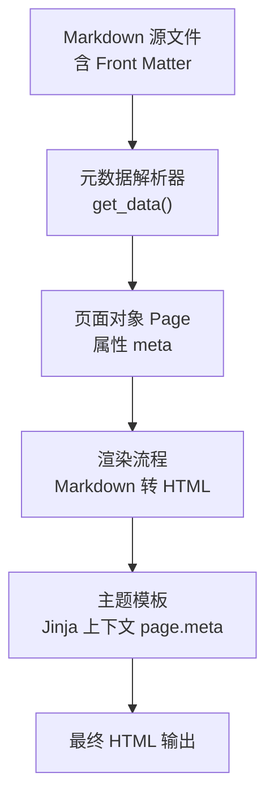
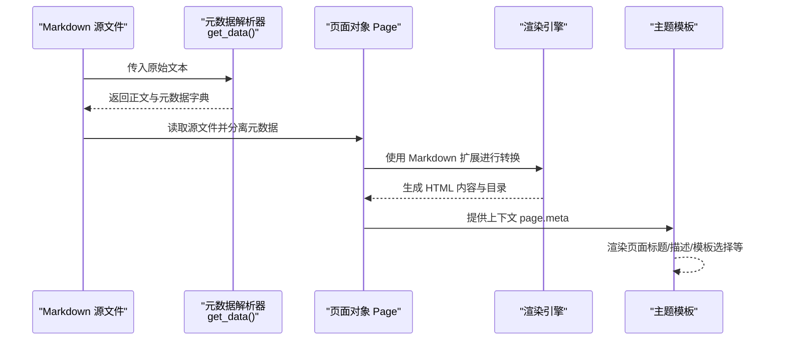
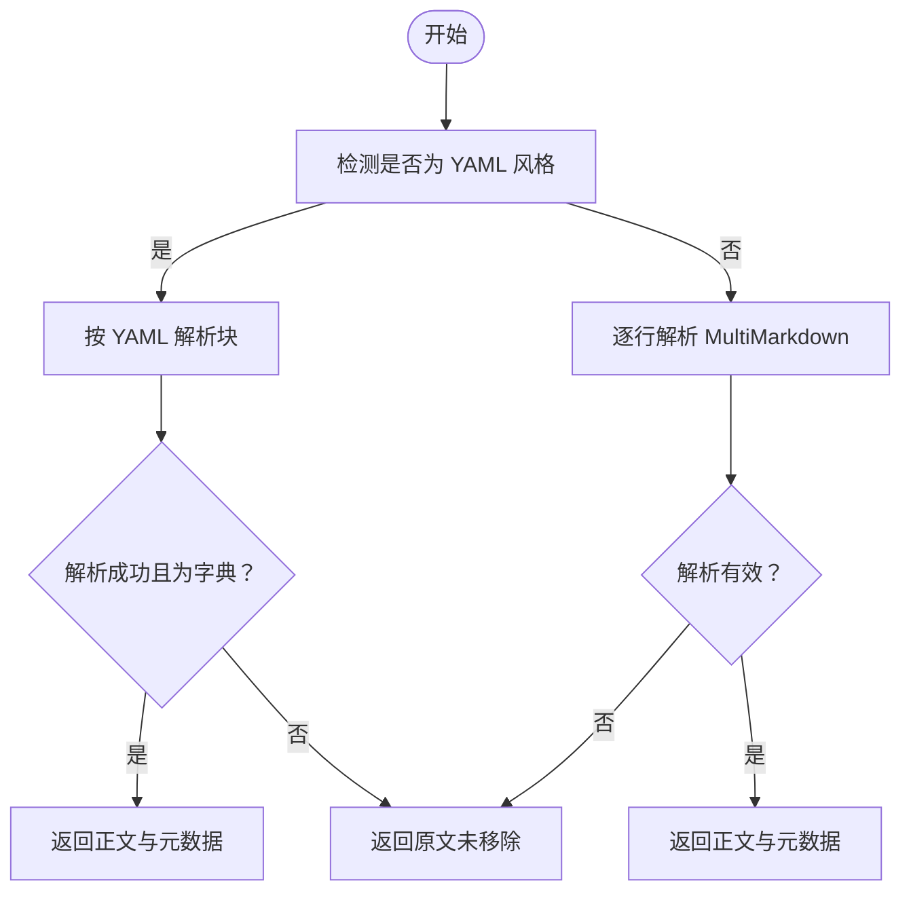
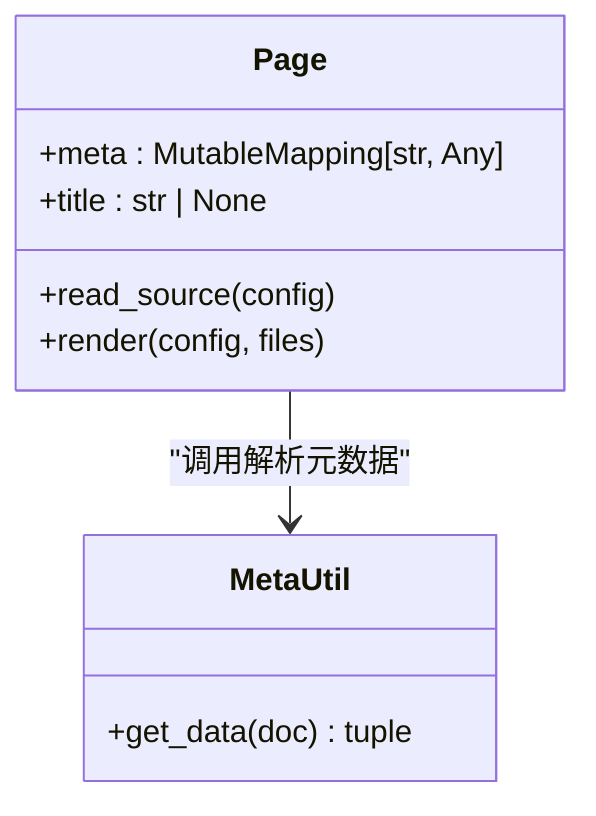
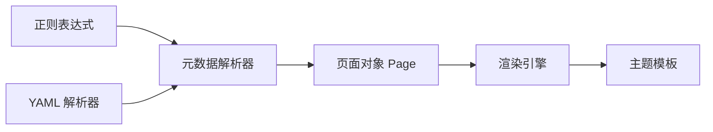

# 元数据与 Front Matter

<cite>
**本文引用的文件**
- [mkdocs/utils/meta.py](file://mkdocs/utils/meta.py)
- [mkdocs/structure/pages.py](file://mkdocs/structure/pages.py)
- [docs/user-guide/writing-your-docs.md](file://docs/user-guide/writing-your-docs.md)
- [docs/dev-guide/themes.md](file://docs/dev-guide/themes.md)
- [mkdocs/themes/mkdocs/base.html](file://mkdocs/themes/mkdocs/base.html)
- [mkdocs/themes/mkdocs/mkdocs_theme.yml](file://mkdocs/themes/mkdocs/mkdocs_theme.yml)
- [mkdocs/themes/readthedocs/mkdocs_theme.yml](file://mkdocs/themes/readthedocs/mkdocs_theme.yml)
- [mkdocs/tests/utils/utils_tests.py](file://mkdocs/tests/utils/utils_tests.py)
- [mkdocs/tests/integration/subpages/docs/metadata.md](file://mkdocs/tests/integration/subpages/docs/metadata.md)
</cite>

## 目录
1. [简介](#简介)
2. [项目结构](#项目结构)
3. [核心组件](#核心组件)
4. [架构总览](#架构总览)
5. [组件详解](#组件详解)
6. [依赖关系分析](#依赖关系分析)
7. [性能考量](#性能考量)
8. [故障排除指南](#故障排除指南)
9. [结论](#结论)
10. [附录](#附录)

## 简介
本指南系统讲解 MkDocs 中的“元数据”与“Front Matter”。我们将从概念入手，解释元数据的作用与在主题模板中的交互方式；对比 YAML 风格与 MultiMarkdown 风格的语法与适用场景；梳理预定义元数据键（如 template、title 等）的功能；说明解析流程与错误处理策略；给出实际使用案例与最佳实践，并阐述元数据如何影响页面渲染与主题显示。

## 项目结构
围绕元数据与 Front Matter 的关键代码与文档分布在以下位置：
- 解析器：位于工具模块中，负责从 Markdown 文档顶部提取并解析元数据
- 页面对象：承载解析后的元数据，并参与渲染与导航等后续流程
- 用户文档：官方文档对元数据语法、预定义键与行为有权威说明
- 主题模板：通过 Jinja 上下文变量访问 page.meta，从而在页面中展示或控制行为
- 测试用例：覆盖 YAML 与 MultiMarkdown 的解析边界情况与错误处理

图表来源
- [mkdocs/utils/meta.py](file://mkdocs/utils/meta.py#L56-L100)
- [mkdocs/structure/pages.py](file://mkdocs/structure/pages.py#L208-L221)
- [docs/user-guide/writing-your-docs.md](file://docs/user-guide/writing-your-docs.md#L394-L466)

章节来源
- [mkdocs/utils/meta.py](file://mkdocs/utils/meta.py#L56-L100)
- [mkdocs/structure/pages.py](file://mkdocs/structure/pages.py#L208-L221)
- [docs/user-guide/writing-your-docs.md](file://docs/user-guide/writing-your-docs.md#L394-L466)

## 核心组件
- 元数据解析器：识别并解析 YAML 风格与 MultiMarkdown 风格的 Front Matter，返回去除元数据部分的正文与键值映射
- 页面对象：在读取源文件后调用解析器，将元数据存入 page.meta，并在标题推导、URL 计算等环节使用
- 主题模板：通过 page.meta 访问元数据键，用于页面标题、描述、自定义模板选择等

章节来源
- [mkdocs/utils/meta.py](file://mkdocs/utils/meta.py#L56-L100)
- [mkdocs/structure/pages.py](file://mkdocs/structure/pages.py#L208-L262)
- [docs/dev-guide/themes.md](file://docs/dev-guide/themes.md#L84-L102)

## 架构总览
下面的时序图展示了从 Markdown 文件到主题渲染的关键步骤，以及元数据在其中的位置与影响点：

图表来源
- [mkdocs/utils/meta.py](file://mkdocs/utils/meta.py#L56-L100)
- [mkdocs/structure/pages.py](file://mkdocs/structure/pages.py#L208-L291)
- [docs/dev-guide/themes.md](file://docs/dev-guide/themes.md#L84-L102)

## 组件详解

### 元数据解析器（YAML 与 MultiMarkdown）
- 判定优先级：先尝试 YAML 风格（以三短横线开头/结尾），若匹配则按 YAML 解析；否则回退到 MultiMarkdown 风格逐行解析
- YAML 风格要点：
  - 必须以三短横线起止界定块
  - 块内为合法 YAML 键值对；顶层必须是键值集合（dict），否则不被识别为元数据
  - YAML 类型会被自动识别（字符串、列表、日期等）
  - 键名大小写敏感，但解析后统一转为小写键存储
- MultiMarkdown 风格要点：
  - 关键词冒号分隔，大小写不敏感，可多行续写（缩进至少四个空格或一个制表符）
  - 第一个空白行标志着元数据结束
  - 不支持 YAML 风格的界定符
- 错误处理：
  - YAML 解析失败或顶层非字典时，整段不被视为元数据，正文保持不变
  - MultiMarkdown 解析遇到不符合格式的行时停止解析，剩余内容保留为正文

图表来源
- [mkdocs/utils/meta.py](file://mkdocs/utils/meta.py#L56-L100)

章节来源
- [mkdocs/utils/meta.py](file://mkdocs/utils/meta.py#L51-L100)
- [docs/user-guide/writing-your-docs.md](file://docs/user-guide/writing-your-docs.md#L394-L466)
- [mkdocs/tests/utils/utils_tests.py](file://mkdocs/tests/utils/utils_tests.py#L364-L450)

### 页面对象与元数据的集成
- 页面在读取源文件后，调用解析器分离正文与元数据，并将元数据存入 page.meta
- 标题推导顺序中会优先检查元数据中的 title 键
- 元数据可用于模板选择（template 键）与页面行为控制

图表来源
- [mkdocs/structure/pages.py](file://mkdocs/structure/pages.py#L208-L262)
- [mkdocs/utils/meta.py](file://mkdocs/utils/meta.py#L56-L74)

章节来源
- [mkdocs/structure/pages.py](file://mkdocs/structure/pages.py#L208-L262)
- [docs/user-guide/writing-your-docs.md](file://docs/user-guide/writing-your-docs.md#L360-L392)

### 主题模板中的元数据使用
- 主题通过 page.meta 访问元数据键，例如设置页面标题、描述、选择特定模板等
- 官方基础模板会在 head 区域根据 page.canonical_url、config.site_name 等变量输出页面标题与描述
- 自定义主题可直接读取 page.meta 中的键值，实现个性化展示

章节来源
- [docs/dev-guide/themes.md](file://docs/dev-guide/themes.md#L84-L102)
- [mkdocs/themes/mkdocs/base.html](file://mkdocs/themes/mkdocs/base.html#L1-L17)

### 预定义元数据键
- template：指定当前页面使用的模板文件（需存在于主题环境路径）
- title：覆盖默认标题推导逻辑，优先使用该键值作为页面标题
- 其他键：用户可自由添加任意键值对，供主题模板读取与使用

章节来源
- [docs/user-guide/writing-your-docs.md](file://docs/user-guide/writing-your-docs.md#L360-L392)

### 实际使用案例与最佳实践
- 使用 YAML 风格时，确保顶层为键值集合，避免列表或标量导致不被识别
- 使用 MultiMarkdown 风格时，首行不得为空白行；多行值需正确缩进（≥4 空格或 1 个制表符）
- 在主题中读取 page.meta 时，建议提供默认值或条件判断，增强健壮性
- 若需要为单页定制模板，使用 template 键指向主题内的模板文件
- 若需要为单页指定标题，使用 title 键覆盖默认标题推导

章节来源
- [docs/user-guide/writing-your-docs.md](file://docs/user-guide/writing-your-docs.md#L394-L466)
- [mkdocs/tests/integration/subpages/docs/metadata.md](file://mkdocs/tests/integration/subpages/docs/metadata.md#L1-L6)

## 依赖关系分析
- 元数据解析器依赖正则表达式与 YAML 解析器
- 页面对象依赖解析器以填充 page.meta，并在渲染阶段使用
- 主题模板依赖页面上下文中的 page.meta 进行展示

图表来源
- [mkdocs/utils/meta.py](file://mkdocs/utils/meta.py#L51-L53)
- [mkdocs/utils/meta.py](file://mkdocs/utils/meta.py#L67-L74)
- [mkdocs/structure/pages.py](file://mkdocs/structure/pages.py#L208-L221)

章节来源
- [mkdocs/utils/meta.py](file://mkdocs/utils/meta.py#L51-L74)
- [mkdocs/structure/pages.py](file://mkdocs/structure/pages.py#L208-L221)

## 性能考量
- 元数据解析采用正则与简单循环，时间复杂度近似 O(n)，n 为文档行数，开销极低
- YAML 解析由安全加载器执行，解析成本与元数据体量成正比
- 多行值合并为字符串时存在拼接操作，通常不影响整体性能
- 建议将元数据保持简洁，避免过长的多行值与过多键项

## 故障排除指南
常见问题与定位方法：
- YAML 风格不生效
  - 检查是否以三短横线正确界定块
  - 确认顶层为键值集合（字典），而非列表或标量
  - 参考测试用例中的边界情形
- MultiMarkdown 风格不生效
  - 确保首行非空白行
  - 多行值必须缩进 ≥4 空格或 1 个制表符
  - 不要混用 YAML 风格界定符
- 标题未按预期显示
  - 检查是否设置了 title 元数据键
  - 确认主题模板是否正确读取 page.meta 或 page.title
- 模板未按预期切换
  - 检查 template 元数据键是否指向主题内存在的模板文件
  - 确认模板文件路径与主题环境一致

章节来源
- [mkdocs/tests/utils/utils_tests.py](file://mkdocs/tests/utils/utils_tests.py#L364-L450)
- [docs/user-guide/writing-your-docs.md](file://docs/user-guide/writing-your-docs.md#L360-L392)

## 结论
元数据与 Front Matter 是 MkDocs 中连接文档内容与主题渲染的重要桥梁。通过清晰的解析流程与严格的错误处理，MkDocs 能够稳定地从 Markdown 文档顶部抽取元数据，并将其注入到页面对象与主题模板上下文中。掌握 YAML 与 MultiMarkdown 两种风格的语法差异、预定义键的行为以及调试方法，将显著提升站点构建的可控性与可维护性。

## 附录
- 主题配置参考：不同内置主题的配置项（如颜色模式、导航深度等）可在各自主题配置文件中查看
- 模板示例：官方基础模板展示了如何在主题中使用 page.meta 与 page.title 等变量

章节来源
- [mkdocs/themes/mkdocs/mkdocs_theme.yml](file://mkdocs/themes/mkdocs/mkdocs_theme.yml#L1-L29)
- [mkdocs/themes/readthedocs/mkdocs_theme.yml](file://mkdocs/themes/readthedocs/mkdocs_theme.yml#L1-L26)
- [mkdocs/themes/mkdocs/base.html](file://mkdocs/themes/mkdocs/base.html#L1-L17)