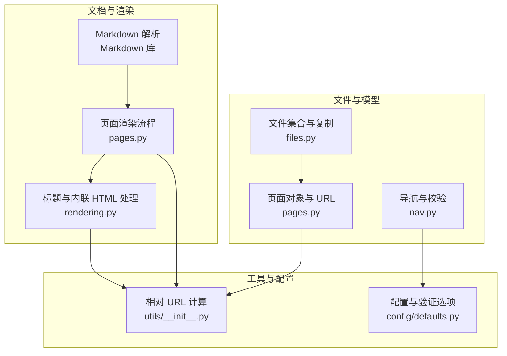
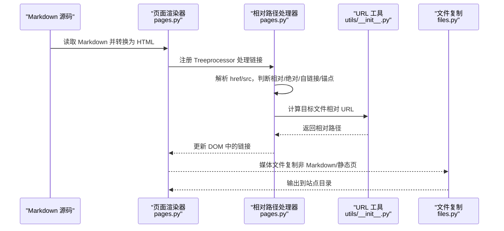
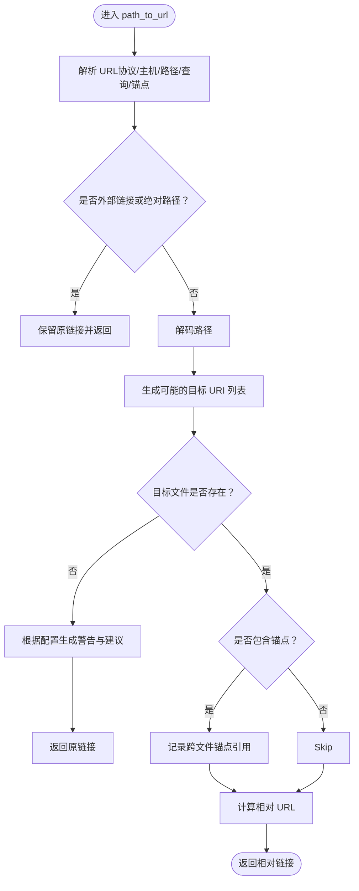
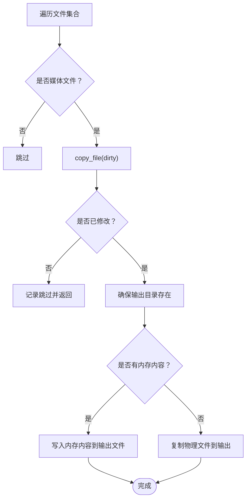
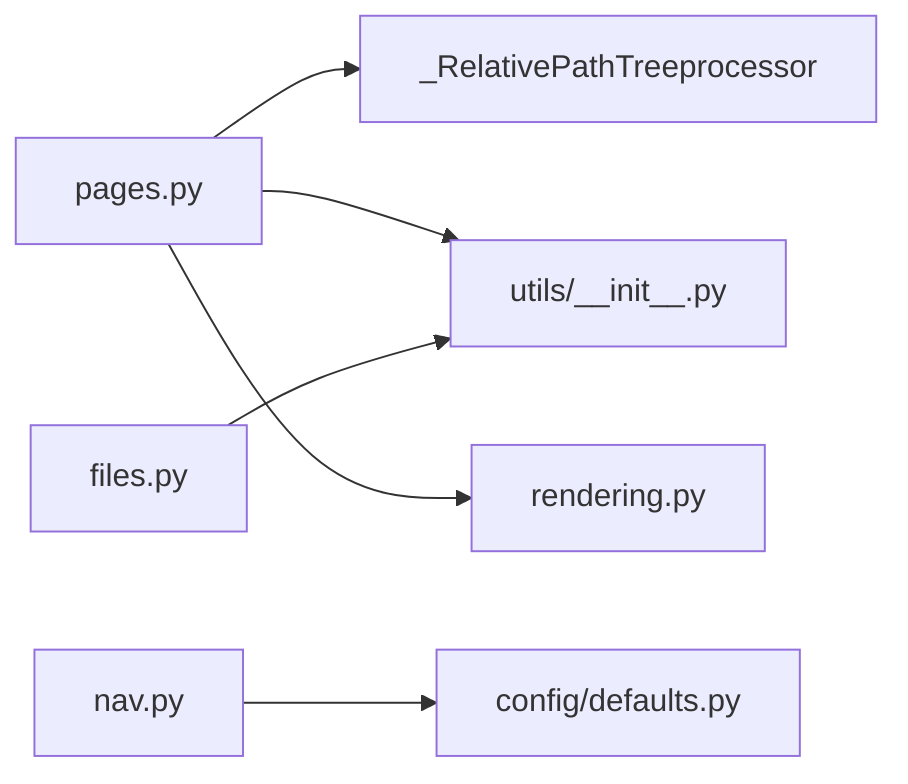

# 媒体资源与链接

<cite>
**本文引用的文件**
- [mkdocs/utils/rendering.py](file://mkdocs/utils/rendering.py)
- [mkdocs/structure/files.py](file://mkdocs/structure/files.py)
- [mkdocs/structure/pages.py](file://mkdocs/structure/pages.py)
- [mkdocs/utils/__init__.py](file://mkdocs/utils/__init__.py)
- [mkdocs/structure/nav.py](file://mkdocs/structure/nav.py)
- [mkdocs/config/defaults.py](file://mkdocs/config/defaults.py)
- [docs/user-guide/writing-your-docs.md](file://docs/user-guide/writing-your-docs.md)
- [docs/user-guide/configuration.md](file://docs/user-guide/configuration.md)
- [mkdocs/tests/integration/subpages/docs/index.md](file://mkdocs/tests/integration/subpages/docs/index.md)
- [mkdocs/tests/integration/subpages/docs/sub1/sub1a/index.md](file://mkdocs/tests/integration/subpages/docs/sub1/sub1a/index.md)
- [mkdocs/tests/integration/subpages/docs/sub1/sub1a/non-index.md](file://mkdocs/tests/integration/subpages/docs/sub1/sub1a/non-index.md)
- [mkdocs/tests/utils/utils_tests.py](file://mkdocs/tests/utils/utils_tests.py)
- [mkdocs/tests/structure/page_tests.py](file://mkdocs/tests/structure/page_tests.py)
</cite>

## 目录
1. [简介](#简介)
2. [项目结构](#项目结构)
3. [核心组件](#核心组件)
4. [架构总览](#架构总览)
5. [详细组件分析](#详细组件分析)
6. [依赖关系分析](#依赖关系分析)
7. [性能考量](#性能考量)
8. [故障排查指南](#故障排查指南)
9. [结论](#结论)
10. [附录](#附录)

## 简介
本指南面向 MkDocs 用户，系统讲解媒体资源管理与链接使用，包括：
- 在文档中插入图片与其他媒体文件
- 相对路径链接的使用规则与注意事项
- 绝对路径链接的风险与不推荐原因
- 锚点链接（anchor links）的创建与使用
- 链接到其他文档页面与特定标题位置
- 原始 HTML 内部链接的手动格式化要求
- 媒体文件的复制与处理机制
- 链接验证与故障排除方法
- 链接安全性考虑与最佳实践
- 多语言文档中的链接处理策略

## 项目结构
围绕媒体与链接的关键模块与职责如下：
- 文档解析与渲染：负责 Markdown 到 HTML 的转换、标题文本提取、内联 HTML 处理等
- 页面与文件模型：定义文档页、静态页、媒体文件的识别与 URL 计算
- 相对路径处理器：在构建期将相对链接转换为最终可访问的相对 URL
- 配置与验证：控制链接严格度、绝对链接行为、导航校验等
- 测试用例：覆盖相对/绝对路径、锚点、跨目录引用等场景

图示来源
- [mkdocs/structure/pages.py](file://mkdocs/structure/pages.py#L263-L293)
- [mkdocs/utils/rendering.py](file://mkdocs/utils/rendering.py#L22-L56)
- [mkdocs/structure/files.py](file://mkdocs/structure/files.py#L113-L144)
- [mkdocs/utils/__init__.py](file://mkdocs/utils/__init__.py#L177-L202)
- [mkdocs/structure/nav.py](file://mkdocs/structure/nav.py#L130-L185)
- [mkdocs/config/defaults.py](file://mkdocs/config/defaults.py#L169-L197)

章节来源
- [mkdocs/structure/pages.py](file://mkdocs/structure/pages.py#L263-L293)
- [mkdocs/utils/rendering.py](file://mkdocs/utils/rendering.py#L22-L56)
- [mkdocs/structure/files.py](file://mkdocs/structure/files.py#L113-L144)
- [mkdocs/utils/__init__.py](file://mkdocs/utils/__init__.py#L177-L202)
- [mkdocs/structure/nav.py](file://mkdocs/structure/nav.py#L130-L185)
- [mkdocs/config/defaults.py](file://mkdocs/config/defaults.py#L169-L197)

## 核心组件
- 相对路径处理器（RelativePathTreeprocessor）
  - 负责遍历 DOM，将 a/img 标签的 href/src 转换为相对于当前页面的 URL
  - 支持绝对链接、自链接、锚点、未识别链接的提示与建议
- 文件与媒体复制
  - 非 Markdown/静态页的文件被识别为媒体文件并复制到站点目录
  - 支持增量复制与修改检测
- 链接验证与导航校验
  - 配置项控制“未找到”“未知链接”“绝对链接”“锚点”等日志级别
  - 导航中绝对路径与不存在的链接会触发相应警告
- 工具函数
  - get_relative_url：计算两个路径之间的相对 URL
  - normalize_url：规范化路径，区分绝对/相对/锚点

章节来源
- [mkdocs/structure/pages.py](file://mkdocs/structure/pages.py#L346-L520)
- [mkdocs/structure/files.py](file://mkdocs/structure/files.py#L473-L501)
- [mkdocs/utils/__init__.py](file://mkdocs/utils/__init__.py#L177-L239)
- [mkdocs/structure/nav.py](file://mkdocs/structure/nav.py#L164-L185)
- [mkdocs/config/defaults.py](file://mkdocs/config/defaults.py#L169-L197)

## 架构总览
下图展示从 Markdown 渲染到最终链接输出的关键流程。

图示来源
- [mkdocs/structure/pages.py](file://mkdocs/structure/pages.py#L263-L293)
- [mkdocs/structure/pages.py](file://mkdocs/structure/pages.py#L346-L520)
- [mkdocs/utils/__init__.py](file://mkdocs/utils/__init__.py#L177-L202)
- [mkdocs/structure/files.py](file://mkdocs/structure/files.py#L473-L501)

## 详细组件分析

### 相对路径处理器与链接转换
- 功能要点
  - 遍历 DOM，处理 a/img 标签
  - 对相对链接进行解析与修正，支持多种可能的目标路径猜测
  - 对绝对链接、自链接、锚点分别处理，并记录跨文件锚点引用
  - 未识别或不存在的链接生成建议（如转换为相对路径或 mailto）
- 关键算法流程

图示来源
- [mkdocs/structure/pages.py](file://mkdocs/structure/pages.py#L419-L516)

章节来源
- [mkdocs/structure/pages.py](file://mkdocs/structure/pages.py#L346-L520)

### 媒体文件复制与处理
- 媒体文件识别
  - 非 Markdown 且非静态页的文件视为媒体文件
  - 支持 JS/CSS/图片等资源复制
- 复制逻辑
  - 若源文件未变更则跳过复制（dirty 模式）
  - 支持内存内容写入与物理文件写入两种方式
- 目录结构
  - 目标路径与源路径一致，保持相对位置

图示来源
- [mkdocs/structure/files.py](file://mkdocs/structure/files.py#L113-L144)
- [mkdocs/structure/files.py](file://mkdocs/structure/files.py#L473-L501)

章节来源
- [mkdocs/structure/files.py](file://mkdocs/structure/files.py#L113-L144)
- [mkdocs/structure/files.py](file://mkdocs/structure/files.py#L473-L501)

### 链接验证与导航校验
- 验证级别
  - links.not_found / links.unrecognized_links / links.absolute_links / links.anchors
  - nav.omitted_files / nav.not_found / nav.absolute_links
- 行为差异
  - absolute_links 支持特殊值 "relative_to_docs"，使以 "/" 开头的链接按文档根相对解析
- 导航校验
  - 导航中绝对路径会被记录为外部资源或发出警告
  - 未找到的导航项会提示

章节来源
- [mkdocs/config/defaults.py](file://mkdocs/config/defaults.py#L169-L197)
- [mkdocs/structure/nav.py](file://mkdocs/structure/nav.py#L164-L185)

### 标题文本提取与内联 HTML 处理
- 标题文本提取
  - 移除锚点链接、脚注引用、图片 alt 文本，仅保留纯文本
- 内联 HTML 处理
  - 提取 raw HTML 中的锚点 id/name，用于锚点链接验证

章节来源
- [mkdocs/utils/rendering.py](file://mkdocs/utils/rendering.py#L22-L56)
- [mkdocs/structure/pages.py](file://mkdocs/structure/pages.py#L522-L566)

## 依赖关系分析
- 页面渲染依赖相对路径处理器与 URL 工具
- 文件复制依赖工具函数进行路径规范化与拷贝
- 导航校验依赖配置选项与文件集合

图示来源
- [mkdocs/structure/pages.py](file://mkdocs/structure/pages.py#L263-L293)
- [mkdocs/utils/__init__.py](file://mkdocs/utils/__init__.py#L177-L202)
- [mkdocs/structure/files.py](file://mkdocs/structure/files.py#L473-L501)
- [mkdocs/structure/nav.py](file://mkdocs/structure/nav.py#L130-L185)
- [mkdocs/config/defaults.py](file://mkdocs/config/defaults.py#L169-L197)
- [mkdocs/utils/rendering.py](file://mkdocs/utils/rendering.py#L22-L56)

章节来源
- [mkdocs/structure/pages.py](file://mkdocs/structure/pages.py#L263-L293)
- [mkdocs/utils/__init__.py](file://mkdocs/utils/__init__.py#L177-L202)
- [mkdocs/structure/files.py](file://mkdocs/structure/files.py#L473-L501)
- [mkdocs/structure/nav.py](file://mkdocs/structure/nav.py#L130-L185)
- [mkdocs/config/defaults.py](file://mkdocs/config/defaults.py#L169-L197)
- [mkdocs/utils/rendering.py](file://mkdocs/utils/rendering.py#L22-L56)

## 性能考量
- 相对路径计算采用路径规范化与分段比较，避免多余字符串操作
- 媒体文件复制支持“仅在修改时复制”，减少 I/O
- 链接验证在开发模式下可降低日志级别，提升迭代效率

## 故障排查指南
- 常见问题与定位
  - 未识别相对链接：检查路径是否缺少文件扩展名或指向目录但未加 index.md
  - 未找到目标：确认目标文件存在于 docs_dir 下，且未被排除
  - 绝对链接不生效：启用 validation.links.absolute_links: relative_to_docs 或改用相对路径
  - 锚点不存在：确认目标页面包含对应 id/name；自链接锚点需在同页注册
  - 导航绝对路径：导航中绝对路径会被视为外部资源，必要时改为相对路径
- 日志级别与建议
  - 使用 validation.links.absolute_links: warn/info/ignore 控制绝对链接提示
  - 使用 validation.links.anchors: warn 控制锚点缺失提示
  - 使用 validation.links.unrecognized_links: warn 控制未识别链接提示
- 实战参考
  - 相对/绝对路径与锚点的测试用例可作为编写与调试的依据

章节来源
- [mkdocs/config/defaults.py](file://mkdocs/config/defaults.py#L169-L197)
- [mkdocs/structure/pages.py](file://mkdocs/structure/pages.py#L419-L516)
- [mkdocs/tests/structure/page_tests.py](file://mkdocs/tests/structure/page_tests.py#L1046-L1075)
- [mkdocs/tests/utils/utils_tests.py](file://mkdocs/tests/utils/utils_tests.py#L96-L146)

## 结论
- 推荐优先使用相对路径链接，确保在不同部署环境下的稳定性
- 绝对路径链接在 MkDocs 中默认不被解析，存在部署风险
- 锚点链接应基于标题自动生成的 id/name，配合验证配置提升质量
- 媒体文件遵循“原样复制”的原则，保持与 docs_dir 的相对位置
- 通过配置验证与测试用例，可以高效发现并修复链接问题

## 附录

### 媒体资源与链接使用清单
- 插入图片与媒体文件
  - 将图片置于 docs/img 或子目录
  - 在 Markdown 中使用标准图片语法，路径相对 docs_dir
- 相对路径链接
  - 同级/上级目录使用 ./ 或 ../
  - 跨目录链接需包含相对路径
- 绝对路径链接
  - 不推荐直接使用以 "/" 开头的绝对路径
  - 可通过配置 validation.links.absolute_links: relative_to_docs 使其按文档根相对解析
- 锚点链接
  - 使用标题生成的 id；自链接仅含 #id
  - 跨页面锚点需在目标页面包含对应 id/name
- 原始 HTML 内部链接
  - 由于原始 HTML 不被解析，内部链接需手动格式化为最终可访问的相对 URL
- 链接验证与建议
  - 未识别链接会尝试给出建议（如转换为相对路径或 mailto）
- 多语言文档
  - 保持各语言版本的 docs_dir 结构一致，相对路径在各语言间通用
  - 锚点 id 由标题生成，注意不同语言的标题变化

章节来源
- [docs/user-guide/writing-your-docs.md](file://docs/user-guide/writing-your-docs.md#L303-L348)
- [docs/user-guide/configuration.md](file://docs/user-guide/configuration.md#L462-L482)
- [mkdocs/structure/pages.py](file://mkdocs/structure/pages.py#L419-L516)

### 示例与测试参考
- 相对/绝对路径与锚点示例
  - 子目录中引用上层图片与绝对路径示例
- URL 规范化与相对路径计算
  - 单元测试覆盖 normalize_url 与 get_relative_url 的行为边界

章节来源
- [mkdocs/tests/integration/subpages/docs/index.md](file://mkdocs/tests/integration/subpages/docs/index.md#L1-L31)
- [mkdocs/tests/integration/subpages/docs/sub1/sub1a/index.md](file://mkdocs/tests/integration/subpages/docs/sub1/sub1a/index.md#L1-L31)
- [mkdocs/tests/integration/subpages/docs/sub1/sub1a/non-index.md](file://mkdocs/tests/integration/subpages/docs/sub1/sub1a/non-index.md#L1-L31)
- [mkdocs/tests/utils/utils_tests.py](file://mkdocs/tests/utils/utils_tests.py#L96-L146)
- [mkdocs/tests/structure/page_tests.py](file://mkdocs/tests/structure/page_tests.py#L1046-L1075)