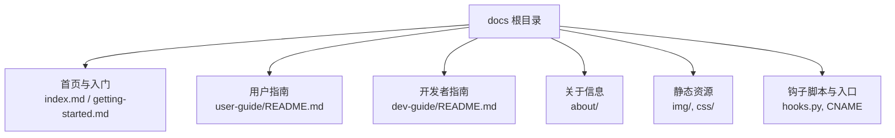
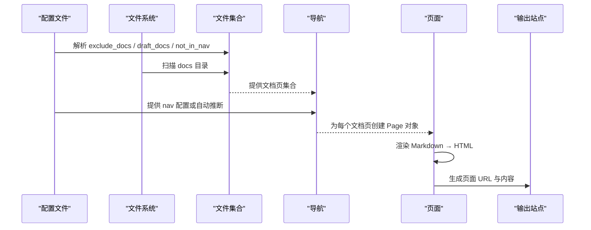
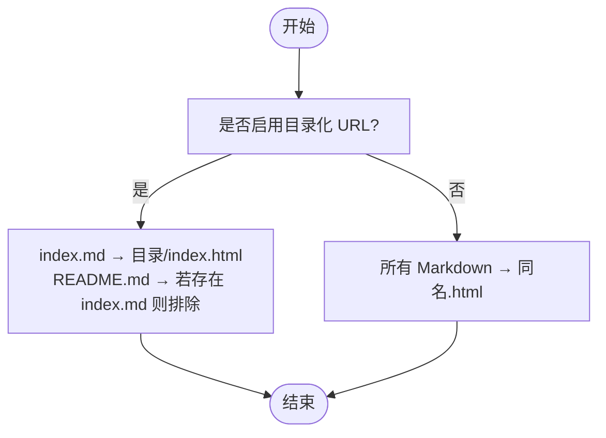
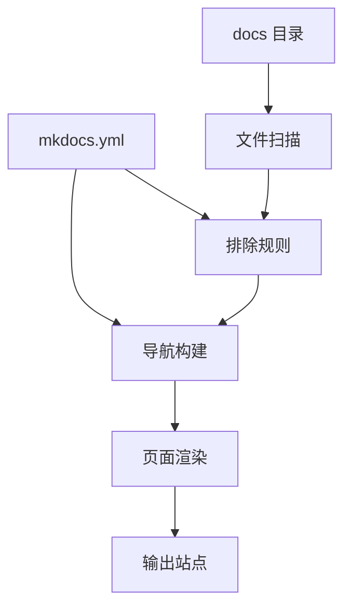

# 文件布局与组织

<cite>
**本文引用的文件**
- [mkdocs.yml](file://mkdocs.yml)
- [docs/index.md](file://docs/index.md)
- [docs/getting-started.md](file://docs/getting-started.md)
- [docs/user-guide/README.md](file://docs/user-guide/README.md)
- [docs/dev-guide/README.md](file://docs/dev-guide/README.md)
- [mkdocs/structure/files.py](file://mkdocs/structure/files.py)
- [mkdocs/structure/nav.py](file://mkdocs/structure/nav.py)
- [mkdocs/structure/pages.py](file://mkdocs/structure/pages.py)
- [mkdocs/tests/integration/subpages/docs/sub1/sub1a/index.md](file://mkdocs/tests/integration/subpages/docs/sub1/sub1a/index.md)
- [mkdocs/tests/integration/subpages/docs/sub1/sub1a/non-index.md](file://mkdocs/tests/integration/subpages/docs/sub1/sub1a/non-index.md)
- [mkdocs/tests/integration/minimal/docs/testing.md](file://mkdocs/tests/integration/minimal/docs/testing.md)
- [mkdocs/tests/integration/unicode/docs/Übersicht.md](file://mkdocs/tests/integration/unicode/docs/Übersicht.md)
- [mkdocs/tests/integration/unicode/docs/♪.md](file://mkdocs/tests/integration/unicode/docs/♪.md)
</cite>

## 目录
1. [简介](#简介)
2. [项目结构](#项目结构)
3. [核心组件](#核心组件)
4. [架构总览](#架构总览)
5. [详细组件分析](#详细组件分析)
6. [依赖关系分析](#依赖关系分析)
7. [性能考量](#性能考量)
8. [故障排查指南](#故障排查指南)
9. [结论](#结论)
10. [附录](#附录)

## 简介
本指南围绕 MkDocs 的“文件布局与组织”展开，系统阐述 docs 目录的命名约定、文件组织方式、索引页面（index.md 与 README.md）的使用规则与差异、嵌套目录结构对 URL 生成的影响、支持的文件扩展名、隐藏文件处理规则，并结合仓库中的实际示例给出简单与复杂项目的组织建议。同时，从 SEO 与用户体验角度分析文件布局的影响。

## 项目结构
MkDocs 官方站点的 docs 目录采用清晰的主题化分层：首页与入门指南位于根级；用户指南与开发者指南分别置于 user-guide 与 dev-guide 下；关于信息置于 about 子目录；媒体资源置于 img、css 等子目录。该结构体现了“按主题分组”的最佳实践，便于导航与维护。

图示来源
- [docs/index.md](file://docs/index.md#L1-L90)
- [docs/getting-started.md](file://docs/getting-started.md#L1-L214)
- [docs/user-guide/README.md](file://docs/user-guide/README.md#L1-L22)
- [docs/dev-guide/README.md](file://docs/dev-guide/README.md#L1-L19)

章节来源
- [docs/index.md](file://docs/index.md#L1-L90)
- [docs/getting-started.md](file://docs/getting-started.md#L1-L214)
- [docs/user-guide/README.md](file://docs/user-guide/README.md#L1-L22)
- [docs/dev-guide/README.md](file://docs/dev-guide/README.md#L1-L19)

## 核心组件
- 文档文件集合与排除规则：通过遍历 docs 目录构建文件集合，支持基于配置的排除、草稿与“不在导航中”标记，确保最终站点仅包含预期内容。
- 导航构建：根据配置或自动推断的路径列表生成导航树，支持层级分组、链接校验与缺失页面提示。
- 页面对象与 URL 生成：页面对象负责标题解析、渲染、锚点提取与相对链接转换，URL 依据是否启用目录化 URL 决定 index.html 或目录形式。

章节来源
- [mkdocs/structure/files.py](file://mkdocs/structure/files.py#L527-L588)
- [mkdocs/structure/nav.py](file://mkdocs/structure/nav.py#L130-L185)
- [mkdocs/structure/pages.py](file://mkdocs/structure/pages.py#L35-L170)

## 架构总览
下图展示从配置到页面渲染的关键流程：配置加载 → 文件扫描与排除 → 导航构建 → 页面渲染与链接修正 → 输出站点。

图示来源
- [mkdocs/structure/files.py](file://mkdocs/structure/files.py#L527-L588)
- [mkdocs/structure/nav.py](file://mkdocs/structure/nav.py#L130-L185)
- [mkdocs/structure/pages.py](file://mkdocs/structure/pages.py#L263-L293)

## 详细组件分析

### 命名约定与文件组织
- 根目录优先：首页通常命名为 index.md；入门指南等顶层文档直接置于 docs 根目录，便于快速定位。
- 主题化分组：用户指南与开发者指南分别独立目录，内部可再细分子主题。
- 关于信息：许可证、贡献指南、发布说明等归档至 about 子目录，保持主页简洁。
- 资源分离：图片、样式等静态资源置于 img、css 等子目录，避免与文档混杂。

章节来源
- [docs/index.md](file://docs/index.md#L1-L90)
- [docs/getting-started.md](file://docs/getting-started.md#L1-L214)
- [docs/user-guide/README.md](file://docs/user-guide/README.md#L1-L22)
- [docs/dev-guide/README.md](file://docs/dev-guide/README.md#L1-L19)

### 索引页面（index.md 与 README.md）
- index.md：作为站点根目录的默认首页，常用于站点概览与入口导航。
- README.md：在目录层级中作为该目录的“索引页”，常用于自动导航（如 literate-nav 插件）与目录说明。
- 行为差异：当启用目录化 URL 时，index.md 会映射为 index.html；而 README.md 在同目录下若存在 index.md，则会被排除以避免冲突。

章节来源
- [mkdocs/structure/files.py](file://mkdocs/structure/files.py#L563-L587)
- [mkdocs/structure/files.py](file://mkdocs/structure/files.py#L365-L372)
- [mkdocs/structure/files.py](file://mkdocs/structure/files.py#L389-L403)

### 嵌套目录结构对 URL 生成的影响
- 目录化 URL：启用后，Markdown 文件映射为目录下的 index.html，例如 docs/a/b.md → a/b/index.html。
- 非目录化 URL：启用后，Markdown 文件映射为同名 .html，例如 docs/a/b.md → a/b.html。
- README 与 index 冲突：若同一目录同时存在 index.md 与 README.md，后者会被排除，避免重复与歧义。

图示来源
- [mkdocs/structure/files.py](file://mkdocs/structure/files.py#L374-L403)
- [mkdocs/structure/files.py](file://mkdocs/structure/files.py#L563-L587)

### 支持的文件扩展名
- 文档页：仅识别 Markdown 文件（由扩展名判断），其他类型视为静态资源或媒体文件。
- 静态资源：CSS、JS、HTML/XML/JSON 等静态页与媒体文件按原路径复制到站点。
- 插件与主题：主题模板与插件生成的虚拟文件在构建时参与渲染但不改变文档页的扩展名规则。

章节来源
- [mkdocs/structure/files.py](file://mkdocs/structure/files.py#L503-L521)

### 隐藏文件（以点开头的文件）处理规则
- 默认排除：以点开头的文件与目录（如 .DS_Store、.hidden）默认被排除，不会进入最终站点。
- 可配置排除：可通过 exclude_docs 模式进一步控制排除行为。
- 草稿与导航外：草稿与“不在导航中”标记的文件仍可能在本地 serve 中可见，但不会出现在最终站点。

章节来源
- [mkdocs/structure/files.py](file://mkdocs/structure/files.py#L524-L543)
- [mkdocs.yml](file://mkdocs.yml#L33-L34)

### 文件布局对 SEO 与用户体验的影响
- URL 结构：目录化 URL 更利于语义化与层级表达，有助于搜索引擎理解站点结构；非目录化 URL 更直观，适合扁平化内容。
- 导航一致性：明确的导航配置与层级分组提升用户查找效率，减少 404 与跳转。
- 标题与元数据：页面标题与元信息影响搜索结果摘要与点击率，建议在文档顶部显式声明。
- 锚点与链接：相对链接自动转换与锚点校验减少断链，提升阅读连贯性。

章节来源
- [mkdocs/structure/pages.py](file://mkdocs/structure/pages.py#L404-L516)
- [mkdocs/structure/nav.py](file://mkdocs/structure/nav.py#L130-L185)

### 示例：简单项目布局
- 入门与首页：docs/index.md、docs/getting-started.md
- 最小布局示例：docs/testing.md（来自集成测试）

章节来源
- [mkdocs/tests/integration/minimal/docs/testing.md](file://mkdocs/tests/integration/minimal/docs/testing.md#L12-L17)

### 示例：复杂项目布局
- 用户指南与开发者指南：docs/user-guide/README.md、docs/dev-guide/README.md
- 子目录与嵌套页面：多级子目录与 index.md、non-index.md 的组合（来自集成测试）

章节来源
- [docs/user-guide/README.md](file://docs/user-guide/README.md#L1-L22)
- [docs/dev-guide/README.md](file://docs/dev-guide/README.md#L1-L19)
- [mkdocs/tests/integration/subpages/docs/sub1/sub1a/index.md](file://mkdocs/tests/integration/subpages/docs/sub1/sub1a/index.md#L1-L31)
- [mkdocs/tests/integration/subpages/docs/sub1/sub1a/non-index.md](file://mkdocs/tests/integration/subpages/docs/sub1/sub1a/non-index.md#L1-L31)

## 依赖关系分析
- 配置驱动：mkdocs.yml 的 nav、exclude_docs、markdown_extensions 等决定文件收录与渲染行为。
- 文件扫描：基于 docs_dir 遍历，结合排除规则与排序策略生成文件集合。
- 导航生成：将文件集合映射为导航树，支持外部链接校验与缺失文件告警。
- 页面渲染：页面对象读取源码、解析元数据、渲染 HTML 并进行相对链接转换。

图示来源
- [mkdocs.yml](file://mkdocs.yml#L20-L67)
- [mkdocs/structure/files.py](file://mkdocs/structure/files.py#L546-L588)
- [mkdocs/structure/nav.py](file://mkdocs/structure/nav.py#L130-L185)
- [mkdocs/structure/pages.py](file://mkdocs/structure/pages.py#L263-L293)

章节来源
- [mkdocs.yml](file://mkdocs.yml#L20-L67)
- [mkdocs/structure/files.py](file://mkdocs/structure/files.py#L546-L588)
- [mkdocs/structure/nav.py](file://mkdocs/structure/nav.py#L130-L185)
- [mkdocs/structure/pages.py](file://mkdocs/structure/pages.py#L263-L293)

## 性能考量
- 排除无关文件：通过 exclude_docs 限制扫描范围，减少不必要的 I/O。
- 目录化 URL 的权衡：目录结构更清晰，但可能增加链接与重定向复杂度；扁平结构更直接，但层级信息弱化。
- 静态资源优化：将大体积媒体文件置于独立目录，避免频繁复制与缓存失效。

## 故障排查指南
- 页面未出现在导航：检查 nav 配置与 not_in_nav 排除；查看日志中关于遗漏文件的警告。
- 相对链接错误：启用链接验证级别，关注“未找到”或“无法识别”的告警，并参考建议的替代路径。
- README 与 index 冲突：若目录同时存在 index.md 与 README.md，README 将被排除，建议统一使用 index.md。
- Unicode 文件名：支持非 ASCII 文件名（如 Übersicht.md、♪.md），但需确保编辑器与服务器编码一致。

章节来源
- [mkdocs/structure/nav.py](file://mkdocs/structure/nav.py#L148-L184)
- [mkdocs/structure/pages.py](file://mkdocs/structure/pages.py#L404-L516)
- [mkdocs/structure/files.py](file://mkdocs/structure/files.py#L563-L587)
- [mkdocs/tests/integration/unicode/docs/Übersicht.md](file://mkdocs/tests/integration/unicode/docs/Übersicht.md#L1-L18)
- [mkdocs/tests/integration/unicode/docs/♪.md](file://mkdocs/tests/integration/unicode/docs/♪.md#L1-L18)

## 结论
合理的文件布局应遵循“主题分组、层级清晰、命名一致”的原则，并结合目录化 URL 与导航配置实现良好的 SEO 与用户体验。通过 exclude_docs、literate-nav 等机制，既能保证内容完整性，又能提升维护效率。对于复杂项目，建议以 user-guide 与 dev-guide 为主干，配合 about 与资源目录，形成稳定可扩展的文档体系。

## 附录
- 配置参考：导航、排除、Markdown 扩展、插件等均在 mkdocs.yml 中集中管理。
- 测试用例：集成测试覆盖了子目录、Unicode 文件名、最小布局等场景，可作为组织与命名的参考范式。

章节来源
- [mkdocs.yml](file://mkdocs.yml#L1-L80)