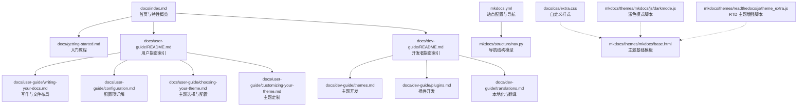
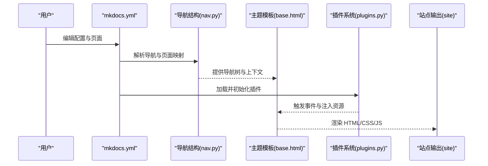
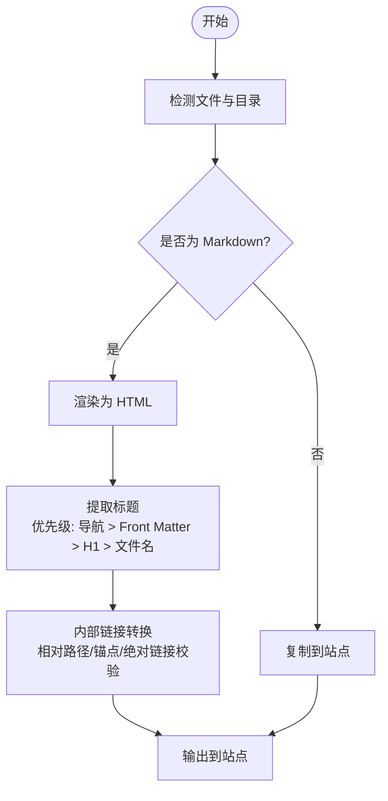
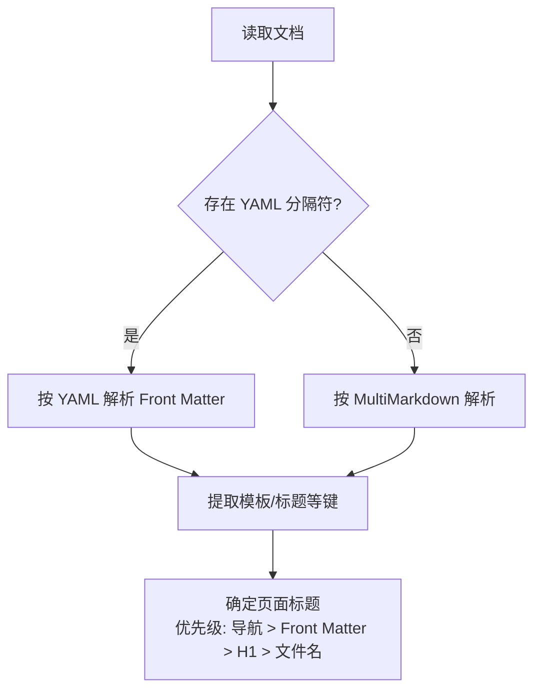
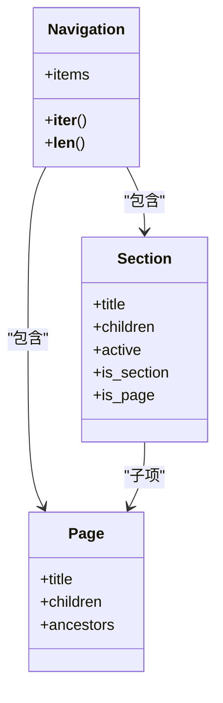
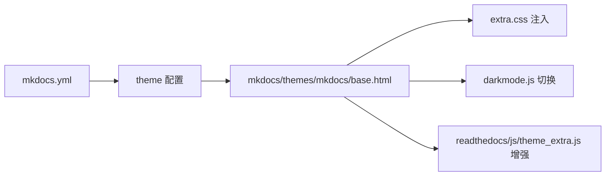
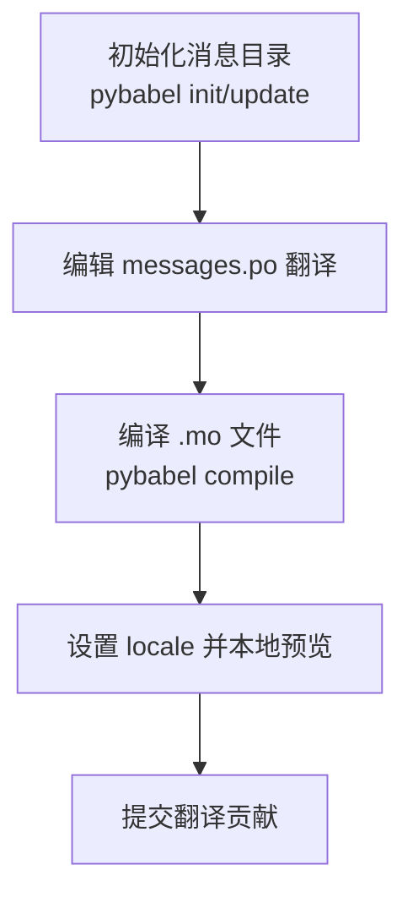
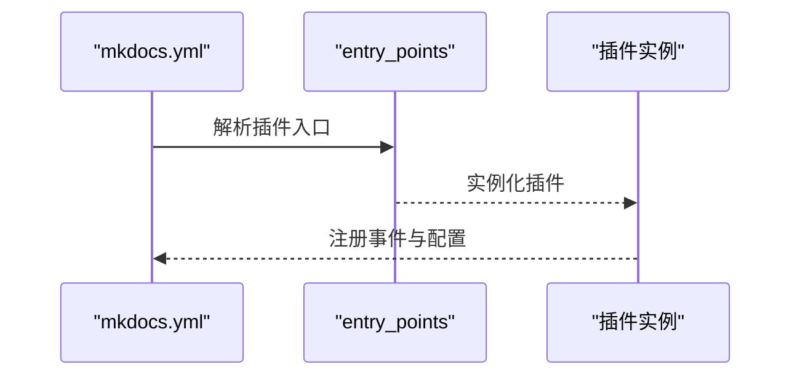
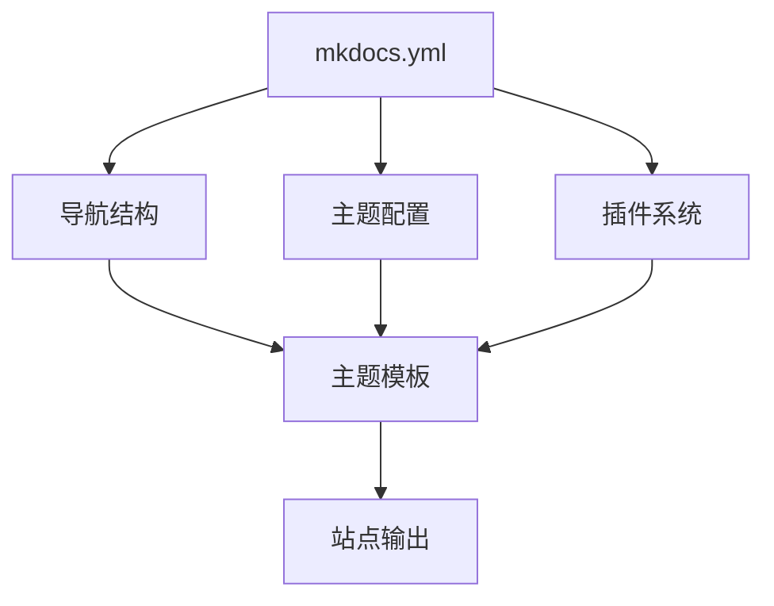

# 文档编写

<cite>
**本文引用的文件**
- [docs/index.md](file://docs/index.md)
- [docs/getting-started.md](file://docs/getting-started.md)
- [docs/user-guide/writing-your-docs.md](file://docs/user-guide/writing-your-docs.md)
- [docs/user-guide/configuration.md](file://docs/user-guide/configuration.md)
- [docs/user-guide/choosing-your-theme.md](file://docs/user-guide/choosing-your-theme.md)
- [docs/user-guide/customizing-your-theme.md](file://docs/user-guide/customizing-your-theme.md)
- [docs/dev-guide/translations.md](file://docs/dev-guide/translations.md)
- [docs/dev-guide/plugins.md](file://docs/dev-guide/plugins.md)
- [docs/dev-guide/themes.md](file://docs/dev-guide/themes.md)
- [docs/css/extra.css](file://docs/css/extra.css)
- [mkdocs.yml](file://mkdocs.yml)
- [mkdocs/structure/nav.py](file://mkdocs/structure/nav.py)
- [mkdocs/themes/mkdocs/base.html](file://mkdocs/themes/mkdocs/base.html)
- [mkdocs/themes/mkdocs/js/darkmode.js](file://mkdocs/themes/mkdocs/js/darkmode.js)
- [mkdocs/themes/readthedocs/js/theme_extra.js](file://mkdocs/themes/readthedocs/js/theme_extra.js)
- [mkdocs/plugins.py](file://mkdocs/plugins.py)
- [mkdocs/tests/structure/nav_tests.py](file://mkdocs/tests/structure/nav_tests.py)
</cite>

## 目录
1. [引言](#引言)
2. [项目结构](#项目结构)
3. [核心组件](#核心组件)
4. [架构总览](#架构总览)
5. [详细组件分析](#详细组件分析)
6. [依赖关系分析](#依赖关系分析)
7. [性能考量](#性能考量)
8. [故障排查指南](#故障排查指南)
9. [结论](#结论)
10. [附录](#附录)

## 引言
本指南面向希望使用 MkDocs 构建高质量静态文档站点的作者与维护者。内容覆盖 Markdown 基础语法、页面与文件组织、元数据（front matter）与配置、导航与目录、页面标题策略、主题与样式定制、多语言本地化、插件与扩展、以及复杂结构与交互内容的实现思路。所有建议均以仓库内官方文档与配置为依据，并辅以可视化图示帮助理解。

## 项目结构
MkDocs 官方文档采用清晰的层次化组织：顶层入口页与“快速开始”引导，用户指南聚焦安装、写作、主题、配置、部署等；开发者指南覆盖主题与插件开发、翻译与本地化；CSS 自定义通过 extra.css 实现；根目录配置文件 mkdocs.yml 驱动构建与导航、插件与主题设置。

图表来源
- [docs/index.md](file://docs/index.md#L1-L90)
- [docs/getting-started.md](file://docs/getting-started.md#L1-L214)
- [docs/user-guide/README.md](file://docs/user-guide/README.md#L1-L22)
- [docs/dev-guide/README.md](file://docs/dev-guide/README.md#L1-L19)
- [docs/user-guide/writing-your-docs.md](file://docs/user-guide/writing-your-docs.md#L1-L541)
- [docs/user-guide/configuration.md](file://docs/user-guide/configuration.md#L1-L800)
- [docs/user-guide/choosing-your-theme.md](file://docs/user-guide/choosing-your-theme.md#L1-L230)
- [docs/user-guide/customizing-your-theme.md](file://docs/user-guide/customizing-your-theme.md#L1-L145)
- [docs/dev-guide/themes.md](file://docs/dev-guide/themes.md#L1-L200)
- [docs/dev-guide/plugins.md](file://docs/dev-guide/plugins.md#L1-L200)
- [docs/dev-guide/translations.md](file://docs/dev-guide/translations.md#L1-L222)
- [docs/css/extra.css](file://docs/css/extra.css#L1-L90)
- [mkdocs.yml](file://mkdocs.yml#L1-L80)
- [mkdocs/structure/nav.py](file://mkdocs/structure/nav.py#L41-L85)
- [mkdocs/themes/mkdocs/base.html](file://mkdocs/themes/mkdocs/base.html#L19-L33)
- [mkdocs/themes/mkdocs/js/darkmode.js](file://mkdocs/themes/mkdocs/js/darkmode.js#L1-L34)
- [mkdocs/themes/readthedocs/js/theme_extra.js](file://mkdocs/themes/readthedocs/js/theme_extra.js#L1-L8)

章节来源
- [docs/index.md](file://docs/index.md#L1-L90)
- [docs/getting-started.md](file://docs/getting-started.md#L1-L214)
- [docs/user-guide/README.md](file://docs/user-guide/README.md#L1-L22)
- [docs/dev-guide/README.md](file://docs/dev-guide/README.md#L1-L19)

## 核心组件
- 写作与文件组织：Markdown 文件布局、索引页命名、嵌套目录与 URL 映射、媒体资源复制规则。
- 元数据（Front Matter）：YAML 与 MultiMarkdown 两种风格，支持模板与标题解析优先级。
- 导航与目录：自动发现与手动配置、分节与子导航、绝对链接校验策略。
- 主题与样式：内置主题选项、extra_css/js 注入、自定义模板覆盖、深色模式与高亮。
- 多语言与本地化：babel 工具链、消息目录结构、主题文案翻译流程。
- 插件系统：插件注册与事件钩子、配置 schema、默认插件与覆盖机制。

章节来源
- [docs/user-guide/writing-your-docs.md](file://docs/user-guide/writing-your-docs.md#L7-L167)
- [docs/user-guide/writing-your-docs.md](file://docs/user-guide/writing-your-docs.md#L349-L466)
- [docs/user-guide/configuration.md](file://docs/user-guide/configuration.md#L235-L483)
- [docs/user-guide/choosing-your-theme.md](file://docs/user-guide/choosing-your-theme.md#L19-L132)
- [docs/user-guide/customizing-your-theme.md](file://docs/user-guide/customizing-your-theme.md#L1-L145)
- [docs/dev-guide/translations.md](file://docs/dev-guide/translations.md#L28-L222)
- [mkdocs/plugins.py](file://mkdocs/plugins.py#L1-L50)

## 架构总览
下图展示了从配置到渲染的关键路径：mkdocs.yml 驱动构建，导航结构由结构模块生成，主题模板负责页面输出，插件在生命周期事件中参与处理。

图表来源
- [mkdocs.yml](file://mkdocs.yml#L1-L80)
- [mkdocs/structure/nav.py](file://mkdocs/structure/nav.py#L41-L85)
- [mkdocs/themes/mkdocs/base.html](file://mkdocs/themes/mkdocs/base.html#L19-L33)
- [mkdocs/plugins.py](file://mkdocs/plugins.py#L1-L50)

## 详细组件分析

### Markdown 语法与页面组织
- 文件布局与命名：docs 目录默认，index.md 作为主页；README.md 可作为索引页但最终渲染为 index.html；隐藏文件与目录默认忽略。
- 嵌套目录映射为 URL 层级；非 Markdown 资源原样复制。
- 页面标题解析优先级：导航标题 > 页面元数据 title > Markdown 一级标题 > 文件名。
- 内部链接：推荐相对路径；锚点基于 toc 扩展生成的 ID；绝对链接可启用“相对根”校验以提升一致性。

图表来源
- [docs/user-guide/writing-your-docs.md](file://docs/user-guide/writing-your-docs.md#L7-L167)
- [docs/user-guide/writing-your-docs.md](file://docs/user-guide/writing-your-docs.md#L192-L302)
- [docs/user-guide/writing-your-docs.md](file://docs/user-guide/writing-your-docs.md#L349-L466)

章节来源
- [docs/user-guide/writing-your-docs.md](file://docs/user-guide/writing-your-docs.md#L7-L167)
- [docs/user-guide/writing-your-docs.md](file://docs/user-guide/writing-your-docs.md#L192-L302)
- [docs/user-guide/writing-your-docs.md](file://docs/user-guide/writing-your-docs.md#L349-L466)

### 元数据（Front Matter）与页面标题
- 支持 YAML 与 MultiMarkdown 两种风格；YAML 风格以分隔符包裹，键大小写敏感且需小写；MultiMarkdown 键不区分大小写，支持多行值。
- 预定义键：template 指定页面模板；title 覆盖默认标题解析。
- 标题解析顺序：导航配置 > 页面元数据 > Markdown 一级标题（含 Setext）> 文件名。

图表来源
- [docs/user-guide/writing-your-docs.md](file://docs/user-guide/writing-your-docs.md#L349-L466)

章节来源
- [docs/user-guide/writing-your-docs.md](file://docs/user-guide/writing-your-docs.md#L349-L466)

### 导航生成与目录结构
- 自动导航：按文件名排序，索引文件优先；手动配置 nav 可指定层级与标题。
- 子导航：通过分组创建节；节不可直接挂载页面，仅作为容器。
- 绝对链接校验：新增“相对根”模式，使以 / 开头的链接按 docs_dir 根相对进行校验与修正。

图表来源
- [mkdocs/structure/nav.py](file://mkdocs/structure/nav.py#L41-L85)
- [mkdocs/tests/structure/nav_tests.py](file://mkdocs/tests/structure/nav_tests.py#L259-L285)

章节来源
- [docs/user-guide/configuration.md](file://docs/user-guide/configuration.md#L235-L483)
- [mkdocs/structure/nav.py](file://mkdocs/structure/nav.py#L41-L85)
- [mkdocs/tests/structure/nav_tests.py](file://mkdocs/tests/structure/nav_tests.py#L259-L285)

### 主题与样式定制
- 内置主题：mkdocs 与 readthedocs；支持颜色模式、高亮、快捷键、导航深度、本地化等配置。
- 自定义样式：通过 extra_css 注入；通过 theme.custom_dir 覆盖模板与静态资源。
- 深色模式：主题脚本切换 data-bs-theme 并联动高亮样式；支持用户切换菜单。

图表来源
- [docs/user-guide/choosing-your-theme.md](file://docs/user-guide/choosing-your-theme.md#L19-L132)
- [docs/user-guide/customizing-your-theme.md](file://docs/user-guide/customizing-your-theme.md#L1-L145)
- [docs/css/extra.css](file://docs/css/extra.css#L1-L90)
- [mkdocs/themes/mkdocs/base.html](file://mkdocs/themes/mkdocs/base.html#L19-L33)
- [mkdocs/themes/mkdocs/js/darkmode.js](file://mkdocs/themes/mkdocs/js/darkmode.js#L1-L34)
- [mkdocs/themes/readthedocs/js/theme_extra.js](file://mkdocs/themes/readthedocs/js/theme_extra.js#L1-L8)

章节来源
- [docs/user-guide/choosing-your-theme.md](file://docs/user-guide/choosing-your-theme.md#L19-L132)
- [docs/user-guide/customizing-your-theme.md](file://docs/user-guide/customizing-your-theme.md#L1-L145)
- [docs/css/extra.css](file://docs/css/extra.css#L1-L90)

### 多语言与本地化
- 使用 babel 管理消息目录；为 mkdocs 与 readthedocs 主题生成与编译 .po/.mo 文件。
- 在 mkdocs.yml 中设置 theme.locale 启用特定语言；测试时可临时修改 locale 并运行本地服务验证。
- 第三方主题如需使用翻译工具，需正确配置主题以支持本地化。

图表来源
- [docs/dev-guide/translations.md](file://docs/dev-guide/translations.md#L82-L222)

章节来源
- [docs/dev-guide/translations.md](file://docs/dev-guide/translations.md#L28-L222)

### 插件系统与扩展
- 插件安装与启用：第三方插件通过 pip 安装并在 mkdocs.yml 的 plugins 列表中启用。
- 插件注册：通过 setuptools entry_points 暴露，名称即用户配置中的插件名。
- 默认插件与覆盖：可通过配置覆盖或禁用默认插件；插件可定义配置 schema 并在构建生命周期中响应事件。

图表来源
- [docs/dev-guide/plugins.md](file://docs/dev-guide/plugins.md#L57-L200)
- [mkdocs/plugins.py](file://mkdocs/plugins.py#L1-L50)

章节来源
- [docs/dev-guide/plugins.md](file://docs/dev-guide/plugins.md#L1-L200)
- [mkdocs/plugins.py](file://mkdocs/plugins.py#L1-L50)

### 复杂结构与交互内容
- 表格与围栏代码块：表格语法简洁，单元格不允许多行与块级元素；围栏代码块支持语言标识与嵌套限制。
- 目录与锚点：toc 扩展生成 ID，支持永久链接、基层级与分隔符配置。
- 交互增强：readthedocs 主题脚本为表格添加类名以适配样式与行为；mkdocs 主题脚本提供深色模式切换与高亮联动。

章节来源
- [docs/user-guide/writing-your-docs.md](file://docs/user-guide/writing-your-docs.md#L467-L541)
- [docs/user-guide/writing-your-docs.md](file://docs/user-guide/writing-your-docs.md#L227-L302)
- [mkdocs/themes/readthedocs/js/theme_extra.js](file://mkdocs/themes/readthedocs/js/theme_extra.js#L1-L8)
- [mkdocs/themes/mkdocs/js/darkmode.js](file://mkdocs/themes/mkdocs/js/darkmode.js#L1-L34)

## 依赖关系分析
- 配置驱动：mkdocs.yml 是唯一必需项，其余均为可选；theme 与 plugins 影响渲染与功能。
- 导航依赖：导航结构由结构模块统一管理，模板通过上下文消费。
- 主题依赖：主题模板负责样式与脚本注入；extra_css/js 与 custom_dir 提供扩展点。
- 插件依赖：插件通过事件钩子参与构建流程，彼此独立但共享上下文。

图表来源
- [mkdocs.yml](file://mkdocs.yml#L1-L80)
- [mkdocs/structure/nav.py](file://mkdocs/structure/nav.py#L41-L85)
- [mkdocs/themes/mkdocs/base.html](file://mkdocs/themes/mkdocs/base.html#L19-L33)
- [mkdocs/plugins.py](file://mkdocs/plugins.py#L1-L50)

章节来源
- [mkdocs.yml](file://mkdocs.yml#L1-L80)

## 性能考量
- 构建优化：合理组织导航与页面数量，避免过深嵌套；减少不必要的媒体与脚本资源。
- 样式与脚本：合并与压缩 CSS/JS，按需加载；利用主题提供的高亮与懒加载能力。
- 预览与热重载：仅监听必要目录，缩短等待时间；在本地开发时开启严格模式以尽早发现问题。

## 故障排查指南
- 链接与锚点：启用绝对链接校验（相对根）以减少部署后失效；检查锚点 ID 是否与标题一致。
- 导航缺失：确认未被排除的文件已纳入 nav 或自动发现；使用 not_in_nav 显式声明排除以消除警告。
- 标题异常：若页面标题不符合预期，检查 Front Matter title 与一级标题；确认导航标题覆盖优先级。
- 插件冲突：逐项禁用插件定位问题；核对插件配置 schema 与版本兼容性。
- 本地化：确保 .po/.mo 编译成功；在 mkdocs.yml 中设置 locale 进行验证。

章节来源
- [docs/user-guide/configuration.md](file://docs/user-guide/configuration.md#L390-L483)
- [docs/user-guide/writing-your-docs.md](file://docs/user-guide/writing-your-docs.md#L349-L466)
- [docs/dev-guide/plugins.md](file://docs/dev-guide/plugins.md#L57-L200)
- [docs/dev-guide/translations.md](file://docs/dev-guide/translations.md#L170-L222)

## 结论
通过规范的文件组织、严谨的元数据与配置、合理的导航与目录设计、主题与样式的灵活定制，以及插件与本地化的协同，MkDocs 能够高效产出高质量的静态文档站点。建议在团队内建立统一的写作与配置规范，并结合严格校验与本地化流程，持续提升文档质量与用户体验。

## 附录
- 快速参考清单
  - 必备配置：site_name；可选：site_url、repo_url、theme、plugins、nav、markdown_extensions。
  - 写作规范：使用相对链接与锚点；为重要页面提供 Front Matter title；表格与代码块遵循扩展规则。
  - 主题定制：优先使用 extra_css/js；需要模板覆盖时使用 theme.custom_dir。
  - 多语言：使用 babel 管理翻译；在 mkdocs.yml 设置 locale 并本地验证。
  - 插件使用：明确插件职责与配置；避免冲突；关注默认插件覆盖策略。