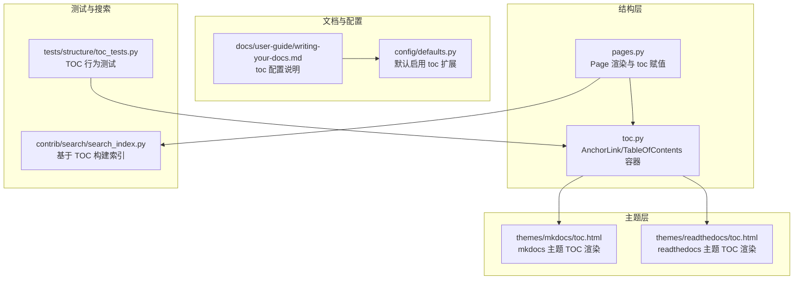
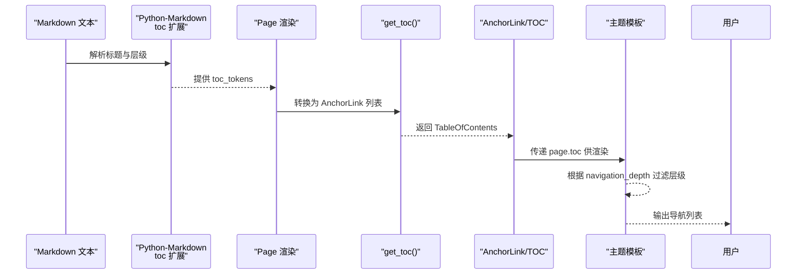
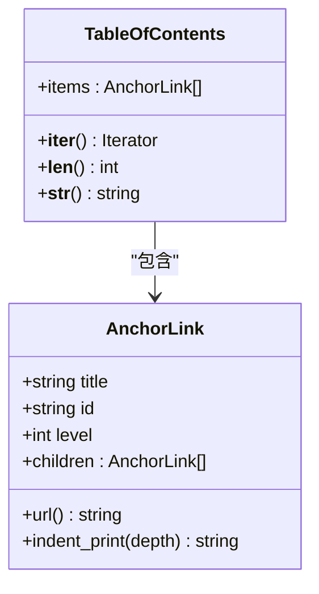
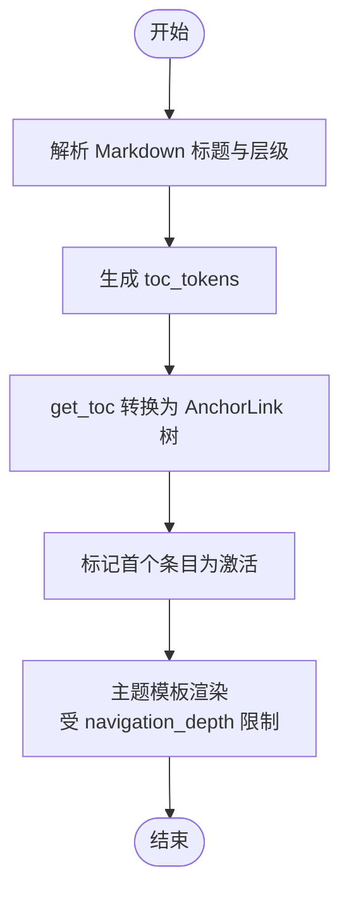
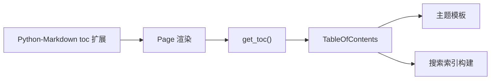

# 目录与标题生成

<cite>
**本文引用的文件**
- [mkdocs/structure/toc.py](file://mkdocs/structure/toc.py)
- [mkdocs/structure/pages.py](file://mkdocs/structure/pages.py)
- [mkdocs/themes/mkdocs/toc.html](file://mkdocs/themes/mkdocs/toc.html)
- [mkdocs/themes/readthedocs/toc.html](file://mkdocs/themes/readthedocs/toc.html)
- [docs/user-guide/writing-your-docs.md](file://docs/user-guide/writing-your-docs.md)
- [mkdocs/config/defaults.py](file://mkdocs/config/defaults.py)
- [mkdocs/tests/structure/toc_tests.py](file://mkdocs/tests/structure/toc_tests.py)
- [mkdocs/contrib/search/search_index.py](file://mkdocs/contrib/search/search_index.py)
</cite>

## 目录
1. [简介](#简介)
2. [项目结构](#项目结构)
3. [核心组件](#核心组件)
4. [架构总览](#架构总览)
5. [组件详解](#组件详解)
6. [依赖关系分析](#依赖关系分析)
7. [性能考量](#性能考量)
8. [故障排查指南](#故障排查指南)
9. [结论](#结论)
10. [附录](#附录)

## 简介
本指南聚焦于 MkDocs 的目录（Table of Contents, TOC）与标题生成机制，系统讲解以下内容：
- toc 扩展的工作原理与与 MkDocs 的集成方式
- 自动生成标题 ID 的规则与行为（小写转换、字符替换、连字符处理等）
- toc 扩展的关键配置项：permalink、baselevel、separator 等及其用法
- 如何通过锚点链接实现页面内导航
- 标题层级与 HTML 结构的关系
- toc 配置的实际示例与效果对比
- toc 与其他 Markdown 扩展的兼容性
- 生成 TOC 的性能考虑与优化建议

## 项目结构
围绕 TOC 与标题生成的相关模块分布如下：
- 结构层：负责从 Markdown 渲染结果中提取 TOC，并封装为可渲染对象
- 主题层：提供 TOC 在模板中的渲染逻辑
- 文档层：给出 toc 扩展的配置说明与示例
- 测试层：验证 TOC 的层级、ID 生成、HTML 内容等行为
- 搜索层：利用 TOC 中的标题 ID 与标题文本构建搜索索引

图表来源
- [mkdocs/structure/pages.py](file://mkdocs/structure/pages.py#L285-L285)
- [mkdocs/structure/toc.py](file://mkdocs/structure/toc.py#L20-L25)
- [mkdocs/themes/mkdocs/toc.html](file://mkdocs/themes/mkdocs/toc.html#L1-L27)
- [mkdocs/themes/readthedocs/toc.html](file://mkdocs/themes/readthedocs/toc.html#L1-L13)
- [docs/user-guide/writing-your-docs.md](file://docs/user-guide/writing-your-docs.md#L240-L302)
- [mkdocs/config/defaults.py](file://mkdocs/config/defaults.py#L132-L134)
- [mkdocs/tests/structure/toc_tests.py](file://mkdocs/tests/structure/toc_tests.py#L1-L199)
- [mkdocs/contrib/search/search_index.py](file://mkdocs/contrib/search/search_index.py#L34-L92)

章节来源
- [mkdocs/structure/pages.py](file://mkdocs/structure/pages.py#L1-L200)
- [mkdocs/structure/toc.py](file://mkdocs/structure/toc.py#L1-L81)
- [mkdocs/themes/mkdocs/toc.html](file://mkdocs/themes/mkdocs/toc.html#L1-L27)
- [mkdocs/themes/readthedocs/toc.html](file://mkdocs/themes/readthedocs/toc.html#L1-L13)
- [docs/user-guide/writing-your-docs.md](file://docs/user-guide/writing-your-docs.md#L240-L302)
- [mkdocs/config/defaults.py](file://mkdocs/config/defaults.py#L132-L134)
- [mkdocs/tests/structure/toc_tests.py](file://mkdocs/tests/structure/toc_tests.py#L1-L199)
- [mkdocs/contrib/search/search_index.py](file://mkdocs/contrib/search/search_index.py#L34-L92)

## 核心组件
- AnchorLink：单个目录条目，包含标题文本、ID、层级与子节点列表；提供 url 属性用于页面内锚点跳转
- TableOfContents：目录容器，迭代器接口，支持长度查询与字符串化输出
- get_toc：将 Python-Markdown toc 扩展生成的令牌列表转换为 AnchorLink 树
- Page.toc：页面级属性，保存当前页的 TableOfContents
- 主题模板：根据配置的 navigation_depth 控制 TOC 展示层级，并渲染为导航列表

章节来源
- [mkdocs/structure/toc.py](file://mkdocs/structure/toc.py#L20-L81)
- [mkdocs/structure/pages.py](file://mkdocs/structure/pages.py#L82-L86)
- [mkdocs/themes/mkdocs/toc.html](file://mkdocs/themes/mkdocs/toc.html#L8-L26)
- [mkdocs/themes/readthedocs/toc.html](file://mkdocs/themes/readthedocs/toc.html#L1-L13)

## 架构总览
MkDocs 使用 Python-Markdown 的 toc 扩展生成标题树，随后由 MkDocs 将其转换为 AnchorLink/ TableOfContents 对象，最终在主题模板中渲染为导航列表。

图表来源
- [mkdocs/structure/pages.py](file://mkdocs/structure/pages.py#L285-L285)
- [mkdocs/structure/toc.py](file://mkdocs/structure/toc.py#L20-L25)
- [mkdocs/themes/mkdocs/toc.html](file://mkdocs/themes/mkdocs/toc.html#L8-L26)

## 组件详解

### TOC 数据模型与锚点
- AnchorLink.url 返回形如 "#id" 的片段，用于页面内锚点跳转
- TableOfContents 支持遍历与长度查询，便于模板渲染与导航控制
- get_toc 会将第一个顶级条目标记为“激活”，便于主题高亮当前章节

图表来源
- [mkdocs/structure/toc.py](file://mkdocs/structure/toc.py#L28-L81)

章节来源
- [mkdocs/structure/toc.py](file://mkdocs/structure/toc.py#L28-L81)

### 页面渲染与 TOC 注入
- Page 在渲染过程中调用 get_toc，将 Python-Markdown toc 扩展提供的 toc_tokens 转换为页面级 toc 属性
- toc 属性类型为 TableOfContents，供模板访问

章节来源
- [mkdocs/structure/pages.py](file://mkdocs/structure/pages.py#L285-L285)
- [mkdocs/structure/toc.py](file://mkdocs/structure/toc.py#L20-L25)

### 主题中的 TOC 渲染
- mkdocs 主题：通过宏递归渲染目录项，依据配置的 navigation_depth 控制层级深度
- readthedocs 主题：同样递归渲染，支持嵌套列表与层级计数

章节来源
- [mkdocs/themes/mkdocs/toc.html](file://mkdocs/themes/mkdocs/toc.html#L8-L26)
- [mkdocs/themes/readthedocs/toc.html](file://mkdocs/themes/readthedocs/toc.html#L1-L13)

### toc 扩展配置项与行为
- permalink：为每个标题生成永久链接（锚点），默认关闭；可设为 True 或自定义字符串
- baselevel：调整标题层级基线，使生成的 HTML 头部层级适配模板结构
- separator：设置生成 ID 时空白字符的替换符，默认连字符；可改为下划线等

章节来源
- [docs/user-guide/writing-your-docs.md](file://docs/user-guide/writing-your-docs.md#L240-L302)

### 标题 ID 生成与锚点链接
- 锚点链接格式为 "#id"，由 AnchorLink.url 提供
- 页面内跳转通过浏览器解析 URL 片段定位到对应标题位置
- 导航深度由主题模板读取配置进行过滤，避免过深层级影响阅读体验

章节来源
- [mkdocs/structure/toc.py](file://mkdocs/structure/toc.py#L38-L41)
- [mkdocs/themes/mkdocs/toc.html](file://mkdocs/themes/mkdocs/toc.html#L8-L17)

### 标题层级与 HTML 结构的关系
- Python-Markdown toc 扩展生成的层级与最终 HTML 的 h1-h6 层级一一对应
- baselevel 可将文档层级整体上移或下移，以匹配模板期望的头部层级
- 主题模板根据 navigation_depth 限制展示层级，避免深层嵌套

章节来源
- [docs/user-guide/writing-your-docs.md](file://docs/user-guide/writing-your-docs.md#L257-L274)
- [mkdocs/themes/mkdocs/toc.html](file://mkdocs/themes/mkdocs/toc.html#L8-L17)

### toc 配置示例与效果对比
- 示例：在 markdown_extensions 中配置 toc 的 permalink、baselevel、separator
- 效果：生成的标题 ID 默认使用连字符分隔，可改为下划线；标题末尾出现永久链接图标；文档层级整体提升或降低

章节来源
- [docs/user-guide/writing-your-docs.md](file://docs/user-guide/writing-your-docs.md#L240-L302)

### toc 与其他 Markdown 扩展的兼容性
- 默认启用 toc 扩展，同时支持 tables、fenced_code 等常用扩展
- toc 与表格、围栏代码块等扩展共存，互不冲突

章节来源
- [mkdocs/config/defaults.py](file://mkdocs/config/defaults.py#L132-L134)

### TOC 生成算法与 ID 规则（基于测试与实现）
- 层级序列：测试覆盖了混合层级场景，验证层级顺序与父子关系
- HTML 标题：即使标题包含 HTML 标签，ID 仍按纯文本生成，锚点可用
- 实体引用：特殊字符（如 &、>、<）会被转义为实体引用，ID 仍保持稳定
- 字符引用：支持数字型字符引用，ID 生成不受影响
- 嵌套锚点：若标题内包含锚点标签，标题文本仍按预期提取，ID 生成正常

图表来源
- [mkdocs/structure/pages.py](file://mkdocs/structure/pages.py#L285-L285)
- [mkdocs/structure/toc.py](file://mkdocs/structure/toc.py#L20-L25)
- [mkdocs/themes/mkdocs/toc.html](file://mkdocs/themes/mkdocs/toc.html#L8-L17)

章节来源
- [mkdocs/tests/structure/toc_tests.py](file://mkdocs/tests/structure/toc_tests.py#L10-L199)
- [mkdocs/structure/toc.py](file://mkdocs/structure/toc.py#L20-L25)

## 依赖关系分析
- Page 依赖 Python-Markdown toc 扩展生成的 toc_tokens，并通过 get_toc 转换为 TableOfContents
- 主题模板依赖 page.toc 进行渲染，且受 navigation_depth 影响
- 搜索模块通过 TOC 的 id 与 title 构建索引条目，确保搜索结果与标题锚点一致

图表来源
- [mkdocs/structure/pages.py](file://mkdocs/structure/pages.py#L285-L285)
- [mkdocs/structure/toc.py](file://mkdocs/structure/toc.py#L20-L25)
- [mkdocs/contrib/search/search_index.py](file://mkdocs/contrib/search/search_index.py#L34-L92)

章节来源
- [mkdocs/structure/pages.py](file://mkdocs/structure/pages.py#L11-L20)
- [mkdocs/structure/toc.py](file://mkdocs/structure/toc.py#L20-L25)
- [mkdocs/contrib/search/search_index.py](file://mkdocs/contrib/search/search_index.py#L34-L92)

## 性能考量
- TOC 生成依赖 Python-Markdown toc 扩展，通常开销较小；在大文档中建议：
  - 合理设置 navigation_depth，减少渲染层级与 DOM 节点数量
  - 避免过度嵌套标题，保持层级扁平化有助于提升渲染效率
  - 若仅需简单导航，可考虑禁用 permalink 以减少额外元素
- 搜索索引构建会遍历 TOC，层级越深、条目越多，索引构建时间越长；可通过精简标题层级与数量优化

## 故障排查指南
- 标题未出现在 TOC 中
  - 检查是否正确启用了 toc 扩展与相关配置
  - 确认标题层级是否超过 navigation_depth
- 锚点无法跳转
  - 确认标题 ID 是否存在，锚点链接应为 "#id" 格式
  - 检查页面是否包含重复 ID（同一页面内不应重复）
- 标题 ID 异常
  - 检查 separator 设置与标题中的特殊字符
  - 若标题包含 HTML 或实体引用，确认其对 ID 生成的影响
- 深度层级显示异常
  - 调整 baselevel 与 navigation_depth，确保与模板头部层级匹配

章节来源
- [mkdocs/themes/mkdocs/toc.html](file://mkdocs/themes/mkdocs/toc.html#L8-L17)
- [docs/user-guide/writing-your-docs.md](file://docs/user-guide/writing-your-docs.md#L240-L302)
- [mkdocs/tests/structure/toc_tests.py](file://mkdocs/tests/structure/toc_tests.py#L10-L199)

## 结论
MkDocs 的 TOC 与标题生成以 Python-Markdown toc 扩展为核心，结合 MkDocs 的数据模型与主题模板，实现了灵活、可配置的目录导航能力。通过合理设置 baselevel、separator、permalink 等参数，以及控制 navigation_depth，可以在不同主题与页面结构下获得一致且易用的导航体验。配合搜索模块，标题 ID 与锚点还为站内检索提供了基础支撑。

## 附录
- 配置参考与示例请参阅官方用户指南中的 toc 扩展说明
- 测试用例展示了多种标题组合与行为边界，可作为实践参考

章节来源
- [docs/user-guide/writing-your-docs.md](file://docs/user-guide/writing-your-docs.md#L240-L302)
- [mkdocs/tests/structure/toc_tests.py](file://mkdocs/tests/structure/toc_tests.py#L10-L199)