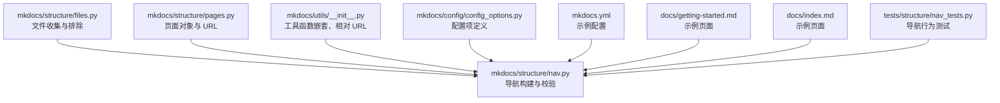
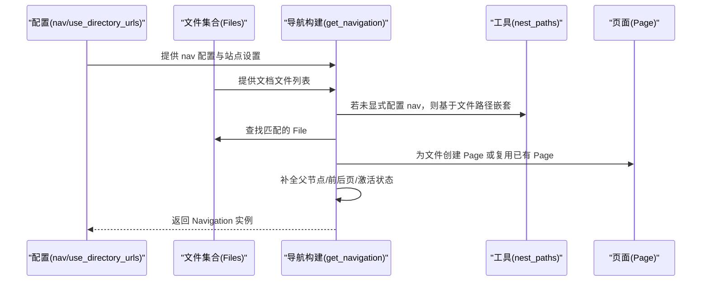
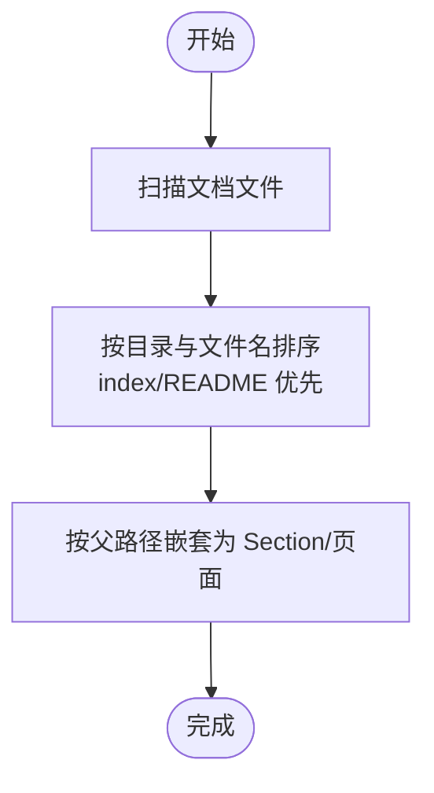
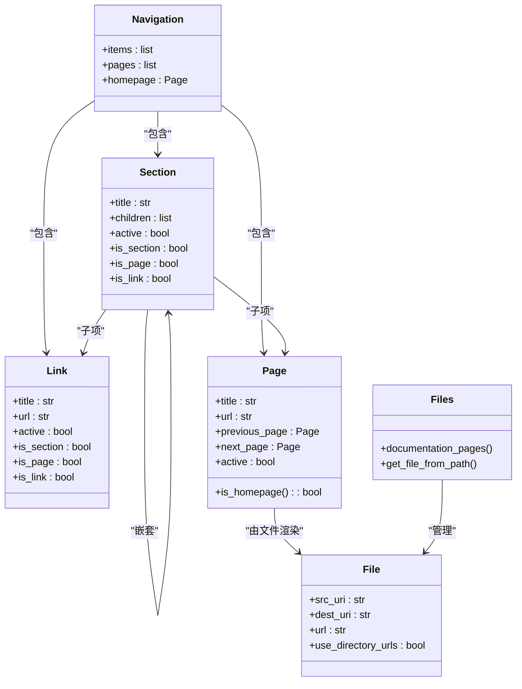
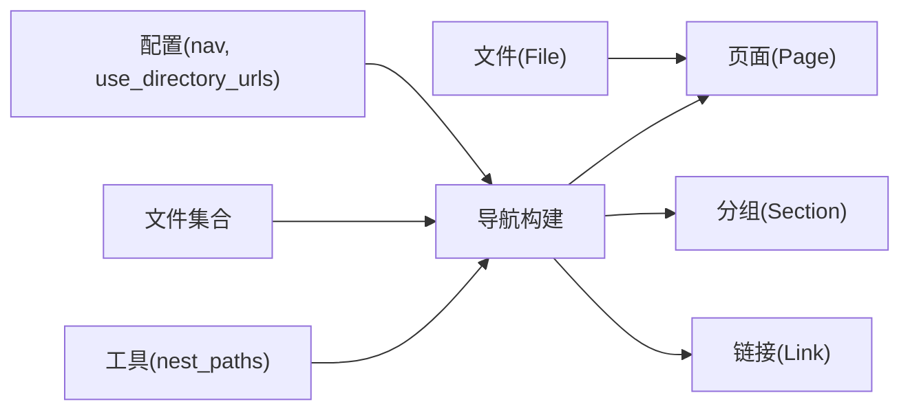

# 页面与导航配置

<cite>
**本文引用的文件**
- [mkdocs/structure/nav.py](file://mkdocs/structure/nav.py)
- [mkdocs/structure/files.py](file://mkdocs/structure/files.py)
- [mkdocs/structure/pages.py](file://mkdocs/structure/pages.py)
- [mkdocs/utils/__init__.py](file://mkdocs/utils/__init__.py)
- [mkdocs/config/config_options.py](file://mkdocs/config/config_options.py)
- [mkdocs/tests/structure/nav_tests.py](file://mkdocs/tests/structure/nav_tests.py)
- [mkdocs.yml](file://mkdocs.yml)
- [docs/getting-started.md](file://docs/getting-started.md)
- [docs/index.md](file://docs/index.md)
</cite>

## 目录
1. [简介](#简介)
2. [项目结构](#项目结构)
3. [核心组件](#核心组件)
4. [架构总览](#架构总览)
5. [详细组件分析](#详细组件分析)
6. [依赖关系分析](#依赖关系分析)
7. [性能考量](#性能考量)
8. [故障排查指南](#故障排查指南)
9. [结论](#结论)
10. [附录](#附录)

## 简介
本指南聚焦于 MkDocs 的“页面与导航配置”，围绕以下主题展开：
- 导航配置（nav）的基本语法与结构
- 自动导航生成的工作原理与排序规则
- 手动导航配置：页面链接、分组与嵌套
- 导航标题优先级规则：配置标题 > 页面标题 > 文件名
- 导航与文件目录结构的关系
- 多级导航菜单与子章节的构建
- 隐藏页面与 use_directory_urls 的影响
- 复杂导航结构的实际案例与最佳实践
- 导航性能优化与用户体验建议

## 项目结构
本仓库中与导航直接相关的实现主要集中在以下模块：
- 结构与导航：mkdocs/structure/nav.py
- 文件与目录扫描：mkdocs/structure/files.py
- 页面对象与 URL 计算：mkdocs/structure/pages.py
- 工具函数（路径嵌套、相对 URL 等）：mkdocs/utils/__init__.py
- 配置项定义（如 nav、use_directory_urls 等）：mkdocs/config/config_options.py
- 示例与测试：mkdocs.yml、docs/getting-started.md、docs/index.md、tests/structure/nav_tests.py

图表来源
- [mkdocs/structure/files.py](file://mkdocs/structure/files.py#L546-L588)
- [mkdocs/structure/nav.py](file://mkdocs/structure/nav.py#L130-L185)
- [mkdocs/structure/pages.py](file://mkdocs/structure/pages.py#L35-L170)
- [mkdocs/utils/__init__.py](file://mkdocs/utils/__init__.py#L338-L355)
- [mkdocs/config/config_options.py](file://mkdocs/config/config_options.py#L1-L200)
- [mkdocs.yml](file://mkdocs.yml#L20-L29)
- [docs/getting-started.md](file://docs/getting-started.md#L89-L97)
- [docs/index.md](file://docs/index.md#L1-L20)
- [mkdocs/tests/structure/nav_tests.py](file://mkdocs/tests/structure/nav_tests.py#L15-L37)

章节来源
- [mkdocs/structure/files.py](file://mkdocs/structure/files.py#L546-L588)
- [mkdocs/structure/nav.py](file://mkdocs/structure/nav.py#L130-L185)
- [mkdocs/structure/pages.py](file://mkdocs/structure/pages.py#L35-L170)
- [mkdocs/utils/__init__.py](file://mkdocs/utils/__init__.py#L338-L355)
- [mkdocs/config/config_options.py](file://mkdocs/config/config_options.py#L1-L200)
- [mkdocs.yml](file://mkdocs.yml#L20-L29)
- [docs/getting-started.md](file://docs/getting-started.md#L89-L97)
- [docs/index.md](file://docs/index.md#L1-L20)
- [mkdocs/tests/structure/nav_tests.py](file://mkdocs/tests/structure/nav_tests.py#L15-L37)

## 核心组件
- 导航模型
  - Navigation：导航根容器，包含 items（Section/Page/Link 的嵌套列表）与 pages（扁平化的页面列表）
  - Section：分组节点，可包含子节点（Section/Page/Link）
  - Link：外部或本地链接节点
- 页面与文件
  - Page：文档页面对象，包含标题、URL、上一页/下一页、父子关系等
  - File：文档文件对象，负责 src_uri、dest_uri、url、use_directory_urls 等
- 工具与配置
  - nest_paths：将路径列表转换为嵌套的导航结构
  - 配置项：nav、use_directory_urls、validation.nav.* 等

章节来源
- [mkdocs/structure/nav.py](file://mkdocs/structure/nav.py#L21-L128)
- [mkdocs/structure/pages.py](file://mkdocs/structure/pages.py#L35-L170)
- [mkdocs/structure/files.py](file://mkdocs/structure/files.py#L214-L253)
- [mkdocs/utils/__init__.py](file://mkdocs/utils/__init__.py#L338-L355)

## 架构总览
导航构建流程从配置与文件集合出发，按需自动生成嵌套结构，并在必要时创建 Page 对象，最后补全前后页与父子关系。

图表来源
- [mkdocs/structure/nav.py](file://mkdocs/structure/nav.py#L130-L185)
- [mkdocs/utils/__init__.py](file://mkdocs/utils/__init__.py#L338-L355)
- [mkdocs/structure/files.py](file://mkdocs/structure/files.py#L124-L128)

章节来源
- [mkdocs/structure/nav.py](file://mkdocs/structure/nav.py#L130-L185)
- [mkdocs/utils/__init__.py](file://mkdocs/utils/__init__.py#L338-L355)
- [mkdocs/structure/files.py](file://mkdocs/structure/files.py#L124-L128)

## 详细组件分析

### 导航配置语法与结构
- 基本形式
  - 列表：每个元素可以是字符串（文件路径）、字典（键为标题、值为路径）或字典列表（分组）
  - 字典：键为分组标题，值为该组内的条目列表
- 支持的条目类型
  - 页面：字符串或字典项映射到文档文件
  - 分组：字典项，其值为子列表
  - 链接：字符串或字典项，指向外部 URL 或本地非文档资源
- 示例参考
  - 官方示例中使用了列表与嵌套字典的组合，展示多级分组与页面链接

章节来源
- [mkdocs.yml](file://mkdocs.yml#L20-L29)
- [docs/getting-started.md](file://docs/getting-started.md#L89-L97)
- [mkdocs/tests/structure/nav_tests.py](file://mkdocs/tests/structure/nav_tests.py#L15-L37)

### 自动导航生成与排序规则
- 当 nav 未显式配置时，系统会基于文档文件的 src_uri 进行自动嵌套
- 排序策略
  - 先按目录层级排序，再按文件名排序；index 优先于其他文件
  - 文件名排序时，index/README 优先于其他文件
- 嵌套逻辑
  - 将路径按父目录逐层拆分，生成 Section 层级，末级为页面条目
- 相关实现
  - 自动嵌套：nest_paths
  - 文件排序键：file_sort_key

图表来源
- [mkdocs/structure/nav.py](file://mkdocs/structure/nav.py#L134-L136)
- [mkdocs/utils/__init__.py](file://mkdocs/utils/__init__.py#L338-L355)
- [mkdocs/structure/files.py](file://mkdocs/structure/files.py#L591-L600)

章节来源
- [mkdocs/structure/nav.py](file://mkdocs/structure/nav.py#L134-L136)
- [mkdocs/utils/__init__.py](file://mkdocs/utils/__init__.py#L338-L355)
- [mkdocs/structure/files.py](file://mkdocs/structure/files.py#L591-L600)

### 手动导航配置：页面链接、分组与嵌套
- 页面链接
  - 字符串：直接映射到文档文件
  - 字典：键为显示标题，值为文档路径
- 分组与嵌套
  - 字典项的值为列表，表示该分组下的子项
  - 可无限嵌套，形成多级菜单
- 外部链接
  - 字符串以 http/https 开头的视为外部链接
  - 绝对路径在特定校验模式下会被识别为外部资源

章节来源
- [mkdocs/structure/nav.py](file://mkdocs/structure/nav.py#L188-L223)
- [mkdocs/tests/structure/nav_tests.py](file://mkdocs/tests/structure/nav_tests.py#L201-L297)

### 导航标题优先级规则
- 规则
  - 配置中显式指定的标题优先于页面元数据中的标题，再优先于文件名
- 行为验证
  - 测试覆盖了无标题条目（[blank]）与有标题条目的差异
  - 当 nav 中未提供标题时，页面标题或文件名将被用于显示

章节来源
- [mkdocs/structure/nav.py](file://mkdocs/structure/nav.py#L203-L222)
- [mkdocs/tests/structure/nav_tests.py](file://mkdocs/tests/structure/nav_tests.py#L83-L104)

### 导航与文件目录结构的关系
- use_directory_urls 影响
  - True：页面输出为目录索引（foo/index.html），URL 末尾带斜杠
  - False：页面输出为独立 HTML（foo.html），URL 不带斜杠
- 文件与 URL 的映射
  - File.dest_uri 与 File.url 决定最终页面 URL
  - Page.url 为 File.url 的便捷属性
- 相关实现
  - File.url 与 dest_uri 的计算
  - Page.url 的简化处理

章节来源
- [mkdocs/structure/files.py](file://mkdocs/structure/files.py#L218-L225)
- [mkdocs/structure/files.py](file://mkdocs/structure/files.py#L389-L403)
- [mkdocs/structure/pages.py](file://mkdocs/structure/pages.py#L90-L96)

### 多级导航菜单与子章节
- 多级结构通过字典列表实现，支持任意深度嵌套
- 子节点的 parent/children 关系在构建完成后补全
- 激活状态（active）会沿祖先链路传播

章节来源
- [mkdocs/structure/nav.py](file://mkdocs/structure/nav.py#L239-L244)
- [mkdocs/tests/structure/nav_tests.py](file://mkdocs/tests/structure/nav_tests.py#L476-L533)

### 隐藏页面与 not_in_nav
- not_in_nav 与 exclude_docs 控制页面是否进入导航
- 使用 InclusionLevel 标记文件的包含级别
- 未在导航中的文件仍可参与构建，但不会出现在导航树中

章节来源
- [mkdocs/structure/files.py](file://mkdocs/structure/files.py#L31-L60)
- [mkdocs/structure/files.py](file://mkdocs/structure/files.py#L527-L544)
- [mkdocs/tests/structure/nav_tests.py](file://mkdocs/tests/structure/nav_tests.py#L419-L447)

### 导航校验与错误日志
- 外部链接与绝对路径的校验
  - 外部链接：记录 DEBUG 日志
  - 绝对路径在特定模式下被视为外部资源
  - 未找到的本地链接：根据配置发出警告
- 缺失文件的处理
  - 若 nav 中引用了不存在的文件，会记录相应级别的日志

章节来源
- [mkdocs/structure/nav.py](file://mkdocs/structure/nav.py#L164-L184)
- [mkdocs/tests/structure/nav_tests.py](file://mkdocs/tests/structure/nav_tests.py#L105-L171)

### 导航类与关系图

图表来源
- [mkdocs/structure/nav.py](file://mkdocs/structure/nav.py#L21-L128)
- [mkdocs/structure/pages.py](file://mkdocs/structure/pages.py#L35-L170)
- [mkdocs/structure/files.py](file://mkdocs/structure/files.py#L62-L129)

## 依赖关系分析
- 导航构建依赖文件集合与配置
- 自动嵌套依赖工具函数 nest_paths
- URL 与页面对象依赖 File 的 dest_uri/url 计算
- 测试覆盖了多种导航场景与边界条件

图表来源
- [mkdocs/structure/nav.py](file://mkdocs/structure/nav.py#L130-L185)
- [mkdocs/utils/__init__.py](file://mkdocs/utils/__init__.py#L338-L355)
- [mkdocs/structure/files.py](file://mkdocs/structure/files.py#L214-L253)
- [mkdocs/structure/pages.py](file://mkdocs/structure/pages.py#L35-L170)

章节来源
- [mkdocs/structure/nav.py](file://mkdocs/structure/nav.py#L130-L185)
- [mkdocs/utils/__init__.py](file://mkdocs/utils/__init__.py#L338-L355)
- [mkdocs/structure/files.py](file://mkdocs/structure/files.py#L214-L253)
- [mkdocs/structure/pages.py](file://mkdocs/structure/pages.py#L35-L170)

## 性能考量
- 自动导航生成
  - 在文件数量较多时，自动嵌套与排序会产生额外开销
  - 建议在大型项目中显式配置 nav，减少自动扫描与嵌套成本
- use_directory_urls
  - True 时 URL 更符合人类阅读习惯，但可能增加模板与链接处理复杂度
  - False 时 URL 更直白，便于静态托管
- 导航校验
  - 外部链接与未找到链接的日志会带来轻微 IO 与解析成本，建议在 CI 中关注警告

[本节为通用指导，不直接分析具体文件]

## 故障排查指南
- “页面存在于 docs 目录但未包含在 nav”
  - 现象：构建日志出现 omitted_files 警告
  - 处理：在 nav 中显式添加该页面，或调整 not_in_nav/exclude_docs
- “引用的链接未找到”
  - 现象：未找到本地链接的警告
  - 处理：检查路径大小写、相对路径与 use_directory_urls 设置
- “绝对路径被视作外部资源”
  - 现象：绝对路径在特定校验模式下被记录为外部资源
  - 处理：确认是否应为内部链接，或将路径改为相对路径
- “页面未激活/上一页/下一页为空”
  - 现象：导航高亮或前后页按钮无效
  - 处理：确认页面是否在 nav 中，以及是否正确设置了 active 与相邻页面顺序

章节来源
- [mkdocs/structure/nav.py](file://mkdocs/structure/nav.py#L157-L184)
- [mkdocs/tests/structure/nav_tests.py](file://mkdocs/tests/structure/nav_tests.py#L172-L199)

## 结论
- 显式配置 nav 是构建清晰、可控导航的最佳实践
- 自动导航适合小型项目或快速起步，但在大型项目中建议手动规划
- use_directory_urls 与 URL 生成密切相关，需结合站点托管策略统一决策
- 标题优先级与隐藏页面机制提供了灵活的导航定制能力
- 通过测试与日志，可有效定位导航问题并持续优化用户体验

[本节为总结性内容，不直接分析具体文件]

## 附录

### 实际案例与最佳实践
- 简单两层导航
  - 使用列表与字典混合，顶层为页面，次级为分组
  - 参考示例：mkdocs.yml 中的 nav 配置
- 多级嵌套
  - 通过字典列表实现任意深度分组
  - 参考测试：嵌套分组与子页面的断言
- 隐藏页面与排除
  - 使用 not_in_nav/exclude_docs 控制页面是否进入导航
  - 参考测试：排除调试/中间文件的场景
- 外部链接与本地链接混用
  - 外部链接以 http/https 开头，绝对路径在特定模式下被视为外部资源
  - 参考测试：外部链接与绝对路径的校验日志

章节来源
- [mkdocs.yml](file://mkdocs.yml#L20-L29)
- [mkdocs/tests/structure/nav_tests.py](file://mkdocs/tests/structure/nav_tests.py#L201-L297)
- [mkdocs/tests/structure/nav_tests.py](file://mkdocs/tests/structure/nav_tests.py#L419-L447)
- [mkdocs/tests/structure/nav_tests.py](file://mkdocs/tests/structure/nav_tests.py#L105-L171)