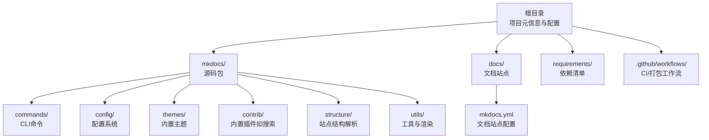
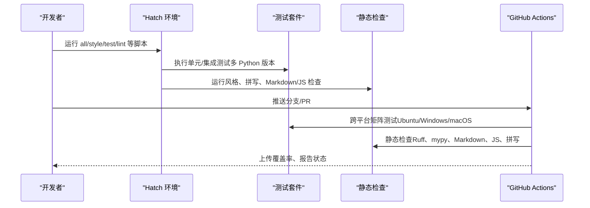
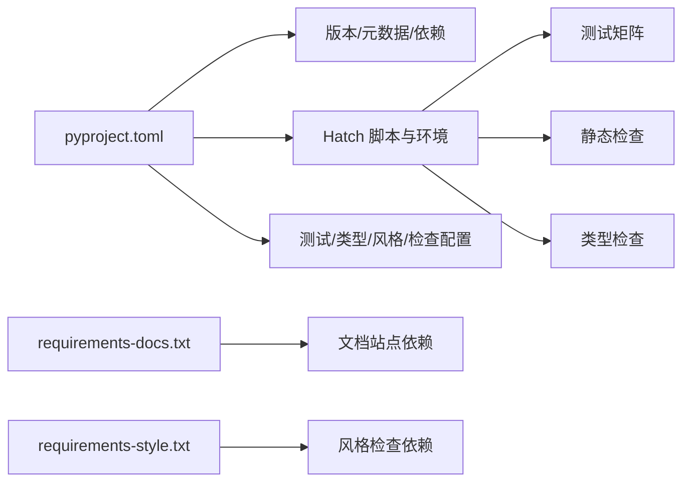

# 贡献指南

<cite>
**本文引用的文件**
- [CONTRIBUTING.md](file://CONTRIBUTING.md)
- [README.md](file://README.md)
- [pyproject.toml](file://pyproject.toml)
- [.github/workflows/ci.yml](file://.github/workflows/ci.yml)
- [requirements/requirements-docs.txt](file://requirements/requirements-docs.txt)
- [requirements/requirements-style.txt](file://requirements/requirements-style.txt)
- [mkdocs.yml](file://mkdocs.yml)
- [docs/dev-guide/README.md](file://docs/dev-guide/README.md)
- [docs/dev-guide/plugins.md](file://docs/dev-guide/plugins.md)
- [docs/dev-guide/translations.md](file://docs/dev-guide/translations.md)
- [docs/dev-guide/api.md](file://docs/dev-guide/api.md)
</cite>

## 目录
1. [简介](#简介)
2. [项目结构](#项目结构)
3. [核心组件](#核心组件)
4. [架构总览](#架构总览)
5. [详细组件分析](#详细组件分析)
6. [依赖关系分析](#依赖关系分析)
7. [性能考虑](#性能考虑)
8. [故障排查指南](#故障排查指南)
9. [结论](#结论)
10. [附录](#附录)

## 简介
本指南面向希望为 MkDocs 做出贡献的开发者与用户，覆盖开发环境搭建、代码规范、测试与检查流程、提交与评审流程、文档与翻译贡献方法、社区沟通渠道以及贡献认可机制。内容基于仓库中的贡献文档、构建与测试配置、工作流定义及开发者指南整理而成。

## 项目结构
- 根目录包含项目元信息、安装入口限制、构建与发布配置、依赖清单与工作流定义等。
- mkdocs/ 子目录为源码包，包含命令、配置、主题、插件、结构与工具模块。
- docs/ 子目录为官方文档站点，使用 MkDocs 自身构建，包含用户指南、开发者指南与关于页面。
- requirements/ 子目录包含文档与风格检查所需的依赖清单。
- .github/workflows/ 子目录包含持续集成与打包验证的工作流。

图表来源
- [pyproject.toml](file://pyproject.toml#L1-L240)
- [mkdocs.yml](file://mkdocs.yml#L1-L80)

章节来源
- [pyproject.toml](file://pyproject.toml#L1-L240)
- [mkdocs.yml](file://mkdocs.yml#L1-L80)

## 核心组件
- 开发工具链：Hatch 作为统一的环境与脚本执行器，管理虚拟环境、依赖与多矩阵测试。
- 测试与检查：单元测试、集成测试、类型检查、代码风格（Black/Isort/Ruff）、拼写与 Markdown/JS 静态检查。
- 文档站点：使用 MkDocs 自身构建，本地预览与校验。
- 工作流：GitHub Actions 执行跨平台矩阵测试、静态检查与包构建验证。

章节来源
- [CONTRIBUTING.md](file://CONTRIBUTING.md#L51-L120)
- [pyproject.toml](file://pyproject.toml#L104-L240)
- [.github/workflows/ci.yml](file://.github/workflows/ci.yml#L1-L105)

## 架构总览
下图展示了从本地开发到 CI 的整体流程：开发者在本地通过 Hatch 运行检查与测试；提交 PR 后由 GitHub Actions 执行跨平台矩阵测试、静态检查与包构建验证。

图表来源
- [CONTRIBUTING.md](file://CONTRIBUTING.md#L57-L120)
- [.github/workflows/ci.yml](file://.github/workflows/ci.yml#L1-L105)
- [pyproject.toml](file://pyproject.toml#L104-L240)

章节来源
- [.github/workflows/ci.yml](file://.github/workflows/ci.yml#L1-L105)
- [CONTRIBUTING.md](file://CONTRIBUTING.md#L57-L120)

## 详细组件分析

### 开发环境搭建与安装
- 使用 Hatch 作为开发与运行工具，统一管理虚拟环境与脚本。
- 安装方式建议使用可选的 Hatch，或在隔离环境中安装（如 pipx）。
- 如需直接克隆本地开发，推荐在虚拟环境中以可编辑模式安装。

章节来源
- [CONTRIBUTING.md](file://CONTRIBUTING.md#L47-L56)
- [setup.py](file://setup.py#L1-L14)

### 代码风格与静态检查
- Python 代码风格：Black、Isort、Ruff；配置位于 pyproject.toml。
- 类型检查：mypy；配置位于 pyproject.toml。
- 其他检查：拼写（codespell）、JS（JSHint）、Markdown（markdownlint-cli）。
- 一键运行：hatch run all 将依次执行格式化、类型检查、测试、静态检查与集成测试。

章节来源
- [CONTRIBUTING.md](file://CONTRIBUTING.md#L82-L120)
- [pyproject.toml](file://pyproject.toml#L167-L240)

### 测试与覆盖率
- 单元测试：通过 hatch envs.test.scripts 定义的 discover 命令执行。
- 集成测试：通过 hatch envs.integration.scripts 定义的测试模块执行。
- 多矩阵测试：Python 版本与操作系统矩阵，部分平台使用 PyPy。
- 覆盖率：使用 coverage 收集与报告。

章节来源
- [pyproject.toml](file://pyproject.toml#L116-L153)
- [.github/workflows/ci.yml](file://.github/workflows/ci.yml#L8-L54)

### 文档站点与本地预览
- 文档站点使用 mkdocs.yml 配置，包含导航、主题、插件与 Markdown 扩展。
- 本地预览：hatch run docs:serve；文档 WARNING 在合并前应清理。
- 文档依赖：requirements/requirements-docs.txt 中列出所需依赖。

章节来源
- [mkdocs.yml](file://mkdocs.yml#L1-L80)
- [CONTRIBUTING.md](file://CONTRIBUTING.md#L106-L122)
- [requirements/requirements-docs.txt](file://requirements/requirements-docs.txt#L1-L135)

### 插件开发与事件模型
- 插件基类与配置方案：通过 BasePlugin 与 config_scheme 或 Config 子类定义配置与验证。
- 事件体系：包含一次性事件、全局事件、模板事件与页面事件，按顺序触发。
- 错误处理：建议抛出特定异常以便用户友好提示，并可在 on_build_error 中清理资源。
- 日志：使用 mkdocs.plugins 命名空间的日志记录，遵循 MkDocs 的日志级别与输出风格。
- 发布：通过 setuptools entry_points 注册插件，发布至 PyPI 并加入 Catalog。

章节来源
- [docs/dev-guide/plugins.md](file://docs/dev-guide/plugins.md#L57-L567)

### 主题翻译与本地化
- 翻译工具：使用 Babel 生成与编译本地化文件（.pot/.po/.mo）。
- 更新流程：初始化新语言或更新现有翻译目录，编译后在 mkdocs.yml 中切换 locale 本地化进行测试。
- 提交要求：更新 pot 文件以配合翻译贡献者推进翻译工作。

章节来源
- [docs/dev-guide/translations.md](file://docs/dev-guide/translations.md#L1-L222)
- [CONTRIBUTING.md](file://CONTRIBUTING.md#L131-L175)

### 提交与评审流程
- Issue 报告：提供平台、版本、最小可复现配置、预期与实际结果、截图与完整错误信息。
- PR 提交：优先开启议题获取早期反馈；分支策略建议使用 commit/merge，避免强制推送；不手动修改发布说明。
- 内置主题变更：新增/修改可翻译文本时需更新 pot 文件并随 PR 提交。

章节来源
- [CONTRIBUTING.md](file://CONTRIBUTING.md#L17-L148)

### 社区沟通与支持
- 讨论与提问：使用 GitHub Discussions；小问题可使用 Gitter/Matrix 聊天室。
- Bug 与功能请求：在 GitHub Issues 中提交。
- 第三方主题/插件问题：请向对应项目反馈。

章节来源
- [README.md](file://README.md#L26-L42)

### 贡献认可与奖励
- 仓库未提供明确的“贡献奖励”机制说明；贡献认可主要体现在社区互动、PR 被合并与文档致谢中。
- 建议关注发布说明与社区公告以了解维护团队的感谢与致谢。

章节来源
- [README.md](file://README.md#L49-L58)

## 依赖关系分析
- 构建与分发：pyproject.toml 定义了构建后端、动态版本、可选依赖与入口点。
- 文档与样式：requirements/requirements-docs.txt 与 requirements/requirements-style.txt 分别管理文档与风格检查依赖。
- 工具链：Hatch 统一脚本与环境，Ruff/Black/Isort/mypy/codespell/jshint/markdownlint 等工具协同保证质量。

图表来源
- [pyproject.toml](file://pyproject.toml#L1-L240)
- [requirements/requirements-docs.txt](file://requirements/requirements-docs.txt#L1-L135)
- [requirements/requirements-style.txt](file://requirements/requirements-style.txt#L1-L25)

章节来源
- [pyproject.toml](file://pyproject.toml#L1-L240)
- [requirements/requirements-docs.txt](file://requirements/requirements-docs.txt#L1-L135)
- [requirements/requirements-style.txt](file://requirements/requirements-style.txt#L1-L25)

## 性能考虑
- 使用 Hatch 管理多 Python 版本与矩阵测试，减少本地环境差异带来的性能波动。
- 通过缓存与增量构建（如 watch）提升本地开发体验。
- 在 CI 中对关键步骤（测试、检查）进行并行化与矩阵化，缩短反馈周期。

## 故障排查指南
- 本地检查失败：优先运行 hatch run all，逐项修复风格、类型与静态检查问题。
- 测试失败：确认本地 Python 版本与依赖一致；必要时使用与 CI 相同的矩阵环境复现。
- 文档预览异常：确保已安装文档依赖并清理 WARNING；使用 hatch run docs:serve 验证。
- CI 失败：查看工作流日志中的具体步骤与错误信息，对照本地检查结果定位问题。

章节来源
- [CONTRIBUTING.md](file://CONTRIBUTING.md#L57-L120)
- [.github/workflows/ci.yml](file://.github/workflows/ci.yml#L1-L105)

## 结论
本指南总结了 MkDocs 项目的贡献路径：以 Hatch 为开发中枢，结合严格的代码风格与静态检查、完善的测试矩阵与 CI 验证、清晰的 Issue/PR 流程与社区沟通渠道，帮助贡献者高效地参与项目改进与扩展。对于插件与主题的开发者，建议深入理解事件模型与配置方案，确保兼容性与可维护性。

## 附录
- 开发者指南导航：包含主题、翻译、插件与 API 参考的入口。
- 插件 API 参考：涵盖文件、配置、模板上下文与热重载服务器等核心对象。

章节来源
- [docs/dev-guide/README.md](file://docs/dev-guide/README.md#L1-L19)
- [docs/dev-guide/api.md](file://docs/dev-guide/api.md#L1-L25)