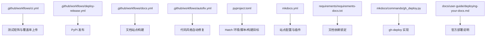
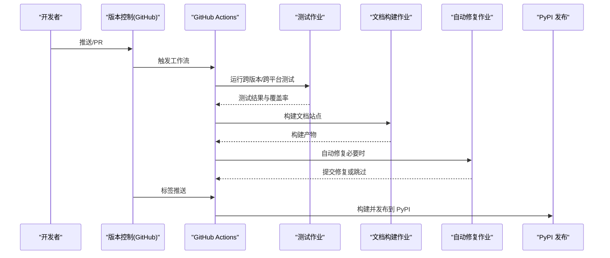
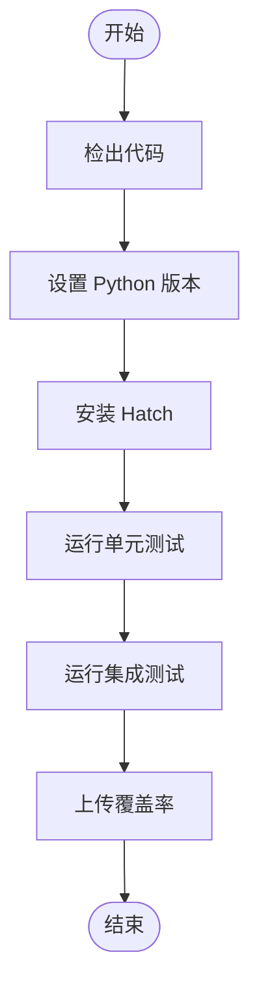
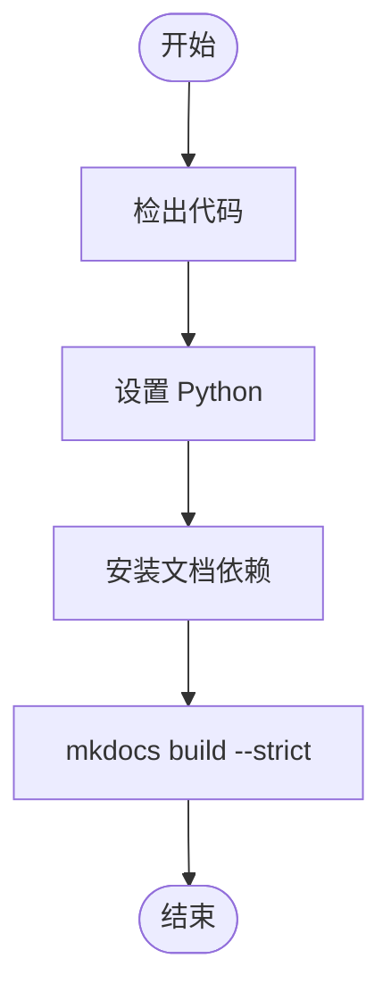
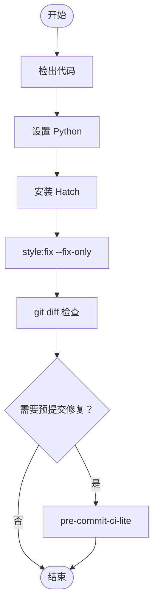
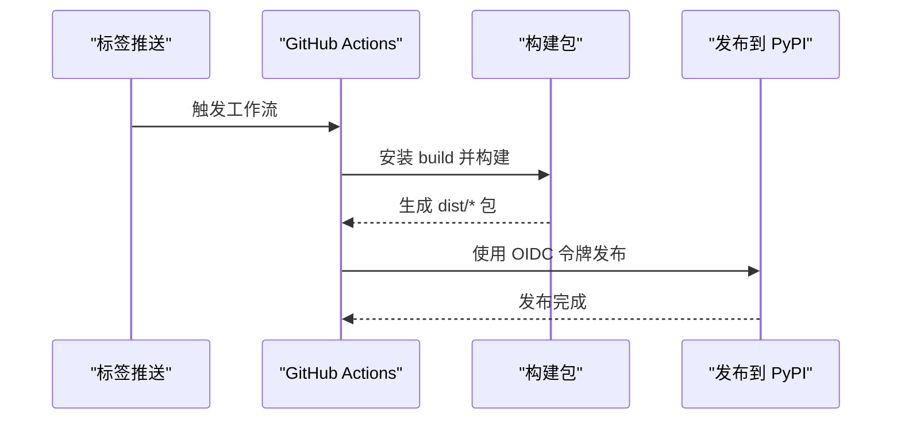
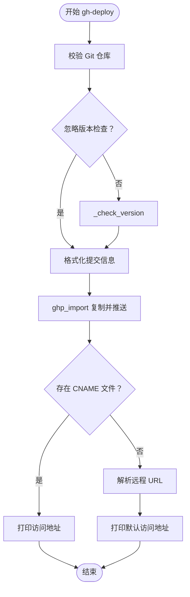
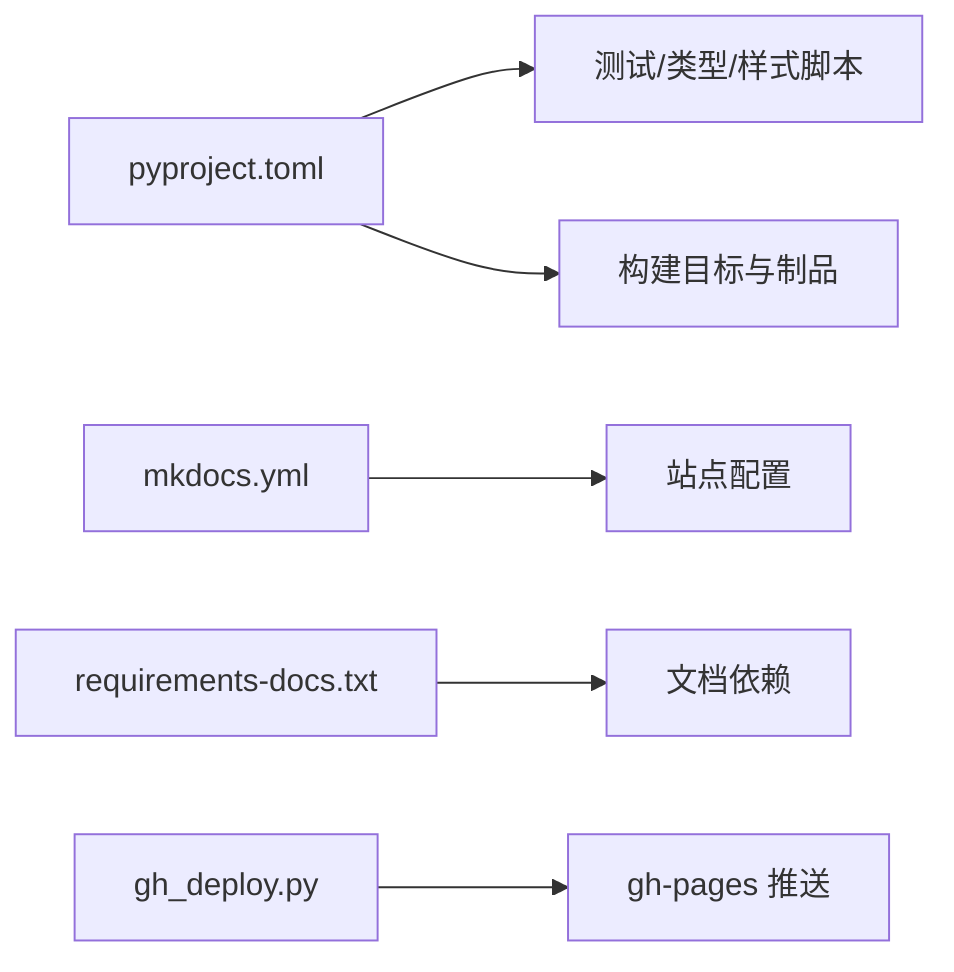

# CI/CD 集成

<cite>
**本文引用的文件**
- [.github/workflows/ci.yml](file://.github/workflows/ci.yml)
- [.github/workflows/deploy-release.yml](file://.github/workflows/deploy-release.yml)
- [.github/workflows/docs.yml](file://.github/workflows/docs.yml)
- [.github/workflows/autofix.yml](file://.github/workflows/autofix.yml)
- [pyproject.toml](file://pyproject.toml)
- [mkdocs.yml](file://mkdocs.yml)
- [requirements/requirements-docs.txt](file://requirements/requirements-docs.txt)
- [mkdocs/commands/gh_deploy.py](file://mkdocs/commands/gh_deploy.py)
- [docs/user-guide/deploying-your-docs.md](file://docs/user-guide/deploying-your-docs.md)
- [README.md](file://README.md)
- [CONTRIBUTING.md](file://CONTRIBUTING.md)
</cite>

## 目录
1. [简介](#简介)
2. [项目结构](#项目结构)
3. [核心组件](#核心组件)
4. [架构总览](#架构总览)
5. [详细组件分析](#详细组件分析)
6. [依赖关系分析](#依赖关系分析)
7. [性能考量](#性能考量)
8. [故障排查指南](#故障排查指南)
9. [结论](#结论)
10. [附录](#附录)

## 简介
本指南面向希望在 MkDocs 项目中落地自动化 CI/CD 的工程团队与个人贡献者，系统梳理了基于 GitHub Actions 的现有工作流（CI、文档构建、自动修复、发布到 PyPI），并给出可直接迁移至其他平台（GitLab CI、Azure DevOps）的配置思路与最佳实践。内容覆盖：
- 构建缓存与依赖安装优化
- 环境变量与 secrets 管理
- 多环境部署策略（开发/测试/生产）
- 条件部署、版本标签与发布管理
- 部署状态通知与回滚机制
- 性能监控与部署日志分析

## 项目结构
围绕 CI/CD 的关键目录与文件如下：
- .github/workflows：GitHub Actions 工作流定义
- pyproject.toml：项目元数据、Hatch 环境与脚本、构建目标
- mkdocs.yml：站点配置（主题、插件、导航等）
- requirements/requirements-docs.txt：文档站点依赖锁定清单
- mkdocs/commands/gh_deploy.py：GitHub Pages 部署命令实现
- docs/user-guide/deploying-your-docs.md：官方部署指南（含 gh-deploy 使用）

图表来源
- [.github/workflows/ci.yml](file://.github/workflows/ci.yml#L1-L105)
- [.github/workflows/deploy-release.yml](file://.github/workflows/deploy-release.yml#L1-L23)
- [.github/workflows/docs.yml](file://.github/workflows/docs.yml#L1-L21)
- [.github/workflows/autofix.yml](file://.github/workflows/autofix.yml#L1-L24)
- [pyproject.toml](file://pyproject.toml#L1-L240)
- [mkdocs.yml](file://mkdocs.yml#L1-L80)
- [requirements/requirements-docs.txt](file://requirements/requirements-docs.txt#L1-L135)
- [mkdocs/commands/gh_deploy.py](file://mkdocs/commands/gh_deploy.py#L1-L170)
- [docs/user-guide/deploying-your-docs.md](file://docs/user-guide/deploying-your-docs.md#L1-L224)

章节来源
- [.github/workflows/ci.yml](file://.github/workflows/ci.yml#L1-L105)
- [.github/workflows/deploy-release.yml](file://.github/workflows/deploy-release.yml#L1-L23)
- [.github/workflows/docs.yml](file://.github/workflows/docs.yml#L1-L21)
- [.github/workflows/autofix.yml](file://.github/workflows/autofix.yml#L1-L24)
- [pyproject.toml](file://pyproject.toml#L1-L240)
- [mkdocs.yml](file://mkdocs.yml#L1-L80)
- [requirements/requirements-docs.txt](file://requirements/requirements-docs.txt#L1-L135)
- [mkdocs/commands/gh_deploy.py](file://mkdocs/commands/gh_deploy.py#L1-L170)
- [docs/user-guide/deploying-your-docs.md](file://docs/user-guide/deploying-your-docs.md#L1-L224)

## 核心组件
- 测试与质量门禁（CI）
  - 跨操作系统与 Python 版本矩阵测试
  - 单元测试与集成测试
  - 代码覆盖率上传（Codecov）
- 文档构建（Docs）
  - 基于锁定依赖的文档站点构建
- 自动修复（Auto-fix）
  - 代码风格自动修复与预提交辅助
- 发布（Deploy-release）
  - 基于标签触发的 PyPI 发布（使用 OIDC 身份令牌）

章节来源
- [.github/workflows/ci.yml](file://.github/workflows/ci.yml#L1-L105)
- [.github/workflows/docs.yml](file://.github/workflows/docs.yml#L1-L21)
- [.github/workflows/autofix.yml](file://.github/workflows/autofix.yml#L1-L24)
- [.github/workflows/deploy-release.yml](file://.github/workflows/deploy-release.yml#L1-L23)

## 架构总览
下图展示了从代码推送/拉取请求到测试、文档构建与发布的整体流程。

图表来源
- [.github/workflows/ci.yml](file://.github/workflows/ci.yml#L1-L105)
- [.github/workflows/docs.yml](file://.github/workflows/docs.yml#L1-L21)
- [.github/workflows/autofix.yml](file://.github/workflows/autofix.yml#L1-L24)
- [.github/workflows/deploy-release.yml](file://.github/workflows/deploy-release.yml#L1-L23)

## 详细组件分析

### 组件一：测试与质量门禁（CI）
- 触发条件：push、pull_request、定时（周日凌晨）
- 测试矩阵：Python 版本（含 PyPy）、操作系统（ubuntu/windows/macOS），并排除部分组合以缩小矩阵规模
- 步骤要点：
  - 检出代码
  - 安装并使用 Hatch 构建与运行测试
  - 执行单元测试与集成测试
  - 成功后上传覆盖率至 Codecov（失败不阻塞）

图表来源
- [.github/workflows/ci.yml](file://.github/workflows/ci.yml#L1-L105)

章节来源
- [.github/workflows/ci.yml](file://.github/workflows/ci.yml#L1-L105)

### 组件二：文档站点构建（Docs）
- 触发条件：push、pull_request、定时
- 步骤要点：
  - 检出代码
  - 安装指定 Python 版本
  - 基于锁定依赖安装文档工具链
  - 使用严格模式构建站点

图表来源
- [.github/workflows/docs.yml](file://.github/workflows/docs.yml#L1-L21)
- [requirements/requirements-docs.txt](file://requirements/requirements-docs.txt#L1-L135)

章节来源
- [.github/workflows/docs.yml](file://.github/workflows/docs.yml#L1-L21)
- [requirements/requirements-docs.txt](file://requirements/requirements-docs.txt#L1-L135)

### 组件三：自动修复（Auto-fix）
- 触发条件：push、pull_request
- 步骤要点：
  - 检出代码
  - 安装 Hatch
  - 自动修复代码风格
  - 若仍有差异则尝试通过预提交轻量工具进行二次修复

图表来源
- [.github/workflows/autofix.yml](file://.github/workflows/autofix.yml#L1-L24)

章节来源
- [.github/workflows/autofix.yml](file://.github/workflows/autofix.yml#L1-L24)

### 组件四：发布到 PyPI（Deploy-release）
- 触发条件：push 标签（任意）
- 权限：允许写入 ID 令牌（OIDC）
- 步骤要点：
  - 检出代码
  - 设置 Python
  - 构建包（wheel/sdist）
  - 发布到 PyPI

图表来源
- [.github/workflows/deploy-release.yml](file://.github/workflows/deploy-release.yml#L1-L23)

章节来源
- [.github/workflows/deploy-release.yml](file://.github/workflows/deploy-release.yml#L1-L23)

### 组件五：GitHub Pages 部署（gh-deploy）
- 命令入口：mkdocs gh-deploy
- 行为概览：
  - 校验当前目录是否为 Git 仓库
  - 可选版本检查（禁止降级部署）
  - 使用 ghp-import 将站点目录复制到远端分支并推送
  - 支持自定义消息、强制推送、历史保留等参数
  - 若存在 CNAME 文件，输出访问地址提示

图表来源
- [mkdocs/commands/gh_deploy.py](file://mkdocs/commands/gh_deploy.py#L1-L170)

章节来源
- [mkdocs/commands/gh_deploy.py](file://mkdocs/commands/gh_deploy.py#L1-L170)
- [docs/user-guide/deploying-your-docs.md](file://docs/user-guide/deploying-your-docs.md#L1-L224)

## 依赖关系分析
- 工具链与脚本
  - 使用 Hatch 管理开发环境、脚本与构建目标
  - 在 pyproject.toml 中定义测试、类型检查、样式检查、文档构建等脚本
- 文档依赖
  - requirements/requirements-docs.txt 提供文档站点所需精确依赖
- 配置文件
  - mkdocs.yml 定义站点主题、插件、导航、版权等
- 部署实现
  - gh-deploy 通过 ghp-import 将构建产物推送到远端分支

图表来源
- [pyproject.toml](file://pyproject.toml#L1-L240)
- [mkdocs.yml](file://mkdocs.yml#L1-L80)
- [requirements/requirements-docs.txt](file://requirements/requirements-docs.txt#L1-L135)
- [mkdocs/commands/gh_deploy.py](file://mkdocs/commands/gh_deploy.py#L1-L170)

章节来源
- [pyproject.toml](file://pyproject.toml#L1-L240)
- [mkdocs.yml](file://mkdocs.yml#L1-L80)
- [requirements/requirements-docs.txt](file://requirements/requirements-docs.txt#L1-L135)
- [mkdocs/commands/gh_deploy.py](file://mkdocs/commands/gh_deploy.py#L1-L170)

## 性能考量
- 测试矩阵裁剪
  - 通过排除特定组合减少作业数量，缩短整体流水线时间
- 依赖安装优化
  - 使用锁定依赖安装文档工具链，避免版本漂移导致的重装与失败
- 缓存策略建议（通用实践）
  - Python 依赖缓存（如 pip/uv 缓存目录）
  - Node.js 依赖缓存（用于 JS/TS 样式检查）
  - 构建产物缓存（针对大型站点可缓存中间产物）
- 日志与报告
  - 上传覆盖率与构建日志，便于定位耗时步骤
- 并行化
  - 将独立任务拆分为多个作业并行执行（如测试、文档、样式检查）

## 故障排查指南
- gh-deploy 报错
  - 确认当前目录为 Git 仓库且已正确配置远程
  - 若存在 CNAME 文件，请确保 DNS 记录已正确配置
  - 版本降级会被阻止（可通过忽略版本选项绕过，但不推荐）
- 覆盖率上传失败
  - 检查覆盖率文件路径与上传参数
  - 确保未在失败时中断上传（可设置失败不阻断）
- PyPI 发布失败
  - 确认标签已推送且工作流权限包含 OIDC 写入
  - 检查构建产物完整性与元数据一致性
- 文档构建失败
  - 使用严格模式定位问题
  - 确认依赖锁定清单与本地一致

章节来源
- [mkdocs/commands/gh_deploy.py](file://mkdocs/commands/gh_deploy.py#L1-L170)
- [.github/workflows/ci.yml](file://.github/workflows/ci.yml#L1-L105)
- [.github/workflows/deploy-release.yml](file://.github/workflows/deploy-release.yml#L1-L23)
- [.github/workflows/docs.yml](file://.github/workflows/docs.yml#L1-L21)

## 结论
本项目已在 GitHub 上建立了完善的 CI/CD 基础设施：跨平台测试与质量门禁、文档站点构建、自动修复与 PyPI 发布。建议在迁移到其他平台时遵循以下原则：
- 保持触发器与作业职责清晰（测试/文档/发布分离）
- 使用锁定依赖与缓存提升稳定性与速度
- 通过标签驱动发布，结合版本检查与回滚策略
- 强化日志与监控，确保可追踪性与可观测性

## 附录

### 多环境部署策略（概念性说明）
- 开发环境：PR 触发最小化验证（快速反馈）
- 测试环境：主干推送触发完整测试与文档构建
- 生产环境：标签触发发布，配合版本号与变更记录
- 回滚：通过版本标签与制品库回退；若为 gh-pages，可基于提交历史回退

### 条件部署与版本标签
- 条件部署：按分支/路径/标签选择性执行作业
- 版本标签：以语义化版本标签作为发布触发器
- 发布管理：PyPI 使用 OIDC 令牌认证，确保最小权限

### 环境变量与 Secrets 管理（通用实践）
- 将敏感信息（PyPI 令牌、远程仓库凭证）置于平台 Secrets
- 使用受控环境变量传递给作业，避免硬编码
- 对不同环境使用不同的密钥与作用域

### 部署状态通知与回滚机制（通用实践）
- 通知：在作业成功/失败时发送通知（Slack、邮件等）
- 回滚：对可回滚的部署（如静态站点）采用版本化分支或标签回退

### 性能监控与日志分析（通用实践）
- 收集构建日志与覆盖率报告
- 识别慢任务并引入缓存与并行化
- 建立告警阈值，关注失败率与构建时长